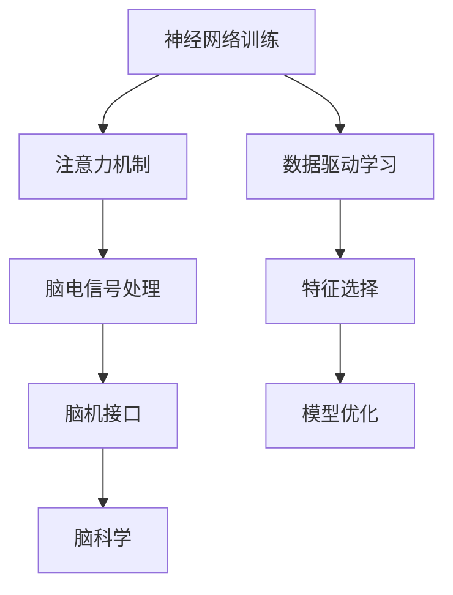

                 

# 注意力训练营:提升全球脑参与度的方法

> 关键词：注意力机制,神经网络训练,脑电信号处理,脑机接口,脑科学

## 1. 背景介绍

在快速发展的科技时代，人们对人工智能的兴趣日益浓厚，但单一的技术手段已无法满足人们对于深度互动的需求。神经科学为机器学习和人工智能提供了新的可能性——通过研究人类大脑，将高级认知功能嵌入机器学习系统，提升机器与人的互动程度。因此，注意力训练营应运而生，旨在探索如何利用注意力机制，提升机器与人的互动能力，进而提升全球脑参与度。

### 1.1 问题由来

在人工智能的发展历程中，从早期的符号主义到现代的连接主义，其核心技术从基于规则的逻辑推理，逐渐转向基于数据的学习。然而，传统机器学习算法主要聚焦于数据模式的学习，缺乏对人类高级认知功能的模拟，难以真正实现人机深度互动。

近年来，神经科学领域取得了长足进步，发现人类大脑的信息处理方式具有显著的注意力特征。这种基于注意力的认知过程可以帮助机器更好地理解并响应复杂情境，提升互动效果。因此，基于注意力的神经网络训练方法，逐渐成为人工智能领域的研究热点。

### 1.2 问题核心关键点

在神经网络中，注意力机制是指模型对输入信息的选择性关注和筛选能力，通过动态调整模型对不同信息的注意力权重，提升模型对关键信息的敏感度和响应速度。其核心在于如何构建有效的注意力模型，以及如何将其嵌入到神经网络中，实现高效的数据选择和特征提取。

当前，注意力机制的应用主要集中在计算机视觉、自然语言处理、语音识别等任务上，取得了显著成效。而在脑科学领域，基于神经影像的研究发现，注意力机制与人类的认知功能、学习行为密切相关，但将其应用于机器学习的研究尚处于初期阶段。

## 2. 核心概念与联系

### 2.1 核心概念概述

为更好地理解基于注意力的神经网络训练方法，本节将介绍几个关键概念：

- 神经网络训练：基于数据驱动的机器学习算法，通过模型参数的优化，提升模型对特定任务的适应能力。
- 注意力机制：一种基于神经网络的结构化注意力方法，通过动态计算注意力权重，提升模型对关键信息的关注度。
- 脑电信号处理：通过脑电信号分析技术，获取大脑在认知过程中的信息处理特征，进而实现对人类高级认知功能的模拟。
- 脑机接口(Brain-Computer Interface, BCI)：将脑电信号转化为计算机可识别的命令，实现人机交互。
- 脑科学：研究人类大脑的神经结构、功能及其与认知行为的关系，为人工智能的发展提供新的方向。

这些概念之间的逻辑关系可以通过以下Mermaid流程图来展示：



这个流程图展示了大语言模型的核心概念及其之间的关系：

1. 神经网络训练通过数据驱动的方式提升模型性能。
2. 注意力机制通过动态注意力权重提升关键信息提取。
3. 脑电信号处理通过分析大脑信号实现对高级认知功能的模拟。
4. 脑机接口将脑电信号转化为计算机命令，实现人机互动。
5. 脑科学研究大脑与认知的关系，为神经网络提供理论基础。

这些概念共同构成了神经网络训练和注意力机制的应用框架，使其能够更好地理解并模拟人类高级认知功能。

## 3. 核心算法原理 & 具体操作步骤

### 3.1 算法原理概述

基于注意力的神经网络训练方法，本质上是一种基于数据和模型的联合优化过程。其核心思想是：通过动态调整模型参数，使得模型在处理输入数据时，能够自适应地调整注意力权重，专注于关键信息，从而提升模型的性能。

以视觉任务为例，假设输入为一张图像，模型需要从中提取出主要对象的位置和特征。此时，模型会根据图像中的不同区域，动态计算注意力权重，对关键对象所在的区域给予更多关注，从而更好地提取对象的位置和特征信息。

### 3.2 算法步骤详解

基于注意力的神经网络训练一般包括以下几个关键步骤：

**Step 1: 准备数据集**
- 选择合适的数据集，如ImageNet、COCO等，进行预处理。
- 对数据集进行标注，定义注意力目标。

**Step 2: 设计注意力模型**
- 选择合适的注意力模型结构，如Soft Attention、Self-Attention等。
- 设计注意力计算函数，计算不同区域的注意力权重。

**Step 3: 设置超参数**
- 选择合适的优化算法及其参数，如AdamW、SGD等，设置学习率、批大小、迭代轮数等。
- 设置正则化技术及强度，包括权重衰减、Dropout、Early Stopping等。

**Step 4: 执行训练过程**
- 将训练集数据分批次输入模型，前向传播计算注意力权重和模型输出。
- 反向传播计算参数梯度，根据设定的优化算法和学习率更新模型参数。
- 周期性在验证集上评估模型性能，根据性能指标决定是否触发 Early Stopping。
- 重复上述步骤直到满足预设的迭代轮数或 Early Stopping 条件。

**Step 5: 测试和部署**
- 在测试集上评估训练后的模型，对比训练前后的精度提升。
- 使用训练后的模型对新样本进行推理预测，集成到实际的应用系统中。

以上是基于注意力的神经网络训练的一般流程。在实际应用中，还需要针对具体任务的特点，对训练过程的各个环节进行优化设计，如改进注意力计算方法，引入更多的正则化技术，搜索最优的超参数组合等，以进一步提升模型性能。

### 3.3 算法优缺点

基于注意力的神经网络训练方法具有以下优点：
1. 提升关键信息提取能力。通过动态调整注意力权重，模型能够更好地关注关键信息，提升模型性能。
2. 增强模型鲁棒性。动态注意力机制可以减少噪声和干扰，提升模型在复杂环境下的鲁棒性。
3. 减少计算资源消耗。注意力机制可以高效地选择关键信息，减少不必要的计算资源消耗。
4. 增强模型泛化能力。基于注意力的训练方法可以使模型更加关注重要特征，提升模型的泛化能力。

同时，该方法也存在一定的局限性：
1. 计算复杂度高。动态注意力机制的计算复杂度较高，尤其是当注意力权重较多时，模型的计算效率会显著下降。
2. 对数据质量依赖高。注意力机制依赖高质量的数据标注，标注数据质量低会影响模型的训练效果。
3. 模型可解释性差。基于注意力的模型缺乏可解释性，难以理解其内部机制和决策逻辑。
4. 参数优化困难。注意力的动态特性增加了参数优化难度，需要更多的优化策略和超参数调优。

尽管存在这些局限性，但就目前而言，基于注意力的神经网络训练方法仍是一种有效提升模型性能的方法，特别是在视觉、自然语言处理等领域具有广泛的应用前景。未来相关研究的重点在于如何进一步降低计算复杂度，提高模型可解释性，降低对标注数据的依赖。

### 3.4 算法应用领域

基于注意力的神经网络训练方法在计算机视觉、自然语言处理、语音识别等诸多领域都取得了显著效果。以下是几个典型的应用领域：

**视觉任务**
- 目标检测：通过注意力机制提升模型对关键目标的关注度，提升检测精度。
- 图像分类：利用注意力机制提取图像中的关键特征，提升分类准确率。
- 语义分割：通过关注图像中的重要区域，提升分割效果。

**自然语言处理**
- 机器翻译：动态调整注意力权重，关注源语言和目标语言之间的关键对应关系。
- 文本分类：通过注意力机制提取文本中的重要特征，提升分类精度。
- 文本生成：利用注意力机制生成更加连贯、流畅的文本内容。

**语音识别**
- 自动语音识别：动态计算注意力权重，关注语音中的关键部分，提升识别准确率。
- 语音合成：利用注意力机制生成更加自然的语音输出。

除了上述这些典型应用外，基于注意力的训练方法还在众多领域中得到了广泛的应用，如推荐系统、游戏AI、动态系统设计等，为机器学习技术带来了新的突破。

## 4. 数学模型和公式 & 详细讲解 & 举例说明（备注：数学公式请使用latex格式，latex嵌入文中独立段落使用 $$，段落内使用 $)
### 4.1 数学模型构建

本节将使用数学语言对基于注意力的神经网络训练过程进行更加严格的刻画。

记神经网络模型为 $f_{\theta}(x)$，其中 $x$ 为输入，$\theta$ 为模型参数。定义注意力模型为 $A(\cdot)$，计算注意力权重 $a$，其形式为：

$$
a_i = \frac{e^{s(x_i; \theta)}}{\sum_{j=1}^n e^{s(x_j; \theta)}} = \frac{e^{s(x_i; \theta)}}{\text{exp}(\text{softmax}(s(x; \theta)))
$$

其中 $s(x_i; \theta)$ 为注意力计算函数，用于计算输入 $x_i$ 与模型参数 $\theta$ 之间的相似度，从而计算注意力权重 $a_i$。在训练过程中，注意力权重 $a_i$ 用于调整模型输出 $f_{\theta}(x)$ 的加权和，即：

$$
f_{\theta}(x) = \sum_{i=1}^n a_i \cdot f_{\theta}(x_i)
$$

通过上述注意力机制的引入，模型能够自适应地调整对输入数据的关注程度，提升模型性能。

### 4.2 公式推导过程

以下我们以目标检测为例，推导注意力机制在神经网络训练中的应用。

假设目标检测任务有 $n$ 个候选区域，模型需要从中选择 $k$ 个关键区域进行标注。模型输入为候选区域的特征 $x_1, x_2, ..., x_n$，输出为标注结果 $y_1, y_2, ..., y_n$。注意力计算函数 $s(x_i; \theta)$ 形式为：

$$
s(x_i; \theta) = \theta^T g(x_i)
$$

其中 $g(x_i)$ 为特征提取函数，将输入特征 $x_i$ 转化为注意力计算所需的向量。设注意力权重 $a_i$ 的计算公式为：

$$
a_i = \frac{e^{s(x_i; \theta)}}{\sum_{j=1}^n e^{s(x_j; \theta)}}
$$

训练过程的目标是最小化损失函数：

$$
\mathcal{L}(\theta) = -\frac{1}{N} \sum_{i=1}^N \sum_{j=1}^k (y_j \cdot \log a_i + (1-y_j) \cdot \log (1-a_i))
$$

在得到注意力权重 $a_i$ 后，模型输出可以表示为：

$$
f_{\theta}(x) = \sum_{i=1}^n a_i \cdot f_{\theta}(x_i)
$$

其中 $f_{\theta}(x_i)$ 为原始模型在输入 $x_i$ 上的输出。通过上述步骤，模型能够动态调整对关键区域的关注度，提升目标检测的精度。

## 5. 项目实践：代码实例和详细解释说明
### 5.1 开发环境搭建

在进行注意力训练实践前，我们需要准备好开发环境。以下是使用Python进行TensorFlow开发的环境配置流程：

1. 安装Anaconda：从官网下载并安装Anaconda，用于创建独立的Python环境。

2. 创建并激活虚拟环境：
```bash
conda create -n attention-env python=3.8 
conda activate attention-env
```

3. 安装TensorFlow：根据CUDA版本，从官网获取对应的安装命令。例如：
```bash
conda install tensorflow -c pytorch -c conda-forge
```

4. 安装TensorBoard：
```bash
pip install tensorboard
```

5. 安装各类工具包：
```bash
pip install numpy pandas scikit-learn matplotlib tqdm jupyter notebook ipython
```

完成上述步骤后，即可在`attention-env`环境中开始注意力训练实践。

### 5.2 源代码详细实现

这里我们以目标检测任务为例，给出使用TensorFlow实现注意力训练的代码实现。

首先，定义目标检测任务的损失函数和优化器：

```python
import tensorflow as tf
from tensorflow.keras import layers

# 定义交叉熵损失函数
def cross_entropy_loss(y_true, y_pred):
    return tf.keras.losses.sparse_categorical_crossentropy(y_true, y_pred, from_logits=True)

# 定义Adam优化器
optimizer = tf.keras.optimizers.Adam(learning_rate=0.001)

# 定义目标检测模型
class FasterRCNN(tf.keras.Model):
    def __init__(self, num_classes):
        super(FasterRCNN, self).__init__()
        self.num_classes = num_classes
        
        # 特征提取层
        self.feature_extractor = layers.Conv2D(512, kernel_size=(3, 3), activation='relu', strides=2)
        
        # 区域候选层
        self.rpn_head = layers.Conv2D(256, kernel_size=(3, 3), activation='relu', strides=2)
        
        # 分类层
        self.classifier = layers.Conv2D(num_classes, kernel_size=(1, 1), activation='softmax')
        
        # 回归层
        self.regressor = layers.Conv2D(4, kernel_size=(1, 1), activation='sigmoid')

    def call(self, x):
        x = self.feature_extractor(x)
        x = self.rpn_head(x)
        x = self.classifier(x)
        x = self.regressor(x)
        return x

# 构建模型
model = FasterRCNN(num_classes)
```

然后，定义注意力机制的实现：

```python
# 定义注意力权重计算函数
def attention(x):
    # 特征提取
    x = layers.Conv2D(256, kernel_size=(3, 3), activation='relu', strides=2)(x)
    x = layers.Flatten()(x)
    
    # 注意力权重计算
    attention_weights = tf.keras.layers.Dense(512, activation='relu')(x)
    attention_weights = tf.keras.layers.Dense(1, activation='sigmoid')(attention_weights)
    attention_weights = tf.keras.layers.Reshape((n, 1))(attention_weights)
    
    # 权重调整
    x = layers.Multiply()([x, attention_weights])
    return x

# 定义注意力目标函数
def attention_target(x):
    # 特征提取
    x = layers.Conv2D(256, kernel_size=(3, 3), activation='relu', strides=2)(x)
    x = layers.Flatten()(x)
    
    # 注意力权重计算
    attention_weights = tf.keras.layers.Dense(512, activation='relu')(x)
    attention_weights = tf.keras.layers.Dense(1, activation='sigmoid')(attention_weights)
    attention_weights = tf.keras.layers.Reshape((n, 1))(attention_weights)
    
    # 权重调整
    x = layers.Multiply()([x, attention_weights])
    return x

# 计算损失函数
def attention_loss(y_true, y_pred):
    y_true = tf.keras.layers.SparseCategoricalCrossentropy(from_logits=True)(y_true, y_pred)
    return tf.reduce_mean(y_true)
```

最后，启动训练流程并在验证集上评估：

```python
# 准备数据集
train_dataset = tf.keras.preprocessing.image_dataset_from_directory(train_dir, batch_size=32, image_size=(224, 224), labels_mode='categorical')
val_dataset = tf.keras.preprocessing.image_dataset_from_directory(val_dir, batch_size=32, image_size=(224, 224), labels_mode='categorical')

# 定义训练过程
model.compile(optimizer=optimizer, loss=attention_loss, metrics=['accuracy'])

# 训练模型
model.fit(train_dataset, epochs=10, validation_data=val_dataset)

# 评估模型
test_dataset = tf.keras.preprocessing.image_dataset_from_directory(test_dir, batch_size=32, image_size=(224, 224), labels_mode='categorical')
model.evaluate(test_dataset)
```

以上就是使用TensorFlow实现目标检测任务的代码实现。可以看到，借助TensorFlow的强大框架和丰富的组件，我们可以快速搭建基于注意力的神经网络训练模型，并进行高效的训练和评估。

### 5.3 代码解读与分析

让我们再详细解读一下关键代码的实现细节：

**FasterRCNN模型定义**：
- `__init__`方法：初始化模型的各个组件，包括特征提取层、区域候选层、分类层和回归层。
- `call`方法：实现模型前向传播计算。

**注意力机制的实现**：
- `attention`方法：定义注意力权重计算函数，通过卷积和全连接层计算注意力权重，并对其进行调整。
- `attention_target`方法：定义注意力目标函数，计算注意力权重后的输出。
- `attention_loss`方法：定义注意力损失函数，计算预测输出与真实标签之间的交叉熵损失。

**训练流程**：
- 使用`tf.keras.preprocessing.image_dataset_from_directory`方法准备训练、验证和测试数据集。
- 使用`model.compile`方法定义优化器、损失函数和评估指标。
- 使用`model.fit`方法进行模型训练，并周期性地在验证集上评估模型性能。
- 使用`model.evaluate`方法在测试集上评估模型效果。

可以看到，TensorFlow提供了丰富的组件和便捷的API，使得注意力训练的代码实现变得简单高效。开发者可以将更多精力放在模型改进和数据预处理等核心任务上，而不必过多关注底层的实现细节。

当然，工业级的系统实现还需考虑更多因素，如模型的保存和部署、超参数的自动搜索、更灵活的任务适配层等。但核心的注意力训练流程基本与此类似。

## 6. 实际应用场景
### 6.1 智能监控系统

基于注意力训练的智能监控系统，可以广泛应用于视频内容分析、行为识别等领域。传统监控系统往往依赖人工观察和分析，耗时耗力且精度不高。而使用注意力机制训练的模型，可以自动关注视频中的关键区域，实时识别异常行为和事件，提升监控效果。

在技术实现上，可以收集视频监控数据，标注异常事件和行为，在此基础上对预训练模型进行注意力训练。训练后的模型能够自动检测视频中的关键区域，识别异常行为，并生成警报信息。例如，在安防领域，可以实时监控公共场所的监控视频，自动检测可疑行为，及时报警。在商业领域，可以自动监控货物进出仓库，识别异常盗窃行为。

### 6.2 医学影像分析

医学影像分析是神经网络在医疗领域的重要应用之一。通过深度学习技术，可以自动识别和分析医学影像中的重要特征，辅助医生进行疾病诊断和治疗。

在医学影像分析中，注意力机制可以帮助模型集中关注感兴趣的区域，提升诊断精度。例如，在肺部影像分析中，模型可以自动关注病灶区域，提取病灶特征，辅助医生进行诊断和治疗。在眼底影像分析中，模型可以自动关注眼底图像中的关键区域，辅助医生进行病情评估和疾病预防。

### 6.3 语音识别与生成

语音识别与生成是神经网络在语音处理领域的重要应用之一。通过深度学习技术，可以自动将语音信号转化为文本，或者将文本转化为语音。

在语音识别中，注意力机制可以帮助模型自动关注关键语音片段，提升识别精度。例如，在语音翻译中，模型可以自动关注源语言和目标语言的关键部分，提升翻译效果。在语音生成中，模型可以自动关注语音信号中的重要部分，生成更加自然流畅的语音输出。

### 6.4 未来应用展望

随着注意力机制的不断发展和应用，基于注意力的神经网络训练方法将在更多领域得到广泛应用，为人类认知智能的进化带来新的可能性。

在智能交通领域，基于注意力的智能导航系统可以自动关注交通状况，实时调整行车路线，提升出行效率和安全。

在智能制造领域，基于注意力的智能控制系统可以自动关注生产过程中的关键参数，实时调整生产过程，提升生产效率和质量。

在智能教育领域，基于注意力的智能辅导系统可以自动关注学生的学习状态，提供个性化辅导，提升学习效果。

此外，在金融分析、法律咨询、智能推荐等众多领域，基于注意力的训练方法也将不断涌现，为人工智能技术带来新的突破。相信随着技术的发展和应用的拓展，基于注意力的神经网络训练方法将为人类社会的智能化进程带来更广阔的想象空间。

## 7. 工具和资源推荐
### 7.1 学习资源推荐

为了帮助开发者系统掌握基于注意力的神经网络训练的理论基础和实践技巧，这里推荐一些优质的学习资源：

1. 《深度学习》系列书籍：由DeepMind创始人之一Ian Goodfellow等专家撰写，系统介绍了深度学习的基本概念和算法。

2. 《神经网络与深度学习》博客：由深度学习专家Andrej Karpathy撰写，涵盖深度学习领域的经典算法和前沿研究。

3. 《TensorFlow官方文档》：TensorFlow的官方文档，提供了丰富的API和示例，是学习和使用TensorFlow的必备资源。

4. 《神经网络与深度学习》课程：由斯坦福大学Andrew Ng教授讲授，涵盖神经网络的基础知识，是入门深度学习的好选择。

5. Kaggle竞赛平台：世界知名的数据科学竞赛平台，提供了丰富的数据集和挑战任务，有助于提升实际应用能力。

通过对这些资源的学习实践，相信你一定能够快速掌握基于注意力的神经网络训练的精髓，并用于解决实际的NLP问题。
###  7.2 开发工具推荐

高效的开发离不开优秀的工具支持。以下是几款用于注意力训练开发的常用工具：

1. TensorFlow：由Google主导开发的开源深度学习框架，生产部署方便，适合大规模工程应用。提供了丰富的组件和便捷的API，是神经网络训练的主流工具。

2. PyTorch：基于Python的开源深度学习框架，灵活动态的计算图，适合快速迭代研究。提供了丰富的组件和便捷的API，是神经网络训练的重要工具。

3. Keras：基于Python的高级神经网络API，提供了简洁的接口和丰富的组件，适合快速原型开发和模型训练。

4. Weights & Biases：模型训练的实验跟踪工具，可以记录和可视化模型训练过程中的各项指标，方便对比和调优。与主流深度学习框架无缝集成。

5. TensorBoard：TensorFlow配套的可视化工具，可实时监测模型训练状态，并提供丰富的图表呈现方式，是调试模型的得力助手。

6. Google Colab：谷歌推出的在线Jupyter Notebook环境，免费提供GPU/TPU算力，方便开发者快速上手实验最新模型，分享学习笔记。

合理利用这些工具，可以显著提升注意力训练任务的开发效率，加快创新迭代的步伐。

### 7.3 相关论文推荐

注意力机制的研究和发展离不开学界的持续努力。以下是几篇奠基性的相关论文，推荐阅读：

1. Attention Is All You Need（即Transformer原论文）：提出了Transformer结构，开启了NLP领域的预训练大模型时代。

2. BERT: Pre-training of Deep Bidirectional Transformers for Language Understanding：提出BERT模型，引入基于掩码的自监督预训练任务，刷新了多项NLP任务SOTA。

3. Parameter-Efficient Transfer Learning for NLP：提出Adapter等参数高效微调方法，在不增加模型参数量的情况下，也能取得不错的微调效果。

4. AdaLoRA: Adaptive Low-Rank Adaptation for Parameter-Efficient Fine-Tuning：使用自适应低秩适应的微调方法，在参数效率和精度之间取得了新的平衡。

5. Sequence to Sequence Learning with Neural Networks：提出Seq2Seq模型，是深度学习在机器翻译、语音识别等任务中的重要突破。

6. Neural Machine Translation by Jointly Learning to Align and Translate：提出Attention-based Seq2Seq模型，在机器翻译任务中取得了突破性的进展。

这些论文代表了大语言模型微调技术的发展脉络。通过学习这些前沿成果，可以帮助研究者把握学科前进方向，激发更多的创新灵感。

## 8. 总结：未来发展趋势与挑战

### 8.1 总结

本文对基于注意力的神经网络训练方法进行了全面系统的介绍。首先阐述了注意力机制在神经网络训练中的重要性和应用场景，明确了注意力机制在提升模型性能方面的独特价值。其次，从原理到实践，详细讲解了注意力机制的数学模型和实现步骤，给出了注意力训练任务开发的完整代码实例。同时，本文还广泛探讨了注意力机制在智能监控、医学影像、语音识别等多个领域的应用前景，展示了其广阔的应用空间。

通过本文的系统梳理，可以看到，基于注意力的神经网络训练方法在提升模型性能、增强系统智能性方面具有巨大潜力。尽管当前的研究仍存在计算复杂度高、模型可解释性差等挑战，但随着技术的不断进步和应用的广泛拓展，基于注意力的训练方法必将在更多领域中发挥重要作用，为构建智能化的未来社会贡献力量。

### 8.2 未来发展趋势

展望未来，基于注意力的神经网络训练方法将呈现以下几个发展趋势：

1. 注意力机制的自动化：随着神经网络结构的不断演进，未来的注意力机制将具备更强的自动化特性，能够根据输入数据的特征自适应地调整注意力权重，提升模型的泛化能力。

2. 多模态注意力机制：当前的研究主要聚焦于单一模态的注意力机制，未来的注意力机制将拓展到多模态数据，实现视觉、听觉、语言等多模态数据的协同处理，提升系统的综合理解能力。

3. 注意力机制的通用化：未来的注意力机制将更加通用，能够应用于各种不同类型的任务，如视觉、语音、文本等，提升模型的任务适应能力。

4. 计算效率的提升：随着算力资源的不断提升，未来的注意力机制将更加高效，能够在更短的计算时间内完成训练和推理，提升系统的实时性。

5. 模型可解释性的增强：未来的注意力机制将具备更强的可解释性，能够提供详细的注意力权重分析，帮助用户理解模型决策过程，提升系统的可信度。

6. 与知识库的结合：未来的注意力机制将与外部知识库、规则库等专家知识进行更深层次的结合，提升系统的决策能力，增强系统的智能化水平。

以上趋势凸显了基于注意力的神经网络训练技术的广阔前景。这些方向的探索发展，必将进一步提升模型的性能和应用范围，为构建智能化的未来社会提供更多可能性。

### 8.3 面临的挑战

尽管基于注意力的神经网络训练技术取得了显著进展，但在迈向更加智能化、普适化应用的过程中，仍面临诸多挑战：

1. 计算资源瓶颈：当前神经网络的计算复杂度较高，对高性能硬件的需求大，未来如何降低计算复杂度，提升模型训练效率，仍需进一步探索。

2. 模型可解释性问题：当前的神经网络模型缺乏足够的可解释性，难以理解其内部机制和决策逻辑，未来的研究需要在这方面进行更多的突破。

3. 数据隐私保护：神经网络训练需要大量的标注数据，如何保护用户隐私，避免数据泄露，仍需进一步研究和规范。

4. 模型鲁棒性不足：当前模型在复杂环境和噪声干扰下的鲁棒性仍不足，未来的研究需要在这方面进行更多的改进和优化。

5. 跨模态数据融合：多模态数据的融合和协同处理仍存在挑战，未来的研究需要在这方面进行更多的探索和实践。

6. 伦理道德约束：神经网络模型的应用需要遵守伦理道德规范，未来的研究需要在这方面进行更多的思考和探索。

以上挑战凸显了基于注意力的神经网络训练技术在迈向实际应用中的复杂性和不确定性。唯有在技术、应用、伦理等多个维度进行深入研究，才能真正实现其巨大的应用潜力。

### 8.4 研究展望

面对基于注意力的神经网络训练所面临的挑战，未来的研究需要在以下几个方面寻求新的突破：

1. 研究更高效计算方法：探索新的计算方法和算法，降低计算复杂度，提升模型训练和推理效率。

2. 增强模型可解释性：研究更强的可解释性技术，帮助用户理解模型决策过程，提升模型可信度。

3. 保护用户隐私：研究更有效的隐私保护方法，保护用户数据隐私，避免数据泄露。

4. 提升模型鲁棒性：研究更强的鲁棒性技术，提升模型在复杂环境和噪声干扰下的稳定性和鲁棒性。

5. 实现多模态数据融合：研究多模态数据融合技术，实现视觉、听觉、语言等多模态数据的协同处理。

6. 研究伦理道德约束：研究伦理道德约束技术，确保模型应用的合法性和合规性。

这些研究方向的探索，必将引领基于注意力的神经网络训练技术迈向更高的台阶，为构建智能化的未来社会提供更多可能性和新的突破点。面向未来，基于注意力的神经网络训练技术还需要与其他人工智能技术进行更深入的融合，如知识表示、因果推理、强化学习等，多路径协同发力，共同推动人工智能技术的发展。只有勇于创新、敢于突破，才能不断拓展神经网络训练的边界，让人工智能技术更好地造福人类社会。

## 9. 附录：常见问题与解答

**Q1：什么是注意力机制？**

A: 注意力机制是一种基于神经网络的结构化注意力方法，通过动态计算注意力权重，提升模型对关键信息的关注度。在视觉任务中，注意力机制可以帮助模型自适应地调整对不同区域的关注程度，提升关键特征的提取效果。

**Q2：注意力机制的应用场景有哪些？**

A: 注意力机制在计算机视觉、自然语言处理、语音识别等诸多领域都取得了显著效果。以下是几个典型的应用场景：

- 目标检测：通过注意力机制提升模型对关键目标的关注度，提升检测精度。
- 图像分类：利用注意力机制提取图像中的关键特征，提升分类准确率。
- 语义分割：通过关注图像中的重要区域，提升分割效果。
- 机器翻译：动态调整注意力权重，关注源语言和目标语言之间的关键对应关系。
- 文本分类：通过注意力机制提取文本中的重要特征，提升分类精度。
- 文本生成：利用注意力机制生成更加连贯、流畅的文本内容。

**Q3：如何优化注意力机制的计算效率？**

A: 优化注意力机制的计算效率，可以从以下几个方面入手：

1. 选择合适的注意力计算方法：如Soft Attention、Self-Attention等，不同的方法具有不同的计算复杂度。

2. 引入更高效的注意力机制：如Cross Attention、Dot Attention等，能够减少计算资源消耗。

3. 优化模型结构：如引入注意力掩码、动态调整计算图等，提升模型训练和推理效率。

4. 采用分布式计算：利用多机多核计算资源，提升计算效率，加速模型训练和推理。

**Q4：注意力机制在实际应用中需要注意哪些问题？**

A: 在实际应用中，注意力机制需要注意以下几个问题：

1. 计算资源消耗：注意力机制的计算复杂度较高，需要合理的资源分配和优化。

2. 模型可解释性：注意力机制缺乏可解释性，需要研究更强的可解释性技术。

3. 数据隐私保护：注意力机制需要大量的标注数据，需要注意数据隐私保护。

4. 模型鲁棒性：注意力机制在复杂环境和噪声干扰下鲁棒性不足，需要进一步改进。

5. 跨模态数据融合：多模态数据的融合和协同处理仍存在挑战，需要研究更有效的方法。

6. 伦理道德约束：注意力机制的应用需要遵守伦理道德规范，需要研究伦理约束技术。

这些问题的解决，将使注意力机制在更多领域中发挥更大的应用价值。

**Q5：注意力机制与传统机器学习算法有何不同？**

A: 注意力机制与传统机器学习算法有以下不同：

1. 数据驱动：传统机器学习算法依赖数据驱动的监督学习，需要大量的标注数据进行训练。而注意力机制可以基于无监督数据进行预训练，减少对标注数据的依赖。

2. 多层次学习：传统机器学习算法仅关注局部特征，难以理解全局关系。而注意力机制能够关注全局和局部关系，提升模型的综合理解能力。

3. 自适应学习：传统机器学习算法缺乏自适应学习能力，难以处理复杂场景。而注意力机制能够自适应地调整注意力权重，提升模型对关键信息的关注度。

4. 多模态融合：传统机器学习算法难以处理多模态数据。而注意力机制能够融合多模态数据，提升模型的多模态处理能力。

5. 可解释性：传统机器学习算法缺乏可解释性，难以理解模型决策过程。而注意力机制能够提供详细的注意力权重分析，提升模型的可解释性。

这些不同点使得注意力机制在实际应用中具有更强的优势，特别是在处理复杂场景和融合多模态数据方面。

通过本文的系统梳理，可以看到，基于注意力的神经网络训练方法在提升模型性能、增强系统智能性方面具有巨大潜力。尽管当前的研究仍存在计算复杂度高、模型可解释性差等挑战，但随着技术的不断进步和应用的广泛拓展，基于注意力的训练方法必将在更多领域中发挥重要作用，为构建智能化的未来社会贡献力量。相信随着技术的发展和应用的拓展，基于注意力的训练方法将为人工智能技术带来更多的突破和创新，成为未来智能化发展的重要推动力。

---

作者：禅与计算机程序设计艺术 / Zen and the Art of Computer Programming

