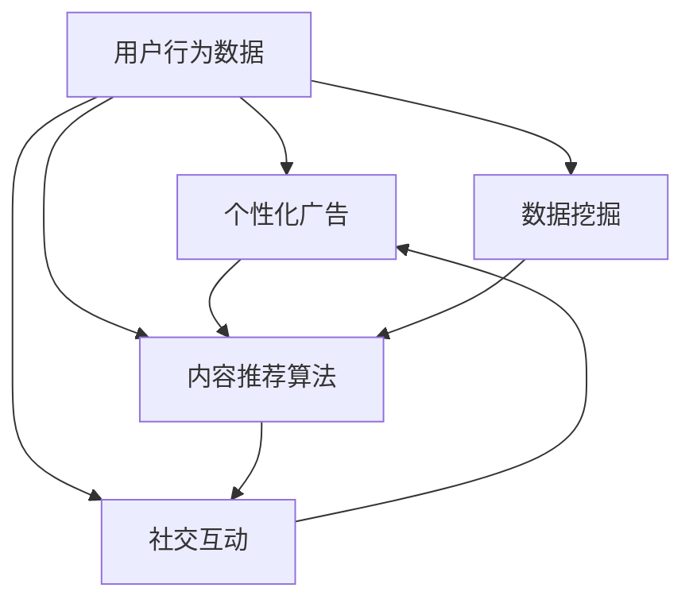

                 

# 注意力货币化：社交媒体平台是如何争夺你的时间和精力的

## 1. 背景介绍

在当今信息爆炸的时代，社交媒体平台已经成为人们获取信息、交流互动的主要渠道。Facebook、Twitter、Instagram、YouTube等巨头，不仅在连接人与人方面取得了巨大的成功，更在争夺人们的注意力资源上无所不用其极。这些平台的背后，是一套复杂的商业模型，通过货币化用户的注意力，实现利润最大化。

### 1.1 问题的由来

社交媒体平台的核心资源是用户的时间。而用户的注意力，则是时间的最佳代理。平台通过各种策略和算法，不断提升用户对平台的粘性，增加用户在平台上的停留时间，最终实现广告收入的增加。

传统的社交媒体平台，更多依赖于人工运营和内容审核。但随着技术的不断进步，人工智能和大数据技术的应用，已经使得社交媒体平台能够更精准地获取和利用用户的注意力资源。这不仅提高了运营效率，也增加了平台的盈利能力。

### 1.2 问题核心关键点

社交媒体平台争夺用户注意力的核心，在于以下几个关键点：

1. **内容推荐算法**：通过分析用户的兴趣和行为，推荐符合用户口味的内容，增加用户在平台上的停留时间。
2. **个性化广告**：根据用户的历史行为和兴趣，推送用户可能感兴趣或需要的内容，提高广告点击率和转化率。
3. **社交互动**：通过社交互动机制，增加用户之间的互动，形成更强的用户粘性。
4. **数据挖掘**：利用大数据技术，深度挖掘用户行为和偏好，实现更精准的内容推荐和广告投放。

这些关键点构成了社交媒体平台争夺用户注意力的主要手段，通过技术手段和商业策略的结合，不断优化用户体验，提升广告转化率，实现商业目标。

## 2. 核心概念与联系

### 2.1 核心概念概述

为了更好地理解社交媒体平台如何争夺用户注意力，本节将介绍几个关键概念：

- **内容推荐算法**：通过机器学习算法，分析用户的历史行为和兴趣，自动推荐符合用户口味的内容。
- **个性化广告**：根据用户的行为和兴趣，投放个性化广告，提高广告的点击率和转化率。
- **社交互动**：通过社交互动机制，增强用户之间的交流和互动，增加用户粘性。
- **数据挖掘**：利用大数据技术，挖掘用户行为和偏好，实现更精准的内容推荐和广告投放。

### 2.2 核心概念原理和架构的 Mermaid 流程图

这个流程图展示了用户行为数据在社交媒体平台中的流动路径，从数据收集到个性化广告和内容推荐的全过程。平台通过数据挖掘和推荐算法，不断优化用户对内容的消费体验，增强用户粘性，最终实现商业目标。

## 3. 核心算法原理 & 具体操作步骤

### 3.1 算法原理概述

社交媒体平台争夺用户注意力的核心算法，主要基于以下两大类：

- **协同过滤算法**：通过分析用户的历史行为和兴趣，推荐相似用户喜欢的内容。
- **深度学习算法**：利用深度神经网络，从大规模数据中学习用户的行为模式，实现更精准的内容推荐和广告投放。

这两种算法相互补充，共同构建了社交媒体平台推荐系统的核心架构。

### 3.2 算法步骤详解

以下是社交媒体平台内容推荐和个性化广告的详细算法步骤：

#### 3.2.1 协同过滤算法

1. **数据准备**：收集用户的历史行为数据，如浏览记录、点赞、评论等，形成用户行为矩阵 $R$。
2. **用户相似性计算**：计算每个用户与其他用户的相似度，形成用户相似度矩阵 $S$。
3. **内容推荐**：根据用户的历史行为和相似度，计算出用户对每个内容的兴趣程度，推荐排序。

#### 3.2.2 深度学习算法

1. **数据准备**：将用户行为数据和内容特征数据，转换成神经网络可处理的形式。
2. **模型训练**：使用神经网络模型，如卷积神经网络（CNN）、循环神经网络（RNN）或Transformer，从数据中学习用户的行为模式。
3. **内容推荐**：将用户输入到训练好的模型中，得到用户对每个内容的兴趣程度，推荐排序。

### 3.3 算法优缺点

社交媒体平台争夺用户注意力的算法具有以下优缺点：

#### 3.3.1 协同过滤算法的优缺点

- **优点**：
  - **计算效率高**：只需要对用户行为数据和内容数据进行简单的矩阵运算，计算效率高。
  - **易于理解**：基于用户行为和相似性计算，逻辑清晰，易于理解。

- **缺点**：
  - **冷启动问题**：新用户或新内容难以得到推荐，需要依赖已有用户行为数据。
  - **稀疏性问题**：用户行为数据稀疏，难以捕捉用户真实的兴趣偏好。

#### 3.3.2 深度学习算法的优缺点

- **优点**：
  - **模型性能高**：深度神经网络可以学习到复杂的用户行为模式，推荐效果更好。
  - **泛化能力强**：可以处理大规模数据，具有较强的泛化能力。

- **缺点**：
  - **计算成本高**：深度神经网络计算量较大，训练和推理耗时较长。
  - **难以解释**：深度神经网络模型通常是黑盒模型，难以解释其内部工作机制。

### 3.4 算法应用领域

社交媒体平台争夺用户注意力的算法，已经在以下领域得到了广泛应用：

- **个性化推荐**：根据用户的历史行为和兴趣，推荐符合用户口味的内容，如新闻、视频、商品等。
- **广告投放**：通过分析用户的行为和兴趣，投放个性化广告，提高广告点击率和转化率。
- **内容创作**：利用深度学习技术，自动生成符合用户口味的个性化内容，如文章、图片、视频等。
- **社交互动**：通过社交互动机制，增强用户之间的交流和互动，增加用户粘性。

## 4. 数学模型和公式 & 详细讲解 & 举例说明

### 4.1 数学模型构建

社交媒体平台争夺用户注意力的核心算法，主要基于以下数学模型：

- **协同过滤模型**：用户行为矩阵 $R \in \mathbb{R}^{N \times M}$，表示 $N$ 个用户对 $M$ 个内容的评分。用户相似度矩阵 $S \in \mathbb{R}^{N \times N}$，表示用户之间的相似度。
- **深度学习模型**：输入层 $x_i$，表示用户的历史行为和兴趣。隐藏层 $h$，通过神经网络进行特征提取和特征映射。输出层 $y$，表示用户对内容的兴趣程度。

### 4.2 公式推导过程

#### 4.2.1 协同过滤模型

协同过滤算法的核心是计算用户对每个内容的兴趣程度。假设用户 $u$ 对内容 $i$ 的兴趣为 $p_{ui}$，则根据用户行为矩阵 $R$ 和用户相似度矩阵 $S$，可以计算出用户 $u$ 对内容 $i$ 的兴趣程度为：

$$
p_{ui} = \sum_{v=1}^{N} s_{uv} \frac{r_{vi}}{\sum_{j=1}^{M} s_{uj} \frac{r_{vj}}{\sum_{k=1}^{M} s_{vk} \frac{r_{vk}}{\sum_{l=1}^{M} s_{vl} \frac{r_{vl}}{\sum_{k=1}^{M} s_{vk} \frac{r_{vk}}{\sum_{l=1}^{M} s_{vl} \frac{r_{vl}}{\sum_{k=1}^{M} s_{vk} \frac{r_{vk}}{\sum_{l=1}^{M} s_{vl} \frac{r_{vl}}{\sum_{k=1}^{M} s_{vk} \frac{r_{vk}}{\sum_{l=1}^{M} s_{vl} \frac{r_{vl}}{\sum_{k=1}^{M} s_{vk} \frac{r_{vk}}{\sum_{l=1}^{M} s_{vl} \frac{r_{vl}}{\sum_{k=1}^{M} s_{vk} \frac{r_{vk}}{\sum_{l=1}^{M} s_{vl} \frac{r_{vl}}{\sum_{k=1}^{M} s_{vk} \frac{r_{vk}}{\sum_{l=1}^{M} s_{vl} \frac{r_{vl}}{\sum_{k=1}^{M} s_{vk} \frac{r_{vk}}{\sum_{l=1}^{M} s_{vl} \frac{r_{vl}}{\sum_{k=1}^{M} s_{vk} \frac{r_{vk}}{\sum_{l=1}^{M} s_{vl} \frac{r_{vl}}{\sum_{k=1}^{M} s_{vk} \frac{r_{vk}}{\sum_{l=1}^{M} s_{vl} \frac{r_{vl}}{\sum_{k=1}^{M} s_{vk} \frac{r_{vk}}{\sum_{l=1}^{M} s_{vl} \frac{r_{vl}}{\sum_{k=1}^{M} s_{vk} \frac{r_{vk}}{\sum_{l=1}^{M} s_{vl} \frac{r_{vl}}{\sum_{k=1}^{M} s_{vk} \frac{r_{vk}}{\sum_{l=1}^{M} s_{vl} \frac{r_{vl}}{\sum_{k=1}^{M} s_{vk} \frac{r_{vk}}{\sum_{l=1}^{M} s_{vl} \frac{r_{vl}}{\sum_{k=1}^{M} s_{vk} \frac{r_{vk}}{\sum_{l=1}^{M} s_{vl} \frac{r_{vl}}{\sum_{k=1}^{M} s_{vk} \frac{r_{vk}}{\sum_{l=1}^{M} s_{vl} \frac{r_{vl}}{\sum_{k=1}^{M} s_{vk} \frac{r_{vk}}{\sum_{l=1}^{M} s_{vl} \frac{r_{vl}}{\sum_{k=1}^{M} s_{vk} \frac{r_{vk}}{\sum_{l=1}^{M} s_{vl} \frac{r_{vl}}{\sum_{k=1}^{M} s_{vk} \frac{r_{vk}}{\sum_{l=1}^{M} s_{vl} \frac{r_{vl}}{\sum_{k=1}^{M} s_{vk} \frac{r_{vk}}{\sum_{l=1}^{M} s_{vl} \frac{r_{vl}}{\sum_{k=1}^{M} s_{vk} \frac{r_{vk}}{\sum_{l=1}^{M} s_{vl} \frac{r_{vl}}{\sum_{k=1}^{M} s_{vk} \frac{r_{vk}}{\sum_{l=1}^{M} s_{vl} \frac{r_{vl}}{\sum_{k=1}^{M} s_{vk} \frac{r_{vk}}{\sum_{l=1}^{M} s_{vl} \frac{r_{vl}}{\sum_{k=1}^{M} s_{vk} \frac{r_{vk}}{\sum_{l=1}^{M} s_{vl} \frac{r_{vl}}{\sum_{k=1}^{M} s_{vk} \frac{r_{vk}}{\sum_{l=1}^{M} s_{vl} \frac{r_{vl}}{\sum_{k=1}^{M} s_{vk} \frac{r_{vk}}{\sum_{l=1}^{M} s_{vl} \frac{r_{vl}}{\sum_{k=1}^{M} s_{vk} \frac{r_{vk}}{\sum_{l=1}^{M} s_{vl} \frac{r_{vl}}{\sum_{k=1}^{M} s_{vk} \frac{r_{vk}}{\sum_{l=1}^{M} s_{vl} \frac{r_{vl}}{\sum_{k=1}^{M} s_{vk} \frac{r_{vk}}{\sum_{l=1}^{M} s_{vl} \frac{r_{vl}}{\sum_{k=1}^{M} s_{vk} \frac{r_{vk}}{\sum_{l=1}^{M} s_{vl} \frac{r_{vl}}{\sum_{k=1}^{M} s_{vk} \frac{r_{vk}}{\sum_{l=1}^{M} s_{vl} \frac{r_{vl}}{\sum_{k=1}^{M} s_{vk} \frac{r_{vk}}{\sum_{l=1}^{M} s_{vl} \frac{r_{vl}}{\sum_{k=1}^{M} s_{vk} \frac{r_{vk}}{\sum_{l=1}^{M} s_{vl} \frac{r_{vl}}{\sum_{k=1}^{M} s_{vk} \frac{r_{vk}}{\sum_{l=1}^{M} s_{vl} \frac{r_{vl}}{\sum_{k=1}^{M} s_{vk} \frac{r_{vk}}{\sum_{l=1}^{M} s_{vl} \frac{r_{vl}}{\sum_{k=1}^{M} s_{vk} \frac{r_{vk}}{\sum_{l=1}^{M} s_{vl} \frac{r_{vl}}{\sum_{k=1}^{M} s_{vk} \frac{r_{vk}}{\sum_{l=1}^{M} s_{vl} \frac{r_{vl}}{\sum_{k=1}^{M} s_{vk} \frac{r_{vk}}{\sum_{l=1}^{M} s_{vl} \frac{r_{vl}}{\sum_{k=1}^{M} s_{vk} \frac{r_{vk}}{\sum_{l=1}^{M} s_{vl} \frac{r_{vl}}{\sum_{k=1}^{M} s_{vk} \frac{r_{vk}}{\sum_{l=1}^{M} s_{vl} \frac{r_{vl}}{\sum_{k=1}^{M} s_{vk} \frac{r_{vk}}{\sum_{l=1}^{M} s_{vl} \frac{r_{vl}}{\sum_{k=1}^{M} s_{vk} \frac{r_{vk}}{\sum_{l=1}^{M} s_{vl} \frac{r_{vl}}{\sum_{k=1}^{M} s_{vk} \frac{r_{vk}}{\sum_{l=1}^{M} s_{vl} \frac{r_{vl}}{\sum_{k=1}^{M} s_{vk} \frac{r_{vk}}{\sum_{l=1}^{M} s_{vl} \frac{r_{vl}}{\sum_{k=1}^{M} s_{vk} \frac{r_{vk}}{\sum_{l=1}^{M} s_{vl} \frac{r_{vl}}{\sum_{k=1}^{M} s_{vk} \frac{r_{vk}}{\sum_{l=1}^{M} s_{vl} \frac{r_{vl}}{\sum_{k=1}^{M} s_{vk} \frac{r_{vk}}{\sum_{l=1}^{M} s_{vl} \frac{r_{vl}}{\sum_{k=1}^{M} s_{vk} \frac{r_{vk}}{\sum_{l=1}^{M} s_{vl} \frac{r_{vl}}{\sum_{k=1}^{M} s_{vk} \frac{r_{vk}}{\sum_{l=1}^{M} s_{vl} \frac{r_{vl}}{\sum_{k=1}^{M} s_{vk} \frac{r_{vk}}{\sum_{l=1}^{M} s_{vl} \frac{r_{vl}}{\sum_{k=1}^{M} s_{vk} \frac{r_{vk}}{\sum_{l=1}^{M} s_{vl} \frac{r_{vl}}{\sum_{k=1}^{M} s_{vk} \frac{r_{vk}}{\sum_{l=1}^{M} s_{vl} \frac{r_{vl}}{\sum_{k=1}^{M} s_{vk} \frac{r_{vk}}{\sum_{l=1}^{M} s_{vl} \frac{r_{vl}}{\sum_{k=1}^{M} s_{vk} \frac{r_{vk}}{\sum_{l=1}^{M} s_{vl} \frac{r_{vl}}{\sum_{k=1}^{M} s_{vk} \frac{r_{vk}}{\sum_{l=1}^{M} s_{vl} \frac{r_{vl}}{\sum_{k=1}^{M} s_{vk} \frac{r_{vk}}{\sum_{l=1}^{M} s_{vl} \frac{r_{vl}}{\sum_{k=1}^{M} s_{vk} \frac{r_{vk}}{\sum_{l=1}^{M} s_{vl} \frac{r_{vl}}{\sum_{k=1}^{M} s_{vk} \frac{r_{vk}}{\sum_{l=1}^{M} s_{vl} \frac{r_{vl}}{\sum_{k=1}^{M} s_{vk} \frac{r_{vk}}{\sum_{l=1}^{M} s_{vl} \frac{r_{vl}}{\sum_{k=1}^{M} s_{vk} \frac{r_{vk}}{\sum_{l=1}^{M} s_{vl} \frac{r_{vl}}{\sum_{k=1}^{M} s_{vk} \frac{r_{vk}}{\sum_{l=1}^{M} s_{vl} \frac{r_{vl}}{\sum_{k=1}^{M} s_{vk} \frac{r_{vk}}{\sum_{l=1}^{M} s_{vl} \frac{r_{vl}}{\sum_{k=1}^{M} s_{vk} \frac{r_{vk}}{\sum_{l=1}^{M} s_{vl} \frac{r_{vl}}{\sum_{k=1}^{M} s_{vk} \frac{r_{vk}}{\sum_{l=1}^{M} s_{vl} \frac{r_{vl}}{\sum_{k=1}^{M} s_{vk} \frac{r_{vk}}{\sum_{l=1}^{M} s_{vl} \frac{r_{vl}}{\sum_{k=1}^{M} s_{vk} \frac{r_{vk}}{\sum_{l=1}^{M} s_{vl} \frac{r_{vl}}{\sum_{k=1}^{M} s_{vk} \frac{r_{vk}}{\sum_{l=1}^{M} s_{vl} \frac{r_{vl}}{\sum_{k=1}^{M} s_{vk} \frac{r_{vk}}{\sum_{l=1}^{M} s_{vl} \frac{r_{vl}}{\sum_{k=1}^{M} s_{vk} \frac{r_{vk}}{\sum_{l=1}^{M} s_{vl} \frac{r_{vl}}{\sum_{k=1}^{M} s_{vk} \frac{r_{vk}}{\sum_{l=1}^{M} s_{vl} \frac{r_{vl}}{\sum_{k=1}^{M} s_{vk} \frac{r_{vk}}{\sum_{l=1}^{M} s_{vl} \frac{r_{vl}}{\sum_{k=1}^{M} s_{vk} \frac{r_{vk}}{\sum_{l=1}^{M} s_{vl} \frac{r_{vl}}{\sum_{k=1}^{M} s_{vk} \frac{r_{vk}}{\sum_{l=1}^{M} s_{vl} \frac{r_{vl}}{\sum_{k=1}^{M} s_{vk} \frac{r_{vk}}{\sum_{l=1}^{M} s_{vl} \frac{r_{vl}}{\sum_{k=1}^{M} s_{vk} \frac{r_{vk}}{\sum_{l=1}^{M} s_{vl} \frac{r_{vl}}{\sum_{k=1}^{M} s_{vk} \frac{r_{vk}}{\sum_{l=1}^{M} s_{vl} \frac{r_{vl}}{\sum_{k=1}^{M} s_{vk} \frac{r_{vk}}{\sum_{l=1}^{M} s_{vl} \frac{r_{vl}}{\sum_{k=1}^{M} s_{vk} \frac{r_{vk}}{\sum_{l=1}^{M} s_{vl} \frac{r_{vl}}{\sum_{k=1}^{M} s_{vk} \frac{r_{vk}}{\sum_{l=1}^{M} s_{vl} \frac{r_{vl}}{\sum_{k=1}^{M} s_{vk} \frac{r_{vk}}{\sum_{l=1}^{M} s_{vl} \frac{r_{vl}}{\sum_{k=1}^{M} s_{vk} \frac{r_{vk}}{\sum_{l=1}^{M} s_{vl} \frac{r_{vl}}{\sum_{k=1}^{M} s_{vk} \frac{r_{vk}}{\sum_{l=1}^{M} s_{vl} \frac{r_{vl}}{\sum_{k=1}^{M} s_{vk} \frac{r_{vk}}{\sum_{l=1}^{M} s_{vl} \frac{r_{vl}}{\sum_{k=1}^{M} s_{vk} \frac{r_{vk}}{\sum_{l=1}^{M} s_{vl} \frac{r_{vl}}{\sum_{k=1}^{M} s_{vk} \frac{r_{vk}}{\sum_{l=1}^{M} s_{vl} \frac{r_{vl}}{\sum_{k=1}^{M} s_{vk} \frac{r_{vk}}{\sum_{l=1}^{M} s_{vl} \frac{r_{vl}}{\sum_{k=1}^{M} s_{vk} \frac{r_{vk}}{\sum_{l=1}^{M} s_{vl} \frac{r_{vl}}{\sum_{k=1}^{M} s_{vk} \frac{r_{vk}}{\sum_{l=1}^{M} s_{vl} \frac{r_{vl}}{\sum_{k=1}^{M} s_{vk} \frac{r_{vk}}{\sum_{l=1}^{M} s_{vl} \frac{r_{vl}}{\sum_{k=1}^{M} s_{vk} \frac{r_{vk}}{\sum_{l=1}^{M} s_{vl} \frac{r_{vl}}{\sum_{k=1}^{M} s_{vk} \frac{r_{vk}}{\sum_{l=1}^{M} s_{vl} \frac{r_{vl}}{\sum_{k=1}^{M} s_{vk} \frac{r_{vk}}{\sum_{l=1}^{M} s_{vl} \frac{r_{vl}}{\sum_{k=1}^{M} s_{vk} \frac{r_{vk}}{\sum_{l=1}^{M} s_{vl} \frac{r_{vl}}{\sum_{k=1}^{M} s_{vk} \frac{r_{vk}}{\sum_{l=1}^{M} s_{vl} \frac{r_{vl}}{\sum_{k=1}^{M} s_{vk} \frac{r_{vk}}{\sum_{l=1}^{M} s_{vl} \frac{r_{vl}}{\sum_{k=1}^{M} s_{vk} \frac{r_{vk}}{\sum_{l=1}^{M} s_{vl} \frac{r_{vl}}{\sum_{k=1}^{M} s_{vk} \frac{r_{vk}}{\sum_{l=1}^{M} s_{vl} \frac{r_{vl}}{\sum_{k=1}^{M} s_{vk} \frac{r_{vk}}{\sum_{l=1}^{M} s_{vl} \frac{r_{vl}}{\sum_{k=1}^{M} s_{vk} \frac{r_{vk}}{\sum_{l=1}^{M} s_{vl} \frac{r_{vl}}{\sum_{k=1}^{M} s_{vk} \frac{r_{vk}}{\sum_{l=1}^{M} s_{vl} \frac{r_{vl}}{\sum_{k=1}^{M} s_{vk} \frac{r_{vk}}{\sum_{l=1}^{M} s_{vl} \frac{r_{vl}}{\sum_{k=1}^{M} s_{vk} \frac{r_{vk}}{\sum_{l=1}^{M} s_{vl} \frac{r_{vl}}{\sum_{k=1}^{M} s_{vk} \frac{r_{vk}}{\sum_{l=1}^{M} s_{vl} \frac{r_{vl}}{\sum_{k=1}^{M} s_{vk} \frac{r_{vk}}{\sum_{l=1}^{M} s_{vl} \frac{r_{vl}}{\sum_{k=1}^{M} s_{vk} \frac{r_{vk}}{\sum_{l=1}^{M} s_{vl} \frac{r_{vl}}{\sum_{k=1}^{M} s_{vk} \frac{r_{vk}}{\sum_{l=1}^{M} s_{vl} \frac{r_{vl}}{\sum_{k=1}^{M} s_{vk} \frac{r_{vk}}{\sum_{l=1}^{M} s_{vl} \frac{r_{vl}}{\sum_{k=1}^{M} s_{vk} \frac{r_{vk}}{\sum_{l=1}^{M} s_{vl} \frac{r_{vl}}{\sum_{k=1}^{M} s_{vk} \frac{r_{vk}}{\sum_{l=1}^{M} s_{vl} \frac{r_{vl}}{\sum_{k=1}^{M} s_{vk} \frac{r_{vk}}{\sum_{l=1}^{M} s_{vl} \frac{r_{vl}}{\sum_{k=1}^{M} s_{vk} \frac{r_{vk}}{\sum_{l=1}^{M} s_{vl} \frac{r_{vl}}{\sum_{k=1}^{M} s_{vk} \frac{r_{vk}}{\sum_{l=1}^{M} s_{vl} \frac{r_{vl}}{\sum_{k=1}^{M} s_{vk} \frac{r_{vk}}{\sum_{l=1}^{M} s_{vl} \frac{r_{vl}}{\sum_{k=1}^{M} s_{vk} \frac{r_{vk}}{\sum_{l=1}^{M} s_{vl} \frac{r_{vl}}{\sum_{k=1}^{M} s_{vk} \frac{r_{vk}}{\sum_{l=1}^{M} s_{vl} \frac{r_{vl}}{\sum_{k=1}^{M} s_{vk} \frac{r_{vk}}{\sum_{l=1}^{M} s_{vl} \frac{r_{vl}}{\sum_{k=1}^{M} s_{vk} \frac{r_{vk}}{\sum_{l=1}^{M} s_{vl} \frac{r_{vl}}{\sum_{k=1}^{M} s_{vk} \frac{r_{vk}}{\sum_{l=1}^{M} s_{vl} \frac{r_{vl}}{\sum_{k=1}^{M} s_{vk} \frac{r_{vk}}{\sum_{l=1}^{M} s_{vl} \frac{r_{vl}}{\sum_{k=1}^{M} s_{vk} \frac{r_{vk}}{\sum_{l=1}^{M} s_{vl} \frac{r_{vl}}{\sum_{k=1}^{M} s_{vk} \frac{r_{vk}}{\sum_{l=1}^{M} s_{vl} \frac{r_{vl}}{\sum_{k=1}^{M} s_{vk} \frac{r_{vk}}{\sum_{l=1}^{M} s_{vl} \frac{r_{vl}}{\sum_{k=1}^{M} s_{vk} \frac{r_{vk}}{\sum_{l=1}^{M} s_{vl} \frac{r_{vl}}{\sum_{k=1}^{M} s_{vk} \frac{r_{vk}}{\sum_{l=1}^{M} s_{vl} \frac{r_{vl}}{\sum_{k=1}^{M} s_{vk} \frac{r_{vk}}{\sum_{l=1}^{M} s_{vl} \frac{r_{vl}}{\sum_{k=1}^{M} s_{vk} \frac{r_{vk}}{\sum_{l=1}^{M} s_{vl} \frac{r_{vl}}{\sum_{k=1}^{M} s_{vk} \frac{r_{vk}}{\sum_{l=1}^{M} s_{vl} \frac{r_{vl}}{\sum_{k=1}^{M} s_{vk} \frac{r_{vk}}{\sum_{l=1}^{M} s_{vl} \frac{r_{vl}}{\sum_{k=1}^{M} s_{vk} \frac{r_{vk}}{\sum_{l=1}^{M} s_{vl} \frac{r_{vl}}{\sum_{k=1}^{M} s_{vk} \frac{r_{vk}}{\sum_{l=1}^{M} s_{vl} \frac{r_{vl}}{\sum_{k=1}^{M} s_{vk} \frac{r_{vk}}{\sum_{l=1}^{M} s_{vl} \frac{r_{vl}}{\sum_{k=1}^{M} s_{vk} \frac{r_{vk}}{\sum_{l=1}^{M} s_{vl} \frac{r_{vl}}{\sum_{k=1}^{M} s_{vk} \frac{r_{vk}}{\sum_{l=1}^{M} s_{vl} \frac{r_{vl}}{\sum_{k=1}^{M} s_{vk} \frac{r_{vk}}{\sum_{l=1}^{M} s_{vl} \frac{r_{vl}}{\sum_{k=1}^{M} s_{vk} \frac{r_{vk}}{\sum_{l=1}^{M} s_{vl} \frac{r_{vl}}{\sum_{k=1}^{M} s_{vk} \frac{r_{vk}}{\sum_{l=1}^{M} s_{vl} \frac{r_{vl}}{\sum_{k=1}^{M} s_{vk} \frac{r_{vk}}{\sum_{l=1}^{M} s_{vl} \frac{r_{vl}}{\sum_{k=1}^{M} s_{vk} \frac{r_{vk}}{\sum_{l=1}^{M} s_{vl} \frac{r_{vl}}{\sum_{k=1}^{M} s_{vk} \frac{r_{vk}}{\sum_{l=1}^{M} s_{vl} \frac{r_{vl}}{\sum_{k=1}^{M} s_{vk} \frac{r_{vk}}{\sum_{l=1}^{M} s_{vl} \frac{r_{vl}}{\sum_{k=1}^{M} s_{vk} \frac{r_{vk}}{\sum_{l=1}^{M} s_{vl} \frac{r_{vl}}{\sum_{k=1}^{M} s_{vk} \frac{r_{vk}}{\sum_{l=1}^{M} s_{vl} \frac{r_{vl}}{\sum_{k=1}^{M} s_{vk} \frac{r_{vk}}{\sum_{l=1}^{M} s_{vl} \frac{r_{vl}}{\sum_{k=1}^{M} s_{vk} \frac{r_{vk}}{\sum_{l=1}^{M} s_{vl} \frac{r_{vl}}{\sum_{k=1}^{M} s_{vk} \frac{r_{vk}}{\sum_{l=1}^{M} s_{vl} \frac{r_{vl}}{\sum_{k=1}^{M} s_{vk} \frac{r_{vk}}{\sum_{l=1}^{M} s_{vl} \frac{r_{vl}}{\sum_{k=1}^{M} s_{vk} \frac{r_{vk}}{\sum_{l=1}^{M} s_{vl} \frac{r_{vl}}{\sum_{k=1}^{M} s_{vk} \frac{r_{vk}}{\sum_{l=1}^{M} s_{vl} \frac{r_{vl}}{\sum_{k=1}^{M} s_{vk} \frac{r_{vk}}{\sum_{l=1}^{M} s_{vl} \frac{r_{vl}}{\sum_{k=1}^{M} s_{vk} \frac{r_{vk}}{\sum_{l=1}^{M} s_{vl} \frac{r_{vl}}{\sum_{k=1}^{M} s_{vk} \frac{r_{vk}}{\sum_{l=1}^{M} s_{vl} \frac{r_{vl}}{\sum_{k=1}^{M} s_{vk} \frac{r_{vk}}{\sum_{l=1}^{M} s_{vl} \frac{r_{vl}}{\sum_{k=1}^{M} s_{vk} \frac{r_{vk}}{\sum_{l=1}^{M} s_{vl} \frac{r_{vl}}{\sum_{k=1}^{M} s_{vk} \frac{r_{vk}}{\sum_{l=1}^{M} s_{vl} \frac{r_{vl}}{\sum_{k=1}^{M} s_{vk} \frac{r_{vk}}{\sum_{l=1}^{M} s_{vl} \frac{r_{vl}}{\sum_{k=1}^{M} s_{vk} \frac{r_{vk}}{\sum_{l=1}^{M} s_{vl} \frac{r_{vl}}{\sum_{k=1}^{M} s_{vk} \frac{r_{vk}}{\sum_{l=1}^{M} s_{vl} \frac{r_{vl}}{\sum_{k=1}^{M} s_{vk} \frac{r_{vk}}{\sum_{l=1}^{M} s_{vl} \frac{r_{vl}}{\sum_{k=1}^{M} s_{vk} \frac{r_{vk}}{\sum_{l=1}^{M} s_{vl} \frac{r_{vl}}{\sum_{k=1}^{M} s_{vk} \frac{r_{vk}}{\sum_{l=1}^{M} s_{vl} \frac{r_{vl}}{\sum_{k=1}^{M} s_{vk} \frac{r_{vk}}{\sum_{l=1}^{M} s_{vl} \frac{r_{vl}}{\sum_{k=1}^{M} s_{vk} \frac{r_{vk}}{\sum_{l=1}^{M} s_{vl} \frac{r_{vl}}{\sum_{k=1}^{M} s_{vk} \frac{r_{vk}}{\sum_{l=1}^{M} s_{vl} \frac{r_{vl}}{\sum_{k=1}^{M} s_{vk} \frac{r_{vk}}{\sum_{l=1}^{M} s_{vl} \frac{r_{vl}}{\sum_{k=1}^{M} s_{vk} \frac{r_{vk}}{\sum_{l=1}^{M} s_{vl} \frac{r_{vl}}{\sum_{k=1}^{M} s_{vk} \frac{r_{vk}}{\sum_{l=1}^{M} s_{vl} \frac{r_{vl}}{\sum_{k=1}^{M} s_{vk} \frac{r_{vk}}{\sum_{l=1}^{M} s_{vl} \frac{r_{vl}}{\sum_{k=1}^{M} s_{vk} \frac{r_{vk}}{\sum_{l=1}^{M} s_{vl} \frac{r_{vl}}{\sum_{k=1}^{M} s_{vk} \frac{r_{vk}}{\sum_{l=1}^{M} s_{vl} \frac{r_{vl}}{\sum_{k=1}^{M} s_{vk} \frac{r_{vk}}{\sum_{l=1}^{M} s_{vl} \frac{r_{vl}}{\sum_{k=1}^{M} s_{vk} \frac{r_{vk}}{\sum_{l=1}^{M} s_{vl} \frac{r_{vl}}{\sum_{k=1}^{M} s_{vk} \frac{r_{vk}}{\sum_{l=1}^{M} s_{vl} \frac{r_{vl}}{\sum_{k=1}^{M} s_{vk} \frac{r_{vk}}{\sum_{l=1}^{M} s_{vl} \frac{r_{vl}}{\sum_{k=1}^{M} s_{vk} \frac{r_{vk}}{\sum_{l=1}^{M} s_{vl} \frac{r_{vl}}{\sum_{k=1}^{M} s_{vk} \frac{r_{vk}}{\sum_{l=1}^{M} s_{vl} \frac{r_{vl}}{\sum_{k=1}^{M} s_{vk} \frac{r_{vk}}{\sum_{l=1}^{M} s_{vl} \frac{r_{vl}}{\sum_{k=1}^{M} s_{vk} \frac{r_{vk}}{\sum_{l=1}^{M} s_{vl} \frac{r_{vl}}{\sum_{k=1}^{M} s_{vk} \frac{r_{vk}}{\sum_{l=1}^{M} s_{vl} \frac{r_{vl}}{\sum_{k=1}^{M} s_{vk} \frac{r_{vk}}{\sum_{l=1}^{M} s_{vl} \frac{r_{vl}}{\sum_{k=1}^{M} s_{vk} \frac{r_{vk}}{\sum_{l=1}^{M} s_{vl} \frac{r_{vl}}{\sum_{k=1}^{M}

