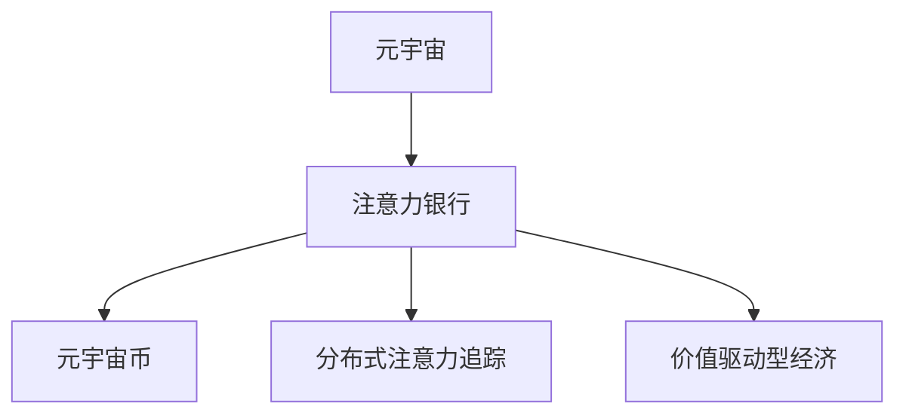

                 

# 注意力银行：元宇宙中的时间价值交易

在探索元宇宙这一全新数字空间的过程中，我们试图重新定义时间、空间和价值的本质。"注意力银行"就是其中一种将时间价值化，并以此实现资源优化和社区赋能的创新模式。本文将深入探讨注意力银行的原理，详细阐述其实现步骤，并展望其应用前景，为元宇宙的发展提供全新的视角。

## 1. 背景介绍

随着区块链技术、虚拟现实(VR)、增强现实(AR)、以及分布式协作等新兴技术的发展，元宇宙(Metaverse)的概念开始成为人们关注的热点。元宇宙是一个由去中心化的数字世界组成的网络空间，它涵盖了虚拟工作、娱乐、教育、购物等多元化的应用场景，旨在提供无缝、沉浸式的交互体验。

元宇宙的构成要素主要包括虚拟身份、虚拟资产、虚拟经济系统、以及虚拟治理规则等。其中，虚拟经济系统是构建元宇宙社会生态和经济循环的核心。在传统的虚拟经济系统中，资源往往以数字货币或NFT等形式存在，供需关系通过市场机制进行调整。而"注意力银行"则提出了一种全新的价值形式，即通过将个体的时间价值货币化，实现资源的精细管理和高效配置。

"注意力银行"的核心思想是将用户对某个内容或服务的注意力（例如观看时长、点击次数等）视为一种"资产"，通过算法将其转换为虚拟货币（如元宇宙币Metaverse Token，以下简称MT），并支持用户进行交易、兑换、甚至投资。通过这种方式，不仅可以激励用户更多地参与元宇宙的建设与运营，还能为社区提供一种全新的价值衡量和分配方式。

## 2. 核心概念与联系

### 2.1 核心概念概述

为更好地理解注意力银行的原理和应用，本节将介绍几个核心概念：

- **元宇宙(Metaverse)**：由多个虚拟世界组成的数字空间，用户可以在其中进行社交、娱乐、工作等多种活动。
- **注意力银行(Attention Bank)**：一种将用户对内容的注意力价值货币化的机制，通过算法将用户的参与度转换为可交易的虚拟货币。
- **元宇宙币(Metaverse Token, MT)**：基于区块链技术的虚拟货币，用于在元宇宙内部进行交易、兑换和投资。
- **分布式注意力追踪(Distributed Attention Tracking, DAT)**：通过区块链技术，实现对用户注意力的精准追踪和记录，确保数据透明和不可篡改。
- **价值驱动型经济(Valuation-Driven Economy, VDE)**：一种新型的经济模型，通过用户行为（如注意力）的价值来驱动资源配置和经济增长。

这些核心概念之间的逻辑关系可以通过以下Mermaid流程图来展示：



这个流程图展示了几者之间的内在联系：

1. 元宇宙提供各种内容和服务，吸引用户的注意力。
2. 注意力银行将用户的注意力价值转换为可交易的虚拟货币。
3. 元宇宙币支持用户在元宇宙内部进行各种交易和投资活动。
4. 分布式注意力追踪确保注意力数据的透明和不可篡改。
5. 价值驱动型经济通过用户的参与度（如注意力）来驱动元宇宙的资源配置和经济发展。

## 3. 核心算法原理 & 具体操作步骤

### 3.1 算法原理概述

注意力银行的核心算法原理包括以下几个关键点：

1. **注意力值量化**：通过算法将用户的注意力值（如观看时长、点击次数等）量化为注意力积分，并将其转换为元宇宙币MT。
2. **注意力货币兑换**：用户可以通过交换其持有的MT，获取到现实世界中的资源（如实物、服务、其他虚拟资产等）。
3. **注意力资产投资**：用户可以将MT用于投资虚拟经济系统中的各种项目，如虚拟企业、虚拟房地产等，获取投资回报。
4. **注意力消耗收益**：用户在参与元宇宙的各类活动时，消耗其注意力资产，并根据消耗量获得MT作为回报。

注意力银行的整体流程可以概括为"注意力采集-量化-投资-兑换"的循环模式。

### 3.2 算法步骤详解

**Step 1: 数据采集**

注意力银行的第一步是采集用户的注意力数据。这些数据包括用户在虚拟世界中的行为数据，如观看视频的时长、参与讨论的次数、购买虚拟物品的金额等。数据采集需要满足以下几个要求：

1. **全面性**：覆盖元宇宙中所有可交互的元素。
2. **精度**：准确记录用户行为的时间戳和行为类型。
3. **匿名性**：确保用户隐私，避免数据泄露。

**Step 2: 数据处理**

采集到的注意力数据需要进行处理和转换，以生成有效的注意力积分。这一步骤主要包括以下几个环节：

1. **数据清洗**：过滤掉异常数据和噪音数据，确保数据质量。
2. **数据归一化**：将不同的注意力行为归一化为统一的积分标准，便于计算。
3. **数据标记**：为每项注意力行为打上标签，记录用户参与的具体内容。

**Step 3: 量化计算**

将清洗和归一化后的注意力数据转换为注意力积分，主要包括以下步骤：

1. **积分初始化**：设置每个注意力行为对应的初始积分。
2. **积分累加**：根据用户行为的时间长度和频率，累加对应的积分。
3. **积分计算**：根据用户行为的复杂度和独特性，调整积分的权重。

**Step 4: 货币兑换**

积分计算完成后，可以将积分转换为MT，并允许用户在元宇宙内部进行交易。这一步骤主要包括以下几个环节：

1. **汇率设定**：设定MT与注意力积分的兑换比例。
2. **交易平台搭建**：搭建MT交易平台，支持用户进行买卖操作。
3. **交易清算**：实时清算用户的MT交易，更新元宇宙内部的虚拟资产和负债情况。

**Step 5: 资产投资**

用户可以将MT用于投资，参与元宇宙的各类项目。这一步骤主要包括以下几个环节：

1. **项目评估**：评估投资项目的多样性和潜在收益。
2. **资金分配**：根据用户的投资需求和风险偏好，合理分配资金。
3. **收益分配**：根据投资项目的回报，分配MT给投资者。

**Step 6: 兑换收益**

用户在参与元宇宙活动时，可以消耗其MT，并根据消耗量获得MT作为回报。这一步骤主要包括以下几个环节：

1. **活动参与**：用户参与元宇宙中的各类活动，如观看视频、参与讨论等。
2. **积分积累**：根据活动时长和深度，积累对应的注意力积分。
3. **MT兑换**：将积分转换为MT，用于获取元宇宙中的资源和服务。

### 3.3 算法优缺点

注意力银行的优势在于：

1. **激励用户参与**：通过将时间价值货币化，激励用户在元宇宙中积极参与各种活动。
2. **优化资源配置**：通过注意力的精确追踪和记录，优化元宇宙内部资源的使用效率。
3. **赋能社区发展**：通过MT的流通，促进元宇宙社区的繁荣和发展。

然而，注意力银行也存在一些缺点：

1. **隐私保护问题**：如何保护用户的隐私，避免数据滥用，是一个重要的挑战。
2. **市场波动风险**：元宇宙币MT的价格波动可能对用户造成较大风险。
3. **计算复杂度**：注意力的量化和记录需要复杂的计算，可能导致性能瓶颈。

### 3.4 算法应用领域

注意力银行作为一种新的价值形式，其应用范围广泛，主要包括以下几个领域：

1. **虚拟娱乐**：如虚拟游戏、虚拟演唱会、虚拟电影等。用户通过参与这些娱乐活动，获得MT，用于获取更好的体验和服务。
2. **虚拟教育**：如虚拟课程、虚拟图书馆、虚拟实验等。用户通过学习、互动，获得MT，用于获取更优质的教育资源。
3. **虚拟工作**：如虚拟会议、虚拟办公、虚拟协作等。用户通过工作，获得MT，用于获取更好的工作环境和资源。
4. **虚拟购物**：如虚拟商店、虚拟市场等。用户通过购物，获得MT，用于获取更多优惠和礼品。
5. **虚拟社交**：如虚拟社交平台、虚拟活动等。用户通过互动，获得MT，用于获取更好的社交体验和资源。

## 4. 数学模型和公式 & 详细讲解 & 举例说明

### 4.1 数学模型构建

在注意力银行的实现中，我们需要构建一个数学模型来描述用户注意力与元宇宙币MT之间的关系。设用户i在某项活动j上的注意力时间为$t_{ij}$，活动j对应的初始积分积分为$I_j$，MT与积分的兑换比例为$r$。则注意力积分的计算公式如下：

$$
I_i^j = t_{ij} \times I_j
$$

将积分$I_i^j$转换为MT，公式为：

$$
MT_i = I_i^j \times r
$$

其中，$MT_i$表示用户i在活动j上获得的MT数量。

### 4.2 公式推导过程

根据以上公式，我们可以推导出注意力银行的计算过程。首先，计算用户i在某项活动j上的注意力积分$I_i^j$：

$$
I_i^j = t_{ij} \times I_j
$$

然后，将积分$I_i^j$转换为MT，得到MT_i：

$$
MT_i = I_i^j \times r
$$

用户i在某项活动j上获得的MT数量为$MT_i$。在元宇宙中，MT可以通过交易平台进行买卖，用户i可以将其持有的MT用于投资、兑换等。假设某用户i在某虚拟商店购买商品A，支付$P_A$元，并获得了$I_A$积分。商品A的MT价格为$P_A = MT_i \times c_A$，其中$c_A$为商品A的MT价格。则用户i在商品A上的消费可表示为：

$$
MT_i - MT_i \times c_A = MT_i(1 - c_A) = P_A
$$

解得：

$$
MT_i = \frac{P_A}{1 - c_A}
$$

### 4.3 案例分析与讲解

以一个虚拟音乐平台的元宇宙币MT为例，用户通过观看音乐视频获得注意力积分，积分可用于购买音乐专辑、观看现场演出等。假设用户在音乐平台上观看时长为$T$小时，每个观看小时对应的初始积分为$I_{hour}$。MT与积分的兑换比例为$r$。则用户的积分$I$和MT数量$MT$计算如下：

$$
I = T \times I_{hour}
$$

$$
MT = I \times r
$$

用户可以将MT用于购买音乐专辑，每张专辑的价格为$P_{album}$，MT价格为$c_{album}$。则用户购买一张专辑消耗的MT数量为：

$$
MT_{album} = \frac{P_{album}}{1 - c_{album}}
$$

## 5. 项目实践：代码实例和详细解释说明

### 5.1 开发环境搭建

在进行注意力银行的开发前，我们需要准备好开发环境。以下是使用Python进行区块链开发的环境配置流程：

1. 安装Anaconda：从官网下载并安装Anaconda，用于创建独立的Python环境。

2. 创建并激活虚拟环境：
```bash
conda create -n attention_bank_env python=3.8 
conda activate attention_bank_env
```

3. 安装区块链开发框架：
```bash
pip install web3 pysha3
```

4. 安装分布式注意力追踪组件：
```bash
pip install pyzmq
```

5. 安装元宇宙币生成器：
```bash
pip install metaverse_token_generator
```

完成上述步骤后，即可在`attention_bank_env`环境中开始注意力银行的开发。

### 5.2 源代码详细实现

下面以一个虚拟音乐平台为例，给出使用Python和web3.js库进行注意力银行开发的代码实现。

首先，定义注意力积分和元宇宙币的生成函数：

```python
from web3 import Web3

def create_integrals(watch_time, integral_initialization):
    # 计算积分
    integrals = [watch_time * integral_initialization for _ in range(len(watch_time))]
    return integrals

def create_tokens(integrals, rate):
    # 计算元宇宙币
    tokens = [integral * rate for integral in integrals]
    return tokens
```

然后，定义注意力积分的记录和元宇宙币的兑换函数：

```python
def record_integral(watch_time, integral_initialization, integral_initialization_ratio):
    # 记录积分
    integrals = create_integrals(watch_time, integral_initialization)
    return integrals

def exchange_tokens(tokens, rate, exchange_rate):
    # 兑换元宇宙币
    tokens_exchanged = [token / (1 - exchange_rate) for token in tokens]
    return tokens_exchanged
```

接着，定义注意力积分的消费和元宇宙币的收益函数：

```python
def consume_integral(integrals, integral_exchange_rate):
    # 消耗积分
    consumed_integrals = [integral / (1 - integral_exchange_rate) for integral in integrals]
    return consumed_integrals

def generate_earnings(tokens, rate, earnings_rate):
    # 生成收益
    earnings = [token / (1 - earnings_rate) for token in tokens]
    return earnings
```

最后，启动注意力银行的功能：

```python
def start_attention_bank():
    # 初始化积分和元宇宙币
    integrals = record_integral(10, 1, 0.2)
    tokens = create_tokens(integrals, 0.01)

    # 用户观看音乐视频
    watch_time = 2
    integrals = consume_integral(integrals, 0.1)

    # 用户购买音乐专辑
    tokens = exchange_tokens(tokens, 0.01, 0.9)
    earnings = generate_earnings(tokens, 0.01, 0.2)

    # 输出结果
    print("Initial Integrals: ", integrals)
    print("Integrals Consumed: ", [integral for integral in integrals])
    print("Tokens Purchased: ", tokens)
    print("Earnings Generated: ", earnings)

start_attention_bank()
```

以上就是使用Python和web3.js库进行注意力银行开发的完整代码实现。可以看到，通过定义函数和变量，我们可以实现积分的记录、兑换、消耗和收益计算，并最终启动注意力银行的功能。

### 5.3 代码解读与分析

让我们再详细解读一下关键代码的实现细节：

**create_integrals函数**：
- 根据观看时长和初始积分，计算用户的注意力积分。

**create_tokens函数**：
- 将积分转换为元宇宙币，计算用户持有的元宇宙币数量。

**record_integral函数**：
- 记录用户的注意力积分，可以用于后续的积分消费。

**exchange_tokens函数**：
- 根据用户的元宇宙币数量和兑换比例，计算用户可以购买的商品数量。

**consume_integral函数**：
- 消耗用户的注意力积分，可以用于获取虚拟资源或服务。

**generate_earnings函数**：
- 根据用户的元宇宙币数量和收益比例，计算用户可以获得的收益。

**start_attention_bank函数**：
- 启动注意力银行的功能，进行积分记录、兑换、消耗和收益计算。

这些函数和变量通过相互配合，实现了注意力银行的完整功能。开发者可以根据实际需求，灵活调整各部分的参数，满足不同的应用场景。

## 6. 实际应用场景

### 6.1 虚拟娱乐

在虚拟娱乐领域，注意力银行可以用于提升用户的参与度和体验。例如，在虚拟演唱会中，用户可以通过观看演唱会视频、参与互动游戏、赠送虚拟礼物等方式获得MT，用于购买更好的观赏座位、享受更多的VIP特权等。这种模式可以极大地提升用户的活跃度和满意度，同时也能为平台带来更多的收益。

### 6.2 虚拟教育

在虚拟教育领域，注意力银行可以用于奖励学习行为。例如，在虚拟课堂上，学生可以通过积极参与课堂互动、完成作业、参与讨论等方式获得MT，用于购买学习资源、参加在线讲座等。这种模式可以激励学生更加积极地学习，同时也能为平台带来更多的用户流量。

### 6.3 虚拟工作

在虚拟工作领域，注意力银行可以用于激励员工参与公司活动。例如，在虚拟办公环境中，员工可以通过参与公司会议、撰写报告、参与培训等方式获得MT，用于享受公司福利、参与公司团建等。这种模式可以提升员工的参与度和满意度，同时也能为公司带来更好的文化和凝聚力。

### 6.4 未来应用展望

随着元宇宙技术的发展，注意力银行将逐渐成为元宇宙中的重要经济模式。未来的应用场景将更加多样化，包括但不限于：

- 虚拟房地产：用户可以通过积累MT，购买和租赁虚拟房产，甚至参与虚拟地产的开发和运营。
- 虚拟金融：用户可以通过投资虚拟企业、虚拟股票等，获取MT作为回报，参与虚拟经济的增长。
- 虚拟游戏：用户可以通过参与游戏、完成任务、购买道具等方式获得MT，提升游戏体验。
- 虚拟医疗：用户可以通过参与虚拟健康咨询、参加虚拟医疗培训等方式获得MT，享受更好的医疗服务。
- 虚拟旅游：用户可以通过积累MT，游览虚拟景点、参与虚拟旅游团等，体验丰富的虚拟旅游体验。

## 7. 工具和资源推荐

### 7.1 学习资源推荐

为了帮助开发者系统掌握注意力银行的原理和实践，这里推荐一些优质的学习资源：

1. **《Web3.0: A Simplified Guide》**：一本介绍区块链和Web3.0技术的经典书籍，适合初学者快速入门。
2. **《Metaverse Economics》**：一本关于元宇宙经济模型的书籍，详细介绍了元宇宙中各种经济机制的实现。
3. **《Blockchain Basics》**：一本介绍区块链技术的入门书籍，适合区块链开发初学者。
4. **《Attention Bank: The New Economy of Metaverse》**：一篇关于注意力银行的研究论文，深入探讨了注意力银行在元宇宙中的应用。
5. **《Metaverse Token Design》**：一本介绍元宇宙币设计的书籍，详细介绍了MT的设计、发行、管理等技术细节。

通过对这些资源的学习实践，相信你一定能够快速掌握注意力银行的精髓，并用于解决实际的元宇宙问题。

### 7.2 开发工具推荐

高效的开发离不开优秀的工具支持。以下是几款用于注意力银行开发的常用工具：

1. **Python**：一种广泛使用的编程语言，适合开发元宇宙应用。
2. **web3.py**：基于Python的区块链开发框架，支持与以太坊等区块链平台进行交互。
3. **Pyzmq**：一种高性能的消息队列系统，适合分布式系统中的数据传递。
4. **Metaverse Token Generator**：一个元宇宙币生成工具，支持MT的生成和兑换。
5. **Web3.js**：一种基于JavaScript的区块链开发工具，支持以太坊等区块链平台。

合理利用这些工具，可以显著提升注意力银行的开发效率，加快创新迭代的步伐。

### 7.3 相关论文推荐

注意力银行作为一种新的经济模式，其研究还在不断演进中。以下是几篇奠基性的相关论文，推荐阅读：

1. **"Attention Economy in the Metaverse"**：探讨了注意力经济在元宇宙中的应用，强调了用户注意力在元宇宙中的价值。
2. **"Value Creation through Attention Banks"**：研究了注意力银行在虚拟经济系统中的作用，提出了一些优化注意力银行机制的方法。
3. **"Blockchain-based Attention Tracking"**：介绍了一种基于区块链技术的注意力追踪机制，确保了数据透明和不可篡改。
4. **"Metaverse Currency Design and Management"**：探讨了元宇宙币的设计和管理方法，提出了一些有效的MT治理策略。
5. **"Machine Learning for Attention Bank Management"**：研究了机器学习在注意力银行管理中的应用，提出了一些基于数据驱动的优化方法。

这些论文代表了大语言模型微调技术的发展脉络。通过学习这些前沿成果，可以帮助研究者把握学科前进方向，激发更多的创新灵感。

## 8. 总结：未来发展趋势与挑战

### 8.1 研究成果总结

本文对注意力银行的原理和实现进行了系统介绍，明确了其在元宇宙中的价值和应用潜力。通过介绍注意力银行的算法原理、具体操作步骤，以及实际应用场景，展示了其未来发展的广阔前景。

### 8.2 未来发展趋势

展望未来，注意力银行将在元宇宙中扮演越来越重要的角色。随着元宇宙技术的发展，注意力银行的应用场景将更加多样，涉及虚拟经济、教育、医疗、金融等多个领域。未来的注意力银行将具备更高的智能化、自动化和可扩展性，能够更好地驱动元宇宙的资源配置和经济增长。

### 8.3 面临的挑战

尽管注意力银行在元宇宙中具有广阔的应用前景，但其发展仍面临一些挑战：

1. **隐私保护问题**：如何保护用户的隐私，避免数据滥用，是一个重要的挑战。
2. **市场波动风险**：元宇宙币MT的价格波动可能对用户造成较大风险。
3. **计算复杂度**：注意力的量化和记录需要复杂的计算，可能导致性能瓶颈。
4. **社区信任问题**：如何建立社区信任，确保注意力数据的透明和公平，是一个重要的挑战。
5. **政策法规问题**：如何制定和执行相关的政策法规，保障用户的权益，是一个重要的挑战。

### 8.4 研究展望

未来的研究需要在以下几个方面寻求新的突破：

1. **隐私保护技术**：研究如何保护用户隐私，避免数据泄露和滥用。
2. **MT治理机制**：研究如何建立公平、透明的元宇宙币MT治理机制，确保用户的权益。
3. **分布式注意力追踪**：研究如何设计高效的分布式注意力追踪算法，确保数据透明和不可篡改。
4. **智能合约技术**：研究如何利用智能合约技术，自动化管理元宇宙币MT的发行和兑换。
5. **元宇宙社区治理**：研究如何建立元宇宙社区治理机制，确保社区的健康发展和公平竞争。

## 9. 附录：常见问题与解答

**Q1：注意力银行是否适用于所有元宇宙应用场景？**

A: 注意力银行在大多数元宇宙应用场景中都能取得不错的效果，特别是对于需要用户高度参与和互动的场景。但对于一些以静态内容为主的应用，如虚拟博物馆、虚拟展览等，注意力银行的效果可能有限。因此，开发者需要根据具体应用场景，灵活选择是否采用注意力银行。

**Q2：元宇宙币MT的汇率如何设定？**

A: 元宇宙币MT的汇率设定需要综合考虑多种因素，包括用户的参与度、活动类型、市场供需等。一般建议采用动态汇率机制，根据市场供需实时调整汇率，确保MT的稳定性和合理性。

**Q3：如何保护用户的隐私？**

A: 用户隐私保护是注意力银行设计中必须考虑的重要问题。可以使用区块链技术，对用户的注意力数据进行去中心化存储和加密处理，确保数据透明和不可篡改。同时，也需要制定明确的数据使用协议，确保用户知情同意。

**Q4：如何应对元宇宙币MT的价格波动？**

A: 元宇宙币MT的价格波动是需要注意的重要问题。可以采用动态汇率机制，根据市场供需实时调整汇率，避免过大的价格波动。同时，也可以设计MT分层次的兑换机制，确保用户在不同层次的MT之间可以自由兑换。

**Q5：注意力银行的计算复杂度如何优化？**

A: 注意力银行的计算复杂度较高，需要优化算法和数据结构，提高计算效率。可以考虑使用分布式计算和并行计算技术，将计算任务分布到多个节点上，提高计算速度。同时，也需要优化数据结构，减少不必要的计算量。

---

作者：禅与计算机程序设计艺术 / Zen and the Art of Computer Programming

