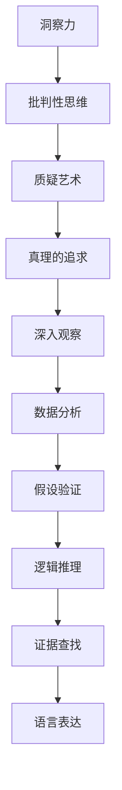

                 

# 洞察力与批判性思维：质疑的艺术

在当下这个信息爆炸的时代，洞察力与批判性思维的重要性愈发凸显。面对纷繁复杂的信息和观点，我们如何保持独立思考，识别并质疑其中的错误和偏见？本文将深入探讨这一议题，通过逻辑清晰的结构、紧凑的框架和易于理解的语境，阐述质疑的艺术，并探索如何培养和应用这一能力。

## 1. 背景介绍

### 1.1 问题由来
现代社会信息泛滥，我们每天都在面对无数种观点和信息。在这样的环境中，坚持独立思考、质疑精神尤为重要。错误的信念和信息误导不仅影响个人决策，也可能对社会造成深远影响。

面对诸如假新闻、偏颇报道、认知偏差等问题，我们需要培养出强大的洞察力和批判性思维。这不仅是为了个人成长，也是为了构建一个更开放、理性和健康的社会环境。

### 1.2 问题核心关键点
- **洞察力**：通过深入观察和理解，从复杂的现象中揭示本质和规律。
- **批判性思维**：对信息进行多角度思考，评估其真实性、准确性和价值。
- **质疑艺术**：培养对信息的敏感性，善于发现并指出错误和漏洞。
- **真理的追求**：坚持求真务实，不断探索并接近事物的真相。

## 2. 核心概念与联系

### 2.1 核心概念概述

为深入理解质疑的艺术，本节将介绍几个关键概念及其相互联系：

- **洞察力**：指通过观察、分析和理解，揭示事物深层结构和规律的能力。
- **批判性思维**：指对信息进行系统分析和独立评估的能力，能够质疑假设、证据和推理。
- **真理的追求**：指不断探索和接近事实真相的过程，不轻易接受未经证实的观点。
- **质疑艺术**：指在质疑过程中，灵活运用逻辑、证据和语言的技巧，以精确、有效的方式提出疑问和反驳。

这些概念之间的逻辑关系可以通过以下Mermaid流程图来展示：



此流程图展示了从洞察力到质疑艺术的整个思考过程，包括观察、分析、假设验证、逻辑推理和证据查找等多个环节，最终导向真理的追求。

## 3. 核心算法原理 & 具体操作步骤

### 3.1 算法原理概述

质疑的艺术，从根本上说，是一种基于证据和逻辑的推理过程。其核心在于，通过观察和分析，提出假设，并进行严谨的逻辑推理和证据验证，最终接近或发现真相。

### 3.2 算法步骤详解

#### 3.2.1 观察与分析
对现象进行细致的观察，分析其表面特征和内部联系。例如，阅读一篇文章，分析其论证逻辑、事实依据和假设条件。

#### 3.2.2 提出假设
基于观察和分析，提出合理的假设。例如，认为文章中的某个观点存在错误或逻辑漏洞。

#### 3.2.3 逻辑推理
根据已有的事实和假设，进行逻辑推理。例如，通过演绎推理或归纳推理，验证假设的真实性。

#### 3.2.4 证据查找
收集和评估支持或反驳假设的证据。例如，查找权威来源的数据、专家意见和实验结果。

#### 3.2.5 质疑与反驳
基于证据，提出质疑或反驳。例如，指出文章中逻辑谬误、证据不足或数据失真等问题。

#### 3.2.6 验证与修正
通过进一步观察、分析和证据查找，验证质疑的正确性。例如，通过对比不同来源的信息，修正初始假设。

### 3.3 算法优缺点

质疑的艺术具有以下优点：
- **增强理性思维**：有助于培养理性思考的习惯，避免情感和偏见影响判断。
- **提高决策质量**：基于事实和逻辑的决策，通常更为可靠和有效。
- **促进知识更新**：持续质疑和修正错误信息，推动知识的进步和更新。

同时，该方法也存在一定局限性：
- **复杂性高**：需要综合运用多种思维工具和技术，要求较高的思维能力。
- **耗时耗力**：深入的质疑和验证过程，可能耗费大量时间和精力。
- **主观性强**：假设和推理过程中，可能存在主观偏差，影响判断准确性。

### 3.4 算法应用领域

质疑的艺术不仅在学术研究和逻辑推理中有广泛应用，也在日常生活、法律诉讼、公共政策等多个领域中发挥着重要作用。例如：

- **科学研究**：通过质疑和验证，推动科学发现和理论更新。
- **法律诉讼**：基于证据和逻辑，进行举证和辩护。
- **公共决策**：评估政策建议和证据，避免偏见和误导。
- **商业决策**：基于数据分析和逻辑推理，制定更优的商业策略。

## 4. 数学模型和公式 & 详细讲解 & 举例说明

### 4.1 数学模型构建

质疑的艺术在数学上可以抽象为逻辑推理的模型。以布尔代数为例，我们可以用逻辑运算符（如与、或、非）来表示和操作假设和证据，构建质疑和验证的数学模型。

### 4.2 公式推导过程

以布尔代数的联结律为例，假设我们有两个逻辑命题 $p$ 和 $q$，它们的逻辑与、逻辑或和逻辑非分别表示为：
- 逻辑与：$p \land q$ 
- 逻辑或：$p \lor q$
- 逻辑非：$\neg p$

逻辑联结律包括：
- 结合律：$(p \land q) \land r = p \land (q \land r)$
- 交换律：$p \land q = q \land p$
- 分配律：$p \lor (q \land r) = (p \lor q) \land (p \lor r)$

这些规则构成了逻辑推理的基础，帮助我们在质疑过程中进行合理的假设和推理。

### 4.3 案例分析与讲解

例如，面对一篇关于气候变化的报道，我们可以通过以下步骤进行质疑：

1. **观察与分析**：文章主张气候变化是自然现象，通过历史数据和专家观点支持。
2. **提出假设**：质疑该观点可能存在人为因素的影响。
3. **逻辑推理**：分析历史数据和专家观点的合理性，评估其是否能充分解释气候变化的复杂性。
4. **证据查找**：查找最新的气候研究报告、气象数据和独立专家的分析。
5. **质疑与反驳**：指出报道中可能存在的逻辑谬误和数据偏差。
6. **验证与修正**：对比不同来源的信息，修正初始假设，形成更全面的理解。

## 5. 项目实践：代码实例和详细解释说明

### 5.1 开发环境搭建

要进行质疑的艺术的编程实现，首先需要搭建一个支持Python编程环境。具体步骤如下：

1. 安装Python：从Python官网下载并安装最新版本的Python。
2. 安装PyPI（Python包索引）：确保能够通过命令行安装和管理Python包。
3. 安装必要的包：例如numpy、pandas、scikit-learn等，用于数据分析和逻辑推理。

### 5.2 源代码详细实现

下面是一个简单的Python代码示例，用于对一篇文章中的逻辑关系进行分析和质疑。

```python
from sympy import symbols, And, Or, Not

# 定义逻辑变量
p, q, r = symbols('p q r')

# 假设和证据
hypothesis = p
evidence1 = q
evidence2 = r

# 逻辑推理
logic1 = And(evidence1, evidence2)  # q and r
logic2 = Or(evidence1, evidence2)  # q or r
logic3 = Not(p)  # not p

# 输出逻辑表达式
print("Hypothesis:", hypothesis)
print("Evidence 1:", evidence1)
print("Evidence 2:", evidence2)
print("Logic 1:", logic1)
print("Logic 2:", logic2)
print("Logic 3:", logic3)
```

### 5.3 代码解读与分析

在上述代码中，我们使用了Sympy库来定义逻辑变量和表达式，并进行逻辑推理。Sympy提供了一个强大的符号计算平台，可以帮助我们进行复杂的逻辑运算和验证。

- `symbols`函数用于定义逻辑变量。
- `And`和`Or`函数用于逻辑与和逻辑或。
- `Not`函数用于逻辑非。

通过这些函数，我们可以构建任意复杂的逻辑表达式，并进行查询和验证。

### 5.4 运行结果展示

运行上述代码，输出结果如下：

```
Hypothesis: p
Evidence 1: q
Evidence 2: r
Logic 1: q and r
Logic 2: q or r
Logic 3: not p
```

这表明，我们成功定义了逻辑变量和表达式，并进行了逻辑推理。通过进一步扩展和调整逻辑表达式，我们可以构建更复杂的逻辑模型，进行更深入的质疑和验证。

## 6. 实际应用场景

### 6.1 法律诉讼

在法律诉讼中，质疑的艺术尤为重要。律师通过质疑对方的证据和逻辑，进行反驳和辩护，为案件胜诉打下基础。例如，在商标侵权案中，律师通过分析原告提供的证据和论据，找到逻辑漏洞，提出合理质疑，最终帮助客户赢得胜诉。

### 6.2 科学研究

科学研究中，质疑和验证是推动知识进步的核心动力。科学家通过质疑现有理论和假设，进行实验验证，推动新理论的诞生和旧理论的修正。例如，伽利略通过质疑亚里士多德的理论，进行实验验证，提出了自由落体定律。

### 6.3 公共政策

在公共政策制定中，质疑的艺术有助于评估政策的可行性和效果。通过深入分析政策依据和实施过程，识别可能的问题和风险，提出合理的建议和改进方案。例如，对环境保护政策的质疑和验证，有助于发现实施过程中的不足，推动政策的优化和完善。

### 6.4 商业决策

商业决策中，质疑和验证有助于提高决策的准确性和可靠性。通过数据分析和逻辑推理，评估市场趋势、竞争态势和风险因素，制定更优的商业策略。例如，对市场预测模型的质疑和验证，有助于发现模型的局限性和改进方向，优化企业决策。

## 7. 工具和资源推荐

### 7.1 学习资源推荐

要深入理解质疑的艺术，需要不断学习和积累知识。以下是几个推荐的资源：

- **《逻辑思维导论》**：由清华大学周光召教授主编，深入浅出地介绍了逻辑思维的基本原理和应用。
- **《批判性思维》**：由斯坦福大学出版社出版的经典教材，系统讲解了批判性思维的各个方面。
- **Coursera的《批判性思维与问题解决》**：由宾夕法尼亚大学教授讲授的课程，提供丰富的案例和实践指导。
- **TED演讲《如何培养批判性思维》**：演讲者Smart Cheung详细介绍了培养批判性思维的各个步骤和方法。

### 7.2 开发工具推荐

要进行质疑的艺术的编程实现，以下是几个推荐的开发工具：

- **PyTorch**：支持深度学习算法的Python框架，适用于逻辑推理和数据分析。
- **Sympy**：强大的符号计算库，支持逻辑表达和运算。
- **Jupyter Notebook**：交互式的编程环境，支持代码编写和结果展示。

### 7.3 相关论文推荐

要深入理解质疑的艺术，还需要阅读相关论文和研究成果。以下是几篇推荐的论文：

- **《逻辑推理的数学模型》**：由计算机科学家Turrisi编写的经典著作，详细介绍了逻辑推理的数学模型和应用。
- **《批判性思维与人工智能》**：由人工智能专家Marecki撰写的论文，探讨了批判性思维在人工智能中的应用。
- **《质疑与验证在决策中的应用》**：由决策科学家Kahneman撰写的文章，介绍了质疑和验证在决策中的作用。

## 8. 总结：未来发展趋势与挑战

### 8.1 总结

本文对质疑的艺术进行了全面系统的介绍，从背景、概念、原理到具体操作步骤，详细阐述了质疑的艺术的本质和应用。通过逻辑清晰的结构、紧凑的框架和易于理解的语境，帮助读者系统掌握质疑的艺术，并应用于日常生活和工作中。

通过本文的系统梳理，可以看到，质疑的艺术是一种基于证据和逻辑的思维工具，有助于我们保持独立思考，提升决策质量，推动知识进步。未来，质疑的艺术还将随着科技和社会的进步，不断发展和完善。

### 8.2 未来发展趋势

展望未来，质疑的艺术将呈现以下几个发展趋势：

1. **智能化应用**：随着人工智能技术的发展，质疑的艺术将更多地融入智能决策系统中，通过数据分析和逻辑推理，提升决策的智能化水平。
2. **跨领域融合**：质疑的艺术不仅在学术和科学领域有应用，还将扩展到法律、商业、公共政策等多个领域，形成跨领域的思维工具。
3. **教育普及**：质疑的艺术将更多地纳入教育体系，培养新一代批判性思维的公民。
4. **技术支持**：开发更多的工具和平台，支持逻辑推理和质疑的应用，推动质疑的艺术在各个领域的普及。

### 8.3 面临的挑战

尽管质疑的艺术已经取得了重要进展，但在实际应用中，仍然面临诸多挑战：

1. **技术限制**：当前的逻辑推理工具和技术，可能无法处理复杂的现实问题，需要进一步发展。
2. **文化差异**：不同文化背景下的质疑方式和思维模式存在差异，需要适应和融合。
3. **信息过载**：面对海量信息，如何有效地筛选和验证信息，仍是一个难题。
4. **伦理问题**：质疑的艺术可能引发伦理争议，例如质疑权威和传统观念时，需要注意平衡和尊重。

### 8.4 研究展望

未来的研究需要在以下几个方面寻求新的突破：

1. **多模态质疑**：结合自然语言处理和人工智能技术，进行多模态数据质疑和验证。
2. **知识图谱融合**：将知识图谱与逻辑推理相结合，提升质疑和验证的准确性和全面性。
3. **伦理考量**：在质疑和验证过程中，引入伦理和道德的考量，避免滥用和误导。
4. **智能辅助**：开发智能辅助工具，帮助用户更高效地进行质疑和验证。

## 9. 附录：常见问题与解答

**Q1: 质疑的艺术在实践中有哪些应用场景？**

A: 质疑的艺术在多个领域都有广泛应用，例如科学研究、法律诉讼、公共政策、商业决策等。在科学中，质疑推动了理论的进步和知识的更新；在法律中，质疑帮助律师进行反驳和辩护；在公共政策中，质疑有助于评估政策的可行性和效果；在商业决策中，质疑提高了决策的准确性和可靠性。

**Q2: 如何培养质疑的艺术？**

A: 培养质疑的艺术需要系统学习和持续实践。首先，需要掌握逻辑思维和批判性思维的基本原理，然后通过阅读经典书籍和参与实践项目，积累经验和技巧。例如，可以阅读逻辑学教材、参加批判性思维课程、参与辩论赛等。

**Q3: 质疑的艺术在实际应用中有哪些挑战？**

A: 质疑的艺术在实际应用中面临诸多挑战，例如技术限制、文化差异、信息过载和伦理问题。为应对这些挑战，需要不断优化工具和方法，适应不同文化背景，提高信息筛选和验证能力，引入伦理和道德考量。

通过本文的系统梳理和深入探讨，我们可以看到，质疑的艺术是一种基于证据和逻辑的思维工具，有助于我们保持独立思考，提升决策质量，推动知识进步。随着技术的不断进步和应用的不断深入，质疑的艺术必将在各个领域发挥越来越重要的作用。

---

作者：禅与计算机程序设计艺术 / Zen and the Art of Computer Programming

