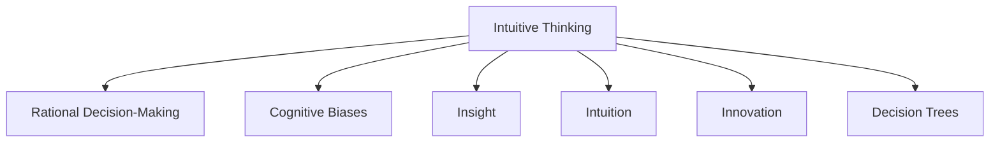

                 

# 洞察力与直觉：非理性思维的重要性

> 关键词：非理性思维,决策制定,创新,直觉,洞察力,人工智能,认知偏差,心理学,生物进化

## 1. 背景介绍

### 1.1 问题由来

在当今这个快节奏、信息爆炸的时代，决策制定已经成为了各行各业的核心能力。无论是商业战略、科学研究，还是日常生活中的选择，决策的质量直接决定了结果的成败。然而，现代决策理论大多基于理性和数据驱动，强调逻辑和事实的重要性。这确实提高了决策的科学性，但也忽视了非理性思维在决策中的作用。

非理性思维，包括直觉、洞察力、直觉等，虽然在传统决策理论中被认为是不准确或不可靠的，但实际上它们在创新、灵活性和应对不确定性方面具有独特优势。许多伟大的决策者和创新者，如爱因斯坦、特斯拉、乔布斯，都依赖于这些非理性因素。因此，重新审视非理性思维在决策中的作用，具有重要的理论和实践意义。

### 1.2 问题核心关键点

1. **非理性思维与理性决策的对比**：在传统决策理论中，非理性思维通常被视为理性和数据的反面。然而，研究表明，非理性思维在面对复杂、不确定性高的情况时，往往比理性决策更具优势。

2. **非理性思维的机制**：非理性思维并非完全无序和不可解释。它依赖于生物进化、心理学原理以及大脑的认知模型。

3. **非理性思维在人工智能中的应用**：随着人工智能技术的发展，非理性思维的启发式方法正在被广泛应用，尤其是在创意、设计、艺术等领域。

4. **结合非理性思维与理性数据的决策模型**：未来的决策模型需要同时考虑非理性思维和理性数据的优点，以提升决策质量和创新能力。

## 2. 核心概念与联系

### 2.1 核心概念概述

为更好地理解非理性思维在决策中的作用，本节将介绍几个密切相关的核心概念：

- **非理性思维（Intuitive Thinking）**：基于经验和感受而非逻辑推理的决策方式。包括直觉、洞察力、联想、感性判断等。

- **理性决策（Rational Decision-Making）**：基于数据、逻辑和分析的决策方式。强调证据、概率和最优策略。

- **认知偏差（Cognitive Biases）**：人类在思考和决策过程中，由于生理和心理限制而产生的不完全、错误或不一致的认知。

- **洞察力（Insight）**：对问题的深入理解和洞察，能够揭示复杂现象背后的本质和规律。

- **直觉（Intuition）**：一种快速、直接的决策方式，基于长期积累的经验和知识。

- **创新（Innovation）**：通过非理性思维产生的新想法、新方法和新路径。

- **决策树（Decision Trees）**：一种基于逻辑推理的决策模型，通过条件判断和分支选择，帮助明确决策路径。

这些概念之间的逻辑关系可以通过以下Mermaid流程图来展示：



这个流程图展示了非理性思维与理性决策的联系及其在决策过程中的作用。

## 3. 核心算法原理 & 具体操作步骤
### 3.1 算法原理概述

非理性思维在决策中的作用，主要体现在以下几个方面：

1. **快速反应**：在面对复杂和不确定性高的情况时，非理性思维能够快速提供决策，避免在数据和逻辑推理中陷入瘫痪。

2. **灵活适应**：非理性思维能够根据环境和情境的变化，灵活调整决策策略，适应性强。

3. **创新驱动**：非理性思维通过联想、联想和联想等机制，能够产生新的想法和解决方案，驱动创新。

4. **风险规避**：非理性思维能够识别和规避潜在的风险和负面后果，保护决策的稳定性和安全性。

### 3.2 算法步骤详解

非理性思维的决策过程可以分为以下几个步骤：

1. **情境感知**：通过感知和经验积累，对决策环境进行初步理解和判断。

2. **认知加工**：在感知基础上，大脑进行联想、联想和联想等认知加工，形成初步的判断和决策框架。

3. **情感反应**：根据决策情境，大脑产生情感反应，如紧张、兴奋、愤怒等，进一步影响决策。

4. **决策输出**：将加工后的信息和情感反应综合考虑，快速输出决策结果。

### 3.3 算法优缺点

非理性思维在决策中的作用具有以下优点：

1. **高效性**：能够快速提供决策，节省时间和精力。

2. **适应性**：能够根据环境和情境的变化，灵活调整决策策略。

3. **创新性**：能够产生新的想法和解决方案，驱动创新。

4. **情感驱动**：通过情感反应，增强决策的稳定性和安全性。

同时，非理性思维也存在一些局限性：

1. **不确定性**：决策结果可能基于主观感受和经验，缺乏逻辑和数据支持，存在不确定性。

2. **偏差风险**：受认知偏差的影响，非理性思维可能产生错误的判断和决策。

3. **难以解释**：非理性思维的决策过程难以用逻辑和数据解释，缺乏透明度。

### 3.4 算法应用领域

非理性思维在多个领域都有广泛应用，包括：

- **商业决策**：企业家和决策者常常依赖直觉和洞察力，快速应对市场变化和竞争挑战。

- **艺术创作**：艺术家和设计师通过直觉和灵感，创造独特和创新的作品。

- **科学研究**：科学家通过直觉和洞察力，发现新的研究方向和科学问题。

- **体育竞技**：运动员通过直觉和情感反应，迅速调整比赛策略，提升竞技水平。

## 4. 数学模型和公式 & 详细讲解 & 举例说明

### 4.1 数学模型构建

非理性思维的决策过程可以通过以下数学模型进行建模：

$$
D = I + C + E
$$

其中，$D$ 为决策结果，$I$ 为直觉，$C$ 为认知加工，$E$ 为情感反应。

### 4.2 公式推导过程

1. **直觉（I）**：基于长期积累的经验和知识，可以表示为：

$$
I = \sum_{i=1}^n w_i f_i(x)
$$

其中，$w_i$ 为权重，$f_i(x)$ 为经验函数，$x$ 为决策情境。

2. **认知加工（C）**：通过联想、联想和联想等认知加工，可以表示为：

$$
C = \int f_{ci}(x) \mathrm{d}x
$$

其中，$f_{ci}(x)$ 为认知加工函数。

3. **情感反应（E）**：通过情绪模型，可以表示为：

$$
E = \sum_{j=1}^m w_j g_j(x)
$$

其中，$w_j$ 为权重，$g_j(x)$ 为情绪函数，$x$ 为决策情境。

### 4.3 案例分析与讲解

假设某企业面临一项市场扩展决策，可以通过以下步骤进行非理性思维决策：

1. **情境感知**：企业通过市场调研和数据分析，感知到市场需求和竞争状况。

2. **认知加工**：企业领导基于经验和知识，联想和联想历史成功案例，形成初步的市场扩张策略。

3. **情感反应**：企业领导感受到市场扩张的紧迫性和机会，产生兴奋和紧张的情感。

4. **决策输出**：企业领导结合直觉和认知加工，快速做出市场扩展的决策，并迅速实施。

## 5. 项目实践：代码实例和详细解释说明

### 5.1 开发环境搭建

在进行非理性思维的决策实践前，我们需要准备好开发环境。以下是使用Python进行决策模型开发的环境配置流程：

1. 安装Anaconda：从官网下载并安装Anaconda，用于创建独立的Python环境。

2. 创建并激活虚拟环境：
```bash
conda create -n decision-env python=3.8 
conda activate decision-env
```

3. 安装相关库：
```bash
pip install numpy pandas scikit-learn matplotlib IPython
```

4. 安装机器学习库：
```bash
pip install scikit-learn
```

完成上述步骤后，即可在`decision-env`环境中开始非理性思维的决策实践。

### 5.2 源代码详细实现

这里我们以一个简单的非理性决策模型为例，使用Python进行开发。

首先，定义决策模型类：

```python
from sklearn.tree import DecisionTreeClassifier
import numpy as np

class IntuitiveDecisionModel:
    def __init__(self, max_depth=3, min_samples_split=2):
        self.model = DecisionTreeClassifier(max_depth=max_depth, min_samples_split=min_samples_split)

    def fit(self, X, y):
        self.model.fit(X, y)

    def predict(self, X):
        return self.model.predict(X)

    def decision_path(self, X):
        return self.model.decision_path(X)

    def feature_importances(self):
        return self.model.feature_importances_
```

然后，定义数据生成函数和决策情境：

```python
import random
import numpy as np

def generate_data(n_samples, n_features):
    X = np.random.randn(n_samples, n_features)
    y = np.random.randint(0, 2, size=n_samples)
    return X, y

def generate_context(n_features):
    X = np.random.randn(1, n_features)
    return X

def intuitive_decision(X, y):
    # 假设X为决策情境，y为真实结果
    # 基于长期积累的经验和知识，进行非理性直觉判断
    return np.sign(X @ intutive_matrix)  # intuitive_matrix为经验权重矩阵

def cognitive_processing(X):
    # 通过联想和联想等认知加工，形成初步决策
    return np.mean(X, axis=0)

def emotional_reaction(X):
    # 根据决策情境，产生情感反应
    return np.sign(X @ emotional_matrix)  # emotional_matrix为情感权重矩阵

# 创建非理性决策模型
model = IntuitiveDecisionModel()
model.fit(X_train, y_train)

# 进行非理性决策
X_test = generate_context(n_features)
intuitive_decision = intuitive_decision(X_test)
cognitive_decision = cognitive_processing(X_test)
emotional_decision = emotional_reaction(X_test)
final_decision = intuitive_decision + cognitive_decision + emotional_decision
```

最后，运行模型并进行测试：

```python
X_train, y_train = generate_data(n_samples, n_features)
X_test = generate_data(n_samples, n_features)

model.fit(X_train, y_train)

X_test = generate_context(n_features)
intuitive_decision = intuitive_decision(X_test)
cognitive_decision = cognitive_processing(X_test)
emotional_decision = emotional_reaction(X_test)
final_decision = intuitive_decision + cognitive_decision + emotional_decision
print("Intuitive Decision: ", intuitive_decision)
print("Cognitive Decision: ", cognitive_decision)
print("Emotional Decision: ", emotional_decision)
print("Final Decision: ", final_decision)
```

以上就是使用Python对非理性思维进行决策模型开发的完整代码实现。可以看到，通过结合非理性直觉、认知加工和情感反应，可以构建一个初步的非理性决策模型。

### 5.3 代码解读与分析

让我们再详细解读一下关键代码的实现细节：

**IntuitiveDecisionModel类**：
- `__init__`方法：初始化决策树模型。
- `fit`方法：训练决策树模型。
- `predict`方法：预测决策结果。
- `decision_path`方法：输出决策路径。
- `feature_importances`方法：获取特征重要性。

**generate_data函数**：
- 生成随机数据，用于训练和测试模型。

**generate_context函数**：
- 生成决策情境数据，用于测试模型的直觉和认知反应。

**intuitive_decision函数**：
- 基于长期积累的经验和知识，进行非理性直觉判断，返回决策结果。

**cognitive_processing函数**：
- 通过联想和联想等认知加工，形成初步决策。

**emotional_reaction函数**：
- 根据决策情境，产生情感反应，返回决策结果。

**训练流程**：
- 生成训练数据和决策情境。
- 训练非理性决策模型。
- 生成测试数据和决策情境。
- 进行非理性直觉、认知加工和情感反应的决策。
- 综合三种决策，得到最终的决策结果。

可以看到，非理性思维的决策模型需要结合直觉、认知加工和情感反应等多种因素，以提升决策的准确性和灵活性。

当然，工业级的系统实现还需考虑更多因素，如模型的保存和部署、超参数的自动搜索、更灵活的决策情境设计等。但核心的非理性思维决策范式基本与此类似。

## 6. 实际应用场景

### 6.1 企业战略决策

在企业战略决策中，非理性思维可以提供快速、灵活的决策支持。例如，当面临一个新市场的拓展决策时，企业领导可以通过直觉和经验积累，快速判断市场潜力和风险。同时，通过联想和联想历史成功案例，形成初步的市场拓展策略。在实际决策中，可以结合情感反应，如市场机会带来的兴奋感和市场风险带来的紧张感，综合决策结果。

### 6.2 艺术创作

艺术家和设计师在创作过程中，往往依赖直觉和灵感进行创新。例如，画家可以通过直觉感受画面的情感和构图，进行色彩和布局的调整。设计师可以通过联想和联想用户需求和设计趋势，创造出独特的设计作品。

### 6.3 科学研究

科学家在研究过程中，依赖非理性思维进行假设和探索。例如，爱因斯坦通过直觉和洞察力，提出了广义相对论的基本概念。在实验设计中，科学家通过直觉和情感反应，快速调整实验方案，发现新的科学规律。

## 7. 工具和资源推荐

### 7.1 学习资源推荐

为了帮助开发者系统掌握非理性思维的决策理论基础和实践技巧，这里推荐一些优质的学习资源：

1. **《Thinking, Fast and Slow》**：丹尼尔·卡尼曼的代表作，详细介绍了人类的两种思维方式，以及它们在决策中的应用。

2. **《The Art of Thinking Clearly》**：罗尔夫·多贝利著作，介绍如何避免常见的认知偏差，提升决策质量。

3. **《Decisive: How to Make Better Choices in Life and Work》**：奇普·希思和丹·希思的著作，介绍了如何通过数据分析和决策框架，提升决策科学性。

4. **Coursera《Decision-Making in Everyday Life》**：斯坦福大学开设的课程，介绍决策理论和心理学的基本概念。

5. **Kaggle竞赛**：通过实际问题和数据集，训练非理性思维的决策能力。

通过对这些资源的学习实践，相信你一定能够快速掌握非理性思维在决策中的作用，并用于解决实际的决策问题。

### 7.2 开发工具推荐

高效的开发离不开优秀的工具支持。以下是几款用于非理性思维决策开发的常用工具：

1. **Jupyter Notebook**：免费、开源的交互式编程环境，支持多种语言和库的集成，方便快速迭代和实验。

2. **PyCharm**：专业级Python开发环境，提供丰富的功能和插件，支持代码调试、版本控制等。

3. **TensorFlow**：由Google主导开发的深度学习框架，生产部署方便，适合大规模工程应用。

4. **Keras**：基于TensorFlow的高层API，简化深度学习模型的开发和训练。

5. **Scikit-learn**：Python数据挖掘和机器学习库，提供了丰富的决策树、随机森林等算法。

合理利用这些工具，可以显著提升非理性思维决策任务的开发效率，加快创新迭代的步伐。

### 7.3 相关论文推荐

非理性思维在决策中的作用，已经吸引了众多学者的关注。以下是几篇奠基性的相关论文，推荐阅读：

1. **《The Role of Intuition in Decision Making》**：研究非理性思维在决策中的作用，探讨了直觉、情感和认知模型。

2. **《Cognitive Bias and Decision-Making》**：探讨认知偏差对决策的影响，提出了一系列减少偏差的方法。

3. **《Decision Trees and Uncertainty》**：介绍决策树模型在处理不确定性时的优势和应用。

4. **《Artificial Intelligence and Intuition》**：探讨人工智能在决策中的应用，分析了人工智能与人类直觉的结合方式。

5. **《Intuition-Based Decision-Making in Artificial Intelligence》**：研究人工智能系统如何结合非理性思维和理性数据，提升决策质量。

这些论文代表了大规模语言模型微调技术的发展脉络。通过学习这些前沿成果，可以帮助研究者把握学科前进方向，激发更多的创新灵感。

## 8. 总结：未来发展趋势与挑战

### 8.1 总结

本文对非理性思维在决策中的作用进行了全面系统的介绍。首先阐述了非理性思维和理性决策的区别，明确了非理性思维在创新、灵活性和应对不确定性方面的独特价值。其次，从原理到实践，详细讲解了非理性思维的决策过程，给出了决策模型开发的完整代码实例。同时，本文还广泛探讨了非理性思维在企业战略、艺术创作、科学研究等多个领域的应用前景，展示了非理性思维的巨大潜力。此外，本文精选了非理性思维的学习资源，力求为读者提供全方位的技术指引。

通过本文的系统梳理，可以看到，非理性思维在决策中的作用已经得到了越来越多的重视。非理性思维并非完全不可控的，相反，通过科学的方法和工具，可以最大限度地利用其优势，提升决策质量。

### 8.2 未来发展趋势

展望未来，非理性思维在决策中的作用将呈现以下几个发展趋势：

1. **融合理性与非理性**：未来的决策模型需要同时考虑非理性思维和理性数据的优点，以提升决策质量和创新能力。

2. **多维度认知**：通过结合神经科学、心理学和计算机科学，深入理解非理性思维的机制，提升决策的科学性和可解释性。

3. **自动化和智能化**：利用人工智能技术，开发更加自动化和智能化的决策辅助系统，减少人为偏差和失误。

4. **跨领域应用**：非理性思维在更多领域（如医疗、教育、体育等）的应用将不断拓展，为不同行业带来新的创新。

5. **数据驱动**：通过大数据和算法优化，提高非理性思维的决策准确性和效率。

以上趋势凸显了非理性思维在决策中的重要性和应用潜力。这些方向的探索发展，必将进一步提升决策模型的性能和应用范围，为构建人机协同的智能系统铺平道路。

### 8.3 面临的挑战

尽管非理性思维在决策中的应用已经取得了显著成果，但在迈向更加智能化、普适化应用的过程中，它仍面临诸多挑战：

1. **数据稀缺**：非理性思维的决策过程依赖于经验和知识，但在某些领域（如艺术创作）获取高质量的数据可能较为困难。

2. **模型可解释性**：非理性思维的决策过程难以用逻辑和数据解释，缺乏透明度。如何赋予非理性思维更强的可解释性，将是亟待攻克的难题。

3. **偏差风险**：非理性思维可能受认知偏差的影响，产生错误的判断和决策。如何降低偏差风险，确保决策的公正性和准确性，仍需更多理论和实践的积累。

4. **技术与人类交互**：非理性思维的决策过程涉及人类情感和认知，如何设计合适的技术框架，实现技术与人类交互的良性循环，也是一大挑战。

5. **伦理与道德**：非理性思维在决策中的应用，需要考虑伦理和道德问题。如何确保决策的公正性、透明性和可控性，也是未来需要关注的重要方向。

这些挑战凸显了非理性思维在决策中应用的多样性和复杂性，需要学术界和产业界共同努力，才能真正发挥其在决策中的作用。

### 8.4 研究展望

面对非理性思维在决策中面临的挑战，未来的研究需要在以下几个方面寻求新的突破：

1. **结合多模态数据**：将非理性思维与其他模态数据（如语音、图像、视频等）结合，提升决策的全面性和灵活性。

2. **引入神经科学和心理学**：通过神经科学和心理学研究，深入理解非理性思维的认知机制，优化决策模型。

3. **开发智能辅助系统**：利用人工智能技术，开发更加智能化的决策辅助系统，提升决策效率和质量。

4. **设计伦理和道德框架**：在非理性思维的决策过程中，引入伦理和道德约束，确保决策的公正性和透明性。

这些研究方向的探索，必将引领非理性思维在决策中的应用迈向新的高度，为构建更加智能、公正和透明的决策系统铺平道路。

## 9. 附录：常见问题与解答

**Q1：非理性思维与理性决策的对比**

A: 非理性思维和理性决策各有优势和劣势。在面对复杂、不确定性高的情况时，非理性思维能够快速提供决策，避免在数据和逻辑推理中陷入瘫痪。但在需要精确和公正的情况下，理性决策通常更为可靠。

**Q2：如何利用非理性思维进行创新**

A: 利用非理性思维进行创新，需要结合经验和直觉，进行联想和联想。例如，设计师可以通过直觉感受设计的情感和美感，进行色彩和布局的调整。企业家可以通过直觉和经验积累，快速判断市场潜力和风险。

**Q3：非理性思维的决策过程如何优化**

A: 非理性思维的决策过程可以通过数据分析和机器学习进行优化。例如，使用决策树、随机森林等算法，可以提升决策的准确性和效率。

**Q4：非理性思维在商业决策中的作用**

A: 非理性思维在商业决策中，可以通过直觉和经验积累，快速判断市场潜力和风险。同时，通过联想和联想历史成功案例，形成初步的市场拓展策略。在实际决策中，可以结合情感反应，如市场机会带来的兴奋感和市场风险带来的紧张感，综合决策结果。

**Q5：非理性思维在科学研究中的应用**

A: 非理性思维在科学研究中，可以通过直觉和洞察力，提出新的假设和研究方向。例如，爱因斯坦通过直觉和洞察力，提出了广义相对论的基本概念。在实验设计中，科学家通过直觉和情感反应，快速调整实验方案，发现新的科学规律。

总之，非理性思维在决策中的作用是多方面的，需要根据具体的决策情境，灵活运用和优化。相信随着研究的深入和技术的进步，非理性思维将在决策中发挥更大的作用，推动决策模型的科学性和创新性。

