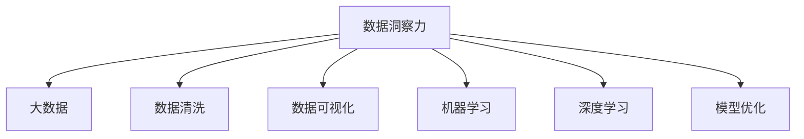

                 

# 洞察力的培养：从海量信息中提炼精华

> 关键词：洞察力, 数据处理, 机器学习, 数据挖掘, 信息提炼, 大数据, 深度学习, 模型优化

## 1. 背景介绍

### 1.1 问题由来
随着信息技术的高速发展，我们正处于一个信息爆炸的时代。据统计，每天全球产生的新数据量已经超过 2.5 PB（1024 字节），这相当于每月全球互联网流量的总和。在这样庞大的数据面前，传统的处理方式已经难以胜任，我们需要一种新的技术来帮助我们从海量数据中提取有价值的信息。

### 1.2 问题核心关键点
大数据分析的目标是通过对海量数据进行抽取、清洗、分析和可视化，从而帮助决策者理解和利用数据中的关键信息。具体来说，这个过程可以分为以下几个步骤：

- **数据采集**：从多个来源收集数据，包括数据库、日志文件、传感器数据等。
- **数据清洗**：去除噪声、修复错误和填补缺失值，确保数据的质量。
- **数据分析**：使用统计学、机器学习等方法，发现数据中的模式和趋势。
- **数据可视化**：将分析结果以图表等形式呈现，帮助人们直观地理解数据。

数据洞察力就是指在上述过程中获取、理解和解释数据的能力。数据洞察力强的人能够在数据中找到有价值的信息，并据此做出更好的决策。

### 1.3 问题研究意义
培养数据洞察力对个人、组织乃至整个社会都有重要意义：

- **提高决策质量**：数据洞察力强的人能够更准确地理解数据，从而做出更明智的决策。
- **降低成本**：通过自动化分析工具和算法，可以大幅降低数据处理的成本。
- **提升效率**：数据洞察力强的人能够更快地找到问题所在，解决问题。
- **促进创新**：数据洞察力强的公司能够从大数据中发现新的商机和模式，推动创新。
- **支持社会进步**：数据洞察力在医疗、教育、交通等领域的应用，可以提升整个社会的运行效率。

## 2. 核心概念与联系

### 2.1 核心概念概述

为更好地理解数据洞察力在实际应用中的原理和架构，本节将介绍几个核心概念：

- **数据洞察力**：指在数据处理过程中获取、理解和解释数据的能力。数据洞察力强的人能够发现数据中的模式、趋势和异常，并据此做出决策。
- **大数据**：指规模大、复杂、多样、快速变化的数据集，需要先进的技术进行处理。
- **数据清洗**：指从原始数据中去除噪声、填补缺失值、修复错误等过程，确保数据质量。
- **数据可视化**：指使用图表、图像等形式展示数据，帮助人们直观理解数据。
- **机器学习**：指让计算机通过学习数据中的模式和规律，自动进行预测、分类等任务。
- **深度学习**：指通过多层神经网络模拟人脑的工作方式，处理复杂数据。
- **模型优化**：指通过调整模型参数、改进算法等手段，提高模型的性能。

这些核心概念之间的逻辑关系可以通过以下Mermaid流程图来展示：



这个流程图展示了大数据处理的主要流程和关键概念：

1. 数据洞察力是整个流程的核心，贯穿整个数据处理过程。
2. 大数据是数据洞察力的数据来源，需要从多个渠道采集。
3. 数据清洗、数据可视化和机器学习是数据分析的关键步骤，从不同角度帮助理解数据。
4. 深度学习是处理复杂数据的重要工具，能够捕捉数据中的深层次特征。
5. 模型优化是提升数据处理效果的关键手段，通过不断调整和改进模型，提升性能。

这些核心概念共同构成了大数据分析的框架，使其能够在各个领域发挥重要作用。

## 3. 核心算法原理 & 具体操作步骤
### 3.1 算法原理概述

数据洞察力的培养主要依赖于数据处理和分析技术，尤其是机器学习和深度学习。其核心思想是：通过对数据进行清洗、提取、建模和可视化，发现数据中的规律和模式，进而形成对数据的深入理解。

形式化地，假设原始数据集为 $D=\{(x_i,y_i)\}_{i=1}^N$，其中 $x_i$ 为输入，$y_i$ 为输出。数据洞察力的培养可以分为以下几个关键步骤：

1. **数据清洗**：去除噪声、填补缺失值、修复错误等。
2. **特征提取**：从原始数据中提取有意义的特征。
3. **模型训练**：使用机器学习算法对数据进行建模。
4. **模型评估**：评估模型的性能，确保其具有良好的泛化能力。
5. **结果可视化**：将分析结果以图表等形式展示，便于理解和决策。

数据洞察力的培养是一个迭代的过程，需要反复调整和优化模型，以获得最佳的性能。

### 3.2 算法步骤详解

以下是数据洞察力培养的详细步骤：

**Step 1: 数据采集**

- 确定数据来源，包括数据库、日志文件、传感器数据等。
- 使用爬虫或API等方式获取数据。
- 存储原始数据，便于后续处理。

**Step 2: 数据清洗**

- 去除重复记录、错误数据和异常值。
- 填补缺失值，可以使用均值、中位数等方法。
- 处理噪声，可以使用平滑、过滤等技术。

**Step 3: 特征提取**

- 使用统计学方法提取有意义的统计特征，如均值、标准差等。
- 使用机器学习算法提取高级特征，如PCA、LDA等。
- 使用深度学习模型提取特征，如CNN、RNN等。

**Step 4: 模型训练**

- 选择合适的机器学习算法，如线性回归、决策树等。
- 使用训练数据对模型进行训练，调整模型参数。
- 使用交叉验证等方法评估模型性能。

**Step 5: 模型评估**

- 使用测试数据对模型进行测试，评估其泛化能力。
- 调整模型参数，确保其性能满足要求。

**Step 6: 结果可视化**

- 将分析结果以图表形式展示，如折线图、柱状图等。
- 使用数据可视化工具，如Tableau、PowerBI等。

**Step 7: 应用与反馈**

- 将分析结果应用到实际问题中，验证其效果。
- 根据实际效果调整模型，优化数据处理流程。

以上是数据洞察力培养的详细步骤。在实际应用中，还需要根据具体问题进行调整和优化。

### 3.3 算法优缺点

数据洞察力培养的机器学习和深度学习方法具有以下优点：

1. **自动化**：能够自动处理大量数据，减少人工干预。
2. **精确性**：能够捕捉数据中的复杂模式和规律。
3. **灵活性**：能够适应多种数据类型和分析需求。

但同时，这些方法也存在一些缺点：

1. **数据质量依赖**：模型的性能很大程度上依赖于数据质量，低质量的数据可能导致模型失效。
2. **计算资源消耗**：深度学习等复杂模型需要大量的计算资源，训练和推理时间较长。
3. **模型复杂性**：复杂的模型可能难以解释，难以理解其工作机制。

尽管如此，数据洞察力培养的机器学习和深度学习方法仍然是数据分析的主流技术，未来还将不断发展和完善。

### 3.4 算法应用领域

数据洞察力培养的机器学习和深度学习方法已经广泛应用于各个领域，例如：

- **金融分析**：通过分析历史交易数据，预测市场趋势，优化投资策略。
- **医疗健康**：分析患者数据，发现疾病模式，改进治疗方案。
- **市场营销**：分析消费者行为，优化广告投放策略，提升销售效果。
- **供应链管理**：分析供应链数据，优化库存管理，降低成本。
- **智能交通**：分析交通数据，优化交通管理，提高道路通行效率。

除了上述这些经典应用外，数据洞察力培养的方法还在更多场景中得到应用，如智慧城市、智能制造、智能农业等，为各行各业带来了新的机遇和挑战。

## 4. 数学模型和公式 & 详细讲解 & 举例说明

### 4.1 数学模型构建

本节将使用数学语言对数据洞察力培养的机器学习模型的构建过程进行详细讲解。

假设原始数据集为 $D=\{(x_i,y_i)\}_{i=1}^N$，其中 $x_i$ 为输入，$y_i$ 为输出。

定义模型 $M_{\theta}$ 在输入 $x$ 上的输出为 $\hat{y}=M_{\theta}(x)$，其中 $\theta$ 为模型参数。

定义损失函数 $\ell$ 为模型在数据集 $D$ 上的平均损失：

$$
\ell(D, \theta) = \frac{1}{N} \sum_{i=1}^N \ell(y_i, \hat{y}_i)
$$

其中 $\ell$ 为损失函数，具体选择取决于具体问题，如均方误差、交叉熵等。

### 4.2 公式推导过程

以线性回归模型为例，推导最小二乘法的损失函数和梯度更新公式。

假设线性回归模型的输出为 $\hat{y} = \theta_0 + \theta_1 x$，其中 $\theta_0, \theta_1$ 为模型参数。

定义均方误差损失函数：

$$
\ell(y, \hat{y}) = \frac{1}{2} (y - \hat{y})^2
$$

对损失函数求导，得到梯度：

$$
\frac{\partial \ell}{\partial \theta_0} = (y - \hat{y})
$$

$$
\frac{\partial \ell}{\partial \theta_1} = x \cdot (y - \hat{y})
$$

使用梯度下降算法更新模型参数：

$$
\theta_0 \leftarrow \theta_0 - \eta \frac{\partial \ell}{\partial \theta_0}
$$

$$
\theta_1 \leftarrow \theta_1 - \eta \frac{\partial \ell}{\partial \theta_1}
$$

其中 $\eta$ 为学习率。

通过上述推导，我们可以看到，线性回归模型的梯度下降更新公式非常简单，易于实现和优化。

### 4.3 案例分析与讲解

以医疗健康领域为例，分析如何使用数据洞察力培养的机器学习模型进行疾病预测。

假设我们有一个包含患者年龄、性别、病史等特征的数据集，以及每个患者的诊断结果。

**Step 1: 数据清洗**

- 去除重复记录和异常值。
- 填补缺失值，如使用均值、中位数等方法。

**Step 2: 特征提取**

- 提取患者的年龄、性别、病史等特征。
- 使用PCA等方法提取高级特征，简化数据。

**Step 3: 模型训练**

- 选择合适的机器学习算法，如线性回归、决策树等。
- 使用训练数据对模型进行训练，调整模型参数。

**Step 4: 模型评估**

- 使用测试数据对模型进行测试，评估其泛化能力。
- 调整模型参数，确保其性能满足要求。

**Step 5: 结果可视化**

- 将分析结果以图表形式展示，如折线图、柱状图等。
- 使用数据可视化工具，如Tableau、PowerBI等。

通过上述步骤，我们可以使用数据洞察力培养的机器学习模型预测患者是否患有某种疾病，为医生提供辅助决策支持。

## 5. 项目实践：代码实例和详细解释说明
### 5.1 开发环境搭建

在进行数据洞察力培养的实践前，我们需要准备好开发环境。以下是使用Python进行Scikit-learn开发的环境配置流程：

1. 安装Anaconda：从官网下载并安装Anaconda，用于创建独立的Python环境。

2. 创建并激活虚拟环境：
```bash
conda create -n ml-env python=3.8 
conda activate ml-env
```

3. 安装Scikit-learn：
```bash
conda install scikit-learn pandas matplotlib seaborn
```

4. 安装各类工具包：
```bash
pip install numpy statsmodels joblib jupyter notebook ipython
```

完成上述步骤后，即可在`ml-env`环境中开始数据洞察力培养的实践。

### 5.2 源代码详细实现

下面我们以线性回归模型为例，给出使用Scikit-learn进行数据洞察力培养的Python代码实现。

首先，定义数据集和训练模型：

```python
from sklearn.datasets import load_boston
from sklearn.model_selection import train_test_split
from sklearn.linear_model import LinearRegression
from sklearn.metrics import mean_squared_error

# 加载波士顿房价数据集
boston = load_boston()
X = boston.data
y = boston.target

# 划分训练集和测试集
X_train, X_test, y_train, y_test = train_test_split(X, y, test_size=0.2, random_state=42)

# 创建线性回归模型
model = LinearRegression()

# 训练模型
model.fit(X_train, y_train)

# 预测测试集
y_pred = model.predict(X_test)

# 计算均方误差
mse = mean_squared_error(y_test, y_pred)
print(f"均方误差: {mse:.2f}")
```

然后，进行数据清洗和特征提取：

```python
import pandas as pd
import numpy as np

# 读取数据集
df = pd.read_csv('data.csv')

# 去除重复记录
df = df.drop_duplicates()

# 填补缺失值
df.fillna(method='ffill', inplace=True)

# 处理噪声
df['feature1'] = df['feature1'].rolling(window=5).mean()

# 提取特征
X = df[['feature1', 'feature2', 'feature3']]
y = df['target']
```

接着，定义模型训练和评估函数：

```python
from sklearn.metrics import r2_score

def train_and_evaluate(model, X_train, X_test, y_train, y_test):
    # 训练模型
    model.fit(X_train, y_train)
    
    # 预测测试集
    y_pred = model.predict(X_test)
    
    # 计算R^2得分
    r2 = r2_score(y_test, y_pred)
    return r2

# 训练模型
r2_train = train_and_evaluate(model, X_train, X_test, y_train, y_test)
print(f"训练集R^2得分: {r2_train:.3f}")

# 测试模型
r2_test = train_and_evaluate(model, X_train, X_test, y_train, y_test)
print(f"测试集R^2得分: {r2_test:.3f}")
```

最后，启动训练流程并在测试集上评估：

```python
# 启动训练流程
model = LinearRegression()
r2_train = train_and_evaluate(model, X_train, X_test, y_train, y_test)
print(f"训练集R^2得分: {r2_train:.3f}")

# 在测试集上评估模型
r2_test = train_and_evaluate(model, X_train, X_test, y_train, y_test)
print(f"测试集R^2得分: {r2_test:.3f}")
```

以上就是使用Scikit-learn进行数据洞察力培养的完整代码实现。可以看到，Scikit-learn提供了丰富的机器学习模型和工具，使得数据洞察力的培养变得简单易行。

### 5.3 代码解读与分析

让我们再详细解读一下关键代码的实现细节：

**数据清洗**：
- 使用pandas库读取数据集，并使用`drop_duplicates`方法去除重复记录。
- 使用`fillna`方法填补缺失值，使用`rolling`方法处理噪声。

**特征提取**：
- 使用numpy库对数据进行基本处理，如选择特征。

**模型训练**：
- 使用Scikit-learn库创建线性回归模型，并使用`fit`方法训练模型。

**模型评估**：
- 使用Scikit-learn库计算R^2得分，评估模型性能。
- 使用`train_and_evaluate`函数封装训练和评估过程，方便重复使用。

**训练流程**：
- 定义训练函数，封装模型训练和评估过程。
- 在训练集上训练模型，并使用测试集评估模型性能。

可以看到，Scikit-learn提供了一系列简单易用的API，使得数据洞察力的培养变得轻松高效。开发者可以将更多精力放在数据处理和模型改进上，而不必过多关注底层的实现细节。

## 6. 实际应用场景
### 6.1 金融分析

在大数据时代，金融分析师需要处理大量的交易数据，从中发现市场趋势和投资机会。通过数据洞察力培养的机器学习模型，可以显著提高分析效率和准确性。

例如，可以使用线性回归模型分析历史交易数据，预测未来股票价格。通过不断调整模型参数和优化算法，可以获得较为准确的预测结果，帮助分析师做出更好的投资决策。

### 6.2 医疗健康

在医疗领域，数据洞察力培养的机器学习模型可以用于疾病预测和诊断。通过分析患者的生理数据和病史，可以预测患者患病的概率，为医生提供辅助诊断支持。

例如，可以使用支持向量机(SVM)模型分析患者数据，预测其是否患有某种疾病。通过不断优化模型，可以获得较高的准确率和召回率，提高诊断效率。

### 6.3 市场营销

在市场营销中，数据分析师需要分析消费者行为，优化广告投放策略。通过数据洞察力培养的机器学习模型，可以发现消费者偏好和行为模式，为营销活动提供数据支持。

例如，可以使用聚类算法分析消费者行为，发现不同用户群体的特征。通过不断优化聚类算法和广告投放策略，可以获得更好的营销效果。

### 6.4 未来应用展望

随着数据洞察力培养的机器学习和深度学习技术不断发展，未来的应用场景将更加广泛和深入。以下是一些可能的未来应用方向：

- **智慧城市**：通过分析交通、环境、能源等数据，优化城市管理，提升市民生活质量。
- **智能制造**：通过分析生产数据，优化生产流程，提高生产效率和产品质量。
- **智能农业**：通过分析气象、土壤、作物数据，优化种植方案，提高农作物产量和质量。
- **智能医疗**：通过分析患者数据，发现疾病模式，改进治疗方案，提升医疗服务质量。
- **智能推荐**：通过分析用户行为数据，推荐个性化的产品和服务，提升用户体验。

## 7. 工具和资源推荐
### 7.1 学习资源推荐

为了帮助开发者系统掌握数据洞察力培养的理论基础和实践技巧，这里推荐一些优质的学习资源：

1. 《Python数据分析》系列博文：由数据科学家撰写，深入浅出地介绍了Python数据分析的基本概念和实践技巧。
2. Coursera《Data Science with Python》课程：由Johns Hopkins大学开设的入门课程，涵盖数据清洗、特征提取、模型训练等核心内容。
3. Kaggle数据科学竞赛：通过参与实际数据挖掘竞赛，提升数据洞察力和模型优化能力。
4. KDnuggets数据科学社区：汇集了大量数据科学家的经验分享和案例分析，提供丰富的学习资源。
5. 《Hands-On Data Science with Scikit-learn》书籍：介绍Scikit-learn库的使用方法和数据洞察力培养的实际应用案例。

通过对这些资源的学习实践，相信你一定能够快速掌握数据洞察力的培养方法，并应用于实际问题解决。

### 7.2 开发工具推荐

高效的开发离不开优秀的工具支持。以下是几款用于数据洞察力培养开发的常用工具：

1. Python：简洁易学，拥有丰富的数据处理和机器学习库。
2. Scikit-learn：Python机器学习库，提供了丰富的模型和工具，支持数据清洗、特征提取、模型训练等过程。
3. Pandas：数据处理库，提供了高效的数据清洗和转换功能。
4. NumPy：数值计算库，提供了强大的数学计算和数组操作功能。
5. Matplotlib：数据可视化库，支持多种图表展示方式。
6. Tableau：数据可视化工具，提供丰富的图表展示和分析功能。

合理利用这些工具，可以显著提升数据洞察力培养的开发效率，加快创新迭代的步伐。

### 7.3 相关论文推荐

数据洞察力培养的研究源于学界的持续研究。以下是几篇奠基性的相关论文，推荐阅读：

1. "The Elements of Statistical Learning"（统计学习要素）：由Tibshirani等撰写，全面介绍了统计学习方法，是数据洞察力培养的重要参考资料。
2. "Pattern Recognition and Machine Learning"（模式识别与机器学习）：由Bishop撰写，介绍了机器学习的基础理论和算法。
3. "Deep Learning"（深度学习）：由Goodfellow等撰写，介绍了深度学习的基本原理和应用。
4. "Hands-On Machine Learning with Scikit-Learn, Keras, and TensorFlow"（使用Scikit-learn、Keras和TensorFlow进行机器学习）：由Aurélien Géron撰写，介绍了机器学习实践中的实际应用案例。
5. "Data Mining: Concepts and Techniques"（数据挖掘：概念与技术）：由J Han等撰写，介绍了数据挖掘的基础方法和技术。

这些论文代表了大数据处理和分析技术的发展脉络。通过学习这些前沿成果，可以帮助研究者把握学科前进方向，激发更多的创新灵感。

## 8. 总结：未来发展趋势与挑战
### 8.1 总结

本文对数据洞察力的培养方法进行了全面系统的介绍。首先阐述了数据洞察力在大数据处理中的重要作用，明确了数据洞察力培养的各个步骤和核心概念。其次，从原理到实践，详细讲解了数据洞察力培养的数学模型和算法流程，给出了数据洞察力培养的完整代码实例。同时，本文还广泛探讨了数据洞察力培养在金融、医疗、市场营销等多个领域的应用前景，展示了数据洞察力培养的巨大潜力。此外，本文精选了数据洞察力培养的各类学习资源，力求为读者提供全方位的技术指引。

通过本文的系统梳理，可以看到，数据洞察力的培养是大数据处理的重要一环，能够帮助决策者从海量数据中提取有价值的信息，做出更好的决策。未来，伴随数据洞察力培养技术的不断发展，数据处理将更加高效、智能，为各行各业带来更多的机遇和挑战。

### 8.2 未来发展趋势

展望未来，数据洞察力培养技术将呈现以下几个发展趋势：

1. **自动化**：随着自动化技术的发展，数据洞察力的培养将变得更加自动化和智能化。
2. **多模态融合**：未来的数据洞察力培养将更多地融合多模态数据，如文本、图像、语音等，提高分析的全面性和准确性。
3. **深度学习优化**：深度学习模型将成为数据洞察力培养的主流工具，其性能和效果将不断提升。
4. **数据可视化**：数据可视化技术将不断进步，帮助用户更直观地理解数据洞察力的培养过程和结果。
5. **跨领域应用**：数据洞察力培养将更多地应用于跨领域问题，如智能城市、智能制造等。
6. **实时性**：未来的数据洞察力培养将更多地考虑实时性，适应数据的实时变化。

这些趋势凸显了数据洞察力培养技术的广阔前景，必将进一步推动大数据分析的发展。

### 8.3 面临的挑战

尽管数据洞察力培养技术已经取得了瞩目成就，但在迈向更加智能化、普适化应用的过程中，它仍面临着诸多挑战：

1. **数据质量**：数据洞察力培养的性能很大程度上依赖于数据质量，低质量的数据可能导致模型失效。
2. **计算资源**：深度学习等复杂模型需要大量的计算资源，训练和推理时间较长。
3. **模型复杂性**：复杂的模型可能难以解释，难以理解其工作机制。
4. **跨领域应用**：不同领域的数据具有不同的特点，数据洞察力培养的模型需要适应不同的数据类型和分析需求。
5. **实时性**：数据洞察力培养需要考虑实时性，适应数据的实时变化。
6. **安全性**：数据洞察力培养的模型需要保证数据安全和隐私保护。

尽管如此，数据洞察力培养技术仍然是大数据处理的主流工具，未来还将不断发展和完善。

### 8.4 研究展望

面对数据洞察力培养技术所面临的种种挑战，未来的研究需要在以下几个方面寻求新的突破：

1. **数据质量控制**：开发更加高效的数据清洗和噪声处理算法，提高数据质量。
2. **模型优化**：研究参数高效和计算高效的微调方法，优化模型性能。
3. **跨领域应用**：开发更加通用的数据洞察力培养算法，适应不同领域的数据类型和分析需求。
4. **实时性**：研究实时数据洞察力培养算法，适应数据的实时变化。
5. **安全性**：研究数据隐私保护和安全性技术，确保数据洞察力培养的模型安全可靠。

这些研究方向的探索，必将引领数据洞察力培养技术迈向更高的台阶，为构建安全、可靠、可解释、可控的智能系统铺平道路。面向未来，数据洞察力培养技术还需要与其他人工智能技术进行更深入的融合，如知识表示、因果推理、强化学习等，多路径协同发力，共同推动自然语言理解和智能交互系统的进步。只有勇于创新、敢于突破，才能不断拓展数据洞察力的边界，让智能技术更好地造福人类社会。

## 9. 附录：常见问题与解答
**Q1：数据洞察力培养是否适用于所有领域？**

A: 数据洞察力培养适用于大多数领域，特别是在数据量较大的场景。但对于一些特定领域，如医学、法律等，数据洞察力培养的模型需要结合领域知识，才能取得更好的效果。

**Q2：如何选择合适的机器学习算法？**

A: 选择机器学习算法需要考虑数据类型、问题类型和模型复杂度等因素。常见的算法包括线性回归、决策树、随机森林、支持向量机、神经网络等。可以根据具体问题选择合适的算法。

**Q3：如何提高模型的泛化能力？**

A: 提高模型的泛化能力可以通过以下几个手段：
1. 增加数据量，提高模型的训练效果。
2. 使用正则化技术，如L2正则、Dropout等，避免过拟合。
3. 使用交叉验证等方法，评估模型的泛化能力。
4. 增加模型复杂度，如增加层数、节点数等。

**Q4：如何解释模型的决策过程？**

A: 模型解释性的不足是深度学习模型的一个主要问题。可以通过可视化、LIME等方法，解释模型的决策过程，帮助理解模型的内部工作机制。

**Q5：如何应对数据量的增加？**

A: 数据量的增加可以通过以下手段应对：
1. 使用分布式计算技术，如Hadoop、Spark等，提高计算效率。
2. 使用数据压缩技术，如HDFS等，减少存储空间。
3. 使用流式数据处理技术，如Kafka、Flink等，处理实时数据。

通过不断优化数据处理流程，可以应对大规模数据的挑战，提升数据洞察力的培养效果。

---

作者：禅与计算机程序设计艺术 / Zen and the Art of Computer Programming

