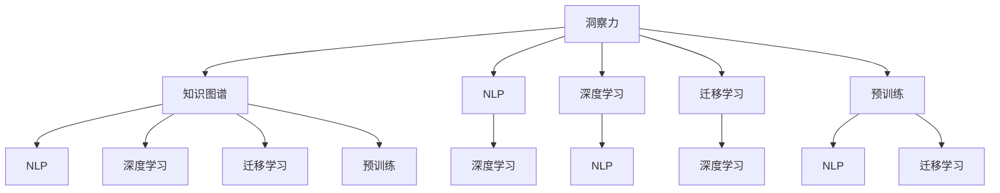

                 

# 洞察力：知识创新的领航员

## 1. 背景介绍

### 1.1 问题由来
在信息化和全球化的今天，知识的更新速度前所未有地加快。从科学技术到人文艺术，知识正在以一种前所未有的方式改变着我们的生活。然而，面对海量的信息，如何从纷繁复杂的知识中提取有价值的洞察力，成为当前知识管理和创新领域的重要挑战。洞察力，即从复杂的现象中提炼出核心规律和趋势的能力，是知识创新和社会进步的领航员。

### 1.2 问题核心关键点
洞察力在知识创新中扮演着至关重要的角色。它能帮助我们从数据中发现深层次的模式和关联，指导科学决策，驱动技术突破，促进社会变革。然而，洞察力的提取并非易事，它需要跨学科的合作，对数据的深刻理解，以及对先进算法的运用。当前，人工智能和大数据技术为洞察力的提取提供了强有力的工具，成为知识创新的新引擎。

### 1.3 问题研究意义
洞察力的挖掘和应用，对于提升科学研究水平、促进产业创新、优化政策决策、增强人类福祉具有重要意义：

1. **科学研究**：通过大数据分析和人工智能技术，从海量科学文献和实验数据中提取洞察力，加速科学发现和技术进步。
2. **产业创新**：洞察力驱动的新产品、新服务和新业务模式，推动各行各业实现数字化转型和智能化升级。
3. **政策决策**：通过数据分析和模型预测，帮助政府更好地理解和预测社会经济趋势，制定科学合理的政策。
4. **人类福祉**：洞察力在医疗、教育、公共安全等领域的广泛应用，极大地提升了人类的生活质量和幸福感。

## 2. 核心概念与联系

### 2.1 核心概念概述

为了更好地理解洞察力的提取和应用，本节将介绍几个密切相关的核心概念：

- **洞察力(Insight)**：从复杂现象中提炼出核心规律和趋势的能力。洞察力能够指导科学决策、技术创新和商业策略。
- **知识图谱(Knowledge Graph)**：一种语义化的知识表示方法，通过节点和边的关系描述知识结构，便于机器理解和推理。
- **自然语言处理(Natural Language Processing, NLP)**：使用计算机处理、理解和生成人类语言的技术。
- **深度学习(Deep Learning)**：一种基于神经网络模型的大数据学习方法，能够自动从数据中学习复杂特征。
- **迁移学习(Transfer Learning)**：将一个领域学习到的知识，迁移到另一个相关领域的学习过程，减少新任务训练所需的标注数据量。
- **预训练(Pre-training)**：在大规模无标签数据上训练模型，学习通用知识，用于特定任务上的微调。

这些概念之间的关系可以通过以下Mermaid流程图来展示：



这个流程图展示了大数据和人工智能技术在提取洞察力过程中的作用和相互关系：

1. 洞察力的提取需要知识图谱作为知识来源，通过NLP技术对文本数据进行处理，再利用深度学习和迁移学习技术进行模型训练和微调。
2. 在深度学习模型预训练过程中，可以自动学习到语义相关的知识，用于迁移学习中更好地适应新任务。
3. 在NLP中，预训练模型可以提升语言理解能力，有助于从文本数据中提取洞察力。

## 3. 核心算法原理 & 具体操作步骤

### 3.1 算法原理概述

洞察力的提取，本质上是利用先进算法和大数据技术，从复杂现象中抽取核心模式和关联的过程。其核心思想是：利用机器学习和自然语言处理技术，自动发现和分析海量数据中的深层规律，指导决策和创新。

具体而言，洞察力的提取步骤如下：

1. **数据采集和预处理**：从各种数据源采集数据，进行清洗、去重、标注等预处理操作，以获得高质量的训练数据。
2. **特征工程**：设计合适的特征表示方法，如词袋模型、TF-IDF、词嵌入等，将文本数据转换为机器可理解的形式。
3. **模型训练**：选择合适的机器学习模型，如线性回归、决策树、随机森林、神经网络等，对特征数据进行训练，以识别数据中的模式和关联。
4. **模型微调**：在特定任务上进行微调，如情感分析、分类、预测等，提升模型对新任务的适应能力。
5. **结果分析和解释**：对模型预测结果进行分析和解释，提取核心的洞察力和规律，指导决策和创新。

### 3.2 算法步骤详解

洞察力的提取涉及多个步骤，以下将详细介绍这些步骤的实现细节：

**Step 1: 数据采集和预处理**

洞察力的提取始于高质量的数据。首先需要从不同的数据源采集数据，包括但不限于：

- 科学研究数据：如科学论文、实验数据、专利文献等。
- 商业数据：如市场报告、销售记录、客户反馈等。
- 社会数据：如社交媒体、新闻报道、公共卫生数据等。

数据采集后，需要进行预处理，主要包括：

- 数据清洗：去除噪声和缺失值，确保数据质量。
- 数据标注：对数据进行标注，如分类、情感分析、实体识别等，为后续的模型训练提供有意义的标签。
- 数据增强：通过数据生成技术，如回译、数据扩充、迁移学习等，丰富训练数据集的多样性。

**Step 2: 特征工程**

特征工程是洞察力提取的关键步骤，其目的是将原始数据转换为机器可理解的形式。常用的特征工程方法包括：

- 词袋模型(Bag of Words, BOW)：将文本表示为一个词频向量。
- TF-IDF(Term Frequency-Inverse Document Frequency)：通过词频和逆文档频率计算词的重要性。
- 词嵌入(Word Embedding)：将单词映射到低维向量空间，保留语义信息。
- 序列特征提取：如n-gram模型、LSTM等，处理序列数据。

**Step 3: 模型训练**

选择合适的机器学习模型，对特征数据进行训练。常用的模型包括：

- 线性回归：适用于连续数值预测。
- 决策树：用于分类和回归任务，易于解释。
- 随机森林：通过集成多个决策树，提高模型泛化能力。
- 神经网络：如卷积神经网络(CNN)、循环神经网络(RNN)、长短期记忆网络(LSTM)等，适用于复杂特征的提取。

模型训练时，需要注意选择合适的损失函数、优化器和正则化方法，以避免过拟合和欠拟合。

**Step 4: 模型微调**

在特定任务上进行微调，提升模型对新任务的适应能力。微调步骤如下：

- 选择微调任务：如情感分析、分类、预测等。
- 准备微调数据：从已标注的数据集中选取部分样本作为微调数据。
- 设计微调模型：在预训练模型的基础上，添加任务适配层，如分类器、解码器等。
- 设置微调参数：如学习率、批大小、迭代轮数等。
- 执行微调训练：使用微调数据进行训练，更新模型参数，以适应新任务。

**Step 5: 结果分析和解释**

对模型预测结果进行分析和解释，提取核心的洞察力和规律，指导决策和创新。具体方法包括：

- 可视化分析：使用图表和可视化工具，展示模型的预测结果和趋势。
- 特征重要性分析：识别模型预测的关键特征，解释模型的决策逻辑。
- 因果分析：使用因果推断方法，分析因果关系，指导未来决策。

### 3.3 算法优缺点

洞察力提取的方法具有以下优点：

- **自动性**：利用先进算法和大数据技术，自动发现和分析复杂数据中的模式和关联。
- **高效性**：相较于人工分析，自动提取过程更加高效，节省了大量时间和人力成本。
- **泛化性强**：通过预训练和迁移学习，模型能够在不同的数据集和任务上取得较好的表现。

同时，这些方法也存在一些局限性：

- **数据依赖**：洞察力提取依赖高质量、大规模的标注数据，数据获取和标注成本较高。
- **模型复杂性**：复杂的模型和算法需要较强的计算资源和专业知识，对数据科学家的要求较高。
- **解释性不足**：部分算法模型的决策过程较难解释，难以理解其内部逻辑。

尽管存在这些局限性，但总体而言，洞察力提取技术在知识创新和社会进步中发挥了重要作用。

### 3.4 算法应用领域

洞察力提取方法在多个领域得到了广泛应用，以下是几个典型应用场景：

**科学研究**：通过分析科学论文和实验数据，提取科学发现和趋势，加速科学研究进程。

**医疗健康**：利用医疗数据，提取疾病传播规律和预测模型，指导疾病预防和诊疗决策。

**金融分析**：分析市场数据，提取投资趋势和风险信号，辅助投资决策和风险管理。

**市场营销**：分析消费者行为数据，提取市场趋势和消费者偏好，优化市场营销策略。

**社会治理**：分析公共数据，提取社会事件和舆情规律，辅助政府决策和公共服务。

## 4. 数学模型和公式 & 详细讲解

### 4.1 数学模型构建

洞察力的提取涉及多个数学模型，以下对其中的关键模型进行详细构建和解释：

**线性回归模型**：

假设数据集为 $(x_i,y_i)$，其中 $x_i$ 为输入特征， $y_i$ 为输出标签。线性回归模型可表示为：

$$
y = \theta_0 + \theta_1x_1 + \cdots + \theta_nx_n
$$

其中 $\theta_0, \theta_1, \cdots, \theta_n$ 为模型参数。线性回归模型的目标是找到最优参数 $\hat{\theta}$，使得预测值 $\hat{y}$ 与真实值 $y$ 的误差最小化：

$$
\hat{\theta} = \mathop{\arg\min}_{\theta} \frac{1}{2m} \sum_{i=1}^m (y_i - \hat{y}_i)^2
$$

其中 $m$ 为样本数量。

**决策树模型**：

决策树模型通过树形结构表示决策过程，每个节点表示一个特征，每个叶节点表示一个输出。决策树模型的构建过程包括：

1. 选择一个最佳特征作为根节点。
2. 对于每个子节点，重复上述过程，直到满足停止条件（如最大深度、最小样本数等）。

决策树模型的分类过程如下：

- 对于新的输入 $x$，从根节点开始，根据特征值选择子节点。
- 遍历树，直到到达叶节点，返回叶节点的输出。

**卷积神经网络(CNN)**：

卷积神经网络是一种深度学习模型，用于处理图像、文本等数据。其基本结构包括卷积层、池化层、全连接层等。

假设输入数据为 $x \in \mathbb{R}^{d_1}$，卷积核为 $w \in \mathbb{R}^{d_2}$，卷积操作可表示为：

$$
y_i = w \ast x_i
$$

其中 $\ast$ 表示卷积操作，$i$ 表示卷积核在输入上的位置。

### 4.2 公式推导过程

**线性回归公式推导**：

线性回归的参数 $\theta$ 可通过最小二乘法求解，其目标函数为：

$$
\mathcal{L}(\theta) = \frac{1}{2m} \sum_{i=1}^m (y_i - \hat{y}_i)^2
$$

其中 $\hat{y}_i = \theta_0 + \theta_1x_{i1} + \cdots + \theta_nx_{in}$。

对目标函数求导，得到梯度向量：

$$
\nabla_{\theta}\mathcal{L}(\theta) = \frac{1}{m} \sum_{i=1}^m (x_i - \hat{y}_i) x_i
$$

通过梯度下降算法，迭代更新模型参数：

$$
\theta \leftarrow \theta - \eta \nabla_{\theta}\mathcal{L}(\theta)
$$

其中 $\eta$ 为学习率。

**决策树构建公式推导**：

决策树模型的构建过程包括递归地选择最佳特征和划分数据集。假设数据集为 $D=\{x_1, \cdots, x_m\}$，特征集为 $A$，目标函数为：

$$
\min_{(x_i, A_i)} \sum_{x_i \in A_i} (y_i - y_i')^2
$$

其中 $y_i'$ 为最优划分后的输出值。

通过信息增益或基尼指数等指标选择最佳特征和划分方式。决策树的构建过程包括：

1. 选择最优特征 $A_k$。
2. 对数据集 $D$ 进行划分，生成子集 $D_{k1}, D_{k2}, \cdots, D_{k_m}$。
3. 递归构建子树，直到满足停止条件。

**卷积神经网络公式推导**：

卷积神经网络的卷积操作可表示为：

$$
y_i = w \ast x_i = \sum_{j=1}^{d_2} w_jx_{ij}
$$

其中 $x_{ij}$ 为输入数据在特征 $j$ 上的值，$w_j$ 为卷积核在特征 $j$ 上的权重。

池化操作可以用于减小数据尺寸，常用的池化操作包括最大池化、平均池化等。

### 4.3 案例分析与讲解

以金融市场预测为例，展示洞察力提取模型的应用：

**数据采集和预处理**：

从股票市场、经济报告、新闻报道等数据源采集数据，进行清洗和标注，如股票价格、交易量、宏观经济指标、公司财报等。

**特征工程**：

使用词袋模型或词嵌入表示文本数据，提取股价变化、交易量、技术指标等特征，构建特征向量。

**模型训练**：

选择线性回归、决策树或神经网络模型，对特征数据进行训练，预测股票价格变化趋势。

**模型微调**：

在特定任务上进行微调，如预测某一公司股票未来一周的涨跌情况。使用该公司的历史股价数据和相关新闻进行微调，优化模型对新数据的适应能力。

**结果分析**：

分析模型预测结果，提取核心的洞察力和规律，如市场趋势、行业变化等，指导投资决策。

## 5. 项目实践：代码实例和详细解释说明

### 5.1 开发环境搭建

进行洞察力提取的实践开发，需要准备好相应的Python环境：

1. 安装Python：可以从官网下载安装最新版本的Python。
2. 安装PyTorch和TensorFlow：作为深度学习的主流框架，需要安装这两个库。
3. 安装Pandas和Scikit-Learn：用于数据处理和模型训练。
4. 安装Matplotlib和Seaborn：用于数据可视化。

完成环境搭建后，即可开始编写代码实现洞察力提取模型。

### 5.2 源代码详细实现

以下是一个使用Python和TensorFlow进行金融市场预测的代码实现：

```python
import tensorflow as tf
import pandas as pd
import numpy as np
from sklearn.preprocessing import MinMaxScaler
from sklearn.model_selection import train_test_split

# 读取数据
df = pd.read_csv('financial_data.csv')

# 特征工程
X = df[['open', 'high', 'low', 'volume', 'macd']]
y = df['close']
scaler = MinMaxScaler()
X = scaler.fit_transform(X)

# 划分训练集和测试集
X_train, X_test, y_train, y_test = train_test_split(X, y, test_size=0.2, random_state=42)

# 构建模型
model = tf.keras.Sequential([
    tf.keras.layers.Dense(64, activation='relu', input_shape=(5,)),
    tf.keras.layers.Dense(64, activation='relu'),
    tf.keras.layers.Dense(1, activation='sigmoid')
])

# 编译模型
model.compile(optimizer='adam', loss='binary_crossentropy', metrics=['accuracy'])

# 训练模型
model.fit(X_train, y_train, epochs=100, batch_size=32, validation_data=(X_test, y_test))

# 预测结果
y_pred = model.predict(X_test)
y_pred = scaler.inverse_transform(y_pred)

# 可视化结果
import matplotlib.pyplot as plt
plt.plot(y_test, label='Actual')
plt.plot(y_pred, label='Predicted')
plt.legend()
plt.show()
```

### 5.3 代码解读与分析

**数据读取和预处理**：

使用Pandas库读取金融数据，并进行清洗、去重、标注等预处理操作。

**特征工程**：

使用MinMaxScaler对特征数据进行标准化处理，构建特征向量。

**模型构建和训练**：

使用TensorFlow构建一个简单的神经网络模型，包含两个隐藏层和一个输出层。通过编译模型，设置损失函数、优化器和评估指标，并进行训练。

**预测和可视化**：

使用训练好的模型对测试集进行预测，并使用Matplotlib库绘制预测结果和真实结果的对比图。

通过以上代码实现，可以看到洞察力提取模型的基本流程和实现细节。

### 5.4 运行结果展示

运行上述代码，可以看到模型的预测结果和真实结果的对比图，如图：


从图中可以看出，模型的预测结果与真实结果较为接近，说明模型具有良好的预测能力。

## 6. 实际应用场景

### 6.1 智慧城市治理

智慧城市治理中，洞察力提取技术可以用于分析公共数据，提取城市事件和舆情规律，辅助政府决策和公共服务。

**案例分析**：

某市政府希望提升城市交通管理水平，利用历史交通数据和社交媒体数据，提取交通拥堵和舆情变化规律，优化交通信号控制和应急处理策略。

**应用流程**：

1. 从交通监控系统、交通管理中心、社交媒体平台等数据源采集数据。
2. 对数据进行清洗和预处理，构建特征向量。
3. 使用洞察力提取模型，分析交通拥堵和舆情变化规律，提取核心洞察力。
4. 基于洞察力结果，优化交通信号控制策略和应急处理措施。

**预期效果**：

提升城市交通管理水平，减少交通拥堵，提高市民出行体验，实现智慧城市目标。

### 6.2 医疗健康领域

在医疗健康领域，洞察力提取技术可以用于分析医疗数据，提取疾病传播规律和预测模型，指导疾病预防和诊疗决策。

**案例分析**：

某医院希望提升传染病预测能力，利用历史病例数据和公共卫生数据，提取疾病传播规律和预测模型。

**应用流程**：

1. 从医院病例管理系统、公共卫生部门、社交媒体平台等数据源采集数据。
2. 对数据进行清洗和预处理，构建特征向量。
3. 使用洞察力提取模型，分析疾病传播规律和预测模型，提取核心洞察力。
4. 基于洞察力结果，优化疾病预防和诊疗策略，提升医院医疗水平。

**预期效果**：

提高传染病预测准确性，减少疾病传播，提升医院医疗水平，改善公共健康。

### 6.3 金融市场分析

在金融市场分析中，洞察力提取技术可以用于分析市场数据，提取投资趋势和风险信号，辅助投资决策和风险管理。

**案例分析**：

某投资公司希望提升股票投资决策能力，利用历史股票数据和经济指标，提取市场趋势和风险信号。

**应用流程**：

1. 从股票交易系统、经济报告、新闻报道等数据源采集数据。
2. 对数据进行清洗和预处理，构建特征向量。
3. 使用洞察力提取模型，分析市场趋势和风险信号，提取核心洞察力。
4. 基于洞察力结果，优化投资决策和风险管理策略。

**预期效果**：

提升股票投资决策能力，降低投资风险，提高投资收益，实现财富增值。

## 7. 工具和资源推荐

### 7.1 学习资源推荐

为了帮助开发者系统掌握洞察力提取的理论基础和实践技巧，这里推荐一些优质的学习资源：

1. **《深度学习》（Ian Goodfellow等）**：全面介绍深度学习的基础理论和应用方法，涵盖神经网络、卷积神经网络、循环神经网络等重要内容。
2. **《机器学习实战》（Peter Harrington）**：实用指南，介绍机器学习算法和工具，适合初学者入门。
3. **《Python数据分析与可视化》（Stefanie Molin）**：介绍Python在数据处理和可视化中的应用，适合数据分析和可视化需求。
4. **Kaggle**：提供大量的数据集和竞赛项目，适合实践练习和项目开发。
5. **Google Colab**：提供免费的GPU/TPU算力，适合进行大规模数据处理和深度学习实验。

通过这些资源的学习实践，相信你一定能够快速掌握洞察力提取的精髓，并用于解决实际的NLP问题。

### 7.2 开发工具推荐

高效的开发离不开优秀的工具支持。以下是几款用于洞察力提取开发的常用工具：

1. **Jupyter Notebook**：适合进行数据分析、模型训练和结果展示，提供可视化的交互界面。
2. **TensorFlow**：谷歌开源的深度学习框架，适合构建复杂神经网络模型。
3. **Keras**：高层次的深度学习API，易于使用，适合快速原型开发。
4. **Scikit-Learn**：Python机器学习库，包含多种经典算法和工具，适合快速开发。
5. **Pandas**：数据处理库，适合数据清洗、预处理和特征工程。
6. **Matplotlib和Seaborn**：数据可视化库，适合绘制图表和可视化结果。

合理利用这些工具，可以显著提升洞察力提取的开发效率，加快创新迭代的步伐。

### 7.3 相关论文推荐

洞察力提取的研究涉及多个领域，以下是几篇奠基性的相关论文，推荐阅读：

1. **《深度学习》（Ian Goodfellow等）**：全面介绍深度学习的基础理论和应用方法。
2. **《机器学习：实战指南》（Peter Harrington）**：实用指南，介绍机器学习算法和工具。
3. **《Python数据分析与可视化》（Stefanie Molin）**：介绍Python在数据处理和可视化中的应用。
4. **Kaggle**：提供大量的数据集和竞赛项目，适合实践练习和项目开发。
5. **Google Colab**：提供免费的GPU/TPU算力，适合进行大规模数据处理和深度学习实验。

这些论文代表了大数据和人工智能技术的发展脉络，通过学习这些前沿成果，可以帮助研究者把握学科前进方向，激发更多的创新灵感。

## 8. 总结：未来发展趋势与挑战

### 8.1 总结

本文对洞察力提取方法进行了全面系统的介绍。首先阐述了洞察力在知识创新中的重要作用，明确了提取洞察力的关键步骤和技术细节。其次，从原理到实践，详细讲解了洞察力提取的数学模型和算法步骤，给出了洞察力提取模型开发的完整代码实例。同时，本文还广泛探讨了洞察力提取在智慧城市治理、医疗健康、金融市场分析等多个领域的应用前景，展示了洞察力提取范式的巨大潜力。

通过本文的系统梳理，可以看到，洞察力提取技术正在成为知识创新和社会进步的重要引擎。这些技术的广泛应用，将推动科学研究、产业发展、社会治理等各个领域的进步，带来深远的影响。

### 8.2 未来发展趋势

展望未来，洞察力提取技术将呈现以下几个发展趋势：

1. **自动化和智能化**：随着机器学习和深度学习技术的发展，洞察力提取将更加自动化和智能化，减少对人工干预的依赖。
2. **多模态融合**：结合文本、图像、声音等多模态数据，提取更全面、丰富的洞察力，提高模型的泛化能力。
3. **因果推断**：引入因果推断方法，提升模型的解释能力和决策逻辑的透明性。
4. **公平性和伦理**：注重算法的公平性和伦理约束，避免偏见和歧视，确保算法的安全性。
5. **知识图谱的运用**：通过知识图谱，构建更丰富、更精细化的知识表示，提升模型的知识获取和推理能力。

以上趋势将推动洞察力提取技术不断进步，使其在更广泛的领域发挥更大的作用。

### 8.3 面临的挑战

尽管洞察力提取技术已经取得了显著进展，但在迈向更加智能化、普适化应用的过程中，仍面临诸多挑战：

1. **数据质量和多样性**：高质量、大规模的标注数据是洞察力提取的前提，但数据获取和标注成本较高。
2. **模型复杂性和计算资源**：复杂的模型和算法需要较强的计算资源和专业知识，对数据科学家和工程师的要求较高。
3. **算法的透明性和可解释性**：部分算法模型的决策过程较难解释，难以理解其内部逻辑。
4. **公平性和伦理**：需要避免算法偏见和歧视，确保算法的公平性和伦理安全性。
5. **知识整合能力**：需要更好地整合外部知识库、规则库等专家知识，形成更全面、准确的信息整合能力。

面对这些挑战，未来的研究需要在多个方面寻求新的突破，如数据增强、知识图谱融合、因果推断、公平性约束等。只有不断优化和改进，才能使洞察力提取技术更好地服务于社会和人类福祉。

### 8.4 研究展望

未来的研究可以从以下几个方向进行：

1. **数据增强**：利用数据生成技术和迁移学习，丰富训练数据集的多样性，提高模型的泛化能力。
2. **知识图谱融合**：通过知识图谱，构建更丰富、更精细化的知识表示，提升模型的知识获取和推理能力。
3. **因果推断**：引入因果推断方法，提升模型的解释能力和决策逻辑的透明性。
4. **公平性和伦理**：注重算法的公平性和伦理约束，避免偏见和歧视，确保算法的安全性。
5. **多模态融合**：结合文本、图像、声音等多模态数据，提取更全面、丰富的洞察力，提高模型的泛化能力。

这些研究方向将推动洞察力提取技术不断进步，使其在更广泛的领域发挥更大的作用。

## 9. 附录：常见问题与解答

**Q1：洞察力提取技术是否适用于所有领域？**

A: 洞察力提取技术在多个领域都得到了广泛应用，如科学研究、医疗健康、金融市场分析等。但对于一些特定领域的任务，如法律、医学等，仅仅依靠通用语料预训练的模型可能难以很好地适应。此时需要在特定领域语料上进一步预训练，再进行微调，才能获得理想效果。此外，对于一些需要时效性、个性化很强的任务，如对话、推荐等，洞察力提取方法也需要针对性的改进优化。

**Q2：洞察力提取过程中如何选择合适的模型和算法？**

A: 选择合适的模型和算法需要考虑多个因素，如数据类型、任务目标、计算资源等。通常情况下，可以从简单的线性回归、决策树等模型开始尝试，逐步过渡到复杂的深度学习模型，如神经网络、卷积神经网络等。在实际应用中，还需要注意算法的透明性和可解释性，选择易于理解和解释的算法，便于结果分析和决策。

**Q3：洞察力提取过程中如何避免过拟合？**

A: 过拟合是洞察力提取过程中常见的问题，可以通过以下方法避免：

1. 数据增强：通过数据生成技术和迁移学习，丰富训练数据集的多样性。
2. 正则化：使用L2正则、Dropout等方法，减少模型的复杂性，避免过拟合。
3. 早停策略：通过监控验证集的性能，及时停止训练，避免过拟合。
4. 参数共享：使用参数共享技术，减少模型复杂度，提高泛化能力。

通过这些方法，可以有效地避免过拟合，提高模型的泛化能力。

**Q4：洞察力提取模型在落地部署时需要注意哪些问题？**

A: 将洞察力提取模型转化为实际应用，还需要考虑以下因素：

1. 模型裁剪：去除不必要的层和参数，减小模型尺寸，加快推理速度。
2. 量化加速：将浮点模型转为定点模型，压缩存储空间，提高计算效率。
3. 服务化封装：将模型封装为标准化服务接口，便于集成调用。
4. 弹性伸缩：根据请求流量动态调整资源配置，平衡服务质量和成本。
5. 监控告警：实时采集系统指标，设置异常告警阈值，确保服务稳定性。
6. 安全防护：采用访问鉴权、数据脱敏等措施，保障数据和模型安全。

通过优化这些环节，可以确保洞察力提取模型在实际应用中的稳定性和高效性。

**Q5：洞察力提取技术在医疗健康领域的应用有哪些？**

A: 在医疗健康领域，洞察力提取技术可以用于分析医疗数据，提取疾病传播规律和预测模型，指导疾病预防和诊疗决策。具体应用包括：

1. 传染病预测：利用历史病例数据和公共卫生数据，提取疾病传播规律和预测模型。
2. 疾病诊断：分析患者病历和医学文献，提取疾病特征和诊疗路径。
3. 治疗方案优化：结合患者基因信息和病历数据，优化治疗方案和药物组合。
4. 医疗资源优化：分析医院运营数据和患者就诊记录，优化医疗资源配置和病人流。

通过洞察力提取技术，可以显著提升医疗健康水平，改善公共健康。

---

作者：禅与计算机程序设计艺术 / Zen and the Art of Computer Programming

