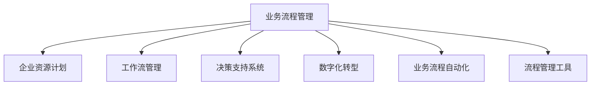

                 

# 流程管理：优化业务运营的方法论

> 关键词：业务流程管理, BPM, 企业流程优化, 数字化转型, 业务流程自动化, 流程管理工具

## 1. 背景介绍

### 1.1 问题由来
在当今快速变化的商业环境中，企业需要不断提升运营效率，以应对激烈的市场竞争和客户需求。然而，传统的流程管理方式往往依赖于手动操作和低效的纸质文档，难以适应复杂多变的业务环境。随着数字化转型的推进，流程管理变得更加重要。优化流程不仅可以降低成本、提升效率，还能增强企业竞争力。

### 1.2 问题核心关键点
流程管理旨在通过标准化、自动化和优化业务流程，使企业运营更加高效、顺畅和可控。主要包括以下几个关键点：
1. **标准化**：通过定义明确的流程步骤和规范，减少人为操作带来的偏差和错误。
2. **自动化**：利用先进的技术手段，如人工智能、机器学习、大数据等，实现业务流程的自动化，减少人工干预。
3. **优化**：对现有流程进行持续评估和改进，提升流程效率和质量。

### 1.3 问题研究意义
流程管理对企业的长期发展具有重要意义：

1. **提升运营效率**：通过流程优化，企业能够减少重复操作、降低成本、提高效率。
2. **增强竞争力**：高效的流程管理能够快速响应市场变化，提供高质量的产品和服务。
3. **降低风险**：标准化和自动化的流程有助于减少人为错误和违规行为，降低业务风险。
4. **促进创新**：优化流程可以释放更多人力资源，专注于创新和业务增长。
5. **数据驱动决策**：流程管理可以提供实时数据，支持企业进行数据驱动的决策制定。

## 2. 核心概念与联系

### 2.1 核心概念概述

为了更好地理解流程管理的核心概念和架构，本节将介绍几个关键概念及其相互关系：

- **业务流程管理(Business Process Management, BPM)**：通过定义、优化和管理业务流程，实现企业运营的高效和顺畅。
- **企业资源计划(Enterprise Resource Planning, ERP)**：集成企业管理功能的系统，覆盖财务、供应链、人力资源等核心业务。
- **工作流管理(Workflow Management)**：通过自动化和监控工作流，提高业务执行效率。
- **决策支持系统(Decision Support System, DSS)**：提供实时数据分析和支持，辅助管理层进行决策。
- **数字化转型(Digital Transformation)**：利用数字化技术，改变企业运营和管理方式。
- **业务流程自动化(Business Process Automation, BPA)**：利用技术手段实现流程自动化，减少人工干预。
- **流程管理工具(BPM Tools)**：支持流程建模、监控和优化，是流程管理的核心工具。

这些概念通过以下Mermaid流程图相互联系，展示了流程管理从定义、优化到执行的全过程：



这个流程图展示了业务流程管理在不同领域的应用和支持，以及流程管理工具的重要性。

## 3. 核心算法原理 & 具体操作步骤
### 3.1 算法原理概述

流程管理的核心算法原理主要包括流程建模、流程仿真、流程优化和流程自动化四个方面。其中，流程建模是基础，流程仿真和优化是提升流程效率的关键，流程自动化则是实现流程管理的最终目标。

### 3.2 算法步骤详解

#### 3.2.1 流程建模

流程建模是流程管理的第一步，其目的是通过图形化方式描述业务流程，建立清晰的流程规范。流程建模通常包括以下步骤：

1. **需求分析**：了解业务需求和目标，确定流程范围和目标。
2. **流程定义**：根据业务需求，定义流程步骤、参与者、决策点和数据流等。
3. **图形化建模**：使用流程建模工具，将流程定义转化为图形化表示，如流程图、BPMN图等。

#### 3.2.2 流程仿真

流程仿真是指通过模拟实际业务流程，评估流程效率和效果，找出潜在的瓶颈和改进点。流程仿真通常包括以下步骤：

1. **数据收集**：收集流程执行过程中的数据，如时间、成本、资源使用情况等。
2. **流程建模**：将流程定义转化为可模拟的模型。
3. **仿真执行**：通过模拟工具执行流程模型，评估流程效率和效果。
4. **分析改进**：根据仿真结果，识别流程瓶颈和改进点，提出优化建议。

#### 3.2.3 流程优化

流程优化是通过对现有流程进行优化，提升流程效率和质量。流程优化通常包括以下步骤：

1. **流程评估**：对现有流程进行评估，找出效率低、质量差或成本高的环节。
2. **流程改进**：根据评估结果，提出改进方案，如重新设计流程步骤、引入新工具或技术等。
3. **流程实施**：实施改进方案，监控流程执行情况，确保改进效果。

#### 3.2.4 流程自动化

流程自动化是指利用技术手段，实现业务流程的自动化，减少人工干预。流程自动化通常包括以下步骤：

1. **自动化需求分析**：了解业务需求和自动化目标，确定自动化范围和目标。
2. **技术选型**：根据业务需求，选择合适的自动化技术，如RPA、人工智能、机器学习等。
3. **流程设计**：根据自动化需求，设计自动化流程，包括数据流、决策逻辑和自动化工具等。
4. **自动化实施**：通过自动化工具或平台实施自动化流程，测试和调整，确保自动化效果。

### 3.3 算法优缺点

流程管理的优点包括：
1. **提升效率**：通过流程标准化和自动化，减少重复操作，提升效率。
2. **降低成本**：减少人工干预，降低人力成本。
3. **提高质量**：通过流程优化，减少人为错误，提高流程质量。
4. **增强灵活性**：通过流程仿真和优化，快速适应业务变化。

流程管理的主要缺点包括：
1. **初期成本高**：流程建模和自动化需要高投入，初期成本较高。
2. **技术依赖强**：流程管理依赖于先进的技术手段，技术选型和实施需要专业知识和经验。
3. **复杂度高**：流程复杂度高，管理和优化难度大。

### 3.4 算法应用领域

流程管理广泛应用于企业运营管理的各个方面，包括：

- **供应链管理**：优化供应链流程，提高物流效率，降低成本。
- **人力资源管理**：优化招聘、培训、绩效管理流程，提升员工满意度。
- **财务管理系统**：优化财务管理流程，提高财务报告的准确性和及时性。
- **客户服务管理**：优化客户服务流程，提高客户满意度和忠诚度。
- **研发管理**：优化产品研发流程，缩短产品上市时间，提升研发效率。

## 4. 数学模型和公式 & 详细讲解 & 举例说明

### 4.1 数学模型构建

流程管理的数学模型主要基于流程仿真和优化算法。以下是几个关键数学模型的构建：

#### 4.1.1 流程仿真模型

流程仿真的数学模型通常包括流量控制、瓶颈分析和性能优化等。以瓶颈分析为例，假设有$n$个流程步骤，每个步骤的执行时间分别为$t_1, t_2, ..., t_n$。瓶颈分析的目标是找出执行时间最长的步骤，即瓶颈步骤。数学模型可以表示为：

$$
t_{\text{bottleneck}} = \max_{i} \{t_i\}
$$

#### 4.1.2 流程优化模型

流程优化的数学模型通常包括目标函数和约束条件。以成本优化为例，假设流程的执行成本为$C$，包括人力成本、物料成本、设备成本等。优化目标是最小化成本，数学模型可以表示为：

$$
\min C = c_1 + c_2 + ... + c_n
$$

其中，$c_i$为第$i$个流程步骤的成本。约束条件包括流程步骤的顺序、资源限制、质量要求等。

### 4.2 公式推导过程

以流程优化模型为例，假设流程有$n$个步骤，每个步骤的执行时间为$t_i$，总成本为$C$。优化目标是最小化成本，数学模型可以表示为：

$$
\min C = \sum_{i=1}^{n} c_i
$$

约束条件为：

$$
\begin{cases}
t_{i-1} \leq t_i, \quad i=2,3,...,n \\
t_1 \geq 0, \quad t_n \geq 0 \\
\sum_{i=1}^{n} t_i = T \\
\end{cases}
$$

其中，$T$为流程总时间。

使用动态规划算法，可以求解上述优化问题。具体步骤如下：

1. **初始化**：设置$t_1 = c_1$，$C_1 = c_1$。
2. **状态转移**：对于$i=2,3,...,n$，计算$C_i = C_{i-1} + c_i$，同时更新$t_i = t_{i-1} + t_i$。
3. **优化**：计算$C_n$，取最小值。

### 4.3 案例分析与讲解

以某企业的供应链管理为例，流程优化模型可以表示为：

- **步骤**：采购、生产、仓储、物流、销售。
- **执行时间**：$t_1 = 5$天、$t_2 = 10$天、$t_3 = 5$天、$t_4 = 5$天、$t_5 = 3$天。
- **成本**：$c_1 = 1000$元/天、$c_2 = 1500$元/天、$c_3 = 800$元/天、$c_4 = 1000$元/天、$c_5 = 500$元/天。

假设总时间为$t_1 + t_2 + t_3 + t_4 + t_5 = 28$天。

使用上述动态规划算法，可以得到最优成本$C_{\text{opt}}$。

## 5. 项目实践：代码实例和详细解释说明

### 5.1 开发环境搭建

在进行流程管理项目实践前，需要准备开发环境。以下是使用Python进行PyFlow开发的环境配置流程：

1. 安装Anaconda：从官网下载并安装Anaconda，用于创建独立的Python环境。

2. 创建并激活虚拟环境：
```bash
conda create -n pyflow-env python=3.8 
conda activate pyflow-env
```

3. 安装PyFlow：从官网获取对应的安装命令。例如：
```bash
conda install pyflow cudatoolkit=11.1 -c pyflow -c conda-forge
```

4. 安装各类工具包：
```bash
pip install numpy pandas scikit-learn matplotlib tqdm jupyter notebook ipython
```

完成上述步骤后，即可在`pyflow-env`环境中开始流程管理实践。

### 5.2 源代码详细实现

下面我们以供应链管理为例，给出使用PyFlow进行流程优化和自动化的PyFlow代码实现。

首先，定义流程步骤和成本：

```python
from pyflow import ProcessFlow

process_flow = ProcessFlow()
process_flow.add_step('采购', cost=1000, time=5)
process_flow.add_step('生产', cost=1500, time=10)
process_flow.add_step('仓储', cost=800, time=5)
process_flow.add_step('物流', cost=1000, time=5)
process_flow.add_step('销售', cost=500, time=3)
```

然后，进行流程优化计算：

```python
from pyflow.optimization import minimize_cost

process_flow.set_total_time(28)
opt_cost, opt_time = minimize_cost(process_flow)
print(f'最优成本: {opt_cost}, 最优时间: {opt_time}')
```

接着，进行流程自动化：

```python
from pyflow.automation import rpa

rpa_process = rpa(process_flow)
rpa_process.run()
```

最后，输出优化结果和自动化执行结果：

```python
print(f'优化后的成本: {opt_cost}')
print(f'自动化执行时间: {rpa_process.time}')

```

以上就是使用PyFlow进行流程管理项目的完整代码实现。可以看到，PyFlow提供了简单易用的API接口，能够快速实现流程建模、优化和自动化。

### 5.3 代码解读与分析

让我们再详细解读一下关键代码的实现细节：

**ProcessFlow类**：
- `add_step`方法：添加流程步骤，指定步骤名称、成本和时间。
- `set_total_time`方法：设置流程总时间。

**minimize_cost函数**：
- 实现流程成本优化，通过动态规划算法计算最优成本和执行时间。
- 返回最优成本和最优时间。

**rpa函数**：
- 实现流程自动化，将流程定义转化为机器人流程自动化任务。
- 运行自动化任务，输出自动化执行时间和成本。

**流程管理项目**：
- 通过PyFlow的API，实现流程建模、优化和自动化。
- 通过调用优化函数和自动化函数，计算最优成本和自动化执行结果。

可以看到，PyFlow提供了丰富的工具和函数，能够快速实现流程管理的各个环节。

当然，工业级的系统实现还需考虑更多因素，如模型的保存和部署、超参数的自动搜索、更灵活的流程适配层等。但核心的流程管理范式基本与此类似。

## 6. 实际应用场景
### 6.1 智能制造

智能制造是流程管理的重要应用场景之一。传统制造业往往依赖于人工操作，效率低、成本高、质量不稳定。通过流程管理技术，可以实现生产过程的标准化和自动化，提高制造效率和产品质量。

在技术实现上，可以集成ERP系统、MES系统等，对生产流程进行全面建模和管理。通过流程仿真和优化，找出生产瓶颈，优化生产计划和调度，实现智能制造。利用流程自动化技术，自动化执行生产任务，进一步提高生产效率。

### 6.2 医疗服务

医疗服务流程管理是提高医疗服务效率和质量的重要手段。通过流程管理，可以优化医生诊断、药品配送、患者服务等流程，提升医疗服务效率和质量。

在技术实现上，可以利用医疗信息化系统，对医生诊断、患者检查、药品配送等流程进行建模和管理。通过流程优化和自动化，提升医疗服务的效率和质量。利用流程仿真技术，评估流程效果，不断改进和优化。

### 6.3 金融服务

金融服务流程管理是提高金融服务效率和客户满意度的重要手段。通过流程管理，可以优化客户服务、风险控制、交易处理等流程，提升金融服务的效率和质量。

在技术实现上，可以利用金融信息系统，对客户服务、交易处理、风险控制等流程进行建模和管理。通过流程优化和自动化，提升金融服务的效率和质量。利用流程仿真技术，评估流程效果，不断改进和优化。

### 6.4 未来应用展望

随着流程管理技术的不断进步，未来将有更多领域应用到流程管理范式，为各行各业带来变革性影响。

在智慧城市治理中，流程管理可以应用于城市事件监测、应急管理、公共服务等环节，提高城市治理的效率和响应速度。

在智能交通系统，流程管理可以应用于交通规划、调度、监控等环节，提升交通系统的效率和安全性。

在教育行业，流程管理可以应用于在线教育、课程设计、学生管理等环节，提升教育服务的效率和质量。

总之，流程管理在各个领域的应用前景广阔，将深刻影响企业的运营和管理方式，提升企业的竞争力。

## 7. 工具和资源推荐
### 7.1 学习资源推荐

为了帮助开发者系统掌握流程管理的技术基础和实践技巧，这里推荐一些优质的学习资源：

1. 《流程管理基础》系列博文：由流程管理技术专家撰写，深入浅出地介绍了流程管理的基本概念和实现方法。

2. 《BPM与ERP的关系》课程：介绍BPM和ERP的关系，帮助理解流程管理的核心思想。

3. 《企业资源计划ERP》书籍：详细介绍了ERP的概念、功能和实现方法，帮助理解流程管理与ERP的结合。

4. 《流程自动化工具》书籍：介绍了常用的流程自动化工具，如UiPath、Blue Prism等，帮助理解流程管理的实际应用。

5. 《流程管理最佳实践》系列文章：总结了流程管理领域的多项最佳实践，帮助开发者掌握流程管理的实际技巧。

通过对这些资源的学习实践，相信你一定能够快速掌握流程管理的精髓，并用于解决实际的业务问题。

### 7.2 开发工具推荐

高效的开发离不开优秀的工具支持。以下是几款用于流程管理开发的常用工具：

1. PyFlow：开源流程管理工具，提供了丰富的流程建模、优化和自动化功能，支持Python语言。

2. UiPath：商业流程自动化工具，提供了图形化界面和丰富的自动化功能，支持多种应用程序和系统。

3. Blue Prism：商业流程自动化工具，提供了企业级流程建模和管理功能，支持多种应用程序和系统。

4. IBM BPM：企业级流程管理平台，提供了全面的流程建模、优化和自动化功能，支持多种应用程序和系统。

5. Camunda：开源流程管理平台，提供了丰富的流程建模、优化和自动化功能，支持多种应用程序和系统。

合理利用这些工具，可以显著提升流程管理的开发效率，加快创新迭代的步伐。

### 7.3 相关论文推荐

流程管理技术的发展源于学界的持续研究。以下是几篇奠基性的相关论文，推荐阅读：

1. "Business Process Management: Principles and Practice"（BPM理论基础）：介绍了BPM的概念、方法和实践，是BPM领域的经典之作。

2. "Enterprise Resource Planning (ERP) System: The Evolution of Business Information Systems"（ERP理论基础）：介绍了ERP的发展历程和应用方法，帮助理解流程管理与ERP的结合。

3. "A Survey of Workflow Management"（工作流管理综述）：综述了工作流管理的理论和实践，帮助理解流程管理的基础。

4. "Optimization of Business Processes"（流程优化理论）：介绍了流程优化的数学模型和方法，帮助理解流程管理的核心算法。

5. "Automation in Business Process Management"（流程自动化理论）：介绍了流程自动化的技术和应用，帮助理解流程管理的实际应用。

这些论文代表了大流程管理技术的发展脉络。通过学习这些前沿成果，可以帮助研究者把握学科前进方向，激发更多的创新灵感。

## 8. 总结：未来发展趋势与挑战

### 8.1 总结

本文对流程管理技术进行了全面系统的介绍。首先阐述了流程管理的背景和意义，明确了流程管理在提升运营效率、降低成本、增强竞争力等方面的重要价值。其次，从原理到实践，详细讲解了流程建模、流程仿真、流程优化和流程自动化的数学模型和操作步骤，给出了流程管理项目的完整代码实现。同时，本文还广泛探讨了流程管理在智能制造、医疗服务、金融服务等多个行业领域的应用前景，展示了流程管理技术的广泛应用和巨大潜力。最后，本文精选了流程管理的各类学习资源，力求为读者提供全方位的技术指引。

通过本文的系统梳理，可以看到，流程管理技术在提升企业运营效率和竞争力方面具有重要作用。流程管理不仅是一种技术手段，更是一种管理理念，需要在实际应用中不断迭代和优化。只有从数据、算法、工程、业务等多个维度协同发力，才能真正实现流程管理的理想效果。

### 8.2 未来发展趋势

展望未来，流程管理技术将呈现以下几个发展趋势：

1. **数字化转型深化**：随着数字化转型的推进，流程管理将更加深入地融入企业的运营和决策体系，提升企业的数字化水平。
2. **人工智能融合**：通过引入人工智能技术，流程管理可以实现更加智能的决策支持、流程优化和自动化。
3. **多领域应用拓展**：流程管理将逐步拓展到更多领域，如智能制造、智慧医疗、智慧城市等，带来新的应用场景和业务价值。
4. **自动化与智能化的协同**：流程自动化与智能决策的协同，将使流程管理更加高效和智能化。
5. **工业互联网融合**：流程管理将与工业互联网深度融合，实现更加精细化的运营管理。

### 8.3 面临的挑战

尽管流程管理技术已经取得了显著成就，但在迈向更加智能化、普适化应用的过程中，它仍面临着诸多挑战：

1. **技术复杂度高**：流程管理涉及多个领域和环节，技术复杂度较高，需要跨领域的知识和技能。
2. **数据质量要求高**：流程管理依赖于数据驱动的决策，对数据质量和完整性要求较高。
3. **业务影响深远**：流程管理涉及到业务流程的优化和重构，对业务影响较大，需要谨慎处理。
4. **技术选型难度大**：流程管理工具和平台众多，选择合适的工具和平台需要深入了解业务需求和技术特点。
5. **持续优化挑战**：流程管理需要持续优化和改进，以适应业务变化和需求，持续优化挑战较大。

### 8.4 研究展望

面对流程管理面临的挑战，未来的研究需要在以下几个方面寻求新的突破：

1. **技术融合创新**：将人工智能、区块链、大数据等技术与流程管理结合，提升流程管理的智能化和自动化水平。
2. **业务流程协同**：建立跨部门、跨企业的流程协同机制，实现流程管理的无缝衔接和资源共享。
3. **用户体验优化**：通过流程自动化和智能化，提升用户的使用体验，降低人工干预，提高工作效率。
4. **标准化与合规性**：制定流程管理的标准和规范，确保流程管理的合规性和可追溯性。
5. **智能决策支持**：通过智能决策支持系统，提供实时数据分析和支持，辅助管理层进行决策。

这些研究方向的探索，必将引领流程管理技术迈向更高的台阶，为构建智能、高效、灵活的业务运营体系铺平道路。面向未来，流程管理技术还需要与其他人工智能技术进行更深入的融合，协同发力，共同推动企业向更高层次的智能化发展。

## 9. 附录：常见问题与解答

**Q1：流程管理是否适用于所有企业？**

A: 流程管理适用于大部分企业，尤其是那些运营复杂、流程冗长、效率低下的企业。但对于一些小型企业和初创企业，流程管理可能投入较大，不太适合。

**Q2：流程管理是否需要大规模投入？**

A: 流程管理确实需要一定的初始投入，但一旦实施，可以带来长期效益。通过流程标准化和自动化，减少重复操作，提升效率和质量，降低成本。

**Q3：流程管理是否需要复杂的工具和平台？**

A: 流程管理可以使用多种工具和平台，如BPM工具、ERP系统、工作流引擎等。选择适合自己的工具和平台，可以大大提升流程管理的实施效果。

**Q4：流程管理是否需要定期优化？**

A: 是的，流程管理需要持续优化和改进，以适应业务变化和需求。定期评估流程效果，识别改进点，进行流程优化，是确保流程管理持续高效的关键。

**Q5：流程管理是否需要跨部门协作？**

A: 是的，流程管理需要跨部门协作，确保流程定义和实施的一致性和完整性。跨部门协作也是流程管理成功的关键。

---

作者：禅与计算机程序设计艺术 / Zen and the Art of Computer Programming

