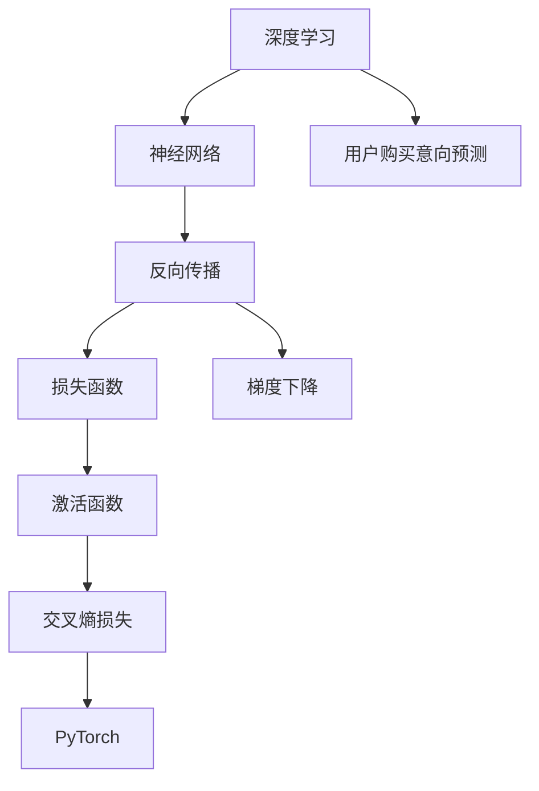

                 

# 深度学习在用户购买意向预测中的应用

> 关键词：深度学习,用户购买意向预测,神经网络,反向传播,损失函数,梯度下降,激活函数,交叉熵,PyTorch

## 1. 背景介绍

### 1.1 问题由来
在当今快速发展的电子商务时代，企业需要准确地预测用户的购买意向，以便制定有效的营销策略和提升客户满意度。传统的统计方法如Logistic回归、决策树等，难以处理大规模数据和非线性关系。近年来，深度学习技术在图像识别、语音处理等领域取得了巨大成功，逐步渗透到用户行为分析领域，并成为用户购买意向预测的主要工具。深度学习模型，特别是神经网络，可以通过学习大量数据，挖掘复杂的特征关系，从而对用户的购买行为做出精准预测。

### 1.2 问题核心关键点
用户购买意向预测是深度学习在电商领域的一个重要应用，其核心在于利用用户的历史行为数据，构建深度学习模型，对用户的购买意向进行预测。主要问题如下：

1. **数据准备**：收集用户历史行为数据，处理缺失值，进行特征工程。
2. **模型构建**：选择合适的神经网络架构，如全连接网络、卷积神经网络、循环神经网络等，用于构建预测模型。
3. **损失函数**：选择合适的损失函数，如交叉熵损失，用于衡量模型预测结果与实际标签的差异。
4. **优化算法**：选择合适的优化算法，如随机梯度下降（SGD）、Adam等，进行模型参数的更新。
5. **模型评估**：使用准确率、召回率、F1-score等指标评估模型性能。
6. **模型部署**：将训练好的模型部署到实际业务系统中，进行实时预测。

### 1.3 问题研究意义
通过深度学习模型进行用户购买意向预测，具有以下几个重要意义：

1. **提升营销效果**：精准预测用户的购买意向，有助于企业制定更具针对性的营销策略，提高转化率和客户满意度。
2. **优化库存管理**：准确预测用户需求，有助于企业优化库存管理，避免过多或过少库存，降低运营成本。
3. **个性化推荐**：预测用户购买意向，可以为用户提供个性化推荐，增强用户体验，提升购物满意度。
4. **风险管理**：预测用户的购买意向，有助于识别潜在的违约风险和欺诈行为，提高风险管理能力。

## 2. 核心概念与联系

### 2.1 核心概念概述

为了更好地理解深度学习在用户购买意向预测中的应用，本节将介绍几个密切相关的核心概念：

- **深度学习**：一种基于神经网络的机器学习技术，通过多层次的特征提取和抽象，实现对复杂数据和模式的有效建模。
- **用户购买意向预测**：通过深度学习模型预测用户在未来一段时间内的购买意向，通常采用二分类任务，如购买或不购买。
- **神经网络**：由多个层次的神经元组成，能够处理复杂的多层次非线性映射。
- **反向传播**：一种优化算法，通过链式法则计算梯度，并反向更新神经网络参数，是深度学习训练的核心步骤。
- **损失函数**：用于衡量模型预测结果与实际标签之间的差异，常用的有交叉熵损失、均方误差损失等。
- **梯度下降**：一种优化算法，通过计算梯度方向和大小，逐步更新模型参数，使损失函数最小化。
- **激活函数**：神经网络中用于引入非线性特性的函数，常用的有ReLU、Sigmoid、Tanh等。
- **交叉熵损失**：常用于二分类任务，衡量预测值和实际标签的差异，方便优化算法进行参数更新。
- **PyTorch**：一种流行的深度学习框架，提供强大的张量计算能力和丰富的工具库，适合构建和训练深度学习模型。

这些核心概念之间的逻辑关系可以通过以下Mermaid流程图来展示：



这个流程图展示了大语言模型的核心概念及其之间的关系：

1. 深度学习通过神经网络进行复杂模式的学习。
2. 反向传播算法用于计算梯度，更新神经网络参数。
3. 损失函数衡量预测结果与实际标签的差异。
4. 梯度下降优化算法通过梯度更新模型参数，最小化损失函数。
5. 激活函数引入非线性特性，增强模型表达能力。
6. 交叉熵损失适用于二分类任务，方便模型训练。
7. PyTorch提供高效的张量计算和模型构建工具。
8. 用户购买意向预测通过深度学习模型实现，提升预测准确性。

## 3. 核心算法原理 & 具体操作步骤
### 3.1 算法原理概述

深度学习在用户购买意向预测中，通常采用神经网络模型。其核心思想是：通过反向传播算法，不断更新模型参数，使得模型能够对用户购买意向进行准确的预测。具体步骤如下：

1. **数据准备**：收集用户的历史行为数据，包括点击、浏览、购买、评价等行为数据，并进行特征工程，构建输入特征。
2. **模型构建**：选择合适的神经网络架构，如全连接网络、卷积神经网络（CNN）、循环神经网络（RNN）等，用于构建预测模型。
3. **损失函数**：选择交叉熵损失等适当的损失函数，衡量模型预测结果与实际标签的差异。
4. **优化算法**：使用梯度下降等优化算法，根据损失函数的梯度更新模型参数。
5. **模型评估**：使用准确率、召回率、F1-score等指标评估模型性能。
6. **模型部署**：将训练好的模型部署到实际业务系统中，进行实时预测。

### 3.2 算法步骤详解

以一个简单的二分类任务为例，详细讲解深度学习在用户购买意向预测中的具体操作流程：

**Step 1: 数据准备**
1. **数据收集**：从电商平台收集用户的历史行为数据，包括点击、浏览、购买、评价等行为数据。
2. **数据预处理**：处理缺失值、异常值，进行特征工程，构建输入特征，如用户ID、商品ID、浏览时间、购买次数等。

**Step 2: 模型构建**
1. **神经网络设计**：选择一个合适的神经网络架构，如全连接网络，用于构建预测模型。
2. **模型参数初始化**：使用随机初始化或预训练模型初始化模型参数。
3. **模型定义**：使用PyTorch等深度学习框架定义神经网络模型，包括输入层、隐藏层、输出层等。

**Step 3: 损失函数选择**
1. **选择损失函数**：根据任务类型选择交叉熵损失、均方误差损失等适当的损失函数。
2. **定义损失函数**：在深度学习框架中定义损失函数，用于计算预测结果与实际标签之间的差异。

**Step 4: 优化算法训练**
1. **定义优化算法**：选择梯度下降等优化算法，定义优化器的学习率、批大小等参数。
2. **模型训练**：使用训练集数据进行前向传播计算损失函数，反向传播计算梯度，使用优化算法更新模型参数。
3. **模型评估**：使用验证集数据评估模型性能，根据评估结果调整模型参数。
4. **模型保存**：保存训练好的模型，方便后续预测使用。

**Step 5: 模型部署**
1. **模型部署**：将训练好的模型部署到实际业务系统中，进行实时预测。
2. **性能监控**：实时监控模型性能，及时调整模型参数或优化算法，确保模型在实际应用中表现稳定。

### 3.3 算法优缺点

深度学习在用户购买意向预测中的应用具有以下优点：

1. **高效性**：能够处理大规模数据和非线性关系，自动提取复杂特征，减少人工干预。
2. **准确性**：通过学习大量数据，能够实现较高的预测准确率。
3. **可扩展性**：神经网络模型可以轻松扩展到多分类任务和其他电商场景。

同时，该方法也存在一些局限性：

1. **数据依赖**：需要大量的标注数据进行训练，标注成本较高。
2. **模型复杂性**：神经网络模型结构复杂，需要较长的训练时间和较高的计算资源。
3. **过拟合风险**：如果数据集较小，模型容易过拟合，泛化性能较差。
4. **可解释性不足**：深度学习模型通常缺乏可解释性，难以理解其内部工作机制。
5. **数据隐私**：在处理用户行为数据时，需要保证数据隐私和安全，防止数据泄露。

尽管存在这些局限性，但深度学习在用户购买意向预测中的优势使其成为电商领域的主要工具。未来研究的方向包括提升模型效率、降低数据需求、提高模型可解释性等。

### 3.4 算法应用领域

深度学习在用户购买意向预测中的应用，涵盖了电商领域的多个方面，如：

- **用户行为分析**：通过用户的历史行为数据，预测用户的购买意向和购买行为，为个性化推荐和营销策略提供数据支持。
- **库存管理**：预测用户需求，优化库存管理，提高库存周转率和运营效率。
- **风险管理**：预测用户违约风险和欺诈行为，提升风险管理能力。
- **广告投放**：通过预测用户购买意向，优化广告投放策略，提高广告效果和投放效率。

## 4. 数学模型和公式 & 详细讲解 & 举例说明
### 4.1 数学模型构建

用户购买意向预测通常采用二分类任务，即预测用户是否会购买某一商品。假设有$N$个样本，每个样本包含$m$个特征，记为$x_i \in \mathbb{R}^m$，对应的标签为$y_i \in \{0,1\}$。构建深度学习模型的一般步骤如下：

1. **输入层**：输入数据$x_i$，通过映射关系转换为神经网络可以处理的张量形式。
2. **隐藏层**：通过多个隐藏层进行特征提取和抽象，得到中间特征表示。
3. **输出层**：通过输出层将中间特征转换为预测结果，记为$\hat{y}_i$。
4. **损失函数**：定义损失函数，衡量模型预测结果与实际标签的差异。

**Step 1: 输入层**
假设输入层将每个样本转换为$m$维向量，即$x_i \in \mathbb{R}^m$。

**Step 2: 隐藏层**
假设隐藏层包含$n_h$个神经元，每个神经元的输出为$z_j$。通过激活函数$f(z)$，得到隐藏层的输出$h_i$：

$$
h_i = \sigma(W_hx_i + b_h)
$$

其中，$W_h$为隐藏层的权重矩阵，$b_h$为偏置向量，$\sigma$为激活函数。

**Step 3: 输出层**
假设输出层包含$n_o$个神经元，每个神经元的输出为$\hat{y}_i$。通过输出层得到预测结果：

$$
\hat{y}_i = \sigma(W_o h_i + b_o)
$$

其中，$W_o$为输出层的权重矩阵，$b_o$为偏置向量，$\sigma$为激活函数。

**Step 4: 损失函数**
假设计量损失函数$\mathcal{L}$，常用的有交叉熵损失：

$$
\mathcal{L} = -\frac{1}{N}\sum_{i=1}^N (y_i \log \hat{y}_i + (1-y_i) \log (1-\hat{y}_i))
$$

**Step 5: 模型训练**
假设学习率为$\eta$，使用梯度下降算法更新模型参数$W$和$b$：

$$
W \leftarrow W - \eta \nabla_{W}\mathcal{L}
$$

$$
b \leftarrow b - \eta \nabla_{b}\mathcal{L}
$$

### 4.2 公式推导过程

以二分类任务为例，推导交叉熵损失函数及其梯度的计算公式。

**交叉熵损失函数**
假设计量损失函数$\mathcal{L}$，常用的有交叉熵损失：

$$
\mathcal{L} = -\frac{1}{N}\sum_{i=1}^N (y_i \log \hat{y}_i + (1-y_i) \log (1-\hat{y}_i))
$$

**梯度计算**
根据链式法则，损失函数对$W$和$b$的梯度计算如下：

$$
\frac{\partial \mathcal{L}}{\partial W_h} = -\frac{1}{N}\sum_{i=1}^N \frac{\partial \mathcal{L}}{\partial h_i} \frac{\partial h_i}{\partial W_h}
$$

$$
\frac{\partial \mathcal{L}}{\partial b_h} = -\frac{1}{N}\sum_{i=1}^N \frac{\partial \mathcal{L}}{\partial h_i} \frac{\partial h_i}{\partial b_h}
$$

其中，$\frac{\partial h_i}{\partial W_h}$和$\frac{\partial h_i}{\partial b_h}$分别为隐藏层和输出层对输入$x_i$的梯度，可以通过自动微分技术高效计算。

### 4.3 案例分析与讲解

以一个简单的二分类任务为例，具体讲解深度学习在用户购买意向预测中的实现过程。

**案例背景**
假设有$N=1000$个用户，每个用户包含$m=10$个特征，如年龄、性别、浏览次数、购买次数等。目标任务是预测用户是否会购买某一商品，标签$y_i \in \{0,1\}$。

**数据准备**
1. **数据收集**：从电商平台收集用户的历史行为数据，包括点击、浏览、购买、评价等行为数据。
2. **数据预处理**：处理缺失值、异常值，进行特征工程，构建输入特征，如用户ID、商品ID、浏览时间、购买次数等。

**模型构建**
1. **神经网络设计**：选择全连接网络，构建包含两个隐藏层的神经网络。
2. **模型参数初始化**：使用随机初始化模型参数。
3. **模型定义**：使用PyTorch定义神经网络模型，包括输入层、两个隐藏层、输出层等。

**损失函数选择**
选择交叉熵损失函数，定义损失函数。

**模型训练**
1. **优化算法**：选择Adam优化算法，设置学习率为$0.001$，批大小为$32$。
2. **模型训练**：使用训练集数据进行前向传播计算损失函数，反向传播计算梯度，使用Adam算法更新模型参数。
3. **模型评估**：使用验证集数据评估模型性能，根据评估结果调整模型参数。

**模型部署**
将训练好的模型部署到实际业务系统中，进行实时预测。

## 5. 项目实践：代码实例和详细解释说明
### 5.1 开发环境搭建

在进行用户购买意向预测的深度学习项目实践中，需要先搭建好开发环境。以下是使用Python进行PyTorch开发的环境配置流程：

1. 安装Anaconda：从官网下载并安装Anaconda，用于创建独立的Python环境。

2. 创建并激活虚拟环境：
```bash
conda create -n pytorch-env python=3.8 
conda activate pytorch-env
```

3. 安装PyTorch：根据CUDA版本，从官网获取对应的安装命令。例如：
```bash
conda install pytorch torchvision torchaudio cudatoolkit=11.1 -c pytorch -c conda-forge
```

4. 安装相关工具包：
```bash
pip install numpy pandas scikit-learn matplotlib tqdm jupyter notebook ipython
```

完成上述步骤后，即可在`pytorch-env`环境中开始项目实践。

### 5.2 源代码详细实现

下面我们以用户购买意向预测为例，给出使用PyTorch进行深度学习模型训练和评估的PyTorch代码实现。

**Step 1: 数据准备**
首先定义数据准备函数，用于读取和处理数据。

```python
import pandas as pd

def read_data(file_path):
    data = pd.read_csv(file_path)
    data = data.dropna()
    return data
```

**Step 2: 模型构建**
定义神经网络模型，使用全连接网络。

```python
import torch.nn as nn
import torch.nn.functional as F

class NeuralNet(nn.Module):
    def __init__(self, input_size, hidden_size, output_size):
        super(NeuralNet, self).__init__()
        self.fc1 = nn.Linear(input_size, hidden_size)
        self.fc2 = nn.Linear(hidden_size, hidden_size)
        self.fc3 = nn.Linear(hidden_size, output_size)
        self.relu = nn.ReLU()
    
    def forward(self, x):
        x = self.fc1(x)
        x = self.relu(x)
        x = self.fc2(x)
        x = self.relu(x)
        x = self.fc3(x)
        return x
```

**Step 3: 损失函数选择**
定义交叉熵损失函数。

```python
import torch.nn as nn

criterion = nn.CrossEntropyLoss()
```

**Step 4: 优化算法选择**
定义Adam优化算法，设置学习率。

```python
import torch.optim as optim

optimizer = optim.Adam(model.parameters(), lr=0.001)
```

**Step 5: 模型训练**
定义模型训练函数，进行模型训练。

```python
def train_model(model, train_loader, criterion, optimizer, num_epochs):
    total_steps = len(train_loader)
    for epoch in range(num_epochs):
        for i, (inputs, labels) in enumerate(train_loader):
            optimizer.zero_grad()
            outputs = model(inputs)
            loss = criterion(outputs, labels)
            loss.backward()
            optimizer.step()
            if (i+1) % 100 == 0:
                print(f"Epoch [{epoch+1}/{num_epochs}], Step [{i+1}/{total_steps}], Loss: {loss.item():.4f}")
```

**Step 6: 模型评估**
定义模型评估函数，使用验证集数据评估模型性能。

```python
def evaluate_model(model, val_loader):
    total = 0
    correct = 0
    with torch.no_grad():
        for inputs, labels in val_loader:
            outputs = model(inputs)
            _, predicted = torch.max(outputs.data, 1)
            total += labels.size(0)
            correct += (predicted == labels).sum().item()
        print(f"Accuracy on the validation set: {(100 * correct / total):.2f}%")
```

**Step 7: 完整代码实现**
结合上述各步骤，给出完整的代码实现。

```python
import torch
import torch.nn as nn
import torch.optim as optim
import torch.nn.functional as F
import pandas as pd
from torch.utils.data import DataLoader

# 数据准备
data = read_data('data.csv')
X = data[['age', 'gender', 'browsing_time', 'purchase_count']]
y = data['purchase'].map(lambda x: 1 if x == 'true' else 0)

# 构建模型
input_size = X.shape[1]
hidden_size = 32
output_size = 1
model = NeuralNet(input_size, hidden_size, output_size)

# 定义损失函数
criterion = nn.BCELoss()

# 定义优化算法
optimizer = optim.Adam(model.parameters(), lr=0.001)

# 数据加载
train_dataset = torch.utils.data.TensorDataset(torch.from_numpy(X), torch.from_numpy(y))
train_loader = DataLoader(train_dataset, batch_size=32, shuffle=True)
val_dataset = torch.utils.data.TensorDataset(torch.from_numpy(X), torch.from_numpy(y))
val_loader = DataLoader(val_dataset, batch_size=32, shuffle=False)

# 模型训练
train_model(model, train_loader, criterion, optimizer, num_epochs=10)

# 模型评估
evaluate_model(model, val_loader)
```

### 5.3 代码解读与分析

让我们再详细解读一下关键代码的实现细节：

**数据准备函数**
定义`read_data`函数，用于读取和处理数据。将CSV文件中的数据读取到Pandas DataFrame中，并进行缺失值处理和特征工程。

**模型定义**
定义`NeuralNet`类，继承自`nn.Module`，用于构建神经网络模型。包含两个隐藏层，使用ReLU激活函数。

**损失函数定义**
使用`nn.BCELoss`定义二分类任务中的交叉熵损失函数。

**优化算法定义**
使用`optim.Adam`定义Adam优化算法，设置学习率。

**模型训练函数**
定义`train_model`函数，进行模型训练。使用训练集数据进行前向传播和反向传播，更新模型参数。

**模型评估函数**
定义`evaluate_model`函数，使用验证集数据评估模型性能，计算准确率。

**完整代码实现**
结合数据准备、模型构建、损失函数、优化算法、数据加载、模型训练和评估等步骤，给出完整的代码实现。

## 6. 实际应用场景
### 6.1 智能推荐系统
智能推荐系统是深度学习在电商领域的重要应用之一。通过用户购买意向预测，可以实现个性化推荐，提升用户体验和转化率。

在技术实现上，可以收集用户的历史行为数据，如浏览记录、购买历史、评价信息等，将其作为训练数据。通过构建深度学习模型，预测用户是否会对某商品感兴趣，生成推荐列表。在推荐系统中，用户可以实时接收个性化的商品推荐，提升购物体验和满意度。

### 6.2 库存管理
库存管理是电商企业的核心问题之一。通过用户购买意向预测，可以预测未来的用户需求，优化库存管理，避免过多或过少库存，降低运营成本。

在技术实现上，可以收集用户的历史购买数据、收藏数据、浏览数据等，构建预测模型。通过预测未来的用户购买意向，企业可以合理规划库存，提升库存周转率和运营效率。

### 6.3 风险管理
电商平台面临用户违约风险和欺诈行为的风险。通过用户购买意向预测，可以预测用户的违约概率，提升风险管理能力。

在技术实现上，可以收集用户的购买历史、支付记录、交易行为等数据，构建预测模型。通过预测用户的违约风险，企业可以及时采取风险控制措施，降低损失。

## 7. 工具和资源推荐
### 7.1 学习资源推荐

为了帮助开发者系统掌握深度学习在用户购买意向预测中的应用，这里推荐一些优质的学习资源：

1. 《深度学习》系列书籍：由深度学习领域的知名专家撰写，系统介绍了深度学习的基本概念和算法原理。
2. CS231n《卷积神经网络》课程：斯坦福大学开设的深度学习课程，介绍了卷积神经网络的基本原理和应用。
3. PyTorch官方文档：PyTorch官方文档提供了丰富的教程和示例，适合初学者快速上手深度学习开发。
4. TensorFlow官方文档：TensorFlow官方文档提供了详细的教程和API文档，适合深度学习工程实践。
5. Kaggle：Kaggle平台提供了大量的深度学习竞赛和数据集，适合实战练习和技能提升。

通过对这些资源的学习实践，相信你一定能够快速掌握深度学习在用户购买意向预测中的应用，并用于解决实际的电商问题。
###  7.2 开发工具推荐

高效的开发离不开优秀的工具支持。以下是几款用于深度学习在用户购买意向预测中的应用开发的常用工具：

1. PyTorch：基于Python的开源深度学习框架，提供了强大的张量计算能力和丰富的工具库，适合构建和训练深度学习模型。
2. TensorFlow：由Google主导开发的开源深度学习框架，生产部署方便，适合大规模工程应用。
3. Weights & Biases：模型训练的实验跟踪工具，可以记录和可视化模型训练过程中的各项指标，方便对比和调优。
4. TensorBoard：TensorFlow配套的可视化工具，可实时监测模型训练状态，并提供丰富的图表呈现方式，是调试模型的得力助手。
5. Jupyter Notebook：交互式编程环境，支持Python代码编写和结果展示，适合快速迭代实验。
6. Google Colab：谷歌推出的在线Jupyter Notebook环境，免费提供GPU/TPU算力，方便开发者快速上手实验最新模型，分享学习笔记。

合理利用这些工具，可以显著提升深度学习在用户购买意向预测中的开发效率，加快创新迭代的步伐。

### 7.3 相关论文推荐

深度学习在用户购买意向预测中的应用源于学界的持续研究。以下是几篇奠基性的相关论文，推荐阅读：

1. LeNet-5：Yann LeCun等人提出的卷积神经网络，开创了深度学习在图像识别领域的应用。
2. AlexNet：Alex Krizhevsky等人提出的卷积神经网络，在2012年ImageNet图像识别比赛中取得了优异的成绩。
3. ResNet：Kaiming He等人提出的残差网络，解决了深度神经网络中的梯度消失问题，使得更深的网络训练成为可能。
4. DNN：深度神经网络在用户行为预测中的应用，通过多层非线性映射，提取复杂的特征关系。
5. RNN：循环神经网络在时间序列预测中的应用，通过捕捉序列依赖关系，提高预测精度。
6. LSTM：长短期记忆网络，在文本分类、用户行为预测等领域取得了显著的效果。

这些论文代表了大语言模型微调技术的发展脉络。通过学习这些前沿成果，可以帮助研究者把握学科前进方向，激发更多的创新灵感。

## 8. 总结：未来发展趋势与挑战
### 8.1 总结

本文对深度学习在用户购买意向预测中的应用进行了全面系统的介绍。首先阐述了用户购买意向预测的背景和重要性，明确了深度学习在该领域的应用前景。其次，从原理到实践，详细讲解了深度学习模型的构建和训练过程，给出了深度学习在用户购买意向预测中的完整代码实现。同时，本文还广泛探讨了深度学习在电商领域的应用场景，展示了深度学习技术的强大威力。

通过本文的系统梳理，可以看到，深度学习在用户购买意向预测中的高效性、准确性和可扩展性，使其成为电商领域的重要工具。未来，深度学习将进一步提升电商企业的运营效率和用户体验，加速数字化转型的进程。

### 8.2 未来发展趋势

展望未来，深度学习在用户购买意向预测中的应用将呈现以下几个发展趋势：

1. **模型复杂性提升**：随着深度学习技术的不断发展，神经网络模型的复杂性将进一步提升，支持更复杂的特征提取和表示学习。
2. **跨领域迁移能力增强**：深度学习模型将具备更强的跨领域迁移能力，能够在不同任务和场景中灵活应用。
3. **联邦学习应用**：为了保护用户隐私，联邦学习技术将被广泛应用于深度学习模型的训练和预测中，支持分布式协作训练和预测。
4. **多模态学习融合**：深度学习将结合视觉、听觉等多模态数据，提升对复杂场景的理解能力。
5. **强化学习结合**：深度学习与强化学习结合，通过不断迭代优化，提升用户行为预测的准确性和鲁棒性。
6. **自监督学习扩展**：深度学习将利用自监督学习技术，从无标签数据中学习更多的先验知识，提升预测能力。

以上趋势凸显了深度学习在用户购买意向预测中的广阔前景。这些方向的探索发展，必将进一步提升深度学习模型的性能和应用范围，为电商企业带来更高的业务价值。

### 8.3 面临的挑战

尽管深度学习在用户购买意向预测中的应用已经取得了显著成效，但在迈向更加智能化、普适化应用的过程中，它仍面临诸多挑战：

1. **数据隐私问题**：在处理用户行为数据时，需要保护用户隐私，防止数据泄露。
2. **模型复杂性**：深度学习模型结构复杂，需要较长的训练时间和较高的计算资源。
3. **过拟合风险**：如果数据集较小，模型容易过拟合，泛化性能较差。
4. **可解释性不足**：深度学习模型通常缺乏可解释性，难以理解其内部工作机制。
5. **公平性和鲁棒性**：深度学习模型可能会存在偏见，需要保证预测结果的公平性和鲁棒性。

尽管存在这些挑战，但深度学习在用户购买意向预测中的优势使其成为电商领域的主要工具。未来研究的方向包括提升模型效率、降低数据需求、提高模型可解释性等。

### 8.4 研究展望

面向未来，深度学习在用户购买意向预测中的应用需要在以下几个方面寻求新的突破：

1. **无监督和半监督学习**：探索无监督和半监督学习技术，摆脱对大规模标注数据的依赖，利用自监督学习、主动学习等无监督和半监督范式，最大限度利用非结构化数据，实现更加灵活高效的预测。
2. **参数高效和计算高效**：开发更加参数高效的模型，在固定大部分预训练参数的情况下，只更新极少量的任务相关参数。同时优化模型计算图，减少前向传播和反向传播的资源消耗，实现更加轻量级、实时性的部署。
3. **因果分析与博弈论结合**：引入因果分析方法和博弈论工具，增强深度学习模型的因果关系建立能力，学习更加普适、鲁棒的特征表示，从而提升模型泛化性和抗干扰能力。
4. **多模态融合与跨领域迁移**：结合视觉、听觉等多模态数据，提升深度学习模型对复杂场景的理解能力。同时开发跨领域迁移学习技术，增强模型在不同任务和场景中的适应性。
5. **模型压缩与加速**：研究模型压缩和加速技术，如知识蒸馏、模型剪枝、量化加速等，减少深度学习模型的存储和计算开销，提升推理速度。

这些研究方向的探索，必将引领深度学习在用户购买意向预测中的应用迈向更高的台阶，为电商企业带来更高的业务价值。相信随着学界和产业界的共同努力，这些挑战终将一一被克服，深度学习在用户购买意向预测中的应用必将迎来新的突破。

## 9. 附录：常见问题与解答

**Q1：深度学习在用户购买意向预测中需要哪些数据？**

A: 深度学习在用户购买意向预测中需要收集用户的历史行为数据，包括点击、浏览、购买、评价等行为数据。同时需要处理缺失值、异常值，并进行特征工程，构建输入特征。

**Q2：如何选择合适的深度学习模型架构？**

A: 深度学习模型架构的选择需要根据具体任务和数据特点进行。常见的模型架构包括全连接网络、卷积神经网络、循环神经网络等。可以根据任务类型和数据特点选择适当的模型架构。

**Q3：如何避免深度学习模型的过拟合？**

A: 避免深度学习模型过拟合的方法包括：数据增强、正则化、早停、模型裁剪等。具体来说，可以通过回译、近义替换等方式扩充训练集，使用L2正则、Dropout、Early Stopping等防止过拟合，通过剪枝、量化等方法减小模型规模，提高泛化性能。

**Q4：深度学习模型在用户购买意向预测中的应用有哪些？**

A: 深度学习模型在用户购买意向预测中的应用广泛，包括个性化推荐、库存管理、风险管理等。通过预测用户的购买意向，可以实现个性化推荐、优化库存管理、控制风险等，提升电商企业的运营效率和用户体验。

**Q5：深度学习模型在用户购买意向预测中的优势有哪些？**

A: 深度学习模型在用户购买意向预测中的优势包括：高效性、准确性、可扩展性。深度学习模型能够处理大规模数据和非线性关系，自动提取复杂特征，实现高精度的预测。同时深度学习模型具有较强的可扩展性，可以灵活应用于不同任务和场景。

通过本文的系统梳理，可以看到，深度学习在用户购买意向预测中的应用前景广阔，具有高效性、准确性和可扩展性等显著优势。未来，深度学习将进一步提升电商企业的运营效率和用户体验，加速数字化转型的进程。面向未来，深度学习在用户购买意向预测中的应用还需要在数据隐私、模型复杂性、可解释性等方面寻求新的突破，推动深度学习技术在电商领域的深度应用。

