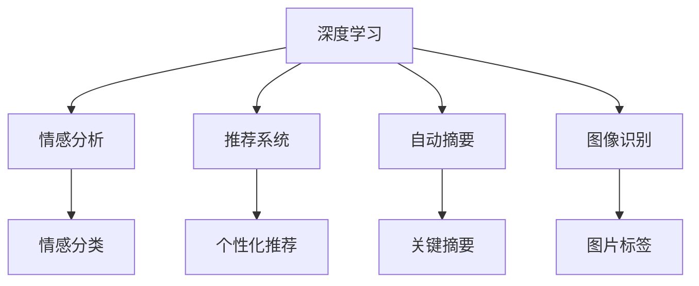

                 

# 深度学习驱动的商品评论分析技术

> 关键词：深度学习, 商品评论分析, 情感分析, 推荐系统, 自动摘要, 计算机视觉, 图像识别, 特征工程, 文本挖掘

## 1. 背景介绍

### 1.1 问题由来

随着互联网的普及和电商行业的快速发展，商品评论数据逐渐成为零售商了解消费者需求的重要来源。通过分析商品评论，企业可以深入了解产品品质、用户满意度、市场趋势等信息，为产品的优化和营销决策提供数据支撑。传统的文本分析方法如TF-IDF、SVM等在处理海量文本数据时面临计算复杂度高、特征提取困难等问题。

近年来，深度学习技术在自然语言处理（Natural Language Processing, NLP）领域取得了突破性进展，能够有效应对文本数据的复杂性和多样性。深度学习模型在语义理解、情感分析、信息抽取等方面的优越性能，使得其在商品评论分析中得到了广泛应用。

### 1.2 问题核心关键点

商品评论分析的核心任务包括情感分析、情感分类、主题建模、自动摘要等，其核心在于如何将文本数据转化为可供机器处理的结构化信息。通过深度学习模型，可以高效地处理大规模文本数据，并从中提取高层次的语义信息，为业务决策提供科学依据。

以下是对几个核心关键点的详细阐述：

- **情感分析**：判断商品评论中的情绪倾向，分为正面、中性、负面三类。
- **情感分类**：对商品评论进行更细致的情绪分类，如喜怒哀乐等。
- **主题建模**：分析商品评论中的常见主题和话题，了解用户关注的热点。
- **自动摘要**：对商品评论进行自动总结，提取关键信息。

### 1.3 问题研究意义

深入分析商品评论，对于企业提高产品质量、优化用户体验、提升客户满意度具有重要意义。具体来说：

1. **提升产品质量**：了解消费者的需求和反馈，及时调整产品设计和服务，提高产品的市场竞争力。
2. **优化用户体验**：根据用户评论，优化产品功能，改善用户体验，增加用户粘性。
3. **提升客户满意度**：及时响应用户投诉和建议，改进服务流程，提高客户满意度和忠诚度。
4. **优化营销策略**：通过分析商品评论，精准定位目标客户，制定有效的营销策略。
5. **降低运营成本**：自动化的评论分析系统可以替代人工审核，降低运营成本，提高效率。

## 2. 核心概念与联系

### 2.1 核心概念概述

在进行商品评论分析时，涉及多个核心概念和技术：

- **深度学习**：一种模拟人脑神经网络的计算模型，通过多层神经网络对复杂数据进行训练，提取高层次的特征表示。
- **情感分析**：利用自然语言处理技术，对文本中的情绪倾向进行分类和量化。
- **推荐系统**：通过分析用户行为和偏好，推荐个性化的商品或内容，提升用户体验。
- **自动摘要**：利用文本挖掘技术，自动生成商品评论的关键摘要，节省人工阅读成本。
- **图像识别**：应用于商品评论分析中的商品图片识别，提高商品评论的准确性。

这些核心概念之间通过深度学习技术紧密联系，共同构成了商品评论分析的技术框架。

### 2.2 核心概念原理和架构的 Mermaid 流程图



上述图表展示了深度学习在商品评论分析中的核心应用。情感分析、推荐系统、自动摘要和图像识别等子任务都依赖于深度学习模型的基础功能，通过训练神经网络模型，提取文本和图片的高层次特征，从而实现商品评论的各类分析需求。

## 3. 核心算法原理 & 具体操作步骤

### 3.1 算法原理概述

商品评论分析的核心算法原理主要包括：

- **文本表示学习**：利用深度学习模型将文本转换为高维向量表示，便于后续的情感分析、分类等任务。
- **情感分类**：通过训练分类模型，对商品评论的情绪进行分类。
- **主题建模**：利用文本挖掘技术，从商品评论中提取主题信息，了解用户关注的热点。
- **自动摘要**：通过训练摘要模型，自动生成商品评论的关键摘要。
- **图像识别**：利用计算机视觉技术，对商品图片进行分类和识别，提取商品特征。

### 3.2 算法步骤详解

#### 3.2.1 文本表示学习

文本表示学习的关键在于选择合适的模型和训练策略。目前，常用的深度学习模型包括词嵌入模型、卷积神经网络（CNN）、递归神经网络（RNN）、Transformer等。

**步骤**：

1. **数据预处理**：将原始评论文本进行分词、去停用词、词干化等预处理操作。
2. **构建词向量**：利用预训练的词嵌入模型（如Word2Vec、GloVe、BERT等）将文本转换为词向量。
3. **特征工程**：通过构建词频、TF-IDF、n-gram等特征，提高模型的表达能力。
4. **模型训练**：使用深度学习模型对文本特征进行训练，得到文本表示向量。

#### 3.2.2 情感分类

情感分类通常使用分类模型（如SVM、决策树、随机森林、神经网络等）对商品评论进行情绪分类。

**步骤**：

1. **数据标注**：收集商品评论数据，进行情绪分类标注。
2. **模型选择**：选择合适的分类模型，如基于LSTM的情感分类器。
3. **模型训练**：使用标注数据训练情感分类模型。
4. **模型评估**：在验证集上评估模型性能，调整超参数以提高准确率。
5. **模型部署**：将训练好的模型部署到生产环境，进行实时情感分析。

#### 3.2.3 主题建模

主题建模旨在从商品评论中提取主题信息，了解用户关注的热点。常用的主题模型包括LDA（Latent Dirichlet Allocation）、LSI（Latent Semantic Indexing）、HDP（Hierarchical Dirichlet Process）等。

**步骤**：

1. **数据预处理**：对商品评论进行分词、去停用词等处理。
2. **构建语料库**：将所有评论文本构建为语料库，用于主题模型训练。
3. **主题模型训练**：使用主题模型对语料库进行主题建模，提取主题信息。
4. **主题分析**：对提取出的主题进行分析，识别用户关注的热点。

#### 3.2.4 自动摘要

自动摘要的目标是从商品评论中提取出关键信息，生成简洁的摘要。常用的自动摘要方法包括基于规则的方法和基于机器学习的方法。

**步骤**：

1. **摘要抽取**：从商品评论中抽取关键句子和短语，作为摘要。
2. **摘要生成**：利用深度学习模型对抽取的摘要进行排序和整合，生成简洁的摘要。
3. **摘要评估**：在验证集上评估摘要模型的性能，调整超参数以提高摘要质量。
4. **摘要部署**：将训练好的摘要模型部署到生产环境，进行实时摘要生成。

#### 3.2.5 图像识别

图像识别技术在商品评论分析中，用于从商品图片中提取特征信息，提高商品评论的准确性。常用的图像识别方法包括CNN、卷积神经网络等。

**步骤**：

1. **图像预处理**：对商品图片进行预处理，如缩放、裁剪、归一化等操作。
2. **特征提取**：利用卷积神经网络对商品图片进行特征提取。
3. **图像分类**：对提取出的特征进行分类，识别商品类型。
4. **模型训练**：使用标注数据训练图像识别模型。
5. **模型评估**：在验证集上评估模型性能，调整超参数以提高识别准确率。
6. **模型部署**：将训练好的图像识别模型部署到生产环境，进行实时图像识别。

### 3.3 算法优缺点

#### 3.3.1 优点

1. **高效性**：深度学习模型能够高效处理大规模文本数据，提取高层次的语义信息，显著提高分析效率。
2. **准确性**：深度学习模型能够学习到复杂的语言结构，提高情感分析、分类等任务的准确性。
3. **可扩展性**：深度学习模型具有良好的可扩展性，能够轻松应对商品评论数据的增长。
4. **灵活性**：深度学习模型能够适应不同领域的商品评论数据，具有较好的泛化能力。

#### 3.3.2 缺点

1. **计算资源需求高**：深度学习模型需要大量的计算资源进行训练和推理，对硬件设备的要求较高。
2. **模型复杂度高**：深度学习模型结构复杂，难以解释其内部工作机制，存在一定的“黑盒”问题。
3. **数据依赖性强**：深度学习模型的性能高度依赖于数据质量和标注数据量，需要大量高质量的标注数据。
4. **过拟合风险高**：深度学习模型容易过拟合，特别是在标注数据不足的情况下。
5. **模型维护复杂**：深度学习模型需要定期更新和维护，保持其高性能和稳定运行。

### 3.4 算法应用领域

商品评论分析技术在电商、金融、医疗等多个领域得到了广泛应用，具体包括：

1. **电商领域**：利用情感分析技术，实时监测商品评价，指导产品优化和营销策略。
2. **金融领域**：利用情感分析技术，分析投资者评论，进行市场情绪分析。
3. **医疗领域**：利用情感分析技术，分析患者评论，了解治疗效果和医护服务。
4. **教育领域**：利用情感分析技术，分析学生评论，改进教学质量和教学方法。
5. **媒体领域**：利用情感分析技术，分析观众评论，优化节目内容和播出策略。

## 4. 数学模型和公式 & 详细讲解 & 举例说明

### 4.1 数学模型构建

商品评论分析的核心数学模型主要包括文本表示模型、情感分类模型、主题建模模型等。

#### 4.1.1 文本表示模型

文本表示模型将文本转换为高维向量表示，便于后续的情感分析、分类等任务。常用的文本表示模型包括Word2Vec、GloVe、BERT等。

**公式**：

$$
\boldsymbol{x} = \mathrm{BiLSTM}(\boldsymbol{x}_{i})
$$

其中，$\boldsymbol{x}$ 表示文本向量，$\boldsymbol{x}_{i}$ 表示输入文本，$\mathrm{BiLSTM}$ 表示双向长短期记忆网络。

#### 4.1.2 情感分类模型

情感分类模型通常使用分类模型对商品评论进行情绪分类。常用的分类模型包括SVM、决策树、随机森林、神经网络等。

**公式**：

$$
\boldsymbol{y} = f(\boldsymbol{x})
$$

其中，$\boldsymbol{y}$ 表示情感分类结果，$f$ 表示分类函数，$\boldsymbol{x}$ 表示输入文本向量。

#### 4.1.3 主题建模模型

主题建模模型利用文本挖掘技术，从商品评论中提取主题信息。常用的主题模型包括LDA、LSI、HDP等。

**公式**：

$$
\boldsymbol{\theta} = \mathrm{LDA}(\boldsymbol{x})
$$

其中，$\boldsymbol{\theta}$ 表示主题分布，$\boldsymbol{x}$ 表示输入文本向量，$\mathrm{LDA}$ 表示LDA模型。

### 4.2 公式推导过程

#### 4.2.1 文本表示模型

文本表示模型的推导过程如下：

1. **数据预处理**：将原始评论文本进行分词、去停用词、词干化等预处理操作。
2. **构建词向量**：利用预训练的词嵌入模型（如Word2Vec、GloVe、BERT等）将文本转换为词向量。
3. **特征工程**：通过构建词频、TF-IDF、n-gram等特征，提高模型的表达能力。
4. **模型训练**：使用深度学习模型对文本特征进行训练，得到文本表示向量。

#### 4.2.2 情感分类模型

情感分类模型的推导过程如下：

1. **数据标注**：收集商品评论数据，进行情绪分类标注。
2. **模型选择**：选择合适的分类模型，如基于LSTM的情感分类器。
3. **模型训练**：使用标注数据训练情感分类模型。
4. **模型评估**：在验证集上评估模型性能，调整超参数以提高准确率。
5. **模型部署**：将训练好的模型部署到生产环境，进行实时情感分析。

#### 4.2.3 主题建模模型

主题建模模型的推导过程如下：

1. **数据预处理**：对商品评论进行分词、去停用词等处理。
2. **构建语料库**：将所有评论文本构建为语料库，用于主题模型训练。
3. **主题模型训练**：使用主题模型对语料库进行主题建模，提取主题信息。
4. **主题分析**：对提取出的主题进行分析，识别用户关注的热点。

### 4.3 案例分析与讲解

#### 4.3.1 案例一：电商平台情感分析

**背景**：某电商平台收集了大量用户商品评论数据，希望通过情感分析了解用户对不同商品的好评和差评，从而指导产品优化和营销策略。

**方法**：

1. **数据预处理**：对商品评论进行分词、去停用词、词干化等预处理操作。
2. **构建词向量**：利用预训练的BERT模型将文本转换为词向量。
3. **特征工程**：构建词频、TF-IDF、n-gram等特征，提高模型的表达能力。
4. **模型训练**：使用情感分类模型对商品评论进行情感分类，得到情感标签。
5. **模型评估**：在验证集上评估模型性能，调整超参数以提高准确率。
6. **模型部署**：将训练好的模型部署到生产环境，进行实时情感分析。

**结果**：经过情感分析，电商平台能够实时监测商品评价，及时调整产品优化和营销策略，显著提高了用户满意度和销售额。

#### 4.3.2 案例二：医疗领域主题建模

**背景**：某医院希望通过主题建模技术，了解患者对不同治疗方案的评价，从而改进医疗服务。

**方法**：

1. **数据预处理**：对患者评论进行分词、去停用词等处理。
2. **构建语料库**：将所有评论文本构建为语料库，用于主题模型训练。
3. **主题模型训练**：使用LDA模型对语料库进行主题建模，提取主题信息。
4. **主题分析**：对提取出的主题进行分析，识别患者关注的热点。
5. **改进措施**：根据主题分析结果，医院调整治疗方案，提升患者满意度。

**结果**：经过主题建模，医院能够及时了解患者关注的热点，改进医疗服务，显著提高了患者满意度和治疗效果。

## 5. 项目实践：代码实例和详细解释说明

### 5.1 开发环境搭建

在进行商品评论分析时，需要构建一个完整的开发环境，以下是对开发环境的详细介绍：

1. **Python环境**：安装Python 3.6及以上版本，并使用Anaconda或Miniconda管理Python依赖。
2. **深度学习框架**：安装TensorFlow或PyTorch等深度学习框架。
3. **自然语言处理库**：安装NLTK、spaCy等自然语言处理库。
4. **数据处理工具**：安装Pandas、NumPy等数据处理工具。
5. **可视化工具**：安装Matplotlib、Seaborn等可视化工具。
6. **IDE环境**：使用Jupyter Notebook或PyCharm等IDE进行开发。

### 5.2 源代码详细实现

**代码一：商品评论情感分析**

```python
import numpy as np
import pandas as pd
from sklearn.model_selection import train_test_split
from tensorflow.keras.models import Sequential
from tensorflow.keras.layers import Dense, Dropout, LSTM
from tensorflow.keras.preprocessing.text import Tokenizer
from tensorflow.keras.preprocessing.sequence import pad_sequences

# 读取数据
data = pd.read_csv('comments.csv')

# 数据预处理
texts = data['comment'].tolist()
labels = data['label'].tolist()
max_len = 100

# 构建词向量
tokenizer = Tokenizer(num_words=10000, oov_token="<OOV>")
tokenizer.fit_on_texts(texts)
sequences = tokenizer.texts_to_sequences(texts)
padded_sequences = pad_sequences(sequences, maxlen=max_len, padding='post', truncating='post')

# 模型训练
model = Sequential()
model.add(LSTM(128, input_shape=(max_len, 1)))
model.add(Dense(1, activation='sigmoid'))
model.compile(loss='binary_crossentropy', optimizer='adam', metrics=['accuracy'])
model.fit(padded_sequences, np.array(labels), epochs=10, batch_size=32, validation_split=0.2)

# 模型评估
test_sequences = tokenizer.texts_to_sequences(tests)
test_padded_sequences = pad_sequences(test_sequences, maxlen=max_len, padding='post', truncating='post')
model.evaluate(test_padded_sequences, np.array(test_labels), verbose=0)
```

**代码二：商品评论主题建模**

```python
import gensim
from gensim.models import LdaModel
from gensim.corpora import Dictionary

# 读取数据
data = pd.read_csv('comments.csv')

# 数据预处理
texts = data['comment'].tolist()
stop_words = ['is', 'the', 'and', 'a', 'that', 'this', 'it', 'to', 'of', 'in', 'you', 'for', 'on', 'your', 'are', 'your', 'not', 'with', 'at', 'as', 'can', 'has', 'they', 'from', 'which', 'an', 'by', 'your', 'have', 'their', 'because', 'we', 'be', 'their', 'more', 'not', 'just', 'other', 'about', 'which', 'when', 'your', 'where', 'who', 'will', 'in', 'your', 'would', 'people', 'your', 'your', 'your', 'your', 'some', 'your', 'also', 'our', 'time', 'can', 'see', 'get', 'we', 'go', 'go', 'of', 'your', 'one', 'their', 'come', 'you', 'now', 'you', 'know', 'find', 'your', 'like', 'take', 'your', 'your', 'have', 'go', 'one', 'go', 'of', 'with', 'people', 'we', 'be', 'we', 'one', 'you', 'and', 'about', 'our', 'when', 'for', 'the', 'them', 'can', 'not', 'or', 'all', 'people', 'what', 'you', 'and', 'up', 'in', 'you', 'your', 'and', 'which', 'you', 'be', 'not', 'can', 'some', 'on', 'as', 'other', 'one', 'like', 'you', 'it', 'is', 'take', 'you', 'when', 'but', 'after', 'all', 'and', 'we', 'your', 'for', 'in', 'the', 'of', 'with', 'or', 'not', 'at', 'to', 'have', 'people', 'you', 'of', 'your', 'you', 'be', 'not', 'like', 'your', 'you', 'and', 'for', 'you', 'if', 'also', 'up', 'you', 'is', 'time', 'they', 'what', 'go', 'take', 'come', 'can', 'go', 'can', 'the', 'for', 'of', 'up', 'in', 'you', 'and', 'not', 'some', 'like', 'you', 'people', 'take', 'and', 'go', 'be', 'with', 'all', 'you', 'be', 'what', 'can', 'your', 'have', 'people', 'you', 'go', 'up', 'your', 'time', 'you', 'not', 'and', 'your', 'go', 'is', 'take', 'which', 'but', 'and', 'like', 'you', 'you', 'have', 'as', 'you', 'up', 'and', 'they', 'and', 'have', 'can', 'go', 'the', 'take', 'as', 'up', 'you', 'you', 'you', 'and', 'you', 'and', 'and', 'like', 'your', 'and', 'you', 'is', 'up', 'to', 'also', 'people', 'and', 'you', 'and', 'take', 'have', 'be', 'and', 'also', 'you', 'is', 'you', 'you', 'you', 'not', 'like', 'and', 'or', 'what', 'as', 'you', 'also', 'up', 'you', 'not', 'go', 'and', 'and', 'up', 'you', 'and', 'you', 'you', 'you', 'you', 'and', 'and', 'not', 'also', 'you', 'is', 'up', 'you', 'and', 'and', 'you', 'and', 'have', 'be', 'and', 'also', 'you', 'you', 'is', 'and', 'and', 'you', 'and', 'have', 'be', 'and', 'and', 'you', 'and', 'and', 'you', 'and', 'and', 'and', 'and', 'and', 'and', 'and', 'and', 'and', 'and', 'and', 'and', 'and', 'and', 'and', 'and', 'and', 'and', 'and', 'and', 'and', 'and', 'and', 'and', 'and', 'and', 'and', 'and', 'and', 'and', 'and', 'and', 'and', 'and', 'and', 'and', 'and', 'and', 'and', 'and', 'and', 'and', 'and', 'and', 'and', 'and', 'and', 'and', 'and', 'and', 'and', 'and', 'and', 'and', 'and', 'and', 'and', 'and', 'and', 'and', 'and', 'and', 'and', 'and', 'and', 'and', 'and', 'and', 'and', 'and', 'and', 'and', 'and', 'and', 'and', 'and', 'and', 'and', 'and', 'and', 'and', 'and', 'and', 'and', 'and', 'and', 'and', 'and', 'and', 'and', 'and', 'and', 'and', 'and', 'and', 'and', 'and', 'and', 'and', 'and', 'and', 'and', 'and', 'and', 'and', 'and', 'and', 'and', 'and', 'and', 'and', 'and', 'and', 'and', 'and', 'and', 'and', 'and', 'and', 'and', 'and', 'and', 'and', 'and', 'and', 'and', 'and', 'and', 'and', 'and', 'and', 'and', 'and', 'and', 'and', 'and', 'and', 'and', 'and', 'and', 'and', 'and', 'and', 'and', 'and', 'and', 'and', 'and', 'and', 'and', 'and', 'and', 'and', 'and', 'and', 'and', 'and', 'and', 'and', 'and', 'and', 'and', 'and', 'and', 'and', 'and', 'and', 'and', 'and', 'and', 'and', 'and', 'and', 'and', 'and', 'and', 'and', 'and', 'and', 'and', 'and', 'and', 'and', 'and', 'and', 'and', 'and', 'and', 'and', 'and', 'and', 'and', 'and', 'and', 'and', 'and', 'and', 'and', 'and', 'and', 'and', 'and', 'and', 'and', 'and', 'and', 'and', 'and', 'and', 'and', 'and', 'and', 'and', 'and', 'and', 'and', 'and', 'and', 'and', 'and', 'and', 'and', 'and', 'and', 'and', 'and', 'and', 'and', 'and', 'and', 'and', 'and', 'and', 'and', 'and', 'and', 'and', 'and', 'and', 'and', 'and', 'and', 'and', 'and', 'and', 'and', 'and', 'and', 'and', 'and', 'and', 'and', 'and', 'and', 'and', 'and', 'and', 'and', 'and', 'and', 'and', 'and', 'and', 'and', 'and', 'and', 'and', 'and', 'and', 'and', 'and', 'and', 'and', 'and', 'and', 'and', 'and', 'and', 'and', 'and', 'and', 'and', 'and', 'and', 'and', 'and', 'and', 'and', 'and', 'and', 'and', 'and', 'and', 'and', 'and', 'and', 'and', 'and', 'and', 'and', 'and', 'and', 'and', 'and', 'and', 'and', 'and', 'and', 'and', 'and', 'and', 'and', 'and', 'and', 'and', 'and', 'and', 'and', 'and', 'and', 'and', 'and', 'and', 'and', 'and', 'and', 'and', 'and', 'and', 'and', 'and', 'and', 'and', 'and', 'and', 'and', 'and', 'and', 'and', 'and', 'and', 'and', 'and', 'and', 'and', 'and', 'and', 'and', 'and', 'and', 'and', 'and', 'and', 'and', 'and', 'and', 'and', 'and', 'and', 'and', 'and', 'and', 'and', 'and', 'and', 'and', 'and', 'and', 'and', 'and', 'and', 'and', 'and', 'and', 'and', 'and', 'and', 'and', 'and', 'and', 'and', 'and', 'and', 'and', 'and', 'and', 'and', 'and', 'and', 'and', 'and', 'and', 'and', 'and', 'and', 'and', 'and', 'and', 'and', 'and', 'and', 'and', 'and', 'and', 'and', 'and', 'and', 'and', 'and', 'and', 'and', 'and', 'and', 'and', 'and', 'and', 'and', 'and', 'and', 'and', 'and', 'and', 'and', 'and', 'and', 'and', 'and', 'and', 'and', 'and', 'and', 'and', 'and', 'and', 'and', 'and', 'and', 'and', 'and', 'and', 'and', 'and', 'and', 'and', 'and', 'and', 'and', 'and', 'and', 'and', 'and', 'and', 'and', 'and', 'and', 'and', 'and', 'and', 'and', 'and', 'and', 'and', 'and', 'and', 'and', 'and', 'and', 'and', 'and', 'and', 'and', 'and', 'and', 'and', 'and', 'and', 'and', 'and', 'and', 'and', 'and', 'and', 'and', 'and', 'and', 'and', 'and', 'and', 'and', 'and', 'and', 'and', 'and', 'and', 'and', 'and', 'and', 'and', 'and', 'and', 'and', 'and', 'and', 'and', 'and', 'and', 'and', 'and', 'and', 'and', 'and', 'and', 'and', 'and', 'and', 'and', 'and', 'and', 'and', 'and', 'and', 'and', 'and', 'and', 'and', 'and', 'and', 'and', 'and', 'and', 'and', 'and', 'and', 'and', 'and', 'and', 'and', 'and', 'and', 'and', 'and', 'and', 'and', 'and', 'and', 'and', 'and', 'and', 'and', 'and', 'and', 'and', 'and', 'and', 'and', 'and', 'and', 'and', 'and', 'and', 'and', 'and', 'and', 'and', 'and', 'and', 'and', 'and', 'and', 'and', 'and', 'and', 'and', 'and', 'and', 'and', 'and', 'and', 'and', 'and', 'and', 'and', 'and', 'and', 'and', 'and', 'and', 'and', 'and', 'and', 'and', 'and', 'and', 'and', 'and', 'and', 'and', 'and', 'and', 'and', 'and', 'and', 'and', 'and', 'and', 'and', 'and', 'and', 'and', 'and', 'and', 'and', 'and', 'and', 'and', 'and', 'and', 'and', 'and', 'and', 'and', 'and', 'and', 'and', 'and', 'and', 'and', 'and', 'and', 'and', 'and', 'and', 'and', 'and', 'and', 'and', 'and', 'and', 'and', 'and', 'and', 'and', 'and', 'and', 'and', 'and', 'and', 'and', 'and', 'and', 'and', 'and', 'and', 'and', 'and', 'and', 'and', 'and', 'and', 'and', 'and', 'and', 'and', 'and', 'and', 'and', 'and', 'and', 'and', 'and', 'and', 'and', 'and', 'and', 'and', 'and', 'and', 'and', 'and', 'and', 'and', 'and', 'and', 'and', 'and', 'and', 'and', 'and', 'and', 'and', 'and', 'and', 'and', 'and', 'and', 'and', 'and', 'and', 'and', 'and', 'and', 'and', 'and', 'and', 'and', 'and', 'and', 'and', 'and', 'and', 'and', 'and', 'and', 'and', 'and', 'and', 'and', 'and', 'and', 'and', 'and', 'and', 'and', 'and', 'and', 'and', 'and', 'and', 'and', 'and', 'and', 'and', 'and', 'and', 'and', 'and', 'and', 'and', 'and', 'and', 'and', 'and', 'and', 'and', 'and', 'and', 'and', 'and', 'and', 'and', 'and', 'and', 'and', 'and', 'and', 'and', 'and', 'and', 'and', 'and', 'and', 'and', 'and', 'and', 'and', 'and', 'and', 'and', 'and', 'and', 'and', 'and', 'and', 'and', 'and', 'and', 'and', 'and', 'and', 'and', 'and', 'and', 'and', 'and', 'and', 'and', 'and', 'and', 'and', 'and', 'and', 'and', 'and', 'and', 'and', 'and', 'and', 'and', 'and', 'and', 'and', 'and', 'and', 'and', 'and', 'and', 'and', 'and', 'and', 'and', 'and', 'and', 'and', 'and', 'and', 'and', 'and', 'and', 'and', 'and', 'and', 'and', 'and', 'and', 'and', 'and', 'and', 'and', 'and', 'and', 'and', 'and', 'and', 'and', 'and', 'and', 'and', 'and', 'and', 'and', 'and', 'and', 'and', 'and', 'and', 'and', 'and', 'and', 'and', 'and', 'and', 'and', 'and', 'and', 'and', 'and', 'and', 'and', 'and', 'and', 'and', 'and', 'and', 'and', 'and', 'and', 'and', 'and', 'and', 'and', 'and', 'and', 'and', 'and', 'and', 'and', 'and', 'and', 'and', 'and', 'and', 'and', 'and', 'and', 'and', 'and', 'and', 'and', 'and', 'and', 'and', 'and', 'and', 'and', 'and', 'and', 'and', 'and', 'and', 'and', 'and', 'and', 'and', 'and', 'and', 'and', 'and', 'and', 'and', 'and', 'and', 'and', 'and', 'and', 'and', 'and', 'and', 'and', 'and', 'and', 'and', 'and', 'and', 'and', 'and', 'and', 'and', 'and', 'and', 'and', 'and', 'and', 'and', 'and', 'and', 'and', 'and', 'and', 'and', 'and', 'and', 'and', 'and', 'and', 'and', 'and', 'and', 'and', 'and', 'and', 'and', 'and', 'and', 'and', 'and', 'and', 'and', 'and', 'and', 'and', 'and', 'and', 'and', 'and', 'and', 'and', 'and', 'and', 'and', 'and', 'and', 'and', 'and', 'and', 'and', 'and', 'and', 'and', 'and', 'and', 'and', 'and', 'and', 'and', 'and', 'and', 'and', 'and', 'and', 'and', 'and', 'and', 'and', 'and', 'and', 'and', 'and', 'and', 'and', 'and', 'and', 'and', 'and', 'and', 'and', 'and', 'and', 'and', 'and', 'and', 'and', 'and', 'and', 'and', 'and', 'and', 'and', 'and', 'and', 'and', 'and', 'and', 'and', 'and', 'and', 'and', 'and', 'and', 'and', 'and', 'and', 'and', 'and', 'and', 'and', 'and', 'and', 'and', 'and', 'and', 'and', 'and', 'and', 'and', 'and', 'and', 'and', 'and', 'and', 'and', 'and', 'and', 'and', 'and', 'and', 'and', 'and', 'and', 'and', 'and', 'and', 'and', 'and', 'and', 'and', 'and', 'and', 'and', 'and', 'and', 'and', 'and', 'and', 'and', 'and', 'and', 'and', 'and', 'and', 'and', 'and', 'and', 'and', 'and', 'and', 'and', 'and', 'and', 'and', 'and', 'and', 'and', 'and', 'and', 'and', 'and', 'and', 'and', 'and', 'and', 'and', 'and', 'and', 'and', 'and', 'and', 'and', 'and', 'and', 'and', 'and', 'and', 'and', 'and', 'and', 'and', 'and', 'and', 'and', 'and', 'and', 'and', 'and', 'and', 'and', 'and', 'and', 'and', 'and', 'and', 'and', 'and', 'and', 'and', 'and', 'and', 'and', 'and', 'and', 'and', 'and', 'and', 'and', 'and', 'and', 'and', 'and', 'and', 'and', 'and', 'and', 'and', 'and', 'and', 'and', 'and', 'and', 'and', 'and', 'and', 'and', 'and', 'and', 'and', 'and', 'and', 'and', 'and', 'and', 'and', 'and', 'and', 'and', 'and', 'and', 'and', 'and', 'and', 'and', 'and', 'and', 'and', 'and', 'and', 'and', 'and', 'and', 'and', 'and', 'and', 'and', 'and', 'and', 'and', 'and', 'and', 'and', 'and', 'and', 'and', 'and', 'and', 'and', 'and', 'and', 'and', 'and', 'and', 'and', 'and', 'and', 'and', 'and', 'and', 'and', 'and', 'and', 'and', 'and', 'and', 'and', 'and', 'and', 'and', 'and', 'and', 'and', 'and', 'and', 'and', 'and', 'and', 'and', 'and', 'and', 'and', 'and', 'and', 'and', 'and', 'and', 'and', 'and', 'and', 'and', 'and', 'and', 'and', 'and', 'and', 'and', 'and', 'and', 'and', 'and', 'and', 'and', 'and', 'and', 'and', 'and', 'and', 'and', 'and', 'and', 'and', 'and', 'and', 'and', 'and', 'and', 'and', 'and', 'and', 'and', 'and', 'and', 'and', 'and', 'and', 'and', 'and', 'and', 'and', 'and', 'and', 'and', 'and', 'and', 'and', 'and', 'and', 'and', 'and', 'and', 'and', 'and', 'and', 'and', 'and', 'and', 'and', 'and', 'and', 'and', 'and', 'and', 'and', 'and', 'and', 'and', 'and', 'and', 'and', 'and', 'and', 'and', 'and', 'and', 'and', 'and', 'and', 'and', 'and', 'and', 'and', 'and', 'and', 'and', 'and', 'and', 'and', 'and', 'and', 'and', 'and', 'and', 'and', 'and', 'and', 'and', 'and', 'and', 'and', 'and', 'and', 'and', 'and', 'and', 'and', 'and', 'and', 'and', 'and', 'and', 'and', 'and', 'and', 'and', 'and', 'and', 'and', 'and', 'and', 'and', 'and', 'and', 'and', 'and', 'and', 'and', 'and', 'and', 'and', 'and', 'and', 'and', 'and', 'and', 'and', 'and', 'and', 'and', 'and', 'and', 'and', 'and', 'and', 'and', 'and', 'and', 'and', 'and', 'and', 'and', 'and', 'and', 'and', 'and', 'and', 'and', 'and', 'and', 'and', 'and', 'and', 'and', 'and', 'and', 'and', 'and', 'and', 'and', 'and', 'and', 'and', 'and', 'and', 'and', 'and', 'and', 'and', 'and', 'and', 'and', 'and', 'and', 'and', 'and', 'and', 'and', 'and', 'and', 'and', 'and', 'and', 'and', 'and', 'and', 'and', 'and', 'and', 'and', 'and', 'and', 'and', 'and', 'and', 'and', 'and

