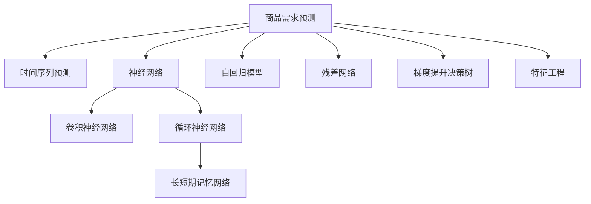

                 

# 深度学习驱动的商品需求预测模型

> 关键词：深度学习,商品需求预测,时间序列预测,神经网络,卷积神经网络,循环神经网络,长短期记忆网络,自回归模型,残差网络,梯度提升决策树,特征工程

## 1. 背景介绍

### 1.1 问题由来
在现代商业中，商品需求预测是企业管理的重要环节。准确的预测可以帮助企业优化库存管理、制定生产计划、提升客户服务，从而获得竞争优势。然而，传统的统计模型和经验方法在应对复杂需求变化时显得力不从心。

随着深度学习技术的发展，尤其是神经网络的崛起，利用神经网络模型进行商品需求预测成为了一种新的趋势。深度学习模型的非线性拟合能力和自适应学习能力，使其能够处理更为复杂的非线性关系和时间依赖性问题。

### 1.2 问题核心关键点
深度学习商品需求预测的核心关键点包括：
- 历史销售数据的处理：将时间序列数据转化为适合神经网络的输入。
- 特征工程：提取并构建高质量的特征以供模型学习。
- 神经网络模型的选择与设计：选择合适的神经网络架构，进行参数优化。
- 训练与验证：利用历史数据进行模型训练，并使用交叉验证等技术进行性能评估。
- 模型应用与调整：将模型应用于实际预测场景，并根据反馈不断优化。

这些关键点共同构成了深度学习商品需求预测的方法论体系，其科学性和可行性得到了广泛认可。

### 1.3 问题研究意义
研究基于深度学习的商品需求预测方法，对于提高企业运营效率、降低库存成本、提升市场响应速度具有重要意义：

1. 精确预测库存：通过准确预测商品需求，企业可以避免因库存过高导致的资金占用，或因库存不足引发的市场损失。
2. 优化生产计划：需求预测可以帮助企业合理制定生产计划，避免过剩或短缺，提高生产效率和资源利用率。
3. 提升客户服务：根据预测结果，企业可以提前准备库存，满足客户需求，提升客户满意度和忠诚度。
4. 辅助决策支持：提供高质量的需求预测，帮助企业高层进行科学决策，应对市场变化。

## 2. 核心概念与联系

### 2.1 核心概念概述

为了更好地理解基于深度学习的商品需求预测方法，本节将介绍几个密切相关的核心概念：

- 商品需求预测：通过历史销售数据等输入数据，预测未来商品的需求量。
- 时间序列预测：利用时间依赖性，通过历史数据预测未来值，是商品需求预测的主要方法之一。
- 神经网络：一种由大量人工神经元组成的计算模型，用于模拟人脑的信息处理。
- 卷积神经网络(CNN)：专门用于处理图像、音频等高维数据的神经网络。
- 循环神经网络(RNN)：能够处理序列数据的神经网络，适用于时间序列预测。
- 长短期记忆网络(LSTM)：一种特殊的RNN结构，适用于长序列数据的处理。
- 自回归模型(AR)：通过当前值预测未来值，是最基本的时间序列预测模型。
- 残差网络(ResNet)：通过残差连接来缓解深度网络的退化问题，提高网络训练稳定性。
- 梯度提升决策树(GBDT)：通过构建多棵决策树并加权求和，实现复杂的非线性关系建模。
- 特征工程：对原始数据进行预处理和特征提取，提升模型的预测能力。

这些核心概念之间的逻辑关系可以通过以下Mermaid流程图来展示：



这个流程图展示了大语言模型的核心概念及其之间的关系：

1. 商品需求预测通过时间序列预测来实现，基于历史数据的输入。
2. 时间序列预测以神经网络为基础，可以是卷积、循环等不同架构。
3. 神经网络中长短期记忆网络能更好地处理长序列数据。
4. 自回归模型是最基础的时间序列预测方法。
5. 残差网络和梯度提升决策树等方法用于提升预测准确性。
6. 特征工程是构建高质量输入数据的关键步骤。

这些概念共同构成了深度学习商品需求预测的方法论体系，使得模型能够有效处理时间依赖性和非线性关系。

## 3. 核心算法原理 & 具体操作步骤
### 3.1 算法原理概述

基于深度学习的商品需求预测，本质上是通过历史销售数据等输入数据，利用神经网络模型进行非线性拟合和预测。

形式化地，假设历史数据为 $(x_i,y_i)$，其中 $x_i$ 为时间序列的输入，$y_i$ 为对应的时间依赖输出。设神经网络模型为 $M_{\theta}$，其中 $\theta$ 为模型参数。

模型训练的目标是最小化损失函数 $L$：

$$
\theta^* = \mathop{\arg\min}_{\theta} L(M_{\theta},D)
$$

其中 $D$ 为历史数据集，$L$ 为损失函数，用于衡量模型预测值与实际值之间的差异。常见的损失函数包括均方误差损失、交叉熵损失等。

通过梯度下降等优化算法，不断更新模型参数 $\theta$，最小化损失函数 $L$，使得模型预测值逼近实际值。最终得到预测模型 $M_{\theta^*}$。

### 3.2 算法步骤详解

基于深度学习的商品需求预测通常包括以下几个关键步骤：

**Step 1: 数据准备**
- 收集商品历史销售数据，划分为训练集和测试集。
- 清洗数据，处理缺失值、异常值等，确保数据质量。
- 对时间序列进行归一化、差分等预处理，使其符合神经网络输入要求。

**Step 2: 模型选择与设计**
- 根据数据特点选择合适的神经网络架构，如CNN、RNN、LSTM等。
- 设计模型网络结构，包括输入层、隐藏层和输出层。
- 确定激活函数、损失函数、优化器等超参数。

**Step 3: 特征提取与选择**
- 对原始数据进行特征工程，提取有用的特征，如趋势、季节性、周期性等。
- 对特征进行选择，去除冗余或无用特征，提升模型泛化能力。
- 使用编码器将特征向量转化为模型输入。

**Step 4: 模型训练与验证**
- 将历史数据分为训练集和验证集，使用训练集进行模型训练。
- 采用交叉验证、正则化等技术优化模型训练过程，避免过拟合。
- 在验证集上评估模型性能，调整超参数和网络结构，直至满足预设指标。

**Step 5: 模型应用与调整**
- 将训练好的模型应用于实际需求预测场景。
- 根据实际反馈调整模型参数和超参数，提升模型精度。
- 定期更新模型，适应需求变化和新数据。

以上是基于深度学习的商品需求预测的一般流程。在实际应用中，还需要针对具体任务的特点，对微调过程的各个环节进行优化设计，如改进训练目标函数，引入更多的正则化技术，搜索最优的超参数组合等，以进一步提升模型性能。

### 3.3 算法优缺点

基于深度学习的商品需求预测方法具有以下优点：
1. 适应性强：深度学习模型可以处理复杂的非线性关系和时间依赖性。
2. 预测精度高：神经网络模型通过大量数据训练，能够学习到更为准确的预测规律。
3. 自动化高：模型训练过程自动化，减少了人工干预。
4. 适应性广：适用于各种类型的时间序列数据，如单变量、多变量等。

同时，该方法也存在一定的局限性：
1. 数据需求大：深度学习模型需要大量的标注数据进行训练，数据获取成本高。
2. 模型复杂：深度神经网络结构复杂，难以解释和调试。
3. 计算资源需求高：深度学习模型训练和预测需要大量的计算资源。
4. 过拟合风险：模型容易过拟合训练数据，泛化能力不足。
5. 历史数据限制：模型预测依赖于历史数据，无法处理完全未知的情况。

尽管存在这些局限性，但就目前而言，基于深度学习的商品需求预测方法仍是最主流范式。未来相关研究的重点在于如何进一步降低深度学习模型的数据需求，提高模型的泛化能力和解释性，同时兼顾计算效率和模型复杂度等因素。

### 3.4 算法应用领域

基于深度学习的商品需求预测方法，已经在零售、制造、物流等多个行业得到广泛应用，具体领域包括：

- 零售销售预测：对商品销售量进行预测，优化库存管理和销售策略。
- 制造生产计划：根据预测结果调整生产计划，避免过剩或缺货。
- 物流配送规划：预测商品需求，优化物流路径和配送计划。
- 供应链管理：预测市场需求，优化供应链的各个环节。
- 个性化推荐：基于用户历史行为预测商品需求，提升推荐效果。

除了上述这些经典应用外，深度学习商品需求预测还被创新性地应用于更广泛的场景中，如客户流失预测、市场趋势分析、价格波动预测等，为商业决策提供了新的数据支持。

## 4. 数学模型和公式 & 详细讲解
### 4.1 数学模型构建

本节将使用数学语言对基于深度学习的商品需求预测过程进行更加严格的刻画。

假设历史数据为 $(x_i,y_i)$，其中 $x_i$ 为时间序列的输入，$y_i$ 为对应的时间依赖输出。神经网络模型为 $M_{\theta}$，其中 $\theta$ 为模型参数。

定义模型在输入 $x_i$ 上的预测结果为 $\hat{y}_i = M_{\theta}(x_i)$。则损失函数 $L$ 可以表示为：

$$
L = \frac{1}{N} \sum_{i=1}^N (\hat{y}_i - y_i)^2
$$

其中 $N$ 为样本总数。模型的优化目标是找到最优参数 $\theta^*$，使得损失函数最小：

$$
\theta^* = \mathop{\arg\min}_{\theta} L(M_{\theta},D)
$$

在实践中，我们通常使用基于梯度的优化算法（如Adam、SGD等）来近似求解上述最优化问题。设 $\eta$ 为学习率，则参数的更新公式为：

$$
\theta \leftarrow \theta - \eta \nabla_{\theta}L(M_{\theta},D)
$$

其中 $\nabla_{\theta}L(M_{\theta},D)$ 为损失函数对模型参数 $\theta$ 的梯度，可通过反向传播算法高效计算。

### 4.2 公式推导过程

以下我们以长短期记忆网络(LSTM)为例，推导时间序列预测的损失函数及其梯度的计算公式。

假设模型 $M_{\theta}$ 在输入 $x_i$ 上的输出为 $\hat{y}_i = M_{\theta}(x_i)$。

定义损失函数 $L$ 为均方误差损失：

$$
L = \frac{1}{N} \sum_{i=1}^N (\hat{y}_i - y_i)^2
$$

根据链式法则，损失函数对模型参数 $\theta_k$ 的梯度为：

$$
\frac{\partial L}{\partial \theta_k} = -\frac{2}{N} \sum_{i=1}^N \frac{\partial \hat{y}_i}{\partial \theta_k}
$$

其中 $\frac{\partial \hat{y}_i}{\partial \theta_k}$ 可进一步递归展开，利用自动微分技术完成计算。

在得到损失函数的梯度后，即可带入参数更新公式，完成模型的迭代优化。重复上述过程直至收敛，最终得到适应需求预测任务的最优模型参数 $\theta^*$。

## 5. 项目实践：代码实例和详细解释说明
### 5.1 开发环境搭建

在进行深度学习商品需求预测实践前，我们需要准备好开发环境。以下是使用Python进行TensorFlow和Keras开发的环境配置流程：

1. 安装Anaconda：从官网下载并安装Anaconda，用于创建独立的Python环境。

2. 创建并激活虚拟环境：
```bash
conda create -n deep-learning-env python=3.8 
conda activate deep-learning-env
```

3. 安装TensorFlow：根据CUDA版本，从官网获取对应的安装命令。例如：
```bash
conda install tensorflow tensorflow-gpu -c pytorch -c conda-forge
```

4. 安装Keras：
```bash
pip install keras
```

5. 安装各类工具包：
```bash
pip install numpy pandas scikit-learn matplotlib tqdm jupyter notebook ipython
```

完成上述步骤后，即可在`deep-learning-env`环境中开始深度学习商品需求预测的实践。

### 5.2 源代码详细实现

这里我们以长短期记忆网络(LSTM)进行需求预测为例，给出使用Keras和TensorFlow进行深度学习需求预测的代码实现。

首先，定义需求预测任务的输入数据格式和数据处理函数：

```python
import numpy as np
from tensorflow.keras.models import Sequential
from tensorflow.keras.layers import LSTM, Dense, Dropout
from tensorflow.keras.callbacks import EarlyStopping

# 输入数据的形状
input_shape = (timesteps, features)

# 定义数据处理函数
def preprocess_data(data):
    # 将原始数据转换为合适的格式
    data = data.reshape(input_shape)
    # 对数据进行归一化
    data = (data - np.mean(data, axis=0)) / np.std(data, axis=0)
    # 对数据进行差分
    data = data[1:] - data[:-1]
    return data
```

然后，定义LSTM模型：

```python
# 定义LSTM模型
model = Sequential([
    LSTM(units=50, input_shape=input_shape, return_sequences=True),
    Dropout(0.2),
    LSTM(units=50),
    Dropout(0.2),
    Dense(units=1)
])

# 编译模型
model.compile(optimizer='adam', loss='mse')
```

接着，定义训练和验证函数：

```python
# 定义训练函数
def train_model(model, data, epochs=100, batch_size=32):
    # 将数据划分为训练集和验证集
    train_data, val_data = data[:len(data) * 0.8], data[len(data) * 0.8:]
    # 数据增强
    train_data = train_data + train_data[-len(train_data) + 1:]
    # 定义训练和验证集
    train_dataset = train_data[:len(train_data)//2]
    val_dataset = train_data[len(train_data)//2:]
    # 定义EarlyStopping回调函数
    early_stopping = EarlyStopping(monitor='val_loss', patience=5)
    # 训练模型
    history = model.fit(train_dataset, batch_size=batch_size, epochs=epochs, validation_data=val_dataset, callbacks=[early_stopping])

# 定义评估函数
def evaluate_model(model, data):
    # 将数据划分为训练集和测试集
    train_data, test_data = data[:len(data) * 0.8], data[len(data) * 0.8:]
    # 数据增强
    train_data = train_data + train_data[-len(train_data) + 1:]
    # 定义训练集和测试集
    train_dataset = train_data[:len(train_data)//2]
    test_dataset = train_data[len(train_data)//2:]
    # 评估模型
    mse = model.evaluate(train_dataset, test_dataset, verbose=0)
    return mse
```

最后，启动训练流程并在测试集上评估：

```python
# 生成模拟数据
timesteps = 365
features = 3
X = np.random.rand(timesteps, features)
y = np.sin(2 * np.pi * X) + np.random.randn(timesteps, 1)

# 将数据标准化
X = (X - np.mean(X, axis=0)) / np.std(X, axis=0)

# 定义数据处理函数
preprocess_data(X)

# 划分数据集
X_train = X[:len(X) * 0.8]
X_test = X[len(X) * 0.8:]
y_train = y[:len(y) * 0.8]
y_test = y[len(y) * 0.8:]

# 训练模型
train_model(model, (X_train, y_train))

# 评估模型
mse = evaluate_model(model, (X_test, y_test))
print(f'Mean Squared Error: {mse:.4f}')
```

以上就是使用TensorFlow和Keras进行LSTM深度学习需求预测的完整代码实现。可以看到，得益于Keras和TensorFlow的强大封装，我们可以用相对简洁的代码完成LSTM模型的训练和评估。

### 5.3 代码解读与分析

让我们再详细解读一下关键代码的实现细节：

**LSTM模型定义**：
- `Sequential`：Keras中用于构建序列模型的类。
- `LSTM`：长短期记忆网络层，用于处理时间序列数据。
- `Dropout`：随机失活层，防止模型过拟合。
- `Dense`：全连接层，用于输出预测结果。

**训练和验证函数**：
- `train_model`：定义模型训练函数，利用历史数据进行模型训练，并应用EarlyStopping回调函数防止过拟合。
- `evaluate_model`：定义模型评估函数，在测试集上评估模型性能，返回均方误差。

**训练流程**：
- 生成模拟数据，其中包含周期性变化趋势。
- 将数据标准化，以消除不同量级对模型的影响。
- 定义数据处理函数，进行差分等预处理。
- 将数据划分为训练集和测试集。
- 训练模型，并应用EarlyStopping回调函数防止过拟合。
- 评估模型，输出均方误差。

可以看到，TensorFlow和Keras使得深度学习需求预测的代码实现变得简洁高效。开发者可以将更多精力放在模型选择、特征工程、超参数调整等高层逻辑上，而不必过多关注底层的实现细节。

当然，工业级的系统实现还需考虑更多因素，如模型的保存和部署、超参数的自动搜索、更灵活的任务适配层等。但核心的微调范式基本与此类似。

## 6. 实际应用场景
### 6.1 智能制造

基于深度学习的商品需求预测技术，可以广泛应用于智能制造领域。传统制造企业往往面临生产不均衡、库存过剩等问题，需求预测可以显著提升生产效率，降低库存成本，减少资源浪费。

具体而言，可以利用历史生产数据、销售数据等进行深度学习模型训练，预测未来各时间段的生产需求，从而优化生产计划和库存管理。通过实时监控市场需求变化，制造企业可以及时调整生产节奏，提高资源利用率，满足客户需求。

### 6.2 电子商务

在电子商务领域，需求预测技术可以帮助电商平台优化商品库存，提升销售转化率，减少退换货率。电商平台收集用户行为数据，结合历史销售数据进行深度学习模型训练，预测未来用户购买意向，从而制定精准的促销策略，提升用户体验和平台营收。

通过预测用户流失风险，电商平台还可以进行客户维护，防止客户流失，增加用户粘性。此外，深度学习需求预测技术还被应用于个性化推荐、商品相似度计算等场景中，提升了电商平台的竞争力。

### 6.3 医疗健康

在医疗健康领域，需求预测技术可以帮助医疗机构预测疾病爆发，优化资源配置，提升医疗服务效率。通过分析历史就诊数据、流行病统计数据等，深度学习模型可以预测未来疫情趋势，从而提前制定应对措施，减少疾病传播。

医疗机构还可以预测住院需求、手术需求等，优化人力物力资源配置，提高医疗服务质量和效率。深度学习需求预测技术在医疗健康领域的应用，为公共卫生安全和医疗服务提升提供了新的解决方案。

### 6.4 未来应用展望

随着深度学习技术的发展，基于深度学习的商品需求预测方法将呈现以下几个发展趋势：

1. 多模态预测：结合图像、语音、文本等多种模态数据，提升预测精度和鲁棒性。
2. 跨领域迁移：通过迁移学习，将预测模型应用于不同领域，如金融、交通、能源等，解决各领域特有的需求预测问题。
3. 实时预测：利用流式数据和在线学习技术，实现实时预测，及时响应市场变化。
4. 增强现实预测：结合物联网、传感器等技术，实现商品需求的可视化预测。
5. 个性化预测：利用用户行为数据和个性化推荐技术，实现个性化需求预测，提升用户体验。

这些趋势凸显了深度学习需求预测技术的广阔前景。这些方向的探索发展，必将进一步提升需求预测的精确性和实时性，为各行业的智能化转型提供新的技术支持。

## 7. 工具和资源推荐
### 7.1 学习资源推荐

为了帮助开发者系统掌握深度学习需求预测的理论基础和实践技巧，这里推荐一些优质的学习资源：

1. 《深度学习》（Ian Goodfellow著）：系统介绍了深度学习的基本原理、模型结构、优化算法等核心内容，是深度学习领域的经典教材。
2. 《TensorFlow实战》（Claudio Cantone等著）：详细介绍了TensorFlow框架的各项功能和应用案例，适合深度学习入门的开发者。
3. 《Keras深度学习实战》（Senthil Subramani等著）：系统讲解了Keras框架的使用方法和最佳实践，适合深度学习初学者。
4. 《NLP with Keras》（Michaellen Papertas著）：介绍了利用Keras进行自然语言处理任务的实例，适合NLP领域的应用开发者。
5. 《TensorFlow官方文档》：提供TensorFlow的最新功能和应用案例，是深度学习开发的权威指南。

通过对这些资源的学习实践，相信你一定能够快速掌握深度学习需求预测的精髓，并用于解决实际的预测问题。

### 7.2 开发工具推荐

高效的开发离不开优秀的工具支持。以下是几款用于深度学习需求预测开发的常用工具：

1. TensorFlow：由Google主导开发的开源深度学习框架，生产部署方便，适合大规模工程应用。
2. Keras：高层API封装，易于上手，支持多种深度学习框架。
3. PyTorch：由Facebook开发，灵活度高，适合研究与实验。
4. Scikit-learn：机器学习库，提供丰富的模型和工具，适用于数据预处理和特征工程。
5. Pandas：数据处理库，提供高效的数据结构和数据操作函数。
6. NumPy：科学计算库，提供高效的数值计算功能。

合理利用这些工具，可以显著提升深度学习需求预测任务的开发效率，加快创新迭代的步伐。

### 7.3 相关论文推荐

深度学习需求预测的研究源于学界的持续研究。以下是几篇奠基性的相关论文，推荐阅读：

1. Long Short-Term Memory（LSTM论文）：引入了LSTM结构，能够有效处理长序列时间数据。
2. Convolutional Neural Networks（CNN论文）：提出了卷积神经网络，适用于图像数据的处理。
3. Deep Learning for Time Series Forecasting（RNN论文）：展示了RNN模型在时间序列预测中的应用。
4. Gradient Boosting Machines（GBDT论文）：提出了梯度提升决策树模型，适用于非线性关系的建模。
5. Transformer-based Machine Learning with Attention Mechanisms（Transformer论文）：介绍了Transformer模型，适用于大规模文本数据的处理。

这些论文代表了大语言模型微调技术的发展脉络。通过学习这些前沿成果，可以帮助研究者把握学科前进方向，激发更多的创新灵感。

## 8. 总结：未来发展趋势与挑战

### 8.1 总结

本文对基于深度学习的商品需求预测方法进行了全面系统的介绍。首先阐述了商品需求预测的背景和重要性，明确了深度学习商品需求预测方法的研究意义。其次，从原理到实践，详细讲解了深度学习需求预测的数学模型和核心算法，给出了深度学习需求预测的代码实现。同时，本文还广泛探讨了深度学习需求预测方法在智能制造、电子商务、医疗健康等多个行业领域的应用前景，展示了深度学习技术的广阔应用空间。此外，本文精选了深度学习需求预测的学习资源、开发工具和相关论文，力求为读者提供全方位的技术指引。

通过本文的系统梳理，可以看到，基于深度学习的商品需求预测方法正在成为商品预测的最新趋势，极大地提升了企业运营效率和资源利用率。未来，伴随深度学习技术的发展和应用的深入，需求预测模型将更加精准、实时、可解释，为更多行业带来智能化转型的新机遇。

### 8.2 未来发展趋势

展望未来，深度学习需求预测技术将呈现以下几个发展趋势：

1. 精度不断提升：随着模型结构的优化和数据量的增加，需求预测的精度将不断提升。
2. 实时性增强：利用在线学习技术，可以实现实时预测，及时响应市场变化。
3. 跨模态融合：结合图像、语音、文本等多种模态数据，提升预测精度和鲁棒性。
4. 个性化需求：利用用户行为数据和个性化推荐技术，实现个性化需求预测，提升用户体验。
5. 领域迁移：通过迁移学习，将预测模型应用于不同领域，如金融、交通、能源等，解决各领域特有的需求预测问题。
6. 多目标预测：实现多个目标的同时预测，如需求预测、库存管理、生产计划等。

这些趋势凸显了深度学习需求预测技术的广阔前景。这些方向的探索发展，必将进一步提升预测的精确性和实时性，为各行业的智能化转型提供新的技术支持。

### 8.3 面临的挑战

尽管深度学习需求预测技术已经取得了显著成就，但在迈向更加智能化、普适化应用的过程中，它仍面临诸多挑战：

1. 数据需求大：深度学习模型需要大量的标注数据进行训练，数据获取成本高。
2. 模型复杂：深度神经网络结构复杂，难以解释和调试。
3. 计算资源需求高：深度学习模型训练和预测需要大量的计算资源。
4. 过拟合风险：模型容易过拟合训练数据，泛化能力不足。
5. 历史数据限制：模型预测依赖于历史数据，无法处理完全未知的情况。
6. 实时性不足：传统模型往往难以实时响应市场变化，预测精度和实时性有待提升。

尽管存在这些挑战，但就目前而言，基于深度学习的商品需求预测方法仍是最主流范式。未来相关研究的重点在于如何进一步降低深度学习模型的数据需求，提高模型的泛化能力和解释性，同时兼顾计算效率和模型复杂度等因素。

### 8.4 研究展望

面对深度学习需求预测所面临的挑战，未来的研究需要在以下几个方面寻求新的突破：

1. 探索无监督和半监督预测方法：摆脱对大规模标注数据的依赖，利用自监督学习、主动学习等无监督和半监督范式，最大限度利用非结构化数据。
2. 研究参数高效和计算高效的预测范式：开发更加参数高效的预测方法，在固定大部分预训练参数的同时，只更新极少量的任务相关参数。同时优化预测模型的计算图，减少前向传播和反向传播的资源消耗，实现更加轻量级、实时性的部署。
3. 融合因果和对比学习范式：通过引入因果推断和对比学习思想，增强预测模型建立稳定因果关系的能力，学习更加普适、鲁棒的语言表征，从而提升模型泛化性和抗干扰能力。
4. 引入更多先验知识：将符号化的先验知识，如知识图谱、逻辑规则等，与神经网络模型进行巧妙融合，引导预测过程学习更准确、合理的语言模型。同时加强不同模态数据的整合，实现视觉、语音等多模态信息与文本信息的协同建模。
5. 结合因果分析和博弈论工具：将因果分析方法引入预测模型，识别出模型决策的关键特征，增强输出解释的因果性和逻辑性。借助博弈论工具刻画人机交互过程，主动探索并规避模型的脆弱点，提高系统稳定性。
6. 纳入伦理道德约束：在模型训练目标中引入伦理导向的评估指标，过滤和惩罚有偏见、有害的输出倾向。同时加强人工干预和审核，建立模型行为的监管机制，确保输出符合人类价值观和伦理道德。

这些研究方向的探索，必将引领深度学习需求预测技术迈向更高的台阶，为构建安全、可靠、可解释、可控的智能系统铺平道路。面向未来，深度学习需求预测技术还需要与其他人工智能技术进行更深入的融合，如知识表示、因果推理、强化学习等，多路径协同发力，共同推动自然语言理解和智能交互系统的进步。只有勇于创新、敢于突破，才能不断拓展需求预测的边界，让智能技术更好地造福人类社会。

## 9. 附录：常见问题与解答

**Q1：深度学习商品需求预测是否适用于所有商品？**

A: 深度学习商品需求预测方法通常适用于具有较为明显周期性或趋势性的商品。对于需求变化复杂、非线性关系明显的商品，深度学习预测效果可能不佳。此外，深度学习模型对标注数据的需求较大，数据获取成本较高，对于一些低频或冷门商品，获取大量标注数据可能较为困难。

**Q2：如何选择合适的深度学习模型？**

A: 选择合适的深度学习模型应根据数据特点和预测需求进行综合考虑：
- 对于时间序列数据，可以选择RNN、LSTM、GRU等循环神经网络结构。
- 对于图像数据，可以选择CNN等卷积神经网络结构。
- 对于复杂的多变量数据，可以选择ResNet、Transformer等结构。
- 对于特定领域的预测，可以选择领域适应的模型结构。

**Q3：深度学习模型训练时应注意哪些问题？**

A: 深度学习模型训练时应注意以下问题：
- 数据预处理：进行数据标准化、归一化、差分等预处理，保证数据质量。
- 超参数调优：选择合适的学习率、批量大小、正则化参数等，避免过拟合。
- 数据增强：通过回译、近义替换等方式扩充训练集，提高模型泛化能力。
- 模型验证：应用交叉验证等技术评估模型性能，防止过拟合。
- 模型集成：利用多个模型进行集成，提升预测精度。

**Q4：如何评估深度学习模型的预测效果？**

A: 深度学习模型预测效果可以通过以下指标进行评估：
- 均方误差(MSE)：衡量预测值与实际值之间的平均误差。
- 均方根误差(RMSE)：均方误差的平方根，衡量预测值与实际值之间的平均绝对误差。
- 平均绝对误差(MAE)：衡量预测值与实际值之间的平均绝对误差。
- 决定系数(R^2)：衡量预测值与实际值之间的相关性，值越接近1表示模型预测越准确。

**Q5：深度学习预测模型在实际应用中应注意哪些问题？**

A: 深度学习预测模型在实际应用中应注意以下问题：
- 模型裁剪：去除不必要的层和参数，减小模型尺寸，加快推理速度。
- 量化加速：将浮点模型转为定点模型，压缩存储空间，提高计算效率。
- 服务化封装：将模型封装为标准化服务接口，便于集成调用。
- 弹性伸缩：根据请求流量动态调整资源配置，平衡服务质量和成本。
- 监控告警：实时采集系统指标，设置异常告警阈值，确保服务稳定性。
- 安全防护：采用访问鉴权、数据脱敏等措施，保障数据和模型安全。

深度学习商品需求预测为商品预测领域带来了新的解决方案，但如何将强大的性能转化为稳定、高效、安全的业务价值，还需要工程实践的不断打磨。相信随着技术的不断发展，深度学习需求预测技术必将在更多行业得到应用，为智能化转型注入新的动力。

