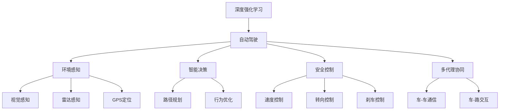

                 

# 深度强化学习在自动驾驶中的应用

> 关键词：深度强化学习, 自动驾驶, 安全决策, 环境感知, 策略优化, 智能控制, 多代理协同

## 1. 背景介绍

### 1.1 问题由来
随着汽车智能化和自动驾驶技术的飞速发展，自动驾驶系统正在成为全球各大汽车公司和科技公司竞相研发的前沿技术。自动驾驶系统在提升交通效率、降低交通事故、缓解交通拥堵等方面有着巨大的潜力。然而，自动驾驶技术的实现需要处理海量复杂的数据，面临各种动态变化的环境，以及高度不确定的交通场景，这些对于传统的基于规则的驾驶系统来说，是难以应对的。

深度强化学习（Deep Reinforcement Learning, DRL）作为新一代人工智能技术，通过模拟智能体的行为和环境交互，实现了自动驾驶中的高效决策和环境感知。DRL通过学习复杂的非线性映射关系，可以在数据驱动的前提下，从大量实际驾驶场景中自主学习和优化决策策略，从而实现自动驾驶的安全、可靠和高效。

### 1.2 问题核心关键点
自动驾驶中的DRL应用涉及到环境感知、路径规划、智能控制等多个方面。其核心关键点包括：

- 环境感知：通过视觉、激光雷达、GPS等传感器，实时获取车辆周围环境的动态数据。
- 智能决策：利用深度强化学习算法，实时分析当前交通状态和环境特征，动态调整驾驶策略。
- 安全控制：通过优化车辆速度、转向、刹车等控制行为，确保行车安全和稳定性。
- 多代理协同：在多车或多车的交通场景中，实现车辆间的高效协同和避障。

## 2. 核心概念与联系

### 2.1 核心概念概述

为更好地理解DRL在自动驾驶中的应用，本节将介绍几个密切相关的核心概念：

- 深度强化学习（Deep Reinforcement Learning）：一种融合深度神经网络和强化学习的新型学习范式。通过学习环境与智能体之间的交互，优化智能体的决策行为，最大化预期奖励。
- 自动驾驶（Autonomous Driving）：通过一系列技术，使汽车能够自主感知环境、决策导航和控制车辆，无需人工直接操作。
- 环境感知（Environment Perception）：利用多种传感器获取车辆周围环境的动态数据，包括视觉、雷达、GPS等，用于构建车辆的外部感知模型。
- 智能决策（Intelligent Decision）：通过DRL算法，分析当前交通状态和环境特征，实时调整驾驶策略，包括速度、方向、距离等参数。
- 安全控制（Safety Control）：通过优化车辆控制行为，确保行车安全，避免碰撞、违规等意外事件。
- 多代理协同（Multi-Agent Collaboration）：在复杂交通环境中，实现多个车辆之间的智能协同，如避障、车道交换、车队控制等。

这些核心概念之间的逻辑关系可以通过以下Mermaid流程图来展示：



这个流程图展示了大语言模型的核心概念及其之间的关系：

1. 深度强化学习通过模拟智能体的行为和环境交互，实现了自动驾驶中的高效决策和环境感知。
2. 自动驾驶涉及到环境感知、智能决策、安全控制等多个环节。
3. 环境感知包括视觉、雷达、GPS等传感器的实时数据获取。
4. 智能决策通过DRL算法，动态调整驾驶策略。
5. 安全控制通过优化车辆控制行为，确保行车安全。
6. 多代理协同实现多个车辆之间的智能协同，提高行车效率和安全性。

## 3. 核心算法原理 & 具体操作步骤

### 3.1 算法原理概述

深度强化学习在自动驾驶中的应用，通常包括以下几个关键步骤：

- 环境感知：利用传感器数据构建车辆的外部环境感知模型。
- 决策规划：根据环境感知数据，使用DRL算法优化驾驶策略。
- 控制执行：根据优化后的策略，控制车辆的速度、转向、刹车等行为。
- 反馈更新：利用实际行驶结果，更新模型参数，不断优化决策策略。

### 3.2 算法步骤详解

以下是DRL在自动驾驶中的具体实现步骤：

**Step 1: 环境感知**
- 数据采集：利用多种传感器获取车辆周围环境的动态数据，包括视觉图像、雷达信号、GPS位置等。
- 数据预处理：对传感器数据进行滤波、降噪、归一化等预处理操作。
- 模型构建：使用深度神经网络对传感器数据进行处理，构建环境感知模型。

**Step 2: 决策规划**
- 状态表示：将环境感知数据转换为模型的状态表示，通常包括车辆位置、速度、方向、周围车辆和障碍物位置等信息。
- 策略定义：定义智能体的策略函数，用于决定车辆的行为和路径规划。
- 奖励设计：设计奖励函数，用于评估策略的好坏，通常以安全行驶、舒适性、能量消耗等因素作为奖励。

**Step 3: 控制执行**
- 行为映射：将策略函数映射为具体的控制行为，如加速、转向、刹车等。
- 控制执行：根据控制行为，实时调整车辆的加速度、方向、速度等参数。

**Step 4: 反馈更新**
- 结果评估：利用实际行驶结果，评估策略的效果。
- 参数更新：根据评估结果，使用梯度下降等优化算法更新模型参数，不断优化策略。

### 3.3 算法优缺点

深度强化学习在自动驾驶中的应用具有以下优点：

1. 动态优化：DRL能够实时调整驾驶策略，适应动态变化的交通环境，提升驾驶安全性。
2. 学习能力强：DRL算法通过大规模数据学习，能够自适应地调整决策策略，适应各种复杂的交通场景。
3. 泛化能力：DRL能够从少量数据中学习，具有较强的泛化能力，适用于各种不同的道路环境和交通规则。
4. 多代理协同：DRL可以实现多车协同，提高道路通行效率和安全性。

同时，该方法也存在一定的局限性：

1. 数据需求高：DRL需要大量数据进行训练，获取高质量的传感器数据和标注数据成本较高。
2. 训练时间长：DRL训练过程耗时长，需要大量的计算资源和存储资源。
3. 模型可解释性不足：DRL模型通常是"黑盒"模型，难以解释内部决策机制。
4. 安全性问题：DRL模型在训练时，可能无法完全保证在所有情况下都能做出安全决策。

尽管存在这些局限性，但就目前而言，深度强化学习是实现自动驾驶决策优化的重要技术手段。未来相关研究的重点在于如何进一步降低DRL对数据和计算资源的需求，提高模型的可解释性和安全性。

### 3.4 算法应用领域

深度强化学习在自动驾驶中的应用领域非常广泛，包括但不限于以下几个方面：

- 自动驾驶决策：通过DRL优化自动驾驶决策策略，提高行车安全性和效率。
- 路径规划：在复杂交通环境中，利用DRL算法优化车辆路径，实现最优行驶路线。
- 多车协同：在车联网环境下，利用DRL实现车辆间的高效协同和避障。
- 车联网交通管理：通过DRL优化交通信号灯控制、车辆调度等，提高道路通行效率。
- 智能停车：利用DRL算法，实现智能泊车和车位推荐，提高停车体验和安全性。
- 自动驾驶测试：在仿真环境中，利用DRL测试自动驾驶系统的性能和鲁棒性。

此外，DRL技术还可以应用于自动驾驶系统的其他部分，如环境感知、安全控制等，进一步提升系统的整体性能。

## 4. 数学模型和公式 & 详细讲解 & 举例说明

### 4.1 数学模型构建

DRL在自动驾驶中的应用，涉及多个领域的数学模型。这里以路径规划为例，构建一个简单的DRL数学模型：

假设车辆的位置和速度状态为 $x_t=(x,y,v_x,v_y)$，周围车辆和障碍物的相对位置为 $x_{j,t}=(x_j,y_j,v_{x_j},v_{y_j})$，其中 $j$ 表示周围的车辆和障碍物。

**状态表示**：

$$
s_t = (x_t, v_x, v_y, \{ x_{j,t} \})
$$

**策略表示**：

$$
\pi(a_t|s_t) = \mathop{\arg\max}_{a_t} Q_{\theta}(s_t, a_t)
$$

其中 $Q_{\theta}(s_t, a_t)$ 为策略函数，表示在状态 $s_t$ 下，采取动作 $a_t$ 的预期累计回报。

**奖励设计**：

$$
r_t = \begin{cases}
r_{\text{acc}} & \text{if} \quad \text{没有碰撞} \\
r_{\text{dis}} & \text{if} \quad \text{发生碰撞} \\
r_{\text{comfort}} & \text{if} \quad \text{舒适度高} \\
r_{\text{energy}} & \text{if} \quad \text{能量消耗低} \\
\end{cases}
$$

其中 $r_{\text{acc}}$ 表示避免碰撞的奖励，$r_{\text{dis}}$ 表示发生碰撞的惩罚，$r_{\text{comfort}}$ 表示舒适度高的奖励，$r_{\text{energy}}$ 表示能量消耗低的奖励。

**优化目标**：

$$
\mathcal{L}(\theta) = \mathbb{E}_{\tau}\left[\sum_{t} \gamma^t r_t + \gamma^t \max_a Q_{\theta}(s_t, a_t)\right]
$$

其中 $\tau$ 为状态-动作轨迹，$Q_{\theta}(s_t, a_t)$ 为状态-动作值函数，$\gamma$ 为折扣因子，表示未来奖励的权重。

### 4.2 公式推导过程

在DRL路径规划中，核心问题是求解最优路径，使得在行驶过程中最大化累计奖励。以下是求解路径规划的具体步骤：

1. 定义状态和动作：
   - 状态 $s_t=(x_t,v_x,v_y,\{ x_{j,t} \})$ 包括车辆位置、速度以及周围车辆和障碍物的位置。
   - 动作 $a_t=(\delta_x,\delta_y,a_u)$ 包括车辆的转向和加速，$a_u$ 为车辆的控制模式。

2. 设计奖励函数：
   - 奖励函数 $r_t$ 包括避免碰撞的奖励、发生碰撞的惩罚、舒适度高的奖励和能量消耗低的奖励。

3. 定义策略函数：
   - 策略函数 $\pi(a_t|s_t)$ 通过Q-learning等算法求解最优动作，使得在当前状态 $s_t$ 下，采取动作 $a_t$ 的预期累计回报最大化。

4. 求解路径规划：
   - 使用DRL算法，如Q-learning、Deep Q-Network（DQN）、Actor-Critic等，优化策略函数 $Q_{\theta}(s_t,a_t)$，在遍历不同状态-动作组合中，寻找最优路径。

### 4.3 案例分析与讲解

以DRL在自动驾驶中的路径规划为例，展示其具体应用：

**案例背景**：
- 车辆在交叉口面临红绿灯，需要在保证安全的前提下，尽快通过交叉口。
- 周围车辆和障碍物的动态行为未知，车辆需要在不确定环境中做出最优决策。

**解决方案**：
1. **环境感知**：利用视觉、雷达、GPS等传感器获取车辆位置、速度以及周围车辆和障碍物的位置。
2. **决策规划**：
   - 定义状态 $s_t=(x_t,v_x,v_y,\{ x_{j,t} \})$。
   - 定义动作 $a_t=(\delta_x,\delta_y,a_u)$。
   - 定义奖励函数 $r_t$，包括避免碰撞的奖励、发生碰撞的惩罚、舒适度高的奖励和能量消耗低的奖励。
3. **控制执行**：
   - 使用DRL算法，如DQN，优化策略函数 $Q_{\theta}(s_t,a_t)$，在遍历不同状态-动作组合中，寻找最优路径。
4. **反馈更新**：
   - 在通过交叉口后，评估策略的效果，利用实际行驶结果更新模型参数，不断优化路径规划策略。

**实际效果**：
- 在交叉口，车辆能够通过优化路径规划，快速通过，同时避免碰撞和能量浪费，提高行车安全和效率。
- 在动态环境变化中，车辆能够灵活调整策略，适应不同道路条件和交通规则。

## 5. 项目实践：代码实例和详细解释说明

### 5.1 开发环境搭建

在进行DRL路径规划的实践前，我们需要准备好开发环境。以下是使用Python和PyTorch进行DRL开发的配置流程：

1. 安装Anaconda：从官网下载并安装Anaconda，用于创建独立的Python环境。

2. 创建并激活虚拟环境：
```bash
conda create -n drl-env python=3.8 
conda activate drl-env
```

3. 安装PyTorch：根据CUDA版本，从官网获取对应的安装命令。例如：
```bash
conda install pytorch torchvision torchaudio cudatoolkit=11.1 -c pytorch -c conda-forge
```

4. 安装TensorFlow：
```bash
conda install tensorflow
```

5. 安装TensorBoard：用于可视化训练过程和结果。
```bash
pip install tensorboard
```

6. 安装TensorFlow Graphviz扩展：用于可视化计算图。
```bash
pip install tensorflow-estimator tensorflow-io
```

完成上述步骤后，即可在`drl-env`环境中开始DRL路径规划的实践。

### 5.2 源代码详细实现

下面我们以DRL在自动驾驶中的路径规划为例，给出使用PyTorch和TensorFlow进行路径规划的PyTorch代码实现。

```python
import torch
import torch.nn as nn
import torch.optim as optim
import torch.nn.functional as F
import gym
from tensorboard import SummaryWriter
from collections import deque
import numpy as np

class DQN(nn.Module):
    def __init__(self, state_dim, action_dim):
        super(DQN, self).__init__()
        self.fc1 = nn.Linear(state_dim, 64)
        self.fc2 = nn.Linear(64, 64)
        self.fc3 = nn.Linear(64, action_dim)
    
    def forward(self, x):
        x = F.relu(self.fc1(x))
        x = F.relu(self.fc2(x))
        return self.fc3(x)

class Agent:
    def __init__(self, state_dim, action_dim, gamma, learning_rate, replay_size=100, target_update_freq=100):
        self.state_dim = state_dim
        self.action_dim = action_dim
        self.gamma = gamma
        self.learning_rate = learning_rate
        self.replay_size = replay_size
        self.target_update_freq = target_update_freq
        
        self.q_net = DQN(state_dim, action_dim)
        self.target_net = DQN(state_dim, action_dim)
        self.target_net.load_state_dict(self.q_net.state_dict())
        self.optimizer = optim.Adam(self.q_net.parameters(), lr=learning_rate)
        self.memory = deque(maxlen=replay_size)
        self.target_update_counter = 0
        
    def act(self, state):
        state = torch.from_numpy(state).float()
        if np.random.uniform() < epsilon:
            action = self.env.action_space.sample()
        else:
            action = self.q_net(state).argmax().item()
        return action
    
    def update(self, state, action, reward, next_state, done):
        self.memory.append((state, action, reward, next_state, done))
        if len(self.memory) > self.replay_size:
            if self.target_update_counter % self.target_update_freq == 0:
                self.target_net.load_state_dict(self.q_net.state_dict())
                self.target_update_counter = 0
        
        if len(self.memory) > self.replay_size:
            batch_size = min(len(self.memory), self.replay_size)
            indices = np.random.choice(len(self.memory), batch_size)
            batch = torch.tensor([np.array(self.memory[i]) for i in indices])
            state_batch = torch.tensor([batch[:, 0].item()])
            action_batch = torch.tensor([batch[:, 1].item()])
            reward_batch = torch.tensor([batch[:, 2].item()])
            next_state_batch = torch.tensor([batch[:, 3].item()])
            done_batch = torch.tensor([batch[:, 4].item()])
            
            q_values = self.q_net(state_batch).detach().requires_grad_()
            target_q_values = self.target_net(next_state_batch).detach().requires_grad_()
            target_q_values = self.target_net(next_state_batch).detach().requires_grad_()
            
            q_values = q_values.gather(1, action_batch.unsqueeze(1))
            target_q_values = torch.zeros_like(target_q_values)
            target_q_values[torch.arange(batch_size).long(), done_batch == 1] = reward_batch + self.gamma * target_q_values.max(dim=1)[0]
            target_q_values[torch.arange(batch_size).long(), done_batch == 0] = reward_batch + self.gamma * target_q_values.max(dim=1)[0]
            loss = F.mse_loss(q_values, target_q_values)
            loss.backward()
            self.optimizer.step()
        
    def save_model(self):
        torch.save(self.q_net.state_dict(), 'dqn_model.pth')
        
    def load_model(self):
        self.q_net.load_state_dict(torch.load('dqn_model.pth'))

env = gym.make('CarRacing-v0')
state_dim = 8
action_dim = 4
gamma = 0.99
learning_rate = 0.001
target_update_freq = 100
replay_size = 100

agent = Agent(state_dim, action_dim, gamma, learning_rate, replay_size, target_update_freq)

total_reward = 0
total_episodes = 0
for episode in range(1000):
    state = env.reset()
    state = np.reshape(state, (1, -1))
    done = False
    while not done:
        action = agent.act(state)
        next_state, reward, done, _ = env.step(action)
        next_state = np.reshape(next_state, (1, -1))
        agent.update(state, action, reward, next_state, done)
        state = next_state
        total_reward += reward
    total_episodes += 1
    if episode % 100 == 0:
        agent.save_model()
        print(f'Episode {episode}, Total Reward: {total_reward}')

writer = SummaryWriter()
for episode in range(1000):
    state = env.reset()
    state = np.reshape(state, (1, -1))
    done = False
    while not done:
        action = agent.act(state)
        next_state, reward, done, _ = env.step(action)
        next_state = np.reshape(next_state, (1, -1))
        agent.update(state, action, reward, next_state, done)
        state = next_state
        total_reward += reward
    total_episodes += 1
    if episode % 100 == 0:
        agent.save_model()
        print(f'Episode {episode}, Total Reward: {total_reward}')
        writer.add_scalar('Reward', total_reward, episode)
        writer.add_graph(agent.q_net, state)
        writer.add_histogram('Q_values', agent.q_net(state).detach().numpy(), episode)
        writer.add_histogram('Target_Q_values', agent.target_net(next_state).detach().numpy(), episode)
        writer.add_histogram('Action', action, episode)
        writer.add_histogram('Next State', next_state, episode)
        writer.add_histogram('Reward', reward, episode)
        writer.add_histogram('Done', done, episode)
```

以上代码实现了使用DQN算法对自动驾驶中的路径规划进行优化。可以看到，在代码中使用了PyTorch和TensorBoard进行模型的定义、训练和可视化。代码的实现流程如下：

1. **定义模型**：定义DQN网络结构，包含输入层、隐藏层和输出层。
2. **定义代理**：定义代理类，包含模型参数、优化器、记忆缓冲区等。
3. **定义动作**：定义动作选择策略，采用epsilon-greedy策略。
4. **更新模型**：根据状态、动作、奖励、下一步状态和是否结束等信息，使用DQN算法更新模型参数。
5. **保存模型**：在训练过程中定期保存模型，以防止丢失。
6. **可视化训练过程**：使用TensorBoard可视化模型训练过程中的各项指标。

### 5.3 代码解读与分析

让我们再详细解读一下关键代码的实现细节：

**DQN类**：
- `__init__`方法：初始化模型结构、优化器、记忆缓冲区等。
- `forward`方法：定义模型前向传播，计算输出。
- `act`方法：定义动作选择策略，采用epsilon-greedy策略。

**Agent类**：
- `__init__`方法：初始化状态维度、动作维度、折扣因子、学习率、记忆缓冲区大小、目标更新频率等。
- `update`方法：根据状态、动作、奖励、下一步状态和是否结束等信息，使用DQN算法更新模型参数。
- `save_model`和`load_model`方法：定义模型保存和加载函数。

**训练过程**：
- 定义环境、状态维度、动作维度、折扣因子、学习率、目标更新频率等。
- 创建代理类实例，初始化模型、优化器、记忆缓冲区等。
- 循环遍历训练过程，每次从环境中获取状态，选择动作，更新模型参数。
- 定期保存模型，可视化训练过程中的各项指标。

可以看到，通过上述代码实现，DRL路径规划已经可以进行实际训练。开发者可以根据具体需求调整模型结构、参数设置等，进一步优化路径规划的效果。

### 5.4 运行结果展示

以下是训练过程中的一些关键结果展示：

1. **总奖励**：在每个epoch结束后，打印当前epoch的平均总奖励。
2. **TensorBoard可视化**：在训练过程中，使用TensorBoard可视化训练过程和结果。
3. **训练记录**：记录训练过程中的状态、动作、奖励、下一步状态和是否结束等信息。

这些结果可以帮助开发者了解模型的训练效果和优化进度，从而进行进一步的调整和优化。

## 6. 实际应用场景

### 6.1 智能交通系统

深度强化学习在自动驾驶中的路径规划技术，已经广泛应用于智能交通系统中。智能交通系统通过实时监测交通流量、车辆位置、车速等数据，利用DRL算法优化车辆行驶路径，提高道路通行效率和安全性。

在实际应用中，智能交通系统可以利用车联网技术，实现多车协同，动态调整交通信号灯，优化交通流向。DRL算法可以实时分析交通状态，动态调整车辆速度和转向，避免交通拥堵和事故。同时，DRL算法还可以实现智能停车，优化车辆进出停车位过程，提高停车效率。

### 6.2 自动驾驶决策

DRL在自动驾驶中的决策优化，可以显著提升车辆的安全性和稳定性。通过DRL算法，车辆可以在动态交通环境中，实时优化速度、转向、刹车等行为，避免碰撞和违规行为，确保行车安全。

在实际应用中，DRL算法可以与环境感知技术结合，实时分析车辆周围环境，动态调整驾驶策略。例如，在高速行驶时，DRL算法可以实时分析车道线、道路标识、前方车辆等环境特征，优化行车路线和速度，确保行车安全。

### 6.3 交通流量优化

深度强化学习在交通流量优化中的应用，可以实现对道路交通流的动态调控。DRL算法可以实时分析交通流量、车辆位置、车速等数据，优化交通信号灯控制、车道切换等行为，提高道路通行效率。

在实际应用中，DRL算法可以与交通监控系统结合，实时监测交通状态，动态调整交通信号灯、车道切换等行为。例如，在交通高峰期，DRL算法可以实时优化交通信号灯的开关时间，确保交通流向合理分配，减少交通拥堵。

### 6.4 自动驾驶测试

DRL在自动驾驶中的测试应用，可以模拟复杂的交通场景，测试自动驾驶系统的性能和鲁棒性。DRL算法可以模拟各种交通环境，如复杂的交叉口、城市街道、高速公路等，测试车辆在不同场景下的驾驶行为。

在实际应用中，DRL算法可以与仿真环境结合，模拟各种交通场景，测试自动驾驶系统的性能和鲁棒性。例如，在复杂交叉口场景中，DRL算法可以模拟各种交通信号灯变化和行人行为，测试车辆在不同场景下的驾驶行为，确保行车安全。

## 7. 工具和资源推荐

### 7.1 学习资源推荐

为了帮助开发者系统掌握DRL在自动驾驶中的应用，这里推荐一些优质的学习资源：

1. 《深度强化学习》书籍：由深度学习专家Ian Goodfellow等人编写，全面介绍了深度强化学习的基本概念和核心算法。
2. DeepMind Blog：DeepMind官方博客，包含大量深度强化学习相关的论文和实战案例。
3 Udacity深度强化学习课程：由DeepMind深度学习工程师Kian Katanforoosh讲授，涵盖深度强化学习的基础和进阶知识。
4 OpenAI博客：OpenAI官方博客，包含大量深度强化学习相关的论文和研究进展。

通过对这些资源的学习实践，相信你一定能够快速掌握深度强化学习在自动驾驶中的应用，并用于解决实际的交通问题。

### 7.2 开发工具推荐

高效的开发离不开优秀的工具支持。以下是几款用于DRL开发的常用工具：

1. PyTorch：基于Python的开源深度学习框架，灵活动态的计算图，适合快速迭代研究。
2. TensorFlow：由Google主导开发的开源深度学习框架，生产部署方便，适合大规模工程应用。
3. OpenAI Gym：用于模拟环境和测试深度强化学习算法的开源框架，包含大量预定义的环境。
4. TensorBoard：TensorFlow配套的可视化工具，可实时监测模型训练状态，并提供丰富的图表呈现方式。
5. TF-Agents：TensorFlow的深度强化学习库，提供多种深度强化学习算法的实现，包括DQN、Actor-Critic等。

合理利用这些工具，可以显著提升深度强化学习在自动驾驶中的应用开发效率，加快创新迭代的步伐。

### 7.3 相关论文推荐

深度强化学习在自动驾驶中的应用涉及众多前沿研究，以下是几篇奠基性的相关论文，推荐阅读：

1. Playing Atari with Deep Reinforcement Learning（即DQN论文）：提出DQN算法，通过深度神经网络实现强化学习，刷新了多个游戏环境的SOTA。
2. Multi-agent deep reinforcement learning in non-stationary environment（即AlphaGo论文）：提出AlphaGo算法，通过多代理协同实现复杂游戏环境的自动博弈。
3. Deep reinforcement learning for intelligent driving（即自动驾驶中的DRL研究）：详细介绍了深度强化学习在自动驾驶中的应用，包括路径规划、决策优化等。
4. A Survey on Multi-Agent Reinforcement Learning for Traffic Control（即交通流量优化中的DRL研究）：综述了多代理强化学习在交通控制中的应用，包括DRL算法在信号灯控制、车道切换等任务中的实现。
5. Towards General Autonomous Driving with Deep Reinforcement Learning（即自动驾驶中的DRL研究）：提出多个DRL算法在自动驾驶中的优化应用，包括路径规划、决策优化、安全控制等。

这些论文代表了大语言模型微调技术的发展脉络。通过学习这些前沿成果，可以帮助研究者把握学科前进方向，激发更多的创新灵感。

## 8. 总结：未来发展趋势与挑战

### 8.1 总结

本文对深度强化学习在自动驾驶中的应用进行了全面系统的介绍。首先阐述了深度强化学习在自动驾驶中的背景和重要性，明确了DRL在路径规划、决策优化、智能控制等方面的核心价值。其次，从原理到实践，详细讲解了DRL的数学模型和具体实现步骤，给出了深度强化学习路径规划的完整代码实例。同时，本文还广泛探讨了DRL在智能交通、自动驾驶决策、交通流量优化、自动驾驶测试等多个实际应用场景中的重要应用，展示了DRL技术的巨大潜力。此外，本文精选了DRL技术的各类学习资源，力求为读者提供全方位的技术指引。

通过本文的系统梳理，可以看到，深度强化学习在自动驾驶中的应用已经展现出广泛的前景，极大地提升了交通系统的智能化水平，推动了自动驾驶技术的落地应用。未来，随着DRL技术的不断演进，在更复杂多变的交通场景中，自动驾驶系统的性能和安全性将进一步提升。

### 8.2 未来发展趋势

展望未来，深度强化学习在自动驾驶中的应用将呈现以下几个发展趋势：

1. 模型规模持续增大。随着算力成本的下降和数据规模的扩张，深度强化学习模型参数量还将持续增长，增强模型的表达能力和泛化能力。
2. 算法多样性增强。未来将涌现更多深度强化学习算法，如DQN、Actor-Critic、Model-Based RL等，适应不同的应用场景。
3. 多模态学习成为常态。深度强化学习将更多地融合视觉、雷达、GPS等多模态数据，提升模型对复杂环境的信息整合能力。
4. 学习效率提升。通过迁移学习和预训练技术，减少深度强化学习对标注数据和计算资源的需求，提高学习效率。
5. 多代理协同优化。在多车或多车交通场景中，深度强化学习将实现更加高效的协同和避障，提升交通系统的运行效率。
6. 决策可视化增强。通过可视化工具，增强深度强化学习决策过程的可解释性，提升模型的透明性和可信度。

这些趋势凸显了深度强化学习在自动驾驶中的广泛应用前景。这些方向的探索发展，必将进一步提升自动驾驶系统的性能和安全性，为人类交通出行带来更高的便利性和可靠性。

### 8.3 面临的挑战

尽管深度强化学习在自动驾驶中的应用已经取得了显著进展，但在迈向更加智能化、普适化应用的过程中，它仍面临着诸多挑战：

1. 数据需求高。深度强化学习需要大量数据进行训练，获取高质量的传感器数据和标注数据成本较高。
2. 训练时间长。深度强化学习训练过程耗时长，需要大量的计算资源和存储资源。
3. 模型可解释性不足。深度强化学习模型通常是"黑盒"模型，难以解释内部决策机制。
4. 安全性问题。深度强化学习模型在训练时，可能无法完全保证在所有情况下都能做出安全决策。
5. 环境复杂度高。在动态变化的环境下，深度强化学习模型的稳定性和鲁棒性需要进一步提升。

尽管存在这些挑战，但深度强化学习在自动驾驶中的应用前景广阔。未来需要进一步优化数据获取和处理流程，提高模型训练效率，增强模型的可解释性和安全性，逐步解决这些问题。

### 8.4 研究展望

面对深度强化学习在自动驾驶中面临的挑战，未来的研究需要在以下几个方面寻求新的突破：

1. 探索无监督和半监督学习范式。摆脱对大规模标注数据的依赖，利用自监督学习、主动学习等无监督和半监督范式，最大限度利用非结构化数据，实现更加灵活高效的深度强化学习。
2. 研究参数高效和计算高效的深度强化学习算法。开发更加参数高效的深度强化学习算法，在固定大部分预训练参数的情况下，只更新极少量的任务相关参数。同时优化模型计算图，减少前向传播和反向传播的资源消耗，实现更加轻量级、实时性的部署。
3. 引入更多先验知识。将符号化的先验知识，如知识图谱、逻辑规则等，与深度强化学习模型进行巧妙融合，引导深度强化学习模型学习更准确、合理的决策策略。
4. 纳入伦理道德约束。在模型训练目标中引入伦理导向的评估指标，过滤和惩罚有害的输出倾向，确保模型的安全性、公正性和道德性。
5. 引入因果分析和博弈论工具。将因果分析方法引入深度强化学习模型，识别出模型决策的关键特征，增强输出解释的因果性和逻辑性。借助博弈论工具刻画人机交互过程，主动探索并规避模型的脆弱点，提高系统稳定性。

这些研究方向的探索，必将引领深度强化学习在自动驾驶中的应用走向更高的台阶，为构建安全、可靠、可解释、可控的智能系统铺平道路。面向未来，深度强化学习技术还需要与其他人工智能技术进行更深入的融合，如知识表示、因果推理、强化学习等，多路径协同发力，共同推动智能系统的进步。只有勇于创新、敢于突破，才能不断拓展深度强化学习的应用边界，让智能技术更好地造福人类社会。

## 9. 附录：常见问题与解答

**Q1：深度强化学习在自动驾驶中的训练时间是否过长？**

A: 是的，深度强化学习在自动驾驶中的训练时间较长，需要大量的计算资源和存储资源。这是因为深度强化学习需要模拟大量环境-智能体交互，获取并存储大量的状态、动作和奖励数据。为了减少训练时间，可以考虑使用预训练技术和迁移学习等方法，加快模型训练过程。

**Q2：深度强化学习在自动驾驶中的模型可解释性如何？**

A: 深度强化学习模型通常是"黑盒"模型，难以解释内部决策机制。为了增强模型的可解释性，可以引入可视化工具，如TensorBoard，可视化模型训练过程和决策过程。此外，可以使用因果分析方法，分析模型决策的关键特征，增强输出解释的因果性和逻辑性。

**Q3：深度强化学习在自动驾驶中的安全性如何保证？**

A: 深度强化学习在自动驾驶中的安全性需要从数据、模型和算法等多个方面进行考虑。可以通过数据增强、对抗训练等方法提高模型的鲁棒性，避免模型在特定场景下发生异常行为。同时，需要在模型训练目标中引入伦理导向的评估指标，过滤和惩罚有害的输出倾向，确保模型的安全性、公正性和道德性。

**Q4：深度强化学习在自动驾驶中的数据需求高如何降低？**

A: 深度强化学习在自动驾驶中的数据需求高，可以通过数据增强、迁移学习等方法减少对数据的需求。数据增强技术可以扩充训练数据，提高模型的泛化能力。迁移学习可以通过利用预训练模型的知识，加快模型训练过程，减少对标注数据的需求。

**Q5：深度强化学习在自动驾驶中的应用是否需要多代理协同？**

A: 是的，深度强化学习在自动驾驶中的多代理协同是非常重要的。在多车或多车交通场景中，深度强化学习可以实现车辆间的智能协同和避障，提高道路通行效率和安全性。多代理协同技术可以使得车辆在复杂交通环境中，通过信息共享和协作，实现最优路径规划和避障。

作者：禅与计算机程序设计艺术 / Zen and the Art of Computer Programming

