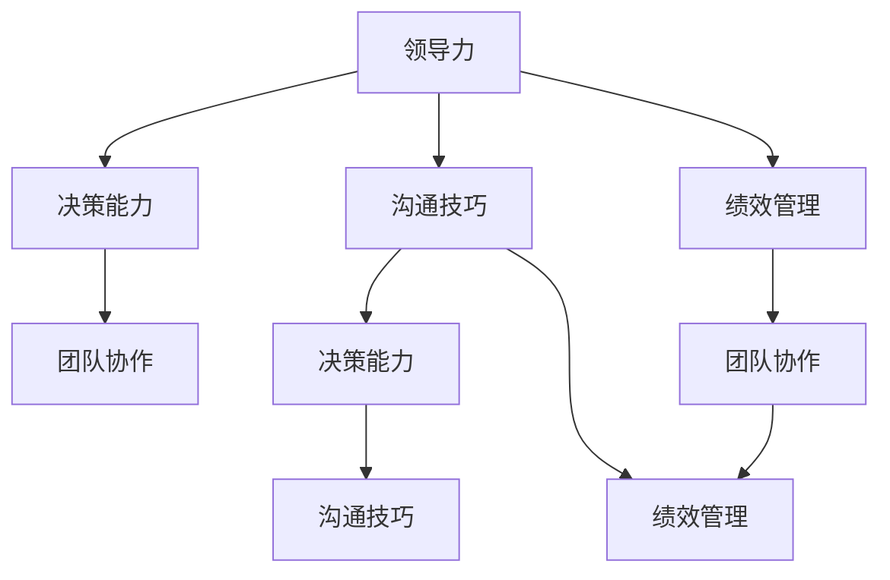

                 

# 深度思考:区分优秀管理者的标准

在当今竞争激烈、变化快速的商业环境中，优秀的管理者是公司成功的关键。但究竟什么才是优秀的管理者？他们的特质、行为和技能有何不同？本文将深入探讨这些关键问题，通过分析优秀管理者的标准，帮助职场人士提升管理能力，为企业创造更大价值。

## 1. 背景介绍

### 1.1 问题由来
随着企业规模的扩大和市场的全球化，管理者的角色和责任也变得越来越复杂。他们需要协调不同的团队和部门，决策企业战略，管理复杂的人事关系，确保组织的高效运作和持续发展。然而，优秀管理者的标准是什么？许多管理者可能会给出不同的答案。

### 1.2 问题核心关键点
优秀管理者的标准涉及多个维度，包括领导能力、决策能力、沟通技巧、团队协作、绩效管理等。这些标准不仅涉及管理者的个人特质，还包括他们的行为模式和策略选择。本文将通过分析这些核心关键点，揭示优秀管理者的秘密，为读者提供全面的视角。

### 1.3 问题研究意义
了解优秀管理者的标准对个人和组织都有重要意义。对于个人而言，它可以提供自我提升的方向和方法；对于组织而言，可以指导人力资源开发和组织建设，提高整体绩效和竞争优势。

## 2. 核心概念与联系

### 2.1 核心概念概述

为了更好地理解优秀管理者的标准，我们首先需要引入一些核心概念：

- **领导力**：指管理者影响、激励和指导团队的能力。优秀的领导者不仅具备强烈的愿景和目标，还能激发团队成员的潜力。
- **决策能力**：指管理者在面对复杂问题时，能够迅速做出明智决策的能力。优秀的决策者往往具备系统化的思考方式和风险管理能力。
- **沟通技巧**：指管理者与团队、客户、利益相关者有效交流的能力。优秀的沟通者能够清晰表达意图，建立良好的关系网络。
- **团队协作**：指管理者协调团队成员之间的互动，确保项目顺利推进的能力。优秀的团队领导者能够促进合作，解决冲突。
- **绩效管理**：指管理者评估、激励和指导员工绩效的能力。优秀的绩效管理者能够设定明确的目标，提供持续的反馈和支持。

这些核心概念通过互动和协同，构成了优秀管理者的全貌。

### 2.2 核心概念原理和架构的 Mermaid 流程图



这个流程图展示了核心概念之间的相互关系：

- 领导力是其他能力的基石，优秀的领导者能够做出明智的决策，有效地沟通和协作，并且管理团队绩效。
- 决策能力、沟通技巧和团队协作是实现领导力的关键工具。
- 绩效管理与团队协作和领导力紧密相连，通过有效的绩效管理，领导者能够激励团队成员，提升整体表现。

### 2.3 核心概念联系

这些核心概念相互联系，共同构成了优秀管理者的特质。以下是一些关键联系：

- **领导力与决策能力**：优秀的领导者能够通过清晰的愿景和目标，引导团队做出明智的决策。
- **沟通技巧与团队协作**：有效的沟通是团队协作的基础，优秀的管理者能够通过良好的沟通，促进团队成员之间的协作。
- **绩效管理与领导力**：通过设定明确的目标和提供持续的反馈，领导者能够激励团队成员，提升整体绩效。

## 3. 核心算法原理 & 具体操作步骤

### 3.1 算法原理概述

识别优秀管理者的过程可以通过以下算法原理进行：

1. **数据收集**：从多个渠道（如员工反馈、绩效评估、360度评估等）收集关于管理者的数据。
2. **数据分析**：使用统计学方法（如回归分析、因子分析等）分析数据，找出与优秀管理行为相关的关键因素。
3. **模型构建**：构建一个机器学习模型，将关键因素映射到优秀管理者的标准。
4. **验证与优化**：使用新的数据验证模型的准确性，并不断优化模型，以提高预测效果。

### 3.2 算法步骤详解

以下是一个基于监督学习的优秀管理者识别步骤：

1. **数据预处理**：收集多维度的管理行为数据，包括沟通记录、决策过程、团队反馈等。
2. **特征选择**：选择与优秀管理行为相关的特征，如领导风格、决策方式、沟通技巧等。
3. **模型训练**：使用支持向量机(SVM)、随机森林(Random Forest)等算法训练模型，预测管理者的优秀程度。
4. **模型评估**：使用交叉验证等方法评估模型的准确性和泛化能力。
5. **模型优化**：根据评估结果优化模型，调整特征选择、算法参数等。

### 3.3 算法优缺点

基于监督学习的优秀管理者识别算法有以下优点：

- **自动化**：通过机器学习模型，自动化地分析大量数据，识别优秀管理者的标准。
- **客观性**：数据驱动的方法减少了主观偏见，提高了评估的客观性。
- **可扩展性**：可以应用于不同规模和类型的企业，适应性强。

但同时，这种方法也存在以下缺点：

- **数据依赖**：依赖高质量的数据，数据收集和处理难度较大。
- **模型复杂性**：需要复杂的模型和算法，对数据科学家和技术资源要求较高。
- **解释性**：机器学习模型往往是"黑盒"，难以解释其决策过程。

### 3.4 算法应用领域

基于监督学习的优秀管理者识别算法，在多个领域都有广泛应用：

- **人力资源管理**：用于员工选拔、培训和发展，提升人力资源管理效率。
- **组织绩效评估**：帮助企业识别高绩效团队和优秀管理者，优化组织结构。
- **战略规划**：在制定企业战略时，识别关键领导人物，确保战略实施的有效性。

## 4. 数学模型和公式 & 详细讲解 & 举例说明

### 4.1 数学模型构建

我们假设有一组管理行为数据 $\{(x_i, y_i)\}_{i=1}^N$，其中 $x_i$ 表示管理行为特征，$y_i$ 表示管理者的优秀程度（0表示不优秀，1表示优秀）。

一个可能的线性回归模型为：

$$
y_i = w_0 + w_1x_{i1} + w_2x_{i2} + \ldots + w_kx_{ik} + \epsilon_i
$$

其中，$w_0, w_1, \ldots, w_k$ 为模型参数，$\epsilon_i$ 为误差项。

### 4.2 公式推导过程

通过最小化平方误差，可以得到线性回归模型的参数估计值：

$$
w = \arg\min_{w} \sum_{i=1}^N (y_i - (w_0 + w_1x_{i1} + w_2x_{i2} + \ldots + w_kx_{ik}))^2
$$

使用矩阵表示，可以将上式写为：

$$
w = (X^TX)^{-1}X^Ty
$$

其中，$X = [1, x_{i1}, x_{i2}, \ldots, x_{ik}]^T$，$y = [y_1, y_2, \ldots, y_N]^T$。

### 4.3 案例分析与讲解

假设我们收集了多个管理者的数据，包括领导风格、决策方式、沟通技巧等特征，使用上述线性回归模型进行训练。通过训练，模型可以预测管理者的优秀程度，帮助我们筛选出优秀的管理者。

## 5. 项目实践：代码实例和详细解释说明

### 5.1 开发环境搭建

为了进行优秀管理者识别，我们需要搭建一个数据处理和模型训练的开发环境：

1. 安装Python和相关的科学计算库，如NumPy、Pandas、Scikit-learn等。
2. 搭建服务器环境，确保数据处理和模型训练的高效运行。
3. 收集和管理相关的管理行为数据。

### 5.2 源代码详细实现

以下是一个基于Scikit-learn库的优秀管理者识别代码实现：

```python
from sklearn.linear_model import LinearRegression
from sklearn.model_selection import train_test_split
from sklearn.metrics import mean_squared_error

# 加载数据
X = pd.read_csv('manager_data.csv')

# 分割数据为训练集和测试集
X_train, X_test, y_train, y_test = train_test_split(X, y, test_size=0.2, random_state=42)

# 创建线性回归模型
model = LinearRegression()

# 训练模型
model.fit(X_train, y_train)

# 预测测试集
y_pred = model.predict(X_test)

# 评估模型
mse = mean_squared_error(y_test, y_pred)
print(f'Mean Squared Error: {mse}')
```

### 5.3 代码解读与分析

代码中，我们首先加载管理行为数据，并将其分为训练集和测试集。然后，创建线性回归模型，并使用训练集进行训练。最后，预测测试集，并计算模型评估指标（均方误差）。

## 6. 实际应用场景

### 6.1 企业内部管理

在企业内部管理中，优秀的管理者往往能提升团队绩效，减少员工流失率，提高客户满意度。基于优秀管理者识别算法，企业可以更好地选拔和培养管理者，确保组织的高效运作。

### 6.2 外部招聘

在外部招聘过程中，优秀管理者识别算法可以帮助企业快速识别具有领导潜力的候选人，提高招聘效率和效果。

### 6.3 绩效管理

在绩效管理中，优秀管理者识别算法可以用于评估管理者的绩效，提供有针对性的反馈和改进建议。

### 6.4 未来应用展望

未来，随着数据采集技术的进步和人工智能技术的不断发展，优秀管理者识别算法将变得更加智能和精确。例如，结合自然语言处理技术，可以自动分析管理者的沟通记录和反馈，识别其管理风格和行为模式。同时，随着物联网和大数据分析技术的发展，优秀管理者识别算法可以更深入地分析企业的运营数据，提供更全面的管理洞见。

## 7. 工具和资源推荐

### 7.1 学习资源推荐

为了帮助读者深入了解优秀管理者的标准和识别算法，以下是一些学习资源推荐：

1. 《管理学》（Management）：经典的管理学教材，涵盖领导力、决策能力、沟通技巧、团队协作、绩效管理等核心概念。
2. 《人力资源管理》（Human Resource Management）：介绍人力资源管理的理论和实践，包括优秀管理者的选拔和发展。
3. 《数据科学基础》（Data Science Foundations）：涵盖数据收集、数据处理、模型训练、模型评估等核心技能，帮助读者掌握优秀管理者识别算法的实现。
4. 《机器学习实战》（Machine Learning in Action）：实战性的机器学习教材，涵盖各种机器学习算法的实现，包括监督学习、回归分析等。
5. 在线课程：如Coursera、edX等平台上的相关课程，提供深入的理论与实践指导。

### 7.2 开发工具推荐

以下是一些用于优秀管理者识别算法开发的常用工具：

1. Python：开源的科学计算语言，支持数据处理、机器学习等任务。
2. Jupyter Notebook：交互式的编程环境，支持代码编写、数据可视化等。
3. TensorFlow：Google开发的深度学习框架，支持复杂的模型训练和优化。
4. PyTorch：Facebook开发的深度学习框架，灵活高效，支持动态计算图。
5. Scikit-learn：Python的机器学习库，支持各种机器学习算法和模型评估。

### 7.3 相关论文推荐

以下是几篇经典的研究论文，对优秀管理者识别算法的发展有重要影响：

1. A Systematic Review of Human Resource Management in Fintech：综述了金融科技行业的人力资源管理，介绍了优秀管理者的标准和识别方法。
2. Machine Learning for Employee Selection: A Review of the Literature and Future Directions：总结了机器学习在员工选拔中的应用，包括优秀管理者的识别。
3. An Empirical Study of Data-Driven Management Skill Assessment：实证研究数据驱动的管理技能评估方法，包括优秀管理者的识别。
4. AI-Based Organizational Leaders Development System：介绍了一种基于AI的组织领导者发展系统，包括优秀管理者的识别和培养。

## 8. 总结：未来发展趋势与挑战

### 8.1 研究成果总结

本文通过分析优秀管理者的标准，探讨了基于监督学习识别优秀管理者的算法原理和具体操作步骤。我们发现，优秀管理者的识别不仅依赖于数据收集和特征选择，还需要使用复杂的机器学习模型进行训练和优化。通过实例分析，我们展示了优秀管理者识别算法的应用场景和实际效果。

### 8.2 未来发展趋势

未来，优秀管理者识别算法的发展趋势包括：

- **多模态数据融合**：结合自然语言处理、图像识别、物联网等技术，综合分析多模态数据，提升识别效果。
- **个性化管理**：利用深度学习算法，根据不同团队和环境的特点，提供个性化的管理建议。
- **动态调整**：基于实时数据和反馈，动态调整模型参数，提升管理者的识别精度和适应性。

### 8.3 面临的挑战

尽管优秀管理者识别算法在多个领域取得了显著成果，但仍面临以下挑战：

- **数据质量和隐私**：数据采集和处理过程中，如何保证数据的质量和隐私安全。
- **模型复杂性**：复杂的模型和算法需要大量计算资源，如何优化模型，提高运行效率。
- **解释性和透明度**：机器学习模型往往是"黑盒"，如何提高模型的解释性和透明度，增强用户信任。

### 8.4 研究展望

未来的研究需要在以下方面进行进一步探索：

- **数据治理**：建立完善的数据治理机制，确保数据质量和隐私安全。
- **模型优化**：研究和开发更高效、更易于解释的机器学习算法。
- **应用拓展**：将优秀管理者识别算法应用于更多行业和场景，提升其普适性和实用性。

## 9. 附录：常见问题与解答

**Q1：优秀管理者识别算法的准确性如何？**

A: 优秀管理者识别算法的准确性取决于数据质量和模型选择。高质量的数据和合适的模型可以显著提升识别准确性。但在实际应用中，算法仍需不断优化和调整，以适应不同的管理环境和团队特点。

**Q2：如何评估优秀管理者的标准？**

A: 优秀管理者的标准可以基于多维度的评估指标，如员工满意度、客户满意度、绩效评估等。通过综合分析这些指标，可以全面评估管理者的优秀程度。

**Q3：优秀管理者识别算法是否适用于所有行业？**

A: 优秀管理者识别算法具有广泛适用性，但需要根据不同行业的特点进行适当的调整。例如，在金融行业，需要考虑风险管理和合规性；在医疗行业，需要考虑患者安全和隐私保护。

**Q4：如何提升算法的解释性和透明度？**

A: 为了提高算法的解释性和透明度，可以使用可解释的机器学习模型，如决策树、线性回归等。同时，可以结合领域专家的知识，对模型进行手动解释和调整。

**Q5：如何处理数据隐私问题？**

A: 在数据处理过程中，需要严格遵守数据隐私保护法规，如GDPR、CCPA等。可以采用匿名化、去标识化等技术手段，保护数据隐私安全。

---

作者：禅与计算机程序设计艺术 / Zen and the Art of Computer Programming

