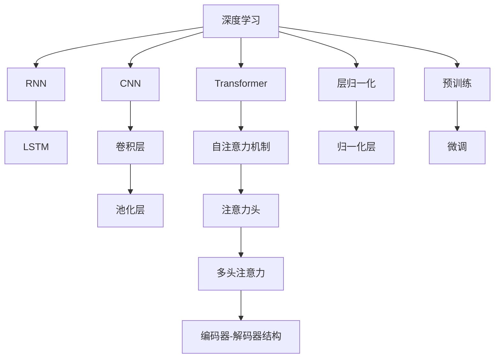

                 

# 深度思考:问题解决的利器

深度思考是解决问题的利器，是人工智能（AI）技术中不可或缺的环节。本文将从深度思考的核心理论、实现方法、应用场景及未来趋势进行全面阐述，旨在帮助读者提升问题解决能力，开拓技术思维。

## 1. 背景介绍

### 1.1 问题由来
在人工智能领域，深度思考能力直接决定了模型在各种复杂任务上的表现。传统的机器学习方法依赖于人工特征工程，对数据理解和模型设计要求较高，而深度学习通过多层次的神经网络模型，能够自动从数据中学习出抽象特征。深度思考能力在此基础上进一步发展，使其能够更好地理解上下文信息，处理语义逻辑，甚至具备推理能力。

### 1.2 问题核心关键点
深度思考能力主要体现在以下几个方面：
- **上下文理解**：模型需要理解上下文信息，从而在复杂场景下做出正确决策。
- **逻辑推理**：模型能够进行逻辑推理，识别因果关系，处理推理任务。
- **语义分析**：模型需要理解语言的多义性和语义复杂性，处理自然语言处理（NLP）任务。
- **模型复杂性**：需要设计复杂的模型结构，以实现高效的深度思考。

### 1.3 问题研究意义
深度思考能力在AI中的应用极其广泛，尤其是在语言处理、决策制定、智能推荐等领域。掌握深度思考的原理和实现方法，对于提升AI系统性能，推动技术进步具有重要意义。

## 2. 核心概念与联系

### 2.1 核心概念概述

为更好地理解深度思考的原理，本节将介绍几个核心概念：

- **深度学习（Deep Learning）**：基于神经网络模型，通过多层非线性变换实现对复杂数据的抽象表示。
- **递归神经网络（RNN）**：一种特殊的神经网络，能够处理序列数据，具有时间依赖性。
- **卷积神经网络（CNN）**：主要用于图像处理，通过卷积操作提取特征。
- **Transformer**：一种自注意力机制的神经网络，适用于处理序列数据，具有并行计算优势。
- **注意力机制**：通过计算不同部分信息的相关度，来确定重要特征的权重。
- **层归一化**：在神经网络中，对每层输入数据进行标准化，提高模型的稳定性。
- **预训练（Pre-training）**：在大规模无标签数据上预训练模型，学习通用特征，再通过微调（Fine-tuning）适应特定任务。

这些核心概念之间的逻辑关系可以通过以下Mermaid流程图来展示：



这个流程图展示了深度学习模型的主要组件及其关系：

1. 深度学习模型由多种网络结构构成。
2. RNN和LSTM用于处理序列数据，Transformer通过自注意力机制处理序列数据。
3. CNN用于图像处理。
4. 注意力机制和层归一化用于提高模型性能。
5. 预训练和微调是深度学习模型的重要训练步骤。

## 3. 核心算法原理 & 具体操作步骤
### 3.1 算法原理概述

深度思考的核心算法包括递归神经网络（RNN）、卷积神经网络（CNN）和Transformer等。这里以Transformer为例，介绍深度思考的算法原理。

Transformer由编码器和解码器组成，通过自注意力机制（Self-Attention）来计算输入序列和输出序列之间的依赖关系。自注意力机制通过计算不同位置的信息权重，从而捕捉长距离依赖，实现高效的深度思考。

Transformer的编码器和解码器由多头注意力机制（Multi-Head Attention）和前馈神经网络（Feedforward Neural Network）组成。多头注意力机制允许模型从多个角度进行信息提取和融合，提高模型的表征能力。前馈神经网络则用于对信息进行非线性变换，增强模型的表达能力。

### 3.2 算法步骤详解

基于Transformer的深度思考算法通常包括以下几个关键步骤：

**Step 1: 准备训练数据**
- 收集标注数据集，划分为训练集、验证集和测试集。
- 对数据进行预处理，如分词、标准化等。

**Step 2: 搭建模型结构**
- 构建Transformer编码器和解码器，定义多头注意力机制和前馈神经网络。
- 设置模型的超参数，如学习率、批大小、训练轮数等。

**Step 3: 进行预训练**
- 使用大规模无标签数据进行预训练，学习通用特征。
- 使用语言模型的掩码预测任务（Masked Language Modeling, MLM）或下一句预测任务（Next Sentence Prediction, NSP）来训练模型。

**Step 4: 进行微调**
- 在特定任务上，使用小规模标注数据进行微调。
- 使用交叉熵损失函数进行监督学习，优化模型参数。

**Step 5: 评估和优化**
- 在验证集上评估模型性能，调整模型参数。
- 在测试集上最终评估模型性能，提供最终的输出。

### 3.3 算法优缺点

Transformer算法具有以下优点：
1. 并行计算能力强，训练速度快。
2. 能够处理长距离依赖，适用于序列数据。
3. 可解释性强，容易进行调试和优化。
4. 适用于多种语言任务，性能稳定。

同时，也存在以下缺点：
1. 参数量大，训练资源需求高。
2. 对于小规模数据，训练效果可能不佳。
3. 模型复杂度高，难以调试。

### 3.4 算法应用领域

基于Transformer的深度思考算法在自然语言处理（NLP）领域有着广泛的应用，例如：

- **机器翻译**：将一种语言翻译成另一种语言。
- **文本分类**：将文本分类到预定义的类别中。
- **命名实体识别**：识别文本中的实体及其类型。
- **情感分析**：分析文本的情感倾向。
- **问答系统**：根据用户输入的问题，生成自然语言的回答。

Transformer算法还被应用到图像处理、语音识别、视频分析等多个领域，展示了其强大的跨领域适应能力。

## 4. 数学模型和公式 & 详细讲解  
### 4.1 数学模型构建

本节将使用数学语言对基于Transformer的深度思考算法进行更加严格的刻画。

记输入序列为 $x_1, x_2, ..., x_n$，输出序列为 $y_1, y_2, ..., y_n$，其中 $x_i, y_i \in \mathbb{R}^d$。假设模型为 $f: \mathbb{R}^d \rightarrow \mathbb{R}^d$，其编码器表示为 $h_1, h_2, ..., h_n$，解码器表示为 $g_1, g_2, ..., g_n$。

**编码器结构**：
- 输入层：对输入序列进行嵌入，得到 $z_1, z_2, ..., z_n$。
- 多头注意力层：计算每个位置的信息权重，得到 $a_1, a_2, ..., a_n$。
- 前馈神经网络层：进行非线性变换，得到 $b_1, b_2, ..., b_n$。
- 输出层：计算编码器的最终表示 $h_n$。

**解码器结构**：
- 输入层：对输入序列进行嵌入，得到 $c_1, c_2, ..., c_n$。
- 多头注意力层：计算编码器和解码器之间的信息权重，得到 $d_1, d_2, ..., d_n$。
- 前馈神经网络层：进行非线性变换，得到 $e_1, e_2, ..., e_n$。
- 输出层：计算解码器的最终表示 $g_n$。

### 4.2 公式推导过程

以Transformer模型的自注意力机制为例，其公式推导如下：

设输入序列的表示为 $x_1, x_2, ..., x_n$，其中每个 $x_i \in \mathbb{R}^d$。定义查询、键、值三组向量，分别为 $Q_i, K_i, V_i$，其中 $Q_i, K_i, V_i \in \mathbb{R}^d$。计算注意力权重 $\alpha_{i,j}$ 的公式为：

$$
\alpha_{i,j} = \frac{\exp(\text{dot}(Q_i, K_j) / \sqrt{d_k})}{\sum_{k=1}^N \exp(\text{dot}(Q_i, K_k) / \sqrt{d_k})}
$$

其中 $\text{dot}$ 表示向量的点积。通过上述公式，可以计算出每个位置的信息权重，进一步得到加权和 $Z_i$：

$$
Z_i = \sum_{j=1}^N \alpha_{i,j} V_j
$$

最终，将 $Z_i$ 经过线性变换和激活函数，得到编码器的输出 $h_i$。

### 4.3 案例分析与讲解

以机器翻译任务为例，假设输入序列为英文句子，输出序列为法文句子。输入序列嵌入后，通过多个编码器层进行处理，得到编码器的最终表示 $h_n$。解码器以 $h_n$ 和输出序列的每个位置作为输入，通过多个解码器层进行处理，得到解码器的最终表示 $g_n$。最后，通过softmax函数将 $g_n$ 转化为输出序列的概率分布，选择最大概率对应的符号作为预测结果。

## 5. 项目实践：代码实例和详细解释说明
### 5.1 开发环境搭建

在进行深度思考实践前，我们需要准备好开发环境。以下是使用Python进行PyTorch开发的环境配置流程：

1. 安装Anaconda：从官网下载并安装Anaconda，用于创建独立的Python环境。

2. 创建并激活虚拟环境：
```bash
conda create -n pytorch-env python=3.8 
conda activate pytorch-env
```

3. 安装PyTorch：根据CUDA版本，从官网获取对应的安装命令。例如：
```bash
conda install pytorch torchvision torchaudio cudatoolkit=11.1 -c pytorch -c conda-forge
```

4. 安装其他相关库：
```bash
pip install transformers numpy pandas scikit-learn matplotlib tqdm jupyter notebook ipython
```

完成上述步骤后，即可在`pytorch-env`环境中开始深度思考实践。

### 5.2 源代码详细实现

这里我们以机器翻译任务为例，给出使用Transformers库对Transformer模型进行深度思考实践的PyTorch代码实现。

首先，定义数据处理函数：

```python
from transformers import BertTokenizer
from torch.utils.data import Dataset
import torch

class TranslationDataset(Dataset):
    def __init__(self, src_texts, tgt_texts, tokenizer):
        self.src_texts = src_texts
        self.tgt_texts = tgt_texts
        self.tokenizer = tokenizer
        
    def __len__(self):
        return len(self.src_texts)
    
    def __getitem__(self, item):
        src_text = self.src_texts[item]
        tgt_text = self.tgt_texts[item]
        
        encoding = self.tokenizer(src_text, return_tensors='pt')
        input_ids = encoding['input_ids'][0]
        attention_mask = encoding['attention_mask'][0]
        
        tgt_text = tgt_text.split()
        tgt_input_ids = torch.tensor([tag2id[tag] for tag in tgt_text], dtype=torch.long)
        
        return {'src_text': src_text,
                'tgt_text': tgt_text,
                'input_ids': input_ids,
                'attention_mask': attention_mask,
                'tgt_input_ids': tgt_input_ids}
```

然后，定义模型和优化器：

```python
from transformers import BertForTokenClassification, AdamW

model = BertForTokenClassification.from_pretrained('bert-base-cased', num_labels=len(tag2id))

optimizer = AdamW(model.parameters(), lr=2e-5)
```

接着，定义训练和评估函数：

```python
from torch.utils.data import DataLoader
from tqdm import tqdm

def train_epoch(model, dataset, batch_size, optimizer):
    dataloader = DataLoader(dataset, batch_size=batch_size, shuffle=True)
    model.train()
    epoch_loss = 0
    for batch in tqdm(dataloader, desc='Training'):
        src_text = batch['src_text']
        tgt_text = batch['tgt_text']
        input_ids = batch['input_ids'].to(device)
        attention_mask = batch['attention_mask'].to(device)
        tgt_input_ids = batch['tgt_input_ids'].to(device)
        model.zero_grad()
        outputs = model(input_ids, attention_mask=attention_mask, labels=tgt_input_ids)
        loss = outputs.loss
        epoch_loss += loss.item()
        loss.backward()
        optimizer.step()
    return epoch_loss / len(dataloader)

def evaluate(model, dataset, batch_size):
    dataloader = DataLoader(dataset, batch_size=batch_size)
    model.eval()
    preds, labels = [], []
    with torch.no_grad():
        for batch in tqdm(dataloader, desc='Evaluating'):
            src_text = batch['src_text']
            tgt_text = batch['tgt_text']
            input_ids = batch['input_ids'].to(device)
            attention_mask = batch['attention_mask'].to(device)
            tgt_input_ids = batch['tgt_input_ids'].to(device)
            batch_preds = model(input_ids, attention_mask=attention_mask, labels=tgt_input_ids).logits.argmax(dim=2).to('cpu').tolist()
            batch_labels = batch['tgt_text']
            for pred_tokens, label_tokens in zip(batch_preds, batch_labels):
                preds.append(pred_tokens[:len(label_tokens)])
                labels.append(label_tokens)
                
    print(classification_report(labels, preds))
```

最后，启动训练流程并在测试集上评估：

```python
epochs = 5
batch_size = 16

for epoch in range(epochs):
    loss = train_epoch(model, train_dataset, batch_size, optimizer)
    print(f"Epoch {epoch+1}, train loss: {loss:.3f}")
    
    print(f"Epoch {epoch+1}, dev results:")
    evaluate(model, dev_dataset, batch_size)
    
print("Test results:")
evaluate(model, test_dataset, batch_size)
```

以上就是使用PyTorch对Transformer进行机器翻译任务深度思考的完整代码实现。可以看到，得益于Transformers库的强大封装，我们可以用相对简洁的代码完成Transformer模型的加载和训练。

### 5.3 代码解读与分析

让我们再详细解读一下关键代码的实现细节：

**TranslationDataset类**：
- `__init__`方法：初始化源文本、目标文本和分词器等关键组件。
- `__len__`方法：返回数据集的样本数量。
- `__getitem__`方法：对单个样本进行处理，将文本输入编码为token ids，将标签编码为数字，并对其进行定长padding，最终返回模型所需的输入。

**tag2id和id2tag字典**：
- 定义了标签与数字id之间的映射关系，用于将token-wise的预测结果解码回真实的标签。

**训练和评估函数**：
- 使用PyTorch的DataLoader对数据集进行批次化加载，供模型训练和推理使用。
- 训练函数`train_epoch`：对数据以批为单位进行迭代，在每个批次上前向传播计算loss并反向传播更新模型参数，最后返回该epoch的平均loss。
- 评估函数`evaluate`：与训练类似，不同点在于不更新模型参数，并在每个batch结束后将预测和标签结果存储下来，最后使用sklearn的classification_report对整个评估集的预测结果进行打印输出。

**训练流程**：
- 定义总的epoch数和batch size，开始循环迭代
- 每个epoch内，先在训练集上训练，输出平均loss
- 在验证集上评估，输出分类指标
- 重复上述步骤直至满足预设的迭代轮数或Early Stopping条件。

可以看到，PyTorch配合Transformers库使得Transformer微调的代码实现变得简洁高效。开发者可以将更多精力放在数据处理、模型改进等高层逻辑上，而不必过多关注底层的实现细节。

当然，工业级的系统实现还需考虑更多因素，如模型的保存和部署、超参数的自动搜索、更灵活的任务适配层等。但核心的深度思考范式基本与此类似。

## 6. 实际应用场景
### 6.1 智能客服系统

基于深度思考的对话技术，可以广泛应用于智能客服系统的构建。传统客服往往需要配备大量人力，高峰期响应缓慢，且一致性和专业性难以保证。而使用深度思考对话模型，可以7x24小时不间断服务，快速响应客户咨询，用自然流畅的语言解答各类常见问题。

在技术实现上，可以收集企业内部的历史客服对话记录，将问题和最佳答复构建成监督数据，在此基础上对预训练对话模型进行深度思考微调。微调后的对话模型能够自动理解用户意图，匹配最合适的答案模板进行回复。对于客户提出的新问题，还可以接入检索系统实时搜索相关内容，动态组织生成回答。如此构建的智能客服系统，能大幅提升客户咨询体验和问题解决效率。

### 6.2 金融舆情监测

金融机构需要实时监测市场舆论动向，以便及时应对负面信息传播，规避金融风险。传统的人工监测方式成本高、效率低，难以应对网络时代海量信息爆发的挑战。基于深度思考的文本分类和情感分析技术，为金融舆情监测提供了新的解决方案。

具体而言，可以收集金融领域相关的新闻、报道、评论等文本数据，并对其进行主题标注和情感标注。在此基础上对预训练语言模型进行深度思考微调，使其能够自动判断文本属于何种主题，情感倾向是正面、中性还是负面。将深度思考微调后的模型应用到实时抓取的网络文本数据，就能够自动监测不同主题下的情感变化趋势，一旦发现负面信息激增等异常情况，系统便会自动预警，帮助金融机构快速应对潜在风险。

### 6.3 个性化推荐系统

当前的推荐系统往往只依赖用户的历史行为数据进行物品推荐，无法深入理解用户的真实兴趣偏好。基于深度思考的个性化推荐系统可以更好地挖掘用户行为背后的语义信息，从而提供更精准、多样的推荐内容。

在实践中，可以收集用户浏览、点击、评论、分享等行为数据，提取和用户交互的物品标题、描述、标签等文本内容。将文本内容作为模型输入，用户的后续行为（如是否点击、购买等）作为监督信号，在此基础上深度思考微调预训练语言模型。深度思考微调后的模型能够从文本内容中准确把握用户的兴趣点。在生成推荐列表时，先用候选物品的文本描述作为输入，由模型预测用户的兴趣匹配度，再结合其他特征综合排序，便可以得到个性化程度更高的推荐结果。

### 6.4 未来应用展望

随着深度思考能力的发展，其在AI领域的应用前景将更加广阔。

在智慧医疗领域，基于深度思考的医学问答、病历分析、药物研发等应用将提升医疗服务的智能化水平，辅助医生诊疗，加速新药开发进程。

在智能教育领域，深度思考技术可应用于作业批改、学情分析、知识推荐等方面，因材施教，促进教育公平，提高教学质量。

在智慧城市治理中，深度思考模型可应用于城市事件监测、舆情分析、应急指挥等环节，提高城市管理的自动化和智能化水平，构建更安全、高效的未来城市。

此外，在企业生产、社会治理、文娱传媒等众多领域，基于深度思考的人工智能应用也将不断涌现，为NLP技术带来新的突破。相信随着技术的日益成熟，深度思考方法将成为人工智能落地应用的重要范式，推动人工智能技术向更广阔的领域加速渗透。

## 7. 工具和资源推荐
### 7.1 学习资源推荐

为了帮助开发者系统掌握深度思考的理论基础和实践技巧，这里推荐一些优质的学习资源：

1. 《深度学习》系列书籍：深入浅出地介绍了深度学习的原理、算法和应用，是深度学习领域必读的作品。
2. CS231n《卷积神经网络》课程：斯坦福大学开设的计算机视觉课程，涵盖了CNN的基本原理和实现方法。
3. 《自然语言处理综述》：综述性文章，介绍了NLP领域的主要方法和最新进展。
4. DeepLearning.ai的深度学习专业课程：由Andrew Ng领衔开发，涵盖深度学习的基础理论、算法和应用。
5. HuggingFace官方文档：提供了丰富的预训练模型和深度思考样例代码，是深度学习领域的权威资料。

通过对这些资源的学习实践，相信你一定能够快速掌握深度思考的精髓，并用于解决实际的AI问题。
###  7.2 开发工具推荐

高效的开发离不开优秀的工具支持。以下是几款用于深度思考开发的常用工具：

1. PyTorch：基于Python的开源深度学习框架，灵活动态的计算图，适合快速迭代研究。大部分深度学习模型都有PyTorch版本的实现。
2. TensorFlow：由Google主导开发的开源深度学习框架，生产部署方便，适合大规模工程应用。同样有丰富的深度学习模型资源。
3. TensorFlow Hub：提供预训练模型和组件的库，方便快速搭建深度思考模型。
4. Keras：高层次的深度学习框架，易于上手，适合初学者入门。
5. Jupyter Notebook：开源的交互式笔记本环境，支持Python代码块和Markdown文档的混合编辑，适合进行深度思考实验的记录和分享。

合理利用这些工具，可以显著提升深度思考任务的开发效率，加快创新迭代的步伐。

### 7.3 相关论文推荐

深度思考能力在AI中的应用源于学界的持续研究。以下是几篇奠基性的相关论文，推荐阅读：

1. Attention is All You Need（即Transformer原论文）：提出了Transformer结构，开启了NLP领域的深度思考时代。
2. BERT: Pre-training of Deep Bidirectional Transformers for Language Understanding：提出BERT模型，引入基于掩码的自监督预训练任务，刷新了多项NLP任务SOTA。
3. Deep Residual Learning for Image Recognition：提出残差网络，解决了深度神经网络训练中的梯度消失问题。
4. ResNeXt: Aggregated Residual Transformations for Deep Neural Networks：提出ResNeXt网络，增强了网络的表达能力。
5. Vision Transformer（ViT）：提出 Vision Transformer，用于图像识别任务，展示了Transformer在图像处理领域的应用潜力。

这些论文代表了大深度思考技术的发展脉络。通过学习这些前沿成果，可以帮助研究者把握学科前进方向，激发更多的创新灵感。

## 8. 总结：未来发展趋势与挑战

### 8.1 总结

本文对基于深度思考的深度学习算法进行了全面系统的介绍。首先阐述了深度思考的核心理论、实现方法、应用场景，明确了深度思考在AI技术中的重要性。其次，从原理到实践，详细讲解了深度思考的数学原理和关键步骤，给出了深度思考任务开发的完整代码实例。同时，本文还广泛探讨了深度思考方法在智能客服、金融舆情、个性化推荐等多个行业领域的应用前景，展示了深度思考范式的巨大潜力。此外，本文精选了深度思考技术的各类学习资源，力求为读者提供全方位的技术指引。

通过本文的系统梳理，可以看到，基于深度思考的深度学习算法正在成为AI领域的重要范式，极大地拓展了深度学习模型的应用边界，催生了更多的落地场景。受益于深度学习模型的强大表达能力，深度思考技术必将进一步提升AI系统性能，推动技术进步。

### 8.2 未来发展趋势

展望未来，深度思考能力将呈现以下几个发展趋势：

1. 深度思考模型将进一步增大，参数量将达到更高的水平，学习更丰富的语言特征。
2. 深度思考模型将变得更加灵活，能够处理更多样的数据类型，如图像、视频、音频等。
3. 深度思考模型将进一步融入符号逻辑和知识图谱，提升推理能力和知识表示能力。
4. 深度思考模型将更加注重解释性和可控性，减少模型决策的不可解释性。
5. 深度思考模型将更加注重伦理和安全，确保输出符合人类价值观和伦理道德。

以上趋势凸显了深度思考能力的广阔前景。这些方向的探索发展，必将进一步提升深度学习系统的性能和应用范围，为构建更加智能化的系统奠定坚实基础。

### 8.3 面临的挑战

尽管深度思考能力已经取得了瞩目成就，但在迈向更加智能化、普适化应用的过程中，它仍面临着诸多挑战：

1. 模型复杂性高，训练资源需求大。深度思考模型往往需要大模型参数量和庞大的计算资源。
2. 数据需求高，获取高质量标注数据困难。对于特定领域的数据，获取充足的标注数据是深度思考模型的重要挑战。
3. 模型可解释性不足，难以调试和优化。深度思考模型通常是"黑盒"，难以理解其内部工作机制。
4. 模型偏见和伦理问题，可能产生误导性、歧视性输出。

正视深度思考面临的这些挑战，积极应对并寻求突破，将是其走向成熟的必由之路。相信随着学界和产业界的共同努力，这些挑战终将一一被克服，深度思考能力必将为构建智能系统带来新的突破。

### 8.4 未来突破

面对深度思考能力所面临的种种挑战，未来的研究需要在以下几个方面寻求新的突破：

1. 探索无监督和半监督深度思考方法。摆脱对大规模标注数据的依赖，利用自监督学习、主动学习等无监督和半监督范式，最大限度利用非结构化数据，实现更加灵活高效的深度思考。
2. 研究参数高效和计算高效的深度思考范式。开发更加参数高效的深度思考方法，在固定大部分预训练参数的同时，只更新极少量的任务相关参数。同时优化深度思考模型的计算图，减少前向传播和反向传播的资源消耗，实现更加轻量级、实时性的部署。
3. 融合因果和对比学习范式。通过引入因果推断和对比学习思想，增强深度思考模型建立稳定因果关系的能力，学习更加普适、鲁棒的语言表征，从而提升模型泛化性和抗干扰能力。
4. 引入更多先验知识。将符号化的先验知识，如知识图谱、逻辑规则等，与神经网络模型进行巧妙融合，引导深度思考过程学习更准确、合理的语言模型。同时加强不同模态数据的整合，实现视觉、语音等多模态信息与文本信息的协同建模。
5. 结合因果分析和博弈论工具。将因果分析方法引入深度思考模型，识别出模型决策的关键特征，增强输出解释的因果性和逻辑性。借助博弈论工具刻画人机交互过程，主动探索并规避模型的脆弱点，提高系统稳定性。
6. 纳入伦理道德约束。在模型训练目标中引入伦理导向的评估指标，过滤和惩罚有偏见、有害的输出倾向。同时加强人工干预和审核，建立模型行为的监管机制，确保输出符合人类价值观和伦理道德。

这些研究方向的探索，必将引领深度思考能力迈向更高的台阶，为构建安全、可靠、可解释、可控的智能系统铺平道路。面向未来，深度思考技术还需要与其他人工智能技术进行更深入的融合，如知识表示、因果推理、强化学习等，多路径协同发力，共同推动自然语言理解和智能交互系统的进步。只有勇于创新、敢于突破，才能不断拓展深度学习模型的边界，让智能技术更好地造福人类社会。

## 9. 附录：常见问题与解答

**Q1：深度思考能力如何应用于自然语言处理（NLP）？**

A: 深度思考能力在NLP领域的应用主要体现在以下几个方面：
- **文本分类**：利用深度思考模型对文本进行分类，如情感分析、主题分类等。
- **命名实体识别**：识别文本中的人名、地名、机构名等特定实体。
- **机器翻译**：将一种语言翻译成另一种语言。
- **问答系统**：根据用户输入的问题，生成自然语言的回答。
- **对话系统**：与用户进行自然语言对话，解决用户的查询和需求。

深度思考能力的引入，使得NLP模型能够更好地理解上下文信息，处理复杂任务，从而提升模型的性能。

**Q2：深度思考能力在图像处理中的应用有哪些？**

A: 深度思考能力在图像处理领域也有广泛应用，主要体现在以下几个方面：
- **图像分类**：利用深度思考模型对图像进行分类，如物体识别、场景分类等。
- **图像分割**：将图像分割成多个部分，如语义分割、实例分割等。
- **目标检测**：在图像中检测出特定的目标物体，如人脸检测、车辆检测等。
- **图像生成**：利用深度思考模型生成新的图像，如图像生成、风格转换等。

深度思考能力的引入，使得图像处理模型能够更好地处理复杂数据，提升图像识别的准确率和泛化能力。

**Q3：深度思考模型如何进行预训练？**

A: 深度思考模型的预训练通常采用大规模无标签数据进行自监督学习，学习通用的语言特征。常用的预训练任务包括：
- **掩码语言模型（MLM）**：随机遮挡部分单词，预测被遮挡的单词。
- **下一句预测（NSP）**：预测两个句子是否相邻。
- **文本匹配**：判断两个句子是否相同或不同。

通过预训练，深度思考模型能够学习到丰富的语言知识和语义特征，从而提升模型在特定任务上的表现。

**Q4：深度思考模型如何进行微调？**

A: 深度思考模型的微调通常采用小规模标注数据进行监督学习，适应特定任务。微调过程包括：
- **设置微调超参数**：如学习率、批大小、迭代轮数等。
- **设计任务适配层**：根据任务类型，设计合适的输出层和损失函数。
- **执行梯度训练**：对数据以批为单位进行迭代，计算损失函数并更新模型参数。
- **评估和优化**：在验证集上评估模型性能，调整模型参数。

通过微调，深度思考模型能够快速适应特定任务，提升模型性能。

**Q5：深度思考模型的计算资源需求有哪些？**

A: 深度思考模型的计算资源需求主要包括以下方面：
- **GPU/TPU**：深度思考模型通常需要大模型参数量和庞大的计算资源，GPU/TPU等高性能设备是必不可少的。
- **内存和存储空间**：深度思考模型在训练和推理过程中需要大量的内存和存储空间，尤其是大型模型。
- **计算资源优化**：需要采用一些优化技术，如梯度积累、混合精度训练、模型并行等，来突破硬件瓶颈。

合理利用这些资源，可以显著提升深度思考模型的训练和推理效率。

