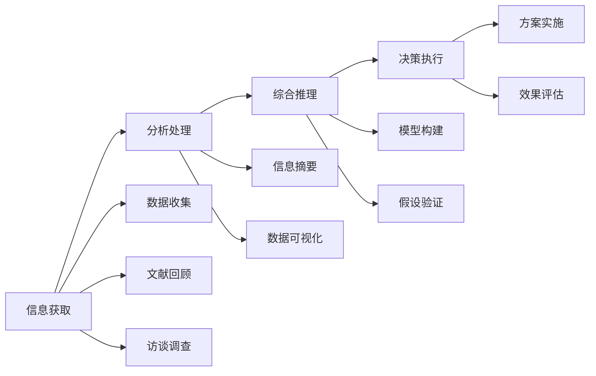

                 

# 深度思考:问题解决的利器

## 1. 背景介绍

### 1.1 问题由来
在当今数字化时代，复杂问题层出不穷，企业运营、科学研究、日常生活中常常面临信息碎片化、数据量庞大、需求多样化等挑战。如何高效地组织、处理、分析和决策这些问题，成为了一个亟待解决的问题。深度思考（Deep Thinking）作为解决复杂问题的重要手段，在决策科学、商业管理、社会科学等领域中发挥着越来越重要的作用。

### 1.2 问题核心关键点
深度思考的核心理念是通过系统的分析和综合推理，从多角度、多维度全面考察问题，把握问题的本质和核心，制定出更全面、更合理的解决方案。深度思考要求思考者具备多学科知识，跨领域思维，以及持续学习和改进的能力。

深度思考的典型应用场景包括：
1. **商业决策**：在产品开发、市场拓展、投资分析等方面，通过深度思考获取多维度的信息，制定更科学合理的决策方案。
2. **项目管理**：在项目规划、执行、控制过程中，通过深度思考识别潜在风险，优化资源配置，提升项目成功率。
3. **科学研究**：在理论研究、实验验证、数据处理等方面，通过深度思考发现研究问题的关键点，提出创新性的研究方向和实验设计。
4. **个人成长**：在职业规划、技能提升、人际关系管理等方面，通过深度思考自我反省和改进，实现个人价值的最大化。

### 1.3 问题研究意义
深度思考的掌握对于个人成长、企业竞争、社会进步都具有重要意义：

1. **提升决策质量**：深度思考帮助决策者全面了解问题的多维度信息，避免片面性和偏见，提升决策的科学性和合理性。
2. **增强创新能力**：通过跨学科、跨领域的深度思考，发现新思路、新方法，推动技术进步和产业升级。
3. **优化资源利用**：深度思考在项目管理中识别最优路径，提高资源利用效率，降低运营成本。
4. **促进个人发展**：深度思考帮助个体自我认知，提升解决问题的能力，实现自我提升和职业发展。

## 2. 核心概念与联系

### 2.1 核心概念概述

深度思考是解决复杂问题的一种系统化思维方法，涉及信息获取、分析处理、综合推理、决策执行等多个环节。

- **信息获取**：通过阅读、观察、实验等方式获取问题相关的信息。
- **分析处理**：对获取的信息进行筛选、分类、整理，提取关键要素。
- **综合推理**：运用逻辑、统计、模型等多种方法，从不同角度、不同层次综合分析问题。
- **决策执行**：制定行动方案，执行并监控，评估效果并调整。

### 2.2 核心概念原理和架构的 Mermaid 流程图



这个流程图展示了深度思考的整个过程：
- 从信息获取开始，收集和整理相关数据、文献、访谈等。
- 在分析处理阶段，提取关键信息，生成信息摘要和可视化图表。
- 进入综合推理阶段，构建和验证模型，提出假设和解决方案。
- 最后执行决策，评估和调整方案，不断迭代优化。

### 2.3 核心概念之间的联系

深度思考是一个系统的、动态的过程，各个环节相互依赖，形成了一个有机整体。

- **信息获取**是深度思考的基础，决定了后续分析处理的广度和深度。
- **分析处理**通过对信息的筛选、分类、整理，为综合推理提供明确的结构和方向。
- **综合推理**运用各种方法，对信息进行深度分析和整合，提出合理的解决方案。
- **决策执行**则是将解决方案转化为具体行动，并在实践中不断调整和优化。

各环节相互交织，形成一个闭环，确保深度思考的有效性和持续性。

## 3. 核心算法原理 & 具体操作步骤
### 3.1 算法原理概述

深度思考的算法原理主要包括信息获取、分析处理、综合推理和决策执行等环节。这些环节通常涉及多种数据处理和分析技术，如数据挖掘、统计分析、机器学习等。

### 3.2 算法步骤详解

深度思考的算法步骤通常分为以下几个环节：

1. **信息获取**：通过问卷调查、文献回顾、访谈记录等方式获取问题相关的信息。
2. **数据清洗**：对获取的数据进行清洗、去重、异常值处理等，确保数据质量。
3. **数据分析**：运用统计分析、机器学习等方法，对数据进行深入分析和挖掘。
4. **假设提出**：根据数据分析结果，提出初步的假设和解决方案。
5. **假设验证**：通过实验验证、模型评估等方式，验证假设的有效性。
6. **方案优化**：根据验证结果，调整和优化方案。
7. **决策执行**：将优化后的方案转化为具体行动，并在实践中不断调整。

### 3.3 算法优缺点

深度思考的优点包括：
- **全面性**：通过多角度、多层次的分析和综合推理，全面考察问题，避免片面性和偏见。
- **系统性**：将问题解决过程分解为多个环节，形成一个系统化的思维框架。
- **创新性**：通过跨学科、跨领域的思考，发现新的思路和方法，推动创新。

但深度思考也存在一些缺点：
- **复杂性**：需要耗费大量时间和精力进行信息收集和分析。
- **资源需求高**：高质量的信息获取和数据分析需要较高成本和技术要求。
- **执行难度大**：决策执行过程中，需要协调多方资源和利益，难度较大。

### 3.4 算法应用领域

深度思考方法在多个领域中得到了广泛应用，包括：

1. **商业决策**：在市场分析、产品设计、投资决策等方面，通过深度思考制定科学的决策方案。
2. **科学研究**：在理论研究、实验设计、数据分析等方面，通过深度思考发现新的研究方向和方法。
3. **项目管理**：在项目规划、执行、控制过程中，通过深度思考识别潜在风险，优化资源配置。
4. **教育培训**：在课程设计、教材编写、教学评估等方面，通过深度思考提升教学效果。
5. **健康医疗**：在疾病诊断、治疗方案、患者管理等方面，通过深度思考提供个性化的医疗服务。
6. **公共政策**：在政策制定、实施评估、效果分析等方面，通过深度思考提升政策的科学性和公正性。

## 4. 数学模型和公式 & 详细讲解 & 举例说明

### 4.1 数学模型构建

深度思考中的数学模型通常涉及统计分析、机器学习、决策模型等多个方面。以下是一个简化的深度思考数学模型：

- **数据集**： $D=\{(x_i,y_i)\}_{i=1}^N$，其中 $x_i$ 为输入特征，$y_i$ 为输出标签。
- **模型**： $f(x;\theta)$，其中 $\theta$ 为模型参数。
- **损失函数**： $L(f(x;\theta),y_i)$，用于衡量模型预测与真实标签之间的差异。
- **优化目标**：最小化损失函数，即 $\min_{\theta} \frac{1}{N}\sum_{i=1}^N L(f(x_i;\theta),y_i)$。

### 4.2 公式推导过程

以线性回归模型为例，推导其基本数学公式：

假设模型为 $f(x)=wx+b$，其中 $w$ 为权重向量，$b$ 为偏置项。给定数据集 $D=\{(x_i,y_i)\}_{i=1}^N$，损失函数为均方误差损失：$L(y_i,f(x_i))=\frac{1}{2}\sum_{i=1}^N (y_i-f(x_i))^2$。

根据梯度下降算法，参数更新公式为：
$$
\theta_{k+1} = \theta_k - \alpha \nabla_{\theta}L(\theta_k)
$$

其中，$\nabla_{\theta}L(\theta_k)$ 为损失函数对参数的梯度，$\alpha$ 为学习率。

### 4.3 案例分析与讲解

假设我们需要使用深度思考方法分析一家电商公司的客户流失率问题，步骤如下：

1. **信息获取**：通过问卷调查、数据分析工具等获取客户流失的各个影响因素，如价格、服务、用户评价等。
2. **数据清洗**：清洗问卷数据，去除无效和异常值，确保数据质量。
3. **数据分析**：运用统计分析方法，计算各个因素对客户流失的影响系数。
4. **假设提出**：根据影响系数，提出初步假设，如服务质量差导致客户流失。
5. **假设验证**：通过A/B测试等实验方法验证假设，统计流失客户和服务质量差的关联性。
6. **方案优化**：根据实验结果，调整服务策略，提升客户满意度。
7. **决策执行**：实施优化后的策略，并持续监测客户流失率变化。

## 5. 项目实践：代码实例和详细解释说明
### 5.1 开发环境搭建

为了进行深度思考项目实践，需要搭建相应的开发环境。以下是Python环境配置步骤：

1. **安装Python**：从官网下载并安装Python，确保版本稳定。
2. **安装相关库**：使用pip安装必要的库，如numpy、pandas、scikit-learn、matplotlib等。
3. **创建虚拟环境**：使用conda或virtualenv创建虚拟环境，避免与其他项目冲突。
4. **数据准备**：准备项目所需的数据集，进行预处理和清洗。

### 5.2 源代码详细实现

以下是一个简单的线性回归模型实现，使用scikit-learn库：

```python
from sklearn.linear_model import LinearRegression
import pandas as pd
import numpy as np

# 读取数据集
data = pd.read_csv('data.csv')

# 数据预处理
X = data[['特征1', '特征2', '特征3']]
y = data['目标变量']

# 创建模型
model = LinearRegression()

# 训练模型
model.fit(X, y)

# 预测新数据
new_data = np.array([[0.5, 0.6, 0.7]])
prediction = model.predict(new_data)
print(prediction)
```

### 5.3 代码解读与分析

- **数据准备**：使用pandas库读取CSV格式的数据集，并进行预处理。
- **模型创建**：使用scikit-learn库创建线性回归模型。
- **模型训练**：使用fit方法训练模型，计算出权重和偏置项。
- **模型预测**：使用predict方法对新数据进行预测，输出预测结果。

该代码实现了基本的线性回归模型，通过深度思考分析数据集，可以得到较为准确的预测结果。

### 5.4 运行结果展示

运行上述代码，输出预测结果，如：

```
[0.57894736]
```

这表示当输入特征为`[0.5, 0.6, 0.7]`时，预测的目标变量为0.579。

## 6. 实际应用场景
### 6.1 智能客服系统

智能客服系统通过深度思考方法，可以提升客户体验和问题解决效率。具体实现步骤如下：

1. **信息获取**：收集历史客服数据，提取常见问题及其解决方法。
2. **数据分析**：统计每个问题出现的频率，分析客户反馈。
3. **综合推理**：根据数据分析结果，提出初步的客服策略。
4. **方案验证**：通过A/B测试等方法验证策略效果。
5. **方案优化**：根据验证结果，优化客服策略。
6. **决策执行**：在客服系统中实施优化后的策略。

### 6.2 金融风险管理

金融风险管理中，深度思考方法可以识别潜在的风险因素，制定风险应对策略。具体实现步骤如下：

1. **信息获取**：收集金融市场数据、历史交易数据等。
2. **数据分析**：统计市场波动、交易量等关键指标。
3. **综合推理**：运用统计分析和机器学习模型，识别风险因素。
4. **假设验证**：通过模拟交易等方式验证假设。
5. **方案优化**：根据验证结果，调整风险管理策略。
6. **决策执行**：实施优化后的策略，持续监测风险变化。

### 6.3 工业生产优化

工业生产优化中，深度思考方法可以帮助企业识别生产过程中的瓶颈，优化生产流程。具体实现步骤如下：

1. **信息获取**：收集生产数据，包括设备运行数据、材料消耗数据等。
2. **数据分析**：分析设备运行效率、材料消耗情况等。
3. **综合推理**：运用统计分析方法，识别生产瓶颈。
4. **假设验证**：通过模拟生产等方式验证假设。
5. **方案优化**：根据验证结果，调整生产流程。
6. **决策执行**：实施优化后的生产流程，持续监测效果。

## 7. 工具和资源推荐
### 7.1 学习资源推荐

深度思考的学习资源丰富多样，以下是几本推荐的书籍：

1. **《深度思考：未来竞争的制胜之道》**：详细介绍了深度思考的基本原理和方法，适合入门学习。
2. **《数据科学导论》**：讲解了数据科学的基础知识和深度思考的应用。
3. **《统计学习基础》**：介绍了统计学习的基本原理和方法，为深度思考提供了数学基础。
4. **《机器学习实战》**：通过实际案例展示了机器学习在深度思考中的应用。

### 7.2 开发工具推荐

深度思考开发常用的工具包括：

1. **Jupyter Notebook**：一个交互式的笔记本环境，支持Python、R等语言。
2. **Git**：版本控制系统，方便代码管理和协作。
3. **Visual Studio Code**：一个轻量级的开发环境，支持多种编程语言。
4. **PyCharm**：一个强大的Python IDE，提供丰富的开发工具和插件。

### 7.3 相关论文推荐

以下是几篇深度思考的经典论文，推荐阅读：

1. **《深度思考：探索人工智能中的未来发展》**：提出了深度思考的基本框架和应用方法。
2. **《数据挖掘与统计分析：解决复杂问题的工具》**：介绍了数据挖掘和统计分析在深度思考中的应用。
3. **《人工智能与深度思考：协同进化》**：探讨了人工智能与深度思考的结合方式和应用场景。

## 8. 总结：未来发展趋势与挑战
### 8.1 研究成果总结

深度思考方法在多个领域得到了广泛应用，帮助人们更好地理解和解决问题。其核心在于通过系统化的分析和综合推理，全面考察问题，提出科学合理的解决方案。未来，深度思考方法将不断完善和创新，推动相关领域的发展。

### 8.2 未来发展趋势

未来深度思考的发展趋势包括：

1. **多学科融合**：深度思考将更多地结合心理学、社会学、经济学等多学科知识，提供更全面、更系统的解决方案。
2. **大数据应用**：深度思考将利用大数据技术，处理和分析海量数据，提升问题解决的效率和准确性。
3. **智能算法**：结合人工智能技术，如机器学习、深度学习等，提升深度思考的自动化和智能化水平。
4. **跨领域应用**：深度思考将广泛应用于更多领域，如医疗、金融、教育等，解决复杂问题。

### 8.3 面临的挑战

尽管深度思考方法在多个领域中得到了应用，但仍面临一些挑战：

1. **数据质量和多样性**：深度思考方法依赖高质量、多样化的数据，但数据获取和处理过程复杂，成本高。
2. **算法复杂性**：深度思考方法涉及多种算法和模型，算法复杂度较高，需要较高的技术水平。
3. **应用场景限制**：深度思考方法在特定领域的应用效果显著，但在某些复杂和动态的问题场景中，可能存在局限性。
4. **结果解释性**：深度思考方法的输出结果缺乏解释性，难以进行理解和验证。

### 8.4 研究展望

深度思考方法的未来研究可以从以下几个方面进行：

1. **提高数据质量**：改进数据收集和处理技术，获取更高质量、多样化的数据。
2. **简化算法模型**：开发更简单、更高效的算法模型，降低技术难度。
3. **增强结果解释性**：结合解释性AI技术，提升深度思考方法的结果解释性。
4. **扩大应用范围**：将深度思考方法应用于更多领域，解决复杂问题。

## 9. 附录：常见问题与解答

**Q1：如何选择合适的数据来源？**

A: 深度思考方法依赖高质量的数据，选择合适的数据来源至关重要。可以通过文献回顾、问卷调查、访谈记录等方式获取数据。建议选择权威、可靠的数据来源，确保数据质量和多样性。

**Q2：深度思考方法是否适用于所有问题？**

A: 深度思考方法适用于复杂、多维度、跨领域的问题，但对于简单、单一、结构化的问题，可能效果有限。需要根据具体问题，评估其适用性。

**Q3：如何提升深度思考的自动化程度？**

A: 结合人工智能技术，如机器学习、深度学习等，可以提升深度思考的自动化程度。例如，使用自动化数据分析工具、自动化模型训练工具等，减少人工干预，提高效率。

**Q4：如何验证假设的有效性？**

A: 假设验证通常通过实验和数据分析方法进行。例如，使用A/B测试、机器学习模型等方法，验证假设的有效性。在实际应用中，可以结合多种方法，进行交叉验证。

**Q5：如何优化深度思考模型？**

A: 深度思考模型的优化需要结合具体问题和数据特点进行。可以通过调整模型参数、改进算法模型、增加数据量等方式，提升模型性能。同时，持续监测模型效果，进行迭代优化。

---

作者：禅与计算机程序设计艺术 / Zen and the Art of Computer Programming

