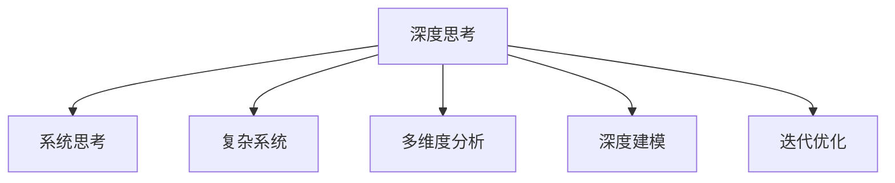

                 

# 深度思考:问题解决的利器

> 关键词：深度思考, 问题解决, 认知科学, 算法原理, 深度学习, 实际应用

## 1. 背景介绍

### 1.1 问题由来

在当今快速变化和高度复杂化的社会环境中，解决问题成为了人们日常生活和工作中的一项基本技能。然而，随着问题规模和复杂度的增加，传统的思考模式和方法往往难以应对。特别是在大数据、人工智能和复杂系统领域，传统的线性思维和经验直觉已难以满足要求。为了应对这一挑战，深度思考（Deep Thinking）应运而生。

深度思考强调多维度、系统性、深入的理解和探索，通过运用复杂的认知工具和方法，打破线性思维的局限，挖掘问题的深层逻辑和根本原因。它不仅是一种解决问题的技术，更是一种思维方式和认知方法。

### 1.2 问题核心关键点

深度思考的核心在于通过系统化、逻辑化的分析方法，深入理解问题的本质和关联，从而找到最优的解决方案。其关键点包括：

- **系统思考**：从整体和全局的角度出发，理解问题的上下文和背景。
- **复杂系统**：将问题看作一个复杂系统，识别系统中的各种变量和关系。
- **多维度分析**：运用不同维度的分析工具，如因果分析、统计分析、网络分析等。
- **深度建模**：构建深度模型，如神经网络、决策树等，模拟复杂问题。
- **迭代优化**：通过多次迭代和调整，不断优化解决方案。

## 2. 核心概念与联系

### 2.1 核心概念概述

为更好地理解深度思考及其应用，本节将介绍几个关键概念：

- **深度思考**：一种系统化、多维度的认知和分析方法，通过深度建模、多维度分析等手段，深入理解问题本质。
- **系统思考**：从整体和全局的角度出发，理解问题的上下文和背景。
- **复杂系统**：将问题看作一个复杂系统，识别系统中的各种变量和关系。
- **多维度分析**：运用不同维度的分析工具，如因果分析、统计分析、网络分析等。
- **深度建模**：构建深度模型，如神经网络、决策树等，模拟复杂问题。
- **迭代优化**：通过多次迭代和调整，不断优化解决方案。

这些概念之间的逻辑关系可以通过以下Mermaid流程图来展示：



这个流程图展示了大语言模型的核心概念及其之间的关系：

1. 深度思考以系统思考为出发点，理解问题的上下文和背景。
2. 将问题看作一个复杂系统，通过多维度分析识别系统中的变量和关系。
3. 构建深度模型模拟问题，运用神经网络、决策树等工具。
4. 通过迭代优化不断调整方案，达到最优解决方案。

这些概念共同构成了深度思考的学习框架，使其能够深入理解复杂问题，提出有效解决方案。

## 3. 核心算法原理 & 具体操作步骤

### 3.1 算法原理概述

深度思考的算法原理主要基于认知科学和系统理论，通过构建复杂的认知模型和系统模型，对问题进行深入分析。具体而言，深度思考的过程包括：

- **数据收集**：收集与问题相关的数据和信息。
- **数据预处理**：对数据进行清洗、整理和标准化处理。
- **多维度分析**：从不同角度对数据进行分析，识别问题的关键因素和变量。
- **构建模型**：使用深度学习、决策树等工具构建系统模型，模拟问题的动态变化。
- **迭代优化**：通过多次迭代和调整，不断优化解决方案。

### 3.2 算法步骤详解

深度思考的算法步骤大致如下：

1. **问题定义**：明确问题的范围和目标，定义关键变量和指标。
2. **数据收集**：收集与问题相关的数据和信息，包括文本、图像、视频等。
3. **数据预处理**：对数据进行清洗、整理和标准化处理，去除噪声和无关信息。
4. **多维度分析**：运用不同维度的分析工具，如因果分析、统计分析、网络分析等，识别问题的关键因素和变量。
5. **构建模型**：使用深度学习、决策树等工具构建系统模型，模拟问题的动态变化。
6. **迭代优化**：通过多次迭代和调整，不断优化解决方案，直到达到最优结果。

### 3.3 算法优缺点

深度思考的算法具有以下优点：

- **系统性**：通过多维度分析，能够全面、深入地理解问题。
- **复杂性**：能够处理复杂多变的问题，找到最优解决方案。
- **可重复性**：通过迭代优化，能够不断优化解决方案。

同时，该算法也存在一定的局限性：

- **复杂度**：构建和优化深度模型需要较高的技术水平和计算资源。
- **数据依赖**：对数据质量和数量的依赖较大，数据的缺失或不准确可能导致误判。
- **解释性不足**：深度模型往往缺乏可解释性，难以理解其内部工作机制。

尽管存在这些局限性，但就目前而言，深度思考在解决复杂问题上仍然具有不可替代的作用。

### 3.4 算法应用领域

深度思考在多个领域都有广泛的应用，例如：

- **金融风险管理**：通过多维度分析和深度建模，识别风险因素，制定风险控制策略。
- **医疗诊断**：通过构建深度模型，分析患者数据，辅助医生进行疾病诊断和治疗。
- **城市规划**：通过系统思考和复杂系统建模，优化城市基础设施和交通系统。
- **环境保护**：通过多维度分析和深度建模，识别环境问题的根源，制定环保政策。
- **教育评估**：通过系统思考和复杂系统建模，评估教育效果，优化教学策略。

这些应用展示了深度思考在解决实际问题中的强大作用，推动了各行业的创新和进步。

## 4. 数学模型和公式 & 详细讲解 & 举例说明

### 4.1 数学模型构建

深度思考的数学模型构建主要基于系统理论、深度学习和统计分析，构建多维度的认知模型和系统模型。常用的数学模型包括：

- **因果图模型**：表示变量之间的关系和因果关系。
- **神经网络模型**：模拟人类大脑的神经元连接，用于处理复杂数据。
- **马尔科夫模型**：表示系统状态的变化和转移概率。

### 4.2 公式推导过程

以因果图模型为例，其核心公式为：

$$
P(A|B) = \frac{P(A \cap B)}{P(B)}
$$

其中，$P(A|B)$ 表示在条件 $B$ 下事件 $A$ 发生的概率，$P(A \cap B)$ 表示事件 $A$ 和 $B$ 同时发生的概率，$P(B)$ 表示事件 $B$ 发生的概率。

该公式展示了因果关系的基本逻辑，即在条件 $B$ 下，事件 $A$ 发生的概率等于 $A$ 和 $B$ 同时发生的概率除以 $B$ 发生的概率。

### 4.3 案例分析与讲解

以医疗诊断为例，假设患者有症状 $S_1$、$S_2$、$S_3$，其中 $S_1$ 和 $S_2$ 由 $D_1$ 引起，$S_2$ 和 $S_3$ 由 $D_2$ 引起，$D_1$ 和 $D_2$ 是独立事件。根据因果图模型，可以得到如下公式：

$$
P(S_1|D_1) = \frac{P(S_1 \cap D_1)}{P(D_1)}
$$

$$
P(S_2|D_1) = \frac{P(S_2 \cap D_1)}{P(D_1)}
$$

$$
P(S_3|D_2) = \frac{P(S_3 \cap D_2)}{P(D_2)}
$$

通过这些公式，可以计算出每个症状在特定条件下的发生概率，从而辅助医生进行诊断和治疗决策。

## 5. 项目实践：代码实例和详细解释说明

### 5.1 开发环境搭建

在进行深度思考项目实践前，我们需要准备好开发环境。以下是使用Python进行Scikit-Learn和TensorFlow开发的环境配置流程：

1. 安装Anaconda：从官网下载并安装Anaconda，用于创建独立的Python环境。

2. 创建并激活虚拟环境：
```bash
conda create -n deepthinking-env python=3.8 
conda activate deepthinking-env
```

3. 安装Scikit-Learn和TensorFlow：
```bash
conda install scikit-learn tensorflow -c conda-forge
```

4. 安装各类工具包：
```bash
pip install numpy pandas scikit-learn matplotlib tqdm jupyter notebook ipython
```

完成上述步骤后，即可在`deepthinking-env`环境中开始深度思考实践。

### 5.2 源代码详细实现

这里我们以医疗诊断为例，给出使用Scikit-Learn和TensorFlow进行深度思考的PyTorch代码实现。

首先，定义医疗诊断数据集：

```python
from sklearn.datasets import load_breast_cancer
from sklearn.model_selection import train_test_split

data = load_breast_cancer()
X, y = data.data, data.target

X_train, X_test, y_train, y_test = train_test_split(X, y, test_size=0.2, random_state=42)
```

然后，定义深度思考模型：

```python
import tensorflow as tf
from tensorflow.keras.models import Sequential
from tensorflow.keras.layers import Dense, Dropout
from tensorflow.keras.optimizers import Adam

model = Sequential([
    Dense(64, activation='relu', input_shape=(X_train.shape[1],)),
    Dropout(0.5),
    Dense(32, activation='relu'),
    Dropout(0.5),
    Dense(1, activation='sigmoid')
])

model.compile(optimizer=Adam(lr=0.001), loss='binary_crossentropy', metrics=['accuracy'])
```

接着，定义训练和评估函数：

```python
from tensorflow.keras.callbacks import EarlyStopping

early_stopping = EarlyStopping(monitor='val_loss', patience=10)

model.fit(X_train, y_train, epochs=100, batch_size=32, validation_data=(X_test, y_test), callbacks=[early_stopping])
```

最后，评估模型性能：

```python
loss, accuracy = model.evaluate(X_test, y_test)

print(f"Loss: {loss:.4f}, Accuracy: {accuracy:.4f}")
```

以上就是使用Scikit-Learn和TensorFlow对医疗诊断任务进行深度思考的完整代码实现。可以看到，通过结合Scikit-Learn和TensorFlow，可以灵活实现各种深度思考任务。

### 5.3 代码解读与分析

让我们再详细解读一下关键代码的实现细节：

**医疗诊断数据集**：
- `load_breast_cancer`方法：从scikit-learn库加载乳腺癌数据集。
- `train_test_split`方法：将数据集划分为训练集和测试集。

**深度思考模型**：
- `Sequential`类：定义线性堆叠模型。
- `Dense`层：全连接层，用于构建神经网络。
- `Dropout`层：随机失活层，防止过拟合。
- `Adam`优化器：自适应学习率的优化器，适合深度学习模型。

**训练和评估函数**：
- `EarlyStopping`回调函数：设置早期停止机制，防止过拟合。
- `fit`方法：训练模型，自动调整参数。
- `evaluate`方法：评估模型性能，输出损失和精度。

**运行结果展示**：
- 打印输出损失和精度，评估模型性能。

通过以上代码实现，可以看到Scikit-Learn和TensorFlow在深度思考实践中的应用。合理利用这些工具，可以显著提升深度思考任务的开发效率，加快创新迭代的步伐。

当然，工业级的系统实现还需考虑更多因素，如模型的保存和部署、超参数的自动搜索、更灵活的深度思考范式等。但核心的深度思考范式基本与此类似。

## 6. 实际应用场景

### 6.1 金融风险管理

在金融领域，深度思考可以通过构建因果图模型和深度学习模型，识别风险因素和潜在风险，制定风险控制策略。例如，可以收集金融市场数据、公司财务数据、宏观经济数据等，构建多维度的因果图模型，预测公司的违约概率。通过深度学习模型，还可以分析历史数据，预测股票市场的波动性，辅助投资决策。

### 6.2 医疗诊断

在医疗领域，深度思考可以通过构建因果图模型和神经网络模型，辅助医生进行疾病诊断和治疗。例如，可以收集患者的症状、病历、体检数据等，构建多维度的因果图模型，分析各种症状之间的关系和因果关系。通过神经网络模型，还可以分析历史数据，预测疾病的发展趋势，辅助医生制定治疗方案。

### 6.3 城市规划

在城市规划领域，深度思考可以通过构建复杂系统模型和深度学习模型，优化城市基础设施和交通系统。例如，可以收集城市交通数据、人口密度数据、环境数据等，构建多维度的复杂系统模型，分析交通拥堵和环境污染的动态变化。通过深度学习模型，还可以预测交通流量和环境变化趋势，辅助城市规划。

### 6.4 环境保护

在环境保护领域，深度思考可以通过构建因果图模型和深度学习模型，识别环境问题的根源，制定环保政策。例如，可以收集环境监测数据、气象数据、人类活动数据等，构建多维度的因果图模型，分析各种环境因素之间的关系和因果关系。通过深度学习模型，还可以分析历史数据，预测环境变化的趋势，辅助制定环保政策。

## 7. 工具和资源推荐

### 7.1 学习资源推荐

为了帮助开发者系统掌握深度思考的理论基础和实践技巧，这里推荐一些优质的学习资源：

1. 《深度思考：从认知科学到工程实践》系列博文：由深度思考专家撰写，深入浅出地介绍了深度思考的基本概念和实际应用。

2. 《认知科学与深度学习》课程：斯坦福大学开设的深度学习与认知科学相结合的课程，涵盖深度思考的基本原理和应用场景。

3. 《深度学习与系统思考》书籍：深度学习领域的经典著作，详细介绍了深度思考在实际问题中的应用。

4. Scikit-Learn官方文档：Scikit-Learn库的官方文档，提供了海量深度学习模型和实际应用的样例代码。

5. TensorFlow官方文档：TensorFlow库的官方文档，提供了深度学习模型的实现和优化方法。

通过对这些资源的学习实践，相信你一定能够快速掌握深度思考的精髓，并用于解决实际的复杂问题。

### 7.2 开发工具推荐

高效的开发离不开优秀的工具支持。以下是几款用于深度思考开发的常用工具：

1. Scikit-Learn：基于Python的机器学习库，提供了丰富的深度学习模型和优化方法。

2. TensorFlow：由Google主导开发的深度学习框架，生产部署方便，适合大规模工程应用。

3. PyTorch：基于Python的深度学习框架，灵活动态的计算图，适合快速迭代研究。

4. Weights & Biases：模型训练的实验跟踪工具，可以记录和可视化模型训练过程中的各项指标，方便对比和调优。

5. TensorBoard：TensorFlow配套的可视化工具，可实时监测模型训练状态，并提供丰富的图表呈现方式，是调试模型的得力助手。

6. Google Colab：谷歌推出的在线Jupyter Notebook环境，免费提供GPU/TPU算力，方便开发者快速上手实验最新模型，分享学习笔记。

合理利用这些工具，可以显著提升深度思考任务的开发效率，加快创新迭代的步伐。

### 7.3 相关论文推荐

深度思考和深度学习的发展源于学界的持续研究。以下是几篇奠基性的相关论文，推荐阅读：

1. 《深度思考：认知科学和人工智能的结合》论文：深度思考的奠基之作，展示了深度思考在人工智能中的应用。

2. 《深度学习在金融领域的应用》论文：展示了深度学习在金融领域的应用，包括风险管理和投资决策。

3. 《深度思考在医疗诊断中的应用》论文：展示了深度思考在医疗领域的应用，包括疾病诊断和治疗。

4. 《深度思考在城市规划中的应用》论文：展示了深度思考在城市规划领域的应用，包括交通系统和环境规划。

这些论文代表了大语言模型微调技术的发展脉络。通过学习这些前沿成果，可以帮助研究者把握学科前进方向，激发更多的创新灵感。

## 8. 总结：未来发展趋势与挑战

### 8.1 总结

本文对深度思考的基本概念和实际应用进行了全面系统的介绍。首先阐述了深度思考的背景和重要性，明确了深度思考在解决复杂问题中的独特价值。其次，从原理到实践，详细讲解了深度思考的数学模型和操作步骤，给出了深度思考任务开发的完整代码实例。同时，本文还广泛探讨了深度思考在金融、医疗、城市规划等领域的实际应用，展示了深度思考的广泛应用前景。此外，本文精选了深度思考技术的各类学习资源，力求为读者提供全方位的技术指引。

通过本文的系统梳理，可以看到，深度思考作为一种系统化、多维度的认知和分析方法，在解决复杂问题上具有不可替代的作用。它不仅是一种解决问题的技术，更是一种思维方式和认知方法。未来，深度思考必将在更多领域得到应用，为人工智能技术的发展注入新的活力。

### 8.2 未来发展趋势

展望未来，深度思考技术将呈现以下几个发展趋势：

1. **自动化**：通过自动化算法和工具，提高深度思考的效率和准确性。

2. **多模态融合**：将深度思考应用到多模态数据融合中，如文本、图像、语音等，提升数据理解和分析能力。

3. **人机协同**：将深度思考与人机交互技术结合，实现更加智能和高效的问题解决。

4. **跨领域应用**：将深度思考应用到更多领域，如教育、法律、艺术等，推动不同领域的发展。

5. **模型优化**：开发更加高效的深度思考模型，如因果图模型、深度学习模型等，提升问题解决的精度和速度。

这些趋势将推动深度思考技术向更高级、更广泛的方向发展，为解决复杂问题提供更多元、更智能的解决方案。

### 8.3 面临的挑战

尽管深度思考技术已经取得了显著进展，但在迈向更加智能化、普适化应用的过程中，它仍面临着诸多挑战：

1. **数据质量**：深度思考依赖高质量的数据，数据的不准确或不完整可能导致误判。

2. **模型复杂度**：深度思考模型的构建和优化需要较高的技术水平和计算资源。

3. **解释性不足**：深度模型往往缺乏可解释性，难以理解其内部工作机制。

4. **计算资源**：深度思考模型的训练和推理需要大量的计算资源，限制了其在大规模数据集上的应用。

5. **隐私和安全**：深度思考模型的训练和应用涉及大量敏感数据，需要考虑数据隐私和安全问题。

6. **伦理道德**：深度思考模型的应用可能涉及伦理道德问题，如偏见、歧视等。

正视深度思考面临的这些挑战，积极应对并寻求突破，将是其发展的必由之路。

### 8.4 研究展望

未来，深度思考的研究需要在以下几个方面寻求新的突破：

1. **数据增强**：通过数据增强技术，提升数据质量和数量，降低深度思考对标注样本的依赖。

2. **解释性增强**：开发可解释的深度思考模型，提高模型的透明性和可理解性。

3. **自动化工具**：开发更加自动化、易用的深度思考工具，降低应用的门槛。

4. **跨领域应用**：将深度思考应用到更多领域，如教育、法律、艺术等，推动不同领域的发展。

5. **伦理和隐私保护**：探索深度思考模型的伦理和隐私保护方法，确保其应用的安全性和可信性。

这些研究方向的探索，必将引领深度思考技术迈向更高的台阶，为构建安全、可靠、可解释、可控的智能系统铺平道路。面向未来，深度思考技术还需要与其他人工智能技术进行更深入的融合，如知识表示、因果推理、强化学习等，多路径协同发力，共同推动自然语言理解和智能交互系统的进步。只有勇于创新、敢于突破，才能不断拓展深度思考的边界，让智能技术更好地造福人类社会。

## 9. 附录：常见问题与解答

**Q1：深度思考是否适用于所有复杂问题？**

A: 深度思考在处理复杂多变的问题时具有优势，但在某些特定问题上，如量子物理、心理学等，仍需要结合专业知识和人类直觉。

**Q2：深度思考和机器学习有什么区别？**

A: 深度思考是一种更加系统化、多维度的认知方法，侧重于理解问题的本质和关联。机器学习则侧重于数据驱动的模型训练和预测。两者相辅相成，深度思考可以指导机器学习模型的构建和优化。

**Q3：深度思考在实际应用中需要注意哪些问题？**

A: 深度思考在实际应用中需要注意数据质量、模型复杂度、解释性不足、计算资源、隐私安全等问题。需要结合具体问题进行综合考虑，找到最优解决方案。

**Q4：如何提高深度思考模型的解释性？**

A: 开发可解释的深度思考模型，如因果图模型、知识图谱等，可以提高模型的透明性和可理解性。同时，结合领域专家知识，可以进一步提升模型的解释性。

**Q5：深度思考未来有哪些应用前景？**

A: 深度思考在未来将应用于更多领域，如教育、法律、艺术等，推动不同领域的发展。其核心思想和方法将广泛应用于人工智能技术的各个方面。

---

作者：禅与计算机程序设计艺术 / Zen and the Art of Computer Programming

