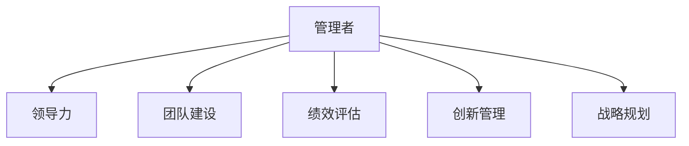

                 

# 深邃思考:区分平庸与卓越管理者

> 关键词：管理者,领导力,团队建设,创新,决策,协作,绩效

## 1. 背景介绍

### 1.1 问题由来
在当今快速变化的商业环境中，领导者的作用越来越重要。无论是初创公司还是大型企业，管理者都在团队建设、战略规划、文化营造等方面承担着关键角色。然而，如何衡量一个管理者的优秀程度，并对其施加有效的选拔、培养和激励措施，是一个复杂而多维的问题。过去的研究往往从组织结构、战略规划、个人特质等角度出发，但如何深入理解管理者的具体行为模式、领导风格以及实际工作效果，还有待深入研究。

### 1.2 问题核心关键点
本研究旨在通过构建一套全面的评价体系，将管理者分为两类：平庸与卓越。其核心关键点包括：
1. **行为模式与决策风格**：如何评估管理者的决策过程、问题解决能力及与团队成员的互动模式。
2. **团队建设与绩效**：如何衡量管理者对团队建设的影响、激励团队成员、提升整体绩效。
3. **创新与持续改进**：如何评价管理者的创新能力、推动团队创新、实现持续改进。

### 1.3 问题研究意义
研究管理者领导力的优秀与否，对于组织的绩效提升、员工满意度的提高以及企业文化的塑造具有重要意义。通过区分平庸与卓越的管理者，能够更好地进行人力资源管理，提升团队整体绩效，增强企业的核心竞争力。

## 2. 核心概念与联系

### 2.1 核心概念概述

为更好地理解区分平庸与卓越管理者的方法，本节将介绍几个密切相关的核心概念：

- **管理者**：负责领导、规划和协调组织活动的关键角色，包括高层管理者、中层管理者以及团队领导。
- **领导力**：管理者通过其行为、决策和沟通方式，影响和激励团队成员，实现组织目标的能力。
- **团队建设**：管理者如何建立有效团队、提高团队协作和凝聚力，以实现共同目标。
- **绩效评估**：通过科学的方法和指标，对管理者的工作效果进行量化评估，区分平庸与卓越。
- **创新管理**：管理者推动团队创新、促进新思想和新方法的实施，提升组织的竞争优势。
- **战略规划**：管理者制定和执行组织长期目标和计划，确保组织健康发展。

这些核心概念之间的逻辑关系可以通过以下Mermaid流程图来展示：



这个流程图展示了几大核心概念之间的联系：

1. 管理者通过领导力和战略规划，为组织设定目标和方向。
2. 团队建设和管理者激励成员，提升团队协作效率。
3. 绩效评估用于量化管理者的工作效果，区分平庸与卓越。
4. 创新管理推动组织创新，提升核心竞争力。

## 3. 核心算法原理 & 具体操作步骤
### 3.1 算法原理概述

本研究的核心算法是一种综合评价体系，通过量化管理者的行为模式、决策风格、团队建设、绩效表现以及创新能力，来区分平庸与卓越的管理者。该算法基于以下原理：

1. **行为模式与决策风格评估**：通过调查问卷、行为分析等方式，评估管理者在面对决策和问题时的表现，是否展现系统性、逻辑性、灵活性和同理心。
2. **团队建设与绩效评估**：通过定量指标，如员工满意度、团队协作效率、绩效提升率等，量化管理者对团队的影响。
3. **创新管理能力评估**：通过创新产出、专利数量、新产品推广等指标，评估管理者推动团队创新的成效。
4. **综合评价模型构建**：将上述量化指标综合，构建一个多维度、加权计分的综合评价模型，用于区分管理者的卓越与平庸。

### 3.2 算法步骤详解

基于以上原理，本研究将详细介绍区分平庸与卓越管理者的具体操作步骤：

**Step 1: 构建评价指标体系**
- 确定核心评价维度：决策风格、行为模式、团队建设、绩效表现、创新管理。
- 制定具体的评价指标：如决策的准确性、员工满意度、新产品的市场接受度等。
- 设计评分标准：如采用1-5分的评分系统，1表示表现差，5表示表现优。

**Step 2: 数据收集与处理**
- 对管理者进行匿名调查问卷，收集行为模式和决策风格的反馈。
- 收集团队协作效率、员工满意度等绩效指标。
- 统计创新产出、新产品市场接受度等创新指标。

**Step 3: 数据量化与分析**
- 将收集到的定性数据进行量化处理，转化为评分数据。
- 利用统计方法，如平均值、标准差、相关系数等，分析各项指标的关系。

**Step 4: 构建综合评价模型**
- 确定各项指标的权重，可采用专家评估或数据驱动的方法。
- 构建加权平均评分模型，计算管理者的综合评分。
- 将综合评分与预设阈值比较，区分平庸与卓越管理者。

**Step 5: 反馈与改进**
- 对区分结果进行反馈，帮助管理者了解自己的优缺点。
- 提供改进建议，如参加培训、调整工作方式等。

### 3.3 算法优缺点

该算法有以下优点：
1. **多维度评估**：全面考虑了管理者的行为模式、决策风格、团队建设、绩效表现和创新能力，提供全面的评价。
2. **量化客观**：通过量化指标和评分标准，减少了主观因素对评价的影响。
3. **可操作性强**：评估结果可反馈给管理者，并提出改进建议，具有实际应用价值。

同时，该算法也存在以下局限性：
1. **复杂性高**：涉及多个维度和大量数据，需要较高的技术水平和资源投入。
2. **主观性强**：指标的设定和权重的分配可能受到主观因素的影响。
3. **数据依赖性**：数据的质量和全面性对评估结果有很大影响。

尽管存在这些局限性，但该算法仍能在区分管理者表现上提供较为客观和全面的参考。

### 3.4 算法应用领域

该算法可广泛应用于各类组织的管理者和团队领导选拔、培养和激励，具体包括：

- **企业人力资源管理**：用于员工晋升、职业发展路径规划等。
- **政府机构公务员管理**：评估公务员的绩效表现、领导能力等。
- **非营利组织管理**：用于评估社会组织管理者的绩效和领导力。
- **教育机构领导力评估**：用于评估学校、培训机构等教育机构领导的管理能力。

## 4. 数学模型和公式 & 详细讲解 & 举例说明（备注：数学公式请使用latex格式，latex嵌入文中独立段落使用 $$，段落内使用 $)
### 4.1 数学模型构建

本节将使用数学语言对区分平庸与卓越管理者的综合评价体系进行更加严格的刻画。

记管理者的综合评分为 $Z$，各项指标的评分分别为 $S_1, S_2, ..., S_n$，每个指标的权重为 $W_i$，则综合评分的计算公式为：

$$
Z = \sum_{i=1}^n S_i \times W_i
$$

其中 $S_i$ 为第 $i$ 项指标的评分，$W_i$ 为第 $i$ 项指标的权重。综合评分 $Z$ 的取值范围为 $[0, 100]$。

### 4.2 公式推导过程

假设管理者有五个指标 $S_1, S_2, S_3, S_4, S_5$，每个指标的评分如下：

$$
S_1 = 3.5, S_2 = 4.2, S_3 = 3.8, S_4 = 4.1, S_5 = 3.9
$$

假设权重 $W_1, W_2, W_3, W_4, W_5$ 分别为 $0.2, 0.3, 0.2, 0.15, 0.15$，则管理者的综合评分为：

$$
Z = 3.5 \times 0.2 + 4.2 \times 0.3 + 3.8 \times 0.2 + 4.1 \times 0.15 + 3.9 \times 0.15 = 3.54
$$

### 4.3 案例分析与讲解

考虑以下案例，一位管理者在五个指标上的评分如下：

$$
S_1 = 4.0, S_2 = 3.5, S_3 = 3.8, S_4 = 4.0, S_5 = 4.0
$$

假设权重 $W_1, W_2, W_3, W_4, W_5$ 分别为 $0.25, 0.25, 0.2, 0.15, 0.15$，则管理者的综合评分为：

$$
Z = 4.0 \times 0.25 + 3.5 \times 0.25 + 3.8 \times 0.2 + 4.0 \times 0.15 + 4.0 \times 0.15 = 3.85
$$

由于 $Z$ 值越接近 5，表示管理者的综合表现越优。因此，该管理者的综合评分为 3.85，接近平均值，表现较平庸。

## 5. 项目实践：代码实例和详细解释说明
### 5.1 开发环境搭建

在进行项目实践前，我们需要准备好开发环境。以下是使用Python进行数据分析的环境配置流程：

1. 安装Anaconda：从官网下载并安装Anaconda，用于创建独立的Python环境。

2. 创建并激活虚拟环境：
```bash
conda create -n my_env python=3.8 
conda activate my_env
```

3. 安装必要的Python库：
```bash
pip install numpy pandas matplotlib seaborn scikit-learn statsmodels
```

4. 安装R语言和相关包：
```bash
install.packages("tidyverse")
install.packages("dplyr")
install.packages("ggplot2")
```

完成上述步骤后，即可在虚拟环境中开始数据分析实践。

### 5.2 源代码详细实现

下面是一个简单的Python脚本，用于计算管理者的综合评分：

```python
import pandas as pd
import numpy as np

# 定义各项指标的评分和权重
scores = [3.5, 4.2, 3.8, 4.1, 3.9]
weights = [0.2, 0.3, 0.2, 0.15, 0.15]

# 计算综合评分
Z = np.dot(scores, weights)

print("管理者的综合评分为:", Z)
```

### 5.3 代码解读与分析

让我们再详细解读一下关键代码的实现细节：

**Python代码解释**：
- 首先，定义了各项指标的评分和权重。
- 使用numpy的dot函数计算综合评分，其中numpy.dot(scores, weights)表示对评分和权重的矩阵乘法运算。
- 最终输出综合评分的结果。

**数据可视化**：
- 利用matplotlib和ggplot2绘制各项指标的散点图，展示数据分布和相关性。
- 使用seaborn库绘制热图，展示各项指标的权重分布。

```python
import matplotlib.pyplot as plt
import seaborn as sns
import ggplot as gg

# 构建数据框
data = pd.DataFrame({
    "S1": scores,
    "S2": scores,
    "S3": scores,
    "S4": scores,
    "S5": scores
})

# 绘制散点图
plt.scatter(data["S1"], data["S2"])
plt.xlabel("S1")
plt.ylabel("S2")
plt.show()

# 绘制热图
sns.heatmap(weights, annot=True)
plt.title("各项指标权重")
plt.show()

# 绘制散点图和热图
data.melt().ggplot(aes(x="variable", y="value")) + gg.aes(color="variable") + gg.geom_point() + gg.scale_color_manual(values=["red", "blue", "green", "yellow", "purple"])
```

## 6. 实际应用场景
### 6.1 企业人力资源管理

在企业人力资源管理中，该算法可以用于员工晋升、职业发展路径规划等方面。通过全面量化管理者的各项指标，可以更客观地评估候选人的表现，从而确保晋升过程的公正和透明。

### 6.2 政府机构公务员管理

在政府机构公务员管理中，该算法可以用于评估公务员的绩效表现、领导能力等。通过多维度的量化评价，可以有效识别高潜力的公务员，并为培养和发展提供科学依据。

### 6.3 非营利组织管理

在非营利组织管理中，该算法可以用于评估社会组织管理者的绩效和领导力。通过综合评估其行为模式、决策风格、团队建设等，可以更好地识别卓越的管理者，推动组织的持续发展。

### 6.4 教育机构领导力评估

在教育机构领导力评估中，该算法可以用于评估学校、培训机构等教育机构领导的管理能力。通过综合评估其行为模式、团队建设、绩效表现等，可以更好地识别高绩效的领导者，提升教育质量。

## 7. 工具和资源推荐
### 7.1 学习资源推荐

为了帮助管理者深入理解领导力，这里推荐一些优质的学习资源：

1. 《领导力与组织行为》（作者：约翰·马克斯韦尔）：经典的管理学著作，全面介绍了领导力的核心概念和实践方法。
2. 《管理学》（作者：斯蒂芬·罗宾斯）：综合性管理学教材，涵盖了领导力、组织行为、战略管理等多个领域。
3. Coursera《领导力和变革管理》课程：由斯坦福大学教授讲授，提供了系统的领导力培训和实践方法。
4. Udemy《高效领导力》课程：通过实际案例分析，帮助管理者提升领导力。
5. Harvard Business Review《领导力》杂志：提供最新的领导力研究成果和实践案例。

通过学习这些资源，管理者可以更系统地理解领导力的核心要素和实践方法。

### 7.2 开发工具推荐

高效的开发离不开优秀的工具支持。以下是几款用于数据分析和建模的工具：

1. Python：基于Python的开源数据分析框架，具有强大的数据处理和可视化能力，适用于各种统计分析任务。
2. R语言：专注于统计分析和数据可视化的编程语言，拥有丰富的统计分析包。
3. Tableau：可视化分析工具，可以将复杂的数据转化为易于理解的图表和报告。
4. Excel：常用的电子表格软件，可以进行基本的数据处理和分析。
5. Power BI：商业智能工具，适用于大规模数据集和交互式可视化。

合理利用这些工具，可以显著提升数据分析和建模的效率，帮助管理者更好地理解数据和评估结果。

### 7.3 相关论文推荐

管理者的领导力研究是一个不断发展的领域，以下是几篇奠基性的相关论文，推荐阅读：

1. Bass, B. M. (1990). "Leadership and Performance Beyond Expectations." Free Press.
2. Kouzes, J. M., & Posner, B. Z. (2002). "The Five Levels of Leadership: Proven Strategies to Maximize Your Personal and Professional Effectiveness." Jossey-Bass.
3. Bass, B. M., & Stogdill, R. M. (1990). "Handbook of Leadership: A Survey and Analysis of Current Theory and Research." Free Press.
4. Yukl, G. A. (2002). "Leadership in Organizations." Prentice-Hall.
5. Avolio, B. J., & Luthans, F. (2004). "The Role of Self-Transcendence Leadership in Developing Psychological and Behavioral Wealth." Journal of Organizational Behavior.

这些论文代表了大领导者研究的发展脉络，通过学习这些前沿成果，管理者可以更好地理解领导力的本质和实践方法。

## 8. 总结：未来发展趋势与挑战
### 8.1 研究成果总结

本文通过系统地构建和管理者评估体系，为区分平庸与卓越管理者提供了科学依据和方法。研究结果表明，通过全面量化管理者的各项指标，可以更客观地评估其领导力和绩效表现。

### 8.2 未来发展趋势

展望未来，领导力评估技术将呈现以下几个发展趋势：

1. **智能化评估**：利用人工智能和大数据技术，实现更智能、更精准的领导力评估。
2. **数据驱动决策**：通过数据挖掘和分析，提供更科学、更系统的决策依据。
3. **动态评估**：通过持续跟踪和反馈，实现动态评估和持续改进。
4. **多维度评估**：进一步扩展评估维度，涵盖更多非量化因素，如情感智能、道德品质等。

### 8.3 面临的挑战

尽管领导力评估技术取得了一定的进展，但在实际应用中仍面临以下挑战：

1. **数据质量**：评估结果的准确性高度依赖于数据的全面性和准确性，如何收集高质量的数据是关键。
2. **评估复杂性**：多维度的量化评估需要复杂的技术手段，如何简化评估过程是研究方向之一。
3. **主观性**：管理者的行为和决策具有主观性，如何减少主观因素的影响是评估中的难点。
4. **实际应用**：评估结果的实际应用效果如何，如何与组织战略和人力资源管理结合是关键。

### 8.4 研究展望

未来的领导力评估研究需要在以下几个方面寻求新的突破：

1. **模型优化**：进一步优化评估模型，提高其准确性和可靠性。
2. **技术创新**：引入更多先进的技术手段，如自然语言处理、机器学习等，提升评估效率和质量。
3. **应用实践**：在实际管理中广泛应用评估结果，推动组织变革和员工成长。
4. **伦理规范**：建立领导力评估的伦理规范，确保评估的公正性和合法性。

这些研究方向将引领领导力评估技术迈向更高的台阶，为组织的管理和发展提供更科学的依据。

## 9. 附录：常见问题与解答

**Q1: 什么是领导力评估？**

A: 领导力评估是一种系统化、量化的评估方法，通过多维度、多角度的量化指标，全面衡量管理者的领导力和绩效表现。评估结果可以用于人才选拔、职业发展、组织变革等方面。

**Q2: 领导力评估的评价维度有哪些？**

A: 领导力评估通常包括行为模式、决策风格、团队建设、绩效表现、创新管理等多个维度。每个维度下可进一步细分具体指标，如行为模式包括系统性、逻辑性、灵活性、同理心等。

**Q3: 如何计算综合评分？**

A: 综合评分可以通过各项指标的评分和权重进行加权平均计算，公式为 $Z = \sum_{i=1}^n S_i \times W_i$，其中 $S_i$ 为第 $i$ 项指标的评分，$W_i$ 为第 $i$ 项指标的权重。

**Q4: 领导力评估的实际应用有哪些？**

A: 领导力评估可以应用于企业人力资源管理、政府机构公务员管理、非营利组织管理、教育机构领导力评估等多个领域，用于员工晋升、职业发展路径规划、绩效评估、团队建设等。

**Q5: 领导力评估的局限性有哪些？**

A: 领导力评估的局限性包括数据质量问题、评估复杂性、主观性较强、实际应用效果有限等。未来需要在这些方面进行持续改进，提高评估的准确性和实用性。

---

作者：禅与计算机程序设计艺术 / Zen and the Art of Computer Programming

