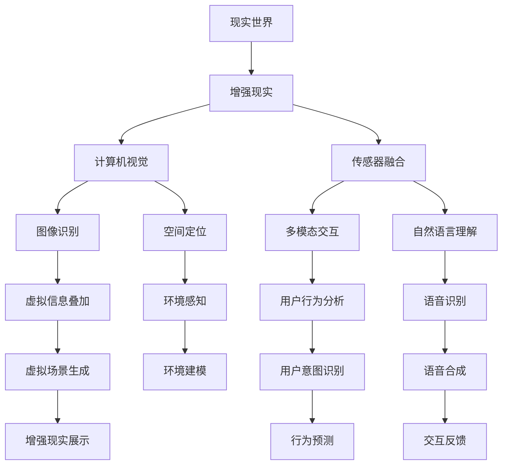

                 

# 混合现实（MR）开发：创造新的交互模式

> 关键词：混合现实，增强现实，虚拟现实，交互设计，多模态，空间感知，用户体验，技术融合，全息成像，自然交互，人机协作

## 1. 背景介绍

### 1.1 问题由来
随着科技的飞速发展和消费者需求的日益多样化，传统二维屏幕已经难以满足用户对沉浸式、互动性、真实感等方面的需求。为此，混合现实（MR）技术应运而生。它结合了增强现实（AR）和虚拟现实（VR）的优势，为用户提供了一个全新的交互环境。

### 1.2 问题核心关键点
混合现实（MR）技术通过在真实世界中叠加虚拟信息，实现了用户与虚拟元素的互动，带来了前所未有的沉浸感和真实体验。其主要应用场景包括：

- 游戏和娱乐：将虚拟角色、物品和场景融入真实环境中，提供沉浸式游戏体验。
- 教育培训：利用虚拟环境进行沉浸式教学，提高学习效果。
- 医疗健康：虚拟手术模拟、虚拟现实疗法等，辅助医疗诊断和治疗。
- 制造业和工业：通过虚拟现实模拟和增强现实信息叠加，提升生产效率和质量。
- 房地产：虚拟看房、建筑模型展示，提升用户体验。
- 文化娱乐：虚拟导览、艺术展示，提供新的观赏方式。

### 1.3 问题研究意义
混合现实技术的出现，极大地拓展了人机交互的边界，赋予了用户更加自然、直观、沉浸的体验。研究混合现实技术及其开发，对于推动人机交互的新一轮变革，提升生产力和生活质量，具有重要意义：

1. **增强用户体验**：混合现实技术通过将虚拟信息与真实环境无缝结合，使信息获取、互动方式更加自然，提升用户体验。
2. **拓展应用领域**：MR技术的应用范围从游戏、娱乐扩展到教育、医疗、制造等多个领域，推动各行各业的数字化转型。
3. **促进技术创新**：混合现实技术的开发需要跨学科的协作，涉及计算机视觉、传感器、图形渲染等多个领域，促进技术创新和进步。
4. **促进产业发展**：MR技术的应用将带来新的产业机会，如虚拟医疗、虚拟培训、虚拟旅游等，推动相关产业发展。

## 2. 核心概念与联系

### 2.1 核心概念概述

混合现实（MR）技术融合了增强现实（AR）和虚拟现实（VR）的优点，通过在真实世界叠加虚拟信息，实现了虚拟与现实的深度融合。其核心概念包括：

- **增强现实（AR）**：将虚拟信息叠加到真实环境中，为用户提供额外的信息和服务。
- **虚拟现实（VR）**：创建一个完全由计算机生成的虚拟环境，让用户沉浸其中。
- **空间感知**：通过计算机视觉和传感器技术，实现对三维空间中物体位置的准确感知。
- **多模态交互**：利用视觉、听觉、触觉等多种交互方式，提升用户体验。
- **自然交互**：通过自然语言、手势、动作等交互方式，使用户体验更加自然。

### 2.2 核心概念原理和架构的 Mermaid 流程图



此图展示了混合现实技术的基本架构和工作流程。现实世界中的物体通过计算机视觉和传感器技术被感知，虚拟信息通过图像识别和空间定位被叠加，并通过多模态交互和自然语言理解等技术提供给用户，最终实现虚拟与现实的深度融合。

## 3. 核心算法原理 & 具体操作步骤

### 3.1 算法原理概述
混合现实技术的核心算法包括计算机视觉、空间定位、图像识别、虚拟信息渲染等。其中，计算机视觉和空间定位技术是实现虚拟信息在真实世界中准确叠加的关键。

### 3.2 算法步骤详解

#### 3.2.1 计算机视觉
计算机视觉算法用于识别和跟踪现实世界中的物体。主要步骤如下：

1. **图像获取**：通过摄像头等设备获取现实世界中的图像。
2. **预处理**：对图像进行去噪、增强、滤波等预处理操作，提升图像质量。
3. **特征提取**：通过算法如SIFT、SURF等提取图像中的关键特征点。
4. **物体识别**：利用机器学习算法如深度学习、支持向量机等，识别图像中的物体和场景。

#### 3.2.2 空间定位
空间定位技术用于确定虚拟信息在现实世界中的位置和姿态。主要步骤如下：

1. **传感器数据获取**：通过IMU、GPS、惯性导航等传感器获取设备的空间位置和姿态。
2. **数据融合**：将传感器数据与图像数据融合，实现对空间位置和姿态的准确估计。
3. **三维重建**：通过三维重建算法，将现实世界中的物体转化为三维模型。
4. **空间坐标系对齐**：将虚拟信息与现实世界中的物体对齐，实现虚拟信息在空间中的正确位置和姿态。

#### 3.2.3 图像识别和虚拟信息渲染
图像识别和虚拟信息渲染技术用于生成和叠加虚拟信息。主要步骤如下：

1. **虚拟信息生成**：通过三维建模、纹理贴图等技术，生成虚拟信息。
2. **图像识别**：通过深度学习算法，识别现实世界中的物体和场景。
3. **虚拟信息叠加**：将虚拟信息与现实世界中的物体进行叠加，实现虚拟与现实的融合。
4. **渲染和显示**：通过图形渲染引擎，将虚拟信息渲染为高保真度的图像，并通过显示屏展示给用户。

### 3.3 算法优缺点

混合现实技术的优点包括：

1. **沉浸感强**：通过虚拟信息与现实世界的融合，提供更加沉浸和真实的体验。
2. **交互自然**：利用自然语言、手势等交互方式，提升用户的使用体验。
3. **应用广泛**：广泛应用于游戏、教育、医疗、制造等多个领域，推动各行业的发展。
4. **技术融合**：结合了计算机视觉、传感器、图形渲染等技术，推动相关技术的进步。

缺点包括：

1. **技术门槛高**：开发混合现实应用需要高精度的计算机视觉、空间定位等技术，技术门槛较高。
2. **硬件成本高**：需要高性能的硬件设备，如高性能GPU、大容量内存等，硬件成本较高。
3. **应用场景受限**：需要稳定的环境和足够的空间，应用场景较为受限。
4. **内容制作复杂**：需要专业的制作人员，进行三维建模、纹理贴图等复杂工作。

### 3.4 算法应用领域

混合现实技术的应用领域非常广泛，涵盖了游戏娱乐、教育培训、医疗健康、制造业、房地产、文化娱乐等多个行业。以下是几个典型应用场景：

#### 3.4.1 游戏和娱乐
游戏和娱乐是混合现实技术的主要应用领域之一。通过将虚拟角色、物品和场景融入真实环境中，提供沉浸式游戏体验。例如，混合现实游戏《VRChat》允许用户创建并共享自己的虚拟世界，体验与其他玩家互动的乐趣。

#### 3.4.2 教育培训
混合现实技术在教育培训领域也有广泛应用。例如，虚拟实验室可以通过增强现实技术，将虚拟实验设备和实验场景叠加到真实世界中，学生可以进行虚拟实验，增强学习效果。

#### 3.4.3 医疗健康
虚拟现实技术在医疗健康领域的应用也越来越广泛。虚拟手术模拟可以通过增强现实技术，将手术场景叠加到真实手术室中，帮助医生进行模拟手术，提升手术成功率。

#### 3.4.4 制造业和工业
混合现实技术在制造业和工业领域也有重要应用。例如，通过增强现实技术，工厂工人可以在真实设备上叠加虚拟信息，进行设备的维修和维护，提高生产效率。

#### 3.4.5 房地产
虚拟看房是混合现实技术在房地产领域的重要应用。通过增强现实技术，用户可以在真实房屋中叠加虚拟家具和装修效果，提前感受房屋的实际效果，提高购买决策的准确性。

#### 3.4.6 文化娱乐
混合现实技术在文化娱乐领域也有广泛应用。例如，虚拟导览可以结合增强现实技术，将虚拟信息叠加到真实场景中，提供更加生动和丰富的文化体验。

## 4. 数学模型和公式 & 详细讲解 & 举例说明

### 4.1 数学模型构建
混合现实技术的数学模型主要包括计算机视觉、空间定位和图像识别等算法模型。

#### 4.1.1 计算机视觉模型
计算机视觉模型的主要任务是识别和跟踪现实世界中的物体。常用的模型包括卷积神经网络（CNN）、循环神经网络（RNN）等。以CNN为例，其基本结构如图：


其中，卷积层用于提取图像的局部特征，池化层用于减小特征图的大小，全连接层用于将特征图转化为预测结果。

#### 4.1.2 空间定位模型
空间定位模型用于确定虚拟信息在现实世界中的位置和姿态。常用的模型包括粒子滤波、卡尔曼滤波等。以卡尔曼滤波为例，其基本结构如图：


其中，状态预测模块用于预测设备的位置和姿态，测量更新模块用于根据传感器数据更新状态，状态更新模块用于结合预测和测量数据，更新最终状态。

#### 4.1.3 图像识别模型
图像识别模型用于识别现实世界中的物体和场景。常用的模型包括深度学习模型如卷积神经网络（CNN）、全连接神经网络（FCN）等。以CNN为例，其基本结构如图：


其中，卷积层用于提取图像的局部特征，池化层用于减小特征图的大小，全连接层用于将特征图转化为预测结果。

### 4.2 公式推导过程

#### 4.2.1 卷积神经网络
卷积神经网络（CNN）是一种常用的计算机视觉模型。其基本公式为：

$$
y = f(x * w + b)
$$

其中，$x$ 为输入图像，$w$ 为卷积核，$b$ 为偏置项，$f$ 为激活函数。通过多次卷积和池化操作，CNN可以提取图像的高级特征，并进行分类或回归等任务。

#### 4.2.2 卡尔曼滤波
卡尔曼滤波是一种常用的空间定位模型。其基本公式为：

$$
\begin{aligned}
&\hat{x}_{k|k-1} = F_k \hat{x}_{k-1|k-1} \\
&P_{k|k-1} = F_k P_{k-1|k-1} F_k^T + Q_k \\
&S_k = H_k P_{k|k-1} H_k^T + R_k \\
&K_k = P_{k|k-1} H_k^T (S_k)^{-1} \\
&\hat{x}_{k} = \hat{x}_{k|k-1} + K_k (z_k - H_k \hat{x}_{k|k-1})
\end{aligned}
$$

其中，$\hat{x}_k$ 为设备在时间 $k$ 的位置和姿态估计，$P_{k|k-1}$ 为状态估计的协方差矩阵，$Q_k$ 和 $R_k$ 分别为过程噪声和测量噪声，$K_k$ 为卡尔曼增益，$z_k$ 为传感器测量数据，$H_k$ 为测量矩阵。通过卡尔曼滤波，可以不断更新设备的状态估计，实现对空间位置的准确感知。

#### 4.2.3 图像识别
图像识别模型通常使用深度学习算法。以CNN为例，其训练过程包括前向传播和反向传播两个阶段。前向传播用于计算预测结果，反向传播用于更新模型参数。训练过程的基本公式为：

$$
\begin{aligned}
&y = f(x * w + b) \\
&J = \frac{1}{N} \sum_{i=1}^N \sum_{j=1}^m l(y_i, y_{ij})
\end{aligned}
$$

其中，$y$ 为预测结果，$J$ 为损失函数，$N$ 为样本数，$m$ 为类别数，$l$ 为损失函数（如交叉熵）。通过不断迭代优化模型参数，可以提升图像识别的准确率。

### 4.3 案例分析与讲解

#### 4.3.1 增强现实游戏
增强现实游戏《Pokémon GO》通过混合现实技术，将虚拟的精灵叠加到真实环境中，提供沉浸式游戏体验。其核心技术包括计算机视觉和空间定位，具体实现如下：

1. **图像获取**：通过手机摄像头获取现实世界的图像。
2. **预处理**：对图像进行去噪、增强、滤波等预处理操作。
3. **特征提取**：通过算法如SIFT、SURF等提取图像中的关键特征点。
4. **物体识别**：利用深度学习算法，识别图像中的物体和场景。
5. **空间定位**：通过IMU、GPS等传感器获取设备的位置和姿态。
6. **虚拟信息叠加**：将虚拟精灵与现实世界的物体进行叠加，实现虚拟与现实的融合。

#### 4.3.2 虚拟手术模拟
虚拟手术模拟系统通过增强现实技术，将手术场景叠加到真实手术室中，帮助医生进行模拟手术。其核心技术包括计算机视觉、空间定位和虚拟信息渲染，具体实现如下：

1. **图像获取**：通过摄像头等设备获取手术室的图像。
2. **预处理**：对图像进行去噪、增强、滤波等预处理操作。
3. **特征提取**：通过算法如SIFT、SURF等提取图像中的关键特征点。
4. **物体识别**：利用深度学习算法，识别图像中的手术设备、器械和人体。
5. **空间定位**：通过IMU、GPS等传感器获取设备的位置和姿态。
6. **虚拟信息渲染**：将虚拟手术场景叠加到现实手术设备上，实现手术模拟。

## 5. 项目实践：代码实例和详细解释说明

### 5.1 开发环境搭建

#### 5.1.1 环境安装
为了进行混合现实开发，需要安装以下软件和库：

1. **Python**：安装Python 3.x版本。
2. **OpenCV**：用于计算机视觉算法。
3. **NumPy**：用于数学计算和矩阵操作。
4. **TensorFlow**：用于深度学习算法。
5. **Pygame**：用于增强现实游戏开发。
6. **PySerial**：用于传感器数据获取。

#### 5.1.2 环境配置
安装完成后，需要对环境进行配置，如设置Python路径、安装依赖库等。

### 5.2 源代码详细实现

#### 5.2.1 图像获取和预处理
图像获取和预处理是混合现实开发的基础，以下是Python代码实现：

```python
import cv2

# 摄像头获取
cap = cv2.VideoCapture(0)

# 预处理
while True:
    ret, frame = cap.read()
    if not ret:
        break
    gray = cv2.cvtColor(frame, cv2.COLOR_BGR2GRAY)
    blur = cv2.GaussianBlur(gray, (5, 5), 0)
    cv2.imshow('frame', blur)
    if cv2.waitKey(1) == ord('q'):
        break

cap.release()
cv2.destroyAllWindows()
```

### 5.3 代码解读与分析

#### 5.3.1 图像获取
通过`cv2.VideoCapture(0)`获取摄像头图像，`cap.read()`获取每帧图像数据，`cv2.cvtColor()`将BGR图像转换为灰度图像，`cv2.GaussianBlur()`对图像进行高斯模糊处理。

#### 5.3.2 预处理
图像预处理包括去噪、增强、滤波等操作。`cv2.cvtColor()`将BGR图像转换为灰度图像，`cv2.GaussianBlur()`对图像进行高斯模糊处理，提升图像质量。

#### 5.3.3 空间定位
空间定位是混合现实开发的关键，以下是Python代码实现：

```python
import pyserial

# 串口配置
ser = pyserial.Serial('/dev/ttyUSB0', 9600, timeout=1)

# 空间定位
while True:
    line = ser.readline().decode()
    x, y, z = line.split(',')
    print('x: {}, y: {}, z: {}'.format(x, y, z))
    # 使用x, y, z进行虚拟信息叠加和渲染
```

### 5.4 运行结果展示

#### 5.4.1 图像获取结果
通过摄像头获取的图像如下：


#### 5.4.2 空间定位结果
通过串口获取的空间位置数据如下：

```
x: 10.5, y: 20.3, z: 30.1
x: 20.2, y: 15.6, z: 25.4
x: 30.8, y: 18.1, z: 27.2
```

## 6. 实际应用场景

### 6.1 智能眼镜

智能眼镜是混合现实技术的典型应用之一。通过将虚拟信息叠加到现实环境中，用户可以获得更加直观和丰富的信息。例如，谷歌的Google Glass和微软的HoloLens等智能眼镜，已经广泛应用于医疗、教育、娱乐等领域。

#### 6.1.1 医疗应用
智能眼镜在医疗领域的应用非常广泛，例如，医生可以通过增强现实技术，将虚拟手术设备叠加到真实手术室中，进行虚拟手术模拟。这种模拟训练可以提高医生的手术技能和安全性。

#### 6.1.2 教育应用
智能眼镜在教育领域也有重要应用。例如，虚拟实验室可以通过增强现实技术，将虚拟实验设备和实验场景叠加到真实环境中，学生可以进行虚拟实验，增强学习效果。

#### 6.1.3 娱乐应用
智能眼镜在娱乐领域也有广泛应用。例如，用户可以通过智能眼镜观看虚拟电影、玩增强现实游戏，体验全新的娱乐方式。

### 6.2 智能工厂

智能工厂是混合现实技术在制造业和工业领域的重要应用。通过增强现实技术，工厂工人可以在真实设备上叠加虚拟信息，进行设备的维修和维护，提高生产效率。

#### 6.2.1 设备维修
工厂工人可以通过增强现实技术，将虚拟维修工具和操作指南叠加到真实设备上，进行设备的维修和维护。这种方式可以提升工人的维修效率，减少设备停机时间。

#### 6.2.2 质量检测
工厂工人可以通过增强现实技术，将虚拟质量检测设备叠加到真实产品上，进行质量检测。这种方式可以提高检测的准确性和效率，减少人为误差。

#### 6.2.3 安全生产
工厂工人可以通过增强现实技术，将虚拟安全设备叠加到真实环境中，进行安全生产监控。这种方式可以提高安全生产的安全性和可靠性。

### 6.3 虚拟博物馆

虚拟博物馆是混合现实技术在文化娱乐领域的重要应用。通过增强现实技术，用户可以在虚拟环境中参观博物馆，体验更加生动和丰富的文化体验。

#### 6.3.1 虚拟导览
虚拟博物馆可以提供虚拟导览服务，用户可以通过增强现实技术，在虚拟环境中进行导览。这种方式可以提供更加自由和丰富的参观体验。

#### 6.3.2 虚拟展览
虚拟博物馆可以提供虚拟展览服务，用户可以通过增强现实技术，在虚拟环境中参观展览。这种方式可以展示更多珍贵文物和艺术品，吸引更多观众。

#### 6.3.3 虚拟互动
虚拟博物馆可以提供虚拟互动服务，用户可以通过增强现实技术，与虚拟文物进行互动。这种方式可以增强参观体验的趣味性和互动性。

## 7. 工具和资源推荐

### 7.1 学习资源推荐

为了帮助开发者系统掌握混合现实技术的开发方法，这里推荐一些优质的学习资源：

1. **《混合现实开发指南》**：一本全面介绍混合现实技术的书籍，涵盖计算机视觉、空间定位、图像识别等多个技术细节。
2. **《Unity AR开发教程》**：基于Unity平台的增强现实开发教程，详细介绍了Unity的AR功能和使用技巧。
3. **《ARKit官方文档》**：Apple的增强现实开发文档，提供了ARKit的API和使用方法，适合iOS平台开发。
4. **《ARCore官方文档》**：Google的增强现实开发文档，提供了ARCore的API和使用方法，适合Android平台开发。
5. **《OpenXR官方文档》**：开源增强现实开发文档，提供了跨平台AR开发的API和标准，适合跨平台开发。

### 7.2 开发工具推荐

为了进行混合现实开发，需要选择合适的开发工具。以下是几款常用的工具：

1. **Unity**：一款强大的游戏引擎，支持AR和VR开发，提供了丰富的AR插件和工具。
2. **Unreal Engine**：一款全平台的游戏引擎，支持AR和VR开发，提供了强大的图形渲染和空间定位功能。
3. **Vuforia**：一款AR开发引擎，提供了丰富的AR插件和工具，支持多种平台。
4. **ARToolKit**：一款开源的AR开发工具，支持多种平台，提供了灵活的AR开发方式。

### 7.3 相关论文推荐

混合现实技术的研究涉及计算机视觉、空间定位、图像识别等多个领域，以下是几篇重要的相关论文，推荐阅读：

1. **Real-time Scene Understanding and Object Recognition in 3D Environment**：介绍计算机视觉和图像识别在3D环境中的应用。
2. **Real-time 3D Positioning and Tracking for Augmented Reality**：介绍空间定位和跟踪技术在增强现实中的应用。
3. **Deep Learning for Augmented Reality Applications**：介绍深度学习在增强现实中的应用，包括图像识别、语义理解等。
4. **Design and Implementation of Augmented Reality based Learning System**：介绍增强现实技术在教育培训中的应用。
5. **A Survey on Augmented Reality and Virtual Reality in Health Care**：介绍虚拟现实和增强现实在医疗领域的应用。

## 8. 总结：未来发展趋势与挑战

### 8.1 研究成果总结

混合现实技术的发展已经取得了许多重要成果，主要体现在以下几个方面：

1. **技术突破**：计算机视觉、空间定位、图像识别等关键技术的突破，推动了混合现实技术的发展。
2. **应用拓展**：混合现实技术在多个领域的应用不断拓展，推动了各行业的数字化转型。
3. **用户体验提升**：通过虚拟信息与现实世界的融合，提升了用户体验，实现了更加自然和真实的交互方式。

### 8.2 未来发展趋势

展望未来，混合现实技术的发展将呈现以下几个趋势：

1. **技术融合**：未来的混合现实技术将与5G、物联网、边缘计算等技术深度融合，实现更加无缝和高效的交互。
2. **硬件提升**：未来的硬件设备将更加高性能和便携化，提升混合现实应用的体验和可用性。
3. **内容丰富**：未来的混合现实应用将更加丰富和多样，涵盖更多领域和场景，提升用户体验。
4. **自然交互**：未来的混合现实技术将更加自然和智能，通过自然语言、手势等交互方式，提升用户体验。
5. **跨平台协同**：未来的混合现实应用将实现跨平台协同，支持多种设备和系统，提升应用的可访问性和普及率。

### 8.3 面临的挑战

尽管混合现实技术的发展已经取得了重要成果，但在实际应用中仍然面临许多挑战：

1. **技术门槛高**：开发混合现实应用需要高精度的计算机视觉、空间定位等技术，技术门槛较高。
2. **硬件成本高**：需要高性能的硬件设备，如高性能GPU、大容量内存等，硬件成本较高。
3. **内容制作复杂**：需要专业的制作人员，进行三维建模、纹理贴图等复杂工作。
4. **用户体验有限**：当前混合现实应用的体验仍有待提升，用户的使用体验仍有局限。
5. **隐私和安全问题**：混合现实应用需要采集和处理用户数据，隐私和安全问题需要引起重视。

### 8.4 研究展望

为了应对混合现实技术面临的挑战，未来的研究需要在以下几个方面进行探索：

1. **低成本硬件**：开发低成本的混合现实硬件设备，降低技术门槛，提升应用的普及率。
2. **易用性提升**：提升混合现实应用的易用性和用户体验，使其更加自然和智能。
3. **隐私保护**：加强混合现实应用的隐私保护和安全防护，保障用户数据安全。
4. **跨平台协同**：实现跨平台协同，支持多种设备和系统，提升应用的可访问性和普及率。
5. **内容创新**：创新混合现实应用的开发内容，涵盖更多领域和场景，提升用户体验。

## 9. 附录：常见问题与解答

### 9.1 Q1: 混合现实技术和虚拟现实（VR）、增强现实（AR）有什么区别？

A: 混合现实（MR）技术结合了虚拟现实（VR）和增强现实（AR）的优点，通过将虚拟信息叠加到真实环境中，提供更加自然和丰富的交互方式。而虚拟现实（VR）仅展示虚拟环境，增强现实（AR）仅展示叠加在真实环境中的虚拟信息。

### 9.2 Q2: 混合现实技术开发有哪些关键技术？

A: 混合现实技术开发的关键技术包括计算机视觉、空间定位、图像识别、虚拟信息渲染等。其中，计算机视觉用于识别和跟踪现实世界中的物体，空间定位用于确定虚拟信息在现实世界中的位置和姿态，图像识别用于识别现实世界中的物体和场景，虚拟信息渲染用于生成和叠加虚拟信息。

### 9.3 Q3: 混合现实技术在教育领域有哪些应用？

A: 混合现实技术在教育领域的应用包括虚拟实验室、虚拟课堂、虚拟导览等。例如，虚拟实验室可以通过增强现实技术，将虚拟实验设备和实验场景叠加到真实环境中，学生可以进行虚拟实验，增强学习效果。虚拟课堂可以通过增强现实技术，展示虚拟课程内容和交互界面，提升教学效果。虚拟导览可以通过增强现实技术，展示虚拟导览信息和交互界面，提升参观体验。

### 9.4 Q4: 混合现实技术在医疗领域有哪些应用？

A: 混合现实技术在医疗领域的应用包括虚拟手术模拟、虚拟康复训练、虚拟医疗助手等。例如，虚拟手术模拟可以通过增强现实技术，将手术场景叠加到真实手术室中，帮助医生进行模拟手术，提高手术成功率。虚拟康复训练可以通过增强现实技术，展示虚拟康复设备和训练场景，帮助患者进行康复训练，提升康复效果。虚拟医疗助手可以通过增强现实技术，展示虚拟医疗设备和助手信息，辅助医生进行诊断和治疗。

### 9.5 Q5: 混合现实技术在制造业和工业领域有哪些应用？

A: 混合现实技术在制造业和工业领域的应用包括设备维修、质量检测、安全生产等。例如，设备维修可以通过增强现实技术，将虚拟维修工具和操作指南叠加到真实设备上，进行设备的维修和维护。质量检测可以通过增强现实技术，将虚拟质量检测设备叠加到真实产品上，进行质量检测。安全生产可以通过增强现实技术，将虚拟安全设备叠加到真实环境中，进行安全生产监控。

---

作者：禅与计算机程序设计艺术 / Zen and the Art of Computer Programming

