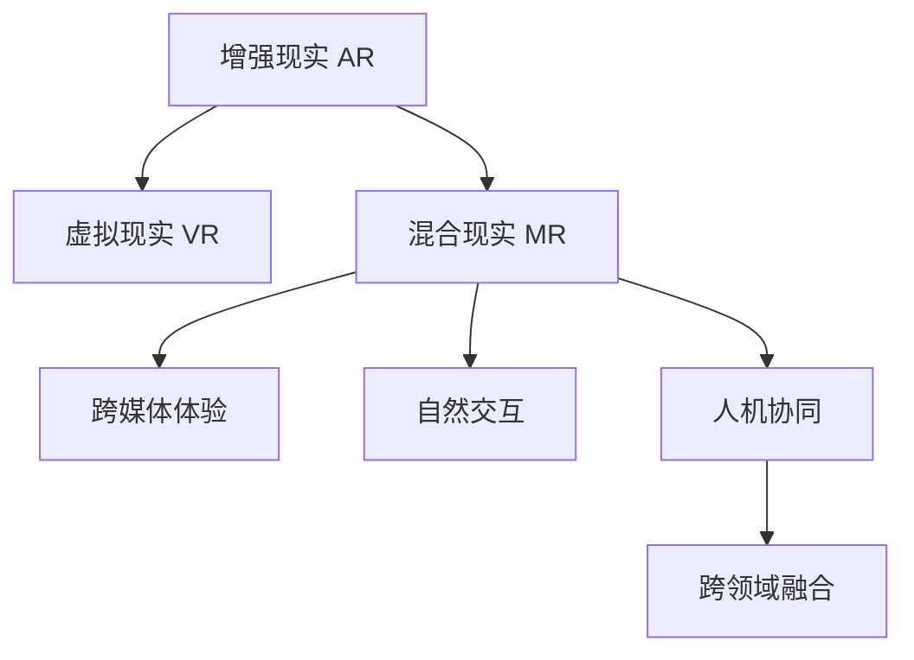

                 

# 混合现实（MR）技术：跨界创新的新领域

> 关键词：混合现实,MR技术,跨界创新,增强现实,虚拟现实,AR/VR,跨媒体体验,自然交互,人机协同,跨领域融合

## 1. 背景介绍

### 1.1 问题由来

混合现实（Mixed Reality, MR）技术是一种将现实世界与虚拟世界紧密融合的新型交互方式。它结合了增强现实（Augmented Reality, AR）和虚拟现实（Virtual Reality, VR）的优点，为用户提供了一种前所未有的沉浸式体验。近年来，随着AR/VR技术的成熟以及相关硬件设备的普及，MR技术在工业设计、教育培训、娱乐游戏等多个领域得到了广泛应用，正在开启一场跨界创新的新革命。

### 1.2 问题核心关键点

混合现实技术的核心在于融合现实与虚拟，打破物理世界的限制，提供多感官协同的交互体验。这种跨界创新的关键点包括：

- 数据融合：将现实世界数据和虚拟数据无缝集成，实现实时交互。
- 跨媒体体验：支持多种媒介形式的融合，如视觉、听觉、触觉等。
- 自然交互：通过手势识别、语音交互等方式，实现直观的自然交互。
- 人机协同：通过实时传感和智能推理，提升人机交互效率和精准度。
- 跨领域融合：在工业设计、医疗健康、教育培训等多个领域中，通过MR技术实现技术融合和跨界创新。

这些关键点共同构成了混合现实技术的核心框架，使其能够在各个领域中发挥巨大的创新潜力。

## 2. 核心概念与联系

### 2.1 核心概念概述

为更好地理解混合现实技术，本节将介绍几个密切相关的核心概念：

- 增强现实（AR）：通过在真实世界的视图中叠加虚拟信息，增强用户对环境的理解。
- 虚拟现实（VR）：创建一个完全虚拟的环境，使用户可以沉浸在其中。
- 混合现实（MR）：结合AR和VR的优点，提供同时包含现实世界和虚拟元素的融合体验。
- 跨媒体体验：支持视觉、听觉、触觉等多种媒介形式的融合，提供全方位的感官体验。
- 自然交互：通过手势识别、语音交互等方式，实现直观的自然交互。
- 人机协同：通过实时传感和智能推理，提升人机交互效率和精准度。
- 跨领域融合：在工业设计、医疗健康、教育培训等多个领域中，通过MR技术实现技术融合和跨界创新。

这些核心概念之间的逻辑关系可以通过以下Mermaid流程图来展示：



这个流程图展示了点出混合现实技术的核心概念及其之间的关系：

1. AR和VR是MR的两个重要组成部分，MR将它们融合在一起。
2. 跨媒体体验是MR技术的一大优势，支持多感官融合。
3. 自然交互提升了用户体验，通过手势、语音等方式实现直观交互。
4. 人机协同利用智能技术，提高了交互效率和精准度。
5. 跨领域融合展示了MR技术在不同领域的广泛应用，如工业设计、医疗健康等。

## 3. 核心算法原理 & 具体操作步骤
### 3.1 算法原理概述

混合现实技术的核心算法原理主要包括：

- 三维空间重建：通过摄像头、传感器等设备，实时获取环境的三维空间信息。
- 深度估计：使用深度学习技术，根据传感器数据估计出物体的深度信息。
- 物体跟踪与识别：利用计算机视觉技术，实现对物体在三维空间中的跟踪与识别。
- 虚实融合：将虚拟对象叠加到真实环境中，实现虚实融合的效果。
- 自然交互：通过手势识别、语音交互等方式，实现直观的自然交互。

混合现实技术的实现需要实时处理大量传感器数据和渲染复杂虚拟场景，对计算能力有较高的要求。

### 3.2 算法步骤详解

混合现实技术的实现步骤主要包括：

**Step 1: 环境感知**

- 使用摄像头、传感器等设备获取环境的三维空间信息。
- 通过深度学习技术，估计物体的深度信息。
- 对三维空间信息进行跟踪和识别，实时更新物体的位置和姿态。

**Step 2: 虚拟对象渲染**

- 根据用户输入和环境信息，生成虚拟对象。
- 将虚拟对象叠加到真实环境中，实现虚实融合。

**Step 3: 自然交互**

- 通过手势识别、语音交互等方式，实现自然交互。
- 根据交互信息，动态调整虚拟对象的位置、姿态和行为。

**Step 4: 人机协同**

- 利用实时传感和智能推理，提升人机交互效率和精准度。
- 根据用户行为和环境变化，动态优化虚拟对象和环境渲染效果。

### 3.3 算法优缺点

混合现实技术具有以下优点：

1. 沉浸式体验：融合了AR和VR的优点，提供沉浸式的多感官体验。
2. 交互自然：通过手势识别、语音交互等方式，实现直观的自然交互。
3. 跨领域应用：在多个领域中实现技术融合和跨界创新，提升应用价值。
4. 实时性高：利用高性能计算设备，实现实时渲染和交互，用户体验流畅。

同时，混合现实技术也存在以下缺点：

1. 硬件成本高：目前主流AR/VR设备价格较高，限制了大规模应用。
2. 技术复杂：需要处理大量的传感器数据，对计算能力和算法要求高。
3. 内容制作难：虚拟对象的制作和融合需要高度专业性，开发成本高。
4. 用户适应难：部分用户对AR/VR设备适应性差，存在使用障碍。

尽管存在这些局限性，但混合现实技术仍具有巨大的创新潜力，正在成为科技发展的重要方向。

### 3.4 算法应用领域

混合现实技术在多个领域中得到了广泛应用，以下是一些典型应用场景：

- 工业设计：利用MR技术实现虚拟原型展示、装配指导等功能，提升设计效率和质量。
- 医疗健康：通过AR/VR技术进行手术模拟、虚拟培训等，提升医疗技能和手术精准度。
- 教育培训：结合AR/VR技术，提供沉浸式学习体验，提升教学效果和学习兴趣。
- 娱乐游戏：利用VR技术提供沉浸式游戏体验，结合AR技术增强互动性和趣味性。
- 城市规划：通过MR技术展示城市模型和规划方案，提升规划效果和公众参与度。

## 4. 数学模型和公式 & 详细讲解 & 举例说明（备注：数学公式请使用latex格式，latex嵌入文中独立段落使用 $$，段落内使用 $)
### 4.1 数学模型构建

混合现实技术的数学模型主要包括：

- 三维空间重建模型：使用立体视觉、深度学习等技术，实时获取环境的三维空间信息。
- 物体跟踪与识别模型：利用计算机视觉技术，实现对物体在三维空间中的跟踪与识别。
- 虚实融合模型：将虚拟对象叠加到真实环境中，实现虚实融合的效果。

### 4.2 公式推导过程

以下以三维空间重建和物体跟踪为例，推导关键公式。

三维空间重建：
假设使用立体视觉技术，获取两个摄像头在不同位置对同一物体拍摄的两幅图像 $I_1$ 和 $I_2$。利用三维立体视觉模型，可以通过图像匹配和几何变换，估计物体的深度信息 $d$。公式为：

$$
d = \frac{f \cdot z}{x - x_0}
$$

其中 $f$ 为相机焦距，$z$ 为物体到相机的距离，$x$ 为物体在图像中的像素坐标，$x_0$ 为基线长度的一半。

物体跟踪与识别：
使用计算机视觉技术，如SURF、ORB等特征点检测算法，在每帧图像中检测出物体的关键点，并利用匹配算法计算其位置变化。假设当前帧中检测到物体的关键点坐标为 $p_1$，前一帧中检测到的关键点坐标为 $p_2$，则物体在三维空间中的位置变化 $\Delta x$ 可以表示为：

$$
\Delta x = \frac{z_1 - z_2}{x_1 - x_2} \cdot \Delta p
$$

其中 $z_1$ 和 $z_2$ 为物体在当前帧和前一帧中到相机的距离，$x_1$ 和 $x_2$ 为物体在当前帧和前一帧中的像素坐标，$\Delta p$ 为物体在二维图像中的位移。

### 4.3 案例分析与讲解

以工业设计中的虚拟原型展示为例，展示MR技术的具体应用：

**Step 1: 环境感知**

使用多个摄像头和深度传感器，获取工作台的3D环境信息。利用深度学习技术，估计物体在三维空间中的位置和姿态。

**Step 2: 虚拟对象渲染**

根据设计图纸和用户需求，生成虚拟原型。将虚拟原型叠加到真实环境中，进行多角度展示和细节展示。

**Step 3: 自然交互**

通过手势识别和语音交互技术，用户可以实时调整虚拟原型的角度和姿态，进行虚拟装配和操作。

**Step 4: 人机协同**

利用实时传感和智能推理，提升交互效率和精准度。通过AR/VR技术，实时展示虚拟装配效果，增强用户体验。

## 5. 项目实践：代码实例和详细解释说明
### 5.1 开发环境搭建

在进行混合现实项目开发前，我们需要准备好开发环境。以下是使用Unity和OpenCV进行开发的环境配置流程：

1. 安装Unity：从官网下载并安装Unity 3D游戏引擎，支持AR/VR开发。

2. 安装OpenCV：从官网下载并安装OpenCV计算机视觉库，用于三维空间重建和物体跟踪。

3. 安装VR设备：选择适合的AR/VR设备，如HTC Vive、Oculus Rift等，并连接至PC或Mac。

4. 安装VR插件：在Unity中安装VR插件，支持VR设备集成和渲染。

5. 安装AR插件：在Unity中安装AR插件，支持AR相机和物体跟踪。

完成上述步骤后，即可在Unity环境中开始混合现实项目开发。

### 5.2 源代码详细实现

以下是使用Unity和C#编写混合现实项目的基本代码实现：

```csharp
using UnityEngine;
using System.Collections;
using UnityEngine.XR.ARFoundation;
using UnityEngine.XR.ARSubsystems;

public class MRManager : MonoBehaviour
{
    public ARRaycastManager arRaycastManager;

    void Update()
    {
        // 获取AR相机的视角
        ARRaycastSource raycastSource = arRaycastManager.GetSource();

        // 生成虚拟物体并叠加到AR场景中
        CreateVirtualObject(raycastSource);

        // 检测手势和语音交互
        DetectHandAndVoiceInteraction();
    }

    void CreateVirtualObject(ARRaycastSource raycastSource)
    {
        // 获取用户手势位置
        Ray ray = raycastSource.GetRaycast(raycastSource.poseOrigin, raycastSource.poseExtent);

        // 创建虚拟物体并叠加到AR场景中
        GameObject virtualObject = CreateVirtualObjectPrefab();
        raycastSource.TryHitTest(ray, virtualObject, handleVirtualObject);
    }

    void DetectHandAndVoiceInteraction()
    {
        // 检测手势交互
        XRInteractionSubsystem interactionSystem = ARSubsystemsManager.GetXRInteractionSubsystem();
        if (interactionSystem.TryGetHandPose(in handPose))
        {
            // 处理手势交互
            HandleHandInteraction(handPose);
        }

        // 检测语音交互
        XRInteractionSubsystem interactionSystem = ARSubsystemsManager.GetXRInteractionSubsystem();
        if (interactionSystem.TryGetHandPose(in handPose))
        {
            // 处理语音交互
            HandleVoiceInteraction(handPose);
        }
    }

    void HandleHandInteraction(HandPose handPose)
    {
        // 处理手势交互逻辑
    }

    void HandleVoiceInteraction(HandPose handPose)
    {
        // 处理语音交互逻辑
    }
}
```

### 5.3 代码解读与分析

让我们再详细解读一下关键代码的实现细节：

**MRManager类**：
- `Update`方法：用于实时检测用户手势和语音交互，并生成和渲染虚拟对象。
- `CreateVirtualObject`方法：根据用户手势位置，生成虚拟对象并叠加到AR场景中。
- `DetectHandAndVoiceInteraction`方法：检测用户的手势和语音交互信息，并调用相应处理方法。
- `HandleHandInteraction`方法：处理手势交互逻辑，如移动虚拟对象、旋转虚拟对象等。
- `HandleVoiceInteraction`方法：处理语音交互逻辑，如触发特定动作、改变虚拟对象属性等。

**ARRaycastManager类**：
- `GetSource`方法：获取AR相机的视角，用于计算用户手势和虚拟对象的位置。

**XRInteractionSubsystem类**：
- `TryGetHandPose`方法：检测用户的手势和语音交互信息，返回相应的手势信息。

**虚拟对象生成和渲染**：
- `CreateVirtualObjectPrefab`方法：生成虚拟对象的预制体。
- `raycastSource.TryHitTest`方法：根据用户手势位置，生成虚拟物体并叠加到AR场景中。

以上代码展示了混合现实项目的基本开发流程和核心功能模块。开发者可以根据具体需求，在代码中进行进一步优化和扩展。

## 6. 实际应用场景
### 6.1 工业设计

在工业设计领域，混合现实技术可以提供实时原型展示、装配指导等功能，大幅提升设计效率和质量。

**具体实现**：
- 利用AR技术展示虚拟原型，让用户直观地看到设计效果。
- 结合VR技术进行虚拟装配和操作，发现并修正设计问题。
- 利用手势和语音交互，实时调整设计参数，优化设计方案。

**应用效果**：
- 提高设计效率：通过虚拟原型展示和装配指导，减少实物样品的制作和测试成本。
- 提升设计质量：通过虚拟装配和操作，提前发现并修正设计缺陷，减少后期修改和返工。
- 增强用户体验：通过手势和语音交互，提高设计的直观性和可操作性，提升用户满意度。

### 6.2 医疗健康

在医疗健康领域，混合现实技术可以用于手术模拟、虚拟培训等，提升医疗技能和手术精准度。

**具体实现**：
- 利用AR技术展示手术场景和医疗设备，提供沉浸式学习体验。
- 结合VR技术进行手术模拟和虚拟操作，提升手术技能和精准度。
- 利用手势和语音交互，实时调整手术操作，增强手术安全性和可靠性。

**应用效果**：
- 提高手术技能：通过虚拟手术操作，医生可以反复练习，提升手术技能和精准度。
- 减少手术风险：通过手术模拟，医生可以提前发现并纠正手术中的潜在问题，减少手术风险。
- 提升患者体验：通过AR/VR技术，患者可以直观地了解手术过程，减少对手术的恐惧和焦虑。

### 6.3 教育培训

在教育培训领域，混合现实技术可以提供沉浸式学习体验，提升教学效果和学习兴趣。

**具体实现**：
- 利用AR技术展示学习内容，提供多感官学习体验。
- 结合VR技术进行虚拟场景和互动实验，提升学习效果和兴趣。
- 利用手势和语音交互，增强课堂互动和参与度。

**应用效果**：
- 提高学习效果：通过沉浸式学习体验，学生可以更加直观地理解复杂概念和知识。
- 提升学习兴趣：通过虚拟场景和互动实验，增加学习的趣味性和互动性，提升学习兴趣。
- 增强课堂互动：通过手势和语音交互，增强课堂互动和参与度，提升教学效果。

### 6.4 未来应用展望

随着混合现实技术的不断进步，未来在更多领域中都将展现出巨大的应用潜力。

- **智能家居**：通过MR技术，智能家居设备可以实时感知用户需求，提供个性化服务。
- **社交娱乐**：结合AR/VR技术，提供沉浸式游戏体验，增强社交互动。
- **文化旅游**：利用AR/VR技术，展示历史文化场景和互动体验，提升旅游体验。
- **城市规划**：通过MR技术，展示城市模型和规划方案，提升规划效果和公众参与度。

未来，混合现实技术将继续推动各行各业的技术创新和业务变革，为人类社会带来更丰富、更便捷的数字化体验。

## 7. 工具和资源推荐
### 7.1 学习资源推荐

为了帮助开发者系统掌握混合现实技术的理论基础和实践技巧，这里推荐一些优质的学习资源：

1. **Unity官方文档**：Unity 3D引擎的官方文档，提供了详细的AR/VR开发教程和API说明。

2. **OpenCV官方文档**：OpenCV计算机视觉库的官方文档，提供了三维空间重建和物体跟踪的详细实现方法。

3. **ARKit和ARCore教程**：苹果和谷歌提供的AR开发平台，提供了丰富的AR开发教程和样例代码。

4. **ARCore for Unity教程**：Unity官方提供的ARCore教程，介绍了如何在Unity中使用ARCore进行开发。

5. **ARToolKit教程**：ARToolKit开发的教程，介绍了AR开发的基础知识和实现方法。

通过对这些资源的学习实践，相信你一定能够快速掌握混合现实技术的精髓，并用于解决实际的AR/VR问题。

### 7.2 开发工具推荐

高效的开发离不开优秀的工具支持。以下是几款用于混合现实开发的常用工具：

1. **Unity**：Unity 3D游戏引擎，支持AR/VR开发，提供了丰富的AR/VR插件和开发工具。

2. **OpenCV**：OpenCV计算机视觉库，提供了强大的三维空间重建和物体跟踪功能。

3. **ARCore和ARKit**：苹果和谷歌提供的AR开发平台，提供了丰富的AR开发工具和样例代码。

4. **ARToolKit**：ARToolKit开发的教程，提供了AR开发的基础知识和实现方法。

5. **WebXR**：WebXR开发平台，支持跨平台AR/VR开发，提供了丰富的AR/VR开发工具和样例代码。

合理利用这些工具，可以显著提升混合现实开发的效率，加快创新迭代的步伐。

### 7.3 相关论文推荐

混合现实技术的发展源于学界的持续研究。以下是几篇奠基性的相关论文，推荐阅读：

1. **ARToolKit的实现方法**：Integrated AR Toolkit for Adaptive Hands-Free Wearable Displays，详细介绍了ARToolKit的实现方法和应用效果。

2. **虚拟现实系统的设计**：A Survey on the Key Technologies and Applications of Virtual Reality，综述了虚拟现实系统的关键技术和应用领域。

3. **混合现实系统的实现**：Mixed Reality: From Optical See-through to Head-coupled Virtuality，探讨了混合现实系统的实现方法和应用效果。

4. **跨媒体体验的实现**：Multimedia Experiences: A User-Centered Design Approach，探讨了跨媒体体验的设计方法和应用效果。

这些论文代表了大混合现实技术的发展脉络。通过学习这些前沿成果，可以帮助研究者把握学科前进方向，激发更多的创新灵感。

## 8. 总结：未来发展趋势与挑战

### 8.1 总结

本文对混合现实技术进行了全面系统的介绍。首先阐述了混合现实技术的背景和核心概念，明确了其跨界创新的独特价值。其次，从原理到实践，详细讲解了混合现实技术的数学模型和关键步骤，给出了具体的代码实现示例。同时，本文还探讨了混合现实技术在工业设计、医疗健康、教育培训等多个领域的应用前景，展示了其巨大的创新潜力。

通过本文的系统梳理，可以看到，混合现实技术正在成为科技发展的重要方向，其跨界创新的特性使得其在各行各业中都有广泛的应用前景。未来，随着技术的不断进步和应用的深化，混合现实技术必将在更多领域中发挥重要作用。

### 8.2 未来发展趋势

展望未来，混合现实技术将呈现以下几个发展趋势：

1. **多模态融合**：未来将支持更多媒介形式的融合，如触觉、味觉等，提供更丰富、更沉浸的体验。
2. **跨平台支持**：未来的混合现实系统将支持更多的平台和设备，实现跨平台无缝体验。
3. **实时协同**：通过实时协同和通信，提供更加互动、高效的混合现实体验。
4. **自适应系统**：未来的混合现实系统将能够根据用户需求和环境变化，自动调整系统的参数和行为，提供个性化体验。
5. **智能化推理**：通过人工智能技术，提升混合现实系统的智能化水平，实现更精准的虚实融合和自然交互。

这些趋势展示了混合现实技术的发展方向，将进一步推动其技术进步和应用范围的拓展。

### 8.3 面临的挑战

尽管混合现实技术已经取得了瞩目成就，但在迈向更加智能化、普适化应用的过程中，它仍面临诸多挑战：

1. **硬件成本高**：目前主流AR/VR设备价格较高，限制了大规模应用。
2. **技术复杂**：需要处理大量的传感器数据，对计算能力和算法要求高。
3. **内容制作难**：虚拟对象的制作和融合需要高度专业性，开发成本高。
4. **用户适应难**：部分用户对AR/VR设备适应性差，存在使用障碍。
5. **隐私安全**：混合现实系统需要实时采集用户数据，隐私和安全问题需高度重视。

尽管存在这些局限性，但混合现实技术的创新潜力巨大，正在成为科技发展的重要方向。通过技术创新和应用深化，相信混合现实技术将在更多领域中发挥重要作用。

### 8.4 研究展望

未来，混合现实技术的研究将集中在以下几个方面：

1. **硬件优化**：通过改进硬件设备，降低AR/VR设备的成本，提升设备性能和用户体验。
2. **算法优化**：开发更高效的算法，提升三维空间重建、物体跟踪和虚实融合的效果。
3. **内容创作**：探索新的内容创作方法，降低虚拟对象的制作和融合成本，提高创作效率。
4. **用户交互**：探索更多自然交互方式，如情感交互、脑机接口等，提升用户交互体验。
5. **跨领域应用**：探索混合现实技术在更多领域中的创新应用，推动技术进步和业务变革。

这些研究方向展示了混合现实技术的未来发展方向，将进一步推动其技术进步和应用深化。

## 9. 附录：常见问题与解答

**Q1：混合现实技术是否只适用于虚拟物品的展示和操作？**

A: 混合现实技术不仅可以用于虚拟物品的展示和操作，还可以广泛应用于多种场景，如工业设计、医疗健康、教育培训等。通过虚实融合，混合现实技术可以在这些领域中提供更加直观、高效的用户体验。

**Q2：混合现实技术是否需要高性能硬件设备支持？**

A: 是的，混合现实技术需要高性能的AR/VR设备支持，如头盔、手套等，以提供流畅的交互体验。同时，还需要高计算能力的设备，以处理大量的传感器数据和渲染虚拟场景。

**Q3：混合现实技术在开发过程中需要注意哪些问题？**

A: 在混合现实技术的开发过程中，需要注意以下几个问题：
1. 三维空间重建：选择合适的算法和设备，确保环境感知准确。
2. 物体跟踪与识别：优化算法和模型，确保物体跟踪和识别的精度和鲁棒性。
3. 虚实融合：选择合适的虚拟对象和渲染方式，确保虚实融合的自然性和逼真度。
4. 自然交互：选择合适的交互方式，确保用户操作直观自然。
5. 跨平台支持：确保混合现实系统支持多种平台和设备，实现跨平台无缝体验。

**Q4：混合现实技术在实际应用中需要注意哪些问题？**

A: 在混合现实技术的实际应用中，需要注意以下几个问题：
1. 用户体验：确保用户操作直观自然，提升用户体验。
2. 安全性：确保系统的隐私和安全，防止数据泄露和滥用。
3. 兼容性：确保系统兼容多种平台和设备，实现跨平台无缝体验。
4. 性能优化：优化系统性能，提升运行效率，确保系统稳定可靠。
5. 内容创作：确保内容创作成本低，内容丰富多样。

通过合理解决这些问题，可以更好地推广和应用混合现实技术，实现其广泛的社会价值。

---

作者：禅与计算机程序设计艺术 / Zen and the Art of Computer Programming

