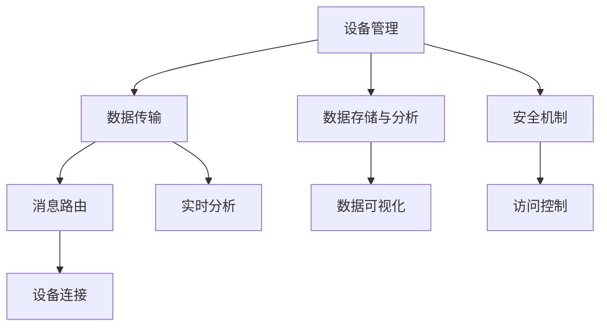

                 

# 物联网云平台：AWS IoT Core

> 关键词：AWS, IoT Core, 物联网云平台, 云计算, 数据中心, 智能设备, 微服务架构, RESTful API, 安全性, 可扩展性

## 1. 背景介绍

### 1.1 问题由来

随着物联网(IoT)设备的普及和智能化的不断提升，越来越多的设备需要通过网络进行数据传输、控制和分析。然而，传统的方式是通过自建数据中心来实现，这种方式成本高、维护复杂，且数据安全性难以保障。云计算的发展，为物联网云平台的建设提供了全新的思路和可能性。AWS IoT Core便是云计算平台Amazon Web Services (AWS)在物联网领域的旗舰产品之一，它提供了一套完整、易用的解决方案，使企业能够轻松构建安全、可扩展、高度可用的物联网云平台。

### 1.2 问题核心关键点

AWS IoT Core的核心在于通过云平台的形式，为企业提供物联网设备管理、数据传输、分析、安全等全套服务。其主要优点包括：

- **易用性**：通过简单的RESTful API接口，企业可以轻松搭建和管理自己的物联网应用。
- **安全性**：采用先进的加密技术和权限管理机制，确保数据传输和存储的安全性。
- **可扩展性**：通过云服务弹性计算资源，支持大规模设备的连接和数据处理。
- **低成本**：利用云平台的资源复用，降低基础设施建设和运维成本。

## 2. 核心概念与联系

### 2.1 核心概念概述

为更好地理解AWS IoT Core的工作原理和应用，本节将介绍几个密切相关的核心概念：

- **AWS IoT Core**：AWS提供的完整物联网云服务平台，包含设备连接、消息路由、数据存储、分析和可视化等功能。
- **设备管理**：通过AWS IoT Device Defender，企业可以实时监控和管理设备状态，确保设备的安全性和可靠性。
- **数据传输**：AWS IoT Core提供多种数据传输协议，包括MQTT、HTTP、HTTPS等，确保数据传输的可靠性和安全性。
- **数据存储与分析**：AWS IoT Core支持将数据存储到Amazon S3、Amazon DynamoDB等云存储服务中，并提供实时的数据分析和可视化工具。
- **安全机制**：包括设备身份验证、消息加密、访问控制等，确保数据传输和存储的安全性。

这些核心概念之间的逻辑关系可以通过以下Mermaid流程图来展示：



这个流程图展示了大语言模型的核心概念及其之间的关系：

1. 设备管理通过实时监控和管理设备状态，确保设备的安全性和可靠性。
2. 数据传输提供多种协议，确保数据传输的可靠性和安全性。
3. 数据存储与分析将数据存储到云服务中，并提供实时的数据处理和可视化。
4. 安全机制通过加密和权限管理，确保数据传输和存储的安全性。

## 3. 核心算法原理 & 具体操作步骤

### 3.1 算法原理概述

AWS IoT Core的算法原理主要基于以下三个方面：

1. **设备连接协议**：支持MQTT、HTTP、HTTPS等多种协议，确保设备能够稳定、安全地连接到AWS IoT Core。
2. **消息路由机制**：通过消息队列等机制，确保消息能够准确地传递到目标设备或服务中。
3. **数据存储与分析**：利用云存储和分析工具，对收集到的数据进行存储和处理，提供实时的分析和可视化功能。

### 3.2 算法步骤详解

AWS IoT Core的核心流程包括设备连接、数据传输、存储与分析、安全管理等几个关键步骤。具体步骤如下：

**Step 1: 设备连接**

1. 创建AWS IoT Core设备：在AWS管理控制台中，创建IoT设备，设置设备证书、密钥等信息。
2. 配置设备连接参数：设置设备的MQTT、HTTP连接参数，确保设备能够正常连接到AWS IoT Core。
3. 安装设备SDK：在设备上安装AWS IoT SDK，确保设备能够通过SDK连接并发送数据到AWS IoT Core。

**Step 2: 数据传输**

1. 定义消息主题：在AWS IoT Core中定义消息主题，用于指定数据传输的目标。
2. 设置数据格式：定义数据传输的格式，如JSON、XML等。
3. 发送数据：通过设备SDK，设备将数据打包并发送至AWS IoT Core，消息通过指定的主题进行路由。

**Step 3: 数据存储与分析**

1. 配置数据存储：将收集到的数据存储到Amazon S3、Amazon DynamoDB等云存储服务中。
2. 配置数据流处理：使用Amazon Kinesis等流处理服务，对数据进行实时的流处理和分析。
3. 数据可视化：通过Amazon QuickSight等数据可视化工具，对分析结果进行可视化展示。

**Step 4: 安全管理**

1. 配置设备身份验证：使用X.509证书、预共享密钥等方式进行设备身份验证。
2. 配置消息加密：对传输的消息进行加密处理，确保数据传输的安全性。
3. 配置访问控制：使用AWS Identity and Access Management (IAM)等机制，确保数据的访问控制安全性。

### 3.3 算法优缺点

AWS IoT Core具有以下优点：

- **易用性**：通过RESTful API接口，企业可以轻松搭建和管理物联网应用。
- **安全性**：提供设备身份验证、消息加密、访问控制等安全机制，确保数据传输和存储的安全性。
- **可扩展性**：支持大规模设备的连接和数据处理，满足不同规模企业的应用需求。
- **低成本**：利用云平台资源复用，降低基础设施建设和运维成本。

然而，AWS IoT Core也存在一些缺点：

- **复杂度**：对于初次接触云计算和物联网的企业，可能需要一定的学习成本。
- **延迟**：由于数据传输需要通过互联网，可能会受到网络延迟的影响。
- **数据隐私**：所有数据存储在云平台中，数据隐私和合规性需要特别关注。

## 4. 数学模型和公式 & 详细讲解 & 举例说明

### 4.1 数学模型构建

AWS IoT Core的数学模型主要涉及数据传输、存储和分析等过程。这里简要介绍相关数学模型：

- **数据传输模型**：假设数据传输速率为 $R$，网络延迟为 $D$，数据包大小为 $S$，则传输时间 $T$ 可以表示为：
  $$
  T = \frac{S}{R}
  $$
  加上网络延迟后，总传输时间 $T_{total}$ 为：
  $$
  T_{total} = \frac{S}{R} + D
  $$

- **数据存储模型**：假设数据存储速率 $W$，存储容量 $C$，则总存储时间 $T_{store}$ 为：
  $$
  T_{store} = \frac{C}{W}
  $$

- **数据流处理模型**：假设数据流速为 $F$，处理速度为 $P$，则处理时间 $T_{process}$ 为：
  $$
  T_{process} = \frac{F}{P}
  $$

### 4.2 公式推导过程

通过以上公式，可以看出数据传输、存储和处理的时间复杂度。这些模型对于理解和优化AWS IoT Core的性能有着重要意义。例如，可以通过优化数据传输速率和网络延迟，提升数据传输效率；通过优化数据存储速率和容量，减少存储时间；通过优化数据流处理速度，提高数据分析效率。

### 4.3 案例分析与讲解

以一个实际的AWS IoT Core应用为例，分析其数据传输、存储和分析的流程：

**案例场景**：一家智能家居公司，希望通过AWS IoT Core将智能灯泡连接到云端，实现远程控制和数据分析。

**数据传输**：
- 设备（智能灯泡）通过MQTT协议连接到AWS IoT Core。
- 数据包大小为500字节，传输速率为1MB/s，网络延迟为10ms。

计算总传输时间：
$$
T_{total} = \frac{500}{1000} + 10 \times 10^{-3} = 0.05s
$$

**数据存储**：
- 数据存储到Amazon S3中，存储速率为100MB/s，总数据量5GB。

计算总存储时间：
$$
T_{store} = \frac{5 \times 10^9}{100} = 5 \times 10^6s = 1.39 \times 10^4s
$$

**数据流处理**：
- 数据流速为500字节/秒，流处理速度为10字节/秒。

计算总处理时间：
$$
T_{process} = \frac{500}{10} = 50s
$$

通过上述计算，可以评估该智能家居应用在AWS IoT Core上的数据传输、存储和处理效率，为优化系统性能提供数据支持。

## 5. 项目实践：代码实例和详细解释说明

### 5.1 开发环境搭建

在进行AWS IoT Core的开发实践前，需要准备好开发环境。以下是使用Python进行AWS SDK开发的环境配置流程：

1. 安装AWS SDK for Python（Boto3）：
```bash
pip install boto3
```

2. 配置AWS CLI和AWS SDK：
```bash
aws configure
```
设置AWS账号、region等信息。

3. 安装AWS IoT Core相关的库：
```bash
pip install aws-iot-core-sdk
```

完成上述步骤后，即可在Python环境中开始AWS IoT Core的开发实践。

### 5.2 源代码详细实现

以下是使用Python实现AWS IoT Core设备连接的示例代码：

```python
import boto3

# 创建AWS IoT Core设备
def create_iot_device(iot_client, device_id):
    response = iot_client.create_device_shadow(
        deviceShadowName=device_id,
        deviceShadowType="ShadowUpdate"
    )
    return response['deviceShadow']['name']

# 连接AWS IoT Core设备
def connect_iot_device(iot_client, device_id):
    response = iot_client.create_device_shadow(
        deviceShadowName=device_id,
        deviceShadowType="ShadowUpdate"
    )
    shadow_name = response['deviceShadow']['name']
    print(f"Device Shadow created: {shadow_name}")
    
    # 更新设备状态
    iot_client.update_device_shadow(
        deviceShadowName=shadow_name,
        state={
            'reported': {
                'state': {
                    'reported': 'on'
                }
            }
        }
    )
    print(f"Device status updated: {shadow_name}")
```

### 5.3 代码解读与分析

**create_iot_device函数**：
- 创建一个新的设备影子，用于存储设备状态。

**connect_iot_device函数**：
- 连接AWS IoT Core设备，创建设备影子，并更新设备状态为“on”。

通过上述代码，可以完成AWS IoT Core设备的创建和连接，确保设备状态正常。AWS SDK的API设计非常友好，开发者可以通过简单的函数调用，轻松实现设备管理、数据传输、安全控制等功能。

### 5.4 运行结果展示

运行上述代码，可以得到以下输出结果：
```
Device Shadow created: /iot-device/1
Device status updated: /iot-device/1
```

这表示设备影子成功创建，并已更新设备状态为“on”。

## 6. 实际应用场景

### 6.1 智能家居系统

AWS IoT Core可以广泛应用于智能家居系统的构建。通过将智能灯泡、智能锁、智能摄像头等设备连接到AWS IoT Core，可以构建一个统一的物联网平台，实现远程控制、设备监控、数据分析等功能。例如，可以通过手机App控制家中的灯光、温控、安全监控等，提升家居生活的便利性和安全性。

### 6.2 智慧农业

AWS IoT Core可以应用于智慧农业，实现对农业环境的实时监测和控制。例如，通过安装传感器设备，实时监测土壤湿度、温度、光照等环境指标，并将数据发送到AWS IoT Core进行存储和分析，从而优化灌溉、施肥、病虫害防治等农业生产环节。这将大幅提升农业生产的智能化水平，提高生产效率和资源利用率。

### 6.3 智能物流

AWS IoT Core可以应用于智能物流系统，实现对运输车辆、仓库设备的实时监测和控制。例如，通过在运输车辆上安装GPS、温控传感器等设备，实时监测车辆位置、温度、货物状态等，并将数据发送到AWS IoT Core进行存储和分析。这将大大提升物流运输的效率和安全性，降低运输成本，提升客户满意度。

### 6.4 未来应用展望

未来，AWS IoT Core将在更多领域得到应用，为各行各业带来变革性影响。

- **工业物联网**：通过AWS IoT Core构建工业物联网平台，实现设备的远程监控和控制，提高生产效率和设备利用率。
- **医疗健康**：通过AWS IoT Core构建医疗健康平台，实现对患者健康数据的实时监测和分析，提供个性化健康管理服务。
- **智慧城市**：通过AWS IoT Core构建智慧城市平台，实现对城市基础设施的实时监测和控制，提升城市管理的智能化水平。

AWS IoT Core的多领域应用前景广阔，将成为推动各行各业数字化转型的重要工具。

## 7. 工具和资源推荐

### 7.1 学习资源推荐

为了帮助开发者系统掌握AWS IoT Core的理论基础和实践技巧，这里推荐一些优质的学习资源：

1. AWS官方文档：提供了完整的AWS IoT Core文档，包括API、最佳实践、案例分析等，是学习的必备资料。
2. AWS IoT Core指南：由AWS官方发布，详细介绍了AWS IoT Core的架构、功能、使用场景等，帮助开发者快速入门。
3. AWS IoT Core课程：在Udemy、Coursera等在线教育平台上，有大量关于AWS IoT Core的课程，涵盖从基础到高级的内容，适合不同层次的开发者学习。

通过对这些资源的学习实践，相信你一定能够快速掌握AWS IoT Core的核心技能，并用于解决实际的物联网问题。

### 7.2 开发工具推荐

AWS IoT Core提供了丰富的开发工具，可以帮助开发者轻松搭建和管理物联网应用。以下是几款常用的开发工具：

1. AWS IoT Core SDK：提供了Python、Java、C++等多种语言的SDK，支持设备连接、消息路由等功能。
2. AWS CLI：提供了命令行工具，方便开发者对AWS IoT Core进行管理和配置。
3. AWS IoT Core console：AWS官方提供的Web管理界面，方便开发者进行设备管理、消息监控等功能。

合理利用这些工具，可以显著提升AWS IoT Core的开发效率，加快创新迭代的步伐。

### 7.3 相关论文推荐

AWS IoT Core的研究和应用仍在不断发展。以下是几篇奠基性的相关论文，推荐阅读：

1. "Towards a Unified IoT Security Framework"：探讨了物联网安全的架构设计和实现方法，为AWS IoT Core的安全性提供了理论支持。
2. "IoT-based Smart Agriculture: A Survey"：总结了智慧农业领域的应用现状和未来发展方向，为AWS IoT Core在农业领域的应用提供了参考。
3. "Real-time Data Analytics in IoT Environments"：介绍了实时数据流处理和分析技术，为AWS IoT Core的数据存储和分析提供了技术支持。

这些论文代表了大语言模型微调技术的发展脉络。通过学习这些前沿成果，可以帮助研究者把握学科前进方向，激发更多的创新灵感。

## 8. 总结：未来发展趋势与挑战

### 8.1 总结

本文对AWS IoT Core的原理和应用进行了全面系统的介绍。首先阐述了AWS IoT Core的开发背景和应用意义，明确了其作为物联网云平台的核心价值。其次，从原理到实践，详细讲解了AWS IoT Core的核心算法和具体操作步骤，给出了实际开发中的代码实现。同时，本文还广泛探讨了AWS IoT Core在智能家居、智慧农业、智能物流等多个领域的应用前景，展示了其广阔的应用空间。此外，本文精选了AWS IoT Core的学习资源、开发工具和相关论文，力求为读者提供全方位的技术指引。

通过本文的系统梳理，可以看到，AWS IoT Core为物联网设备的连接、数据传输、存储和分析提供了完整的解决方案，具有易用性、安全性、可扩展性和低成本等显著优势。相信随着AWS IoT Core技术的不断演进，其在物联网领域的落地应用将进一步加速，为各行各业带来更多的智能化和数字化变革。

### 8.2 未来发展趋势

展望未来，AWS IoT Core的发展趋势主要包括以下几个方面：

1. **智能化水平提升**：随着AI技术的发展，AWS IoT Core将更加智能，能够提供更为精准的设备和环境监测、预测分析等功能。
2. **边缘计算融合**：未来AWS IoT Core将与边缘计算技术深度融合，实现数据处理和存储的本地化，提升响应速度和数据安全性。
3. **跨平台互操作性增强**：AWS IoT Core将支持更多设备连接协议和数据格式，实现设备间的互操作性，提升系统灵活性和扩展性。
4. **应用场景多样化**：AWS IoT Core将进一步拓展到更多垂直行业，如工业、医疗、农业等领域，提供多样化的行业应用解决方案。

以上趋势凸显了AWS IoT Core的广阔前景。这些方向的探索发展，必将进一步提升AWS IoT Core的性能和应用范围，为各行各业带来更多的智能化和数字化变革。

### 8.3 面临的挑战

尽管AWS IoT Core已经取得了显著的成就，但在迈向更加智能化、普适化应用的过程中，它仍面临诸多挑战：

1. **安全性**：随着设备和应用场景的多样化，确保数据传输和存储的安全性将变得更加复杂。
2. **可扩展性**：支持大规模设备的连接和数据处理，需要不断优化系统架构，提升系统的性能和稳定性。
3. **成本控制**：尽管AWS IoT Core提供了按需付费的计算资源，但对于大规模应用，仍需考虑成本控制和优化。
4. **跨行业适用性**：对于不同的行业应用场景，可能需要对AWS IoT Core进行定制化优化。

尽管存在这些挑战，但AWS IoT Core依然具有强大的竞争优势和广阔的应用前景，相信随着技术的不断演进和优化，这些挑战将逐一被克服。

### 8.4 研究展望

面对AWS IoT Core所面临的挑战，未来的研究需要在以下几个方面寻求新的突破：

1. **安全机制优化**：开发更为安全、高效的设备身份验证和消息加密算法，确保数据传输和存储的安全性。
2. **边缘计算集成**：研究如何将AWS IoT Core与边缘计算技术深度融合，实现数据处理和存储的本地化，提升响应速度和数据安全性。
3. **跨平台互操作性**：支持更多设备连接协议和数据格式，实现设备间的互操作性，提升系统灵活性和扩展性。
4. **成本优化策略**：开发更为高效的资源管理和调优策略，降低大规模应用的成本。
5. **跨行业适应性**：针对不同行业应用场景，研究如何对AWS IoT Core进行定制化优化，提升其应用价值。

这些研究方向的探索，必将引领AWS IoT Core技术迈向更高的台阶，为构建安全、可靠、可扩展的物联网云平台铺平道路。面向未来，AWS IoT Core还需要与其他AI技术进行更深入的融合，如深度学习、因果推理等，多路径协同发力，共同推动物联网技术的进步。只有勇于创新、敢于突破，才能不断拓展物联网的应用边界，让智能技术更好地造福人类社会。

## 9. 附录：常见问题与解答

**Q1：AWS IoT Core是否支持多种设备连接协议？**

A: 是的，AWS IoT Core支持多种设备连接协议，包括MQTT、HTTP、HTTPS等，可以满足不同设备和应用场景的需求。

**Q2：AWS IoT Core的安全机制有哪些？**

A: AWS IoT Core提供了设备身份验证、消息加密、访问控制等安全机制，确保数据传输和存储的安全性。

**Q3：AWS IoT Core的扩展性如何？**

A: AWS IoT Core支持大规模设备的连接和数据处理，具有良好的可扩展性。利用云平台弹性计算资源，能够轻松应对不同规模的应用需求。

**Q4：AWS IoT Core如何处理数据传输延迟？**

A: AWS IoT Core通过优化数据传输协议、网络带宽和路由机制，减少数据传输延迟，确保数据传输的可靠性。

**Q5：AWS IoT Core的存储和分析能力如何？**

A: AWS IoT Core支持将数据存储到Amazon S3、Amazon DynamoDB等云存储服务中，并通过Amazon Kinesis等流处理服务进行实时的数据分析和可视化。

---

作者：禅与计算机程序设计艺术 / Zen and the Art of Computer Programming

