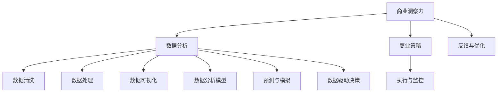

                 

# 理解洞察力的价值：在商业策略中的应用

> 关键词：洞察力,商业策略,数据分析,决策支持,人工智能

## 1. 背景介绍

### 1.1 问题由来

在现代商业竞争日益激烈的背景下，洞察力（Insight）成为决定企业成败的关键因素之一。传统的决策制定过程通常基于定性分析和经验直觉，但随着数据驱动决策的兴起，越来越多的企业开始重视数据驱动的洞察力。数据分析与商业策略的结合，使得企业能够更加精准地理解市场动态、客户需求和竞争态势，从而制定更加科学的商业策略，提升企业的市场竞争力和盈利能力。

### 1.2 问题核心关键点

洞察力是指通过数据分析和处理，从大量数据中挖掘出隐藏的模式、趋势和关联关系，为企业提供决策参考的能力。商业策略的形成过程涉及到对市场趋势的预测、客户需求的理解、竞争对手的分析等，洞察力在这一过程中扮演着至关重要的角色。

为更好地理解商业策略中的洞察力应用，本文将详细探讨以下几个关键问题：
1. 什么是商业洞察力？
2. 商业洞察力与数据分析的关系是什么？
3. 如何有效地利用数据生成洞察力？
4. 商业洞察力在商业策略中的应用案例。
5. 未来商业洞察力的发展趋势与挑战。

## 2. 核心概念与联系

### 2.1 核心概念概述

为了更清晰地理解商业洞察力在商业策略中的应用，本文将介绍几个关键概念及其联系：

- **商业洞察力（Business Insight）**：是指通过数据分析和处理，从大量数据中挖掘出隐藏的模式、趋势和关联关系，为企业提供决策参考的能力。
- **数据分析（Data Analysis）**：指的是对数据进行收集、清洗、处理和分析，从中提取有用信息和知识的过程。
- **商业策略（Business Strategy）**：指企业为了实现其目标而制定的长期计划和行动方案。
- **数据驱动决策（Data-Driven Decision Making）**：是指基于数据分析和模型预测，而非传统经验或直觉，制定和执行商业决策的过程。
- **人工智能（Artificial Intelligence, AI）**：是一种模拟人类智能的计算机技术，通过机器学习、深度学习等技术，实现对数据的自动分析和决策。

这些概念之间有着密切的联系。数据分析为商业洞察力提供了数据基础，商业洞察力进一步指导了商业策略的制定，而数据驱动决策和人工智能技术则是实现这一过程的关键工具。

### 2.2 核心概念原理和架构的 Mermaid 流程图



这个流程图展示了商业洞察力与商业策略的联系，以及数据分析在这一过程中的关键作用。从数据收集到策略执行，数据分析与商业洞察力始终紧密相连，共同支撑着商业策略的制定和执行。

## 3. 核心算法原理 & 具体操作步骤

### 3.1 算法原理概述

商业洞察力的生成过程可以分为两个主要步骤：

1. **数据收集与准备**：从各种来源收集相关数据，并对数据进行清洗、处理和格式化，以便后续分析。
2. **数据分析与洞察力生成**：应用数据分析技术和算法，从处理后的数据中提取有用信息和知识，生成商业洞察力。

### 3.2 算法步骤详解

#### 3.2.1 数据收集与准备

数据收集与准备是生成商业洞察力的第一步，涉及到数据的收集、清洗和处理。具体步骤如下：

- **数据来源**：收集各种来源的数据，包括内部数据（如销售记录、客户反馈、内部报告等）和外部数据（如市场调研、社交媒体数据、公开数据等）。
- **数据清洗**：去除数据中的噪声、异常值和不一致性，确保数据的准确性和完整性。
- **数据处理**：对数据进行格式化、标准化和归一化处理，以便后续分析。

#### 3.2.2 数据分析与洞察力生成

数据分析与洞察力生成是生成商业洞察力的核心步骤，具体步骤如下：

- **数据可视化**：通过数据可视化工具，直观地展示数据特征和趋势，帮助分析人员识别数据中的异常和关键点。
- **统计分析**：应用统计学方法，对数据进行描述性分析，如均值、方差、相关性分析等。
- **机器学习与深度学习**：应用机器学习和深度学习算法，从数据中挖掘出隐藏的模式、趋势和关联关系，生成预测模型和洞察力。

### 3.3 算法优缺点

#### 3.3.1 优点

1. **提高决策质量**：通过数据分析和洞察力生成，企业可以更加科学地制定商业策略，提升决策质量。
2. **优化资源配置**：洞察力可以帮助企业识别资源浪费和优化机会，提升资源配置效率。
3. **增强竞争力**：洞察力使企业能够更好地理解市场动态和客户需求，提升市场竞争力。

#### 3.3.2 缺点

1. **数据质量问题**：数据质量不佳将直接影响分析结果的准确性和可信度。
2. **技术门槛高**：数据分析和洞察力生成需要具备一定的技术基础，对于企业内部的技术团队提出了较高要求。
3. **成本投入高**：数据分析和洞察力生成需要投入大量的技术和人力资源，成本较高。

### 3.4 算法应用领域

商业洞察力在多个领域得到了广泛应用，包括但不限于：

- **市场营销**：通过市场数据分析，识别市场趋势和客户需求，制定有效的市场推广策略。
- **产品开发**：通过产品使用数据分析，优化产品设计，提升用户体验和产品竞争力。
- **供应链管理**：通过供应链数据分析，优化库存管理，提高供应链效率。
- **财务分析**：通过财务数据分析，优化财务策略，提升企业盈利能力。
- **客户服务**：通过客户数据分析，提升客户服务质量和满意度。

## 4. 数学模型和公式 & 详细讲解 & 举例说明

### 4.1 数学模型构建

商业洞察力的生成过程中，数据分析模型的构建是一个关键步骤。常见的数据分析模型包括：

- **回归分析模型**：用于预测连续型变量的模型，如线性回归、岭回归等。
- **分类模型**：用于预测离散型变量的模型，如逻辑回归、支持向量机等。
- **聚类模型**：用于将数据分为不同类别的模型，如K-means、层次聚类等。
- **关联规则模型**：用于发现数据中项之间的关联关系的模型，如Apriori算法、FP-Growth算法等。

### 4.2 公式推导过程

以线性回归模型为例，其基本公式如下：

$$
y = \beta_0 + \beta_1 x_1 + \beta_2 x_2 + \cdots + \beta_n x_n + \epsilon
$$

其中，$y$ 为预测变量，$x_i$ 为自变量，$\beta_i$ 为回归系数，$\epsilon$ 为误差项。

根据最小二乘法，回归系数的求解公式为：

$$
\hat{\beta} = (X^TX)^{-1}X^Ty
$$

其中，$X$ 为自变量矩阵，$\hat{\beta}$ 为回归系数的估计值。

### 4.3 案例分析与讲解

假设某电商平台想要预测用户是否会购买某商品，收集了用户的浏览记录、购买记录和用户属性等信息，构建了如下的线性回归模型：

$$
\text{购买} = \beta_0 + \beta_1 \text{浏览次数} + \beta_2 \text{商品评价} + \beta_3 \text{用户年龄} + \epsilon
$$

通过最小二乘法求解回归系数，可以预测用户是否会购买某商品，从而制定相应的促销策略。

## 5. 项目实践：代码实例和详细解释说明

### 5.1 开发环境搭建

在进行商业洞察力项目实践前，我们需要准备好开发环境。以下是使用Python进行Pandas和Scikit-learn开发的示例环境配置流程：

1. 安装Anaconda：从官网下载并安装Anaconda，用于创建独立的Python环境。

2. 创建并激活虚拟环境：
```bash
conda create -n business-insight python=3.8 
conda activate business-insight
```

3. 安装Pandas和Scikit-learn：
```bash
conda install pandas scikit-learn 
```

4. 安装各类工具包：
```bash
pip install numpy matplotlib seaborn plotly
```

5. 安装Jupyter Notebook：
```bash
conda install jupyterlab
```

完成上述步骤后，即可在`business-insight`环境中开始商业洞察力的项目实践。

### 5.2 源代码详细实现

以下是一个简单的商业洞察力项目示例，使用Pandas和Scikit-learn进行数据处理和回归分析：

```python
import pandas as pd
from sklearn.model_selection import train_test_split
from sklearn.linear_model import LinearRegression

# 加载数据
data = pd.read_csv('data.csv')

# 数据清洗
data = data.dropna()

# 数据处理
X = data[['浏览次数', '商品评价', '用户年龄']]
y = data['购买']

# 分割数据集
X_train, X_test, y_train, y_test = train_test_split(X, y, test_size=0.2, random_state=42)

# 构建模型
model = LinearRegression()

# 训练模型
model.fit(X_train, y_train)

# 评估模型
score = model.score(X_test, y_test)
print('模型评估得分:', score)

# 预测
y_pred = model.predict(X_test)

# 输出预测结果
print(y_pred)
```

### 5.3 代码解读与分析

让我们再详细解读一下关键代码的实现细节：

**加载数据**：
- `pd.read_csv('data.csv')`：使用Pandas加载CSV格式的数据文件，将数据读入DataFrame对象。

**数据清洗**：
- `data = data.dropna()`：去除数据中的缺失值。

**数据处理**：
- `X = data[['浏览次数', '商品评价', '用户年龄']]`：选择模型的自变量。
- `y = data['购买']`：选择模型的因变量。

**分割数据集**：
- `X_train, X_test, y_train, y_test = train_test_split(X, y, test_size=0.2, random_state=42)`：使用train_test_split函数将数据集划分为训练集和测试集。

**构建模型**：
- `model = LinearRegression()`：构建线性回归模型。

**训练模型**：
- `model.fit(X_train, y_train)`：使用训练集数据拟合模型。

**评估模型**：
- `score = model.score(X_test, y_test)`：使用测试集数据评估模型性能。

**预测**：
- `y_pred = model.predict(X_test)`：使用模型进行预测。

可以看到，使用Pandas和Scikit-learn进行商业洞察力的项目实践，代码实现相对简洁高效。开发者可以将更多精力放在数据处理、模型改进等高层逻辑上，而不必过多关注底层的实现细节。

当然，工业级的系统实现还需考虑更多因素，如模型的保存和部署、超参数的自动搜索、更灵活的任务适配层等。但核心的商业洞察力生成流程基本与此类似。

## 6. 实际应用场景

### 6.1 市场营销

在市场营销领域，商业洞察力可以用于识别市场趋势和客户需求，从而制定有效的市场推广策略。例如，通过分析历史销售数据和市场调研数据，可以识别出热门产品、热门促销活动和客户偏好，从而制定针对性的营销策略。

### 6.2 产品开发

在产品开发领域，商业洞察力可以用于优化产品设计，提升用户体验和产品竞争力。例如，通过分析用户使用数据和反馈数据，可以识别出产品的优点和不足，从而进行产品迭代和改进。

### 6.3 供应链管理

在供应链管理领域，商业洞察力可以用于优化库存管理，提高供应链效率。例如，通过分析订单数据和库存数据，可以识别出库存水平、采购周期和供应商表现，从而优化库存和采购策略。

### 6.4 财务分析

在财务分析领域，商业洞察力可以用于优化财务策略，提升企业盈利能力。例如，通过分析财务报表和现金流数据，可以识别出成本控制和投资机会，从而制定财务优化策略。

### 6.5 客户服务

在客户服务领域，商业洞察力可以用于提升客户服务质量和满意度。例如，通过分析客户反馈和投诉数据，可以识别出客户痛点和满意度高的服务环节，从而优化客户服务流程。

## 7. 工具和资源推荐

### 7.1 学习资源推荐

为了帮助开发者系统掌握商业洞察力的理论基础和实践技巧，这里推荐一些优质的学习资源：

1. 《Python数据分析与可视化实战》：由知名数据科学家撰写，详细介绍如何使用Python进行数据分析和可视化。
2. 《机器学习实战》：由Kaggle数据科学竞赛优胜者撰写，全面介绍机器学习算法及其应用。
3. 《商业数据分析与洞察力》课程：由知名商业数据分析专家开设，系统介绍商业洞察力的生成过程和应用案例。
4. Coursera《数据科学与机器学习》课程：由斯坦福大学开设的机器学习课程，涵盖数据科学和机器学习的基本概念和前沿技术。
5. Kaggle数据科学竞赛：通过参与数据科学竞赛，学习和实践商业洞察力的生成过程。

通过对这些资源的学习实践，相信你一定能够快速掌握商业洞察力的精髓，并用于解决实际的商业问题。

### 7.2 开发工具推荐

高效的开发离不开优秀的工具支持。以下是几款用于商业洞察力开发的常用工具：

1. Jupyter Notebook：开源的交互式计算环境，支持Python、R等多种语言，方便进行数据分析和可视化。
2. Tableau：商业智能和数据可视化工具，提供丰富的图表和仪表盘，帮助分析人员直观展示数据。
3. Python：开源的编程语言，拥有丰富的第三方库（如Pandas、Scikit-learn、TensorFlow等），适合进行数据分析和机器学习。
4. R语言：开源的统计分析语言，适合进行数据分析和统计建模。
5. Apache Hadoop：大数据处理框架，适合处理大规模数据集，进行分布式数据分析。

合理利用这些工具，可以显著提升商业洞察力的生成和分析效率，加快创新迭代的步伐。

### 7.3 相关论文推荐

商业洞察力在商业决策中的应用，得益于数据科学和机器学习技术的不断进步。以下是几篇奠基性的相关论文，推荐阅读：

1. "A Framework for Building Intelligent Business Analytics Datasets"：提出构建智能商业分析数据集的方法，推动商业洞察力的生成和应用。
2. "Data Mining, Statistical Learning, and Statistical Learning Theory"：介绍数据挖掘和统计学习的理论基础，为商业洞察力的生成提供理论支撑。
3. "Machine Learning Yearning"：由深度学习专家Andrew Ng撰写，详细介绍机器学习在商业决策中的应用。
4. "Big Data for Business Decisions"：提出大数据技术在商业决策中的应用，帮助企业从海量数据中挖掘商业洞察力。
5. "Deep Learning for Business"：介绍深度学习在商业决策中的应用，推动商业洞察力的生成和应用。

这些论文代表了大数据和机器学习技术在商业决策中的应用趋势，通过学习这些前沿成果，可以帮助研究者把握学科前进方向，激发更多的创新灵感。

## 8. 总结：未来发展趋势与挑战

### 8.1 总结

本文对商业洞察力的生成过程及其在商业策略中的应用进行了全面系统的介绍。首先阐述了商业洞察力的定义及其与数据分析的关系，明确了商业洞察力在商业策略中的关键作用。其次，从原理到实践，详细讲解了商业洞察力的生成步骤，给出了商业洞察力项目开发的完整代码实例。同时，本文还广泛探讨了商业洞察力在市场营销、产品开发、供应链管理、财务分析和客户服务等多个行业领域的应用前景，展示了商业洞察力的广泛应用价值。此外，本文精选了商业洞察力的各类学习资源，力求为读者提供全方位的技术指引。

通过本文的系统梳理，可以看到，商业洞察力生成技术已经广泛应用于多个行业，帮助企业从海量数据中挖掘出有价值的商业信息，制定更加科学和有效的商业策略，提升企业的市场竞争力和盈利能力。未来，随着大数据和机器学习技术的进一步发展，商业洞察力的生成过程将更加高效和智能，为企业的商业决策提供更加有力的支撑。

### 8.2 未来发展趋势

展望未来，商业洞察力生成技术将呈现以下几个发展趋势：

1. **自动化与智能化**：随着机器学习和深度学习技术的进步，商业洞察力的生成将更加自动化和智能化，能够自动发现数据中的异常和关联关系。
2. **实时化与动态化**：实时数据流分析技术的发展，使得商业洞察力的生成更加实时和动态，能够及时应对市场变化和客户需求。
3. **多模态融合**：将文本、图像、视频等多模态数据融合，提升商业洞察力的生成精度和泛化能力。
4. **自适应学习**：商业洞察力生成模型将具备自适应学习能力，能够根据不同场景和任务自动调整模型参数和生成策略。
5. **可视化与交互化**：商业洞察力的生成过程将更加可视化，能够直观展示数据中的模式和趋势，增强分析人员的操作体验。

### 8.3 面临的挑战

尽管商业洞察力生成技术已经取得了显著进展，但在迈向更加智能化和普适化应用的过程中，仍面临诸多挑战：

1. **数据质量问题**：数据质量不佳将直接影响分析结果的准确性和可信度。
2. **技术门槛高**：商业洞察力生成需要具备一定的技术基础，对于企业内部的技术团队提出了较高要求。
3. **成本投入高**：商业洞察力生成需要投入大量的技术和人力资源，成本较高。
4. **数据隐私与安全**：商业洞察力的生成需要大量敏感数据，如何在保证数据隐私和安全的前提下，进行数据分析和模型训练，是一个重要问题。

### 8.4 研究展望

面对商业洞察力生成所面临的挑战，未来的研究需要在以下几个方面寻求新的突破：

1. **提升数据质量**：开发更加高效的数据清洗和预处理算法，提升数据质量，保障分析结果的准确性。
2. **降低技术门槛**：开发更加易用和灵活的商业洞察力生成工具和平台，降低技术门槛，提高企业内部的数据分析能力。
3. **降低成本**：探索更加高效和经济的商业洞察力生成方法，降低技术和人力成本。
4. **保障数据隐私与安全**：开发更加安全可靠的数据隐私保护技术，保障数据的安全性和隐私性。
5. **推动多模态融合**：探索将文本、图像、视频等多模态数据融合的方法，提升商业洞察力的生成精度和泛化能力。

## 9. 附录：常见问题与解答

**Q1：商业洞察力与数据分析的关系是什么？**

A: 商业洞察力是数据分析的一种高级形式，通过数据分析生成商业洞察力，可以帮助企业更好地理解市场动态和客户需求，制定科学合理的商业策略。数据分析是商业洞察力生成的基础，而商业洞察力是数据分析的目标和应用。

**Q2：如何有效地利用数据生成商业洞察力？**

A: 有效的数据生成商业洞察力需要具备以下几个步骤：
1. 数据收集：收集来自不同来源的数据，包括内部数据和外部数据。
2. 数据清洗：对数据进行清洗和预处理，去除噪声和异常值。
3. 数据分析：应用数据分析技术和算法，从数据中挖掘出有用的信息和知识。
4. 数据可视化：通过可视化工具，直观展示数据中的模式和趋势。
5. 商业洞察力生成：根据数据分析结果，生成商业洞察力，指导商业策略的制定。

**Q3：商业洞察力在商业策略中的应用案例有哪些？**

A: 商业洞察力在多个行业领域得到了广泛应用，以下是一些典型的应用案例：
1. 市场营销：通过市场数据分析，识别市场趋势和客户需求，制定有效的市场推广策略。
2. 产品开发：通过产品使用数据分析，优化产品设计，提升用户体验和产品竞争力。
3. 供应链管理：通过供应链数据分析，优化库存管理，提高供应链效率。
4. 财务分析：通过财务报表和现金流数据，识别出成本控制和投资机会，制定财务优化策略。
5. 客户服务：通过客户反馈和投诉数据，识别客户痛点和满意度高的服务环节，优化客户服务流程。

**Q4：商业洞察力的未来发展趋势是什么？**

A: 商业洞察力的未来发展趋势包括：
1. 自动化与智能化：随着机器学习和深度学习技术的进步，商业洞察力的生成将更加自动化和智能化，能够自动发现数据中的异常和关联关系。
2. 实时化与动态化：实时数据流分析技术的发展，使得商业洞察力的生成更加实时和动态，能够及时应对市场变化和客户需求。
3. 多模态融合：将文本、图像、视频等多模态数据融合，提升商业洞察力的生成精度和泛化能力。
4. 自适应学习：商业洞察力生成模型将具备自适应学习能力，能够根据不同场景和任务自动调整模型参数和生成策略。
5. 可视化与交互化：商业洞察力的生成过程将更加可视化，能够直观展示数据中的模式和趋势，增强分析人员的操作体验。

**Q5：如何克服商业洞察力生成中的数据隐私与安全问题？**

A: 为了克服商业洞察力生成中的数据隐私与安全问题，可以采取以下措施：
1. 数据脱敏：对敏感数据进行匿名化和脱敏处理，保护数据隐私。
2. 安全传输：采用加密传输技术，保障数据在传输过程中的安全性。
3. 权限控制：对数据访问进行权限控制，确保只有授权人员能够访问敏感数据。
4. 数据备份与恢复：定期备份数据，保障数据在发生故障或攻击时的恢复能力。
5. 隐私保护技术：开发和应用隐私保护技术，如差分隐私、同态加密等，保护数据隐私。

---

作者：禅与计算机程序设计艺术 / Zen and the Art of Computer Programming

