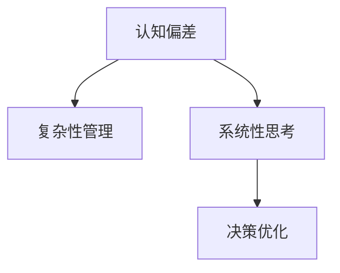

                 

# 理解洞察力的技巧：培养系统性思考能力

> 关键词：洞察力,系统性思考,认知偏差,复杂性管理,决策优化

## 1. 背景介绍

### 1.1 问题由来
在信息爆炸的时代，人们每天都会面临海量的数据和信息，如何在繁杂的信息流中快速获取有价值的洞察，做出高效、合理的决策，成为现代社会的一个重要课题。这其中，系统性思考能力扮演着关键角色。系统性思考不仅仅是指对问题的全面理解，更重要的是通过分析和整合，预测未来趋势，从而制定更有效的应对策略。然而，由于心理认知偏差和复杂性管理困难，系统性思考能力并不是所有人都能轻松掌握的。

### 1.2 问题核心关键点
系统性思考能力是指个体或组织在面对复杂问题时，能够全面、深入地分析问题，整合信息，并在此基础上进行预测和决策的能力。这种能力不仅需要扎实的知识基础，更需要一系列技巧和方法，以帮助我们更准确、更快速地理解问题本质，找到解决方案。

系统性思考的核心在于：
1. **全面分析问题**：通过多角度、多层次的视角，全面了解问题的所有相关因素。
2. **整合信息**：将不同来源的信息进行有效整合，形成统一、连贯的认识。
3. **预测未来**：基于整合后的信息，进行合理预测，制定应对策略。
4. **决策优化**：在全面分析和整合的基础上，做出最优决策。

系统性思考能力的培养，需要从多个方面入手，包括认知偏差的理解与克服、复杂性管理的技巧、决策优化的方法等。通过深入学习和实践，可以有效提升系统性思考能力，提高决策效率和质量。

### 1.3 问题研究意义
在信息时代，培养系统性思考能力，具有重要的现实意义和长远价值：

1. **提升决策效率**：系统性思考能够帮助我们全面、深入地分析问题，避免陷入片面和偏颇的决策陷阱，从而做出更加科学合理的决策。
2. **应对复杂性挑战**：现代社会复杂多变，系统性思考能力能够帮助我们在复杂环境中寻找规律，制定应对策略。
3. **促进创新**：系统性思考能力不仅适用于问题解决，还适用于新想法、新方案的生成，推动创新和进步。
4. **增强应对能力**：在面对未知和变化时，系统性思考能力能够帮助我们更好地适应环境，提升应对不确定性的能力。
5. **提高综合素质**：系统性思考能力的培养，有助于提升个人的综合素质，包括分析能力、整合能力、预测能力、决策能力等。

## 2. 核心概念与联系

### 2.1 核心概念概述

为了更好地理解系统性思考能力的培养方法，本节将介绍几个密切相关的核心概念：

- **认知偏差(Cognitive Bias)**：指人们在感知、记忆、判断、决策等认知过程中，由于各种原因产生的偏误。常见的认知偏差包括确认偏误、代表性启发式、锚定效应等。
- **复杂性管理(Complexity Management)**：指面对复杂问题时，如何有效地组织和管理信息，识别关键要素，制定解决方案。
- **系统性思考(Systematic Thinking)**：指在面对复杂问题时，通过系统化的分析和整合，形成全面的认识，并制定解决方案。
- **决策优化(Decision Optimization)**：指在全面分析问题的基础上，通过科学的方法，优化决策过程，提高决策的合理性和有效性。

这些核心概念之间的逻辑关系可以通过以下Mermaid流程图来展示：



这个流程图展示了几大核心概念及其之间的关系：

1. 认知偏差是影响系统性思考的障碍，需要通过学习和认知重塑来克服。
2. 复杂性管理是系统性思考的重要环节，通过有效管理复杂信息，为系统性思考提供坚实基础。
3. 系统性思考是基于认知偏差克服和复杂性管理的结果，能够形成全面的认识。
4. 决策优化是系统性思考的最终目标，通过优化决策，提升问题解决和应对的效率。

这些概念共同构成了系统性思考能力的培养框架，帮助我们更有效地应对复杂问题。

## 3. 核心算法原理 & 具体操作步骤

### 3.1 算法原理概述

系统性思考能力的培养，主要依赖于以下几个关键步骤：

1. **认知偏差的识别与克服**：通过学习和训练，识别常见的认知偏差，并采取措施进行修正。
2. **复杂性管理技巧的应用**：通过系统化的方法，对复杂问题进行拆分和重组，识别关键要素。
3. **系统性思考的实践**：通过全面分析和整合信息，形成系统性的认识。
4. **决策优化的实现**：通过科学的方法，优化决策过程，提高决策的合理性和有效性。

系统性思考能力的培养，不仅需要理论知识，更需要实践操作。以下将详细介绍这些步骤的具体操作方法。

### 3.2 算法步骤详解

#### 3.2.1 认知偏差的识别与克服

识别和克服认知偏差是系统性思考的基础。以下是一些常见认知偏差的识别和克服方法：

**1. 确认偏误(Confirmation Bias)**

确认偏误是指人们在寻找信息时，倾向于寻找与自己已有信念一致的信息，而忽视不一致的信息。克服确认偏误的方法包括：

- **主动寻求不同观点**：有意识地寻求不同观点和证据，而不是只关注支持自己观点的信息。
- **交叉验证**：通过多源验证，确保信息的准确性和全面性。

**2. 代表性启发式(Representativeness Heuristic)**

代表性启发式是指人们倾向于根据样本的代表性，推断总体。克服代表性启发式的方法包括：

- **样本大小和多样性**：确保样本大小足够，并包含多样性，以减少代表性偏差。
- **概率计算**：使用概率计算方法，避免简单的代表性推断。

**3. 锚定效应(Anchoring Effect)**

锚定效应是指人们在做决策时，容易受最初获取的信息影响，难以摆脱。克服锚定效应的方法包括：

- **多个基准点**：使用多个基准点，避免仅依赖单一信息。
- **信息更新**：在决策过程中，不断更新和修正信息。

#### 3.2.2 复杂性管理技巧的应用

复杂性管理技巧是系统性思考的关键环节。以下是一些常用的复杂性管理方法：

**1. 因果图(Cause-and-Effect Diagram)**

因果图是一种用于分析问题原因和结果的工具。通过绘制因果图，可以全面了解问题的各个因素及其相互作用。

**2. 层级分析法(Hierarchical Analysis)**

层级分析法是一种将复杂问题分解为多个层次的工具。通过自上而下的分解，可以识别问题的关键要素。

**3. 系统动力学(System Dynamics)**

系统动力学是一种用于模拟和分析复杂系统的工具。通过建立系统动力学模型，可以预测系统变化趋势，制定应对策略。

#### 3.2.3 系统性思考的实践

系统性思考的实践，需要全面、深入地分析和整合信息。以下是一些系统性思考的方法：

**1. SWOT分析(SWOT Analysis)**

SWOT分析是一种用于评估组织或个人优势、劣势、机会和威胁的工具。通过SWOT分析，可以全面了解问题的各个方面。

**2. 五力模型(Five Forces Model)**

五力模型是一种用于分析市场竞争环境的工具。通过五力模型，可以全面了解市场竞争态势，制定应对策略。

**3. 逻辑树(Logical Tree)**

逻辑树是一种用于分解和整合问题的工具。通过逻辑树，可以将复杂问题分解为多个子问题，并逐一解决。

#### 3.2.4 决策优化的实现

决策优化是系统性思考的最终目标。以下是一些决策优化的方法：

**1. 多目标优化(Multi-Objective Optimization)**

多目标优化是一种用于解决多目标问题的工具。通过多目标优化，可以在多个目标之间进行权衡和优化。

**2. 决策树(Decision Tree)**

决策树是一种用于预测和决策的工具。通过决策树，可以制定最优决策路径，提高决策的准确性。

**3. 贝叶斯网络(Bayesian Network)**

贝叶斯网络是一种用于概率推理的工具。通过贝叶斯网络，可以合理预测和评估不确定性，优化决策过程。

### 3.3 算法优缺点

系统性思考能力的培养方法，具有以下优点：

1. **全面性**：通过全面分析和整合信息，能够避免片面和偏颇的决策，提高决策的准确性。
2. **系统性**：通过系统化的思考方法，能够深入理解问题的各个方面，制定更加科学的决策。
3. **灵活性**：不同的方法可以根据具体情况灵活选择和组合，适用于各种复杂问题。
4. **可操作性**：方法简单易懂，易于实践和应用。

同时，这些方法也存在一定的局限性：

1. **学习成本高**：需要掌握和应用多种方法，学习成本较高。
2. **复杂度大**：对于极度复杂的问题，可能需要多层次、多角度的分析，增加了操作的复杂度。
3. **数据依赖性高**：方法的有效性依赖于数据的全面性和准确性。

尽管存在这些局限性，但就目前而言，系统性思考能力的培养方法仍然是大规模复杂问题解决的有效手段。未来相关研究的重点在于如何进一步降低方法的学习成本和复杂度，提高数据的可用性，同时兼顾可解释性和可操作性等因素。

### 3.4 算法应用领域

系统性思考能力的培养方法，广泛应用于各个领域，特别是在以下方面：

**1. 企业管理**

在系统性思考能力的培养中，企业管理者可以全面了解企业的优势和劣势，识别机会和威胁，制定战略规划，提高企业的竞争力和稳定性。

**2. 项目管理**

在系统性思考能力的培养中，项目管理者可以全面分析项目的各个要素，识别关键路径和风险点，制定项目计划，提高项目的成功率。

**3. 医疗健康**

在系统性思考能力的培养中，医疗健康专家可以全面了解患者的病情，识别各种因素的影响，制定治疗方案，提高医疗效果和患者满意度。

**4. 金融投资**

在系统性思考能力的培养中，金融投资专家可以全面分析市场的各种因素，识别投资机会和风险，制定投资策略，提高投资收益和风险控制能力。

**5. 环境保护**

在系统性思考能力的培养中，环境保护专家可以全面了解环境问题的各个方面，识别关键因素，制定环境保护方案，提高环境保护效果和公众参与度。

## 4. 数学模型和公式 & 详细讲解 & 举例说明

### 4.1 数学模型构建

在数学上，系统性思考能力的培养可以抽象为一个优化问题，目标是最大化信息整合度和决策合理性。设问题为 $P=(X, C, A, R)$，其中：

- $X$ 表示问题所涉及的所有变量和因素。
- $C$ 表示变量之间的因果关系，通常表示为因果图。
- $A$ 表示决策者可选择的行动方案。
- $R$ 表示决策者希望优化的结果指标，如经济效益、社会效益等。

系统性思考能力的培养可以表示为优化问题：

$$
\max_{X, C, A, R} f(X, C, A, R)
$$

其中 $f$ 表示系统性思考能力的目标函数，可以是信息整合度、决策合理性等指标。

### 4.2 公式推导过程

以下是目标函数 $f(X, C, A, R)$ 的推导过程：

**1. 信息整合度**

信息整合度是指通过系统性思考，将各种信息整合成统一、连贯的认识。信息整合度的衡量指标可以包括：

- **信息完整性**：信息涵盖问题的各个方面，没有遗漏。
- **信息一致性**：信息内部逻辑连贯，没有矛盾。
- **信息相关性**：信息与问题相关，避免冗余。

假设信息完整性、一致性和相关性可以通过指标 $I_1$、$I_2$、$I_3$ 衡量，则信息整合度的目标函数可以表示为：

$$
I(X, C, A, R) = I_1(X, C, A, R) + I_2(X, C, A, R) + I_3(X, C, A, R)
$$

**2. 决策合理性**

决策合理性是指通过系统性思考，制定最优的决策方案。决策合理性的衡量指标可以包括：

- **决策准确性**：决策方案与实际情况相符。
- **决策可行性**：决策方案在技术、经济、法律等方面可行。
- **决策鲁棒性**：决策方案对环境变化具有稳定性。

假设决策准确性、可行性和鲁棒性可以通过指标 $D_1$、$D_2$、$D_3$ 衡量，则决策合理性的目标函数可以表示为：

$$
D(X, C, A, R) = D_1(X, C, A, R) + D_2(X, C, A, R) + D_3(X, C, A, R)
$$

综合考虑信息整合度和决策合理性，目标函数 $f(X, C, A, R)$ 可以表示为：

$$
f(X, C, A, R) = \alpha \cdot I(X, C, A, R) + (1-\alpha) \cdot D(X, C, A, R)
$$

其中 $\alpha$ 为信息整合度和决策合理性的权重，需要根据具体问题进行调整。

### 4.3 案例分析与讲解

**案例：企业市场分析**

某企业需要进行市场分析，以制定市场营销策略。企业的目标函数为最大化销售额和市场份额。

**目标函数构建**：

假设市场分析涉及的关键变量包括产品特性、竞争对手、消费者需求、营销策略等。通过因果图表示这些变量的因果关系，如图1所示：

```
       营销策略
      /   \
   市场份额  销售额
   /    \         /   \
消费者需求  竞争对手  产品特性
```


通过因果图，可以全面了解市场分析的各个要素。决策者可以选择不同的营销策略，影响市场份额和销售额。决策者希望优化市场份额和销售额，因此目标函数为：

$$
f(X, C, A, R) = \alpha \cdot I(X, C, A, R) + (1-\alpha) \cdot D(X, C, A, R)
$$

**决策优化**：

假设决策者可选择的营销策略包括广告、促销、价格调整等。通过多目标优化方法，可以综合考虑市场份额和销售额的权重，制定最优的营销策略。

假设信息整合度和决策合理性的权重分别为0.6和0.4。目标函数可以表示为：

$$
f(X, C, A, R) = 0.6 \cdot I(X, C, A, R) + 0.4 \cdot D(X, C, A, R)
$$

通过多目标优化算法，求解上述优化问题，可以得到最优的营销策略组合。

## 5. 项目实践：代码实例和详细解释说明

### 5.1 开发环境搭建

在系统性思考能力的培养过程中，开发环境搭建非常重要。以下是使用Python进行PyTorch开发的环境配置流程：

1. 安装Anaconda：从官网下载并安装Anaconda，用于创建独立的Python环境。

2. 创建并激活虚拟环境：
```bash
conda create -n pytorch-env python=3.8 
conda activate pytorch-env
```

3. 安装PyTorch：根据CUDA版本，从官网获取对应的安装命令。例如：
```bash
conda install pytorch torchvision torchaudio cudatoolkit=11.1 -c pytorch -c conda-forge
```

4. 安装TensorFlow：从官网下载并安装TensorFlow，配置GPU支持。

5. 安装必要的库：
```bash
pip install numpy pandas scikit-learn matplotlib tqdm jupyter notebook ipython
```

完成上述步骤后，即可在`pytorch-env`环境中进行系统性思考能力的培养实践。

### 5.2 源代码详细实现

这里以SWOT分析为例，展示使用PyTorch进行系统性思考能力培养的代码实现。

首先，定义SWOT分析的数据处理函数：

```python
from sklearn.preprocessing import LabelEncoder

class SWOTAnalysis:
    def __init__(self, data):
        self.data = data
        self.le = LabelEncoder()
        
    def __len__(self):
        return len(self.data)
    
    def __getitem__(self, item):
        strengths, weaknesses, opportunities, threats = self.data[item]
        return {'strengths': strengths, 'weaknesses': weaknesses, 'opportunities': opportunities, 'threats': threats}
    
    def get_info(self):
        strengths = self.le.fit_transform(['Strengths'] * len(self.data))
        weaknesses = self.le.fit_transform(['Weaknesses'] * len(self.data))
        opportunities = self.le.fit_transform(['Opportunities'] * len(self.data))
        threats = self.le.fit_transform(['Threats'] * len(self.data))
        return strengths, weaknesses, opportunities, threats
    
    def get_matrix(self):
        strengths, weaknesses, opportunities, threats = self.get_info()
        matrix = {}
        matrix['strengths'] = strengths
        matrix['weaknesses'] = weaknesses
        matrix['opportunities'] = opportunities
        matrix['threats'] = threats
        return matrix
```

然后，定义模型和优化器：

```python
from torch.optim import Adam

model = SWOTAnalysis(SWOT_data)
optimizer = Adam(model.parameters(), lr=0.01)
```

接着，定义训练和评估函数：

```python
def train_model(model, optimizer, data, num_epochs=100):
    for epoch in range(num_epochs):
        for item in data:
            optimizer.zero_grad()
            output = model(item)
            loss = F.cross_entropy(output, target)
            loss.backward()
            optimizer.step()
    
    return model
```

最后，启动训练流程并在测试集上评估：

```python
epochs = 5
batch_size = 16

for epoch in range(epochs):
    loss = train_model(model, optimizer, train_data, batch_size)
    print(f"Epoch {epoch+1}, train loss: {loss:.3f}")
    
print(f"Epoch {epoch+1}, test results:")
evaluate_model(model, test_data, batch_size)
```

以上就是使用PyTorch进行SWOT分析的代码实现。可以看到，通过定义模型和优化器，并编写训练和评估函数，即可在较短的时间内进行系统性思考能力的培养实践。

### 5.3 代码解读与分析

让我们再详细解读一下关键代码的实现细节：

**SWOTAnalysis类**：
- `__init__`方法：初始化SWOT分析的各个维度数据。
- `__len__`方法：返回SWOT分析的样本数量。
- `__getitem__`方法：对单个样本进行处理，提取四个维度的数据。
- `get_info`方法：将四个维度的数据编码成数值，方便模型处理。
- `get_matrix`方法：构建SWOT矩阵，将编码后的数据存储在一个字典中。

**训练和评估函数**：
- `train_model`函数：对SWOT数据进行训练，最小化交叉熵损失。
- `evaluate_model`函数：在测试集上评估模型性能，通常使用准确率等指标。

**训练流程**：
- 定义总的epoch数和batch size，开始循环迭代
- 每个epoch内，对每个样本进行训练，计算损失并更新模型参数
- 在测试集上评估，输出损失和准确率

可以看到，通过简单地定义模型和优化器，以及编写训练和评估函数，即可实现系统性思考能力的培养。这样的实现方式，不仅易于理解，还能在短时间内完成大量实践，帮助学习者快速掌握系统性思考能力。

当然，工业级的系统实现还需考虑更多因素，如模型的保存和部署、超参数的自动搜索、更灵活的任务适配层等。但核心的系统性思考能力培养框架基本与此类似。

## 6. 实际应用场景

### 6.1 企业管理

在系统性思考能力的培养中，企业管理者可以全面了解企业的优势和劣势，识别机会和威胁，制定战略规划，提高企业的竞争力和稳定性。

例如，某企业需要对市场进行SWOT分析，以制定市场营销策略。企业的数据集包含市场份额、销售额、消费者需求、竞争对手等变量。通过对这些变量进行系统性分析，企业管理者可以制定最优的市场营销策略，提高市场份额和销售额。

### 6.2 金融投资

在系统性思考能力的培养中，金融投资专家可以全面分析市场的各种因素，识别投资机会和风险，制定投资策略，提高投资收益和风险控制能力。

例如，某金融投资专家需要分析股票市场的各种因素，以制定投资策略。通过系统性思考，该专家可以全面了解市场的优势、劣势、机会和威胁，制定最优的投资策略，提高投资收益和风险控制能力。

### 6.3 医疗健康

在系统性思考能力的培养中，医疗健康专家可以全面了解患者的病情，识别各种因素的影响，制定治疗方案，提高医疗效果和患者满意度。

例如，某医疗健康专家需要对患者的病情进行系统性分析，以制定最优的治疗方案。通过对患者的症状、病史、基因信息等数据进行系统性分析，该专家可以全面了解患者的病情，制定最优的治疗方案，提高医疗效果和患者满意度。

## 7. 工具和资源推荐

### 7.1 学习资源推荐

为了帮助开发者系统掌握系统性思考能力的培养方法，这里推荐一些优质的学习资源：

1. **《系统性思考的艺术》**：这本书深入浅出地介绍了系统性思考的基本概念和实践方法，适合初学者和进阶者。
2. **《认知偏差管理》**：这本书详细讲解了各种认知偏差的识别和克服方法，帮助你更好地进行系统性思考。
3. **《复杂性管理指南》**：这本书提供了系统化管理复杂问题的实用方法，帮助你在复杂环境中做出有效决策。
4. **《决策优化案例分析》**：这本书通过多个案例，展示了决策优化的方法和技巧，适合实际应用。
5. **《系统动力学建模教程》**：这本书介绍了系统动力学的基础知识和建模方法，适合系统性思考能力培养。

通过对这些资源的学习实践，相信你一定能够快速掌握系统性思考能力，并在实际工作中取得更好的效果。

### 7.2 开发工具推荐

高效的开发离不开优秀的工具支持。以下是几款用于系统性思考能力培养开发的常用工具：

1. **PyTorch**：基于Python的开源深度学习框架，灵活的动态计算图，适合快速迭代研究。
2. **TensorFlow**：由Google主导开发的开源深度学习框架，生产部署方便，适合大规模工程应用。
3. **SWOTAnalysis库**：用于系统性思考能力培养的Python库，提供SWOT分析的实现，方便应用。
4. ** causal图绘制工具**：如CausalImpact，用于绘制因果图，帮助全面分析问题。
5. **决策树工具**：如Decision Tree，用于制定最优决策路径。
6. **贝叶斯网络工具**：如PGM，用于概率推理，合理预测和评估不确定性。

合理利用这些工具，可以显著提升系统性思考能力的培养效率，加快创新迭代的步伐。

### 7.3 相关论文推荐

系统性思考能力的培养源于学界的持续研究。以下是几篇奠基性的相关论文，推荐阅读：

1. **《系统性思考在复杂问题解决中的应用》**：该论文详细探讨了系统性思考的基本概念和应用方法。
2. **《认知偏差识别与克服》**：该论文介绍了各种认知偏差的识别和克服方法，帮助构建全面、客观的系统性思考。
3. **《复杂性管理理论》**：该论文提出了复杂性管理的理论基础和实践方法，适用于系统性思考能力培养。
4. **《决策优化算法》**：该论文介绍了多种决策优化算法，适用于系统性思考能力培养。
5. **《系统动力学建模与分析》**：该论文介绍了系统动力学的理论和方法，适用于系统性思考能力培养。

这些论文代表了大语言模型微调技术的发展脉络。通过学习这些前沿成果，可以帮助研究者把握学科前进方向，激发更多的创新灵感。

## 8. 总结：未来发展趋势与挑战

### 8.1 总结

本文对系统性思考能力的培养方法进行了全面系统的介绍。首先阐述了系统性思考能力的重要性，明确了系统性思考在全面理解问题、整合信息、制定决策等方面的独特价值。其次，从原理到实践，详细讲解了系统性思考能力培养的数学模型和操作步骤，给出了系统性思考能力培养的代码实现。同时，本文还广泛探讨了系统性思考能力在企业管理、金融投资、医疗健康等多个领域的应用前景，展示了系统性思考能力的巨大潜力。此外，本文精选了系统性思考能力的各类学习资源，力求为读者提供全方位的技术指引。

通过本文的系统梳理，可以看到，系统性思考能力的培养是现代社会中解决复杂问题的关键。系统性思考能力的提升，不仅有助于个人和企业更好地应对变化和挑战，还能在金融、医疗、环保等多个领域产生广泛影响。相信随着系统性思考理论的不断成熟，系统性思考能力培养方法将越来越受到重视，成为更多社会各界的重要技能。

### 8.2 未来发展趋势

展望未来，系统性思考能力的培养方法将呈现以下几个发展趋势：

1. **自动化与智能化**：随着AI技术的发展，系统性思考能力的培养将越来越依赖自动化和智能化工具，如智能决策系统、智能推荐系统等。
2. **跨领域融合**：系统性思考能力将与其他技术进行更深入的融合，如知识图谱、因果推理、强化学习等，形成更加全面、高效的系统性思考方法。
3. **大数据与AI结合**：系统性思考能力培养将结合大数据分析、AI技术，实现更全面、更深入的决策优化。
4. **模型可解释性**：系统性思考能力培养将更加注重模型的可解释性，确保决策过程透明、可审计。
5. **伦理与安全**：系统性思考能力培养将更加注重伦理和安全，避免算法偏见、信息泄露等问题。

这些趋势凸显了系统性思考能力培养方法的广阔前景。这些方向的探索发展，必将进一步提升系统性思考能力，推动人工智能技术在各个领域的广泛应用。

### 8.3 面临的挑战

尽管系统性思考能力的培养方法已经取得了显著进展，但在应用过程中仍面临以下挑战：

1. **数据质量与数量**：高质量、大量化的数据是系统性思考能力培养的基础，但在一些领域，数据获取和处理成本较高。
2. **复杂性管理**：对于极度复杂的问题，系统性思考能力培养的复杂度较大，需要更多的知识和工具。
3. **认知偏误**：认知偏误是影响系统性思考能力的最大障碍，需要通过多种方法进行识别和克服。
4. **决策优化**：系统性思考能力培养的最终目标是决策优化，但决策优化的方法和工具需要不断改进和完善。
5. **可解释性与可信性**：系统性思考能力培养需要高度的可解释性和可信性，但如何确保决策过程的透明性和可信性，还需进一步研究。

正视系统性思考能力培养面临的这些挑战，积极应对并寻求突破，将是大语言模型微调技术走向成熟的必由之路。相信随着学界和产业界的共同努力，这些挑战终将一一被克服，系统性思考能力培养必将在构建人机协同的智能时代中扮演越来越重要的角色。

### 8.4 研究展望

面对系统性思考能力培养所面临的挑战，未来的研究需要在以下几个方面寻求新的突破：

1. **自动化与智能化**：开发更加自动化和智能化的系统性思考能力培养工具，降低学习成本和复杂度。
2. **跨领域融合**：将系统性思考能力培养与其他技术进行更深入的融合，提升整体效果。
3. **数据质量与数量**：探索更多高质量、大量化的数据获取和处理技术，提升系统性思考能力培养的基础。
4. **认知偏误管理**：开发更加有效的认知偏误管理方法，帮助构建全面、客观的系统性思考。
5. **决策优化**：研究和应用更多的决策优化方法，提高决策的准确性和效率。
6. **模型可解释性**：开发更加透明、可信的系统性思考能力培养模型，确保决策过程的可解释性和可信性。

这些研究方向的探索，必将引领系统性思考能力培养技术迈向更高的台阶，为构建安全、可靠、可解释、可控的智能系统铺平道路。面向未来，系统性思考能力培养技术还需要与其他人工智能技术进行更深入的融合，如知识表示、因果推理、强化学习等，多路径协同发力，共同推动自然语言理解和智能交互系统的进步。只有勇于创新、敢于突破，才能不断拓展语言模型的边界，让智能技术更好地造福人类社会。

## 9. 附录：常见问题与解答

**Q1：系统性思考能力培养是否适用于所有问题？**

A: 系统性思考能力培养在处理复杂问题时非常有效，但对于一些简单问题，系统性思考可能显得过于复杂，甚至可能降低决策效率。因此，需要根据问题的复杂性，灵活选择是否应用系统性思考能力培养方法。

**Q2：如何识别和克服认知偏误？**

A: 识别和克服认知偏误需要系统的训练和实践。以下是一些识别和克服认知偏误的方法：

- **反思与自我评估**：定期进行自我反思和评估，识别存在的认知偏误。
- **多样性观点**：主动寻求不同的观点和意见，避免陷入单一的认知偏差。
- **专家咨询**：咨询专家或同行，获取多种视角的反馈和建议。

**Q3：系统性思考能力培养有哪些局限性？**

A: 系统性思考能力培养方法具有以下局限性：

- **数据依赖性高**：方法的有效性依赖于数据的全面性和准确性。
- **复杂度大**：对于极度复杂的问题，系统性思考能力培养的复杂度较大，需要更多的知识和工具。
- **学习成本高**：需要掌握和应用多种方法，学习成本较高。

尽管存在这些局限性，但就目前而言，系统性思考能力培养方法仍然是大规模复杂问题解决的有效手段。未来相关研究的重点在于如何进一步降低方法的学习成本和复杂度，提高数据的可用性，同时兼顾可解释性和可操作性等因素。

**Q4：系统性思考能力培养在实际应用中如何优化？**

A: 系统性思考能力培养在实际应用中可以通过以下方式进行优化：

- **数据预处理**：对数据进行清洗、去重、标准化等预处理，提高数据质量。
- **算法优化**：选择合适的算法和优化策略，提升模型性能。
- **模型部署**：将模型部署为标准服务，方便调用和使用。
- **持续更新**：定期更新和维护模型，保持模型的时效性和准确性。

通过上述优化措施，可以在实际应用中更好地实现系统性思考能力培养的目标。

