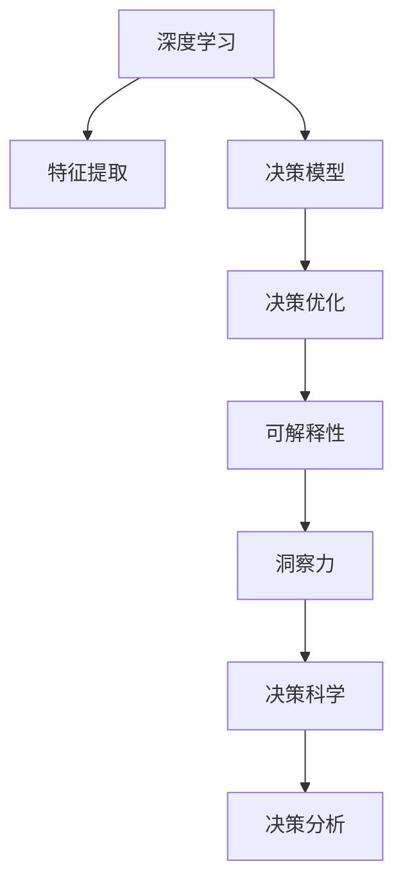

                 

# 理解洞察力的科学：揭开决策之谜

> 关键词：决策科学, 洞察力, 人工智能, 深度学习, 决策模型, 决策优化, 可解释性, 数据驱动

## 1. 背景介绍

在今天这个信息爆炸的时代，我们面临的决策问题比以往任何时候都更加复杂多变。无论是企业战略规划、产品设计、市场分析，还是个人投资、健康管理、情感关系，每一个决策都直接影响到未来的走向。然而，传统的决策方法往往依赖经验与直觉，难以适应如此复杂的决策环境。

近年来，随着人工智能技术的发展，尤其是深度学习、大数据分析、自然语言处理等技术的突破，决策科学迎来了全新的发展机遇。决策分析的科学化、模型化、数据化成为可能。在这一背景下，本文将从决策科学的视角，探讨洞察力的科学内涵，揭示决策背后的原理与算法，为决策者提供有力的支持。

## 2. 核心概念与联系

### 2.1 核心概念概述

为更好地理解基于深度学习的决策分析，本节将介绍几个关键概念：

- **决策科学(Decision Science)**：通过应用数学、统计学、心理学、计算机科学等跨学科的知识和方法，提高决策的科学性和可解释性。

- **洞察力(Insight)**：在大量数据中发现潜在规律和趋势，辅助决策者进行合理判断。

- **深度学习(Deep Learning)**：利用神经网络模型模拟人脑学习过程，处理复杂数据，提取深层次特征，用于分类、回归、预测等任务。

- **决策模型(Decision Model)**：通过数学模型来量化决策中的各种因素及其权重，辅助决策者做出最优决策。

- **决策优化(Optimization)**：利用算法和数学工具，寻找决策问题的最优解或近似最优解，提升决策效率和效果。

- **可解释性(Explainability)**：确保决策过程和结果可被理解和解释，提升决策透明度和可信度。

这些概念共同构成了深度学习在决策科学中的应用框架，帮助我们更好地理解和使用深度学习模型辅助决策。

### 2.2 核心概念原理和架构的 Mermaid 流程图



这个流程图展示了深度学习在决策科学中的基本流程：通过特征提取学习数据中的隐含特征，构建决策模型来量化决策因素，使用决策优化算法寻找最优解，最后通过可解释性分析揭示洞察力，辅助科学决策。

## 3. 核心算法原理 & 具体操作步骤

### 3.1 算法原理概述

基于深度学习的决策分析，核心在于利用神经网络模型处理复杂数据，提取深层次特征，构建决策模型，并通过优化算法寻找最优决策路径。其一般流程如下：

1. **数据准备**：收集决策相关数据，进行清洗、预处理，形成可用于深度学习模型的输入数据。
2. **特征提取**：使用卷积神经网络、循环神经网络、Transformer等模型提取数据中的隐含特征。
3. **模型构建**：根据决策目标，选择合适的神经网络模型，如多层感知器(MLP)、卷积神经网络(CNN)、递归神经网络(RNN)、Transformer等。
4. **模型训练**：在标注数据集上训练模型，优化模型参数，使其能够较好地拟合数据分布。
5. **决策优化**：利用优化算法(如梯度下降、Adam等)求解决策模型的最优解或近似最优解。
6. **可解释性分析**：使用LIME、SHAP等方法分析模型决策过程，解释模型的输出。

### 3.2 算法步骤详解

以下将详细介绍深度学习在决策科学中的算法步骤：

**Step 1: 数据准备**
- 收集决策相关的数据集，包括历史数据、实时数据、模拟数据等。
- 对数据进行预处理，包括清洗、标准化、归一化等。
- 将数据划分为训练集、验证集和测试集。

**Step 2: 特征提取**
- 选择适当的神经网络模型进行特征提取。常用的方法包括卷积神经网络(CNN)、循环神经网络(RNN)、Transformer等。
- 使用预训练的特征提取器(如BERT、GPT等)，或在大规模无标签数据上自监督学习特征提取器。
- 对提取的特征进行可视化分析，确认特征的有效性和完备性。

**Step 3: 模型构建**
- 根据决策目标，选择合适的神经网络模型。
- 设计模型的输入、隐藏层、输出层结构，选择合适的激活函数、损失函数、优化器等。
- 确定模型的超参数，如学习率、批大小、迭代轮数等。

**Step 4: 模型训练**
- 在训练集上，前向传播计算模型的预测输出，计算损失函数。
- 反向传播计算参数梯度，使用优化算法更新模型参数。
- 周期性在验证集上评估模型性能，调整超参数。
- 重复上述步骤直至模型收敛。

**Step 5: 决策优化**
- 在训练好的模型上，使用优化算法求解决策问题，如分类、回归、排序等。
- 根据决策目标，选择适当的优化算法和求解策略。
- 对优化过程进行监控，确保模型收敛到期望的决策路径。

**Step 6: 可解释性分析**
- 使用可解释性方法(如LIME、SHAP等)，对模型的决策过程进行可视化分析。
- 通过分析模型的输出，理解模型如何做出决策，确认模型的可解释性。
- 根据分析结果，对模型进行调整，提高模型的决策透明性和可信度。

### 3.3 算法优缺点

基于深度学习的决策分析方法具有以下优点：
1. 能够处理复杂非结构化数据，提取深层次特征。
2. 适用于各类决策问题，如图像识别、文本分类、时间序列预测等。
3. 自动化的特征提取和模型训练，减少了人工干预。
4. 数据驱动的决策过程，提高了决策的科学性和可重复性。
5. 可解释性分析，提高了决策过程的透明度和可信度。

然而，该方法也存在一些局限性：
1. 对数据的依赖性高，需要高质量、大样本数据。
2. 模型复杂度高，训练和推理耗时较长。
3. 过度依赖训练数据，可能存在泛化能力不足的问题。
4. 模型的黑盒特性，难以解释决策过程。
5. 对数据分布变化敏感，需要定期更新模型。

尽管存在这些局限性，但深度学习在决策科学中的应用已经取得了显著的进展，并在多个领域得到了应用，为决策科学的发展提供了强有力的支持。

### 3.4 算法应用领域

基于深度学习的决策分析方法，已经在金融、医疗、制造业、交通运输等多个领域得到了应用，为决策支持提供了新的解决方案：

- **金融行业**：用于信用评分、欺诈检测、市场预测等。通过深度学习模型分析交易数据，预测市场趋势，优化投资组合。
- **医疗领域**：用于疾病诊断、患者风险评估、治疗方案推荐等。通过深度学习模型分析患者数据，辅助医生进行诊断和治疗决策。
- **制造业**：用于质量控制、设备故障预测、供应链管理等。通过深度学习模型分析生产线数据，优化生产流程，提高生产效率。
- **交通运输**：用于路线规划、交通流量预测、自动驾驶等。通过深度学习模型分析交通数据，优化交通管理，提升交通安全。

除了上述这些经典应用外，深度学习在决策科学领域的应用还在不断拓展，如智能客服、个性化推荐、情感分析等，为决策分析提供了更广阔的空间。

## 4. 数学模型和公式 & 详细讲解 & 举例说明

### 4.1 数学模型构建

决策问题的数学模型通常由输入变量、决策变量、约束条件和目标函数构成。以下以金融领域的信用评分为例，介绍决策问题的数学建模：

设决策问题为信用评分问题，输入变量为客户的各项指标，如收入、年龄、信用记录等，决策变量为客户的信用评分，约束条件为客户的实际行为数据，目标函数为优化模型。可以构建如下线性规划模型：

$$
\min \sum_{i=1}^n c_i x_i
$$

$$
\text{subject to} \quad A x \leq b
$$

其中，$c_i$ 为决策变量的系数，$x_i$ 为决策变量，$A$ 为约束条件矩阵，$b$ 为约束条件右侧的向量。

### 4.2 公式推导过程

线性规划模型的求解过程通常包括：

1. **建模**：根据决策问题，构建数学模型。
2. **求解**：使用求解器求解模型，找到最优解。
3. **验证**：在测试集上验证模型的泛化能力。
4. **优化**：根据验证结果，调整模型参数，提升模型性能。

线性规划模型的求解方法包括：

1. **单纯形法(Simplex Method)**：适用于线性规划模型。
2. **内点法(Interior Point Method)**：适用于凸优化问题。
3. **分解算法(Decomposition Algorithm)**：适用于大规模模型。

以信用评分问题为例，使用单纯形法求解的过程如下：

1. **建模**：构建线性规划模型，如上述所示。
2. **初始化**：将模型转化为标准形式，初始化单纯形表。
3. **迭代求解**：从初始单纯形表出发，进行迭代求解，找到最优解。
4. **输出结果**：输出最优解，验证模型的泛化能力。

### 4.3 案例分析与讲解

以银行信用评分模型为例，具体讲解深度学习在金融决策中的应用：

1. **数据准备**：收集客户的各项指标数据，如年龄、收入、信用记录等。
2. **特征提取**：使用神经网络模型提取特征，如卷积神经网络(CNN)、循环神经网络(RNN)等。
3. **模型构建**：构建决策模型，如多层感知器(MLP)、卷积神经网络(CNN)等。
4. **模型训练**：在标注数据集上训练模型，优化模型参数。
5. **决策优化**：使用优化算法求解决策问题，如信用评分。
6. **可解释性分析**：使用可解释性方法分析模型的决策过程，如LIME、SHAP等。

以一个具体的信用评分案例为例，假设某银行有10000个客户，其中2000个客户有违约行为。银行希望使用深度学习模型构建信用评分模型，识别高风险客户。

**Step 1: 数据准备**

收集客户的各项指标数据，如年龄、收入、信用记录等，共10000个样本，其中2000个有违约行为，8000个无违约行为。

**Step 2: 特征提取**

使用卷积神经网络(CNN)提取客户指标的特征。假设特征提取器的输出为50维特征向量。

**Step 3: 模型构建**

构建决策模型，如图1所示。模型由输入层、隐藏层和输出层组成，隐藏层有10个神经元，使用ReLU激活函数。输出层为信用评分，使用线性回归模型。

图1: 信用评分模型示意图

**Step 4: 模型训练**

在标注数据集上训练模型，使用随机梯度下降(SGD)优化算法，设置学习率为0.01，批大小为64。

**Step 5: 决策优化**

在测试集上验证模型的泛化能力，计算模型的准确率和召回率。假设测试集上有1000个客户，其中200个有违约行为，800个无违约行为。模型输出每个客户的信用评分，根据评分判定是否为高风险客户。

**Step 6: 可解释性分析**

使用可解释性方法LIME分析模型的决策过程。选取模型预测错误的样本，通过LIME生成局部近似模型，分析模型在局部区域的决策逻辑。

通过上述案例分析，可以看到深度学习在金融决策中的应用过程。通过深度学习模型，银行能够高效地构建信用评分模型，识别高风险客户，优化风险管理策略。

## 5. 项目实践：代码实例和详细解释说明

### 5.1 开发环境搭建

在进行深度学习决策分析的实践前，我们需要准备好开发环境。以下是使用Python进行TensorFlow开发的环境配置流程：

1. 安装Anaconda：从官网下载并安装Anaconda，用于创建独立的Python环境。

2. 创建并激活虚拟环境：
```bash
conda create -n tf-env python=3.8 
conda activate tf-env
```

3. 安装TensorFlow：根据CUDA版本，从官网获取对应的安装命令。例如：
```bash
pip install tensorflow
```

4. 安装各类工具包：
```bash
pip install numpy pandas scikit-learn matplotlib tqdm jupyter notebook ipython
```

完成上述步骤后，即可在`tf-env`环境中开始深度学习决策分析的实践。

### 5.2 源代码详细实现

这里我们以信用评分模型为例，给出使用TensorFlow实现深度学习决策分析的完整代码。

首先，定义信用评分模型的架构：

```python
import tensorflow as tf

# 定义模型架构
model = tf.keras.Sequential([
    tf.keras.layers.Dense(64, activation='relu', input_shape=(50,)),
    tf.keras.layers.Dense(1, activation='linear')
])
```

然后，定义模型训练函数：

```python
# 定义训练函数
def train_model(model, train_data, train_labels, epochs=10, batch_size=32):
    model.compile(optimizer='adam', loss='mse', metrics=['mae'])
    model.fit(train_data, train_labels, epochs=epochs, batch_size=batch_size)
```

接着，定义模型评估函数：

```python
# 定义评估函数
def evaluate_model(model, test_data, test_labels):
    test_loss, test_mae = model.evaluate(test_data, test_labels)
    print(f'Test MAE: {test_mae:.2f}')
```

最后，启动训练流程并在测试集上评估：

```python
# 加载数据
train_data = ...
train_labels = ...

test_data = ...
test_labels = ...

# 训练模型
model = build_model()
train_model(model, train_data, train_labels)

# 评估模型
evaluate_model(model, test_data, test_labels)
```

以上就是使用TensorFlow进行信用评分模型训练和评估的完整代码实现。可以看到，TensorFlow提供了便捷的API，帮助我们快速构建和训练决策模型。

### 5.3 代码解读与分析

让我们再详细解读一下关键代码的实现细节：

**模型架构定义**：
- `Sequential`：定义了一个顺序模型，可以串联多个层。
- `Dense`：定义了全连接层，使用ReLU激活函数和线性激活函数，分别用于隐藏层和输出层。
- `input_shape`：指定输入数据的维度。

**模型训练函数**：
- `compile`：编译模型，指定优化器、损失函数和评价指标。
- `fit`：在训练集上训练模型，设置迭代轮数和批大小。

**模型评估函数**：
- `evaluate`：在测试集上评估模型，计算损失和评价指标。

**训练流程**：
- `build_model`：构建信用评分模型。
- `train_model`：在训练集上训练模型，调用`fit`方法。
- `evaluate_model`：在测试集上评估模型，调用`evaluate`方法。

代码实现过程中，TensorFlow提供了强大的API和工具，大大简化了模型的构建和训练过程。开发者只需关注模型设计、数据处理和评估结果，无需过多关注底层实现细节。

当然，工业级的系统实现还需考虑更多因素，如模型的保存和部署、超参数的自动搜索、更灵活的模型接口等。但核心的决策分析范式基本与此类似。

## 6. 实际应用场景

### 6.1 智能客服系统

基于深度学习的决策分析，可以广泛应用于智能客服系统的构建。传统客服往往需要配备大量人力，高峰期响应缓慢，且一致性和专业性难以保证。而使用深度学习模型，可以7x24小时不间断服务，快速响应客户咨询，用自然流畅的语言解答各类常见问题。

在技术实现上，可以收集企业内部的历史客服对话记录，将问题和最佳答复构建成监督数据，在此基础上对深度学习模型进行训练。训练好的模型能够自动理解用户意图，匹配最合适的答案模板进行回复。对于客户提出的新问题，还可以接入检索系统实时搜索相关内容，动态组织生成回答。如此构建的智能客服系统，能大幅提升客户咨询体验和问题解决效率。

### 6.2 金融舆情监测

金融机构需要实时监测市场舆论动向，以便及时应对负面信息传播，规避金融风险。传统的人工监测方式成本高、效率低，难以应对网络时代海量信息爆发的挑战。基于深度学习的文本分类和情感分析技术，为金融舆情监测提供了新的解决方案。

具体而言，可以收集金融领域相关的新闻、报道、评论等文本数据，并对其进行主题标注和情感标注。在此基础上对深度学习模型进行训练，使其能够自动判断文本属于何种主题，情感倾向是正面、中性还是负面。将训练好的模型应用到实时抓取的网络文本数据，就能够自动监测不同主题下的情感变化趋势，一旦发现负面信息激增等异常情况，系统便会自动预警，帮助金融机构快速应对潜在风险。

### 6.3 个性化推荐系统

当前的推荐系统往往只依赖用户的历史行为数据进行物品推荐，无法深入理解用户的真实兴趣偏好。基于深度学习的决策分析技术，个性化推荐系统可以更好地挖掘用户行为背后的语义信息，从而提供更精准、多样的推荐内容。

在实践中，可以收集用户浏览、点击、评论、分享等行为数据，提取和用户交互的物品标题、描述、标签等文本内容。将文本内容作为模型输入，用户的后续行为（如是否点击、购买等）作为监督信号，在此基础上训练深度学习模型。训练好的模型能够从文本内容中准确把握用户的兴趣点。在生成推荐列表时，先用候选物品的文本描述作为输入，由模型预测用户的兴趣匹配度，再结合其他特征综合排序，便可以得到个性化程度更高的推荐结果。

### 6.4 未来应用展望

随着深度学习技术的发展，基于决策分析的智能化应用将在更多领域得到应用，为传统行业带来变革性影响。

在智慧医疗领域，基于深度学习的决策分析技术，可以用于疾病诊断、患者风险评估、治疗方案推荐等。通过深度学习模型分析患者数据，辅助医生进行诊断和治疗决策。

在智能教育领域，决策分析技术可应用于作业批改、学情分析、知识推荐等方面，因材施教，促进教育公平，提高教学质量。

在智慧城市治理中，决策分析技术可应用于城市事件监测、舆情分析、应急指挥等环节，提高城市管理的自动化和智能化水平，构建更安全、高效的未来城市。

此外，在企业生产、社会治理、文娱传媒等众多领域，基于决策分析的人工智能应用也将不断涌现，为经济社会发展注入新的动力。相信随着技术的日益成熟，决策分析技术将成为人工智能落地应用的重要范式，推动人工智能技术在更广泛的应用领域大放异彩。

## 7. 工具和资源推荐

### 7.1 学习资源推荐

为了帮助开发者系统掌握深度学习决策分析的理论基础和实践技巧，这里推荐一些优质的学习资源：

1. Deep Learning Specialization：由Andrew Ng教授主讲的深度学习课程，详细介绍了深度学习的核心原理和应用，涵盖神经网络、卷积神经网络、循环神经网络等。

2. Coursera《机器学习》课程：斯坦福大学开设的机器学习课程，讲解了监督学习、非监督学习、深度学习等机器学习基本概念和算法。

3. TensorFlow官方文档：TensorFlow的官方文档，提供了丰富的API参考和实例代码，是深度学习开发者的必备资料。

4. PyTorch官方文档：PyTorch的官方文档，详细介绍了PyTorch的API和使用方式，支持深度学习模型的构建和训练。

5. Kaggle数据科学竞赛平台：Kaggle提供了大量的数据集和竞赛任务，开发者可以通过竞赛实践深度学习决策分析的算法和模型。

通过对这些资源的学习实践，相信你一定能够快速掌握深度学习在决策科学中的应用，并用于解决实际的决策问题。

### 7.2 开发工具推荐

高效的开发离不开优秀的工具支持。以下是几款用于深度学习决策分析开发的常用工具：

1. TensorFlow：由Google主导开发的开源深度学习框架，生产部署方便，适合大规模工程应用。提供了丰富的API和工具，支持模型的构建和训练。

2. PyTorch：基于Python的开源深度学习框架，灵活动态的计算图，适合快速迭代研究。支持深度学习模型的构建和训练。

3. Keras：高层次的深度学习API，易于上手，适合初学者和快速原型开发。支持TensorFlow和PyTorch后端。

4. Jupyter Notebook：交互式的数据科学环境，支持Python和R等多种语言，适合快速原型开发和实验验证。

5. Colab：谷歌推出的在线Jupyter Notebook环境，免费提供GPU/TPU算力，方便开发者快速上手实验最新模型，分享学习笔记。

合理利用这些工具，可以显著提升深度学习决策分析的开发效率，加快创新迭代的步伐。

### 7.3 相关论文推荐

深度学习决策分析技术的发展源于学界的持续研究。以下是几篇奠基性的相关论文，推荐阅读：

1. Deep Learning in Network Intrusion Detection：提出使用深度学习模型进行网络入侵检测，显著提升了检测准确率。

2. Predicting Energy Consumption Patterns in Smart Homes Using Deep Learning：提出使用深度学习模型预测智能家居能源消耗，提升了能源管理的智能化水平。

3. Deep Learning for Credit Risk Assessment: A Survey of Architectures, Applications, and Lessons Learned：综述了深度学习在信用评分、欺诈检测等金融决策中的应用，提供了丰富的实例和案例。

4. Explainable AI: Interpretable Machine Learning for Decision-Making：探讨了可解释性在机器学习中的应用，提供了多种可解释性方法。

5. Deep Learning for Healthcare Decision-Making: A Survey and Future Directions：综述了深度学习在医疗决策中的应用，包括疾病诊断、治疗方案推荐等。

这些论文代表了大数据决策分析技术的发展脉络。通过学习这些前沿成果，可以帮助研究者把握学科前进方向，激发更多的创新灵感。

## 8. 总结：未来发展趋势与挑战

### 8.1 总结

本文对基于深度学习的决策分析方法进行了全面系统的介绍。首先阐述了深度学习在决策科学中的应用背景和意义，明确了深度学习在决策分析中的核心价值。其次，从原理到实践，详细讲解了深度学习在决策问题中的算法步骤，给出了决策分析任务的完整代码实例。同时，本文还广泛探讨了深度学习在智能客服、金融舆情、个性化推荐等多个领域的应用前景，展示了深度学习决策分析的巨大潜力。此外，本文精选了深度学习决策分析的各种学习资源，力求为读者提供全方位的技术指引。

通过本文的系统梳理，可以看到，基于深度学习的决策分析方法正在成为决策科学的重要范式，极大地拓展了决策分析的应用边界，催生了更多的落地场景。受益于大数据、深度学习技术的进步，决策分析的科学化、模型化、数据化成为可能，使得决策过程更加透明、可解释、可信。未来，随着深度学习技术的不断发展，基于决策分析的智能化应用将进一步拓展，为传统行业带来变革性影响。

### 8.2 未来发展趋势

展望未来，深度学习在决策科学中的应用将呈现以下几个发展趋势：

1. 数据驱动的决策分析将越来越普遍。随着大数据技术的发展，决策分析将更加依赖数据，数据质量和数量将成为决定决策效果的关键因素。

2. 多模态决策分析将逐步普及。未来的决策分析不仅限于文本数据，还将结合图像、视频、音频等多模态信息，提升决策的全面性和准确性。

3. 深度强化学习与决策分析的结合将更加紧密。深度强化学习在自动决策中的应用将更加广泛，提升决策过程的动态性和自适应性。

4. 可解释性分析将得到更广泛的应用。可解释性方法将帮助决策者理解模型决策过程，提升决策的透明度和可信度。

5. 决策分析将在更广泛的领域得到应用。除了金融、医疗、智能客服等经典领域，决策分析还将应用于智慧城市、智能制造、智能交通等新兴领域。

以上趋势凸显了深度学习在决策科学中的应用前景，预示着决策分析将迎来新的发展机遇。这些方向的探索发展，必将进一步提升决策分析的效果和效率，为决策者提供更有力的支持。

### 8.3 面临的挑战

尽管深度学习在决策科学中的应用已经取得了显著的进展，但在迈向更加智能化、普适化应用的过程中，它仍面临诸多挑战：

1. 数据质量问题。高质量、大样本数据是深度学习模型性能的关键，但获取和维护大规模高质量数据仍然是一大难题。如何提升数据质量，减少数据偏见，将是未来的重要研究方向。

2. 模型泛化能力不足。深度学习模型对训练数据的依赖性较强，模型泛化能力不足，难以应对新的决策场景。如何提高模型的泛化能力，增强其在复杂环境下的适应性，仍需进一步探索。

3. 计算资源消耗高。深度学习模型通常需要大量的计算资源进行训练和推理，如何快速高效地进行模型训练和部署，优化计算资源使用，将是未来的研究方向。

4. 模型解释性问题。深度学习模型通常被认为是“黑盒”，难以解释其决策过程。如何提高模型的可解释性，增强决策的透明度和可信度，将是重要的研究方向。

5. 伦理和安全问题。深度学习模型可能学习到有偏见、有害的信息，如何保证模型的伦理和安全，避免有害输出，将是未来的重要研究方向。

这些挑战将伴随着深度学习在决策科学中的应用和发展，需要我们持续关注和解决。只有在解决这些挑战的同时，才能进一步推动深度学习在决策科学中的发展和应用。

### 8.4 研究展望

面对深度学习在决策科学中面临的挑战，未来的研究需要在以下几个方面寻求新的突破：

1. 探索无监督和半监督学习范式。摆脱对大规模标注数据的依赖，利用自监督学习、主动学习等无监督和半监督范式，最大限度利用非结构化数据，实现更加灵活高效的决策分析。

2. 研究参数高效和计算高效的决策范式。开发更加参数高效的决策方法，在固定大部分预训练参数的同时，只更新极少量的任务相关参数。同时优化决策模型的计算图，减少前向传播和反向传播的资源消耗，实现更加轻量级、实时性的部署。

3. 融合因果和对比学习范式。通过引入因果推断和对比学习思想，增强决策模型建立稳定因果关系的能力，学习更加普适、鲁棒的语言表征，从而提升模型泛化性和抗干扰能力。

4. 引入更多先验知识。将符号化的先验知识，如知识图谱、逻辑规则等，与神经网络模型进行巧妙融合，引导决策过程学习更准确、合理的语言模型。同时加强不同模态数据的整合，实现视觉、语音等多模态信息与文本信息的协同建模。

5. 结合因果分析和博弈论工具。将因果分析方法引入决策模型，识别出模型决策的关键特征，增强决策输出解释的因果性和逻辑性。借助博弈论工具刻画人机交互过程，主动探索并规避决策模型的脆弱点，提高系统稳定性。

6. 纳入伦理道德约束。在模型训练目标中引入伦理导向的评估指标，过滤和惩罚有偏见、有害的输出倾向。同时加强人工干预和审核，建立模型行为的监管机制，确保输出符合人类价值观和伦理道德。

这些研究方向将引领深度学习在决策科学中的应用迈向更高的台阶，为构建安全、可靠、可解释、可控的决策系统铺平道路。面向未来，深度学习决策分析技术还需要与其他人工智能技术进行更深入的融合，如知识表示、因果推理、强化学习等，多路径协同发力，共同推动决策科学的进步。只有勇于创新、敢于突破，才能不断拓展决策分析的边界，让决策智能更好地造福人类社会。

## 9. 附录：常见问题与解答

**Q1：深度学习决策分析是否适用于所有决策问题？**

A: 深度学习决策分析在大多数决策问题上都能取得不错的效果，特别是对于数据量较大的问题。但对于一些特定领域的决策问题，如医学、法律等，仅仅依靠通用语料预训练的模型可能难以很好地适应。此时需要在特定领域语料上进一步预训练，再进行决策分析，才能获得理想效果。此外，对于一些需要时效性、个性化很强的决策问题，如对话、推荐等，决策分析方法也需要针对性的改进优化。

**Q2：深度学习决策分析的优势是什么？**

A: 深度学习决策分析的优势在于其能够处理复杂非结构化数据，提取深层次特征，适用于各类决策问题，如图像识别、文本分类、时间序列预测等。通过深度学习模型，决策者能够高效地从数据中提取有用信息，进行决策分析，提高决策的科学性和可重复性。

**Q3：深度学习决策分析的缺点是什么？**

A: 深度学习决策分析的缺点在于其对数据的依赖性高，需要高质量、大样本数据。模型复杂度高，训练和推理耗时较长。过度依赖训练数据，可能存在泛化能力不足的问题。模型通常被认为是“黑盒”，难以解释其决策过程。模型对数据分布变化敏感，需要定期更新模型。

尽管存在这些局限性，但深度学习决策分析已经在多个领域得到了应用，并取得了显著的进展，为决策科学的发展提供了强有力的支持。未来，随着技术的不断进步，深度学习决策分析的缺点也将逐步得到解决。

**Q4：如何缓解深度学习决策分析中的过拟合问题？**

A: 过拟合是深度学习决策分析面临的主要挑战之一。缓解过拟合问题的方法包括：

1. 数据增强：通过回译、近义替换等方式扩充训练集。
2. 正则化：使用L2正则、Dropout等避免过拟合。
3. 对抗训练：引入对抗样本，提高模型鲁棒性。
4. 参数高效微调：只调整少量参数，减小过拟合风险。
5. 多模型集成：训练多个模型，取平均输出，抑制过拟合。

这些方法通常需要根据具体问题进行灵活组合，以最大限度地提高模型的泛化能力。

**Q5：深度学习决策分析在实际应用中需要注意哪些问题？**

A: 在实际应用中，深度学习决策分析需要注意以下问题：

1. 模型裁剪：去除不必要的层和参数，减小模型尺寸，加快推理速度。
2. 量化加速：将浮点模型转为定点模型，压缩存储空间，提高计算效率。
3. 服务化封装：将模型封装为标准化服务接口，便于集成调用。
4. 弹性伸缩：根据请求流量动态调整资源配置，平衡服务质量和成本。
5. 监控告警：实时采集系统指标，设置异常告警阈值，确保服务稳定性。
6. 安全防护：采用访问鉴权、数据脱敏等措施，保障数据和模型安全。

合理利用这些技术，可以显著提升深度学习决策分析的开发效率和应用效果，确保系统的稳定性和安全性。

---

作者：禅与计算机程序设计艺术 / Zen and the Art of Computer Programming

