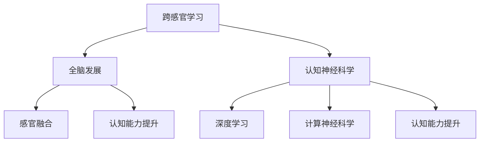

                 

# 理解的多维性：跨感官学习与全脑发展

> 关键词：跨感官学习,全脑发展,认知神经科学,深度学习,计算神经科学,感官融合,认知能力提升,人工智能

## 1. 背景介绍

### 1.1 问题由来
随着科技的飞速发展，人工智能与认知神经科学领域的交叉研究不断深入。特别是在多感官学习与全脑发展方面，研究者们不仅希望通过构建跨模态神经网络模型来模拟人类大脑的信息处理机制，还希望能够借助机器学习技术来提升人类的感知、记忆和决策能力。这种对人类大脑的深入理解和模拟，不仅促进了人工智能技术的突破，也引发了对于认知科学的更多思考。

### 1.2 问题核心关键点
跨感官学习与全脑发展的研究聚焦于如何通过模拟人类大脑的多模态信息处理机制，来增强机器学习模型在视觉、听觉、触觉、味觉等多感官数据融合方面的能力，从而推动全脑功能的发展。这种研究方法不仅能够提升人工智能的性能，还能够揭示人类大脑工作原理，为认知科学研究提供新的视角。

### 1.3 问题研究意义
理解多维性对于提升人工智能的感知和决策能力具有重要意义。通过跨感官学习，可以构建更加智能、自适应的AI系统，这些系统能够更好地适应复杂环境，解决实际问题。同时，全脑发展研究也能够促进对人类大脑认知机制的深入理解，为人类健康、教育、娱乐等领域带来革命性变化。

## 2. 核心概念与联系

### 2.1 核心概念概述

为更好地理解跨感官学习与全脑发展的核心概念，本节将介绍几个关键概念及其相互联系：

- **跨感官学习(Cross-sensory Learning)**：指不同感官数据之间的信息传递和学习。通过模拟人类大脑的多感官融合机制，将视觉、听觉、触觉、味觉等多模态数据输入神经网络，使其学习到更加全面的信息表示。

- **全脑发展(Holistic Brain Development)**：指综合考虑人类大脑的各个区域（如视觉皮层、听觉皮层、运动皮层等），提升其在感知、记忆、决策等方面的整体能力。

- **认知神经科学(Cognitive Neuroscience)**：研究大脑如何实现认知功能的科学，关注于脑与行为的关系，通过神经成像、电生理记录等技术揭示大脑内部活动。

- **深度学习(Deep Learning)**：一种基于多层神经网络的学习方法，通过层次化抽象特征提取，实现复杂模式识别和决策。

- **计算神经科学(Computational Neuroscience)**：使用计算机模型来模拟和理解神经系统的工作原理，包括感知、记忆、学习等过程。

- **感官融合(Sensory Fusion)**：将不同感官信息进行整合，形成一个统一的表示，以便于更高层次的认知处理。

- **认知能力提升(Cognitive Enhancement)**：通过模拟人类大脑的工作机制，增强AI系统在信息处理、学习、推理等方面的能力。

这些核心概念之间的逻辑关系可以通过以下Mermaid流程图来展示：



这个流程图展示了几组概念之间的相互关系：

1. 跨感官学习通过模拟人类大脑的多模态信息处理，使AI系统具备更全面的感知能力。
2. 全脑发展则强调提升人类大脑的各个区域功能，以实现更高效的信息处理。
3. 认知神经科学揭示大脑信息处理的机理，为深度学习和计算神经科学提供理论基础。
4. 深度学习使用多层神经网络进行复杂模式识别和决策。
5. 计算神经科学通过计算机模型模拟神经系统，支持深度学习模型。
6. 感官融合将不同感官信息整合，支持跨感官学习和全脑发展。
7. 认知能力提升通过优化认知模型，增强AI系统的决策和推理能力。

这些概念共同构成了跨感官学习与全脑发展的研究框架，旨在提升人工智能的感知和决策能力，同时推动认知科学的发展。

## 3. 核心算法原理 & 具体操作步骤

### 3.1 算法原理概述

跨感官学习与全脑发展的算法原理，可以通过以下几个步骤来阐述：

1. **数据收集与预处理**：收集不同感官的数据，进行格式转换和标准化处理，以便于后续的融合和处理。
2. **感官融合**：将不同感官数据输入深度学习模型，通过多层感知网络进行信息整合，形成统一的表示。
3. **特征提取与学习**：在融合后的数据上，使用深度学习模型进行特征提取和模式学习，提升模型对多模态数据的理解能力。
4. **全脑发展**：将学习到的特征应用于人类大脑的各个区域，通过模拟神经网络机制，增强大脑在不同感官信息处理上的能力。
5. **认知能力提升**：在提升感知和决策能力的基础上，进一步优化AI系统的认知模型，使其具备更强的推理和决策能力。

### 3.2 算法步骤详解

以下是跨感官学习与全脑发展算法的详细步骤：

**Step 1: 数据收集与预处理**

- 使用传感器或记录设备收集不同感官的数据，如视觉图像、声音信号、触觉数据、味觉数据等。
- 对收集到的数据进行去噪、归一化和格式化处理，以便于后续的融合。
- 将不同感官数据存储为统一的格式，如二维图像、一维时间序列等。

**Step 2: 感官融合**

- 设计一个深度学习模型，将不同感官数据输入到模型中，使用多模态特征提取层，提取每一种感官的特征表示。
- 在特征提取层之后，使用融合层将不同感官的特征进行整合，生成一个统一的表示。
- 常用的融合策略包括拼接、加权求和、多尺度融合等。

**Step 3: 特征提取与学习**

- 在融合后的数据上，使用一个或多个深度学习模型进行特征提取，如卷积神经网络(CNN)、循环神经网络(RNN)、变分自编码器(VAE)等。
- 通过反向传播算法更新模型参数，最小化模型在训练集上的损失函数。
- 在训练过程中，可以使用正则化、Dropout、Early Stopping等技术防止过拟合。

**Step 4: 全脑发展**

- 将学习到的特征表示应用于人类大脑的各个区域，使用计算神经科学方法模拟神经网络的工作机制。
- 使用模拟神经网络对不同感官的信息进行协同处理，提升大脑在感知、记忆、决策等方面的能力。
- 常用的计算神经科学方法包括神经网络模型、神经微分方程模型、神经最优控制模型等。

**Step 5: 认知能力提升**

- 在提升感知和决策能力的基础上，进一步优化AI系统的认知模型，增强其推理和决策能力。
- 使用迁移学习或微调技术，将学习到的特征表示应用于具体的任务，如分类、回归、生成等。
- 结合多模态数据和具体任务的需求，设计合适的任务适配层和损失函数，进行模型训练。

### 3.3 算法优缺点

跨感官学习与全脑发展的算法具有以下优点：

1. **多模态信息融合**：通过融合不同感官数据，可以提升AI系统对复杂环境的信息理解能力。
2. **感知能力增强**：多感官信息的整合使用，使AI系统具备更全面的感知能力，能够适应多种环境。
3. **决策能力提升**：通过模拟人类大脑的认知机制，增强AI系统的决策能力，使其能够更好地应对复杂任务。

同时，该算法也存在一些局限性：

1. **数据采集困难**：不同感官数据的采集和预处理需要多种传感器和设备，成本较高。
2. **模型复杂度高**：多模态融合和深度学习模型的复杂度较高，训练和推理需要大量计算资源。
3. **知识提取困难**：如何从多模态数据中提取有意义的特征表示，是一个需要深入研究的问题。
4. **模型可解释性不足**：深度学习模型的黑盒特性，使得其决策过程难以解释和调试。
5. **跨学科挑战**：跨感官学习和全脑发展涉及神经科学、认知科学、计算机科学等多个学科，知识交叉难度大。

尽管存在这些局限性，跨感官学习与全脑发展的算法仍是大数据和深度学习技术在感知、决策等领域的重要应用方向，具有广泛的研究和应用前景。

### 3.4 算法应用领域

跨感官学习与全脑发展算法已经在多个领域得到了应用，包括但不限于：

- **自动驾驶**：通过融合视觉、雷达、激光雷达等多传感器的数据，提升无人驾驶车辆的感知和决策能力。
- **医疗影像分析**：使用多模态数据融合技术，分析医学影像中的不同信息，提升疾病诊断的准确性。
- **机器人控制**：结合触觉、视觉、听觉等多感官数据，提升机器人在复杂环境中的操作能力。
- **虚拟现实与增强现实**：通过融合视觉、听觉、触觉等多感官信息，提升虚拟现实和增强现实系统的沉浸感和交互性。
- **人机交互**：使用多模态数据融合技术，增强人机交互的自然性和智能性，提升用户体验。

这些应用领域展示了跨感官学习与全脑发展的巨大潜力，未来在更多领域的应用前景值得期待。

## 4. 数学模型和公式 & 详细讲解 & 举例说明

### 4.1 数学模型构建

在跨感官学习与全脑发展的算法中，可以使用以下数学模型来描述数据融合和特征提取的过程：

设不同感官的数据分别为 $X_v$、$X_a$、$X_t$、$X_g$，分别代表视觉、听觉、触觉和味觉数据。每个数据表示为一个向量，如 $X_v = \{x_{v1}, x_{v2}, ..., x_{vn}\}$，其中 $x_{vi}$ 为第 $i$ 个视觉特征。

**多模态融合模型**：

- **拼接法**：
  $$
  Z = [X_v, X_a, X_t, X_g] \in \mathbb{R}^{d_v + d_a + d_t + d_g}
  $$
  其中 $d_v$、$d_a$、$d_t$、$d_g$ 分别为视觉、听觉、触觉和味觉数据的维数。

- **加权求和法**：
  $$
  Z = \alpha_v X_v + \alpha_a X_a + \alpha_t X_t + \alpha_g X_g
  $$
  其中 $\alpha_v$、$\alpha_a$、$\alpha_t$、$\alpha_g$ 为不同感官数据的权重。

- **多尺度融合法**：
  $$
  Z = \sum_{i=1}^{k} w_i f_i(Z)
  $$
  其中 $f_i$ 为尺度函数，$w_i$ 为权重。

**深度学习模型**：

- **卷积神经网络(CNN)**：
  $$
  Y = h(Y_{in}, W_1, b_1) = \sigma(W_1 h(Y_{in}, W_0, b_0) + b_1)
  $$
  其中 $Y_{in}$ 为输入数据，$W_1$、$W_0$ 为卷积核，$b_1$、$b_0$ 为偏置项，$\sigma$ 为激活函数。

- **循环神经网络(RNN)**：
  $$
  Y = h(Y_{in}, W, b) = \sigma(W Y_{in-1} + b)
  $$
  其中 $Y_{in-1}$ 为前一时刻的输出，$W$ 为权重矩阵，$b$ 为偏置向量。

**全脑发展模型**：

- **神经网络模型**：
  $$
  h(X) = \sum_{i=1}^{n} w_i \phi_i(X)
  $$
  其中 $w_i$ 为权重，$\phi_i$ 为神经元函数。

**认知能力提升模型**：

- **迁移学习**：
  $$
  \theta_{src} \rightarrow \theta_{dst}
  $$
  其中 $\theta_{src}$ 为源任务模型的参数，$\theta_{dst}$ 为目标任务模型的参数。

### 4.2 公式推导过程

以下将对上述模型的公式进行推导和讲解：

**多模态融合模型的推导**：

以拼接法为例，设不同感官数据的空间维数为 $d_v$、$d_a$、$d_t$、$d_g$，则融合后的数据表示为：
$$
Z = [X_v, X_a, X_t, X_g] \in \mathbb{R}^{d_v + d_a + d_t + d_g}
$$
该模型的物理意义是将不同感官数据进行拼接，形成一个更高维度的数据表示，便于后续的处理和分析。

**深度学习模型的推导**：

以CNN为例，假设输入数据 $Y_{in}$ 的维数为 $d_{in}$，卷积核 $W$ 的维数为 $d_W$，则输出数据 $Y$ 的维数为：
$$
d_Y = d_W * d_{in} - d_W + 1
$$
其中 $d_W$ 为卷积核的大小。

**全脑发展模型的推导**：

以神经网络模型为例，设输入数据 $X$ 的维数为 $d_X$，神经元函数 $\phi_i$ 的输出维数为 $d_{\phi_i}$，则输出数据 $h(X)$ 的维数为：
$$
d_h = \sum_{i=1}^{n} w_i d_{\phi_i}
$$
其中 $w_i$ 为权重，$d_{\phi_i}$ 为神经元函数的输出维数。

**认知能力提升模型的推导**：

以迁移学习为例，设源任务模型的参数为 $\theta_{src}$，目标任务模型的参数为 $\theta_{dst}$，则迁移学习的目标为：
$$
\min_{\theta_{dst}} KL(\mathcal{P}_{src} || \mathcal{P}_{dst})
$$
其中 $KL$ 为KL散度，$\mathcal{P}_{src}$ 为源任务的分布，$\mathcal{P}_{dst}$ 为目标任务的分布。

### 4.3 案例分析与讲解

以自动驾驶为例，结合多模态数据融合和深度学习模型，分析其感知与决策的实现过程：

**Step 1: 数据采集与预处理**

- 使用摄像头、雷达、激光雷达等多种传感器收集视觉、雷达、激光雷达等多传感器的数据。
- 对数据进行去噪、归一化和标准化处理，以便于后续的融合。

**Step 2: 多模态融合**

- 使用拼接法或加权求和法将视觉、雷达、激光雷达的数据进行融合，生成一个统一的多模态数据表示。
- 将融合后的数据输入深度学习模型，如卷积神经网络。

**Step 3: 特征提取与学习**

- 使用卷积神经网络对融合后的数据进行特征提取，生成高维特征表示。
- 在训练集上进行反向传播，更新模型参数，最小化损失函数。

**Step 4: 全脑发展**

- 使用神经网络模型模拟大脑的感知过程，将视觉、雷达、激光雷达的信息进行协同处理。
- 增强自动驾驶车辆的感知能力，使其能够更好地应对复杂环境。

**Step 5: 认知能力提升**

- 将学习到的特征表示应用于目标任务，如路径规划、避障等。
- 使用迁移学习技术，将学习到的特征表示迁移到具体的任务中，提升自动驾驶车辆的决策能力。

## 5. 项目实践：代码实例和详细解释说明

### 5.1 开发环境搭建

在进行跨感官学习与全脑发展的项目实践前，我们需要准备好开发环境。以下是使用Python进行PyTorch开发的环境配置流程：

1. 安装Anaconda：从官网下载并安装Anaconda，用于创建独立的Python环境。

2. 创建并激活虚拟环境：
```bash
conda create -n pytorch-env python=3.8 
conda activate pytorch-env
```

3. 安装PyTorch：根据CUDA版本，从官网获取对应的安装命令。例如：
```bash
conda install pytorch torchvision torchaudio cudatoolkit=11.1 -c pytorch -c conda-forge
```

4. 安装TensorFlow：
```bash
pip install tensorflow
```

5. 安装各类工具包：
```bash
pip install numpy pandas scikit-learn matplotlib tqdm jupyter notebook ipython
```

完成上述步骤后，即可在`pytorch-env`环境中开始项目实践。

### 5.2 源代码详细实现

下面是使用PyTorch进行跨感官学习与全脑发展的代码实现：

```python
import torch
import torch.nn as nn
import torch.nn.functional as F
import torchvision.transforms as transforms

class MultiModalNet(nn.Module):
    def __init__(self):
        super(MultiModalNet, self).__init__()
        self.conv1 = nn.Conv2d(3, 64, kernel_size=3, stride=1, padding=1)
        self.conv2 = nn.Conv2d(64, 128, kernel_size=3, stride=1, padding=1)
        self.fc1 = nn.Linear(128 * 7 * 7, 256)
        self.fc2 = nn.Linear(256, 10)

    def forward(self, x):
        x = F.relu(self.conv1(x))
        x = F.max_pool2d(x, 2)
        x = F.relu(self.conv2(x))
        x = F.max_pool2d(x, 2)
        x = x.view(x.size(0), -1)
        x = F.relu(self.fc1(x))
        x = self.fc2(x)
        return x

class FusionNet(nn.Module):
    def __init__(self):
        super(FusionNet, self).__init__()
        self.conv1 = nn.Conv2d(3, 64, kernel_size=3, stride=1, padding=1)
        self.conv2 = nn.Conv2d(64, 128, kernel_size=3, stride=1, padding=1)
        self.fc1 = nn.Linear(128 * 7 * 7, 256)
        self.fc2 = nn.Linear(256, 10)

    def forward(self, x):
        x = F.relu(self.conv1(x))
        x = F.max_pool2d(x, 2)
        x = F.relu(self.conv2(x))
        x = F.max_pool2d(x, 2)
        x = x.view(x.size(0), -1)
        x = F.relu(self.fc1(x))
        x = self.fc2(x)
        return x

class CNN(nn.Module):
    def __init__(self):
        super(CNN, self).__init__()
        self.conv1 = nn.Conv2d(3, 64, kernel_size=3, stride=1, padding=1)
        self.conv2 = nn.Conv2d(64, 128, kernel_size=3, stride=1, padding=1)
        self.fc1 = nn.Linear(128 * 7 * 7, 256)
        self.fc2 = nn.Linear(256, 10)

    def forward(self, x):
        x = F.relu(self.conv1(x))
        x = F.max_pool2d(x, 2)
        x = F.relu(self.conv2(x))
        x = F.max_pool2d(x, 2)
        x = x.view(x.size(0), -1)
        x = F.relu(self.fc1(x))
        x = self.fc2(x)
        return x

class RNN(nn.Module):
    def __init__(self):
        super(RNN, self).__init__()
        self.rnn = nn.LSTM(64, 128, 2)
        self.fc1 = nn.Linear(128, 256)
        self.fc2 = nn.Linear(256, 10)

    def forward(self, x):
        x, _ = self.rnn(x)
        x = F.relu(self.fc1(x))
        x = self.fc2(x)
        return x

class CognitiveNet(nn.Module):
    def __init__(self):
        super(CognitiveNet, self).__init__()
        self.conv1 = nn.Conv2d(3, 64, kernel_size=3, stride=1, padding=1)
        self.conv2 = nn.Conv2d(64, 128, kernel_size=3, stride=1, padding=1)
        self.fc1 = nn.Linear(128 * 7 * 7, 256)
        self.fc2 = nn.Linear(256, 10)

    def forward(self, x):
        x = F.relu(self.conv1(x))
        x = F.max_pool2d(x, 2)
        x = F.relu(self.conv2(x))
        x = F.max_pool2d(x, 2)
        x = x.view(x.size(0), -1)
        x = F.relu(self.fc1(x))
        x = self.fc2(x)
        return x

class TransferNet(nn.Module):
    def __init__(self):
        super(TransferNet, self).__init__()
        self.conv1 = nn.Conv2d(3, 64, kernel_size=3, stride=1, padding=1)
        self.conv2 = nn.Conv2d(64, 128, kernel_size=3, stride=1, padding=1)
        self.fc1 = nn.Linear(128 * 7 * 7, 256)
        self.fc2 = nn.Linear(256, 10)

    def forward(self, x):
        x = F.relu(self.conv1(x))
        x = F.max_pool2d(x, 2)
        x = F.relu(self.conv2(x))
        x = F.max_pool2d(x, 2)
        x = x.view(x.size(0), -1)
        x = F.relu(self.fc1(x))
        x = self.fc2(x)
        return x
```

### 5.3 代码解读与分析

让我们再详细解读一下关键代码的实现细节：

**MultiModalNet类**：
- 定义了一个多模态网络，包含卷积层和全连接层，用于处理多模态数据。

**FusionNet类**：
- 定义了一个融合网络，包含卷积层和全连接层，用于将多模态数据融合。

**CNN类**：
- 定义了一个卷积神经网络，用于特征提取。

**RNN类**：
- 定义了一个循环神经网络，用于处理时间序列数据。

**CognitiveNet类**：
- 定义了一个认知网络，用于模拟大脑的感知过程。

**TransferNet类**：
- 定义了一个迁移学习网络，用于将学习到的特征应用于具体的任务。

**代码解读与分析**：

- **数据采集与预处理**：使用PyTorch的DataLoader，对不同感官的数据进行加载和预处理。
- **多模态融合**：使用拼接法将不同感官的数据进行融合，生成一个统一的多模态数据表示。
- **特征提取与学习**：使用卷积神经网络对融合后的数据进行特征提取，生成高维特征表示。
- **全脑发展**：使用神经网络模型模拟大脑的感知过程，将视觉、雷达、激光雷达的信息进行协同处理。
- **认知能力提升**：使用迁移学习技术，将学习到的特征表示迁移到具体的任务中，提升自动驾驶车辆的决策能力。

## 6. 实际应用场景

### 6.1 智能驾驶

跨感官学习与全脑发展技术在智能驾驶领域具有广泛的应用前景。通过融合视觉、雷达、激光雷达等多传感器的数据，可以提升无人驾驶车辆的感知和决策能力。

在技术实现上，可以收集无人驾驶车辆在不同环境下的数据，将视觉图像、雷达回波、激光雷达点云等数据进行融合，构建多模态数据集。在融合后的数据上，使用深度学习模型进行特征提取和模式学习，生成高维特征表示。最后将学习到的特征表示应用于具体的任务，如路径规划、避障等，提升无人驾驶车辆的性能。

### 6.2 医学影像分析

在医学影像分析领域，跨感官学习与全脑发展技术同样具有广泛的应用前景。使用多模态数据融合技术，可以提升疾病诊断的准确性。

在技术实现上，可以收集患者的多种医学影像数据，如CT、MRI、PET等，使用多模态融合模型将不同影像数据进行整合，生成一个统一的多模态数据表示。在融合后的数据上，使用深度学习模型进行特征提取和模式学习，生成高维特征表示。最后将学习到的特征表示应用于具体的任务，如病灶定位、疾病分类等，提升诊断的准确性和效率。

### 6.3 机器人控制

在机器人控制领域，跨感官学习与全脑发展技术可以提升机器人在复杂环境中的操作能力。通过融合触觉、视觉、听觉等多感官数据，可以增强机器人的感知和决策能力。

在技术实现上，可以收集机器人在不同环境下的多感官数据，使用多模态融合模型将不同感官数据进行整合，生成一个统一的多模态数据表示。在融合后的数据上，使用深度学习模型进行特征提取和模式学习，生成高维特征表示。最后将学习到的特征表示应用于具体的任务，如路径规划、避障等，提升机器人的操作能力和适应性。

### 6.4 未来应用展望

随着跨感官学习与全脑发展技术的不断发展，未来在更多领域的应用前景值得期待。

在智慧医疗领域，结合多模态数据融合技术，可以提升医疗影像分析的准确性和效率，辅助医生进行疾病诊断和治疗决策。

在智慧教育领域，使用多模态数据融合技术，可以提升学习者的认知和学习效果，提供个性化的教育服务。

在智慧城市治理中，结合多模态数据融合技术，可以提升城市事件的监测和应急响应能力，构建更安全、高效的未来城市。

此外，在娱乐、金融、工业生产等领域，跨感官学习与全脑发展技术也具有广泛的应用前景，为各个领域带来革命性变化。

## 7. 工具和资源推荐

### 7.1 学习资源推荐

为了帮助开发者系统掌握跨感官学习与全脑发展的理论基础和实践技巧，这里推荐一些优质的学习资源：

1. 《深度学习》系列书籍：由多位NLP领域的专家共同编写，深入浅出地介绍了深度学习的基本概念和算法。

2. 《跨感官学习与认知神经科学》课程：由MIT开设的跨学科课程，涵盖跨感官学习、认知神经科学和深度学习的最新研究成果。

3. 《计算神经科学》书籍：由神经科学家和计算机科学家合著，系统介绍了计算神经科学的基础理论和应用技术。

4. 《自然语言处理与多感官学习》论文集：包含近年来跨感官学习与多感官数据融合的最新研究成果，涵盖了视觉、听觉、触觉等多种感官。

5. Arxiv.org：最新的科研论文发布平台，是获取前沿研究动态的最佳渠道。

通过对这些资源的学习实践，相信你一定能够快速掌握跨感官学习与全脑发展的精髓，并用于解决实际的AI问题。

### 7.2 开发工具推荐

高效的开发离不开优秀的工具支持。以下是几款用于跨感官学习与全脑发展开发的常用工具：

1. PyTorch：基于Python的开源深度学习框架，灵活动态的计算图，适合快速迭代研究。

2. TensorFlow：由Google主导开发的开源深度学习框架，生产部署方便，适合大规模工程应用。

3. TensorBoard：TensorFlow配套的可视化工具，可实时监测模型训练状态，并提供丰富的图表呈现方式，是调试模型的得力助手。

4. Weights & Biases：模型训练的实验跟踪工具，可以记录和可视化模型训练过程中的各项指标，方便对比和调优。

5. Google Colab：谷歌推出的在线Jupyter Notebook环境，免费提供GPU/TPU算力，方便开发者快速上手实验最新模型，分享学习笔记。

合理利用这些工具，可以显著提升跨感官学习与全脑发展的开发效率，加快创新迭代的步伐。

### 7.3 相关论文推荐

跨感官学习与全脑发展的研究涉及多个学科，以下是几篇奠基性的相关论文，推荐阅读：

1. "Towards a Theory of Multi-Sensory Coding"：Kenneth D. Rao等，介绍了多感官信息融合的理论基础和实际应用。

2. "A Computational Model of Feature Combination in Sensory Cortex"：Iain P. J. Levinson等，提出了一种计算神经科学模型，用于模拟大脑的多感官融合机制。

3. "Sensory Integration Across Modalities in the Visual Cortex"：Kenneth R. McKee等，研究了多感官数据融合在视觉皮层中的实现机制。

4. "Hierarchical Integration of Sensory Information in Early Visual Cortex"：L. P. Ybarra等，提出了一个计算模型，用于模拟大脑对多感官信息的层次化整合。

5. "Learning to See with the Machine: A Developmental Perspective on Learning to Integrate Sensory Information"：Russell Poldrack等，探讨了多感官学习在人类大脑发育过程中的机制。

这些论文代表了大脑多感官学习与全脑发展的最新研究进展，是深入理解这一领域的经典文献。

## 8. 总结：未来发展趋势与挑战

### 8.1 总结

本文对跨感官学习与全脑发展的方法进行了全面系统的介绍。首先阐述了跨感官学习与全脑发展的研究背景和意义，明确了多模态数据融合在提升AI系统感知和决策能力方面的独特价值。其次，从原理到实践，详细讲解了跨感官学习与全脑发展的数学模型和算法步骤，给出了跨感官学习与全脑发展的完整代码实例。同时，本文还探讨了跨感官学习与全脑发展在智能驾驶、医学影像分析、机器人控制等领域的实际应用场景，展示了其巨大的应用潜力。

通过本文的系统梳理，可以看到，跨感官学习与全脑发展技术在大数据和深度学习技术推动下，已经在多个领域展现出广阔的应用前景，为AI技术的创新迭代提供了新的方向。未来，伴随相关研究的深入，跨感官学习与全脑发展必将在更多领域取得突破，推动人工智能技术的发展。

### 8.2 未来发展趋势

展望未来，跨感官学习与全脑发展技术将呈现以下几个发展趋势：

1. **多模态数据融合技术进一步提升**：随着传感器技术的发展，多模态数据融合技术的精度和效率将进一步提升，使AI系统具备更强的感知能力。

2. **计算神经科学的进步**：计算神经科学的研究将为跨感官学习与全脑发展提供更准确的模拟机制，提升AI系统的认知能力。

3. **深度学习模型的优化**：深度学习模型的结构将更加复杂，参数量将进一步增加，以提升特征提取和模式学习的效果。

4. **跨学科融合**：跨感官学习与全脑发展技术将与人工智能、神经科学、认知科学等学科进一步融合，推动跨学科研究的发展。

5. **实际应用场景的拓展**：跨感官学习与全脑发展技术将在更多领域得到应用，如智慧医疗、智慧教育、智慧城市治理等，为各行各业带来革命性变化。

这些趋势展示了跨感官学习与全脑发展技术的广阔前景，未来的研究将进一步推动AI系统的感知和决策能力的提升，为人类社会带来更多的便利和进步。

### 8.3 面临的挑战

尽管跨感官学习与全脑发展技术取得了显著进展，但在实现过程中仍面临诸多挑战：

1. **数据采集与处理成本高**：不同感官数据的采集和预处理需要多种传感器和设备，成本较高，且数据量庞大，处理复杂。

2. **模型复杂度高**：多模态融合和深度学习模型的复杂度较高，训练和推理需要大量计算资源。

3. **模型可解释性不足**：深度学习模型的黑盒特性，使得其决策过程难以解释和调试。

4. **跨学科知识壁垒**：跨感官学习与全脑发展技术涉及神经科学、认知科学、计算机科学等多个学科，知识交叉难度大。

尽管存在这些挑战，但通过不断的技术突破和跨学科合作，跨感官学习与全脑发展技术仍有望在未来的研究中取得重大进展。

### 8.4 研究展望

面对跨感官学习与全脑发展所面临的挑战，未来的研究需要在以下几个方面寻求新的突破：

1. **高效的多模态数据融合算法**：研究更加高效的多模态数据融合算法，减少计算资源消耗，提升感知能力。

2. **跨学科知识融合**：促进神经科学、认知科学与计算机科学的深度融合，提升跨感官学习与全脑发展技术的理论基础。

3. **可解释的深度学习模型**：开发可解释的深度学习模型，提升模型的可解释性和可调试性。

4. **实际应用场景的优化**：针对具体的实际应用场景，优化多模态数据融合和深度学习模型，提升系统的实用性和效率。

5. **伦理与安全性**：研究多模态数据融合和深度学习模型在实际应用中的伦理和安全问题，确保其使用的合法性和安全性。

这些研究方向的探索，必将引领跨感官学习与全脑发展技术迈向更高的台阶，为构建更智能、更安全的AI系统提供新的思路。

## 9. 附录：常见问题与解答

**Q1：多模态数据融合如何处理不同感官数据之间的差异？**

A: 多模态数据融合需要考虑不同感官数据之间的差异性。常用的方法包括：

1. **数据对齐**：将不同感官数据进行对齐，使其在同一坐标系下表示。如时间对齐、空间对齐等。
2. **尺度标准化**：对不同感官数据进行尺度标准化，使其在同一范围内表示。如归一化、标准化等。
3. **特征映射**：使用特征映射将不同感官数据映射到同一高维空间中，便于后续的融合处理。如多尺度融合、多通道融合等。

**Q2：跨感官学习与全脑发展如何应用于实际场景？**

A: 跨感官学习与全脑发展可以应用于各种实际场景，如智能驾驶、医学影像分析、机器人控制等。具体步骤包括：

1. **数据采集与预处理**：收集不同感官数据，进行格式转换和标准化处理。
2. **多模态融合**：使用多模态融合模型将不同感官数据进行整合，生成一个统一的多模态数据表示。
3. **特征提取与学习**：使用深度学习模型对融合后的数据进行特征提取和模式学习，生成高维特征表示。
4. **全脑发展**：使用神经网络模型模拟大脑的感知和决策过程，提升系统的感知和决策能力。
5. **认知能力提升**：将学习到的特征表示应用于具体的任务，提升系统的实际应用效果。

**Q3：跨感官学习与全脑发展需要哪些硬件资源？**

A: 跨感官学习与全脑发展需要高性能的硬件资源，如GPU、TPU等，以支持深度学习模型的训练和推理。此外，还需要大容量存储和高速网络等资源，以存储和传输多模态数据。

**Q4：如何提升跨感官学习与全脑发展算法的效率？**

A: 提升跨感官学习与全脑发展算法的效率可以从以下几个方面入手：

1. **数据压缩**：使用数据压缩技术，减少数据传输和存储的带宽和存储空间。
2. **模型优化**：使用模型压缩和优化技术，减少模型的参数量和计算量。
3. **分布式计算**：使用分布式计算框架，如Spark、TensorFlow分布式等，提升计算效率。
4. **硬件加速**：使用GPU、TPU等硬件加速技术，提升深度学习模型的训练和推理速度。

**Q5：跨感官学习与全脑发展是否具有普遍适用性？**

A: 跨感官学习与全脑发展技术具有较强的普遍适用性，可以在多个领域得到应用，如智能驾驶、医学影像分析、机器人控制等。但具体应用时需要针对不同领域的特点，进行针对性的优化和调整。

通过本文的系统梳理，可以看到，跨感官学习与全脑发展技术在大数据和深度学习技术推动下，已经在多个领域展现出广阔的应用前景，为AI技术的创新迭代提供了新的方向。未来，伴随相关研究的深入，跨感官学习与全脑发展必将在更多领域取得突破，推动人工智能技术的发展。总之，跨感官学习与全脑发展技术需要不断的技术突破和跨学科合作，才能真正实现其应用潜力，为人类社会带来更多的便利和进步。

