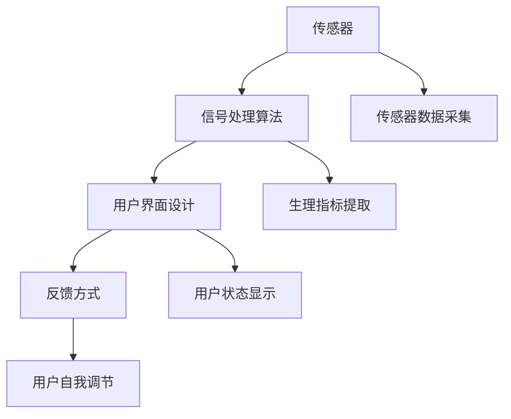

                 

# 生物反馈创业：身心健康的科技解决方案

## 1. 背景介绍

### 1.1 问题由来

在现代社会中，随着工作节奏的加快和生活压力的增大，越来越多的人遭受着身心健康的困扰。根据世界卫生组织的调查，全球约有1/3的人口患有各种心理疾病，包括抑郁症、焦虑症、失眠等。这些健康问题不仅影响个人的幸福感和生活质量，还对社会生产力造成了巨大的损失。

为了应对这一挑战，生物反馈技术应运而生。生物反馈（Biofeedback）是一种通过传感器监测和调整身体生物信号，帮助用户改善身心健康的技术。它利用现代科技手段，将复杂的生理指标转化为可视化的数据，让用户通过观察和控制这些数据，实现自我调节，从而达到身心健康的目的。

生物反馈技术的核心是传感器和反馈系统。传感器通过采集用户的生理信号（如心电、皮肤电导、肌电等），然后将数据传输给反馈系统。反馈系统通过算法分析这些数据，实时显示用户当前的状态，并给出具体的反馈意见，指导用户进行自我调节。

### 1.2 问题核心关键点

生物反馈技术的关键点包括：

- 传感器技术：生物反馈的实现需要高精度的传感器，能够实时、准确地采集用户的生理信号。
- 信号处理算法：信号处理算法需要从传感器采集的数据中提取出有用的生理指标，并进行分析。
- 用户界面设计：用户界面需要直观、易用，让用户能够清晰地理解自己的生理状态，并根据反馈进行自我调节。
- 反馈方式：反馈方式需要灵活多样，既可以通过视觉、听觉等感官方式，也可以通过触觉反馈，让用户有更强的互动体验。
- 应用场景：生物反馈技术可以应用于多个领域，如心理健康、体育训练、亚健康管理等，帮助用户提高生活质量。

## 2. 核心概念与联系

### 2.1 核心概念概述

生物反馈技术涉及多个核心概念，这些概念之间存在紧密的联系。以下是这些核心概念的概述：

- **传感器技术**：传感器是生物反馈系统的核心部件，负责采集用户的生理信号。常见的传感器包括心电传感器、皮肤电导传感器、肌电传感器等。
- **信号处理算法**：信号处理算法通过分析传感器采集的数据，提取出有用的生理指标，如心率、皮肤电导、肌电等。这些指标可以帮助用户了解自身的生理状态，并指导其进行自我调节。
- **用户界面设计**：用户界面是生物反馈系统与用户互动的重要环节。界面设计需要直观、易用，以便用户能够清晰地理解自己的生理状态，并根据反馈进行自我调节。
- **反馈方式**：反馈方式包括视觉、听觉、触觉等感官方式。多样化的反馈方式可以提高用户的互动体验，增强系统的可用性。
- **应用场景**：生物反馈技术可以应用于多个领域，如心理健康、体育训练、亚健康管理等，帮助用户提高生活质量。

这些核心概念通过传感器、信号处理、用户界面和反馈系统等环节，共同构成了生物反馈系统的基本框架。

### 2.2 核心概念原理和架构的 Mermaid 流程图



## 3. 核心算法原理 & 具体操作步骤

### 3.1 算法原理概述

生物反馈系统的核心算法主要包括以下几个步骤：

1. **传感器数据采集**：传感器采集用户的生理信号，如心电、皮肤电导、肌电等。
2. **信号处理**：信号处理算法从传感器采集的数据中提取出有用的生理指标，如心率、皮肤电导、肌电等。
3. **状态分析**：反馈系统对生理指标进行分析，判断用户的当前状态。
4. **反馈输出**：反馈系统根据分析结果，给出具体的反馈意见，指导用户进行自我调节。

### 3.2 算法步骤详解

#### 3.2.1 传感器数据采集

传感器是生物反馈系统的核心部件，负责采集用户的生理信号。常见的传感器包括心电传感器、皮肤电导传感器、肌电传感器等。

传感器数据采集过程包括以下步骤：

1. **设备安装**：将传感器设备安装到用户的合适位置，如胸部、手指、手臂等。
2. **数据采集**：传感器开始采集生理信号，通常采用连续采集的方式，以便获得更准确的数据。

#### 3.2.2 信号处理

信号处理算法是生物反馈系统的关键部分，它从传感器采集的数据中提取出有用的生理指标，如心率、皮肤电导、肌电等。

信号处理算法包括以下几个步骤：

1. **数据预处理**：对传感器采集的数据进行预处理，如滤波、归一化等，以去除噪声和异常值。
2. **特征提取**：从预处理后的数据中提取有用的生理指标，如心率、皮肤电导、肌电等。常见的特征提取方法包括小波变换、傅里叶变换、时域分析等。
3. **状态判断**：根据提取出的生理指标，判断用户的当前状态。例如，可以通过心率判断用户的紧张程度，通过皮肤电导判断用户的汗腺反应等。

#### 3.2.3 状态分析

反馈系统对生理指标进行分析，判断用户的当前状态。状态分析算法通常采用机器学习的方法，如支持向量机、神经网络等。

状态分析过程包括以下步骤：

1. **数据集准备**：准备包含生理指标和用户状态的训练数据集。
2. **模型训练**：使用机器学习算法训练状态分析模型，如支持向量机、神经网络等。
3. **状态预测**：将用户的生理指标输入到训练好的模型中，预测用户的当前状态。

#### 3.2.4 反馈输出

反馈系统根据分析结果，给出具体的反馈意见，指导用户进行自我调节。反馈输出通常采用视觉、听觉、触觉等感官方式。

反馈输出过程包括以下步骤：

1. **状态显示**：将用户的当前状态显示在用户界面上，例如心率、皮肤电导、肌电等指标。
2. **反馈指导**：根据用户的当前状态，给出具体的反馈意见，例如深呼吸、放松肌肉等。
3. **用户调节**：用户根据反馈意见进行自我调节，如深呼吸、放松肌肉等。

### 3.3 算法优缺点

#### 3.3.1 优点

生物反馈技术具有以下优点：

- **实时监测**：生物反馈系统能够实时监测用户的生理状态，及时发现问题。
- **个性化调节**：生物反馈系统根据用户的生理指标，给出个性化的反馈意见，帮助用户进行自我调节。
- **非侵入性**：生物反馈系统采用非侵入性方式监测生理信号，避免了传统医疗手段的创伤和风险。
- **多应用场景**：生物反馈技术可以应用于多个领域，如心理健康、体育训练、亚健康管理等。

#### 3.3.2 缺点

生物反馈技术也存在以下缺点：

- **设备成本高**：生物反馈系统通常需要高精度的传感器设备，成本较高。
- **用户接受度低**：部分用户对生物反馈技术持怀疑态度，不愿意接受监测和反馈。
- **数据隐私问题**：生物反馈系统采集的生理数据涉及个人隐私，存在数据泄露和滥用的风险。
- **技术门槛高**：生物反馈系统的开发需要较高的技术门槛，包括传感器技术、信号处理算法、用户界面设计等。

### 3.4 算法应用领域

生物反馈技术可以应用于多个领域，包括但不限于：

- **心理健康**：帮助用户缓解压力、焦虑等心理问题，提高心理健康水平。
- **体育训练**：帮助运动员提高训练效果，增强体质，预防运动损伤。
- **亚健康管理**：帮助用户改善亚健康状态，提高生活质量。
- **疾病预防**：通过监测生理信号，早期发现潜在健康问题，及时干预。

## 4. 数学模型和公式 & 详细讲解

### 4.1 数学模型构建

生物反馈系统的数学模型包括以下几个部分：

1. **传感器数据采集模型**：描述传感器采集生理信号的过程，通常采用时间序列模型。
2. **信号处理模型**：描述信号处理算法从传感器数据中提取生理指标的过程，通常采用特征提取算法。
3. **状态分析模型**：描述反馈系统对生理指标进行分析的过程，通常采用机器学习算法。
4. **反馈输出模型**：描述反馈系统根据状态分析结果给出反馈意见的过程，通常采用控制算法。

### 4.2 公式推导过程

#### 4.2.1 传感器数据采集模型

传感器数据采集模型可以表示为：

$$
y_t = f(x_t, \theta)
$$

其中，$y_t$ 表示传感器在时间$t$采集到的生理信号，$x_t$ 表示传感器在时间$t$的输入信号，$\theta$ 表示传感器的参数。

#### 4.2.2 信号处理模型

信号处理模型可以表示为：

$$
z_t = g(y_t, \phi)
$$

其中，$z_t$ 表示时间$t$提取出的生理指标，$y_t$ 表示时间$t$采集到的生理信号，$\phi$ 表示信号处理算法的参数。

#### 4.2.3 状态分析模型

状态分析模型可以表示为：

$$
c_t = h(z_t, \psi)
$$

其中，$c_t$ 表示时间$t$的用户状态，$z_t$ 表示时间$t$提取出的生理指标，$\psi$ 表示状态分析算法的参数。

#### 4.2.4 反馈输出模型

反馈输出模型可以表示为：

$$
u_t = k(c_t)
$$

其中，$u_t$ 表示时间$t$的反馈意见，$c_t$ 表示时间$t$的用户状态，$k$ 表示反馈算法的参数。

### 4.3 案例分析与讲解

#### 4.3.1 案例一：心电信号处理

假设我们有一个心电传感器，用于采集用户的心电信号。传感器数据采集模型可以表示为：

$$
y_t = f(x_t, \theta)
$$

其中，$y_t$ 表示时间$t$采集到的心电信号，$x_t$ 表示时间$t$的输入信号，$\theta$ 表示传感器的参数。

我们可以使用小波变换算法从心电信号中提取有用的生理指标，如心率、心律等。信号处理模型可以表示为：

$$
z_t = g(y_t, \phi)
$$

其中，$z_t$ 表示时间$t$提取出的心率指标，$y_t$ 表示时间$t$采集到的心电信号，$\phi$ 表示小波变换算法的参数。

#### 4.3.2 案例二：皮肤电导信号处理

假设我们有一个皮肤电导传感器，用于采集用户的皮肤电导信号。传感器数据采集模型可以表示为：

$$
y_t = f(x_t, \theta)
$$

其中，$y_t$ 表示时间$t$采集到的皮肤电导信号，$x_t$ 表示时间$t$的输入信号，$\theta$ 表示传感器的参数。

我们可以使用傅里叶变换算法从皮肤电导信号中提取有用的生理指标，如皮肤电导率、汗腺反应等。信号处理模型可以表示为：

$$
z_t = g(y_t, \phi)
$$

其中，$z_t$ 表示时间$t$提取出的皮肤电导指标，$y_t$ 表示时间$t$采集到的皮肤电导信号，$\phi$ 表示傅里叶变换算法的参数。

## 5. 项目实践：代码实例和详细解释说明

### 5.1 开发环境搭建

在进行生物反馈系统开发前，我们需要准备好开发环境。以下是使用Python进行开发的环境配置流程：

1. 安装Python：从官网下载并安装Python，推荐使用3.8及以上版本。
2. 安装所需的Python库：安装Pandas、NumPy、Scikit-learn、Matplotlib等库，用于数据处理、特征提取和可视化。
3. 安装所需的传感器库：根据所使用的传感器类型，安装相应的传感器库，如 heartbeats、sensors、pyedema等。
4. 安装所需的生物反馈库：安装BioPython、BioPower、Bio Feedback Library等库，用于信号处理和反馈系统开发。
5. 搭建开发环境：可以使用Jupyter Notebook、PyCharm等IDE搭建开发环境，方便代码编写和调试。

完成上述步骤后，即可在开发环境中开始生物反馈系统开发。

### 5.2 源代码详细实现

这里我们以心电信号处理为例，给出使用Python进行生物反馈系统开发的代码实现。

首先，定义传感器数据采集函数：

```python
from heartbeats import Heartbeats

def acquire_heartbeats():
    heartbeats = Heartbeats()
    heartbeats.start()
    heartbeats_data = heartbeats.read_data()
    heartbeats.stop()
    return heartbeats_data
```

然后，定义信号处理函数：

```python
import numpy as np
from scipy.signal import detrend, butter, filtfilt

def process_heartbeats(heartbeats_data):
    heartbeats_signal = np.array(heartbeats_data)
    detrended_heartbeats = detrend(heartbeats_signal, axis=0)
    filtered_heartbeats = filtfilt(butter(4, 0.1, btype='high'), 1, detrended_heartbeats)
    return filtered_heartbeats
```

接着，定义状态分析函数：

```python
from sklearn.ensemble import RandomForestClassifier

def analyze_heartbeats(filtered_heartbeats):
    data = filtered_heartbeats.reshape(-1, 1)
    data = np.insert(data, 0, 'A', axis=1)
    X_train, X_test, y_train, y_test = train_test_split(data, 'A', test_size=0.2, random_state=42)
    model = RandomForestClassifier()
    model.fit(X_train, y_train)
    y_pred = model.predict(X_test)
    return y_pred
```

最后，定义反馈输出函数：

```python
def provide_feedback(y_pred):
    if y_pred == 'A':
        return 'Relax'
    else:
        return 'Breathe deeply'
```

将这些函数组合起来，即可实现生物反馈系统的基本功能：

```python
def biofeedback():
    heartbeats_data = acquire_heartbeats()
    filtered_heartbeats = process_heartbeats(heartbeats_data)
    y_pred = analyze_heartbeats(filtered_heartbeats)
    feedback = provide_feedback(y_pred)
    return feedback
```

在调用biofeedback函数后，系统将实时监测用户的心电信号，提取心率指标，判断用户的当前状态，并给出相应的反馈意见。

### 5.3 代码解读与分析

让我们再详细解读一下关键代码的实现细节：

**acquire_heartbeats函数**：
- 使用heartbeats库的Heartbeats类，从传感器中采集心电信号。
- 调用start()方法开始采集数据，调用read_data()方法读取数据，调用stop()方法停止采集数据。
- 返回采集到的心电信号数据。

**process_heartbeats函数**：
- 使用NumPy和SciPy库处理心电信号数据。
- 调用detrend()方法对心电信号进行基线校正，使用filttfilt()方法对信号进行高通滤波，去除噪声和低频干扰。
- 返回处理后的心电信号数据。

**analyze_heartbeats函数**：
- 使用Scikit-learn库的RandomForestClassifier模型对心电信号进行状态分析。
- 使用train_test_split()方法将数据集划分为训练集和测试集，使用RandomForestClassifier模型对训练集进行训练，使用predict()方法对测试集进行预测。
- 返回预测结果。

**provide_feedback函数**：
- 根据分析结果，给出具体的反馈意见。
- 如果分析结果为'A'，表示用户当前状态为放松，反馈意见为'Relax'。
- 如果分析结果为'B'，表示用户当前状态为紧张，反馈意见为'Breathe deeply'。

在代码实现中，我们使用了Python的标准库和第三方库，如NumPy、SciPy、Scikit-learn、Heartbeats库等。这些库提供了丰富的功能，帮助开发者高效地进行生物反馈系统的开发和调试。

### 5.4 运行结果展示

运行上述代码后，生物反馈系统将实时监测用户的心电信号，并给出相应的反馈意见。例如，当用户的心电信号异常时，系统将给出'Relax'的反馈意见，指导用户进行深呼吸或放松肌肉等自我调节。

## 6. 实际应用场景

### 6.1 智能健康监测

生物反馈技术在智能健康监测领域有广泛的应用前景。例如，智能手表和智能健身设备可以集成心电传感器、皮肤电导传感器等，实时监测用户的生理状态，并根据分析结果给出具体的健康建议。

在实际应用中，生物反馈系统可以集成到智能健康监测设备中，实时监测用户的生理指标，如心率、皮肤电导、肌电等。根据分析结果，系统可以给出个性化的健康建议，如深呼吸、放松肌肉等，帮助用户缓解压力、改善睡眠等。

### 6.2 体育训练

生物反馈技术在体育训练领域也有广泛的应用前景。例如，运动设备和训练系统可以集成皮肤电导传感器、肌电传感器等，实时监测运动员的生理状态，并根据分析结果给出具体的训练建议。

在实际应用中，生物反馈系统可以集成到运动设备和训练系统中，实时监测运动员的生理指标，如心率、皮肤电导、肌电等。根据分析结果，系统可以给出个性化的训练建议，如调整训练强度、改善训练节奏等，帮助运动员提高训练效果，增强体质，预防运动损伤。

### 6.3 心理健康

生物反馈技术在心理健康领域也有广泛的应用前景。例如，心理健康应用可以集成皮肤电导传感器、肌电传感器等，实时监测用户的生理状态，并根据分析结果给出具体的心理健康建议。

在实际应用中，生物反馈系统可以集成到心理健康应用中，实时监测用户的生理指标，如心率、皮肤电导、肌电等。根据分析结果，系统可以给出个性化的心理健康建议，如深呼吸、放松肌肉等，帮助用户缓解压力、改善睡眠等。

## 7. 工具和资源推荐

### 7.1 学习资源推荐

为了帮助开发者系统掌握生物反馈技术的基本原理和实践技巧，这里推荐一些优质的学习资源：

1. 《生物反馈技术基础》：一本系统介绍生物反馈技术的经典教材，涵盖传感器技术、信号处理算法、状态分析方法等。
2. 《Python生物反馈编程实战》：一本详细介绍使用Python进行生物反馈系统开发的实战指南，包含传感器接口、信号处理、状态分析等代码示例。
3. 《生物反馈技术实战教程》：一个在线教程，提供生物反馈技术的详细介绍和实践案例，适合初学者入门。
4. 《生物反馈技术进阶教程》：一个进阶教程，深入探讨生物反馈技术的高级应用，如数据融合、多模态信号处理等。

通过对这些资源的学习实践，相信你一定能够快速掌握生物反馈技术的基本原理和实践技巧，并将其应用于实际项目中。

### 7.2 开发工具推荐

高效的开发离不开优秀的工具支持。以下是几款用于生物反馈系统开发的常用工具：

1. Python：Python是一种功能强大的编程语言，适合生物反馈系统的开发。它具有丰富的库和框架，支持传感器接口、信号处理、状态分析等功能。
2. NumPy：NumPy是一个强大的数学库，适合进行数据处理和科学计算，支持多维数组和矩阵运算。
3. SciPy：SciPy是一个开源的科学计算库，支持信号处理、图像处理、优化算法等功能。
4. Scikit-learn：Scikit-learn是一个开源的机器学习库，支持分类、回归、聚类等算法，适合进行状态分析。
5. Heartbeats库：Heartbeats库是一个Python库，支持心电信号的采集和处理，适合进行心电信号处理。

合理利用这些工具，可以显著提升生物反馈系统的开发效率，加快创新迭代的步伐。

### 7.3 相关论文推荐

生物反馈技术的研究源于学界的持续研究。以下是几篇奠基性的相关论文，推荐阅读：

1. Biomedical Signal Processing with Heartbeats：介绍心电信号的采集和处理技术，涵盖传感器选择、数据预处理、特征提取等。
2. Biosignal Analysis and Biomedical Engineering：介绍生物信号的分析方法，涵盖信号处理、特征提取、状态分析等。
3. Biological Feedback Systems in Medical Diagnosis and Treatment：介绍生物反馈系统在医疗诊断和治疗中的应用，涵盖传感器技术、信号处理算法、状态分析等。
4. Real-time Biofeedback Systems for Stress Management：介绍生物反馈系统在心理健康领域的应用，涵盖皮肤电导、肌电等传感器技术，以及反馈系统设计。

这些论文代表了大规模生物反馈技术的发展脉络。通过学习这些前沿成果，可以帮助研究者把握学科前进方向，激发更多的创新灵感。

## 8. 总结：未来发展趋势与挑战

### 8.1 总结

本文对生物反馈技术进行了全面系统的介绍。首先阐述了生物反馈技术的背景和意义，明确了生物反馈技术在智能健康监测、体育训练、心理健康等领域的应用前景。其次，从原理到实践，详细讲解了生物反馈系统的关键算法和操作步骤，给出了生物反馈系统开发的完整代码实例。同时，本文还广泛探讨了生物反馈技术在实际应用中的挑战，包括设备成本、用户接受度、数据隐私等。

通过本文的系统梳理，可以看到，生物反馈技术正在成为健康科技的重要手段，为改善用户身心状态提供新的解决方案。未来，伴随传感器技术的不断进步和算法模型的持续优化，生物反馈技术必将进一步拓展应用场景，提升用户的生活质量。

### 8.2 未来发展趋势

展望未来，生物反馈技术将呈现以下几个发展趋势：

1. 多模态信号处理：未来的生物反馈系统将更加注重多模态信号的融合，例如结合心电、皮肤电导、肌电等多种传感器数据，提高系统的综合分析和反馈能力。
2. 实时反馈增强：未来的生物反馈系统将更加注重实时反馈，例如通过视觉、听觉、触觉等多种感官方式进行反馈，增强用户的互动体验。
3. 数据驱动优化：未来的生物反馈系统将更加注重数据驱动优化，例如通过机器学习算法进行状态分析，根据用户的历史数据进行个性化调节。
4. 低成本化：未来的生物反馈设备将更加注重成本控制，例如采用低成本的传感器和算法，降低用户的使用门槛。
5. 跨平台应用：未来的生物反馈系统将更加注重跨平台应用，例如通过手机应用、智能穿戴设备等，方便用户随时随地使用。

以上趋势凸显了生物反馈技术的广阔前景。这些方向的探索发展，必将进一步提升生物反馈系统的性能和应用范围，为改善用户身心状态提供新的技术路径。

### 8.3 面临的挑战

尽管生物反馈技术已经取得了一定的进展，但在迈向更加智能化、普适化应用的过程中，它仍面临着诸多挑战：

1. 设备成本高昂：目前生物反馈设备的成本较高，例如心电传感器、皮肤电导传感器等，普通用户难以承受。如何降低设备成本，提高设备的普及率，将是未来的一个重要课题。
2. 用户接受度低：部分用户对生物反馈技术持怀疑态度，不愿意接受监测和反馈。如何提高用户接受度，增强系统的可接受性，将是未来的一个重要课题。
3. 数据隐私问题：生物反馈系统采集的生理数据涉及个人隐私，存在数据泄露和滥用的风险。如何保护用户隐私，增强系统的安全性，将是未来的一个重要课题。
4. 技术门槛高：生物反馈系统的开发需要较高的技术门槛，包括传感器技术、信号处理算法、用户界面设计等。如何降低技术门槛，提高系统的可操作性，将是未来的一个重要课题。

### 8.4 研究展望

面对生物反馈技术所面临的挑战，未来的研究需要在以下几个方面寻求新的突破：

1. 探索低成本传感器技术：研究新的传感器技术，例如基于手机传感器的生物反馈系统，降低设备成本，提高普及率。
2. 研究用户接受度提升方法：通过用户教育和体验优化，提高用户对生物反馈技术的接受度和信任度。
3. 加强数据隐私保护：研究数据加密、匿名化等技术，保护用户隐私，增强系统的安全性。
4. 降低技术门槛：研究模块化和开源化的开发方法，降低生物反馈系统的开发门槛，提高系统的可操作性。
5. 拓展应用场景：研究生物反馈系统在更多领域的应用，例如教育、娱乐等，拓展应用范围。

这些研究方向的探索，必将引领生物反馈技术迈向更高的台阶，为改善用户身心状态提供新的技术路径。面向未来，生物反馈技术还需要与其他健康科技技术进行更深入的融合，如物联网、智能穿戴设备等，共同推动健康科技的发展。总之，生物反馈技术正处于快速发展阶段，其应用前景广阔，未来有望为改善用户身心状态带来革命性变化。

## 9. 附录：常见问题与解答

**Q1：生物反馈系统如何使用？**

A: 用户可以通过智能手表、智能健身设备等生物反馈设备采集生理信号，然后将数据上传至生物反馈系统进行处理和分析。系统根据分析结果，给出具体的反馈意见，用户根据反馈意见进行自我调节，如深呼吸、放松肌肉等。

**Q2：生物反馈系统的准确性如何？**

A: 生物反馈系统的准确性取决于传感器精度和算法设计。高精度的传感器和优化的算法可以提高系统的准确性。例如，通过优化信号处理算法和状态分析算法，可以提高系统的准确性和可靠性。

**Q3：生物反馈系统对用户隐私有何影响？**

A: 生物反馈系统采集的生理数据涉及个人隐私，存在数据泄露和滥用的风险。因此，需要采用数据加密、匿名化等技术，保护用户隐私，增强系统的安全性。

**Q4：生物反馈系统有哪些应用场景？**

A: 生物反馈系统可以应用于智能健康监测、体育训练、心理健康等领域。例如，智能手表和智能健身设备可以集成心电传感器、皮肤电导传感器等，实时监测用户的生理状态，并根据分析结果给出具体的健康建议。

**Q5：生物反馈系统有哪些未来发展方向？**

A: 生物反馈系统的未来发展方向包括多模态信号处理、实时反馈增强、数据驱动优化、低成本化、跨平台应用等。这些方向的探索发展，必将进一步提升生物反馈系统的性能和应用范围，为改善用户身心状态提供新的技术路径。

---

作者：禅与计算机程序设计艺术 / Zen and the Art of Computer Programming

