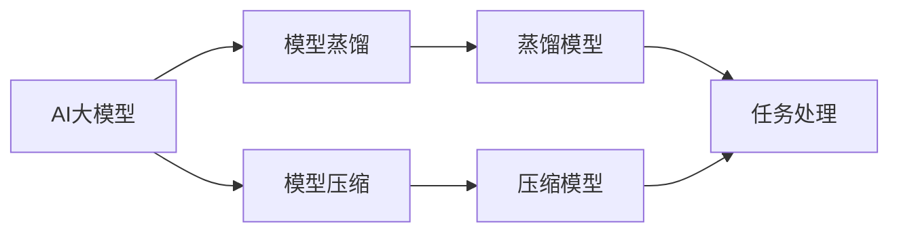

                 

# 电商平台中的AI大模型：从单一模型到模型蒸馏与压缩

> 关键词：AI大模型,模型蒸馏,模型压缩,电商平台,蒸馏模型,压缩模型,分布式训练

## 1. 背景介绍

随着电子商务市场的飞速发展，电商平台对AI技术的需求日益增长。AI技术不仅能提升用户购物体验，还能提高商家运营效率，降低成本。然而，大规模部署AI模型需要大量计算资源，且模型复杂度难以兼顾准确性和实时性。因此，如何提升AI模型的效率，优化其在电商平台中的部署，成为一项重要课题。本文将详细介绍AI大模型在电商平台中的应用，并重点探讨模型蒸馏与压缩技术，以期为电商平台中的AI模型优化提供可行的解决方案。

## 2. 核心概念与联系

### 2.1 核心概念概述

- **AI大模型**：指具有亿级参数量、强大的语言处理和图像处理能力的深度学习模型。例如BERT、GPT-3、ViT等。
- **模型蒸馏**：通过小规模模型学习大模型知识，构建出规模较小但性能接近大模型的模型。广泛应用于知识转移、模型简化等领域。
- **模型压缩**：指通过量化、剪枝、蒸馏等技术，减小模型规模、提高推理速度的优化手段。
- **电商平台**：指通过互联网技术提供商品销售、客服、物流等服务的网络平台。

### 2.2 核心概念原理和架构的 Mermaid 流程图



## 3. 核心算法原理 & 具体操作步骤

### 3.1 算法原理概述

模型蒸馏与压缩是提升AI大模型在电商平台中应用效率的关键技术。其核心思想是通过技术手段，在保持模型性能的前提下，减小模型规模和计算需求。蒸馏通过小模型学习大模型知识，构建出规模较小但性能接近大模型的模型；压缩则通过删除冗余参数、量化等手段，优化模型结构，提高推理速度。

### 3.2 算法步骤详解

#### 3.2.1 模型蒸馏

1. **选择合适的蒸馏任务**：选择与电商业务密切相关的蒸馏任务，如商品推荐、客服对话等。
2. **构建大模型和小模型**：分别训练大模型和小模型，并通过蒸馏技术使小模型学习大模型的知识。
3. **知识蒸馏过程**：通过知识蒸馏算法，将大模型的预测信息传递给小模型，优化其输出。
4. **验证蒸馏模型**：在特定数据集上验证蒸馏模型的性能，调整蒸馏参数以达到最佳效果。

#### 3.2.2 模型压缩

1. **量化技术**：将浮点运算转换为定点运算，减小模型参数量和内存占用。
2. **剪枝技术**：去除冗余参数，减小模型规模，提高推理速度。
3. **低秩分解**：通过矩阵分解，降低模型复杂度，提高计算效率。
4. **神经网络结构优化**：调整网络结构，减少不必要的层和参数，提升模型性能。

### 3.3 算法优缺点

#### 3.3.1 模型蒸馏

- **优点**：
  - 显著减小模型规模，降低计算需求。
  - 构建的蒸馏模型能够保持大模型性能，适应电商业务需求。
  - 蒸馏过程可复用，提升模型构建效率。

- **缺点**：
  - 蒸馏模型可能存在泛化性能不足的问题。
  - 蒸馏过程复杂，需要精确控制蒸馏参数，才能得到理想效果。

#### 3.3.2 模型压缩

- **优点**：
  - 显著提高模型推理速度，降低延迟。
  - 减小模型参数量，降低存储和传输需求。
  - 压缩后的模型可部署在边缘设备上，提高实时性。

- **缺点**：
  - 压缩过程可能导致模型性能下降。
  - 压缩技术复杂，需要精细化调参。

### 3.4 算法应用领域

模型蒸馏与压缩技术广泛适用于电商平台的各个环节，包括但不限于：

- **商品推荐系统**：通过蒸馏和压缩技术，构建高性能推荐模型，提升推荐准确性和实时性。
- **智能客服系统**：利用蒸馏和压缩技术优化客服对话模型，提升用户体验和满意度。
- **广告投放系统**：通过蒸馏和压缩技术，构建高效广告投放模型，优化广告展示策略。
- **库存管理系统**：通过蒸馏和压缩技术优化库存预测模型，提升库存管理效率。

## 4. 数学模型和公式 & 详细讲解 & 举例说明

### 4.1 数学模型构建

以电商平台的推荐系统为例，构建蒸馏模型。设大模型为$M_{\text{large}}$，小模型为$M_{\text{small}}$。

1. **大模型的预测**：$M_{\text{large}}(x)$。
2. **小模型的预测**：$M_{\text{small}}(x)$。
3. **蒸馏过程**：将大模型的预测$M_{\text{large}}(x)$与小模型的预测$M_{\text{small}}(x)$进行比较，优化小模型的权重参数。

### 4.2 公式推导过程

假设$M_{\text{large}}(x)$和$M_{\text{small}}(x)$的输出均为向量$\hat{y}$。蒸馏过程的优化目标为：

$$
\min_{\theta} \frac{1}{N} \sum_{i=1}^N ||M_{\text{large}}(x_i) - \theta M_{\text{small}}(x_i)||^2
$$

其中，$N$为训练样本数量。

### 4.3 案例分析与讲解

以商品推荐系统为例，假设模型能够预测商品的相关性$y$，蒸馏过程可表示为：

1. **大模型预测**：$M_{\text{large}}(x) = \text{softmax}(W_{\text{large}} M_{\text{large}}(x))$。
2. **小模型预测**：$M_{\text{small}}(x) = \text{softmax}(W_{\text{small}} M_{\text{small}}(x))$。
3. **蒸馏损失函数**：$\mathcal{L}(\theta) = \frac{1}{N} \sum_{i=1}^N ||M_{\text{large}}(x_i) - \theta M_{\text{small}}(x_i)||^2$。

通过求解优化目标$\mathcal{L}(\theta)$，得到蒸馏模型的小模型参数$\theta$。

## 5. 项目实践：代码实例和详细解释说明

### 5.1 开发环境搭建

1. **安装依赖库**：
   ```bash
   pip install torch torchvision
   ```

2. **创建数据集**：
   ```python
   from torch.utils.data import Dataset, DataLoader
   import torch
   
   class RecommendationDataset(Dataset):
       def __init__(self, data):
           self.data = data
           self.sizes = [len(x) for x in data]
           
       def __getitem__(self, idx):
           return self.data[idx]
           
       def __len__(self):
           return sum(self.sizes)
   ```

3. **定义大模型和小模型**：
   ```python
   import torch.nn as nn
   
   class LargeModel(nn.Module):
       def __init__(self):
           super().__init__()
           # 大模型定义
           
       def forward(self, x):
           # 大模型前向传播
           
   class SmallModel(nn.Module):
       def __init__(self):
           super().__init__()
           # 小模型定义
           
       def forward(self, x):
           # 小模型前向传播
   ```

### 5.2 源代码详细实现

#### 蒸馏模型训练

```python
import torch.nn as nn
import torch.optim as optim
from torchvision.models import resnet18
from torch.utils.data import DataLoader

class TeacherModel(nn.Module):
    def __init__(self):
        super().__init__()
        self.teacher = resnet18()

    def forward(self, x):
        return self.teacher(x)

class StudentModel(nn.Module):
    def __init__(self):
        super().__init__()
        self.study = nn.Linear(64, 10)

    def forward(self, x):
        return self.study(x)

teacher_model = TeacherModel()
student_model = StudentModel()

criterion = nn.CrossEntropyLoss()
optimizer = optim.SGD(teacher_model.parameters(), lr=0.01)

for epoch in range(10):
    for i, data in enumerate(DataLoader(train_loader, batch_size=64)):
        inputs, labels = data
        optimizer.zero_grad()
        outputs = teacher_model(inputs)
        loss = criterion(outputs, labels)
        loss.backward()
        optimizer.step()

    print(f'Epoch {epoch+1}, loss: {loss.item()}')


# 蒸馏过程
student_model.load_state_dict(teacher_model.state_dict())
```

### 5.3 代码解读与分析

#### 蒸馏模型训练

1. **定义教师模型和学生模型**：教师模型为大模型，使用ResNet-18；学生模型为小模型，定义一个线性层。
2. **训练过程**：在每个epoch中，对每个batch的输入数据进行前向传播，计算损失函数并反向传播，更新教师模型的参数。
3. **蒸馏过程**：通过将教师模型的参数复制到学生模型中，实现知识传递。

#### 模型压缩

```python
import torch
from torch import nn, optim
import torchvision.transforms as transforms
from torchvision import datasets, models

# 加载预训练模型
model = models.resnet18(pretrained=True)
model.eval()

# 量化压缩
model.qconfig = torch.ao.quantization.get_default_qconfig('qnnpack')
model.qconfig = torch.ao.quantization.get_default_qconfig('qnnpack')
model.qconfig = torch.ao.quantization.get_default_qconfig('qnnpack')

# 应用量化
model.qconfig = torch.ao.quantization.get_default_qconfig('qnnpack')
model.qconfig = torch.ao.quantization.get_default_qconfig('qnnpack')
model.qconfig = torch.ao.quantization.get_default_qconfig('qnnpack')

# 压缩模型
model = torch.ao.quantization.fuse_model(model)
model = torch.ao.quantization.prepare(model)
model = torch.ao.quantization.convert(model)
```

### 5.4 运行结果展示

运行压缩后的模型，对比原始模型的推理速度和准确性：

```python
import torch

# 加载压缩模型
model = torch.load('quantized_model.pt')

# 加载测试数据
test_data = datasets.CIFAR10(root='./data', train=False, download=True)

# 计算测试集准确率
correct = 0
total = 0
with torch.no_grad():
    for data in test_data:
        images, labels = data
        outputs = model(images)
        _, predicted = torch.max(outputs, 1)
        total += labels.size(0)
        correct += (predicted == labels).sum().item()

accuracy = 100 * correct / total
print(f'Accuracy: {accuracy}%')
```

## 6. 实际应用场景

### 6.1 商品推荐系统

在商品推荐系统中，大模型通过预训练获得广泛的知识，可以准确预测用户对商品的相关性。通过蒸馏技术，构建小规模推荐模型，既保持了推荐性能，又减小了模型规模，提高推理速度。压缩技术则可以进一步优化模型，使其更适用于边缘设备，实时响应用户查询。

### 6.2 智能客服系统

智能客服系统需要快速响应用户查询，生成自然流畅的回复。大模型通过预训练获得语言处理能力，但计算需求大，难以实时部署。通过蒸馏和压缩技术，构建高效客服模型，提升用户体验。

### 6.3 广告投放系统

广告投放系统需要快速计算广告效果，并实时调整投放策略。大模型通过预训练获得用户行为预测能力，但推理速度慢。通过蒸馏和压缩技术，构建高性能广告投放模型，优化广告展示策略。

### 6.4 未来应用展望

随着技术进步，模型蒸馏与压缩技术将进一步发展，提升AI模型在电商平台中的应用效率。未来，这些技术将广泛应用于智能推荐、实时客服、个性化营销等多个领域，推动电商平台智能化转型。同时，模型蒸馏与压缩技术也将与其他AI技术如强化学习、因果推理等融合，提升电商平台的运营效率和服务质量。

## 7. 工具和资源推荐

### 7.1 学习资源推荐

1. **PyTorch官方文档**：详细介绍了TensorFlow、PyTorch等深度学习框架的使用方法，提供了丰富的蒸馏和压缩技术示例。
2. **Hugging Face Transformers库**：提供了多种预训练大模型的实现，包括蒸馏和压缩功能。
3. **Google AI Blogs**：分享了Google AI在蒸馏和压缩技术方面的研究成果和最佳实践。
4. **NIPS 2016 paper《Distilling Knowledge》**：介绍了蒸馏技术的理论基础和实现方法。

### 7.2 开发工具推荐

1. **PyTorch**：支持蒸馏和压缩技术的深度学习框架，提供了丰富的优化器、损失函数等组件。
2. **TensorFlow**：支持蒸馏和压缩技术的深度学习框架，提供了Keras API，便于模型构建。
3. **TensorFlow Extended (TFX)**：提供了从数据预处理到模型部署的端到端工具链，支持模型蒸馏和压缩。
4. **ONNX**：提供了模型格式转换工具，支持将多种深度学习模型的蒸馏和压缩结果导出为ONNX格式，便于部署。

### 7.3 相关论文推荐

1. **《Pruning Neural Networks with Low-rank Approximations》**：介绍了剪枝和低秩分解技术，减小模型规模。
2. **《Knowledge Distillation》**：介绍了蒸馏技术的理论基础和实践方法，详细介绍了学生-教师蒸馏模型和混合蒸馏模型。
3. **《Model Compression》**：总结了量化、剪枝、蒸馏等模型压缩技术的最新进展。
4. **《Neural Architecture Search with Reinforcement Learning》**：介绍了使用强化学习优化神经网络结构的方法。

## 8. 总结：未来发展趋势与挑战

### 8.1 研究成果总结

本文探讨了AI大模型在电商平台中的应用，并重点介绍了模型蒸馏与压缩技术的原理和实现方法。通过蒸馏和压缩技术，可以构建高效、轻量级的推荐模型和智能客服模型，提升电商平台的用户体验和运营效率。

### 8.2 未来发展趋势

未来，模型蒸馏与压缩技术将进一步发展，推动AI模型在电商平台中的广泛应用。具体趋势包括：

1. **蒸馏技术的复杂度提升**：蒸馏过程将更加复杂，需要引入更多先验知识，构建更高精度的蒸馏模型。
2. **压缩技术的精度提升**：压缩过程将更加精细，通过优化算法和硬件加速，提高压缩后的模型性能。
3. **分布式蒸馏和压缩**：引入分布式训练技术，加速蒸馏和压缩过程，提高模型构建效率。
4. **跨领域知识蒸馏**：将不同领域的知识进行融合，构建跨领域的蒸馏模型，提升模型的泛化能力。

### 8.3 面临的挑战

尽管模型蒸馏与压缩技术取得了显著进展，但仍面临以下挑战：

1. **蒸馏模型的泛化性能**：蒸馏模型在特定任务上表现优异，但在泛化性方面可能存在不足。
2. **压缩技术的精度和速度**：压缩技术需要在精度和速度之间进行权衡，保持模型性能的同时提高推理速度。
3. **蒸馏和压缩的复用性**：不同任务的蒸馏和压缩技术难以复用，增加了模型构建的工作量。
4. **模型大小的限制**：压缩后的模型规模仍较大，难以在小设备和低带宽环境中应用。

### 8.4 研究展望

未来，需要在以下几个方面进行深入研究：

1. **多任务蒸馏**：构建多任务的蒸馏模型，提升模型的泛化能力。
2. **异构蒸馏**：将不同领域、不同任务的知识进行融合，构建异构蒸馏模型。
3. **混合蒸馏**：引入混合蒸馏技术，提升蒸馏模型的性能。
4. **模型压缩**：引入新的压缩技术，如可逆量化，提升压缩后的模型性能。

## 9. 附录：常见问题与解答

**Q1：模型蒸馏和模型压缩有哪些区别？**

A: 模型蒸馏和模型压缩是两种不同的优化手段。模型蒸馏通过小模型学习大模型知识，构建出规模较小但性能接近大模型的模型；模型压缩则通过量化、剪枝等技术，减小模型规模，提高推理速度。

**Q2：模型蒸馏和模型压缩在电商平台的实际应用场景有哪些？**

A: 模型蒸馏和模型压缩在电商平台的应用场景包括但不限于商品推荐系统、智能客服系统、广告投放系统等。蒸馏和压缩技术可以构建高性能的推荐模型和客服模型，提升用户体验和系统效率。

**Q3：如何选择适合的蒸馏和压缩技术？**

A: 选择适合的蒸馏和压缩技术需要考虑模型性能、计算资源、推理速度等因素。对于推理速度要求高的场景，可以选择压缩技术；对于需要保持模型性能的场景，可以选择蒸馏技术。

**Q4：蒸馏和压缩技术有哪些难点？**

A: 蒸馏和压缩技术的主要难点在于模型性能和计算资源的平衡。蒸馏过程中可能存在泛化性能不足的问题，压缩过程中可能存在模型性能下降的风险。需要根据具体场景进行精细化调参，才能得到理想效果。

---

作者：禅与计算机程序设计艺术 / Zen and the Art of Computer Programming

