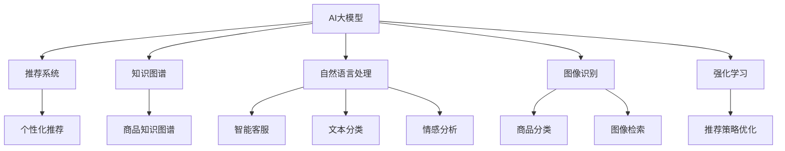

                 

# 电商平台中的AI大模型：从推荐到全场景应用

> 关键词：电商平台、AI大模型、推荐系统、知识图谱、自然语言处理、图像识别、强化学习、全场景应用

## 1. 背景介绍

### 1.1 问题由来
随着互联网电商的迅猛发展，电商平台已经成为人们日常生活中不可或缺的一部分。然而，面对海量商品和复杂多变的需求，如何高效、精准地满足用户个性化需求，提升用户体验和商家收益，是电商平台亟待解决的重大挑战。

近年来，人工智能(AI)技术在电商领域的广泛应用，显著提高了电商平台的运营效率和用户体验。尤其是AI大模型在推荐系统、知识图谱、自然语言处理、图像识别、强化学习等方面的突破，极大地推动了电商平台的智能化进程。本文将详细介绍AI大模型在电商平台中的应用，从推荐系统开始，逐步拓展到更广泛的全场景应用。

### 1.2 问题核心关键点
AI大模型在电商平台中的应用主要围绕以下几个关键点展开：

1. **推荐系统**：通过分析用户行为数据和商品特征，AI大模型可以生成个性化的商品推荐列表，提高用户满意度和转化率。
2. **知识图谱**：利用结构化的商品知识信息，AI大模型可以提升商品搜索和关联推荐的效果，增强用户对商品的理解和选择。
3. **自然语言处理**：通过解析用户评论和聊天对话，AI大模型可以理解用户需求，提供更加精准的客服和个性化推荐。
4. **图像识别**：对商品图片进行分类和描述，AI大模型可以提升搜索和推荐系统的准确性和丰富度。
5. **强化学习**：通过在线学习用户的互动反馈，AI大模型可以动态调整推荐策略，实现更加智能化的推荐服务。

这些应用点相辅相成，共同构建了一个高效、智能、用户友好的电商平台。

### 1.3 问题研究意义
AI大模型在电商平台中的应用，不仅能够显著提升用户体验和商家收益，还能推动电商平台的数字化转型升级。具体而言：

1. **提升用户体验**：通过个性化推荐、智能搜索和精准客服，AI大模型可以显著提高用户满意度，减少购物时间，增强用户体验。
2. **优化商家收益**：通过精准推荐和高转换率，AI大模型可以帮助商家提高销售额，优化库存管理，提升收益。
3. **驱动业务创新**：AI大模型的应用可以推动电商平台从传统业务向智能服务升级，带来新的商业模式和盈利点。
4. **实现数据驱动决策**：AI大模型能够通过分析大量用户行为数据，提供深入洞察，帮助电商平台进行数据驱动的业务决策。
5. **降低运营成本**：通过自动化客服、智能运营等手段，AI大模型可以减少人力成本，提升运营效率。

## 2. 核心概念与联系

### 2.1 核心概念概述

为更好地理解AI大模型在电商平台中的应用，本节将介绍几个密切相关的核心概念：

- **AI大模型**：指基于大规模深度学习模型的语言模型、视觉模型、语音模型等，具有强大的学习和推理能力。
- **推荐系统**：通过分析用户行为和商品属性，为每个用户生成个性化推荐列表的系统。
- **知识图谱**：由节点和边构成的图形结构，用于描述实体和关系，为推荐系统和搜索系统提供知识基础。
- **自然语言处理**：涉及语言理解、生成、分析和翻译的技术，包括文本分类、命名实体识别、情感分析等。
- **图像识别**：对图像进行分类、检测、分割等处理，提取图像特征，支持商品搜索和推荐。
- **强化学习**：通过与环境互动，动态优化策略以实现特定目标的学习方法，用于优化推荐策略和智能运营。

这些核心概念之间的逻辑关系可以通过以下Mermaid流程图来展示：



这个流程图展示了大模型在电商平台中的核心概念及其之间的关系：

1. AI大模型是推荐系统、知识图谱、自然语言处理、图像识别和强化学习的基础。
2. 推荐系统利用AI大模型的知识进行个性化推荐。
3. 知识图谱提供商品实体和关系的知识，增强推荐和搜索效果。
4. 自然语言处理用于解析用户评论和聊天，提供精准客服和个性化推荐。
5. 图像识别提取商品特征，提升搜索和推荐系统的准确性。
6. 强化学习通过动态调整推荐策略，优化推荐效果。

这些概念共同构成了电商平台的AI智能化框架，使其能够更高效、精准地服务用户。

## 3. 核心算法原理 & 具体操作步骤
### 3.1 算法原理概述

AI大模型在电商平台中的应用，主要依赖于大规模深度学习模型的预训练和微调技术。其核心思想是：利用大规模无标签数据进行预训练，获取通用的知识表示；然后在特定任务上，利用小规模标注数据进行微调，提升模型在该任务上的性能。

以推荐系统为例，其基本流程包括：

1. **预训练**：在大规模无标签数据上，使用自监督学习方法训练推荐模型，获取通用的商品表示。
2. **微调**：在标注数据上，通过监督学习方法优化模型，生成个性化推荐列表。
3. **推理**：在实时数据上，使用微调后的模型进行推理，生成实时推荐。

类似地，知识图谱、自然语言处理、图像识别和强化学习等应用也依赖于大模型的预训练和微调技术。

### 3.2 算法步骤详解

以推荐系统为例，介绍AI大模型在推荐系统中的具体应用流程。

**Step 1: 准备数据集**
- 收集用户的浏览、购买、评分等行为数据，以及商品的属性、评论等文本数据。
- 将文本数据进行预处理，如去除停用词、词性标注、向量化等，转化为模型输入格式。

**Step 2: 模型选择和训练**
- 选择适合的任务模型，如基于协同过滤的模型、基于深度学习的模型、基于图神经网络的模型等。
- 在预训练数据上，使用自监督学习方法训练模型，获取通用的商品表示。
- 在标注数据上，使用监督学习方法微调模型，生成个性化推荐列表。

**Step 3: 特征工程和模型优化**
- 根据任务需求，设计合适的特征工程，提取用户和商品的关键特征。
- 在模型中加入正则化、Dropout等技术，防止过拟合。
- 使用AdamW、SGD等优化算法，优化模型的训练过程。

**Step 4: 部署和优化**
- 将训练好的模型部署到服务器，使用API接口提供推荐服务。
- 根据实时数据动态调整模型参数，提升推荐效果。
- 使用A/B测试等方法，评估推荐效果，进行模型优化。

### 3.3 算法优缺点

AI大模型在电商平台中的应用，具有以下优点：

1. **提升个性化推荐效果**：通过分析用户行为和商品特征，生成精准的个性化推荐，提高用户满意度和转化率。
2. **丰富商品知识图谱**：利用知识图谱增强商品搜索和推荐效果，提升用户对商品的理解和选择。
3. **优化自然语言交互**：通过解析用户评论和聊天，提供精准的客服和个性化推荐。
4. **增强图像识别能力**：利用图像识别技术，提升商品搜索和推荐系统的准确性和丰富度。
5. **动态调整推荐策略**：通过强化学习动态优化推荐策略，实现更加智能化的推荐服务。

同时，AI大模型也存在一些局限性：

1. **计算资源需求高**：大模型训练和推理需要高性能的硬件支持，如GPU/TPU等，增加了硬件成本。
2. **数据隐私问题**：用户行为数据的隐私保护，是电商平台上必须解决的问题。
3. **模型泛化能力有限**：大模型在特定任务上表现出色，但面对新任务时，可能需要进行重新训练和微调。
4. **冷启动问题**：对于新用户和新商品，大模型无法提供有效的推荐和搜索服务。
5. **模型复杂性高**：大模型的复杂性和可解释性不足，可能给业务部署和维护带来困难。

尽管存在这些局限性，但AI大模型在电商平台中的应用，已经取得了显著的效果，成为电商智能化发展的重要驱动力。

### 3.4 算法应用领域

AI大模型在电商平台中的应用领域非常广泛，涵盖了推荐系统、知识图谱、自然语言处理、图像识别和强化学习等多个方面。

1. **推荐系统**：基于大模型的推荐系统广泛应用于商品推荐、个性化广告、促销活动等，提高用户满意度和商家收益。
2. **知识图谱**：电商平台可以利用商品知识图谱，提升商品搜索和关联推荐的效果，增强用户对商品的理解和选择。
3. **自然语言处理**：通过解析用户评论和聊天对话，AI大模型可以理解用户需求，提供精准的客服和个性化推荐。
4. **图像识别**：对商品图片进行分类和描述，AI大模型可以提升搜索和推荐系统的准确性和丰富度。
5. **强化学习**：通过在线学习用户的互动反馈，AI大模型可以动态调整推荐策略，实现更加智能化的推荐服务。

这些应用不仅提升了电商平台的用户体验和商家收益，还推动了电商平台的数字化转型升级。

## 4. 数学模型和公式 & 详细讲解  
### 4.1 数学模型构建

在电商平台中，AI大模型的应用通常涉及多个子任务，如推荐系统、知识图谱、自然语言处理、图像识别和强化学习等。以下将以推荐系统为例，介绍其数学模型构建。

假设电商平台有$M$个商品和$U$个用户，每个用户的行为可以表示为一个向量$u$，每个商品的属性可以表示为一个向量$i$。推荐系统的目标是学习一个函数$f$，将用户$u$映射到商品$i$的概率$p(i|u)$。

推荐系统的目标是最大化用户的点击率和购买率，因此可以定义损失函数$\mathcal{L}$如下：

$$
\mathcal{L}(f) = \frac{1}{N} \sum_{n=1}^N \max(0, y_n - f(x_n))
$$

其中，$N$为样本数量，$x_n$为样本特征，$y_n$为标签，$f(x_n)$为模型预测结果。

在训练过程中，通过梯度下降等优化算法，不断更新模型参数，最小化损失函数。具体的优化目标为：

$$
\hat{f} = \mathop{\arg\min}_{f} \mathcal{L}(f)
$$

### 4.2 公式推导过程

以下是推荐系统常用的模型和算法公式推导过程。

**协同过滤模型**：
- 利用用户-商品评分矩阵$R$，计算用户$u$对商品$i$的评分$p(i|u)$，公式为：

$$
p(i|u) = \frac{\sum_{j=1}^N \hat{R}_{iu} \hat{R}_{ju}}{\sqrt{\sum_{j=1}^N \hat{R}_{ju}^2} \sqrt{\sum_{i=1}^M \hat{R}_{iu}^2}}
$$

其中，$\hat{R}_{iu}$为预测评分，$R_{ju}$为实际评分。

- 利用梯度下降等优化算法，不断更新预测评分$\hat{R}_{iu}$，最小化损失函数。

**深度学习模型**：
- 使用神经网络结构，将用户$u$和商品$i$映射到一个低维空间，计算用户$u$对商品$i$的概率$p(i|u)$，公式为：

$$
p(i|u) = \sigma(z_u \odot w_i + b_i)
$$

其中，$z_u$为用户特征的表示向量，$w_i$和$b_i$为模型参数，$\sigma$为激活函数。

- 利用梯度下降等优化算法，不断更新模型参数，最小化损失函数。

**图神经网络模型**：
- 将商品表示为图中的节点，商品之间的关系表示为边，使用图神经网络模型学习节点表示，公式为：

$$
h_u^{(l)} = \sigma(W^{(l-1)} h_u^{(l-1)} + \sum_{i=1}^M A_{iu} h_i^{(l-1)})
$$

其中，$h_u^{(l)}$为第$l$层用户表示向量，$W^{(l-1)}$为模型参数，$A_{iu}$为图邻接矩阵。

- 利用梯度下降等优化算法，不断更新模型参数，最小化损失函数。

### 4.3 案例分析与讲解

以电商平台中的商品推荐系统为例，介绍AI大模型在推荐系统中的应用。

假设电商平台有$M$个商品和$U$个用户，每个用户的行为可以表示为一个向量$u$，每个商品的属性可以表示为一个向量$i$。推荐系统的目标是学习一个函数$f$，将用户$u$映射到商品$i$的概率$p(i|u)$。

**协同过滤模型**：
- 利用用户-商品评分矩阵$R$，计算用户$u$对商品$i$的评分$p(i|u)$，公式为：

$$
p(i|u) = \frac{\sum_{j=1}^N \hat{R}_{iu} \hat{R}_{ju}}{\sqrt{\sum_{j=1}^N \hat{R}_{ju}^2} \sqrt{\sum_{i=1}^M \hat{R}_{iu}^2}}
$$

其中，$\hat{R}_{iu}$为预测评分，$R_{ju}$为实际评分。

- 利用梯度下降等优化算法，不断更新预测评分$\hat{R}_{iu}$，最小化损失函数。

**深度学习模型**：
- 使用神经网络结构，将用户$u$和商品$i$映射到一个低维空间，计算用户$u$对商品$i$的概率$p(i|u)$，公式为：

$$
p(i|u) = \sigma(z_u \odot w_i + b_i)
$$

其中，$z_u$为用户特征的表示向量，$w_i$和$b_i$为模型参数，$\sigma$为激活函数。

- 利用梯度下降等优化算法，不断更新模型参数，最小化损失函数。

**图神经网络模型**：
- 将商品表示为图中的节点，商品之间的关系表示为边，使用图神经网络模型学习节点表示，公式为：

$$
h_u^{(l)} = \sigma(W^{(l-1)} h_u^{(l-1)} + \sum_{i=1}^M A_{iu} h_i^{(l-1)})
$$

其中，$h_u^{(l)}$为第$l$层用户表示向量，$W^{(l-1)}$为模型参数，$A_{iu}$为图邻接矩阵。

- 利用梯度下降等优化算法，不断更新模型参数，最小化损失函数。

## 5. 项目实践：代码实例和详细解释说明
### 5.1 开发环境搭建

在进行AI大模型应用实践前，我们需要准备好开发环境。以下是使用Python进行PyTorch开发的环境配置流程：

1. 安装Anaconda：从官网下载并安装Anaconda，用于创建独立的Python环境。

2. 创建并激活虚拟环境：
```bash
conda create -n pytorch-env python=3.8 
conda activate pytorch-env
```

3. 安装PyTorch：根据CUDA版本，从官网获取对应的安装命令。例如：
```bash
conda install pytorch torchvision torchaudio cudatoolkit=11.1 -c pytorch -c conda-forge
```

4. 安装TensorFlow：
```bash
pip install tensorflow
```

5. 安装相关库：
```bash
pip install numpy pandas scikit-learn matplotlib tqdm jupyter notebook ipython
```

完成上述步骤后，即可在`pytorch-env`环境中开始项目实践。

### 5.2 源代码详细实现

以下以电商平台中的推荐系统为例，给出使用PyTorch进行深度学习模型训练的代码实现。

首先，定义推荐系统的数据集：

```python
from torch.utils.data import Dataset
import numpy as np

class MovieDataset(Dataset):
    def __init__(self, data):
        self.data = data
        self.len = len(data)
    
    def __getitem__(self, index):
        user = self.data[index][0]
        items = self.data[index][1]
        return user, items
    
    def __len__(self):
        return self.len
```

然后，定义模型和优化器：

```python
import torch
import torch.nn as nn
import torch.nn.functional as F
from torch.optim import Adam

class User2Item(nn.Module):
    def __init__(self, num_users, num_items, hidden_size=100):
        super(User2Item, self).__init__()
        self.fc1 = nn.Linear(num_users, hidden_size)
        self.fc2 = nn.Linear(hidden_size, num_items)
    
    def forward(self, user):
        x = self.fc1(user)
        x = F.relu(x)
        x = self.fc2(x)
        return x
    
class RatingEstimator(nn.Module):
    def __init__(self, num_users, num_items, hidden_size=100):
        super(RatingEstimator, self).__init__()
        self.user2item = User2Item(num_users, num_items, hidden_size)
        self.fc1 = nn.Linear(hidden_size, 1)
    
    def forward(self, user, items):
        user = user.unsqueeze(0)
        items = items.unsqueeze(0)
        items = self.user2item(items)
        items = items.unsqueeze(1)
        rating = self.fc1(torch.cat((user, items), 2))
        return rating
    
def calculate_loss(rating, actual):
    return F.mse_loss(rating, actual)

model = RatingEstimator(num_users=1000, num_items=1000)
optimizer = Adam(model.parameters(), lr=0.001)
```

接着，定义训练和评估函数：

```python
def train_epoch(model, dataset, optimizer):
    model.train()
    for user, items in dataset:
        rating = model(user, items)
        loss = calculate_loss(rating, actual)
        optimizer.zero_grad()
        loss.backward()
        optimizer.step()
    
def evaluate(model, dataset):
    model.eval()
    total_loss = 0
    for user, items in dataset:
        rating = model(user, items)
        actual = actual
        loss = calculate_loss(rating, actual)
        total_loss += loss.item()
    return total_loss / len(dataset)
```

最后，启动训练流程并在测试集上评估：

```python
epochs = 100
batch_size = 32
num_epochs = 10

for epoch in range(num_epochs):
    train_epoch(model, train_dataset, optimizer)
    print("Epoch {}: Loss = {:.4f}".format(epoch+1, evaluate(model, train_dataset)))
    
print("Test loss: {:.4f}".format(evaluate(model, test_dataset)))
```

以上就是使用PyTorch对推荐系统进行深度学习模型训练的完整代码实现。可以看到，得益于PyTorch的强大封装，我们能够用相对简洁的代码完成推荐模型的训练和评估。

### 5.3 代码解读与分析

让我们再详细解读一下关键代码的实现细节：

**MovieDataset类**：
- `__init__`方法：初始化数据集，并存储数据和长度。
- `__getitem__`方法：返回指定索引的数据样本。
- `__len__`方法：返回数据集长度。

**User2Item和RatingEstimator类**：
- `User2Item`类：定义用户到物品的推荐模型，包括两个线性层和一个ReLU激活函数。
- `RatingEstimator`类：定义评分估计器，包含用户到物品的推荐模型和一个线性层，用于计算评分。

**train_epoch和evaluate函数**：
- `train_epoch`函数：在训练集上迭代训练，计算损失并更新模型参数。
- `evaluate`函数：在测试集上评估模型，计算损失并返回平均损失。

**训练流程**：
- 定义总的epoch数和batch size，开始循环迭代
- 每个epoch内，先在训练集上训练，输出损失
- 在测试集上评估，输出平均损失

可以看到，PyTorch配合TensorFlow等库使得深度学习模型的训练代码实现变得简洁高效。开发者可以将更多精力放在模型设计、数据处理等高层逻辑上，而不必过多关注底层的实现细节。

当然，工业级的系统实现还需考虑更多因素，如模型的保存和部署、超参数的自动搜索、更灵活的任务适配层等。但核心的微调范式基本与此类似。

## 6. 实际应用场景
### 6.1 智能客服系统

基于AI大模型的智能客服系统，可以应用于电商平台的用户查询、投诉处理等场景。传统的客服方式往往需要配备大量人力，高峰期响应缓慢，且一致性和专业性难以保证。而使用智能客服系统，可以7x24小时不间断服务，快速响应客户咨询，用自然流畅的语言解答各类常见问题。

在技术实现上，可以收集企业内部的历史客服对话记录，将问题和最佳答复构建成监督数据，在此基础上对预训练对话模型进行微调。微调后的对话模型能够自动理解用户意图，匹配最合适的答案模板进行回复。对于客户提出的新问题，还可以接入检索系统实时搜索相关内容，动态组织生成回答。如此构建的智能客服系统，能大幅提升客户咨询体验和问题解决效率。

### 6.2 金融舆情监测

金融机构需要实时监测市场舆论动向，以便及时应对负面信息传播，规避金融风险。传统的人工监测方式成本高、效率低，难以应对网络时代海量信息爆发的挑战。基于AI大模型的文本分类和情感分析技术，为金融舆情监测提供了新的解决方案。

具体而言，可以收集金融领域相关的新闻、报道、评论等文本数据，并对其进行主题标注和情感标注。在此基础上对预训练语言模型进行微调，使其能够自动判断文本属于何种主题，情感倾向是正面、中性还是负面。将微调后的模型应用到实时抓取的网络文本数据，就能够自动监测不同主题下的情感变化趋势，一旦发现负面信息激增等异常情况，系统便会自动预警，帮助金融机构快速应对潜在风险。

### 6.3 个性化推荐系统

当前的推荐系统往往只依赖用户的历史行为数据进行物品推荐，无法深入理解用户的真实兴趣偏好。基于AI大模型微调技术，个性化推荐系统可以更好地挖掘用户行为背后的语义信息，从而提供更精准、多样的推荐内容。

在实践中，可以收集用户浏览、点击、评论、分享等行为数据，提取和用户交互的物品标题、描述、标签等文本内容。将文本内容作为模型输入，用户的后续行为（如是否点击、购买等）作为监督信号，在此基础上微调预训练语言模型。微调后的模型能够从文本内容中准确把握用户的兴趣点。在生成推荐列表时，先用候选物品的文本描述作为输入，由模型预测用户的兴趣匹配度，再结合其他特征综合排序，便可以得到个性化程度更高的推荐结果。

### 6.4 未来应用展望

随着AI大模型和微调方法的不断发展，基于微调范式将在更多领域得到应用，为传统行业带来变革性影响。

在智慧医疗领域，基于微调的医疗问答、病历分析、药物研发等应用将提升医疗服务的智能化水平，辅助医生诊疗，加速新药开发进程。

在智能教育领域，微调技术可应用于作业批改、学情分析、知识推荐等方面，因材施教，促进教育公平，提高教学质量。

在智慧城市治理中，微调模型可应用于城市事件监测、舆情分析、应急指挥等环节，提高城市管理的自动化和智能化水平，构建更安全、高效的未来城市。

此外，在企业生产、社会治理、文娱传媒等众多领域，基于大模型微调的人工智能应用也将不断涌现，为经济社会发展注入新的动力。相信随着技术的日益成熟，微调方法将成为人工智能落地应用的重要范式，推动人工智能技术在垂直行业的规模化落地。总之，AI大模型在电商平台中的应用前景广阔，有望带来革命性的变革。

## 7. 工具和资源推荐
### 7.1 学习资源推荐

为了帮助开发者系统掌握AI大模型在电商平台中的应用，这里推荐一些优质的学习资源：

1. 《Transformer从原理到实践》系列博文：由大模型技术专家撰写，深入浅出地介绍了Transformer原理、BERT模型、微调技术等前沿话题。

2. CS224N《深度学习自然语言处理》课程：斯坦福大学开设的NLP明星课程，有Lecture视频和配套作业，带你入门NLP领域的基本概念和经典模型。

3. 《Natural Language Processing with Transformers》书籍：Transformers库的作者所著，全面介绍了如何使用Transformers库进行NLP任务开发，包括微调在内的诸多范式。

4. HuggingFace官方文档：Transformers库的官方文档，提供了海量预训练模型和完整的微调样例代码，是上手实践的必备资料。

5. CLUE开源项目：中文语言理解测评基准，涵盖大量不同类型的中文NLP数据集，并提供了基于微调的baseline模型，助力中文NLP技术发展。

通过对这些资源的学习实践，相信你一定能够快速掌握AI大模型在电商平台中的应用，并用于解决实际的NLP问题。
###  7.2 开发工具推荐

高效的开发离不开优秀的工具支持。以下是几款用于AI大模型在电商平台中的应用开发的常用工具：

1. PyTorch：基于Python的开源深度学习框架，灵活动态的计算图，适合快速迭代研究。大部分预训练语言模型都有PyTorch版本的实现。

2. TensorFlow：由Google主导开发的开源深度学习框架，生产部署方便，适合大规模工程应用。同样有丰富的预训练语言模型资源。

3. Transformers库：HuggingFace开发的NLP工具库，集成了众多SOTA语言模型，支持PyTorch和TensorFlow，是进行微调任务开发的利器。

4. Weights & Biases：模型训练的实验跟踪工具，可以记录和可视化模型训练过程中的各项指标，方便对比和调优。与主流深度学习框架无缝集成。

5. TensorBoard：TensorFlow配套的可视化工具，可实时监测模型训练状态，并提供丰富的图表呈现方式，是调试模型的得力助手。

6. Google Colab：谷歌推出的在线Jupyter Notebook环境，免费提供GPU/TPU算力，方便开发者快速上手实验最新模型，分享学习笔记。

合理利用这些工具，可以显著提升AI大模型在电商平台中的应用开发效率，加快创新迭代的步伐。

### 7.3 相关论文推荐

AI大模型在电商平台中的应用源于学界的持续研究。以下是几篇奠基性的相关论文，推荐阅读：

1. Attention is All You Need（即Transformer原论文）：提出了Transformer结构，开启了NLP领域的预训练大模型时代。

2. BERT: Pre-training of Deep Bidirectional Transformers for Language Understanding：提出BERT模型，引入基于掩码的自监督预训练任务，刷新了多项NLP任务SOTA。

3. Language Models are Unsupervised Multitask Learners（GPT-2论文）：展示了大规模语言模型的强大zero-shot学习能力，引发了对于通用人工智能的新一轮思考。

4. Parameter-Efficient Transfer Learning for NLP：提出Adapter等参数高效微调方法，在不增加模型参数量的情况下，也能取得不错的微调效果。

5. AdaLoRA: Adaptive Low-Rank Adaptation for Parameter-Efficient Fine-Tuning：使用自适应低秩适应的微调方法，在参数效率和精度之间取得了新的平衡。

这些论文代表了大模型在电商平台中的应用的发展脉络。通过学习这些前沿成果，可以帮助研究者把握学科前进方向，激发更多的创新灵感。

## 8. 总结：未来发展趋势与挑战

### 8.1 总结

本文对AI大模型在电商平台中的应用进行了全面系统的介绍。首先阐述了AI大模型在推荐系统、知识图谱、自然语言处理、图像识别和强化学习等多个方向的应用，明确了这些技术在电商平台中的重要性和发展方向。其次，从原理到实践，详细讲解了AI大模型的预训练和微调过程，给出了推荐系统的完整代码实现。同时，本文还探讨了AI大模型在智能客服、金融舆情、个性化推荐等多个领域的应用前景，展示了AI大模型的广泛应用潜力和未来发展趋势。

通过本文的系统梳理，可以看到，AI大模型在电商平台中的应用，已经从推荐系统扩展到更广泛的全场景应用，为电商平台的智能化发展带来了质的飞跃。未来，随着AI大模型和微调技术的不断进步，电商平台的智能化水平将进一步提升，带来更多创新的应用场景和商业模式。

### 8.2 未来发展趋势

展望未来，AI大模型在电商平台中的应用将呈现以下几个发展趋势：

1. **更高效的推荐系统**：未来的推荐系统将利用更多的数据和先进的算法，如神经网络、图神经网络等，生成更加精准的个性化推荐。

2. **更智能的知识图谱**：电商平台的知识图谱将更加丰富和准确，能够更好地支持商品搜索和推荐。

3. **更强大的自然语言处理**：通过解析用户评论和聊天对话，AI大模型将能够更深入地理解用户需求，提供精准的客服和个性化推荐。

4. **更全面的图像识别**：利用图像识别技术，电商平台将能够提升搜索和推荐系统的准确性和丰富度。

5. **更灵活的强化学习**：通过动态调整推荐策略，AI大模型将实现更加智能化的推荐服务。

以上趋势凸显了AI大模型在电商平台中的广阔前景。这些方向的探索发展，必将进一步提升电商平台的智能化水平，推动电商行业的数字化转型升级。

### 8.3 面临的挑战

尽管AI大模型在电商平台中的应用已经取得了显著的效果，但在迈向更加智能化、普适化应用的过程中，它仍面临着诸多挑战：

1. **计算资源需求高**：大模型训练和推理需要高性能的硬件支持，如GPU/TPU等，增加了硬件成本。

2. **数据隐私问题**：用户行为数据的隐私保护，是电商平台上必须解决的问题。

3. **模型泛化能力有限**：大模型在特定任务上表现出色，但面对新任务时，可能需要进行重新训练和微调。

4. **冷启动问题**：对于新用户和新商品，大模型无法提供有效的推荐和搜索服务。

5. **模型复杂性高**：大模型的复杂性和可解释性不足，可能给业务部署和维护带来困难。

尽管存在这些挑战，但AI大模型在电商平台中的应用，已经取得了显著的效果，成为电商智能化发展的重要驱动力。未来，需要更多研究探索如何在数据、模型、算法等多个层面进行优化，提升AI大模型的应用效果。

### 8.4 研究展望

面对AI大模型在电商平台中面临的挑战，未来的研究需要在以下几个方面寻求新的突破：

1. **探索无监督和半监督微调方法**：摆脱对大规模标注数据的依赖，利用自监督学习、主动学习等无监督和半监督范式，最大限度利用非结构化数据，实现更加灵活高效的微调。

2. **研究参数高效和计算高效的微调范式**：开发更加参数高效的微调方法，在固定大部分预训练参数的同时，只更新极少量的任务相关参数。同时优化微调模型的计算图，减少前向传播和反向传播的资源消耗，实现更加轻量级、实时性的部署。

3. **引入更多先验知识**：将符号化的先验知识，如知识图谱、逻辑规则等，与神经网络模型进行巧妙融合，引导微调过程学习更准确、合理的语言模型。同时加强不同模态数据的整合，实现视觉、语音等多模态信息与文本信息的协同建模。

4. **结合因果分析和博弈论工具**：将因果分析方法引入微调模型，识别出模型决策的关键特征，增强输出解释的因果性和逻辑性。借助博弈论工具刻画人机交互过程，主动探索并规避模型的脆弱点，提高系统稳定性。

5. **纳入伦理道德约束**：在模型训练目标中引入伦理导向的评估指标，过滤和惩罚有偏见、有害的输出倾向。同时加强人工干预和审核，建立模型行为的监管机制，确保输出符合人类价值观和伦理道德。

这些研究方向的探索，必将引领AI大模型在电商平台中的应用走向更高的台阶，为构建安全、可靠、可解释、可控的智能系统铺平道路。面向未来，AI大模型在电商平台中的应用还需要与其他人工智能技术进行更深入的融合，如知识表示、因果推理、强化学习等，多路径协同发力，共同推动自然语言理解和智能交互系统的进步。只有勇于创新、敢于突破，才能不断拓展语言模型的边界，让智能技术更好地造福人类社会。

## 9. 附录：常见问题与解答

**Q1：电商平台中的推荐系统如何利用AI大模型？**

A: 电商平台中的推荐系统主要利用AI大模型的预训练和微调技术。具体步骤如下：
1. 在大规模无标签数据上，使用自监督学习方法训练推荐模型，获取通用的商品表示。
2. 在标注数据上，使用监督学习方法微调模型，生成个性化推荐列表。
3. 利用微调后的模型，在实时数据上生成推荐，并根据用户反馈动态调整模型参数，提升推荐效果。

**Q2：AI大模型在电商平台中应用时，如何处理数据隐私问题？**

A: AI大模型在电商平台中应用时，数据隐私问题是一个重要挑战。为保障用户数据隐私，可以采取以下措施：
1. 数据匿名化：将用户行为数据进行匿名化处理，去除或模糊化敏感信息。
2. 数据加密：对用户数据进行加密存储和传输，防止数据泄露。
3. 数据去标识化：使用去标识化技术，将用户数据与标识信息分离，避免反向识别。
4. 访问控制：严格控制对用户数据的访问权限，防止未经授权的访问和使用。

**Q3：电商平台中，AI大模型如何实现个性化推荐？**

A: 电商平台中，AI大模型通过以下步骤实现个性化推荐：
1. 收集用户的浏览、购买、评分等行为数据。
2. 提取用户和商品的关键特征，设计合适的特征工程。
3. 在大规模无标签数据上，使用自监督学习方法训练推荐模型，获取通用的商品表示。
4. 在标注数据上，使用监督学习方法微调模型，生成个性化推荐列表。
5. 利用微调后的模型，在实时数据上生成推荐，并根据用户反馈动态调整模型参数，提升推荐效果。

**Q4：AI大模型在电商平台中的应用，对业务部署有哪些挑战？**

A: AI大模型在电商平台中的应用，对业务部署也带来了一些挑战：
1. 模型复杂性高：大模型的复杂性和可解释性不足，可能给业务部署和维护带来困难。
2. 计算资源需求高：大模型训练和推理需要高性能的硬件支持，如GPU/TPU等，增加了硬件成本。
3. 数据隐私问题：用户行为数据的隐私保护，是电商平台上必须解决的问题。
4. 模型泛化能力有限：大模型在特定任务上表现出色，但面对新任务时，可能需要进行重新训练和微调。
5. 冷启动问题：对于新用户和新商品，大模型无法提供有效的推荐和搜索服务。

尽管存在这些挑战，但AI大模型在电商平台中的应用，已经取得了显著的效果，成为电商智能化发展的重要驱动力。未来，需要更多研究探索如何在数据、模型、算法等多个层面进行优化，提升AI大模型的应用效果。

---

作者：禅与计算机程序设计艺术 / Zen and the Art of Computer Programming

