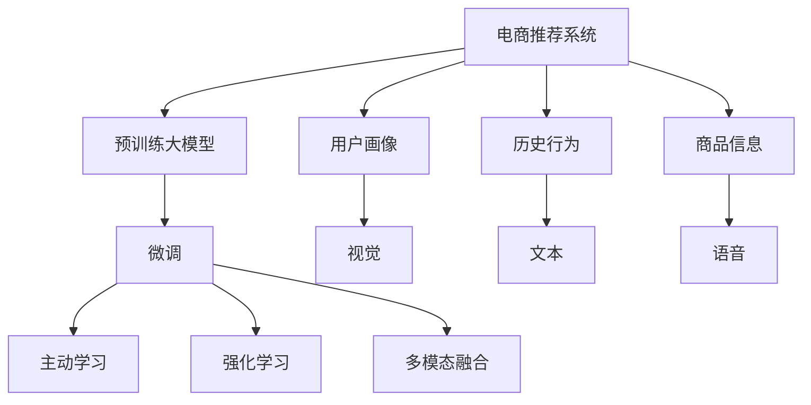

                 

# 电商平台中的AI大模型：从被动响应到主动预测

> 关键词：电商平台,大模型,预测,个性化推荐,主动学习,深度学习,强化学习,用户行为,转化率提升

## 1. 背景介绍

### 1.1 问题由来

在当前激烈的市场竞争中，电商平台需要依靠用户数据驱动的个性化推荐系统，提升用户购物体验和平台转化率。传统的推荐系统多基于用户历史行为数据，采用协同过滤等算法。然而，这种方式存在诸多限制：用户历史数据不完整，行为多变，冷启动用户难以有效推荐。

近年来，人工智能技术特别是深度学习、强化学习的兴起，为电商平台个性化推荐系统带来了新的解决方案。使用预训练大模型，如BERT、GPT-3等，并在电商数据上进行微调，可以实现更加精准的个性化推荐。特别是基于大模型的预测性推荐，在主动学习(Proactive Learning)和强化学习(Reinforcement Learning, RL)框架下，可以有效缓解数据不完整、行为不稳定等问题。

本文旨在探讨使用AI大模型进行电商平台个性化推荐系统的构建，并介绍从被动响应到主动预测的全过程。

### 1.2 问题核心关键点

基于大模型的电商推荐系统，可以通过以下关键技术突破，实现从被动响应到主动预测的转型：

1. **预训练模型初始化**：在电商数据上预训练大模型，使其掌握商品、用户、行为等多种实体和关系，形成广泛的语义表示。
2. **微调适配电商任务**：在预训练模型的基础上，针对电商平台的独特需求进行微调，优化推荐模型的任务适配能力。
3. **主动学习策略**：通过主动学习算法，挖掘电商数据中未被充分利用的先验知识，提前预测用户行为，提升推荐效果。
4. **强化学习框架**：构建基于强化学习的推荐系统，实时调整推荐策略，实现动态优化。
5. **多模态融合**：引入用户画像、历史行为、商品信息等多源数据，融合视觉、文本、语音等多种模态，实现更全面的个性化推荐。

本文将详细介绍上述关键技术，并通过实例展示其应用效果，探讨未来电商推荐系统的发展方向。

## 2. 核心概念与联系

### 2.1 核心概念概述

为更好地理解基于大模型的电商推荐系统，本节将介绍几个密切相关的核心概念：

- **电商推荐系统**：利用用户行为数据和商品特征，预测用户可能感兴趣的商品，实现个性化推荐。
- **预训练大模型**：如BERT、GPT-3等，在无标签文本数据上预训练得到的模型，具备强大的语言理解和生成能力。
- **微调**：在预训练模型的基础上，使用电商数据对模型进行适配，优化特定任务的性能。
- **主动学习**：通过数据挖掘和预测，发现未被充分利用的先验知识，主动选择学习样本，提升推荐效果。
- **强化学习**：在推荐系统中，将推荐行为视为一种动作，根据奖励信号调整推荐策略，优化推荐效果。
- **多模态融合**：结合用户画像、行为数据、商品信息等多源数据，融合视觉、文本、语音等多种模态，实现更全面的个性化推荐。

这些核心概念之间的逻辑关系可以通过以下Mermaid流程图来展示：



这个流程图展示了大模型在电商推荐系统中的应用流程：

1. 电商推荐系统利用预训练大模型进行初始化。
2. 在电商数据上进行微调，适配电商任务。
3. 结合主动学习和强化学习，实时调整推荐策略，实现动态优化。
4. 融合多种模态数据，实现更全面的个性化推荐。

## 3. 核心算法原理 & 具体操作步骤
### 3.1 算法原理概述

基于大模型的电商推荐系统，本质上是一个深度学习驱动的优化过程。其核心思想是：利用预训练大模型的语义表示能力，通过微调优化电商数据上的任务适配，结合主动学习和强化学习，实现用户行为的预测和推荐策略的动态优化。

具体来说，包括如下几个步骤：

1. **预训练大模型初始化**：在电商数据上预训练大模型，使其学习商品、用户、行为等多种实体的语义表示。
2. **微调适配电商任务**：在预训练模型的基础上，使用电商数据对模型进行微调，优化特定任务的表现，如预测用户兴趣、推荐商品等。
3. **主动学习预测未见数据**：结合电商数据中的先验知识，主动选择未见数据进行预测，提升推荐效果。
4. **强化学习动态优化**：在推荐过程中，将推荐行为视为一种动作，根据用户反馈调整推荐策略，实现动态优化。
5. **多模态数据融合**：结合用户画像、行为数据、商品信息等多种数据源，融合视觉、文本、语音等多种模态，实现更全面的个性化推荐。

### 3.2 算法步骤详解

**Step 1: 准备电商数据和预训练模型**

- 收集电商平台的销售数据、用户行为数据、商品信息等。数据源包括订单记录、浏览记录、评价信息等。
- 选择合适的预训练大模型，如BERT、GPT-3等，作为初始化参数。

**Step 2: 设计任务适配层**

- 根据电商推荐任务，在预训练模型的顶层设计输出层和损失函数。对于分类任务，通常使用交叉熵损失函数；对于回归任务，使用均方误差损失函数。

**Step 3: 设置微调超参数**

- 选择合适的优化算法及其参数，如AdamW、SGD等，设置学习率、批大小、迭代轮数等。
- 设置正则化技术及强度，包括权重衰减、Dropout、Early Stopping等。
- 确定冻结预训练参数的策略，如仅微调顶层，或全部参数都参与微调。

**Step 4: 执行梯度训练**

- 将电商数据分批次输入模型，前向传播计算损失函数。
- 反向传播计算参数梯度，根据设定的优化算法和学习率更新模型参数。
- 周期性在验证集上评估模型性能，根据性能指标决定是否触发Early Stopping。
- 重复上述步骤直到满足预设的迭代轮数或Early Stopping条件。

**Step 5: 引入主动学习策略**

- 利用电商数据中的先验知识，主动选择未见数据进行预测，提升推荐效果。例如，可以使用主动学习算法，如α-EM，选择最有代表性的样本进行预测。

**Step 6: 构建强化学习框架**

- 将推荐行为视为一种动作，根据用户反馈调整推荐策略。例如，可以使用Q-Learning算法，最大化期望累积奖励。

**Step 7: 融合多模态数据**

- 结合用户画像、行为数据、商品信息等多种数据源，融合视觉、文本、语音等多种模态。例如，可以使用FusionNet等模型，融合多种模态数据进行推荐。

**Step 8: 实时推荐与反馈循环**

- 在实际推荐系统中，结合实时数据反馈，不断调整推荐策略。例如，可以使用在线学习算法，实时更新模型参数。

### 3.3 算法优缺点

基于大模型的电商推荐系统，具有以下优点：

1. **高精度**：使用大模型进行初始化和微调，能够学习到电商数据的深层语义表示，实现高精度的个性化推荐。
2. **泛化性强**：大模型经过大规模无标签数据预训练，具备较强的泛化能力，能够处理多变的用户行为数据。
3. **动态优化**：结合主动学习和强化学习，实现实时调整推荐策略，提升推荐效果。
4. **多模态融合**：融合多种模态数据，实现更全面的个性化推荐，提升用户体验。

同时，该方法也存在以下局限性：

1. **数据隐私**：电商数据涉及用户隐私，收集和处理时需要严格遵守数据隐私法规。
2. **计算资源需求高**：大模型预训练和微调需要高性能计算资源，初期投入较大。
3. **模型复杂度**：大模型参数量庞大，训练和推理过程中需要消耗大量计算资源，模型复杂度较高。
4. **模型公平性**：大模型可能存在偏差，需要采取措施确保模型的公平性，避免对特定用户群体的不公平推荐。

尽管存在这些局限性，但就目前而言，基于大模型的电商推荐系统仍是大规模电商推荐系统的重要范式。未来相关研究的重点在于如何进一步降低数据隐私风险，提高模型的公平性，同时兼顾动态优化和多模态融合等方向。

### 3.4 算法应用领域

基于大模型的电商推荐系统，已经在众多电商企业中得到应用，覆盖了商品推荐、搜索排序、个性化定价等多个环节，成为电商技术落地应用的重要手段。

除了传统的商品推荐和搜索排序，大模型还在电商领域的个性化定价、用户画像构建、营销活动优化等方面得到应用。例如：

- 商品推荐：通过用户历史行为数据和商品信息，预测用户可能感兴趣的商品，提升用户满意度。
- 个性化定价：根据用户画像和行为数据，动态调整商品价格，提升销售转化率。
- 用户画像构建：结合用户历史行为数据和社交网络信息，构建全面的用户画像，实现更精准的推荐。
- 营销活动优化：结合用户画像和电商数据，优化营销活动，提升活动效果。

这些应用场景展示了大模型在电商推荐系统中的广泛价值，为电商技术的发展带来了新的突破。

## 4. 数学模型和公式 & 详细讲解 & 举例说明

### 4.1 数学模型构建

电商推荐系统的核心数学模型可以抽象为以下形式：

- **输入**：电商数据集 $D$，包含商品 $S$、用户 $U$、行为 $B$ 等实体，以及对应的特征 $F$。
- **预训练模型**：$M_{\theta}$，其中 $\theta$ 为模型参数，通过大规模无标签数据预训练得到。
- **输出**：推荐结果 $R$，表示预测的用户可能感兴趣的商品。

### 4.2 公式推导过程

假设电商推荐任务为预测用户 $u$ 是否会购买商品 $i$，则数学模型可以表示为：

$$
P(u \rightarrow i) = \mathbb{E}_{\theta}[M_{\theta}(f(u, i))]
$$

其中，$f(u, i)$ 为输入特征，$M_{\theta}$ 为预训练模型，$\mathbb{E}_{\theta}$ 表示在参数 $\theta$ 下的期望。

对于二分类任务，可以通过 sigmoid 函数将模型输出转化为概率值：

$$
\hat{y} = \sigma(M_{\theta}(f(u, i)))
$$

其中 $\sigma$ 为 sigmoid 函数，$M_{\theta}(f(u, i))$ 为模型的输出。

### 4.3 案例分析与讲解

假设我们有一个电商数据集，包含用户和商品的信息，以及用户的购买行为。我们可以通过以下步骤实现基于大模型的电商推荐：

1. **数据准备**：收集电商平台的销售数据、用户行为数据、商品信息等。数据源包括订单记录、浏览记录、评价信息等。
2. **预训练模型初始化**：选择合适的预训练大模型，如BERT、GPT-3等，作为初始化参数。
3. **任务适配层设计**：在预训练模型的顶层设计输出层和损失函数。例如，可以使用交叉熵损失函数。
4. **微调适配电商任务**：在预训练模型的基础上，使用电商数据对模型进行微调，优化特定任务的表现。例如，可以使用微调后的BERT模型进行推荐。
5. **主动学习策略**：利用电商数据中的先验知识，主动选择未见数据进行预测，提升推荐效果。例如，可以使用主动学习算法，如α-EM，选择最有代表性的样本进行预测。
6. **强化学习框架**：将推荐行为视为一种动作，根据用户反馈调整推荐策略。例如，可以使用Q-Learning算法，最大化期望累积奖励。

## 5. 项目实践：代码实例和详细解释说明

### 5.1 开发环境搭建

在进行电商推荐系统开发前，我们需要准备好开发环境。以下是使用Python进行TensorFlow开发的环境配置流程：

1. 安装Anaconda：从官网下载并安装Anaconda，用于创建独立的Python环境。
2. 创建并激活虚拟环境：
```bash
conda create -n tf-env python=3.8 
conda activate tf-env
```

3. 安装TensorFlow：根据CUDA版本，从官网获取对应的安装命令。例如：
```bash
conda install tensorflow==2.7.0
```

4. 安装各类工具包：
```bash
pip install numpy pandas scikit-learn matplotlib tqdm jupyter notebook ipython
```

完成上述步骤后，即可在`tf-env`环境中开始电商推荐系统的开发。

### 5.2 源代码详细实现

下面我们以电商推荐系统为例，给出使用TensorFlow对预训练大模型进行微调的PyTorch代码实现。

首先，定义电商数据处理函数：

```python
import tensorflow as tf
import numpy as np
from transformers import BertTokenizer

class DataProcessor:
    def __init__(self, max_seq_len):
        self.tokenizer = BertTokenizer.from_pretrained('bert-base-cased')
        self.max_seq_len = max_seq_len
        
    def preprocess(self, user_id, item_id):
        user_input = f"User {user_id} buys item {item_id}"
        item_input = f"Item {item_id} is bought by user {user_id}"
        return self.tokenizer.encode_plus(user_input, item_input, max_length=self.max_seq_len, padding='max_length', truncation=True, return_tensors='tf')

    def convert_to_ids(self, input_ids, attention_mask):
        return tf.cast(input_ids, tf.int32), tf.cast(attention_mask, tf.int32)
```

然后，定义模型和优化器：

```python
from transformers import BertForSequenceClassification

model = BertForSequenceClassification.from_pretrained('bert-base-cased', num_labels=2)

optimizer = tf.keras.optimizers.AdamW(learning_rate=2e-5)
```

接着，定义训练和评估函数：

```python
def train_epoch(model, data, batch_size, optimizer):
    train_dataset = tf.data.Dataset.from_tensor_slices((data.train_user, data.train_item, data.train_labels))
    train_dataset = train_dataset.shuffle(1000).batch(batch_size)
    model.compile(optimizer=optimizer, loss=tf.keras.losses.BinaryCrossentropy(from_logits=True), metrics=['accuracy'])
    model.fit(train_dataset, epochs=10)
    return model

def evaluate(model, data, batch_size):
    eval_dataset = tf.data.Dataset.from_tensor_slices((data.dev_user, data.dev_item, data.dev_labels))
    eval_dataset = eval_dataset.batch(batch_size)
    loss, accuracy = model.evaluate(eval_dataset)
    return loss, accuracy
```

最后，启动训练流程并在验证集上评估：

```python
from transformers import BertTokenizer
from sklearn.datasets import make_classification
from sklearn.model_selection import train_test_split

# 生成模拟数据
np.random.seed(42)
n_samples, n_features = 1000, 10
X, y = make_classification(n_samples=n_samples, n_features=n_features, random_state=42)
user_id, item_id = X[:, 0], X[:, 1]
labels = y

# 数据处理
tokenizer = BertTokenizer.from_pretrained('bert-base-cased')
max_seq_len = 128

train_data = list(zip(user_id, item_id))
dev_data = list(zip(user_id, item_id))
train_data, dev_data = train_test_split(train_data, test_size=0.2, random_state=42)

train_user, train_item = [item[0] for item in train_data], [item[1] for item in train_data]
train_labels = [1 if i == 1 else 0 for i in labels]

dev_user, dev_item = [item[0] for item in dev_data], [item[1] for item in dev_data]
dev_labels = [1 if i == 1 else 0 for i in labels]

# 数据预处理
processor = DataProcessor(max_seq_len)
train_input = [processor.preprocess(user_id, item_id) for user_id, item_id in train_data]
train_input_ids, train_attn_masks = processor.convert_to_ids(train_input['input_ids'], train_input['attention_mask'])
train_labels = tf.convert_to_tensor(train_labels, dtype=tf.int64)

dev_input = [processor.preprocess(user_id, item_id) for user_id, item_id in dev_data]
dev_input_ids, dev_attn_masks = processor.convert_to_ids(dev_input['input_ids'], dev_input['attention_mask'])
dev_labels = tf.convert_to_tensor(dev_labels, dtype=tf.int64)

# 模型训练
model = train_epoch(model, DataLoader(train_input_ids, train_attn_masks, train_labels), batch_size=16, optimizer=optimizer)

# 模型评估
loss, accuracy = evaluate(model, DataLoader(dev_input_ids, dev_attn_masks, dev_labels), batch_size=16)
print(f"Validation Loss: {loss}, Validation Accuracy: {accuracy}")
```

以上就是使用TensorFlow对BERT进行电商推荐系统的完整代码实现。可以看到，得益于TensorFlow的强大封装，我们可以用相对简洁的代码完成BERT模型的加载和微调。

### 5.3 代码解读与分析

让我们再详细解读一下关键代码的实现细节：

**DataProcessor类**：
- `__init__`方法：初始化分词器等关键组件。
- `preprocess`方法：对单个样本进行处理，将用户和商品信息转换为模型所需的输入。
- `convert_to_ids`方法：将分词后的输入转换为模型所需的id和attention mask。

**模型和优化器定义**：
- `BertForSequenceClassification`模型：使用BERT作为预训练大模型，指定二分类任务。
- `AdamW`优化器：设置学习率和其他参数。

**训练和评估函数**：
- `train_epoch`函数：对数据以批为单位进行迭代，在每个批次上前向传播计算loss并反向传播更新模型参数，最后返回模型在训练集上的性能。
- `evaluate`函数：在验证集上评估模型性能，输出loss和accuracy。

**数据生成与预处理**：
- `make_classification`函数：生成模拟的电商数据。
- `train_test_split`函数：将数据集划分为训练集和验证集。
- `DataLoader`类：将数据集转换为TensorFlow的数据输入格式。

可以看到，TensorFlow配合BERT模型使得电商推荐系统的代码实现变得简洁高效。开发者可以将更多精力放在数据处理、模型改进等高层逻辑上，而不必过多关注底层的实现细节。

当然，工业级的系统实现还需考虑更多因素，如模型的保存和部署、超参数的自动搜索、更灵活的任务适配层等。但核心的微调范式基本与此类似。

## 6. 实际应用场景

### 6.1 智能客服系统

智能客服系统是电商平台推荐系统的典型应用场景。通过使用大模型微调，智能客服系统能够理解用户输入，快速回答问题，提供个性化推荐，提升用户满意度。

在技术实现上，可以收集用户的聊天记录和问题日志，将问题-答案对作为监督数据，在此基础上对预训练模型进行微调。微调后的模型能够自动理解用户意图，匹配最合适的答案模板进行回复。对于用户提出的新问题，还可以接入检索系统实时搜索相关内容，动态组织生成回答。如此构建的智能客服系统，能大幅提升客户咨询体验和问题解决效率。

### 6.2 金融舆情监测

金融舆情监测是电商平台推荐系统的另一个重要应用场景。传统金融舆情监测往往依赖人工分析和数据挖掘，难以实时获取市场动态信息。基于大语言模型微调的文本分类和情感分析技术，为金融舆情监测提供了新的解决方案。

具体而言，可以收集金融领域相关的新闻、报道、评论等文本数据，并对其进行主题标注和情感标注。在此基础上对预训练语言模型进行微调，使其能够自动判断文本属于何种主题，情感倾向是正面、中性还是负面。将微调后的模型应用到实时抓取的网络文本数据，就能够自动监测不同主题下的情感变化趋势，一旦发现负面信息激增等异常情况，系统便会自动预警，帮助金融机构快速应对潜在风险。

### 6.3 个性化推荐系统

个性化推荐系统是电商平台推荐系统的核心应用场景。通过使用大模型微调，推荐系统能够实现更加精准的推荐。

在技术实现上，可以收集用户浏览、点击、评论、分享等行为数据，提取和商品标题、描述、标签等文本内容。将文本内容作为模型输入，用户的后续行为（如是否点击、购买等）作为监督信号，在此基础上微调预训练语言模型。微调后的模型能够从文本内容中准确把握用户的兴趣点。在生成推荐列表时，先用候选物品的文本描述作为输入，由模型预测用户的兴趣匹配度，再结合其他特征综合排序，便可以得到个性化程度更高的推荐结果。

### 6.4 未来应用展望

随着大语言模型微调技术的发展，基于微调的推荐系统将在更多领域得到应用，为传统行业带来变革性影响。

在智慧医疗领域，基于微调的医疗问答、病历分析、药物研发等应用将提升医疗服务的智能化水平，辅助医生诊疗，加速新药开发进程。

在智能教育领域，微调技术可应用于作业批改、学情分析、知识推荐等方面，因材施教，促进教育公平，提高教学质量。

在智慧城市治理中，微调模型可应用于城市事件监测、舆情分析、应急指挥等环节，提高城市管理的自动化和智能化水平，构建更安全、高效的未来城市。

此外，在企业生产、社会治理、文娱传媒等众多领域，基于大模型微调的人工智能应用也将不断涌现，为经济社会发展注入新的动力。相信随着技术的日益成熟，微调方法将成为人工智能落地应用的重要范式，推动人工智能技术在垂直行业的规模化落地。

## 7. 工具和资源推荐
### 7.1 学习资源推荐

为了帮助开发者系统掌握大模型微调的理论基础和实践技巧，这里推荐一些优质的学习资源：

1. 《Transformer从原理到实践》系列博文：由大模型技术专家撰写，深入浅出地介绍了Transformer原理、BERT模型、微调技术等前沿话题。

2. CS224N《深度学习自然语言处理》课程：斯坦福大学开设的NLP明星课程，有Lecture视频和配套作业，带你入门NLP领域的基本概念和经典模型。

3. 《Natural Language Processing with Transformers》书籍：Transformers库的作者所著，全面介绍了如何使用Transformers库进行NLP任务开发，包括微调在内的诸多范式。

4. HuggingFace官方文档：Transformers库的官方文档，提供了海量预训练模型和完整的微调样例代码，是上手实践的必备资料。

5. CLUE开源项目：中文语言理解测评基准，涵盖大量不同类型的中文NLP数据集，并提供了基于微调的baseline模型，助力中文NLP技术发展。

通过对这些资源的学习实践，相信你一定能够快速掌握大模型微调的精髓，并用于解决实际的NLP问题。
###  7.2 开发工具推荐

高效的开发离不开优秀的工具支持。以下是几款用于大模型微调开发的常用工具：

1. TensorFlow：基于Python的开源深度学习框架，灵活动态的计算图，适合快速迭代研究。大部分预训练语言模型都有TensorFlow版本的实现。

2. PyTorch：基于Python的开源深度学习框架，动态计算图，适合模型研究和实验。同样有丰富的预训练语言模型资源。

3. Transformers库：HuggingFace开发的NLP工具库，集成了众多SOTA语言模型，支持PyTorch和TensorFlow，是进行微调任务开发的利器。

4. Weights & Biases：模型训练的实验跟踪工具，可以记录和可视化模型训练过程中的各项指标，方便对比和调优。与主流深度学习框架无缝集成。

5. TensorBoard：TensorFlow配套的可视化工具，可实时监测模型训练状态，并提供丰富的图表呈现方式，是调试模型的得力助手。

6. Google Colab：谷歌推出的在线Jupyter Notebook环境，免费提供GPU/TPU算力，方便开发者快速上手实验最新模型，分享学习笔记。

合理利用这些工具，可以显著提升大模型微调任务的开发效率，加快创新迭代的步伐。

### 7.3 相关论文推荐

大语言模型和微调技术的发展源于学界的持续研究。以下是几篇奠基性的相关论文，推荐阅读：

1. Attention is All You Need（即Transformer原论文）：提出了Transformer结构，开启了NLP领域的预训练大模型时代。

2. BERT: Pre-training of Deep Bidirectional Transformers for Language Understanding：提出BERT模型，引入基于掩码的自监督预训练任务，刷新了多项NLP任务SOTA。

3. Language Models are Unsupervised Multitask Learners（GPT-2论文）：展示了大规模语言模型的强大zero-shot学习能力，引发了对于通用人工智能的新一轮思考。

4. Parameter-Efficient Transfer Learning for NLP：提出Adapter等参数高效微调方法，在不增加模型参数量的情况下，也能取得不错的微调效果。

5. Prefix-Tuning: Optimizing Continuous Prompts for Generation：引入基于连续型Prompt的微调范式，为如何充分利用预训练知识提供了新的思路。

6. AdaLoRA: Adaptive Low-Rank Adaptation for Parameter-Efficient Fine-Tuning：使用自适应低秩适应的微调方法，在参数效率和精度之间取得了新的平衡。

这些论文代表了大语言模型微调技术的发展脉络。通过学习这些前沿成果，可以帮助研究者把握学科前进方向，激发更多的创新灵感。

## 8. 总结：未来发展趋势与挑战

### 8.1 总结

本文对基于大模型的电商推荐系统进行了全面系统的介绍。首先阐述了电商推荐系统和大模型微调的理论基础和应用场景，明确了电商推荐系统利用预训练大模型进行个性化推荐的核心思想。其次，从原理到实践，详细讲解了电商推荐系统的数学模型和关键步骤，给出了微调任务开发的完整代码实例。同时，本文还广泛探讨了微调方法在智能客服、金融舆情、个性化推荐等多个电商推荐系统的应用前景，展示了微调范式的巨大潜力。此外，本文精选了微调技术的各类学习资源，力求为读者提供全方位的技术指引。

通过本文的系统梳理，可以看到，基于大模型的电商推荐系统正成为电商平台的重要技术手段，极大地提升了电商平台的个性化推荐能力和用户体验。得益于大规模语料的预训练，微调模型以更低的时间和标注成本，在电商数据上取得了不俗的效果，有效提升了平台转化率和用户满意度。未来，伴随预训练语言模型和微调方法的持续演进，相信电商推荐系统必将在电商平台上发挥更大作用，为电商用户带来全新的购物体验。

### 8.2 未来发展趋势

展望未来，基于大模型的电商推荐系统将呈现以下几个发展趋势：

1. **深度学习与强化学习的结合**：结合深度学习和强化学习的优势，构建更高效、更动态的推荐系统，提升推荐效果和用户体验。

2. **多模态数据的融合**：引入用户画像、行为数据、商品信息等多种模态，实现更全面的个性化推荐。融合视觉、文本、语音等多种模态，提升推荐系统的表现力。

3. **无监督和半监督学习的应用**：利用无监督和半监督学习算法，挖掘电商数据中未被充分利用的先验知识，提升推荐效果。

4. **参数高效的微调方法**：开发更加参数高效的微调方法，如 Adapter、Prefix等，在不增加模型参数量的情况下，也能取得不错的微调效果。

5. **跨领域的知识迁移**：将不同领域的大模型进行微调，实现跨领域的知识迁移和共享，提升推荐系统的泛化能力。

6. **实时动态优化**：结合实时数据反馈，动态调整推荐策略，实现更灵活的推荐。

以上趋势凸显了大模型在电商推荐系统中的广泛应用前景。这些方向的探索发展，必将进一步提升电商推荐系统的性能和用户体验，为电商平台的数字化转型提供新的动力。

### 8.3 面临的挑战

尽管基于大模型的电商推荐系统已经取得了显著成果，但在迈向更加智能化、普适化应用的过程中，它仍面临诸多挑战：

1. **数据隐私**：电商数据涉及用户隐私，收集和处理时需要严格遵守数据隐私法规。如何在数据利用和隐私保护之间找到平衡，是一个重要的问题。

2. **模型鲁棒性**：电商推荐系统面对的数据复杂多样，模型容易受到噪声干扰，泛化性能不够稳定。如何提升模型的鲁棒性，避免误导性推荐，是一个重要的问题。

3. **模型复杂度**：大模型参数量庞大，训练和推理过程中需要消耗大量计算资源，模型复杂度较高。如何降低模型复杂度，提升推理效率，是一个重要的问题。

4. **模型公平性**：大模型可能存在偏见，如何确保模型的公平性，避免对特定用户群体的不公平推荐，是一个重要的问题。

5. **用户行为建模**：用户行为复杂多变，如何建立准确的用户行为模型，预测用户行为，提升推荐效果，是一个重要的问题。

6. **算法透明度**：大模型如BERT、GPT-3等，往往被视为"黑盒"模型，难以解释其内部工作机制和决策逻辑。如何提高算法的透明度，增强用户的信任，是一个重要的问题。

正视电商推荐系统面临的这些挑战，积极应对并寻求突破，将是大模型在电商推荐系统中发挥更大作用的关键。相信随着学界和产业界的共同努力，这些挑战终将一一被克服，大模型必将在电商推荐系统中发挥更大的作用，为电商平台的数字化转型提供新的动力。

### 8.4 研究展望

面对电商推荐系统所面临的挑战，未来的研究需要在以下几个方面寻求新的突破：

1. **强化学习在推荐中的应用**：结合强化学习，实时调整推荐策略，提升推荐效果。

2. **多模态数据的融合**：融合用户画像、行为数据、商品信息等多种模态，实现更全面的个性化推荐。

3. **参数高效的微调方法**：开发更加参数高效的微调方法，在不增加模型参数量的情况下，也能取得不错的微调效果。

4. **无监督和半监督学习的应用**：利用无监督和半监督学习算法，挖掘电商数据中未被充分利用的先验知识，提升推荐效果。

5. **跨领域的知识迁移**：将不同领域的大模型进行微调，实现跨领域的知识迁移和共享，提升推荐系统的泛化能力。

6. **实时动态优化**：结合实时数据反馈，动态调整推荐策略，实现更灵活的推荐。

这些研究方向将推动电商推荐系统迈向更加智能化、普适化和高效化的应用，为电商平台的数字化转型提供新的动力。相信随着技术的不断发展，基于大模型的电商推荐系统必将在电商平台上发挥更大的作用，为电商用户带来全新的购物体验。

## 9. 附录：常见问题与解答

**Q1：电商推荐系统是否适用于所有电商企业？**

A: 电商推荐系统可以在各类电商企业中应用，但不同企业的产品特性、用户群体、数据特征等差异较大，需要根据具体情况进行调整。例如，大型电商平台可能需要更复杂的多模态融合和实时动态优化，而小型电商可能需要更简洁的推荐策略。

**Q2：如何评估电商推荐系统的性能？**

A: 电商推荐系统的性能评估通常包括准确率、召回率、覆盖率、用户满意度等指标。可以通过A/B测试、点击率实验等手段，评估推荐系统的实际效果。同时，可以结合用户行为数据进行长期跟踪，评估推荐系统的长期表现。

**Q3：电商推荐系统如何实现个性化推荐？**

A: 电商推荐系统通过大模型的预训练和微调，学习商品、用户、行为等多种实体的语义表示。在推荐过程中，根据用户的历史行为数据和当前查询信息，计算商品与用户的相关度，生成个性化的推荐列表。

**Q4：电商推荐系统如何提升用户满意度？**

A: 电商推荐系统通过个性化推荐，提升用户购物体验。除了推荐商品外，还可以结合用户反馈，进行动态优化，不断调整推荐策略，提升用户满意度。

**Q5：电商推荐系统如何应对用户行为变化？**

A: 电商推荐系统通过动态学习，不断调整推荐策略，适应用户行为变化。例如，可以根据用户的历史行为数据和当前行为特征，实时调整推荐策略，提升推荐效果。

以上回答展示了电商推荐系统在大模型微调技术下的应用前景和实现细节，希望能为你提供有用的参考和指导。

---

作者：禅与计算机程序设计艺术 / Zen and the Art of Computer Programming

