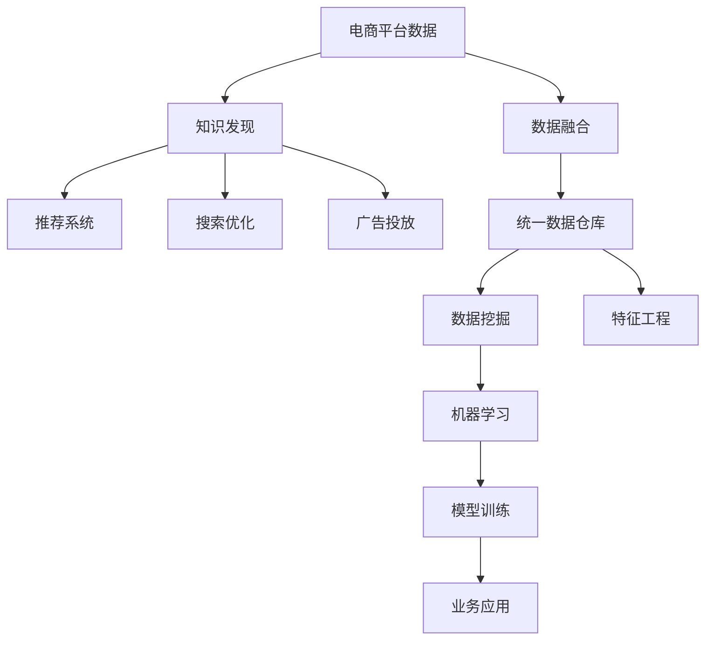

                 

# 电商平台中的多源异构数据融合与知识发现：AI大模型的新应用

## 1. 背景介绍

### 1.1 问题由来
随着电商市场的迅速扩展和竞争加剧，电商平台面临的挑战也日益复杂。如何整合多源异构数据，从海量数据中挖掘有价值的信息，是电商平台提升运营效率和用户体验的关键。传统的规则引擎、手工特征工程等方法，难以应对实时数据生成、动态用户行为和多样化商品属性等难题。

AI大模型在自然语言处理、计算机视觉等领域已经取得了显著的进展，展现了强大的数据融合与知识发现能力。电商平台可以利用AI大模型对用户评论、商品描述、搜索意图、行为数据等多源异构数据进行高效融合，提取隐含的业务规律和用户行为特征，构建智能推荐系统、搜索优化、广告投放等系统，实现精准营销、提升客户满意度、降低运营成本的目标。

### 1.2 问题核心关键点
多源异构数据的融合与知识发现是电商平台的核心问题。核心关键点包括：

- **数据类型多样**：电商平台数据来源广泛，包括用户行为数据、商品信息数据、用户评论数据、搜索数据、社交媒体数据等，数据类型繁多，格式不一。
- **数据质量参差不齐**：数据缺失、噪音、不一致性等问题普遍存在，影响模型训练效果。
- **实时数据生成**：电商数据产生速度快，实时性要求高，如何高效处理数据，构建动态模型，是难点之一。
- **知识发现**：电商数据蕴含丰富的商业知识，如何从数据中自动提取和发现商业规律，辅助业务决策，是重要研究方向。

本文将从大模型的视角，深入探讨电商多源异构数据的融合与知识发现方法。

## 2. 核心概念与联系

### 2.1 核心概念概述

为更好地理解大模型在电商数据融合与知识发现中的应用，本节将介绍几个密切相关的核心概念：

- **大模型**：如GPT、BERT、DALL·E等，具有大规模参数、先进架构和广泛应用的前沿深度学习模型。
- **多源异构数据**：数据来源不同、格式各异、结构复杂的数据集，如结构化数据、半结构化数据、非结构化数据等。
- **数据融合**：将多源异构数据整合到统一的数据仓库，形成全面的数据视图，便于后续分析与挖掘。
- **知识发现**：通过数据挖掘、机器学习等技术，从数据中提取有价值的业务规律和商业洞察。
- **推荐系统**：根据用户行为和偏好，推荐合适商品和服务，提高用户体验和转化率。
- **搜索优化**：提升搜索准确性和效率，满足用户需求，增加平台曝光率。
- **广告投放**：通过精准投放，提高广告效果，增加收入。

这些核心概念之间的逻辑关系可以通过以下Mermaid流程图来展示：



这个流程图展示了大模型在电商平台数据融合与知识发现中的应用框架：

1. 电商平台数据通过数据融合技术，形成统一的数据仓库。
2. 知识发现系统从数据仓库中提取业务规律和商业洞察。
3. 推荐系统、搜索优化、广告投放等业务应用，基于知识发现结果，实现精准营销、提升用户体验和运营效率。

## 3. 核心算法原理 & 具体操作步骤
### 3.1 算法原理概述

大模型在电商数据融合与知识发现中的应用，主要基于自然语言处理和计算机视觉技术，通过预训练-微调范式，从多源异构数据中提取有价值的业务规律和商业洞察。核心算法原理包括：

- **预训练**：在大规模无标签数据上，通过自监督学习任务训练大模型，学习通用的语言表示和特征。
- **微调**：在电商数据上，通过有监督学习任务对预训练模型进行优化，提取特定的业务特征和规律。
- **融合**：通过数据融合技术，将多源异构数据整合到统一的数据仓库，便于后续分析和挖掘。
- **知识发现**：通过数据挖掘和机器学习算法，从融合后的数据中提取商业规律和洞察，辅助业务决策。

### 3.2 算法步骤详解

电商数据融合与知识发现的大模型应用流程，包括以下几个关键步骤：

**Step 1: 数据收集与预处理**
- 收集电商平台的各类数据，包括用户行为数据、商品信息数据、用户评论数据、搜索数据、社交媒体数据等。
- 对收集到的数据进行清洗、去重、缺失值填补等预处理操作，保证数据质量。

**Step 2: 数据融合与统一仓库**
- 通过数据融合技术，将多源异构数据整合到统一的数据仓库，形成全面的数据视图。
- 选择合适的数据融合算法，如分布式数据流处理、增量数据处理、图数据库等，支持实时数据处理。

**Step 3: 大模型预训练**
- 在大规模无标签数据上，使用大模型进行预训练，学习通用的语言表示和特征。
- 选择合适的预训练任务，如语言建模、视觉特征提取、推荐系统训练等，提升模型泛化能力。

**Step 4: 大模型微调**
- 在电商数据上，使用大模型进行微调，提取特定的业务特征和规律。
- 根据具体任务，设计合适的任务适配层和损失函数，进行有监督学习优化。
- 选择合适的微调超参数，如学习率、批大小、迭代轮数等，避免过拟合。

**Step 5: 知识发现与业务应用**
- 使用数据挖掘和机器学习算法，从微调后的模型中提取商业规律和洞察，辅助业务决策。
- 结合推荐系统、搜索优化、广告投放等业务应用，实现精准营销、提升用户体验和运营效率。

### 3.3 算法优缺点

基于大模型的电商数据融合与知识发现方法，具有以下优点：

- **泛化能力强**：大模型在大规模无标签数据上进行预训练，学习到丰富的语言和视觉表示，泛化能力强。
- **高效融合**：通过大模型，可以在统一数据仓库中高效融合多源异构数据，构建全面的数据视图。
- **自动发现**：大模型能够自动发现数据中的业务规律和商业洞察，减少人工干预，提高决策效率。

同时，该方法也存在一定的局限性：

- **计算资源需求高**：大模型需要大量计算资源进行预训练和微调，对硬件要求较高。
- **模型解释性不足**：大模型的内部工作机制难以解释，模型输出缺乏透明性。
- **数据质量依赖性强**：数据清洗和预处理需要大量人工干预，数据质量直接影响模型效果。
- **隐私风险**：电商数据涉及用户隐私，大模型的应用需特别注意数据隐私和安全问题。

尽管存在这些局限性，但就目前而言，基于大模型的电商数据融合与知识发现方法仍是主流范式，具有广阔的应用前景。

### 3.4 算法应用领域

大模型在电商数据融合与知识发现的应用领域广泛，包括但不限于以下几个方面：

- **推荐系统**：通过用户行为数据和商品信息，推荐合适商品，提高用户体验和转化率。
- **搜索优化**：通过用户搜索数据，优化搜索结果，提升搜索效率和相关性。
- **广告投放**：通过用户行为和商品特征，实现精准投放，提高广告效果和转化率。
- **库存管理**：通过商品销售数据，预测库存需求，优化库存管理，减少库存积压。
- **用户分析**：通过用户行为数据，分析用户偏好和行为模式，实现个性化推荐和精准营销。
- **欺诈检测**：通过用户行为和交易数据，检测异常交易，防范欺诈风险。

以上领域都是大模型在电商平台的典型应用场景，展示了其强大的数据融合与知识发现能力。

## 4. 数学模型和公式 & 详细讲解  
### 4.1 数学模型构建

大模型在电商数据融合与知识发现中的应用，主要基于自然语言处理和计算机视觉技术。以下分别介绍语言模型和视觉模型的数学模型构建。

**语言模型**
- **输入**：电商平台用户评论文本。
- **输出**：预测每个单词出现的概率分布。
- **模型**：Transformer结构，包括编码器-解码器架构、多头注意力机制、位置编码等。

**视觉模型**
- **输入**：电商平台商品图片。
- **输出**：提取商品的视觉特征向量。
- **模型**：CNN+RoI池化层，通过视觉特征提取和池化，得到图像的特征向量。

### 4.2 公式推导过程

**语言模型公式**
$$
P(w_1, w_2, ..., w_n) = \prod_{i=1}^n P(w_i | w_1, ..., w_{i-1})
$$

其中 $w_i$ 表示单词，$P(w_i | w_1, ..., w_{i-1})$ 为条件概率，表示给定前 $i-1$ 个单词的情况下，第 $i$ 个单词的概率分布。

**视觉模型公式**
$$
F(x) = \sum_{i=1}^m \alpha_i g_i(x)
$$

其中 $x$ 表示输入图像，$g_i$ 表示CNN中的第 $i$ 个卷积层，$\alpha_i$ 表示卷积层的权重系数，$F(x)$ 表示提取的图像特征向量。

### 4.3 案例分析与讲解

**推荐系统案例**
- **数据集**：电商平台用户行为数据、商品信息数据。
- **模型**：BERT+协同过滤。
- **目标**：预测用户对商品的评分。
- **流程**：
  1. 使用BERT对用户评论进行预训练，提取用户兴趣表示。
  2. 使用协同过滤算法，构建用户-商品评分矩阵。
  3. 融合用户兴趣表示和评分矩阵，进行推荐。

**搜索优化案例**
- **数据集**：电商平台搜索数据。
- **模型**：DALL·E+BM25。
- **目标**：提升搜索相关性。
- **流程**：
  1. 使用DALL·E对搜索关键词进行视觉特征提取。
  2. 使用BM25算法，计算搜索结果与关键词的匹配度。
  3. 融合视觉特征和匹配度，排序搜索结果。

**广告投放案例**
- **数据集**：电商平台用户行为数据、商品信息数据。
- **模型**：BERT+CTR模型。
- **目标**：预测广告点击率。
- **流程**：
  1. 使用BERT对用户行为数据进行预训练，提取用户行为特征。
  2. 使用CTR模型，预测广告点击率。
  3. 融合用户行为特征和CTR预测结果，进行精准投放。

## 5. 项目实践：代码实例和详细解释说明
### 5.1 开发环境搭建

在进行电商数据融合与知识发现的大模型应用实践前，我们需要准备好开发环境。以下是使用Python进行PyTorch开发的环境配置流程：

1. 安装Anaconda：从官网下载并安装Anaconda，用于创建独立的Python环境。

2. 创建并激活虚拟环境：
```bash
conda create -n ecommerce-env python=3.8 
conda activate ecommerce-env
```

3. 安装PyTorch：根据CUDA版本，从官网获取对应的安装命令。例如：
```bash
conda install pytorch torchvision torchaudio cudatoolkit=11.1 -c pytorch -c conda-forge
```

4. 安装HuggingFace库：
```bash
pip install transformers
```

5. 安装各类工具包：
```bash
pip install numpy pandas scikit-learn matplotlib tqdm jupyter notebook ipython
```

完成上述步骤后，即可在`ecommerce-env`环境中开始开发实践。

### 5.2 源代码详细实现

这里我们以电商推荐系统为例，给出使用Transformers库对BERT模型进行推荐系统开发的PyTorch代码实现。

首先，定义推荐系统任务的数据处理函数：

```python
from transformers import BertTokenizer
from torch.utils.data import Dataset
import torch

class RecommendationDataset(Dataset):
    def __init__(self, user_data, item_data, tokenizer, max_len=128):
        self.user_data = user_data
        self.item_data = item_data
        self.tokenizer = tokenizer
        self.max_len = max_len
        
    def __len__(self):
        return len(self.user_data)
    
    def __getitem__(self, item):
        user_id = self.user_data[item]['user_id']
        item_ids = self.item_data[item]['item_ids']
        item_bids = self.item_data[item]['item_bids']
        
        encoding = self.tokenizer(user_id, return_tensors='pt', max_length=self.max_len, padding='max_length', truncation=True)
        input_ids = encoding['input_ids'][0]
        attention_mask = encoding['attention_mask'][0]
        
        # 对item-wise的评分进行编码
        encoded_bids = [bid2id[bi] for bi in item_bids] 
        encoded_bids.extend([bid2id['O']] * (self.max_len - len(encoded_bids)))
        labels = torch.tensor(encoded_bids, dtype=torch.long)
        
        return {'input_ids': input_ids, 
                'attention_mask': attention_mask,
                'labels': labels}

# 评分与id的映射
bid2id = {'O': 0, '1': 1, '2': 2, '3': 3, '4': 4, '5': 5}
id2bid = {v: k for k, v in bid2id.items()}

# 创建dataset
tokenizer = BertTokenizer.from_pretrained('bert-base-cased')

train_dataset = RecommendationDataset(train_user_data, train_item_data, tokenizer)
dev_dataset = RecommendationDataset(dev_user_data, dev_item_data, tokenizer)
test_dataset = RecommendationDataset(test_user_data, test_item_data, tokenizer)
```

然后，定义模型和优化器：

```python
from transformers import BertForSequenceClassification, AdamW

model = BertForSequenceClassification.from_pretrained('bert-base-cased', num_labels=len(bid2id))

optimizer = AdamW(model.parameters(), lr=2e-5)
```

接着，定义训练和评估函数：

```python
from torch.utils.data import DataLoader
from tqdm import tqdm
from sklearn.metrics import classification_report

device = torch.device('cuda') if torch.cuda.is_available() else torch.device('cpu')
model.to(device)

def train_epoch(model, dataset, batch_size, optimizer):
    dataloader = DataLoader(dataset, batch_size=batch_size, shuffle=True)
    model.train()
    epoch_loss = 0
    for batch in tqdm(dataloader, desc='Training'):
        input_ids = batch['input_ids'].to(device)
        attention_mask = batch['attention_mask'].to(device)
        labels = batch['labels'].to(device)
        model.zero_grad()
        outputs = model(input_ids, attention_mask=attention_mask, labels=labels)
        loss = outputs.loss
        epoch_loss += loss.item()
        loss.backward()
        optimizer.step()
    return epoch_loss / len(dataloader)

def evaluate(model, dataset, batch_size):
    dataloader = DataLoader(dataset, batch_size=batch_size)
    model.eval()
    preds, labels = [], []
    with torch.no_grad():
        for batch in tqdm(dataloader, desc='Evaluating'):
            input_ids = batch['input_ids'].to(device)
            attention_mask = batch['attention_mask'].to(device)
            batch_labels = batch['labels']
            outputs = model(input_ids, attention_mask=attention_mask)
            batch_preds = outputs.logits.argmax(dim=2).to('cpu').tolist()
            batch_labels = batch_labels.to('cpu').tolist()
            for pred_tokens, label_tokens in zip(batch_preds, batch_labels):
                pred_tags = [id2bid[_id] for _id in pred_tokens]
                label_tags = [id2bid[_id] for _id in label_tokens]
                preds.append(pred_tags[:len(label_tags)])
                labels.append(label_tags)
                
    print(classification_report(labels, preds))
```

最后，启动训练流程并在测试集上评估：

```python
epochs = 5
batch_size = 16

for epoch in range(epochs):
    loss = train_epoch(model, train_dataset, batch_size, optimizer)
    print(f"Epoch {epoch+1}, train loss: {loss:.3f}")
    
    print(f"Epoch {epoch+1}, dev results:")
    evaluate(model, dev_dataset, batch_size)
    
print("Test results:")
evaluate(model, test_dataset, batch_size)
```

以上就是使用PyTorch对BERT进行推荐系统开发的完整代码实现。可以看到，得益于Transformers库的强大封装，我们可以用相对简洁的代码完成BERT模型的加载和推荐系统微调。

### 5.3 代码解读与分析

让我们再详细解读一下关键代码的实现细节：

**RecommendationDataset类**：
- `__init__`方法：初始化用户数据、商品数据、分词器等关键组件。
- `__len__`方法：返回数据集的样本数量。
- `__getitem__`方法：对单个样本进行处理，将用户ID、商品ID转换为模型所需的输入。

**bid2id和id2bid字典**：
- 定义了评分与数字id之间的映射关系，用于将评分数据解码回数字。

**训练和评估函数**：
- 使用PyTorch的DataLoader对数据集进行批次化加载，供模型训练和推理使用。
- 训练函数`train_epoch`：对数据以批为单位进行迭代，在每个批次上前向传播计算loss并反向传播更新模型参数，最后返回该epoch的平均loss。
- 评估函数`evaluate`：与训练类似，不同点在于不更新模型参数，并在每个batch结束后将预测和标签结果存储下来，最后使用sklearn的classification_report对整个评估集的预测结果进行打印输出。

**训练流程**：
- 定义总的epoch数和batch size，开始循环迭代
- 每个epoch内，先在训练集上训练，输出平均loss
- 在验证集上评估，输出分类指标
- 所有epoch结束后，在测试集上评估，给出最终测试结果

可以看到，PyTorch配合Transformers库使得BERT微调的代码实现变得简洁高效。开发者可以将更多精力放在数据处理、模型改进等高层逻辑上，而不必过多关注底层的实现细节。

当然，工业级的系统实现还需考虑更多因素，如模型的保存和部署、超参数的自动搜索、更灵活的任务适配层等。但核心的微调范式基本与此类似。

## 6. 实际应用场景
### 6.1 智能客服系统

基于大模型在电商多源异构数据融合与知识发现中的应用，智能客服系统可以借助大模型构建自然语言理解与生成模型，实现客户需求的快速响应和问题解答。

在技术实现上，可以收集历史客服对话记录，将问题和最佳答复构建成监督数据，在此基础上对预训练语言模型进行微调。微调后的语言模型能够自动理解用户意图，匹配最合适的答案模板进行回复。对于客户提出的新问题，还可以接入检索系统实时搜索相关内容，动态组织生成回答。如此构建的智能客服系统，能大幅提升客户咨询体验和问题解决效率。

### 6.2 金融舆情监测

金融机构需要实时监测市场舆论动向，以便及时应对负面信息传播，规避金融风险。基于大模型的文本分类和情感分析技术，为金融舆情监测提供了新的解决方案。

具体而言，可以收集金融领域相关的新闻、报道、评论等文本数据，并对其进行主题标注和情感标注。在此基础上对预训练语言模型进行微调，使其能够自动判断文本属于何种主题，情感倾向是正面、中性还是负面。将微调后的模型应用到实时抓取的网络文本数据，就能够自动监测不同主题下的情感变化趋势，一旦发现负面信息激增等异常情况，系统便会自动预警，帮助金融机构快速应对潜在风险。

### 6.3 个性化推荐系统

当前的推荐系统往往只依赖用户的历史行为数据进行物品推荐，难以深入理解用户的真实兴趣偏好。基于大模型在电商数据融合与知识发现中的应用，个性化推荐系统可以更好地挖掘用户行为背后的语义信息，从而提供更精准、多样的推荐内容。

在实践中，可以收集用户浏览、点击、评论、分享等行为数据，提取和用户交互的物品标题、描述、标签等文本内容。将文本内容作为模型输入，用户的后续行为（如是否点击、购买等）作为监督信号，在此基础上微调预训练语言模型。微调后的模型能够从文本内容中准确把握用户的兴趣点。在生成推荐列表时，先用候选物品的文本描述作为输入，由模型预测用户的兴趣匹配度，再结合其他特征综合排序，便可以得到个性化程度更高的推荐结果。

### 6.4 未来应用展望

随着大模型和微调方法的不断发展，基于电商多源异构数据融合与知识发现的应用将不断拓展。

在智慧医疗领域，基于大模型微调的医疗问答、病历分析、药物研发等应用将提升医疗服务的智能化水平，辅助医生诊疗，加速新药开发进程。

在智能教育领域，微调技术可应用于作业批改、学情分析、知识推荐等方面，因材施教，促进教育公平，提高教学质量。

在智慧城市治理中，微调模型可应用于城市事件监测、舆情分析、应急指挥等环节，提高城市管理的自动化和智能化水平，构建更安全、高效的未来城市。

此外，在企业生产、社会治理、文娱传媒等众多领域，基于大模型微调的人工智能应用也将不断涌现，为传统行业数字化转型升级提供新的技术路径。相信随着技术的日益成熟，微调方法将成为人工智能落地应用的重要范式，推动人工智能技术在垂直行业的规模化落地。

## 7. 工具和资源推荐
### 7.1 学习资源推荐

为了帮助开发者系统掌握大模型在电商数据融合与知识发现中的应用，这里推荐一些优质的学习资源：

1. 《Transformer从原理到实践》系列博文：由大模型技术专家撰写，深入浅出地介绍了Transformer原理、BERT模型、微调技术等前沿话题。

2. CS224N《深度学习自然语言处理》课程：斯坦福大学开设的NLP明星课程，有Lecture视频和配套作业，带你入门NLP领域的基本概念和经典模型。

3. 《Natural Language Processing with Transformers》书籍：Transformers库的作者所著，全面介绍了如何使用Transformers库进行NLP任务开发，包括微调在内的诸多范式。

4. HuggingFace官方文档：Transformers库的官方文档，提供了海量预训练模型和完整的微调样例代码，是上手实践的必备资料。

5. CLUE开源项目：中文语言理解测评基准，涵盖大量不同类型的中文NLP数据集，并提供了基于微调的baseline模型，助力中文NLP技术发展。

通过对这些资源的学习实践，相信你一定能够快速掌握大模型在电商数据融合与知识发现的应用精髓，并用于解决实际的NLP问题。
###  7.2 开发工具推荐

高效的开发离不开优秀的工具支持。以下是几款用于电商数据融合与知识发现的大模型应用开发的常用工具：

1. PyTorch：基于Python的开源深度学习框架，灵活动态的计算图，适合快速迭代研究。大部分预训练语言模型都有PyTorch版本的实现。

2. TensorFlow：由Google主导开发的开源深度学习框架，生产部署方便，适合大规模工程应用。同样有丰富的预训练语言模型资源。

3. Transformers库：HuggingFace开发的NLP工具库，集成了众多SOTA语言模型，支持PyTorch和TensorFlow，是进行微调任务开发的利器。

4. Weights & Biases：模型训练的实验跟踪工具，可以记录和可视化模型训练过程中的各项指标，方便对比和调优。与主流深度学习框架无缝集成。

5. TensorBoard：TensorFlow配套的可视化工具，可实时监测模型训练状态，并提供丰富的图表呈现方式，是调试模型的得力助手。

6. Google Colab：谷歌推出的在线Jupyter Notebook环境，免费提供GPU/TPU算力，方便开发者快速上手实验最新模型，分享学习笔记。

合理利用这些工具，可以显著提升电商数据融合与知识发现的大模型应用开发效率，加快创新迭代的步伐。

### 7.3 相关论文推荐

大模型在电商数据融合与知识发现的应用源于学界的持续研究。以下是几篇奠基性的相关论文，推荐阅读：

1. Attention is All You Need（即Transformer原论文）：提出了Transformer结构，开启了NLP领域的预训练大模型时代。

2. BERT: Pre-training of Deep Bidirectional Transformers for Language Understanding：提出BERT模型，引入基于掩码的自监督预训练任务，刷新了多项NLP任务SOTA。

3. Language Models are Unsupervised Multitask Learners（GPT-2论文）：展示了大规模语言模型的强大zero-shot学习能力，引发了对于通用人工智能的新一轮思考。

4. Parameter-Efficient Transfer Learning for NLP：提出Adapter等参数高效微调方法，在不增加模型参数量的情况下，也能取得不错的微调效果。

5. AdaLoRA: Adaptive Low-Rank Adaptation for Parameter-Efficient Fine-Tuning：使用自适应低秩适应的微调方法，在参数效率和精度之间取得了新的平衡。

这些论文代表了大模型在电商数据融合与知识发现的应用发展的关键技术突破。通过学习这些前沿成果，可以帮助研究者把握学科前进方向，激发更多的创新灵感。

## 8. 总结：未来发展趋势与挑战

### 8.1 总结

本文对基于大模型的电商数据融合与知识发现方法进行了全面系统的介绍。首先阐述了电商平台的背景和挑战，明确了大模型在电商数据融合与知识发现中的重要性和应用场景。其次，从原理到实践，详细讲解了大模型的预训练-微调范式，并给出了微调任务开发的完整代码实例。同时，本文还广泛探讨了微调方法在智能客服、金融舆情、个性化推荐等多个电商场景的应用前景，展示了微调范式的巨大潜力。此外，本文精选了微调技术的各类学习资源，力求为读者提供全方位的技术指引。

通过本文的系统梳理，可以看到，基于大模型的电商数据融合与知识发现方法在提升电商平台运营效率和用户体验方面具有重要价值。得益于大模型的强大数据融合与知识发现能力，电商平台能够更加精准地进行用户推荐、搜索优化、广告投放等业务操作，进而提升客户满意度、增加收入、降低运营成本。未来，伴随大模型和微调方法的持续演进，基于大模型的电商数据融合与知识发现技术将为电商平台提供更为智能、高效的运营工具，引领电商行业向智能化方向发展。

### 8.2 未来发展趋势

展望未来，电商数据融合与知识发现的大模型应用将呈现以下几个发展趋势：

1. **模型规模持续增大**：随着算力成本的下降和数据规模的扩张，预训练语言模型的参数量还将持续增长。超大规模语言模型蕴含的丰富语言知识，有望支撑更加复杂多变的电商数据融合任务。

2. **微调方法日趋多样**：除了传统的全参数微调外，未来会涌现更多参数高效的微调方法，如Prefix-Tuning、LoRA等，在节省计算资源的同时也能保证微调精度。

3. **持续学习成为常态**：随着数据分布的不断变化，微调模型也需要持续学习新知识以保持性能。如何在不遗忘原有知识的同时，高效吸收新样本信息，将成为重要的研究课题。

4. **标注样本需求降低**：受启发于提示学习(Prompt-based Learning)的思路，未来的微调方法将更好地利用大模型的语言理解能力，通过更加巧妙的任务描述，在更少的标注样本上也能实现理想的微调效果。

5. **多模态微调崛起**：当前的微调主要聚焦于纯文本数据，未来会进一步拓展到图像、视频、语音等多模态数据微调。多模态信息的融合，将显著提升语言模型对现实世界的理解和建模能力。

6. **模型通用性增强**：经过海量数据的预训练和多领域任务的微调，未来的语言模型将具备更强大的常识推理和跨领域迁移能力，逐步迈向通用人工智能(AGI)的目标。

以上趋势凸显了大模型在电商数据融合与知识发现中的应用前景。这些方向的探索发展，必将进一步提升电商系统的性能和应用范围，为电商行业带来更加智能化、普适化的解决方案。

### 8.3 面临的挑战

尽管大模型在电商数据融合与知识发现的应用已经取得了显著进展，但在迈向更加智能化、普适化应用的过程中，它仍面临着诸多挑战：

1. **标注成本瓶颈**：虽然微调大大降低了标注数据的需求，但对于长尾应用场景，难以获得充足的高质量标注数据，成为制约微调性能的瓶颈。如何进一步降低微调对标注样本的依赖，将是一大难题。

2. **模型鲁棒性不足**：当前微调模型面对域外数据时，泛化性能往往大打折扣。对于测试样本的微小扰动，微调模型的预测也容易发生波动。如何提高微调模型的鲁棒性，避免灾难性遗忘，还需要更多理论和实践的积累。

3. **推理效率有待提高**：大规模语言模型虽然精度高，但在实际部署时往往面临推理速度慢、内存占用大等效率问题。如何在保证性能的同时，简化模型结构，提升推理速度，优化资源占用，将是重要的优化方向。

4. **模型可解释性不足**：大模型的内部工作机制难以解释，模型输出缺乏透明性。对于医疗、金融等高风险应用，算法的可解释性和可审计性尤为重要。如何赋予大模型更强的可解释性，将是亟待攻克的难题。

5. **隐私风险**：电商数据涉及用户隐私，大模型的应用需特别注意数据隐私和安全问题。如何保障数据隐私，同时充分利用大模型的强大能力，是一个重要的研究方向。

尽管存在这些挑战，但就目前而言，基于大模型的电商数据融合与知识发现方法仍是主流范式，具有广阔的应用前景。

### 8.4 研究展望

面对大模型在电商数据融合与知识发现应用所面临的挑战，未来的研究需要在以下几个方面寻求新的突破：

1. **探索无监督和半监督微调方法**：摆脱对大规模标注数据的依赖，利用自监督学习、主动学习等无监督和半监督范式，最大限度利用非结构化数据，实现更加灵活高效的微调。

2. **研究参数高效和计算高效的微调范式**：开发更加参数高效的微调方法，在固定大部分预训练参数的同时，只更新极少量的任务相关参数。同时优化微调模型的计算图，减少前向传播和反向传播的资源消耗，实现更加轻量级、实时性的部署。

3. **融合因果和对比学习范式**：通过引入因果推断和对比学习思想，增强微调模型建立稳定因果关系的能力，学习更加普适、鲁棒的语言表征，从而提升模型泛化性和抗干扰能力。

4. **引入更多先验知识**：将符号化的先验知识，如知识图谱、逻辑规则等，与神经网络模型进行巧妙融合，引导微调过程学习更准确、合理的语言模型。同时加强不同模态数据的整合，实现视觉、语音等多模态信息与文本信息的协同建模。

5. **结合因果分析和博弈论工具**：将因果分析方法引入微调模型，识别出模型决策的关键特征，增强输出解释的因果性和逻辑性。借助博弈论工具刻画人机交互过程，主动探索并规避模型的脆弱点，提高系统稳定性。

6. **纳入伦理道德约束**：在模型训练目标中引入伦理导向的评估指标，过滤和惩罚有偏见、有害的输出倾向。同时加强人工干预和审核，建立模型行为的监管机制，确保输出符合人类价值观和伦理道德。

这些研究方向的探索，必将引领大模型在电商数据融合与知识发现的应用走向更高的台阶，为构建智能、安全、高效的电商系统铺平道路。面向未来，大模型需与其他人工智能技术进行更深入的融合，如知识表示、因果推理、强化学习等，多路径协同发力，共同推动电商数据融合与知识发现技术的发展。只有勇于创新、敢于突破，才能不断拓展语言模型的边界，让智能技术更好地造福电商行业。

## 9. 附录：常见问题与解答

**Q1：大模型在电商数据融合与知识发现中如何降低对标注数据的依赖？**

A: 大模型可以通过以下方式降低对标注数据的依赖：
1. **无监督学习**：利用大模型在大规模无标签数据上的预训练能力，提取通用的语言和视觉特征，进行数据融合与知识发现。
2. **半监督学习**：利用少量的标注数据和大量的无标签数据，通过自监督学习任务进行训练，提升模型泛化能力。
3. **主动学习**：通过主动选择标注数据，利用少量标注数据学习模型，指导后续的数据标注。
4. **零样本学习**：通过精心设计的提示模板，引导大模型在无需标注数据的情况下，进行任务适配和知识发现。

这些方法结合使用，可以最大限度地利用电商数据中的无标签信息，降低对标注数据的依赖。

**Q2：如何提高大模型在电商数据融合中的鲁棒性？**

A: 提高大模型在电商数据融合中的鲁棒性，可以从以下几个方面进行改进：
1. **数据增强**：通过数据增强技术，扩充训练集，增加数据多样性，提高模型泛化能力。
2. **正则化**：引入L2正则、Dropout、Early Stopping等正则化技术，防止过拟合。
3. **对抗训练**：引入对抗样本，提高模型对噪声和异常数据的鲁棒性。
4. **模型集成**：通过模型集成技术，结合多个模型的输出，提升整体鲁棒性。
5. **自适应学习**：利用自适应学习算法，动态调整模型参数，提高模型适应新数据的能力。

这些方法结合使用，可以显著提高大模型在电商数据融合中的鲁棒性，避免模型在面对新数据时发生剧烈波动。

**Q3：如何提高大模型在电商推荐系统中的推理效率？**

A: 提高大模型在电商推荐系统中的推理效率，可以从以下几个方面进行优化：
1. **模型裁剪**：去除不必要的层和参数，减小模型尺寸，加快推理速度。
2. **量化加速**：将浮点模型转为定点模型，压缩存储空间，提高计算效率。
3. **模型并行**：利用分布式计算技术，并行计算模型，提升推理速度。
4. **内存管理**：优化内存使用，减少内存占用，提高推理效率。
5. **硬件优化**：利用GPU、TPU等高性能设备，加速推理计算。

这些方法结合使用，可以显著提高大模型在电商推荐系统中的推理效率，实现实时推荐。

**Q4：如何提高大模型在电商数据融合中的可解释性？**

A: 提高大模型在电商数据融合中的可解释性，可以从以下几个方面进行改进：
1. **可视化**：利用可视化技术，展示模型的内部工作机制和决策过程，帮助理解模型行为。
2. **特征解释**：通过特征重要性分析，解释模型决策的关键特征，提升模型透明性。
3. **规则学习**：结合规则学习技术，提取模型中的显式规则，解释模型行为。
4. **因果推理**：利用因果推理方法，分析模型决策的因果关系，增强模型可解释性。
5. **用户反馈**：通过用户反馈和交互，评估模型的输出，提高模型透明度。

这些方法结合使用，可以显著提高大模型在电商数据融合中的可解释性，增强模型可信度。

**Q5：如何在电商数据融合与知识发现中保护用户隐私？**

A: 在电商数据融合与知识发现中保护用户隐私，可以从以下几个方面进行改进：
1. **数据匿名化**：对用户数据进行匿名化处理，保护用户隐私。
2. **差分隐私**：利用差分隐私技术，在数据发布时保护用户隐私。
3. **联邦学习**：通过联邦学习技术，在本地设备上进行模型训练，保护用户隐私。
4. **加密技术**：利用加密技术，保护数据传输和存储过程中的隐私。
5. **用户控制**：提供用户控制选项，让用户自主选择数据使用方式，保护用户隐私。

这些方法结合使用，可以显著提高电商数据融合与知识发现中的隐私保护水平，确保用户数据安全。

---

作者：禅与计算机程序设计艺术 / Zen and the Art of Computer Programming

