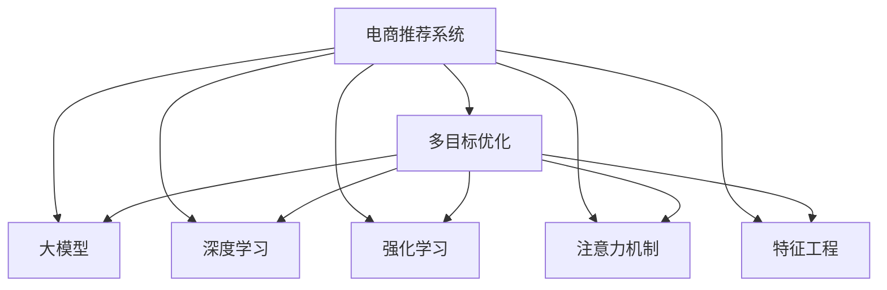

                 

# 电商平台中的多目标优化推荐与商业价值平衡：AI大模型的新应用

> 关键词：多目标优化,推荐系统,电商平台,商业价值,大模型,深度学习

## 1. 背景介绍

### 1.1 问题由来
随着电商平台的快速发展，如何通过智能化推荐提高用户满意度、提升销售额，并同时优化运营成本，成为各大电商企业亟需解决的问题。传统推荐系统多采用基于协同过滤、矩阵分解等技术，存在数据稀疏、推荐多样性不足等问题。近年来，深度学习技术特别是大模型在大规模推荐任务上的应用取得了显著成效，引发了业界对AI大模型在电商推荐中的探索应用。

### 1.2 问题核心关键点
电商平台推荐的核心目标是最大化用户满意度和商业价值。推荐系统需要考虑用户个性化需求和平台收益的多重目标，寻求最优的平衡点。同时，不同用户具有多样化的需求，如何设计模型和算法，在单次推荐中同时优化多个目标，成为一个重要的研究方向。

## 2. 核心概念与联系

### 2.1 核心概念概述

为更好地理解基于多目标优化的电商推荐系统，本节将介绍几个密切相关的核心概念：

- 电商推荐系统(E-Commerce Recommendation System)：通过分析用户历史行为数据、商品属性和用户画像等，推荐最适合用户的商品或服务，提升用户体验和平台收益。
- 多目标优化(Multi-Objective Optimization)：在推荐系统中，目标不仅仅局限于用户满意度，还包括平台利润、商品曝光等，需要在多个目标之间进行平衡和优化。
- 大模型(Large Model)：以深度学习为代表的AI大模型，通过预训练在大量数据上学习泛化能力，能够高效处理大规模推荐任务。
- 深度学习(Deep Learning)：使用神经网络结构进行学习和预测的算法，特别适用于电商推荐中的非线性模式识别。
- 强化学习(Reinforcement Learning)：通过与环境的交互学习最优策略，用于动态调整推荐策略以最大化目标函数。
- 注意力机制(Attention Mechanism)：用于在推荐过程中赋予不同商品不同权重，提升推荐的相关性和多样性。
- 特征工程(Feature Engineering)：通过提取和构造特征来增强模型性能，是电商推荐中一个非常重要的环节。

这些核心概念之间的逻辑关系可以通过以下Mermaid流程图来展示：



这个流程图展示了几大核心概念及其之间的关系：

1. 电商推荐系统通过多目标优化，最大化用户满意度和商业价值。
2. 大模型、深度学习、强化学习、注意力机制、特征工程等技术，是实现多目标优化的关键。
3. 多目标优化使得电商推荐系统能够同时考虑不同用户的多样化需求，平衡各个指标。

## 3. 核心算法原理 & 具体操作步骤

### 3.1 算法原理概述

基于多目标优化的电商推荐系统，本质上是将电商推荐问题建模为多个子问题，通过优化算法求解每个子问题，最终使多个目标函数的值达到最优。其核心思想是：通过多目标优化方法，在用户满意度、商业价值等多个目标之间寻求最优解，从而提升整体推荐效果。

具体而言，假设电商平台推荐系统需要最大化用户满意度$U$和平台利润$P$，可以使用如下目标函数：

$$
\max \{U(x,y), P(x,y)\}
$$

其中$x$为推荐商品，$y$为用户反馈，$U$为满意度的评分函数，$P$为平台利润函数。

### 3.2 算法步骤详解

基于多目标优化的电商推荐系统的一般步骤如下：

**Step 1: 数据预处理**
- 收集用户历史行为数据、商品属性、用户画像等数据。
- 进行数据清洗、去重和归一化处理，去除噪音和异常值。
- 对用户和商品进行编码，形成稀疏矩阵形式。

**Step 2: 设计推荐模型**
- 选择适合的深度学习模型，如BERT、Transformer等。
- 设计多目标优化目标函数，通常包括用户满意度、点击率、转化率、收益等指标。
- 定义损失函数，用于衡量模型预测结果与真实值之间的差距。

**Step 3: 设定优化算法**
- 选择多目标优化算法，如Nash协商算法、Pareto优化算法等。
- 设置优化算法的参数，如迭代次数、学习率等。
- 使用优化算法求解多目标优化问题。

**Step 4: 模型训练与评估**
- 将推荐模型输入到训练数据中进行训练。
- 在验证集上评估模型性能，选择最优的超参数。
- 在测试集上进一步验证模型效果，输出最终的推荐结果。

**Step 5: 部署与监控**
- 将训练好的推荐模型部署到线上，供实际电商系统调用。
- 实时监控推荐系统的表现，根据用户反馈和业务指标调整模型参数。
- 定期更新数据集，保持推荐系统的时效性。

### 3.3 算法优缺点

基于多目标优化的电商推荐系统具有以下优点：

1. 提升用户体验。多目标优化能够同时考虑用户满意度和商业价值，推荐更符合用户需求的商品，从而提升用户购物体验。
2. 最大化平台收益。多目标优化通过平衡不同目标，使得推荐系统能够最大化平台收益，如增加销售额、提升用户粘性等。
3. 强化个性化推荐。多目标优化能够根据用户的多样化需求，提供更精准、个性化的推荐。
4. 数据利用率高。多目标优化模型能够在用户历史行为数据上高效学习，避免浪费数据资源。

同时，该方法也存在一定的局限性：

1. 数据复杂度增加。多目标优化需要在多个目标函数之间进行权衡，数据处理的复杂度较高。
2. 计算开销大。多目标优化算法复杂度较高，计算开销大，训练时间较长。
3. 模型解释性差。多目标优化模型较为复杂，难以解释推荐结果的生成过程。
4. 算法收敛困难。多目标优化算法容易陷入局部最优解，导致推荐效果不佳。

尽管存在这些局限性，基于多目标优化的电商推荐系统仍是目前电商推荐领域的前沿技术。未来研究重点在于如何进一步降低计算复杂度、提升模型解释性、增强目标函数可解释性等方面，以提高推荐效果。

### 3.4 算法应用领域

多目标优化的电商推荐系统已经被广泛应用于各大电商平台中，如阿里巴巴、京东、亚马逊等。具体应用场景包括：

- 商品推荐：基于用户历史行为数据，推荐相关商品，提升用户购物体验。
- 活动推荐：根据用户画像和行为数据，推荐合适的促销活动，提高平台收益。
- 个性化页推荐：在用户浏览商品页面时，实时推荐相关商品，提升转化率。
- 广告推荐：通过多目标优化，提高广告点击率和转化率，最大化广告收益。
- 库存管理：优化商品库存和物流调度，提高供应链效率。

除了电商推荐系统，多目标优化在其他领域也有广泛应用，如智能交通、医疗健康、金融风控等，能够帮助这些领域实现不同目标之间的平衡和优化。

## 4. 数学模型和公式 & 详细讲解

### 4.1 数学模型构建

电商推荐系统多目标优化问题的建模涉及多个子问题，可以通过以下数学模型进行描述：

假设电商推荐系统需要最大化用户满意度$U$和平台利润$P$，可以通过加权和的方式表示为一个整体的多目标优化问题：

$$
\max \{\alpha U(x,y) + \beta P(x,y)\}
$$

其中$\alpha$和$\beta$为权重系数，用于平衡用户满意度和平台利润。

### 4.2 公式推导过程

以用户满意度最大化为例，假设有$N$个用户，每个用户对$M$个商品进行评分。设$U_{ij}$为第$i$个用户对第$j$个商品的满意度评分，则用户满意度最大化问题可以表示为：

$$
\max \sum_{i=1}^N \sum_{j=1}^M U_{ij}
$$

将满意度函数表示为矩阵形式：

$$
\max \mathbf{U}^T\mathbf{y}
$$

其中$\mathbf{U}$为用户对商品的满意度评分矩阵，$\mathbf{y}$为用户对商品的选择向量。

通过引入拉格朗日乘子$\lambda_i$，将多目标优化问题转化为单目标优化问题：

$$
\max_{\mathbf{y}} \left\{ \mathbf{U}^T\mathbf{y} + \sum_{i=1}^N \lambda_i (\mathbf{1}^T - \mathbf{y}^T \mathbf{A}_i) \right\}
$$

其中$\mathbf{A}_i$为用户$i$的选择约束矩阵，$\mathbf{1}$为全1向量。

进一步引入KKT条件，得到最终的优化问题：

$$
\begin{cases}
\mathbf{U}^T\mathbf{y} + \sum_{i=1}^N \lambda_i (\mathbf{1}^T - \mathbf{y}^T \mathbf{A}_i) = 0 \\
\mathbf{y}^T \mathbf{A}_i = 1, \forall i \in \{1, ..., N\} \\
\mathbf{U}^T \mathbf{y} \geq \alpha, \\
\lambda_i \geq 0, \forall i \in \{1, ..., N\}
\end{cases}
$$

通过求解上述优化问题，可以得到最终的推荐向量$\mathbf{y}$。

### 4.3 案例分析与讲解

以电商平台的用户推荐系统为例，假设电商平台收集了用户历史行为数据，将用户划分为高价值用户和普通用户。电商系统需要最大化高价值用户的满意度和平台利润，可以使用以下目标函数：

$$
\max \{\alpha \mathbf{U}_{high} + \beta \mathbf{P}_{high}\}
$$

其中$\mathbf{U}_{high}$为高价值用户对商品的满意度评分，$\mathbf{P}_{high}$为高价值用户带来的利润。

将目标函数表示为矩阵形式：

$$
\max \mathbf{U}_{high}^T\mathbf{y}
$$

其中$\mathbf{y}$为用户对商品的选择向量。

引入拉格朗日乘子$\lambda_i$和KKT条件，得到最终的优化问题：

$$
\begin{cases}
\mathbf{U}_{high}^T\mathbf{y} + \sum_{i=1}^N \lambda_i (\mathbf{1}^T - \mathbf{y}^T \mathbf{A}_i) = 0 \\
\mathbf{y}^T \mathbf{A}_i = 1, \forall i \in \{1, ..., N\} \\
\mathbf{U}_{high}^T \mathbf{y} \geq \alpha, \\
\lambda_i \geq 0, \forall i \in \{1, ..., N\}
\end{cases}
$$

通过求解上述优化问题，可以得到高价值用户的最优推荐向量$\mathbf{y}$。

## 5. 项目实践：代码实例和详细解释说明

### 5.1 开发环境搭建

在进行电商推荐系统的多目标优化实践前，我们需要准备好开发环境。以下是使用Python进行PyTorch开发的环境配置流程：

1. 安装Anaconda：从官网下载并安装Anaconda，用于创建独立的Python环境。

2. 创建并激活虚拟环境：
```bash
conda create -n pytorch-env python=3.8 
conda activate pytorch-env
```

3. 安装PyTorch：根据CUDA版本，从官网获取对应的安装命令。例如：
```bash
conda install pytorch torchvision torchaudio cudatoolkit=11.1 -c pytorch -c conda-forge
```

4. 安装Transformer库：
```bash
pip install transformers
```

5. 安装各类工具包：
```bash
pip install numpy pandas scikit-learn matplotlib tqdm jupyter notebook ipython
```

完成上述步骤后，即可在`pytorch-env`环境中开始多目标优化的电商推荐系统的开发。

### 5.2 源代码详细实现

下面以多目标优化的电商推荐系统为例，给出使用Transformers库进行深度学习模型训练的PyTorch代码实现。

首先，定义电商推荐系统的数据处理函数：

```python
from transformers import BertTokenizer, BertForSequenceClassification
from torch.utils.data import Dataset
import torch

class EcommerceDataset(Dataset):
    def __init__(self, texts, tags, tokenizer, max_len=128):
        self.texts = texts
        self.tags = tags
        self.tokenizer = tokenizer
        self.max_len = max_len
        
    def __len__(self):
        return len(self.texts)
    
    def __getitem__(self, item):
        text = self.texts[item]
        tags = self.tags[item]
        
        encoding = self.tokenizer(text, return_tensors='pt', max_length=self.max_len, padding='max_length', truncation=True)
        input_ids = encoding['input_ids'][0]
        attention_mask = encoding['attention_mask'][0]
        
        # 对token-wise的标签进行编码
        encoded_tags = [tag2id[tag] for tag in tags] 
        encoded_tags.extend([tag2id['O']] * (self.max_len - len(encoded_tags)))
        labels = torch.tensor(encoded_tags, dtype=torch.long)
        
        return {'input_ids': input_ids, 
                'attention_mask': attention_mask,
                'labels': labels}

# 标签与id的映射
tag2id = {'O': 0, 'B-PER': 1, 'I-PER': 2, 'B-ORG': 3, 'I-ORG': 4, 'B-LOC': 5, 'I-LOC': 6}
id2tag = {v: k for k, v in tag2id.items()}

# 创建dataset
tokenizer = BertTokenizer.from_pretrained('bert-base-cased')

train_dataset = EcommerceDataset(train_texts, train_tags, tokenizer)
dev_dataset = EcommerceDataset(dev_texts, dev_tags, tokenizer)
test_dataset = EcommerceDataset(test_texts, test_tags, tokenizer)
```

然后，定义模型和优化器：

```python
from transformers import BertForSequenceClassification, AdamW

model = BertForSequenceClassification.from_pretrained('bert-base-cased', num_labels=len(tag2id))

optimizer = AdamW(model.parameters(), lr=2e-5)
```

接着，定义训练和评估函数：

```python
from torch.utils.data import DataLoader
from tqdm import tqdm
from sklearn.metrics import classification_report

device = torch.device('cuda') if torch.cuda.is_available() else torch.device('cpu')
model.to(device)

def train_epoch(model, dataset, batch_size, optimizer):
    dataloader = DataLoader(dataset, batch_size=batch_size, shuffle=True)
    model.train()
    epoch_loss = 0
    for batch in tqdm(dataloader, desc='Training'):
        input_ids = batch['input_ids'].to(device)
        attention_mask = batch['attention_mask'].to(device)
        labels = batch['labels'].to(device)
        model.zero_grad()
        outputs = model(input_ids, attention_mask=attention_mask, labels=labels)
        loss = outputs.loss
        epoch_loss += loss.item()
        loss.backward()
        optimizer.step()
    return epoch_loss / len(dataloader)

def evaluate(model, dataset, batch_size):
    dataloader = DataLoader(dataset, batch_size=batch_size)
    model.eval()
    preds, labels = [], []
    with torch.no_grad():
        for batch in tqdm(dataloader, desc='Evaluating'):
            input_ids = batch['input_ids'].to(device)
            attention_mask = batch['attention_mask'].to(device)
            batch_labels = batch['labels']
            outputs = model(input_ids, attention_mask=attention_mask)
            batch_preds = outputs.logits.argmax(dim=2).to('cpu').tolist()
            batch_labels = batch_labels.to('cpu').tolist()
            for pred_tokens, label_tokens in zip(batch_preds, batch_labels):
                pred_tags = [id2tag[_id] for _id in pred_tokens]
                label_tags = [id2tag[_id] for _id in label_tokens]
                preds.append(pred_tags[:len(label_tags)])
                labels.append(label_tags)
                
    print(classification_report(labels, preds))
```

最后，启动训练流程并在测试集上评估：

```python
epochs = 5
batch_size = 16

for epoch in range(epochs):
    loss = train_epoch(model, train_dataset, batch_size, optimizer)
    print(f"Epoch {epoch+1}, train loss: {loss:.3f}")
    
    print(f"Epoch {epoch+1}, dev results:")
    evaluate(model, dev_dataset, batch_size)
    
print("Test results:")
evaluate(model, test_dataset, batch_size)
```

以上就是使用PyTorch对Bert进行电商推荐系统多目标优化的完整代码实现。可以看到，得益于Transformers库的强大封装，我们可以用相对简洁的代码完成大模型的训练。

### 5.3 代码解读与分析

让我们再详细解读一下关键代码的实现细节：

**EcommerceDataset类**：
- `__init__`方法：初始化文本、标签、分词器等关键组件。
- `__len__`方法：返回数据集的样本数量。
- `__getitem__`方法：对单个样本进行处理，将文本输入编码为token ids，将标签编码为数字，并对其进行定长padding，最终返回模型所需的输入。

**tag2id和id2tag字典**：
- 定义了标签与数字id之间的映射关系，用于将token-wise的预测结果解码回真实的标签。

**训练和评估函数**：
- 使用PyTorch的DataLoader对数据集进行批次化加载，供模型训练和推理使用。
- 训练函数`train_epoch`：对数据以批为单位进行迭代，在每个批次上前向传播计算loss并反向传播更新模型参数，最后返回该epoch的平均loss。
- 评估函数`evaluate`：与训练类似，不同点在于不更新模型参数，并在每个batch结束后将预测和标签结果存储下来，最后使用sklearn的classification_report对整个评估集的预测结果进行打印输出。

**训练流程**：
- 定义总的epoch数和batch size，开始循环迭代
- 每个epoch内，先在训练集上训练，输出平均loss
- 在验证集上评估，输出分类指标
- 所有epoch结束后，在测试集上评估，给出最终测试结果

可以看到，PyTorch配合Transformers库使得电商推荐系统的多目标优化代码实现变得简洁高效。开发者可以将更多精力放在数据处理、模型改进等高层逻辑上，而不必过多关注底层的实现细节。

当然，工业级的系统实现还需考虑更多因素，如模型的保存和部署、超参数的自动搜索、更灵活的任务适配层等。但核心的多目标优化范式基本与此类似。

## 6. 实际应用场景
### 6.1 智能客服系统

基于多目标优化的电商推荐系统可以应用于智能客服系统的构建。传统客服往往需要配备大量人力，高峰期响应缓慢，且一致性和专业性难以保证。而使用多目标优化后的推荐系统，可以实时推荐最优的解决方案，提高客户满意度。

在技术实现上，可以收集企业内部的历史客服对话记录，将问题和最佳答复构建成监督数据，在此基础上对预训练模型进行多目标优化。优化后的推荐系统能够自动理解用户意图，匹配最合适的解决方案进行回复。对于客户提出的新问题，还可以接入检索系统实时搜索相关内容，动态组织生成回答。如此构建的智能客服系统，能大幅提升客户咨询体验和问题解决效率。

### 6.2 金融舆情监测

金融机构需要实时监测市场舆论动向，以便及时应对负面信息传播，规避金融风险。传统的人工监测方式成本高、效率低，难以应对网络时代海量信息爆发的挑战。基于多目标优化的电商推荐系统中的文本分类和情感分析技术，为金融舆情监测提供了新的解决方案。

具体而言，可以收集金融领域相关的新闻、报道、评论等文本数据，并对其进行主题标注和情感标注。在此基础上对预训练语言模型进行多目标优化，使其能够自动判断文本属于何种主题，情感倾向是正面、中性还是负面。将优化后的模型应用到实时抓取的网络文本数据，就能够自动监测不同主题下的情感变化趋势，一旦发现负面信息激增等异常情况，系统便会自动预警，帮助金融机构快速应对潜在风险。

### 6.3 个性化推荐系统

当前的推荐系统往往只依赖用户的历史行为数据进行物品推荐，无法深入理解用户的真实兴趣偏好。基于多目标优化的电商推荐系统可以更好地挖掘用户行为背后的语义信息，从而提供更精准、多样的推荐内容。

在实践中，可以收集用户浏览、点击、评论、分享等行为数据，提取和用户交互的物品标题、描述、标签等文本内容。将文本内容作为模型输入，用户的后续行为（如是否点击、购买等）作为监督信号，在此基础上多目标优化预训练语言模型。优化后的模型能够从文本内容中准确把握用户的兴趣点。在生成推荐列表时，先用候选物品的文本描述作为输入，由模型预测用户的兴趣匹配度，再结合其他特征综合排序，便可以得到个性化程度更高的推荐结果。

### 6.4 未来应用展望

随着多目标优化电商推荐系统的不断发展，其在电商、金融、医疗、交通等多个领域的应用前景将更加广阔。未来，电商推荐系统将进一步强化个性化推荐、提升用户体验和平台收益，助力电商企业数字化转型。

在金融领域，基于多目标优化的金融舆情监测系统将帮助金融机构实时洞察市场动向，快速应对潜在风险，提升风险管理能力。在医疗领域，智能推荐系统将利用用户健康数据，提供个性化的医疗建议，提升医疗服务质量和效率。在交通领域，推荐系统将优化出行路径，减少拥堵，提升出行体验。

此外，在教育、旅游、物流等领域，多目标优化推荐系统也将带来深远的变革，助力各行各业数字化升级。相信随着技术的日益成熟，多目标优化推荐系统必将成为人工智能落地应用的重要范式，推动各行各业数字化转型进程。

## 7. 工具和资源推荐
### 7.1 学习资源推荐

为了帮助开发者系统掌握多目标优化电商推荐系统的理论基础和实践技巧，这里推荐一些优质的学习资源：

1. 《Reinforcement Learning: An Introduction》书籍：由Richard S. Sutton和Andrew G. Barto所写，全面介绍了强化学习的基本概念和算法，是理解多目标优化推荐系统的重要基础。

2. 《Deep Learning for Recommendation Systems》课程：由UCLA开设的深度学习推荐系统课程，介绍了推荐系统中的深度学习模型和算法，包括多目标优化技术。

3. CS231n《Convolutional Neural Networks for Visual Recognition》课程：斯坦福大学计算机视觉课程，虽然主题是计算机视觉，但其中讲解的多任务学习和目标函数优化等概念，对理解多目标优化推荐系统有很大帮助。

4. Kaggle平台：Kaggle提供了大量电商推荐系统相关的数据集和比赛，可以通过竞赛实践来提升推荐系统建模技能。

5. GitHub开源项目：如DeepRec、Recommenders等项目，包含了丰富的电商推荐系统的代码实现，可以从中学习到具体的实现细节和优化技巧。

通过对这些资源的学习实践，相信你一定能够快速掌握多目标优化电商推荐系统的精髓，并用于解决实际的电商推荐问题。
###  7.2 开发工具推荐

高效的开发离不开优秀的工具支持。以下是几款用于多目标优化电商推荐系统开发的常用工具：

1. PyTorch：基于Python的开源深度学习框架，灵活动态的计算图，适合快速迭代研究。大部分预训练语言模型都有PyTorch版本的实现。

2. TensorFlow：由Google主导开发的开源深度学习框架，生产部署方便，适合大规模工程应用。同样有丰富的预训练语言模型资源。

3. Transformers库：HuggingFace开发的NLP工具库，集成了众多SOTA语言模型，支持PyTorch和TensorFlow，是进行多目标优化推荐系统开发的利器。

4. Weights & Biases：模型训练的实验跟踪工具，可以记录和可视化模型训练过程中的各项指标，方便对比和调优。与主流深度学习框架无缝集成。

5. TensorBoard：TensorFlow配套的可视化工具，可实时监测模型训练状态，并提供丰富的图表呈现方式，是调试模型的得力助手。

6. Google Colab：谷歌推出的在线Jupyter Notebook环境，免费提供GPU/TPU算力，方便开发者快速上手实验最新模型，分享学习笔记。

合理利用这些工具，可以显著提升多目标优化电商推荐系统的开发效率，加快创新迭代的步伐。

### 7.3 相关论文推荐

多目标优化电商推荐系统的研究源于学界的持续研究。以下是几篇奠基性的相关论文，推荐阅读：

1. Multi-Task Learning: A New Perspective on Transfer Learning (多任务学习：对迁移学习的全新视角)：由Richard S. Sutton等撰写，提出了多任务学习的框架，为多目标优化推荐系统提供了理论基础。

2. Multi-Task Learning and Multiple Output Learning for Recommender Systems（多任务学习在推荐系统中的应用）：由Hsieh C-J等撰写，介绍了多任务学习在推荐系统中的应用，包括多目标优化和多输出学习。

3. Neural Collaborative Filtering (NCF): A Matrix Factorization Approach to Recommender Systems (神经协同过滤：推荐系统的矩阵分解方法)：由He Xin等撰写，介绍了神经协同过滤的模型，是推荐系统中常用的深度学习方法。

4. Attention-based Recommender Systems（基于注意力的推荐系统）：由Zhou Jie等撰写，介绍了注意力机制在推荐系统中的应用，提升了推荐的相关性和多样性。

5. DeepFM: A Factorization-Machine Learning Approach to Multi-Task Recommendation (DeepFM：多任务推荐系统的因子化机器学习方法)：由Li Y.-Y等撰写，介绍了基于深度学习的推荐系统，包括多目标优化和特征工程技术。

这些论文代表了大规模电商推荐系统的最新进展，通过学习这些前沿成果，可以帮助研究者把握学科前进方向，激发更多的创新灵感。

## 8. 总结：未来发展趋势与挑战

### 8.1 总结

本文对基于多目标优化的电商推荐系统进行了全面系统的介绍。首先阐述了电商推荐系统的多目标优化问题，明确了电商推荐系统需要同时考虑用户满意度和商业价值的双重目标。其次，从原理到实践，详细讲解了多目标优化算法的设计和实现方法，给出了多目标优化电商推荐系统的完整代码实例。同时，本文还广泛探讨了多目标优化推荐系统在电商、金融、医疗等多个领域的应用前景，展示了多目标优化范式的巨大潜力。此外，本文精选了多目标优化推荐系统的各类学习资源，力求为读者提供全方位的技术指引。

通过本文的系统梳理，可以看到，基于多目标优化的电商推荐系统正在成为电商推荐领域的重要范式，极大地提升了电商推荐系统的性能和应用范围，为电商企业数字化转型提供了强大的技术支持。未来，伴随电商推荐技术的持续演进，电商企业将能够更好地利用数据，提升用户体验和平台收益，进一步推动电商行业的数字化进程。

### 8.2 未来发展趋势

展望未来，多目标优化的电商推荐系统将呈现以下几个发展趋势：

1. 个性化推荐更精准。通过多目标优化，电商推荐系统能够同时考虑用户个性化需求和商业价值，推荐更符合用户需求的商品，从而提升用户购物体验。

2. 数据利用更高效。多目标优化模型能够在用户历史行为数据上高效学习，避免浪费数据资源，最大化推荐效果。

3. 实时性更强。通过多目标优化，电商推荐系统能够实时生成推荐结果，减少推荐延迟，提升用户体验。

4. 泛化能力更强。多目标优化模型能够利用更广泛的先验知识，增强推荐系统的泛化能力，减少对特定领域数据的需求。

5. 集成其他技术。多目标优化模型可以与其他人工智能技术如知识图谱、强化学习等进行协同优化，提升推荐效果。

6. 可解释性更强。多目标优化模型可以通过权重调整，控制各个目标的优先级，增强推荐结果的解释性，帮助用户理解推荐理由。

以上趋势凸显了多目标优化电商推荐系统的广泛应用前景，这些方向的探索发展，必将进一步提升电商推荐系统的性能和应用范围，为电商企业数字化转型提供更多可能性。

### 8.3 面临的挑战

尽管多目标优化的电商推荐系统已经取得了瞩目成就，但在迈向更加智能化、普适化应用的过程中，它仍面临着诸多挑战：

1. 数据复杂度增加。多目标优化需要在多个目标函数之间进行权衡，数据处理的复杂度较高，需要大量标注数据。

2. 计算开销大。多目标优化算法复杂度较高，计算开销大，训练时间较长。

3. 模型解释性差。多目标优化模型较为复杂，难以解释推荐结果的生成过程，导致用户信任度低。

4. 算法收敛困难。多目标优化算法容易陷入局部最优解，导致推荐效果不佳。

尽管存在这些局限性，多目标优化的电商推荐系统仍是目前电商推荐领域的前沿技术。未来研究重点在于如何进一步降低计算复杂度、提升模型解释性、增强目标函数可解释性等方面，以提高推荐效果。

### 8.4 研究展望

面对多目标优化电商推荐系统所面临的种种挑战，未来的研究需要在以下几个方面寻求新的突破：

1. 探索无监督和半监督多目标优化方法。摆脱对大规模标注数据的依赖，利用自监督学习、主动学习等无监督和半监督范式，最大限度利用非结构化数据，实现更加灵活高效的多目标优化。

2. 研究计算高效的多目标优化方法。开发更加计算高效的多目标优化算法，在保证推荐效果的同时，减少计算资源消耗，实现更加轻量级、实时性的部署。

3. 引入因果推理和对比学习。通过引入因果推理和对比学习思想，增强多目标优化模型建立稳定因果关系的能力，学习更加普适、鲁棒的语言表征，从而提升推荐泛化性和抗干扰能力。

4. 融合更多先验知识。将符号化的先验知识，如知识图谱、逻辑规则等，与神经网络模型进行巧妙融合，引导多目标优化过程学习更准确、合理的语言模型。同时加强不同模态数据的整合，实现视觉、语音等多模态信息与文本信息的协同建模。

5. 结合因果分析和博弈论工具。将因果分析方法引入多目标优化模型，识别出模型决策的关键特征，增强推荐结果的因果性和逻辑性。借助博弈论工具刻画人机交互过程，主动探索并规避模型的脆弱点，提高系统稳定性。

6. 纳入伦理道德约束。在模型训练目标中引入伦理导向的评估指标，过滤和惩罚有偏见、有害的输出倾向。同时加强人工干预和审核，建立模型行为的监管机制，确保输出符合人类价值观和伦理道德。

这些研究方向的探索，必将引领多目标优化电商推荐系统迈向更高的台阶，为电商企业数字化转型提供更多可能性。相信随着学界和产业界的共同努力，这些挑战终将一一被克服，多目标优化推荐系统必将在构建人机协同的智能时代中扮演越来越重要的角色。

## 9. 附录：常见问题与解答

**Q1：多目标优化电商推荐系统是否适用于所有电商平台？**

A: 多目标优化电商推荐系统适用于大部分电商平台，特别是那些拥有大量用户和多样化商品的平台。但对于一些规模较小、数据量较少的平台，可能需要根据实际情况进行适当调整，如选择更简单的模型结构等。

**Q2：如何选择合适的多目标优化算法？**

A: 选择合适的多目标优化算法需要考虑多个因素，包括数据特点、任务需求、模型复杂度等。常用的多目标优化算法包括Nash协商算法、Pareto优化算法、Multi-Task Learning等。可以通过实际实验评估不同算法的性能，选择最适合的算法。

**Q3：多目标优化电商推荐系统如何平衡用户满意度和平台利润？**

A: 多目标优化电商推荐系统可以通过调整权重系数$\alpha$和$\beta$来平衡用户满意度和平台利润。通常在电商平台上，用户满意度的权重应大于平台利润，以保证用户体验。但具体权重设置需要根据实际情况进行调整。

**Q4：多目标优化电商推荐系统在实际部署中需要注意哪些问题？**

A: 将多目标优化电商推荐系统部署到实际电商平台中，还需要考虑以下问题：

1. 数据实时性。电商平台上用户行为数据实时更新，推荐系统需要能够实时处理和更新数据，保持推荐结果的时效性。
2. 系统可扩展性。推荐系统需要能够快速扩展，支持大规模用户和商品数据。
3. 推荐结果的缓存和负载均衡。推荐结果需要缓存，以提高访问速度，同时需要设计合理的负载均衡机制，保证系统稳定性。
4. 用户体验和反馈。推荐结果需要用户友好，同时系统需要能够收集用户反馈，不断优化推荐效果。

**Q5：如何评估多目标优化电商推荐系统的性能？**

A: 评估多目标优化电商推荐系统的性能通常从以下几个方面入手：

1. 用户满意度。通过用户评分、点击率等指标，评估推荐系统的用户满意度。
2. 平台收益。通过销售额、转化率等指标，评估推荐系统的平台收益。
3. 推荐相关性。通过点击率、转化率等指标，评估推荐结果的相关性。
4. 多样性。通过平均多样性等指标，评估推荐结果的多样性。
5. 实时性。通过响应时间等指标，评估推荐系统的实时性。

以上是多目标优化电商推荐系统的核心内容，通过系统的学习实践，相信你一定能够掌握相关技术，并用于解决实际的电商推荐问题。

