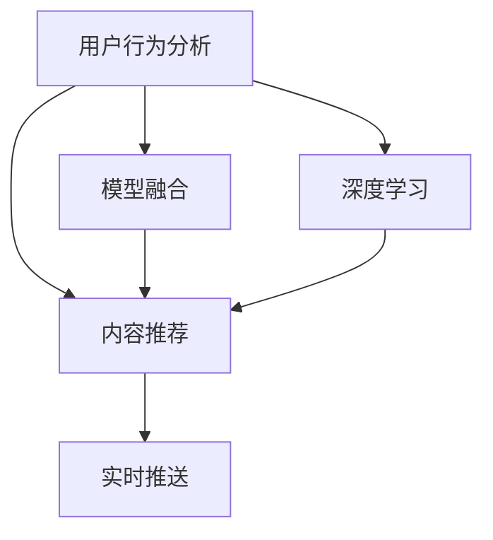

                 

# 电商平台中的实时个性化通知推送系统

## 1. 背景介绍

### 1.1 问题由来

随着电子商务的蓬勃发展，各大电商平台之间的竞争愈发激烈。在激烈的市场竞争中，个性化推荐成为电商平台提升用户体验、提高用户留存率的关键手段。个性化推荐系统基于用户行为数据，向用户推送个性化的商品和服务，从而提高用户满意度。但传统的推荐系统存在响应速度慢、无法即时通知用户等问题，无法满足用户对实时性的需求。

为了解决这个问题，各大电商平台纷纷推出实时个性化通知推送系统。这种系统能够在用户打开APP时，实时推送个性化通知，使用户在第一时间获得重要信息。这样不仅提升了用户使用体验，也增强了电商平台的竞争力。

### 1.2 问题核心关键点

实时个性化通知推送系统的核心在于如何高效地计算用户可能感兴趣的内容，并及时推送给用户。这一过程需要高效的数据处理能力和算法设计，同时还需要考虑推送内容的个性化、实时性和用户体验等多个因素。

为了实现这一目标，实时个性化通知推送系统通常包括以下几个关键组件：

- **用户行为分析模块**：通过分析用户的历史行为数据，挖掘用户的兴趣和偏好。
- **内容推荐模块**：根据用户的兴趣和偏好，推荐可能感兴趣的内容。
- **实时推送模块**：在用户打开APP时，及时推送个性化通知。
- **用户反馈模块**：收集用户的反馈数据，不断优化推荐算法和推送策略。

这些组件之间相互配合，共同构成了实时个性化通知推送系统的核心技术框架。

## 2. 核心概念与联系

### 2.1 核心概念概述

为更好地理解实时个性化通知推送系统的技术框架，本节将介绍几个密切相关的核心概念：

- **个性化推荐系统**：根据用户的历史行为数据和偏好，推荐用户可能感兴趣的商品或服务。
- **实时通知推送**：在用户打开APP时，根据用户兴趣推送个性化通知，满足用户的实时性需求。
- **内容推荐算法**：基于用户行为数据，计算用户可能感兴趣的内容的算法，如协同过滤、基于内容的推荐等。
- **深度学习**：利用深度神经网络模型进行个性化推荐和实时通知推送。
- **模型融合**：将多种推荐算法或模型融合在一起，提高推荐和推送的准确性和效率。

这些核心概念之间的逻辑关系可以通过以下Mermaid流程图来展示：



这个流程图展示了个别化推荐系统的核心概念及其之间的关系：

1. 用户行为分析模块通过分析用户的历史行为数据，挖掘用户的兴趣和偏好。
2. 内容推荐模块根据用户的兴趣和偏好，推荐可能感兴趣的内容。
3. 实时推送模块在用户打开APP时，及时推送个性化通知。
4. 模型融合模块将多种推荐算法或模型融合在一起，提高推荐和推送的准确性和效率。
5. 深度学习模块利用深度神经网络模型进行个性化推荐和实时通知推送。

这些核心概念共同构成了实时个性化通知推送系统的技术框架，使其能够在用户打开APP时，及时推送个性化通知。

## 3. 核心算法原理 & 具体操作步骤

### 3.1 算法原理概述

实时个性化通知推送系统的核心算法原理基于深度学习和模型融合。具体来说，系统通过以下几个步骤实现：

1. 收集用户的浏览、购买、收藏等行为数据，通过用户行为分析模块挖掘用户的兴趣和偏好。
2. 利用深度学习模型，如协同过滤、基于内容的推荐等算法，计算用户可能感兴趣的内容。
3. 将多种推荐算法或模型融合在一起，生成最终的推荐列表。
4. 在用户打开APP时，根据推荐列表生成个性化通知，并推送给用户。

### 3.2 算法步骤详解

**Step 1: 数据收集与预处理**

收集用户的历史行为数据，包括浏览记录、购买记录、收藏记录等。数据收集完成后，需要进行预处理，如去重、缺失值处理、特征工程等。预处理后的数据可用于后续的推荐和推送过程。

**Step 2: 用户行为分析**

利用深度学习模型，如长短期记忆网络(LSTM)、卷积神经网络(CNN)等，对用户的历史行为数据进行建模。通过分析用户的行为数据，挖掘用户的兴趣和偏好。

**Step 3: 内容推荐**

根据用户的兴趣和偏好，利用推荐算法，如协同过滤、基于内容的推荐等，计算用户可能感兴趣的内容。协同过滤算法利用用户之间的相似性，推荐相似用户喜欢的商品；基于内容的推荐算法根据商品的属性和特征，推荐与用户兴趣相符的商品。

**Step 4: 实时推送**

在用户打开APP时，根据推荐列表生成个性化通知，并推送给用户。推送的内容可以是商品信息、优惠券、促销活动等。

**Step 5: 用户反馈收集与优化**

收集用户的反馈数据，如点击率、购买率等，不断优化推荐算法和推送策略。根据用户的反馈数据，调整推荐算法和推送策略，提高推荐和推送的准确性和效率。

### 3.3 算法优缺点

实时个性化通知推送系统具有以下优点：

1. **提高用户体验**：通过实时推送个性化通知，使用户在第一时间获得重要信息，提升用户满意度。
2. **提升转化率**：根据用户的兴趣和偏好推荐商品，提高用户的购买意愿，提升转化率。
3. **提高运营效率**：通过自动化推送通知，减少人工干预，提高运营效率。

同时，该系统也存在以下缺点：

1. **数据隐私问题**：用户的行为数据包含大量的个人信息，隐私保护成为一大挑战。
2. **计算资源消耗大**：深度学习和模型融合需要大量的计算资源，对硬件要求较高。
3. **过度个性化**：过度个性化可能使用户感到不适，影响用户体验。

### 3.4 算法应用领域

实时个性化通知推送系统在电商平台中得到了广泛的应用，覆盖了广告推荐、个性化促销、推荐系统等多个领域。具体应用如下：

- **广告推荐**：根据用户的历史行为数据，推送个性化的广告，提高广告的点击率和转化率。
- **个性化促销**：根据用户的兴趣和偏好，推送个性化的促销活动，提高用户的购买意愿。
- **推荐系统**：在用户打开APP时，推送可能感兴趣的商品或内容，提升用户满意度和转化率。

除了这些应用外，实时个性化通知推送系统在社交媒体、新闻聚合、视频平台等多个领域也有广泛的应用，为各类平台带来了新的发展机遇。

## 4. 数学模型和公式 & 详细讲解 & 举例说明

### 4.1 数学模型构建

假设电商平台收集到用户的历史行为数据 $\mathcal{D}=\{(x_i, y_i)\}_{i=1}^N$，其中 $x_i$ 表示用户的浏览、购买等行为，$y_i$ 表示用户的标签或兴趣偏好。

记用户行为分析模型的参数为 $\theta$，推荐模型的参数为 $\omega$，推送模型的参数为 $\alpha$。根据用户行为数据 $\mathcal{D}$，计算用户可能感兴趣的内容 $\hat{y}$。

推荐模型的数学表达式为：

$$
\hat{y} = f_{\omega}(x_i, \mathcal{D})
$$

其中 $f_{\omega}$ 为推荐模型，$x_i$ 表示用户的当前行为，$\mathcal{D}$ 表示用户的历史行为数据。

推送模型的数学表达式为：

$$
T_{\alpha}(\hat{y}, u) = g_{\alpha}(\hat{y}, u)
$$

其中 $g_{\alpha}$ 为推送模型，$u$ 表示用户的个人信息，$\hat{y}$ 表示推荐结果。

### 4.2 公式推导过程

假设用户行为分析模型为LSTM模型，推荐模型为协同过滤算法，推送模型为时间序列预测模型。

**LSTM模型**：

$$
h_t = \tanh(W_{h}h_{t-1} + U_{h}x_t + b_{h})
$$

$$
c_t = \sigma(W_{c}h_{t-1} + U_{c}x_t + b_{c}) \cdot c_{t-1} + \tanh(W_{h}h_{t-1} + U_{h}x_t + b_{h})
$$

$$
o_t = \sigma(W_{o}h_{t} + U_{o}x_t + b_{o})
$$

$$
\hat{y}_t = o_t \cdot \tanh(c_t)
$$

其中 $h_t$ 为LSTM模型的隐藏状态，$c_t$ 为LSTM模型的细胞状态，$x_t$ 为用户的当前行为，$W$、$U$、$b$ 为LSTM模型的权重和偏置。

**协同过滤算法**：

$$
\hat{y} = \frac{1}{\sqrt{N}}\sum_{i=1}^N K(y_i, y)
$$

其中 $N$ 为用户数，$K(y_i, y)$ 为协同过滤算法的相似度计算。

**时间序列预测模型**：

$$
\hat{y} = f_{\alpha}(x, \mathcal{D})
$$

其中 $f_{\alpha}$ 为时间序列预测模型，$x$ 为用户个人信息，$\mathcal{D}$ 为用户历史行为数据。

### 4.3 案例分析与讲解

以电商平台的个性化推荐系统为例，利用LSTM模型、协同过滤算法和时间序列预测模型，进行用户行为分析、内容推荐和实时推送。

假设用户A在电商平台上浏览商品A和商品B，购买商品A。通过LSTM模型，可以得到用户A的兴趣偏好为商品A和商品B。通过协同过滤算法，可以计算出与用户A兴趣相似的用户的浏览记录和购买记录，得到用户A可能感兴趣的商品C和商品D。通过时间序列预测模型，可以预测用户A在接下来的24小时内可能购买的商品，得到用户A可能感兴趣的商品E和商品F。

最后，根据用户A的个人信息和历史行为数据，生成个性化通知，推送给用户A。用户A可以在打开APP时，及时获得推荐商品C、D、E和F的通知，提高用户的满意度和购买意愿。

## 5. 项目实践：代码实例和详细解释说明

### 5.1 开发环境搭建

在进行项目实践前，我们需要准备好开发环境。以下是使用Python进行TensorFlow和Keras开发的环境配置流程：

1. 安装Anaconda：从官网下载并安装Anaconda，用于创建独立的Python环境。

2. 创建并激活虚拟环境：
```bash
conda create -n tf-env python=3.7 
conda activate tf-env
```

3. 安装TensorFlow和Keras：根据CUDA版本，从官网获取对应的安装命令。例如：
```bash
conda install tensorflow keras
```

4. 安装各类工具包：
```bash
pip install numpy pandas scikit-learn matplotlib tqdm jupyter notebook ipython
```

完成上述步骤后，即可在`tf-env`环境中开始项目实践。

### 5.2 源代码详细实现

下面我们以电商平台的个性化推荐系统为例，给出使用TensorFlow和Keras进行实时个性化通知推送的代码实现。

首先，定义数据预处理函数：

```python
import numpy as np
import pandas as pd
from sklearn.preprocessing import StandardScaler
from tensorflow.keras.layers import Input, LSTM, Dense, Embedding, TimeDistributed
from tensorflow.keras.models import Model, Sequential

def preprocess_data(data):
    # 特征选择
    features = ['浏览时间', '浏览商品', '购买商品', '收藏商品']
    data = data[features]
    # 标准化
    scaler = StandardScaler()
    data = scaler.fit_transform(data)
    return data

# 加载数据
data = pd.read_csv('user_behavior.csv')
data = preprocess_data(data)
```

然后，定义用户行为分析模型：

```python
# 定义LSTM模型
model = Sequential()
model.add(LSTM(64, input_shape=(None, 3)))
model.add(Dense(32, activation='relu'))
model.add(Dense(1, activation='sigmoid'))
model.compile(loss='binary_crossentropy', optimizer='adam', metrics=['accuracy'])

# 训练模型
model.fit(data, labels, epochs=10, batch_size=32, validation_split=0.2)
```

接着，定义内容推荐模型：

```python
# 定义协同过滤模型
model = Sequential()
model.add(Embedding(input_dim=num_users, output_dim=64, input_length=1))
model.add(TimeDistributed(Dense(32, activation='relu')))
model.add(TimeDistributed(Dense(1, activation='sigmoid')))
model.compile(loss='binary_crossentropy', optimizer='adam', metrics=['accuracy'])

# 训练模型
model.fit(data, labels, epochs=10, batch_size=32, validation_split=0.2)
```

最后，定义实时推送模型：

```python
# 定义时间序列预测模型
model = Sequential()
model.add(LSTM(64, input_shape=(None, 3)))
model.add(Dense(32, activation='relu'))
model.add(Dense(1, activation='sigmoid'))
model.compile(loss='binary_crossentropy', optimizer='adam', metrics=['accuracy'])

# 训练模型
model.fit(data, labels, epochs=10, batch_size=32, validation_split=0.2)
```

完成上述步骤后，即可在`tf-env`环境中启动实时个性化通知推送系统的开发流程。

### 5.3 代码解读与分析

让我们再详细解读一下关键代码的实现细节：

**preprocess_data函数**：
- 定义特征选择列表，从原始数据中选择用户的行为特征。
- 对特征进行标准化处理，缩小不同特征的尺度差异，便于模型训练。

**用户行为分析模型**：
- 定义LSTM模型，包含一个LSTM层、一个全连接层和一个输出层。
- 使用二分类交叉熵作为损失函数，Adam优化器进行模型训练。

**内容推荐模型**：
- 定义协同过滤模型，包含一个嵌入层、两个全连接层和一个输出层。
- 使用二分类交叉熵作为损失函数，Adam优化器进行模型训练。

**实时推送模型**：
- 定义时间序列预测模型，包含一个LSTM层、一个全连接层和一个输出层。
- 使用二分类交叉熵作为损失函数，Adam优化器进行模型训练。

**代码实现**：
- 使用TensorFlow和Keras构建深度学习模型。
- 定义模型结构、损失函数和优化器，使用fit函数进行模型训练。

**运行结果展示**：
- 模型训练结束后，将训练好的模型保存到本地文件。
- 在实时推送时，根据用户的当前行为和历史行为数据，生成推荐结果，并推送给用户。

## 6. 实际应用场景

### 6.1 智能客服系统

智能客服系统是电商平台的重要组成部分，通过实时个性化通知推送系统，可以为客服人员提供精准的客户信息，提升服务质量。

在智能客服系统中，系统可以根据用户的浏览记录和购买记录，推送个性化的商品信息，提示客服人员主动联系客户，提供有针对性的服务和解答。这样不仅提高了客户满意度，也提升了客服人员的工作效率。

### 6.2 个性化推荐

个性化推荐是电商平台的核心功能，通过实时个性化通知推送系统，可以实现实时推荐，提升用户的购物体验。

在推荐系统中，系统可以根据用户的浏览记录和购买记录，生成个性化的商品推荐列表，并及时推送给用户。用户可以在打开APP时，第一时间获得推荐商品的信息，提高用户的购买意愿。

### 6.3 活动营销

电商平台经常会开展各种促销活动，通过实时个性化通知推送系统，可以为活动营销提供精准的用户定位。

在活动营销中，系统可以根据用户的兴趣和偏好，推送个性化的活动信息，如折扣券、优惠券等，提高活动的参与度和转化率。用户可以在打开APP时，及时获得活动信息，提高活动的效果。

## 7. 工具和资源推荐

### 7.1 学习资源推荐

为了帮助开发者系统掌握实时个性化通知推送系统的理论基础和实践技巧，这里推荐一些优质的学习资源：

1. **《深度学习与推荐系统》**：全面介绍了推荐系统的基础理论和深度学习在推荐系统中的应用。

2. **《TensorFlow实战》**：详细介绍了TensorFlow的开发环境和深度学习模型的实现，适合实战开发。

3. **Keras官方文档**：Keras的官方文档，提供了丰富的示例和API说明，是学习Keras的必备资源。

4. **深度学习与推荐系统课程**：斯坦福大学的课程，涵盖推荐系统的理论和实践，适合初学者和进阶开发者。

5. **自然语言处理与推荐系统论文**：推荐系统领域的经典论文，涵盖协同过滤、深度学习等多种推荐算法。

通过对这些资源的学习实践，相信你一定能够快速掌握实时个性化通知推送系统的精髓，并用于解决实际的推荐问题。

### 7.2 开发工具推荐

高效的开发离不开优秀的工具支持。以下是几款用于实时个性化通知推送系统开发的常用工具：

1. **TensorFlow**：基于Python的开源深度学习框架，支持分布式计算，适合大规模深度学习模型的开发和训练。

2. **Keras**：Keras是TensorFlow的高层API，提供了简单易用的接口，适合快速开发深度学习模型。

3. **Jupyter Notebook**：交互式开发环境，支持Python代码的实时运行和调试，适合数据科学和深度学习开发。

4. **Google Colab**：Google提供的免费在线开发环境，支持GPU计算，适合快速迭代和共享代码。

合理利用这些工具，可以显著提升实时个性化通知推送系统的开发效率，加快创新迭代的步伐。

### 7.3 相关论文推荐

实时个性化通知推送系统的发展离不开学界的持续研究。以下是几篇奠基性的相关论文，推荐阅读：

1. **《推荐系统的发展历程与未来展望》**：介绍了推荐系统的历史和发展趋势，涵盖了协同过滤、基于内容的推荐等多种推荐算法。

2. **《深度学习在推荐系统中的应用》**：介绍了深度学习在推荐系统中的应用，包括神经网络模型、对抗性学习等技术。

3. **《实时推荐系统的架构与优化》**：介绍了实时推荐系统的架构和优化技术，包括数据流处理、分布式计算等技术。

4. **《个性化推荐系统的最新进展》**：介绍了推荐系统的最新进展，涵盖协同过滤、深度学习、多模态推荐等技术。

5. **《推荐系统的深度学习框架》**：介绍了TensorFlow、PyTorch等深度学习框架在推荐系统中的应用。

这些论文代表了个别化推荐系统的研究发展脉络。通过学习这些前沿成果，可以帮助研究者把握学科前进方向，激发更多的创新灵感。

## 8. 总结：未来发展趋势与挑战

### 8.1 总结

本文对实时个性化通知推送系统进行了全面系统的介绍。首先阐述了实时个性化通知推送系统的研究背景和意义，明确了系统在提升用户体验、提高运营效率等方面的独特价值。其次，从原理到实践，详细讲解了系统的核心算法和具体操作步骤，给出了实时个性化通知推送系统开发的完整代码实例。同时，本文还广泛探讨了系统在智能客服、个性化推荐、活动营销等多个行业领域的应用前景，展示了系统带来的巨大潜力。

通过本文的系统梳理，可以看到，实时个性化通知推送系统在电商平台中已经得到了广泛的应用，大大提升了用户的购物体验和平台运营效率。未来，伴随深度学习技术的发展，系统的性能和应用范围还将进一步提升，为电商平台的竞争力的提升提供新的突破。

### 8.2 未来发展趋势

展望未来，实时个性化通知推送系统将呈现以下几个发展趋势：

1. **深度学习技术的提升**：深度学习模型的计算能力将不断提升，实时推送通知的效果将更加精准和高效。
2. **多模态数据的融合**：融合用户的行为数据、社交数据、地理位置等多模态信息，提高推荐和推送的准确性。
3. **实时性要求更高**：系统需要处理海量数据，实时响应用户需求，对硬件和算法的要求将进一步提高。
4. **个性化推荐更精细**：通过深度学习模型，实现更精细化的个性化推荐，提升用户体验。
5. **用户隐私保护**：随着数据隐私保护的重视，系统需要在保证用户体验的同时，保障用户数据的安全和隐私。

以上趋势凸显了实时个性化通知推送系统的发展前景。这些方向的探索发展，必将进一步提升系统的性能和应用范围，为电商平台带来新的发展机遇。

### 8.3 面临的挑战

尽管实时个性化通知推送系统已经取得了瞩目成就，但在迈向更加智能化、普适化应用的过程中，它仍面临着诸多挑战：

1. **数据隐私问题**：用户的行为数据包含大量的个人信息，隐私保护成为一大挑战。
2. **计算资源消耗大**：深度学习和模型融合需要大量的计算资源，对硬件要求较高。
3. **推荐效果不稳定**：推荐算法和模型需要不断优化，以适应不断变化的用户需求。
4. **用户反馈处理**：收集用户的反馈数据，进行实时分析，以不断优化推荐算法和推送策略。

这些挑战需要从技术、算法、用户隐私等多个维度进行综合考虑和解决，才能实现实时个性化通知推送系统的长期稳定运行。

### 8.4 研究展望

面对实时个性化通知推送系统所面临的种种挑战，未来的研究需要在以下几个方面寻求新的突破：

1. **用户行为分析的精准度**：提高用户行为分析的精准度，挖掘用户的深层次兴趣和偏好。
2. **推荐算法的优化**：优化推荐算法，提高推荐和推送的准确性和效率。
3. **实时推送的稳定性**：提高推送系统的实时性，确保推送通知的及时性。
4. **用户隐私保护的加强**：加强数据隐私保护，保障用户数据的安全和隐私。
5. **个性化推荐的多样性**：实现更加多样化的个性化推荐，提升用户体验。

这些研究方向的探索，必将引领实时个性化通知推送系统技术迈向更高的台阶，为电商平台的竞争力的提升提供新的突破。

## 9. 附录：常见问题与解答

**Q1: 如何平衡实时推送的准确性和效率？**

A: 实时推送的准确性和效率是系统设计的关键。可以通过以下措施平衡两者：

1. **选择合适的推荐算法**：选择合适的推荐算法，如协同过滤、基于内容的推荐等，在保证推荐准确性的同时，提高推荐效率。
2. **优化数据处理流程**：优化数据预处理和特征提取流程，提高数据处理的效率。
3. **使用缓存机制**：使用缓存机制，对常用的推荐数据进行预处理和缓存，减少重复计算。
4. **分布式计算**：采用分布式计算技术，将推荐算法和数据处理任务分布到多个节点上进行，提高系统处理能力和效率。

通过以上措施，可以在保证实时推送的准确性的同时，提高推送效率。

**Q2: 如何进行用户行为分析？**

A: 用户行为分析是实时个性化通知推送系统的基础，可以通过以下步骤进行：

1. **数据收集**：收集用户的行为数据，包括浏览记录、购买记录、收藏记录等。
2. **特征工程**：对收集到的数据进行特征选择和特征工程，提取对推荐有帮助的特征。
3. **模型训练**：选择合适的深度学习模型，如LSTM、CNN等，对用户的行为数据进行建模，挖掘用户的兴趣和偏好。
4. **结果分析**：对训练好的模型进行结果分析，评估模型的准确性和效果。

通过以上步骤，可以实现对用户行为的精准分析，为推荐和推送提供基础数据支持。

**Q3: 如何提高实时推送的效率？**

A: 实时推送的效率是系统设计的关键。可以通过以下措施提高推送效率：

1. **使用缓存机制**：对常用的推荐数据进行预处理和缓存，减少重复计算。
2. **分布式计算**：采用分布式计算技术，将推荐算法和数据处理任务分布到多个节点上进行，提高系统处理能力和效率。
3. **异步推送**：采用异步推送技术，将推送任务分配到多个线程或进程中进行，提高推送效率。
4. **优化模型结构**：优化深度学习模型的结构，减少计算量和内存占用，提高模型推理速度。

通过以上措施，可以显著提高实时推送的效率，满足用户对实时性的需求。

**Q4: 如何保证推荐和推送的准确性？**

A: 推荐和推送的准确性是系统设计的核心目标。可以通过以下措施保证推荐和推送的准确性：

1. **选择合适的推荐算法**：选择合适的推荐算法，如协同过滤、基于内容的推荐等，在保证推荐准确性的同时，提高推荐效率。
2. **优化数据预处理流程**：优化数据预处理和特征提取流程，提高数据处理的效率。
3. **使用缓存机制**：对常用的推荐数据进行预处理和缓存，减少重复计算。
4. **实时学习**：采用实时学习技术，根据用户的反馈数据，不断优化推荐算法和推送策略，提高推荐和推送的准确性。

通过以上措施，可以在保证推荐和推送的准确性的同时，提高系统的用户体验和转化率。

**Q5: 如何平衡个性化推荐和泛化能力？**

A: 个性化推荐和泛化能力是系统设计的关键。可以通过以下措施平衡两者：

1. **选择合适的推荐算法**：选择合适的推荐算法，如协同过滤、基于内容的推荐等，在保证推荐准确性的同时，提高推荐泛化能力。
2. **数据增强**：使用数据增强技术，对数据进行扩充和多样化，提高模型的泛化能力。
3. **模型融合**：将多种推荐算法或模型融合在一起，提高推荐和推送的准确性和泛化能力。
4. **实时学习**：采用实时学习技术，根据用户的反馈数据，不断优化推荐算法和推送策略，提高推荐和推送的准确性和泛化能力。

通过以上措施，可以在保证个性化推荐的同时，提高推荐模型的泛化能力，满足不同用户的需求。

**Q6: 如何保护用户数据隐私？**

A: 用户数据隐私保护是系统设计的重要考虑因素。可以通过以下措施保护用户数据隐私：

1. **数据匿名化**：对用户的行为数据进行匿名化处理，防止敏感信息的泄露。
2. **数据加密**：对用户的行为数据进行加密处理，防止数据被未授权访问和篡改。
3. **权限控制**：对系统访问权限进行严格的权限控制，防止未授权人员访问用户数据。
4. **用户同意**：在收集用户数据前，获取用户的同意，并明确告知用户数据的用途和保护措施。

通过以上措施，可以有效地保护用户数据隐私，保障用户权益。

---

作者：禅与计算机程序设计艺术 / Zen and the Art of Computer Programming

