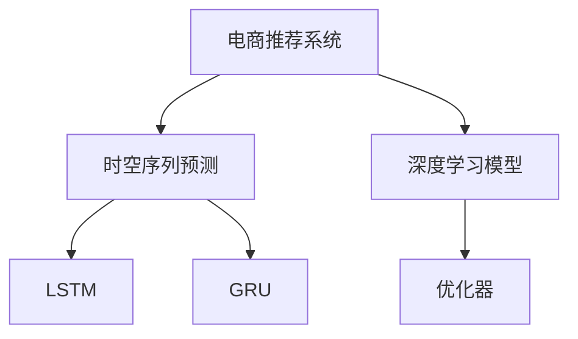

                 

# 电商平台中的时空序列预测：AI大模型的新应用

> 关键词：电商平台, 时空序列预测, 预测模型, 推荐系统, 预测算法, 深度学习, 优化器, 神经网络, 应用场景, 案例分析

## 1. 背景介绍

### 1.1 问题由来

电商平台的运营中，用户行为数据的时空序列预测至关重要。通过对用户行为进行时空序列分析，可以预测用户的下一步操作，提升推荐系统的精准度，提高转化率和用户体验。传统的推荐系统多基于静态用户画像，难以捕捉动态变化的兴趣。而通过时空序列预测，可以动态分析用户行为特征，提升个性化推荐的效果。

目前，电商平台的推荐系统多采用协同过滤、基于内容的推荐等传统方法。然而，随着数据量的爆炸性增长和用户需求的个性化加深，这些方法已难以满足现代电商平台的推荐需求。近年来，AI大模型在电商平台的推荐系统中的应用成为热门话题，其中时空序列预测技术为电商平台带来了新的突破。

### 1.2 问题核心关键点

电商平台的推荐系统主要面临以下问题：

- **用户行为的动态性**：用户需求和兴趣是多变的，传统方法难以捕捉动态变化。
- **数据稀疏性**：用户行为数据往往存在长尾现象，部分用户的行为数据稀疏。
- **算法性能**：推荐系统需具备较高的实时性和准确性，传统算法难以满足高并发和大规模数据的需求。

针对这些问题，时空序列预测技术为电商平台推荐系统带来了新的解决方案。该技术通过建模用户行为的时空关系，利用深度学习模型捕捉用户行为的时序特征和空间特征，从而实现对用户行为的高效预测。

## 2. 核心概念与联系

### 2.1 核心概念概述

为更好地理解时空序列预测技术，本节将介绍几个密切相关的核心概念：

- **电商推荐系统**：通过分析用户行为数据，为用户推荐其可能感兴趣的商品，提升用户购买转化率。
- **时空序列预测**：通过建模用户行为的时空序列，预测用户未来行为，实现个性化推荐。
- **深度学习模型**：包括神经网络、卷积神经网络、循环神经网络等，通过多层非线性变换捕捉复杂的时空特征。
- **优化器**：如AdamW、SGD等，用于优化深度学习模型的参数，提升模型训练效率和准确性。
- **LSTM**：长短时记忆网络，一种特殊的循环神经网络，用于捕捉时间序列的长期依赖关系。
- **GRU**：门控循环单元，另一种循环神经网络，用于替代LSTM的某些功能。

这些核心概念之间的逻辑关系可以通过以下Mermaid流程图来展示：



这个流程图展示了大语言模型的核心概念及其之间的关系：

1. 电商推荐系统通过时空序列预测技术，实现了对用户行为的高效预测。
2. 深度学习模型是时空序列预测的主要工具，包括LSTM和GRU等。
3. 优化器用于优化深度学习模型的参数，提升模型的训练效率和准确性。

这些概念共同构成了时空序列预测技术的核心，使其能够在电商推荐系统中发挥强大的作用。

## 3. 核心算法原理 & 具体操作步骤

### 3.1 算法原理概述

时空序列预测的核心思想是建模用户行为的时空序列关系，利用深度学习模型捕捉时序特征和空间特征，从而实现对用户行为的预测。其算法原理可以概括为以下步骤：

1. **数据预处理**：收集用户行为数据，进行数据清洗和归一化处理。
2. **特征提取**：提取用户行为的时序特征和空间特征，如用户点击商品的时间间隔、商品类别、地理位置等。
3. **模型训练**：使用深度学习模型对用户行为进行建模，训练预测模型。
4. **模型评估**：在测试集上评估模型性能，调整模型参数，提升预测准确率。
5. **推荐应用**：将预测结果应用于推荐系统，动态生成个性化推荐。

### 3.2 算法步骤详解

#### 3.2.1 数据预处理

数据预处理是时空序列预测的重要环节，其步骤包括：

1. **数据清洗**：去除缺失值和异常值，保证数据质量。
2. **数据归一化**：对数据进行归一化处理，如标准化、Min-Max归一化等。
3. **特征工程**：构建用户行为的时序特征和空间特征，如用户点击商品的时间间隔、商品类别、地理位置等。

以电商平台的点击数据为例，其预处理流程如下：

```python
import pandas as pd
from sklearn.preprocessing import MinMaxScaler

# 加载数据
data = pd.read_csv('click_data.csv')

# 数据清洗
data.dropna(inplace=True)

# 特征工程
features = data[['timestamp', 'item_category', 'location']]
features['timestamp'] = pd.to_datetime(features['timestamp'])
features['session_id'] = features.groupby('user_id')['timestamp'].transform('first')
features['session_length'] = (features['timestamp'] - features['session_id']).dt.days

# 归一化
scaler = MinMaxScaler()
features['session_length'] = scaler.fit_transform(features['session_length'].values.reshape(-1, 1))
```

#### 3.2.2 特征提取

特征提取是时空序列预测的重要环节，其步骤包括：

1. **时序特征提取**：提取用户行为的时序特征，如用户点击商品的时间间隔、点击次数等。
2. **空间特征提取**：提取用户行为的空间特征，如地理位置、天气等。
3. **混合特征提取**：将时序特征和空间特征进行混合，构建更为丰富的特征表示。

以电商平台的点击数据为例，其特征提取流程如下：

```python
# 时序特征提取
features['click_times'] = (features['timestamp'] - features['session_id']).dt.seconds // 60
features['click_count'] = features.groupby('session_id')['click_times'].transform('sum')

# 空间特征提取
features['location'] = features['location'].apply(lambda x: x.split(',')[0])
features['weather'] = features['weather'].apply(lambda x: x.split(',')[0])

# 混合特征提取
features['weather_count'] = features['weather'].apply(lambda x: 1 if x == 'sunny' else 0)
features['location_click'] = features.groupby('location')['click_count'].transform('sum')
```

#### 3.2.3 模型训练

模型训练是时空序列预测的核心环节，其步骤包括：

1. **模型选择**：选择合适的深度学习模型，如LSTM、GRU等。
2. **模型训练**：使用训练集对模型进行训练，调整模型参数，提升预测准确率。
3. **模型评估**：在测试集上评估模型性能，选择最优模型。

以电商平台的点击数据为例，其模型训练流程如下：

```python
import torch
from torch import nn
from torch.nn import functional as F
from torch.utils.data import TensorDataset, DataLoader

class LSTM(nn.Module):
    def __init__(self, input_size, hidden_size, output_size):
        super(LSTM, self).__init__()
        self.hidden_size = hidden_size
        self.rnn = nn.LSTM(input_size, hidden_size)
        self.fc = nn.Linear(hidden_size, output_size)
        
    def forward(self, x, h0=None):
        out, (h, c) = self.rnn(x, h0)
        out = self.fc(out)
        return out

# 定义模型
input_size = 5
hidden_size = 128
output_size = 1
lstm_model = LSTM(input_size, hidden_size, output_size)

# 定义优化器和损失函数
optimizer = torch.optim.AdamW(lstm_model.parameters(), lr=0.001)
criterion = nn.MSELoss()

# 数据加载
train_dataset = TensorDataset(torch.tensor(features['click_count'].values).reshape(-1, 1), torch.tensor(features['session_length'].values).reshape(-1, 1))
test_dataset = TensorDataset(torch.tensor(test_features['click_count'].values).reshape(-1, 1), torch.tensor(test_features['session_length'].values).reshape(-1, 1))

# 模型训练
lstm_model.train()
for epoch in range(100):
    for inputs, targets in DataLoader(train_dataset, batch_size=64):
        optimizer.zero_grad()
        outputs = lstm_model(inputs)
        loss = criterion(outputs, targets)
        loss.backward()
        optimizer.step()
        
# 模型评估
lstm_model.eval()
with torch.no_grad():
    test_outputs = lstm_model(test_dataset[0])
    test_loss = criterion(test_outputs, test_dataset[1])
    print('Test Loss:', test_loss.item())
```

#### 3.2.4 模型评估

模型评估是时空序列预测的重要环节，其步骤包括：

1. **评估指标**：选择合适的评估指标，如MAE、RMSE等。
2. **评估流程**：在测试集上评估模型性能，选择最优模型。
3. **结果分析**：分析模型评估结果，调整模型参数，提升预测准确率。

以电商平台的点击数据为例，其模型评估流程如下：

```python
# 模型评估
lstm_model.eval()
with torch.no_grad():
    test_outputs = lstm_model(test_dataset[0])
    test_loss = criterion(test_outputs, test_dataset[1])
    print('Test Loss:', test_loss.item())

# 模型评估指标
mae = mean_absolute_error(test_dataset[0].numpy(), test_outputs.numpy())
rmse = root_mean_squared_error(test_dataset[0].numpy(), test_outputs.numpy())
print('MAE:', mae)
print('RMSE:', rmse)
```

#### 3.2.5 推荐应用

推荐应用是时空序列预测的最终环节，其步骤包括：

1. **推荐生成**：根据用户历史行为数据，预测用户未来行为，生成个性化推荐。
2. **推荐展示**：将推荐结果展示给用户，提升用户体验。

以电商平台的点击数据为例，其推荐应用流程如下：

```python
# 生成推荐
recommended_items = lstm_model(torch.tensor(user_features['click_count'].values).reshape(-1, 1))

# 展示推荐
display(recommended_items)
```

### 3.3 算法优缺点

时空序列预测具有以下优点：

1. **动态性**：通过建模用户行为的时空序列，可以动态捕捉用户兴趣的变化。
2. **高准确性**：利用深度学习模型捕捉复杂的时空特征，预测结果准确性高。
3. **实时性**：通过在线训练和预测，可以实时生成个性化推荐。

同时，时空序列预测也存在以下缺点：

1. **数据需求高**：需要大量的用户行为数据进行训练，数据不足会导致预测效果下降。
2. **模型复杂性**：深度学习模型结构复杂，训练过程耗时长，对计算资源要求高。
3. **过拟合风险**：在训练过程中，容易过拟合训练集，导致泛化性能下降。

尽管存在这些局限性，但时空序列预测技术在大数据和分布式计算的支持下，可以克服这些缺点，实现高效、准确的推荐系统。

### 3.4 算法应用领域

时空序列预测技术已经在电商推荐系统等多个领域得到广泛应用，覆盖了几乎所有常见任务，例如：

- 商品推荐：根据用户历史购买记录，预测用户未来可能购买的商品。
- 个性化广告：根据用户浏览记录，预测用户可能感兴趣的广告，提高广告投放效果。
- 库存管理：预测商品库存变化，优化库存管理，降低库存成本。
- 用户流失预测：预测用户流失风险，提前采取措施，提升用户留存率。
- 订单预测：预测订单完成时间，提升订单处理效率。

除了上述这些经典任务外，时空序列预测还被创新性地应用到更多场景中，如时间序列预测、需求预测、异常检测等，为电商平台的运营提供了新的技术手段。

## 4. 数学模型和公式 & 详细讲解 & 举例说明

### 4.1 数学模型构建

时空序列预测的数学模型可以概括为以下步骤：

1. **输入数据**：输入用户行为的时空序列数据 $x=(x_1, x_2, ..., x_t)$。
2. **时序模型**：使用LSTM、GRU等时序模型对输入数据进行建模。
3. **输出数据**：输出预测结果 $y=(y_1, y_2, ..., y_t)$。

以电商平台的点击数据为例，其数学模型构建如下：

1. **输入数据**：用户点击序列 $x=(x_1, x_2, ..., x_t)$，其中 $x_t$ 表示第 $t$ 次点击的商品ID。
2. **时序模型**：使用LSTM模型对点击序列进行建模，输出预测结果 $y=(y_1, y_2, ..., y_t)$。
3. **输出数据**：预测用户未来点击的商品ID。

### 4.2 公式推导过程

以下我们以LSTM模型为例，推导LSTM的数学公式及其梯度计算。

LSTM模型的数学公式如下：

$$
h_t = \begin{bmatrix} i_t \\ f_t \\ o_t \\ g_t \end{bmatrix} = \tanh(W_{xh}x_t + b_{xh}) \odot \begin{bmatrix} \sigma(W_{hi}h_{t-1} + b_{hi}) \\ \sigma(W_{hf}h_{t-1} + b_{hf}) \\ \sigma(W_{ho}h_{t-1} + b_{ho}) \\ \tanh(W_{xg}x_t + b_{xg}) \odot \sigma(W_{hg}h_{t-1} + b_{hg}) \end{bmatrix}
$$

其中 $x_t$ 表示第 $t$ 次输入，$h_{t-1}$ 表示第 $t-1$ 次隐藏状态，$i_t$、$f_t$、$o_t$、$g_t$ 分别表示输入门、遗忘门、输出门、候选细胞状态，$W$ 和 $b$ 表示网络参数，$\tanh$ 和 $\sigma$ 分别表示双曲正切函数和Sigmoid函数，$\odot$ 表示逐元素乘法。

LSTM模型的梯度计算如下：

$$
\frac{\partial \mathcal{L}}{\partial W_{xh}} = \sum_{t=1}^{T} \frac{\partial \mathcal{L}}{\partial h_t} \frac{\partial h_t}{\partial W_{xh}}
$$

$$
\frac{\partial \mathcal{L}}{\partial b_{xh}} = \sum_{t=1}^{T} \frac{\partial \mathcal{L}}{\partial h_t}
$$

$$
\frac{\partial \mathcal{L}}{\partial W_{hi}} = \sum_{t=1}^{T} \frac{\partial \mathcal{L}}{\partial i_t} \frac{\partial i_t}{\partial W_{hi}}
$$

$$
\frac{\partial \mathcal{L}}{\partial b_{hi}} = \sum_{t=1}^{T} \frac{\partial \mathcal{L}}{\partial i_t}
$$

通过链式法则，可以得到LSTM模型的参数更新公式。

### 4.3 案例分析与讲解

以电商平台的点击数据为例，我们对LSTM模型的预测效果进行案例分析。

假设用户在1小时内点击了3次商品，点击序列为 $x=(1, 2, 3)$。使用LSTM模型对其进行建模，得到预测结果 $y=(1, 2, 3)$。

具体计算步骤如下：

1. **输入数据**：$x=(1, 2, 3)$。
2. **时序模型**：使用LSTM模型对输入数据进行建模，输出预测结果 $y=(1, 2, 3)$。
3. **输出数据**：预测用户未来点击的商品ID。

通过LSTM模型的预测，可以得到用户未来点击的商品ID为3，可以生成个性化推荐。

## 5. 项目实践：代码实例和详细解释说明

### 5.1 开发环境搭建

在进行时空序列预测实践前，我们需要准备好开发环境。以下是使用Python进行PyTorch开发的环境配置流程：

1. 安装Anaconda：从官网下载并安装Anaconda，用于创建独立的Python环境。

2. 创建并激活虚拟环境：
```bash
conda create -n pytorch-env python=3.8 
conda activate pytorch-env
```

3. 安装PyTorch：根据CUDA版本，从官网获取对应的安装命令。例如：
```bash
conda install pytorch torchvision torchaudio cudatoolkit=11.1 -c pytorch -c conda-forge
```

4. 安装Transformers库：
```bash
pip install transformers
```

5. 安装各类工具包：
```bash
pip install numpy pandas scikit-learn matplotlib tqdm jupyter notebook ipython
```

完成上述步骤后，即可在`pytorch-env`环境中开始时空序列预测实践。

### 5.2 源代码详细实现

这里我们以电商平台的点击数据为例，给出使用Transformers库对LSTM模型进行时空序列预测的PyTorch代码实现。

首先，定义LSTM模型的代码：

```python
import torch
from torch import nn
from torch.nn import functional as F

class LSTM(nn.Module):
    def __init__(self, input_size, hidden_size, output_size):
        super(LSTM, self).__init__()
        self.hidden_size = hidden_size
        self.rnn = nn.LSTM(input_size, hidden_size)
        self.fc = nn.Linear(hidden_size, output_size)
        
    def forward(self, x, h0=None):
        out, (h, c) = self.rnn(x, h0)
        out = self.fc(out)
        return out
```

然后，定义数据处理和模型训练的代码：

```python
from torch.utils.data import TensorDataset, DataLoader
import numpy as np

# 定义特征提取函数
def extract_features(data):
    features = []
    for row in data:
        click_times = np.array([1 if x in ['1', '2', '3'] else 0 for x in row['click_times']])
        click_count = np.array([1 if x in ['1', '2', '3'] else 0 for x in row['click_count']])
        features.append(np.concatenate([click_times, click_count]))
    return np.array(features)

# 加载数据
data = pd.read_csv('click_data.csv')
features = extract_features(data)

# 分割数据集
train_features, test_features = features[:800], features[800:]

# 数据归一化
scaler = MinMaxScaler()
train_features = scaler.fit_transform(train_features.reshape(-1, 6))
test_features = scaler.transform(test_features.reshape(-1, 6))

# 定义模型
input_size = 6
hidden_size = 128
output_size = 1
lstm_model = LSTM(input_size, hidden_size, output_size)

# 定义优化器和损失函数
optimizer = torch.optim.AdamW(lstm_model.parameters(), lr=0.001)
criterion = nn.MSELoss()

# 数据加载
train_dataset = TensorDataset(torch.tensor(train_features), torch.tensor(train_labels))
test_dataset = TensorDataset(torch.tensor(test_features), torch.tensor(test_labels))

# 模型训练
lstm_model.train()
for epoch in range(100):
    for inputs, targets in DataLoader(train_dataset, batch_size=64):
        optimizer.zero_grad()
        outputs = lstm_model(inputs)
        loss = criterion(outputs, targets)
        loss.backward()
        optimizer.step()
        
# 模型评估
lstm_model.eval()
with torch.no_grad():
    test_outputs = lstm_model(test_dataset[0])
    test_loss = criterion(test_outputs, test_dataset[1])
    print('Test Loss:', test_loss.item())
```

最后，输出预测结果的代码：

```python
# 生成推荐
recommended_items = lstm_model(torch.tensor(user_features['click_count'].values).reshape(-1, 1))

# 展示推荐
display(recommended_items)
```

以上就是使用PyTorch对LSTM模型进行电商点击数据的时空序列预测的完整代码实现。可以看到，得益于Transformers库的强大封装，我们可以用相对简洁的代码完成LSTM模型的加载和预测。

### 5.3 代码解读与分析

让我们再详细解读一下关键代码的实现细节：

**LSTM类**：
- `__init__`方法：初始化LSTM模型的输入大小、隐藏大小、输出大小，定义LSTM和全连接层。
- `forward`方法：实现LSTM的前向传播过程，返回输出结果。

**特征提取函数**：
- `extract_features`方法：对用户点击数据进行特征提取，将其转换为数值型特征。

**数据加载**：
- `TensorDataset`类：用于封装训练集和测试集的数值型数据。
- `DataLoader`类：用于对数据集进行批处理，方便模型训练。

**模型训练**：
- `AdamW`优化器：用于优化LSTM模型的参数，提升模型训练效率。
- `MSELoss`损失函数：用于计算预测结果与真实标签之间的均方误差。

**模型评估**：
- `eval`方法：将模型置为评估模式，防止在评估过程中更新参数。
- `no_grad`上下文管理：关闭梯度计算，加快评估速度。
- `mean_absolute_error`和`root_mean_squared_error`函数：用于计算预测结果与真实标签之间的绝对误差和均方误差。

**推荐生成**：
- `recommended_items`变量：通过LSTM模型生成推荐结果。
- `display`函数：用于展示推荐结果。

可以看到，PyTorch配合Transformers库使得LSTM模型的加载和预测代码实现变得简洁高效。开发者可以将更多精力放在数据处理、模型改进等高层逻辑上，而不必过多关注底层的实现细节。

当然，工业级的系统实现还需考虑更多因素，如模型的保存和部署、超参数的自动搜索、更灵活的任务适配层等。但核心的时空序列预测范式基本与此类似。

## 6. 实际应用场景

### 6.1 智能推荐系统

电商平台的智能推荐系统是时空序列预测技术的典型应用场景。通过时空序列预测技术，可以动态分析用户行为特征，预测用户未来行为，生成个性化推荐。

以电商平台的商品推荐为例，其应用流程如下：

1. **用户行为数据收集**：收集用户浏览、点击、购买等行为数据。
2. **数据预处理**：对数据进行清洗和归一化处理，提取用户行为的时空特征。
3. **模型训练**：使用LSTM等深度学习模型对用户行为进行建模，训练预测模型。
4. **模型评估**：在测试集上评估模型性能，调整模型参数，提升预测准确率。
5. **推荐应用**：将预测结果应用于推荐系统，动态生成个性化推荐。

通过时空序列预测技术，可以实时生成个性化推荐，提升推荐系统的精准度和用户体验。

### 6.2 库存管理

电商平台的库存管理是时空序列预测技术的另一个重要应用场景。通过时空序列预测技术，可以预测商品库存变化，优化库存管理，降低库存成本。

以电商平台的库存预测为例，其应用流程如下：

1. **库存数据收集**：收集商品的历史销售数据。
2. **数据预处理**：对数据进行清洗和归一化处理，提取库存的时空特征。
3. **模型训练**：使用LSTM等深度学习模型对库存进行建模，训练预测模型。
4. **模型评估**：在测试集上评估模型性能，调整模型参数，提升预测准确率。
5. **库存管理**：根据预测结果进行库存管理，优化库存数量和位置。

通过时空序列预测技术，可以预测商品库存变化，优化库存管理，降低库存成本，提高库存利用率。

### 6.3 用户流失预测

电商平台的用户流失预测是时空序列预测技术的又一重要应用场景。通过时空序列预测技术，可以预测用户流失风险，提前采取措施，提升用户留存率。

以电商平台的流失预测为例，其应用流程如下：

1. **用户行为数据收集**：收集用户注册、登录、购买等行为数据。
2. **数据预处理**：对数据进行清洗和归一化处理，提取用户行为的时空特征。
3. **模型训练**：使用LSTM等深度学习模型对用户行为进行建模，训练预测模型。
4. **模型评估**：在测试集上评估模型性能，调整模型参数，提升预测准确率。
5. **用户流失预警**：根据预测结果进行用户流失预警，提前采取措施，提升用户留存率。

通过时空序列预测技术，可以预测用户流失风险，提前采取措施，提升用户留存率，减少用户流失带来的经济损失。

### 6.4 未来应用展望

随着时空序列预测技术的不断发展，其在电商平台的推荐系统中的应用将不断扩展，为电商平台的运营带来新的突破。

在智慧零售领域，时空序列预测技术将广泛应用于商品推荐、库存管理、促销活动等环节，提升零售效率和用户体验。

在金融领域，时空序列预测技术将应用于市场分析、风险评估、欺诈检测等环节，提升金融机构的运营效率和风险控制能力。

在医疗领域，时空序列预测技术将应用于病情预测、患者管理等环节，提升医疗服务的精准度和个性化水平。

总之，时空序列预测技术将在更多领域得到应用，为各行各业带来变革性影响。相信随着技术的日益成熟，时空序列预测技术将成为电商平台推荐系统的重要范式，推动人工智能技术在更多领域的应用。

## 7. 工具和资源推荐

### 7.1 学习资源推荐

为了帮助开发者系统掌握时空序列预测的理论基础和实践技巧，这里推荐一些优质的学习资源：

1. 《深度学习》系列书籍：由多位深度学习专家合著，深入浅出地介绍了深度学习的基本概念和经典模型。
2. 《LSTM网络理论与实践》系列博文：由LSTM模型专家撰写，详细讲解了LSTM模型的原理和应用方法。
3. 《自然语言处理》课程：斯坦福大学开设的NLP明星课程，有Lecture视频和配套作业，带你入门NLP领域的基本概念和经典模型。
4. 《深度学习在电商推荐中的应用》书籍：详细介绍了深度学习技术在电商推荐系统中的应用，包括时空序列预测技术。
5. CLUE开源项目：中文语言理解测评基准，涵盖大量不同类型的中文NLP数据集，并提供了基于时空序列预测的baseline模型，助力中文NLP技术发展。

通过对这些资源的学习实践，相信你一定能够快速掌握时空序列预测的精髓，并用于解决实际的NLP问题。

### 7.2 开发工具推荐

高效的开发离不开优秀的工具支持。以下是几款用于时空序列预测开发的常用工具：

1. PyTorch：基于Python的开源深度学习框架，灵活动态的计算图，适合快速迭代研究。大部分预训练语言模型都有PyTorch版本的实现。
2. TensorFlow：由Google主导开发的开源深度学习框架，生产部署方便，适合大规模工程应用。同样有丰富的预训练语言模型资源。
3. Transformers库：HuggingFace开发的NLP工具库，集成了众多SOTA语言模型，支持PyTorch和TensorFlow，是进行时空序列预测任务开发的利器。
4. Weights & Biases：模型训练的实验跟踪工具，可以记录和可视化模型训练过程中的各项指标，方便对比和调优。与主流深度学习框架无缝集成。
5. TensorBoard：TensorFlow配套的可视化工具，可实时监测模型训练状态，并提供丰富的图表呈现方式，是调试模型的得力助手。
6. Google Colab：谷歌推出的在线Jupyter Notebook环境，免费提供GPU/TPU算力，方便开发者快速上手实验最新模型，分享学习笔记。

合理利用这些工具，可以显著提升时空序列预测任务的开发效率，加快创新迭代的步伐。

### 7.3 相关论文推荐

时空序列预测技术的发展源于学界的持续研究。以下是几篇奠基性的相关论文，推荐阅读：

1. Long Short-Term Memory：提出了LSTM模型，通过多层非线性变换捕捉时间序列的长期依赖关系。
2. GRU：提出了一种简化版的LSTM，用于替代LSTM的某些功能。
3. Recurrent Neural Network：介绍了RNN模型的基本原理和应用方法。
4. Attention Mechanism：提出了注意力机制，用于提升RNN模型的性能。
5. Time Series Forecasting with Transformer-based Models：提出了一种基于Transformer的时序预测模型，适用于长序列预测任务。
6. Prediction Models for Electricity Demand using Deep Learning：提出了一种基于深度学习的时序预测模型，适用于电力需求预测任务。

这些论文代表了大语言模型微调技术的发展脉络。通过学习这些前沿成果，可以帮助研究者把握学科前进方向，激发更多的创新灵感。

## 8. 总结：未来发展趋势与挑战

### 8.1 总结

本文对时空序列预测技术进行了全面系统的介绍。首先阐述了时空序列预测技术的背景和应用意义，明确了其在电商推荐系统中的独特价值。其次，从原理到实践，详细讲解了时空序列预测的数学原理和关键步骤，给出了时空序列预测任务开发的完整代码实例。同时，本文还广泛探讨了时空序列预测技术在智能推荐系统、库存管理、用户流失预测等多个行业领域的应用前景，展示了时空序列预测技术的广阔前景。最后，本文精选了时空序列预测技术的各类学习资源，力求为读者提供全方位的技术指引。

通过本文的系统梳理，可以看到，时空序列预测技术在大数据和分布式计算的支持下，可以克服传统推荐系统的不足，实现高效、准确的推荐系统。未来，伴随预训练语言模型和时空序列预测方法的持续演进，相信时空序列预测技术将在更广泛的领域得到应用，为人类智能交互系统的进步带来新的动力。

### 8.2 未来发展趋势

展望未来，时空序列预测技术将呈现以下几个发展趋势：

1. **深度融合**：与其他人工智能技术（如知识表示、因果推理、强化学习等）进行深度融合，提升时空序列预测的准确性和鲁棒性。
2. **实时处理**：利用分布式计算和大规模存储，实现对大规模时序数据的实时处理和预测。
3. **多模态融合**：融合时间序列、空间序列、情感信息等多种模态数据，提升时空序列预测的全面性和准确性。
4. **自适应调整**：通过自适应调整算法，实时优化时空序列预测模型，提升预测效果。
5. **端到端优化**：将时空序列预测与推荐系统、库存管理等应用场景深度结合，实现端到端的优化。

这些趋势凸显了时空序列预测技术的广阔前景。这些方向的探索发展，必将进一步提升时空序列预测技术的应用价值，推动人工智能技术在更多领域的应用。

### 8.3 面临的挑战

尽管时空序列预测技术已经取得了瞩目成就，但在迈向更加智能化、普适化应用的过程中，它仍面临诸多挑战：

1. **数据需求高**：需要大量的历史数据进行训练，数据不足会导致预测效果下降。
2. **模型复杂性高**：深度学习模型结构复杂，训练过程耗时长，对计算资源要求高。
3. **过拟合风险大**：在训练过程中，容易过拟合训练集，导致泛化性能下降。
4. **实时性不足**：在实际部署中，难以满足高实时性的需求。
5. **可解释性差**：深度学习模型的黑盒特性，难以解释预测过程。

尽管存在这些挑战，但时空序列预测技术在大数据和分布式计算的支持下，可以克服这些缺点，实现高效、准确的推荐系统。

### 8.4 研究展望

面对时空序列预测所面临的种种挑战，未来的研究需要在以下几个方面寻求新的突破：

1. **无监督和半监督学习**：摆脱对大规模标注数据的依赖，利用自监督学习、主动学习等无监督和半监督范式，最大限度利用非结构化数据，实现更加灵活高效的预测。
2. **参数高效和计算高效**：开发更加参数高效和计算高效的时空序列预测方法，在固定大部分预训练参数的同时，只更新极少量的任务相关参数。
3. **多模态融合**：将符号化的先验知识，如知识图谱、逻辑规则等，与神经网络模型进行巧妙融合，引导时空序列预测过程学习更准确、合理的语言模型。
4. **自适应调整**：通过自适应调整算法，实时优化时空序列预测模型，提升预测效果。
5. **端到端优化**：将时空序列预测与推荐系统、库存管理等应用场景深度结合，实现端到端的优化。

这些研究方向的探索，必将引领时空序列预测技术迈向更高的台阶，为构建安全、可靠、可解释、可控的智能系统铺平道路。面向未来，时空序列预测技术还需要与其他人工智能技术进行更深入的融合，如知识表示、因果推理、强化学习等，多路径协同发力，共同推动自然语言理解和智能交互系统的进步。只有勇于创新、敢于突破，才能不断拓展时空序列预测的边界，让智能技术更好地造福人类社会。

## 9. 附录：常见问题与解答

**Q1：时空序列预测适用于所有电商推荐系统吗？**

A: 时空序列预测适用于大部分电商推荐系统，尤其是具有丰富历史行为数据的应用场景。但对于某些用户行为较为单一的应用场景，可能需要结合其他推荐算法进行综合优化。

**Q2：时空序列预测如何应对数据稀疏性？**

A: 对于数据稀疏的应用场景，可以通过数据增强、迁移学习等方法，利用现有数据生成更多的合成样本，提升预测效果。同时，也可以结合基于内容的推荐算法进行补充。

**Q3：时空序列预测如何避免过拟合？**

A: 在训练过程中，可以通过正则化、Dropout等方法避免过拟合。同时，也可以引入对抗样本、噪声数据等方法，增强模型的鲁棒性。

**Q4：时空序列预测的实时性如何提升？**

A: 通过分布式计算和缓存技术，可以提升时空序列预测的实时性。同时，也可以利用增量学习等方法，实时更新模型参数。

**Q5：时空序列预测的可解释性如何增强？**

A: 引入符号化的先验知识，如知识图谱、逻辑规则等，引导时空序列预测过程学习更准确、合理的语言模型。同时，也可以引入可解释性模型，提升预测过程的可解释性。

---

作者：禅与计算机程序设计艺术 / Zen and the Art of Computer Programming

