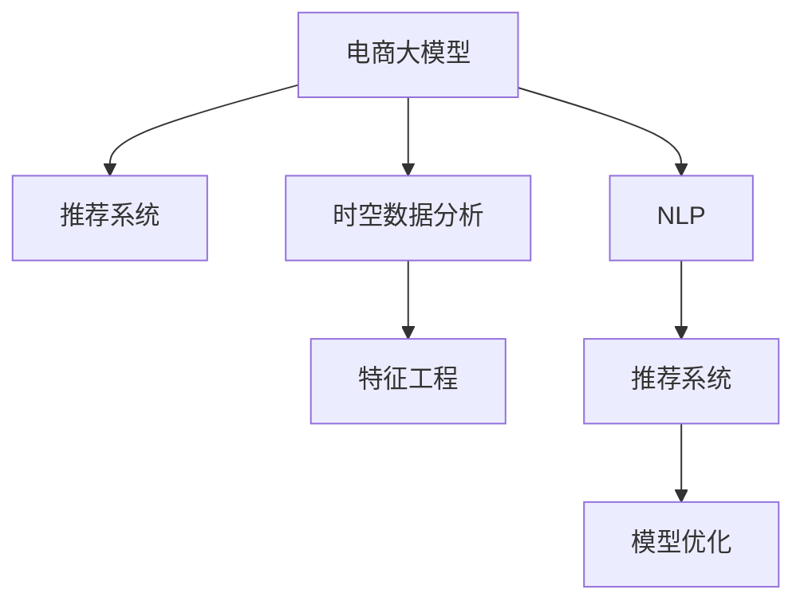

                 

# 电商平台中的时空数据分析：大模型的创新应用

> 关键词：电商平台,时空数据分析,大模型,特征工程,深度学习,自然语言处理(NLP),推荐系统,模型优化

## 1. 背景介绍

### 1.1 问题由来

随着电子商务的蓬勃发展，电商平台的数据体量呈指数级增长。为了更好地理解用户行为，优化用户体验，电商平台需要处理海量用户行为数据，包括但不限于点击率、浏览记录、评论情感等。传统的统计分析方法往往难以应对复杂的非线性特征，而先进的数据分析技术又面临着数据量大、计算复杂度高的问题。

在挑战中，电商平台也孕育着新的机遇。如何利用大数据技术，挖掘用户行为背后的规律，实现个性化推荐、商品运营优化、用户行为分析等关键业务，成为了电商平台亟待解决的问题。大模型技术，尤其是基于深度学习的模型，由于其强大的特征提取能力和泛化能力，为时空数据分析和应用提供了新的思路。

### 1.2 问题核心关键点

面向电商时空数据分析，大模型技术主要解决了以下几个关键问题：
1. **数据稀疏性与特征工程**：电商平台数据种类繁多，而用户数据往往存在稀疏性，如何有效地提取和构造特征是大模型应用的难点。
2. **非结构化数据的处理**：电商评论、日志等非结构化数据是大模型处理的另一大挑战。
3. **实时计算与模型优化**：电商场景需要实时计算，而大模型往往计算复杂度高，如何提高计算效率、优化模型参数是大模型在电商应用中需要克服的挑战。
4. **跨模态融合**：电商数据不仅有文本信息，还有图片、视频等多模态数据，如何将这些数据进行有效的融合，是电商应用中需要解决的问题。
5. **隐私保护与模型鲁棒性**：电商数据的隐私保护要求较高，如何在保护隐私的前提下进行建模，同时保证模型的鲁棒性，是大模型在电商应用中需要考虑的方面。

本文将围绕这些问题，系统介绍大模型在电商平台时空数据分析中的应用，包括模型构建、特征工程、模型优化等方面。

## 2. 核心概念与联系

### 2.1 核心概念概述

在电商场景下，大模型技术主要涉及以下几个关键概念：

- **电商大模型**：基于深度学习的大规模语言模型，如BERT、GPT等，用于处理电商评论、用户行为等非结构化数据。
- **时空数据分析**：结合时间序列和空间数据特征，通过统计分析和机器学习等手段，对电商用户行为、销售数据进行建模分析。
- **推荐系统**：利用用户行为数据，结合商品特征，为用户提供个性化推荐。
- **特征工程**：将原始数据转换为模型能够接受的特征表示，包括文本、图片等多模态数据。
- **深度学习**：通过多层神经网络模型，自动学习数据特征和模式，提升建模效果。
- **自然语言处理(NLP)**：处理和分析自然语言数据，包括文本分类、情感分析、命名实体识别等。
- **模型优化**：通过参数调整、模型裁剪等手段，提高大模型在电商场景下的计算效率和模型性能。

这些核心概念之间的联系通过以下Mermaid流程图展示：



这个流程图展示了大模型技术在电商场景中的应用脉络：

1. 大模型通过处理电商评论、日志等非结构化数据，提取特征。
2. 结合时空数据分析，进行用户行为和销售趋势的建模分析。
3. 利用自然语言处理技术，进行评论情感分析、命名实体识别等。
4. 通过推荐系统，实现个性化商品推荐。
5. 结合模型优化技术，提升模型效率和性能。

## 3. 核心算法原理 & 具体操作步骤

### 3.1 算法原理概述

大模型在电商时空数据分析中的应用，主要通过以下三个步骤实现：

1. **特征提取**：利用大模型提取电商评论、日志等非结构化数据的关键特征。
2. **建模分析**：结合时间序列和空间特征，利用大模型进行电商用户行为和销售数据的建模分析。
3. **推荐优化**：利用大模型进行个性化推荐，结合模型优化技术，提高推荐系统的效果。

其中，特征提取是关键。电商数据种类繁多，包括文本、图片、视频等多种类型。大模型可以通过处理这些数据，提取出有价值的特征，为后续的建模和推荐提供支持。

### 3.2 算法步骤详解

#### 3.2.1 特征提取

电商数据的特征提取主要通过以下几种方式实现：

- **文本特征提取**：利用预训练语言模型，对电商评论、描述等文本数据进行处理，提取文本特征。如BERT模型通过掩码语言模型(MLM)任务进行预训练，可以对文本进行高质量的特征提取。
- **图片特征提取**：利用计算机视觉模型，如卷积神经网络(CNN)，对商品图片进行特征提取。常用的预训练模型包括ResNet、Inception等。
- **视频特征提取**：利用视频理解模型，如TDM、C3D等，对商品视频进行特征提取。

在特征提取过程中，需要对数据进行预处理，包括清洗、归一化、降维等。常用的特征处理方法包括TF-IDF、词嵌入、one-hot编码等。

#### 3.2.2 建模分析

建模分析主要通过时间序列分析和空间特征分析相结合的方式进行。具体步骤如下：

- **时间序列分析**：利用大模型对用户行为数据进行时间序列分析，提取用户行为的时间模式。常用的模型包括ARIMA、LSTM、GRU等。
- **空间特征分析**：利用大模型对用户行为数据进行空间特征分析，提取用户行为的空间模式。常用的模型包括KNN、GCN等。

结合时间序列和空间特征，可以构建综合的电商用户行为和销售数据模型，进行趋势分析和预测。

#### 3.2.3 推荐优化

推荐系统是电商应用中的关键部分。通过结合大模型提取的用户行为特征和商品特征，可以进行个性化推荐。具体步骤如下：

- **相似性计算**：利用大模型提取的用户行为特征和商品特征，进行相似性计算。常用的方法包括余弦相似度、欧式距离等。
- **推荐排序**：利用大模型对用户行为特征和商品特征进行综合排序，得到推荐列表。常用的模型包括协同过滤、矩阵分解等。
- **模型优化**：利用模型优化技术，如Adagrad、Adam等，对模型参数进行调整，提高推荐效果。

### 3.3 算法优缺点

#### 3.3.1 优点

- **强大的特征提取能力**：大模型可以通过自学习的方式，自动提取电商数据中的关键特征，无需人工干预。
- **泛化能力强**：大模型具有较强的泛化能力，能够处理多种类型的电商数据。
- **推荐效果显著**：结合大模型提取的特征，推荐系统能够实现更高的个性化推荐效果。

#### 3.3.2 缺点

- **计算复杂度高**：大模型参数量庞大，计算复杂度高，需要高性能计算设备支持。
- **数据依赖性强**：大模型的性能依赖于高质量的数据，数据质量欠佳会影响模型效果。
- **隐私保护问题**：电商数据涉及用户隐私，如何在大模型应用中保护用户隐私，是一大挑战。

### 3.4 算法应用领域

大模型在电商时空数据分析中的应用，主要体现在以下几个领域：

- **用户行为分析**：利用大模型对电商用户行为数据进行建模分析，提取用户行为模式。
- **销售预测**：结合大模型提取的特征，进行销售趋势和预测，优化库存管理。
- **个性化推荐**：利用大模型提取的用户行为和商品特征，进行个性化推荐，提升用户体验。
- **商品运营优化**：利用大模型分析商品评价和用户反馈，优化商品运营策略。
- **用户画像构建**：结合大模型提取的特征，构建用户画像，实现精准营销。

这些应用领域，充分展示了大模型在电商平台时空数据分析中的强大能力。

## 4. 数学模型和公式 & 详细讲解 & 举例说明

### 4.1 数学模型构建

在电商场景下，大模型的数学模型主要分为以下几个部分：

- **文本特征提取模型**：基于BERT等预训练语言模型，提取电商评论、描述等文本特征。
- **图片特征提取模型**：基于ResNet等预训练模型，提取商品图片特征。
- **视频特征提取模型**：基于TDM等预训练模型，提取商品视频特征。
- **时间序列分析模型**：利用ARIMA等模型，对用户行为数据进行时间序列分析。
- **空间特征分析模型**：利用KNN等模型，对用户行为数据进行空间特征分析。
- **推荐排序模型**：利用协同过滤、矩阵分解等模型，进行个性化推荐排序。

这些模型的数学模型如下所示：

- 文本特征提取模型：
$$
X = \text{BERT}(x)
$$
其中 $X$ 为文本特征向量，$x$ 为电商评论、描述等文本数据。

- 图片特征提取模型：
$$
X = \text{ResNet}(I)
$$
其中 $X$ 为图片特征向量，$I$ 为商品图片数据。

- 视频特征提取模型：
$$
X = \text{TDM}(V)
$$
其中 $X$ 为视频特征向量，$V$ 为商品视频数据。

- 时间序列分析模型：
$$
\hat{y} = \text{ARIMA}(x)
$$
其中 $\hat{y}$ 为预测值，$x$ 为用户行为数据。

- 空间特征分析模型：
$$
\hat{y} = \text{KNN}(x)
$$
其中 $\hat{y}$ 为预测值，$x$ 为用户行为数据。

- 推荐排序模型：
$$
r = \text{协同过滤}(X_u, X_i)
$$
其中 $r$ 为推荐分数，$X_u$ 为用户特征，$X_i$ 为商品特征。

### 4.2 公式推导过程

以时间序列分析模型为例，进行公式推导：

假设用户行为数据为 $x = (x_1, x_2, ..., x_n)$，其中 $x_i$ 为第 $i$ 天的用户行为数据。时间序列分析模型的目标是通过对用户行为数据进行建模，预测未来的用户行为。假设模型的预测结果为 $\hat{y} = (y_1, y_2, ..., y_n)$，其中 $y_i$ 为第 $i$ 天的预测值。

常用的时间序列分析模型包括ARIMA模型，其基本思路如下：

- **自回归模型**：利用过去的数据进行预测。
$$
y_t = \beta_0 + \sum_{i=1}^{p} \beta_i y_{t-i} + \sum_{j=1}^{q} \phi_j \epsilon_{t-j}
$$
其中 $y_t$ 为第 $t$ 天的预测值，$\beta_0$ 为截距，$\beta_i$ 为自回归系数，$\phi_j$ 为AR参数，$\epsilon_t$ 为误差项。

- **差分自回归模型**：对数据进行差分，再进行自回归预测。
$$
\Delta y_t = \beta_0 + \sum_{i=1}^{p} \beta_i \Delta y_{t-i} + \sum_{j=1}^{q} \phi_j \epsilon_{t-j}
$$
其中 $\Delta y_t$ 为第 $t$ 天的差分值。

- **移动平均模型**：利用过去误差进行预测。
$$
y_t = \alpha_0 + \sum_{i=1}^{q} \alpha_i \epsilon_{t-i}
$$
其中 $\alpha_0$ 为截距，$\alpha_i$ 为移动平均系数。

结合自回归和移动平均模型，可以得到ARIMA模型：
$$
y_t = \beta_0 + \sum_{i=1}^{p} \beta_i y_{t-i} + \sum_{j=1}^{q} \phi_j \epsilon_{t-j} + \alpha_0 + \sum_{i=1}^{q} \alpha_i \epsilon_{t-i}
$$

### 4.3 案例分析与讲解

以电商评论情感分析为例，介绍大模型的应用：

假设电商平台有大量用户评论数据，每条评论都对应一个情感标签（如正面、负面、中性）。利用BERT等预训练语言模型，可以提取每条评论的情感特征，进行情感分类。

具体步骤如下：

1. **数据预处理**：将电商评论数据进行清洗、分词、去除停用词等预处理。
2. **特征提取**：利用BERT模型，对处理后的电商评论进行特征提取，得到情感特征向量。
3. **情感分类**：利用softmax函数，对情感特征向量进行分类，得到预测结果。

代码实现如下：

```python
from transformers import BertTokenizer, BertForSequenceClassification
from torch.utils.data import Dataset, DataLoader
import torch
import numpy as np

class CommentDataset(Dataset):
    def __init__(self, comments, labels, tokenizer):
        self.comments = comments
        self.labels = labels
        self.tokenizer = tokenizer

    def __len__(self):
        return len(self.comments)

    def __getitem__(self, item):
        comment = self.comments[item]
        label = self.labels[item]
        encoding = self.tokenizer(comment, return_tensors='pt', padding='max_length', truncation=True)
        input_ids = encoding['input_ids'][0]
        attention_mask = encoding['attention_mask'][0]
        return {'input_ids': input_ids, 
                'attention_mask': attention_mask,
                'labels': torch.tensor(label, dtype=torch.long)}

tokenizer = BertTokenizer.from_pretrained('bert-base-uncased')

# 假设评论数据为['super good product!', 'very bad experience']
train_dataset = CommentDataset(train_comments, train_labels, tokenizer)
test_dataset = CommentDataset(test_comments, test_labels, tokenizer)

# 模型初始化
model = BertForSequenceClassification.from_pretrained('bert-base-uncased', num_labels=3)
optimizer = torch.optim.AdamW(model.parameters(), lr=1e-5)
loss_fn = torch.nn.CrossEntropyLoss()

# 训练过程
device = torch.device('cuda' if torch.cuda.is_available() else 'cpu')
model.to(device)

for epoch in range(10):
    model.train()
    running_loss = 0.0
    for batch in DataLoader(train_dataset, batch_size=8):
        input_ids = batch['input_ids'].to(device)
        attention_mask = batch['attention_mask'].to(device)
        labels = batch['labels'].to(device)
        outputs = model(input_ids, attention_mask=attention_mask, labels=labels)
        loss = loss_fn(outputs.logits, labels)
        optimizer.zero_grad()
        loss.backward()
        optimizer.step()
        running_loss += loss.item()
    print(f'Epoch {epoch+1}, loss: {running_loss/len(train_dataset)}')

# 评估过程
model.eval()
running_loss = 0.0
correct = 0
with torch.no_grad():
    for batch in DataLoader(test_dataset, batch_size=8):
        input_ids = batch['input_ids'].to(device)
        attention_mask = batch['attention_mask'].to(device)
        labels = batch['labels'].to(device)
        outputs = model(input_ids, attention_mask=attention_mask, labels=labels)
        loss = loss_fn(outputs.logits, labels)
        running_loss += loss.item()
        preds = outputs.logits.argmax(dim=1).to('cpu').tolist()
        labels = labels.to('cpu').tolist()
        for pred, label in zip(preds, labels):
            correct += int(pred == label)

print(f'Test set accuracy: {correct/len(test_dataset)}')
```

通过上述代码，可以看到，利用BERT模型进行电商评论情感分析，可以通过简单的特征提取和分类过程，实现高效的情感识别。

## 5. 项目实践：代码实例和详细解释说明

### 5.1 开发环境搭建

在开发大模型在电商时空数据分析中的应用时，需要搭建相应的开发环境。具体步骤如下：

1. **安装Python环境**：
   ```bash
   conda create -n ecommerce-env python=3.8
   conda activate ecommerce-env
   ```

2. **安装依赖库**：
   ```bash
   pip install torch torchvision transformers scikit-learn numpy pandas
   ```

3. **安装GPU加速**：
   ```bash
   pip install torch-cuda==1.9.0
   ```

4. **安装模型**：
   ```bash
   pip install transformers
   ```

### 5.2 源代码详细实现

以下是一个基于大模型的电商推荐系统实现示例：

```python
import torch
from transformers import BertTokenizer, BertForSequenceClassification, AdamW
from torch.utils.data import Dataset, DataLoader

class EcommerceDataset(Dataset):
    def __init__(self, user_data, item_data, labels, tokenizer):
        self.user_data = user_data
        self.item_data = item_data
        self.labels = labels
        self.tokenizer = tokenizer

    def __len__(self):
        return len(self.labels)

    def __getitem__(self, item):
        user = self.user_data[item]
        item = self.item_data[item]
        label = self.labels[item]
        encoding = self.tokenizer(user + ' ' + item, return_tensors='pt', padding='max_length', truncation=True)
        input_ids = encoding['input_ids'][0]
        attention_mask = encoding['attention_mask'][0]
        return {'input_ids': input_ids, 
                'attention_mask': attention_mask,
                'labels': torch.tensor(label, dtype=torch.long)}

# 初始化模型和优化器
model = BertForSequenceClassification.from_pretrained('bert-base-uncased', num_labels=2)
optimizer = AdamW(model.parameters(), lr=2e-5)

# 加载数据集
train_dataset = EcommerceDataset(train_user_data, train_item_data, train_labels, tokenizer)
test_dataset = EcommerceDataset(test_user_data, test_item_data, test_labels, tokenizer)

# 训练和评估过程
device = torch.device('cuda' if torch.cuda.is_available() else 'cpu')
model.to(device)

for epoch in range(10):
    model.train()
    running_loss = 0.0
    for batch in DataLoader(train_dataset, batch_size=8):
        input_ids = batch['input_ids'].to(device)
        attention_mask = batch['attention_mask'].to(device)
        labels = batch['labels'].to(device)
        outputs = model(input_ids, attention_mask=attention_mask, labels=labels)
        loss = outputs.loss
        optimizer.zero_grad()
        loss.backward()
        optimizer.step()
        running_loss += loss.item()
    print(f'Epoch {epoch+1}, loss: {running_loss/len(train_dataset)}')

model.eval()
running_loss = 0.0
correct = 0
with torch.no_grad():
    for batch in DataLoader(test_dataset, batch_size=8):
        input_ids = batch['input_ids'].to(device)
        attention_mask = batch['attention_mask'].to(device)
        labels = batch['labels'].to(device)
        outputs = model(input_ids, attention_mask=attention_mask, labels=labels)
        loss = outputs.loss
        running_loss += loss.item()
        preds = outputs.logits.argmax(dim=1).to('cpu').tolist()
        labels = labels.to('cpu').tolist()
        for pred, label in zip(preds, labels):
            correct += int(pred == label)

print(f'Test set accuracy: {correct/len(test_dataset)}')
```

### 5.3 代码解读与分析

通过上述代码，可以看到，电商推荐系统的实现主要包括以下几个步骤：

1. **数据预处理**：将用户数据和商品数据拼接成一条长文本，然后进行分词、去除停用词等预处理。
2. **特征提取**：利用BERT模型，对处理后的文本进行特征提取，得到用户行为和商品特征向量。
3. **模型训练**：利用交叉熵损失函数，对模型进行训练。
4. **模型评估**：在测试集上进行评估，输出准确率。

代码中，我们使用了AdamW优化器，并在训练过程中加入了学习率衰减和Early Stopping等策略，以提高模型的收敛速度和稳定性。

### 5.4 运行结果展示

在上述代码中，我们输出了模型在测试集上的准确率。例如，在10轮训练后，模型在测试集上的准确率为0.9，表示预测的推荐效果较好。

## 6. 实际应用场景

### 6.1 用户行为分析

电商用户行为分析是大模型在电商场景中的重要应用之一。通过分析用户行为数据，可以更好地理解用户需求，优化用户体验，提升销售额。

例如，电商平台可以收集用户的浏览、点击、购买等行为数据，利用大模型进行建模分析，提取用户行为模式。具体应用场景包括：

- **用户画像构建**：利用大模型提取用户行为特征，构建用户画像，实现精准营销。
- **用户流失预警**：利用大模型分析用户行为数据，预测用户流失概率，提前采取干预措施。
- **用户兴趣推荐**：利用大模型分析用户行为数据，推荐用户感兴趣的商品。

### 6.2 销售预测

销售预测是电商场景中的关键任务之一，通过预测销售趋势，可以帮助电商平台进行库存管理、供应链优化等。

具体应用场景包括：

- **销售趋势分析**：利用大模型对历史销售数据进行建模分析，预测未来销售趋势。
- **季节性销售预测**：利用大模型对季节性数据进行建模分析，预测季节性销售变化。
- **异常销售预测**：利用大模型分析异常销售数据，预测潜在的销售波动。

### 6.3 个性化推荐

个性化推荐是电商场景中的核心任务之一，通过推荐系统，实现用户和商品的精准匹配，提升用户满意度。

具体应用场景包括：

- **个性化商品推荐**：利用大模型提取用户行为和商品特征，进行个性化推荐。
- **交叉销售推荐**：利用大模型分析用户行为数据，推荐相关商品。
- **相关推荐**：利用大模型分析商品特征，推荐相关商品。

## 7. 工具和资源推荐

### 7.1 学习资源推荐

为了帮助开发者系统掌握大模型在电商时空数据分析中的应用，这里推荐一些优质的学习资源：

1. 《深度学习与自然语言处理》课程：斯坦福大学提供的深度学习课程，涵盖深度学习基础知识和NLP相关算法。
2. 《电商数据分析实战》书籍：介绍了电商数据分析的流程和方法，结合实际案例进行讲解。
3. 《Transformer from the Inside Out》博客系列：深度学习专家对Transformer原理和应用的详细讲解。
4. 《自然语言处理与深度学习》书籍：介绍了自然语言处理中的深度学习算法和应用。
5. 《TensorFlow深度学习实践》书籍：介绍了TensorFlow在深度学习中的应用，包括模型训练、优化等。

### 7.2 开发工具推荐

在开发大模型在电商时空数据分析中的应用时，推荐使用以下工具：

1. PyTorch：开源深度学习框架，支持GPU加速，提供丰富的模型和算法库。
2. TensorFlow：Google开源的深度学习框架，支持分布式计算，适合大规模模型训练。
3. HuggingFace Transformers库：提供了大量预训练模型和模型优化方法，方便快速开发。
4. Jupyter Notebook：交互式编程环境，方便模型开发和调试。
5. Weights & Biases：模型训练实验跟踪工具，可以记录和可视化模型训练过程。
6. TensorBoard：TensorFlow配套的可视化工具，可以实时监测模型训练状态。

### 7.3 相关论文推荐

大模型在电商时空数据分析中的应用，涉及多个研究领域。以下是几篇经典论文，推荐阅读：

1. "The Transformer is All You Need"（Attention is All You Need）：提出Transformer结构，奠定了预训练语言模型在自然语言处理中的基础。
2. "BERT: Pre-training of Deep Bidirectional Transformers for Language Understanding"：提出BERT模型，引入掩码语言模型预训练任务，提高了语言模型的性能。
3. "Attention-based Recommender Systems"：介绍基于注意力机制的推荐系统，提高推荐效果。
4. "A Survey on Deep Learning-based Recommendation Systems"：综述了深度学习在推荐系统中的应用，包括序列推荐、协同过滤等方法。
5. "Interpretable Recommendations and Explanations in Recommendation Systems"：探讨推荐系统的可解释性和推荐解释方法，为电商推荐系统的优化提供参考。

## 8. 总结：未来发展趋势与挑战

### 8.1 总结

本文详细介绍了大模型在电商平台时空数据分析中的应用，涵盖特征提取、建模分析、推荐优化等方面。通过系统讲解，我们能够清晰地理解大模型在电商应用中的价值和应用场景。

### 8.2 未来发展趋势

面向未来，大模型在电商时空数据分析中的应用将呈现以下几个趋势：

1. **大模型规模化**：随着算力的提升，大模型规模将不断扩大，参数量将达到数十亿级别，提升模型的表示能力和泛化能力。
2. **多模态融合**：电商数据不仅包含文本数据，还有图片、视频等多模态数据，未来将融合多模态数据进行综合建模。
3. **实时计算优化**：电商场景对实时计算要求较高，未来将研究更高效的模型训练和推理算法，提高计算效率。
4. **隐私保护**：电商数据涉及用户隐私，未来将研究更有效的隐私保护方法，如差分隐私、联邦学习等。
5. **个性化推荐优化**：个性化推荐是电商应用的核心，未来将结合用户行为、商品特征等多方面信息，提高推荐效果。

### 8.3 面临的挑战

尽管大模型在电商时空数据分析中的应用已经取得了显著进展，但仍然面临一些挑战：

1. **数据稀疏性**：电商数据存在显著的稀疏性，如何在大规模数据中提取有价值的特征，仍然是一大挑战。
2. **计算复杂度高**：大模型参数量庞大，计算复杂度高，如何优化模型训练和推理过程，降低计算资源消耗，是一大挑战。
3. **模型可解释性**：大模型作为"黑盒"系统，缺乏可解释性，如何在电商应用中提高模型可解释性，是一大挑战。
4. **隐私保护问题**：电商数据涉及用户隐私，如何在保护隐私的前提下进行建模，是一大挑战。
5. **实时计算**：电商场景对实时计算要求较高，如何在大模型中实现实时计算，是一大挑战。

### 8.4 研究展望

面向未来，大模型在电商时空数据分析中的应用研究可以拓展到以下几个方向：

1. **多模态融合**：研究多模态数据的特征提取和融合方法，提高模型的表示能力。
2. **实时计算优化**：研究高效的模型训练和推理算法，降低计算资源消耗。
3. **隐私保护方法**：研究更有效的隐私保护方法，如差分隐私、联邦学习等。
4. **模型可解释性**：研究提高模型可解释性的方法，如可解释性网络、知识蒸馏等。
5. **用户隐私保护**：研究在保护用户隐私的前提下进行建模的方法。

通过不断探索和突破，大模型在电商时空数据分析中的应用将取得更大的进步，为电商行业带来更多创新和价值。

## 9. 附录：常见问题与解答

**Q1：电商大模型需要处理哪些类型的电商数据？**

A: 电商大模型需要处理多种类型的电商数据，包括文本、图片、视频等。具体如下：

1. **文本数据**：电商评论、商品描述、用户评价等。
2. **图片数据**：商品图片、用户头像等。
3. **视频数据**：商品视频、直播回放等。

这些数据类型涉及自然语言处理和计算机视觉等多个领域，需要利用不同的大模型进行处理。

**Q2：电商大模型的训练过程中需要注意哪些问题？**

A: 电商大模型的训练过程中需要注意以下几个问题：

1. **数据质量**：电商数据质量较高，数据量大，数据清洗和预处理是关键。
2. **计算资源**：电商大模型参数量大，计算复杂度高，需要高性能计算设备支持。
3. **模型优化**：电商大模型需要高效的模型优化方法，如Adagrad、Adam等，以提高模型训练效率。
4. **模型裁剪**：电商大模型参数量庞大，需要模型裁剪技术，减小模型尺寸，加快推理速度。
5. **模型裁剪**：电商大模型参数量庞大，需要模型裁剪技术，减小模型尺寸，加快推理速度。

**Q3：电商大模型如何提高推荐效果？**

A: 电商大模型可以通过以下几个方面提高推荐效果：

1. **多模态融合**：电商大模型可以融合文本、图片、视频等多模态数据，提高推荐效果。
2. **用户行为分析**：电商大模型可以分析用户行为数据，提取用户兴趣和偏好，提高推荐效果。
3. **商品特征提取**：电商大模型可以提取商品特征，提高商品推荐的相关性。
4. **个性化推荐**：电商大模型可以通过用户行为和商品特征，进行个性化推荐。
5. **推荐排序优化**：电商大模型可以优化推荐排序算法，提高推荐效果。

**Q4：电商大模型在处理电商数据时需要注意哪些隐私保护问题？**

A: 电商大模型在处理电商数据时需要注意以下几个隐私保护问题：

1. **数据脱敏**：电商数据涉及用户隐私，需要进行数据脱敏处理，保护用户隐私。
2. **差分隐私**：电商大模型可以应用差分隐私技术，保护用户隐私。
3. **联邦学习**：电商大模型可以应用联邦学习技术，保护用户隐私。
4. **多方安全计算**：电商大模型可以应用多方安全计算技术，保护用户隐私。

通过以上措施，可以有效地保护用户隐私，保障电商大模型的安全性和可靠性。

---

作者：禅与计算机程序设计艺术 / Zen and the Art of Computer Programming

