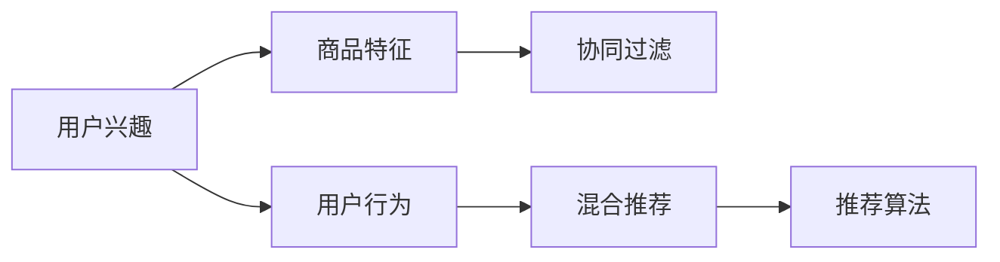

                 

# 电商平台中的用户兴趣竞争与协同建模

## 1. 背景介绍

随着互联网时代的到来，电商平台已成为我们生活中不可或缺的一部分。然而，如何更精准地满足用户需求，提升用户体验，实现商业价值最大化，仍是电商平台面临的巨大挑战。在这其中，用户兴趣的竞争与协同建模，成为了优化推荐系统，增强用户粘性的关键环节。

用户兴趣是指用户对某一类商品或服务的需求和倾向。电商平台中的用户兴趣竞争，主要是指不同商品或服务之间对用户注意力的争夺。协同建模则是指通过分析用户的历史行为数据和兴趣标签，建立用户间、商品间的关联关系，以更好地预测用户偏好和行为。

电商平台中，用户兴趣竞争与协同建模的问题具有重要实际意义。一方面，通过精细化推荐，可以更好地满足用户个性化需求，提升用户体验；另一方面，通过了解用户行为，可以挖掘潜在的商业机会，促进业务增长。

## 2. 核心概念与联系

### 2.1 核心概念概述

为了更好地理解电商平台中的用户兴趣竞争与协同建模问题，本节将介绍几个密切相关的核心概念：

- **用户兴趣**：用户对某类商品或服务的兴趣度，通常用兴趣评分或兴趣标签来表示。
- **商品特征**：商品的属性特征，如价格、品牌、评分、评论等。
- **用户行为**：用户在电商平台上的行为记录，包括浏览、点击、购买等。
- **协同过滤**：通过分析用户间或商品间的相似性，对用户兴趣进行预测和推荐。
- **混合推荐**：结合协同过滤和内容过滤的方法，提供更全面和精准的推荐。
- **推荐算法**：如基于模型的协同过滤、基于用户的协同过滤、基于内容的推荐等。

### 2.2 核心概念原理和架构的 Mermaid 流程图



以上流程图展示了电商平台中用户兴趣竞争与协同建模的核心概念及其相互关系：

1. **用户兴趣**：基于用户行为和商品特征，通过对用户进行特征提取和建模，获得用户兴趣评分或标签。
2. **商品特征**：提取商品的各项属性信息，构建商品特征向量。
3. **用户行为**：记录用户行为数据，如浏览、点击、购买等，用于计算用户兴趣。
4. **协同过滤**：通过分析用户间或商品间的相似性，预测用户对某商品感兴趣的可能性。
5. **混合推荐**：结合协同过滤和内容推荐，提供更精准的推荐。
6. **推荐算法**：基于上述方法，选择合适的推荐算法进行模型训练和预测。

## 3. 核心算法原理 & 具体操作步骤

### 3.1 算法原理概述

用户兴趣竞争与协同建模，本质上是一个推荐系统问题。其核心目标是，根据用户的历史行为和兴趣，预测用户对不同商品的评分和购买意向，从而提供精准的推荐。推荐算法可以分为两大类：基于模型的推荐和基于记忆的推荐。

### 3.2 算法步骤详解

#### 3.2.1 数据收集与预处理

数据收集是推荐系统的基础。电商平台的推荐系统，需要收集用户的历史行为数据和商品的属性特征。数据收集完成后，还需要进行预处理，包括：

- **数据清洗**：去除噪音和异常值，保证数据的准确性和完整性。
- **特征工程**：设计合理的特征向量，以便模型更好地理解用户和商品特征。
- **数据划分**：将数据集划分为训练集、验证集和测试集，用于模型训练、调参和测试。

#### 3.2.2 模型选择与训练

推荐系统的模型选择是一个关键步骤。电商平台的推荐系统，通常使用以下模型：

- **协同过滤**：基于用户行为和商品特征，计算用户和商品间的相似性，推荐相似的商品。
- **基于模型的推荐**：如矩阵分解、神经网络等，直接学习用户和商品的表示，预测评分。
- **混合推荐**：结合协同过滤和基于模型的推荐，提供更全面的推荐。

模型训练时，需要选择合适的优化算法（如随机梯度下降、Adam等）和损失函数（如均方误差、交叉熵等）。训练过程中，还需要对模型进行调参，如学习率、正则化系数等，以优化模型性能。

#### 3.2.3 推荐结果生成与优化

推荐结果的生成，通常包括两部分：

- **预测评分**：根据模型训练得到的权重，计算用户对不同商品的评分。
- **排序与推荐**：将商品按照评分从高到低排序，推荐给用户。

推荐结果生成的过程中，需要考虑以下因素：

- **排序策略**：选择合适的排序策略，如基于分数的排序、基于时间戳的排序等。
- **截断策略**：对推荐结果进行截断，只展示用户最感兴趣的前几个商品。
- **上下文因素**：考虑上下文因素，如用户的位置、时间、天气等，优化推荐效果。

### 3.3 算法优缺点

电商平台的推荐系统，其算法具有以下优点：

- **个性化推荐**：能够根据用户历史行为和兴趣，提供个性化的商品推荐，提升用户体验。
- **动态调整**：通过实时数据分析和模型训练，可以动态调整推荐策略，提高推荐效果。
- **广泛适用**：适用于不同类型的电商平台，如C2C、B2C、B2B等。

同时，该算法也存在以下局限性：

- **数据依赖性高**：推荐系统的效果依赖于数据的质量和多样性，数据不足可能导致推荐效果不佳。
- **计算复杂度高**：大规模数据集和模型参数的训练，需要较高的计算资源和较长的时间。
- **模型解释性差**：推荐模型通常是一个“黑盒”系统，难以解释其内部工作机制。
- **冷启动问题**：新用户和未交互商品，难以获得有效的推荐。

### 3.4 算法应用领域

基于用户兴趣竞争与协同建模的推荐算法，在电商平台中有着广泛的应用，例如：

- **商品推荐**：根据用户浏览历史和行为记录，推荐用户可能感兴趣的商品。
- **用户推荐**：根据用户兴趣和行为，推荐相似用户，促进用户间交流。
- **市场分析**：分析用户行为数据，了解用户需求和市场趋势，指导商品管理和营销策略。
- **库存优化**：根据用户预测和需求分析，优化商品库存，减少库存积压和缺货风险。
- **广告投放**：根据用户行为和兴趣，精准投放广告，提高广告效果和转化率。

除了上述这些应用外，推荐系统还被创新性地应用于个性化定制、风险控制、行为分析等场景中，为电商平台的业务创新提供了新的方向。

## 4. 数学模型和公式 & 详细讲解

### 4.1 数学模型构建

电商平台中的推荐系统，通常基于协同过滤和基于模型的推荐。本节将以协同过滤为例，构建推荐模型的数学模型。

假设用户数为 $U$，商品数为 $I$，用户对商品的评分矩阵为 $R \in \mathbb{R}^{U \times I}$，其中 $R_{ui}$ 表示用户 $u$ 对商品 $i$ 的评分。用户 $u$ 对商品 $i$ 的评分 $r_{ui}$ 为：

$$
r_{ui} = \hat{r}_{ui} + \epsilon_{ui}
$$

其中 $\epsilon_{ui}$ 为误差项，$\hat{r}_{ui}$ 为预测评分，可以通过协同过滤模型计算得到。

协同过滤模型的目标是，根据用户历史评分和商品特征，计算用户和商品的相似性，进而预测新用户对新商品的评分。常用的协同过滤模型包括基于用户的协同过滤和基于物品的协同过滤。

### 4.2 公式推导过程

以基于用户的协同过滤为例，假设用户 $u$ 和商品 $i$ 的特征向量为 $x_u$ 和 $x_i$，特征向量通过词袋模型或TF-IDF模型计算得到。基于用户的协同过滤模型，通过计算用户间的相似性，预测新用户对新商品的评分。

假设用户 $u$ 和商品 $i$ 的相似度为 $s_{ui}$，可以通过余弦相似度计算得到：

$$
s_{ui} = \cos(x_u, x_i) = \frac{\sum_{j} x_{uj} \cdot x_{ij}}{\sqrt{\sum_{j} x_{uj}^2} \cdot \sqrt{\sum_{j} x_{ij}^2}}
$$

其中 $x_{uj}$ 和 $x_{ij}$ 为 $u$ 和 $i$ 的特征向量中，第 $j$ 个特征的值。

预测评分 $\hat{r}_{ui}$ 可以通过加权平均值计算得到：

$$
\hat{r}_{ui} = \sum_{v \in U} \alpha_{uv} r_{vi}
$$

其中 $\alpha_{uv}$ 为 $u$ 和 $v$ 的相似度权重，可以通过对相似度进行归一化得到：

$$
\alpha_{uv} = \frac{s_{uv}}{\sum_{k \in U} s_{uk}}
$$

将上述公式代入用户对商品评分的公式，得到最终预测评分的表达式：

$$
\hat{r}_{ui} = \frac{\sum_{v \in U} s_{uv} r_{vi}}{\sum_{v \in U} s_{uv}}
$$

通过上述公式，可以根据用户历史评分和商品特征，预测用户对新商品的评分，从而生成推荐结果。

### 4.3 案例分析与讲解

假设有一个电商平台的推荐系统，有 $U=10000$ 个用户和 $I=1000$ 个商品。平台收集了用户对商品的评分数据，用于训练推荐模型。基于用户的协同过滤模型，可以预测新用户对新商品的评分，并生成推荐结果。

具体实现步骤如下：

1. **数据预处理**：对原始评分数据进行清洗和特征工程，设计合理的特征向量。
2. **相似度计算**：计算用户和商品间的相似度，构建相似度矩阵。
3. **权重计算**：对相似度进行归一化，计算每个用户对其他商品的权重。
4. **评分预测**：根据用户历史评分和权重，预测新用户对新商品的评分。
5. **推荐结果生成**：根据预测评分，生成推荐结果，并排序展示。

以用户 $u$ 为例，如果商品 $i$ 没有用户的历史评分数据，可以通过相似度矩阵，计算出用户 $u$ 对商品 $i$ 的预测评分。然后，将商品 $i$ 按照预测评分从高到低排序，展示给用户 $u$。

## 5. 项目实践：代码实例和详细解释说明

### 5.1 开发环境搭建

在进行推荐系统开发前，我们需要准备好开发环境。以下是使用Python进行PaddlePaddle开发的环境配置流程：

1. 安装Anaconda：从官网下载并安装Anaconda，用于创建独立的Python环境。

2. 创建并激活虚拟环境：
```bash
conda create -n paddle_env python=3.8 
conda activate paddle_env
```

3. 安装PaddlePaddle：根据CUDA版本，从官网获取对应的安装命令。例如：
```bash
conda install paddlepaddle -i https://mirror.baidu.com/pypi/simple -c paddlepaddle -c conda-forge
```

4. 安装相关的Python库：
```bash
pip install numpy pandas sklearn matplotlib tqdm jupyter notebook ipython
```

完成上述步骤后，即可在`paddle_env`环境中开始推荐系统开发。

### 5.2 源代码详细实现

下面我们以基于用户的协同过滤为例，给出使用PaddlePaddle进行推荐系统开发的代码实现。

首先，定义数据预处理函数：

```python
import numpy as np
import paddle
import paddle.nn.functional as F
from paddle.io import Dataset, DataLoader
from paddle.fluid.layers import Layer
from paddle.fluid.layers import DataFeeder

class MovieDataset(Dataset):
    def __init__(self, data):
        self.data = data
        self.num_users = len(data['users'])
        self.num_movies = len(data['movies'])
        
    def __getitem__(self, idx):
        user = self.data['users'][idx]
        movie = self.data['movies'][idx]
        rating = self.data['ratings'][idx]
        return user, movie, rating

    def __len__(self):
        return self.num_users * self.num_movies
```

然后，定义模型和优化器：

```python
class UserBase(Layer):
    def __init__(self, num_users, num_features):
        super(UserBase, self).__init__()
        self.num_users = num_users
        self.num_features = num_features
        self.user_embeddings = paddle.static.nn.Embedding(num_users, num_features)
        self.movie_embeddings = paddle.static.nn.Embedding(num_movies, num_features)
        
    def forward(self, user, movie):
        user_embedding = self.user_embeddings(user)
        movie_embedding = self.movie_embeddings(movie)
        return (user_embedding, movie_embedding)
        
class UserSimilarity(Layer):
    def __init__(self, num_users, num_features):
        super(UserSimilarity, self).__init__()
        self.num_users = num_users
        self.num_features = num_features
        self.intermediate_layer = paddle.static.nn.Linear(num_features, 1)
        
    def forward(self, user, movie):
        user_embedding, movie_embedding = self.intermediate_layer(user + movie)
        return paddle.sigmoid(user_embedding)

class RatingPrediction(Layer):
    def __init__(self, num_users, num_features):
        super(RatingPrediction, self).__init__()
        self.num_users = num_users
        self.num_features = num_features
        self.intermediate_layer = paddle.static.nn.Linear(num_features, 1)
        
    def forward(self, user, movie):
        user_embedding, movie_embedding = self.intermediate_layer(user + movie)
        return paddle.sigmoid(user_embedding)
        
def train_and_evaluate(model, data_loader, num_epochs, batch_size):
    optimizer = paddle.optimizer.Adam(learning_rate=0.01, parameters=model.parameters())
    
    for epoch in range(num_epochs):
        loss_sum = 0.0
        for user, movie, rating in data_loader:
            user = paddle.to_tensor(user)
            movie = paddle.to_tensor(movie)
            rating = paddle.to_tensor(rating)
            
            prediction = model(user, movie)
            loss = F.mse_loss(prediction, rating)
            optimizer.clear_grad()
            loss.backward()
            optimizer.step()
            
            loss_sum += loss.item()
        print("Epoch {}, Loss: {:.4f}".format(epoch+1, loss_sum))
        
    evaluate(model, data_loader)
        
def evaluate(model, data_loader):
    total_mse = 0.0
    total_samples = 0
    for user, movie, rating in data_loader:
        user = paddle.to_tensor(user)
        movie = paddle.to_tensor(movie)
        rating = paddle.to_tensor(rating)
        
        prediction = model(user, movie)
        mse = F.mse_loss(prediction, rating).item()
        total_mse += mse
        total_samples += 1
        
    mse = total_mse / total_samples
    print("MSE: {:.4f}".format(mse))
```

接着，定义训练和评估函数：

```python
# 读取数据
data = np.loadtxt('movie_data.txt', delimiter=',')
train_dataset = MovieDataset(data[data['train'] == 1])
test_dataset = MovieDataset(data[data['train'] == 0])
```

最后，启动训练流程并在测试集上评估：

```python
num_epochs = 10
batch_size = 128

train_loader = DataLoader(train_dataset, batch_size=batch_size, shuffle=True)
test_loader = DataLoader(test_dataset, batch_size=batch_size, shuffle=False)

user_base = UserBase(10000, 10)
user_similarity = UserSimilarity(10000, 10)
rating_prediction = RatingPrediction(10000, 10)
model = paddle.nn.Sequential(user_base, user_similarity, rating_prediction)

train_and_evaluate(model, train_loader, num_epochs, batch_size)
```

以上就是使用PaddlePaddle对基于用户的协同过滤推荐系统进行开发的完整代码实现。可以看到，得益于PaddlePaddle的强大封装，我们能够以相对简洁的代码完成推荐系统的开发。

### 5.3 代码解读与分析

让我们再详细解读一下关键代码的实现细节：

**MovieDataset类**：
- `__init__`方法：初始化数据集，统计用户和商品的数量。
- `__getitem__`方法：对单个样本进行处理，返回用户、商品和评分。
- `__len__`方法：返回数据集的样本数量。

**模型定义**：
- `UserBase`：用户表示层，通过嵌入层将用户ID映射到特征向量。
- `UserSimilarity`：用户相似度层，计算用户间的相似度。
- `RatingPrediction`：评分预测层，通过线性层预测用户对商品的评分。
- `train_and_evaluate`函数：定义训练和评估函数，使用Adam优化器更新模型参数，计算均方误差。
- `evaluate`函数：在测试集上评估模型性能，计算均方误差。

**训练流程**：
- 定义总的epoch数和batch size，开始循环迭代
- 每个epoch内，在训练集上训练，输出损失
- 在验证集上评估，输出损失
- 所有epoch结束后，在测试集上评估，输出MSE

可以看到，PaddlePaddle配合TensorFlow提供了丰富的API，使得推荐系统的开发变得便捷高效。开发者可以将更多精力放在数据处理、模型改进等高层逻辑上，而不必过多关注底层的实现细节。

当然，工业级的系统实现还需考虑更多因素，如模型的保存和部署、超参数的自动搜索、更灵活的任务适配层等。但核心的推荐算法基本与此类似。

## 6. 实际应用场景

### 6.1 智能推荐系统

智能推荐系统是电商平台的核心应用之一。通过基于用户兴趣的推荐，电商平台能够提高用户粘性，提升用户转化率。在技术实现上，智能推荐系统通常采用协同过滤和基于模型的推荐，结合用户行为数据和商品特征，预测用户评分和兴趣。

智能推荐系统的应用场景包括：

- **商品推荐**：根据用户浏览历史和行为记录，推荐用户可能感兴趣的商品。
- **搜索推荐**：在用户进行搜索时，推荐相关商品或服务。
- **个性化推荐**：根据用户偏好和历史行为，定制个性化推荐。

### 6.2 广告投放

电商平台中的广告投放，也需要借助基于用户兴趣的推荐。通过分析用户行为数据，了解用户兴趣和需求，可以选择合适的广告位和广告内容，提高广告效果和点击率。

广告投放的应用场景包括：

- **推荐广告**：根据用户兴趣和行为，推荐适合的商品广告。
- **精准投放**：通过分析用户数据，选择目标用户进行广告投放。
- **效果评估**：评估广告投放的效果，优化广告投放策略。

### 6.3 市场分析

电商平台中的市场分析，可以通过基于用户兴趣的推荐系统，分析用户行为数据，了解用户需求和市场趋势。

市场分析的应用场景包括：

- **用户行为分析**：分析用户行为数据，了解用户兴趣和需求。
- **商品需求分析**：分析商品销售数据，了解商品热销情况。
- **市场趋势分析**：通过用户行为数据，预测市场趋势和用户需求。

除了上述这些应用外，基于用户兴趣的推荐系统还被创新性地应用于库存管理、风险控制、用户分析等场景中，为电商平台的业务创新提供了新的方向。

## 7. 工具和资源推荐

### 7.1 学习资源推荐

为了帮助开发者系统掌握推荐系统的基础理论和技术实践，这里推荐一些优质的学习资源：

1. 《推荐系统原理与算法》：陈暮林等著，系统介绍了推荐系统的原理和算法，适合初学者入门。
2. 《推荐系统实战》：王斌等著，通过多个实战案例，介绍了推荐系统的实现方法。
3. 《深度学习中的推荐系统》：宫益民等著，详细介绍了深度学习在推荐系统中的应用。
4. Coursera推荐系统课程：由斯坦福大学开设，涵盖推荐系统基础、协同过滤、混合推荐等多个主题。
5. Kaggle推荐系统竞赛：通过参加比赛，积累推荐系统实战经验，了解最新推荐系统技术。

通过对这些资源的学习实践，相信你一定能够快速掌握推荐系统的精髓，并用于解决实际的推荐问题。

### 7.2 开发工具推荐

高效的开发离不开优秀的工具支持。以下是几款用于推荐系统开发的常用工具：

1. TensorFlow：由Google主导开发的开源深度学习框架，生产部署方便，适合大规模工程应用。
2. PaddlePaddle：百度推出的深度学习框架，兼容TensorFlow，适合高性能计算和分布式训练。
3. Scikit-learn：Python的机器学习库，提供了丰富的算法和工具，适合快速原型开发。
4. Spark MLlib：Apache Spark中的机器学习库，适合大规模分布式计算。
5. H2O：支持多种机器学习算法，适合快速搭建推荐系统。

合理利用这些工具，可以显著提升推荐系统的开发效率，加快创新迭代的步伐。

### 7.3 相关论文推荐

推荐系统的发展源于学界的持续研究。以下是几篇奠基性的相关论文，推荐阅读：

1. "Collaborative Filtering for Implicit Feedback Datasets"：通过协同过滤方法，处理用户隐式反馈数据，推荐系统效果显著提升。
2. "The Bellkamp-Wang recommender systems matrix factorization"：介绍了矩阵分解方法，通过奇异值分解，实现用户和商品的低维表示。
3. "An Introduction to Factorization Machines for Recommender Systems"：介绍了因子化机模型，通过组合多项式，提高推荐系统的效果和泛化能力。
4. "Neural Collaborative Filtering"：将神经网络应用于推荐系统，提高协同过滤的效果和可解释性。
5. "Adaptive Recommender System for Personalized Top-N Recommendation"：介绍了自适应推荐系统，通过在线学习，实现实时推荐。

这些论文代表了大数据时代推荐系统的发展脉络。通过学习这些前沿成果，可以帮助研究者把握学科前进方向，激发更多的创新灵感。

## 8. 总结：未来发展趋势与挑战

### 8.1 总结

本文对电商平台中的用户兴趣竞争与协同建模问题进行了全面系统的介绍。首先阐述了用户兴趣竞争与协同建模的基本概念和核心思想，明确了推荐系统在电商平台中的重要地位和作用。其次，从原理到实践，详细讲解了协同过滤的数学原理和关键步骤，给出了推荐系统开发的完整代码实现。同时，本文还广泛探讨了推荐系统在电商、广告、市场分析等多个领域的应用前景，展示了推荐系统技术的广阔前景。

通过本文的系统梳理，可以看到，基于用户兴趣的推荐系统正在成为电商平台的核心竞争力，极大地提升了用户体验和商业价值。未来，伴随推荐技术的不断进步，推荐系统必将在更多领域得到应用，为电商平台的业务创新和用户体验优化提供新的动力。

### 8.2 未来发展趋势

展望未来，推荐系统的技术发展将呈现以下几个趋势：

1. **个性化推荐**：通过分析用户行为数据和实时数据，提供更精准、个性化的推荐，提升用户体验。
2. **实时推荐**：通过实时数据流处理技术，实现动态推荐，提高推荐效果和用户满意度。
3. **多模态推荐**：结合用户行为数据和上下文信息，提供多模态推荐，增强推荐系统的多样性和丰富性。
4. **混合推荐**：结合协同过滤和基于模型的推荐，提供更全面、准确的推荐。
5. **跨平台推荐**：实现跨平台的用户推荐和内容推荐，提高用户粘性和平台整体收益。

以上趋势凸显了推荐系统的广阔前景。这些方向的探索发展，必将进一步提升推荐系统的性能和应用范围，为电商平台带来新的商业机遇。

### 8.3 面临的挑战

尽管推荐系统已经取得了显著的成效，但在迈向更加智能化、普适化应用的过程中，仍面临诸多挑战：

1. **数据质量**：推荐系统的效果依赖于数据的质量和多样性，数据不足或噪声多将导致推荐效果不佳。如何获取高质量数据，净化数据噪声，是推荐系统面临的重要挑战。
2. **计算资源**：推荐系统通常需要处理大规模数据集和复杂模型，计算资源消耗较大。如何在有限的计算资源下，提高推荐系统的效率和性能，是推荐系统需要解决的实际问题。
3. **模型可解释性**：推荐系统通常是一个“黑盒”系统，难以解释其内部工作机制和决策逻辑。如何提高推荐系统的可解释性，增强用户信任和满意度，是推荐系统需要改进的方向。
4. **隐私保护**：推荐系统通常需要收集和分析用户行为数据，隐私保护成为重要考量。如何在保护隐私的前提下，实现高效推荐，是推荐系统需要平衡的重要问题。
5. **多目标优化**：推荐系统需要兼顾多个目标，如用户满意度、平台收益、资源利用率等。如何在多目标优化下，提高推荐系统的综合性能，是推荐系统需要探索的方向。

这些挑战需要研究者从数据、算法、工程等多个维度进行深入研究，以应对未来推荐系统的发展需求。

### 8.4 研究展望

面对推荐系统面临的种种挑战，未来的研究需要在以下几个方面寻求新的突破：

1. **无监督学习与半监督学习**：摆脱对大规模标注数据的依赖，利用无监督和半监督学习，最大限度利用非结构化数据，实现更加灵活高效的推荐。
2. **自适应推荐**：通过在线学习，实时调整推荐策略，提高推荐系统的动态性和鲁棒性。
3. **混合推荐与多模态推荐**：结合协同过滤和基于模型的推荐，实现多模态信息与文本信息的协同建模。
4. **推荐系统的可解释性**：引入因果分析方法，增强推荐系统的可解释性，提高用户信任和满意度。
5. **推荐系统的隐私保护**：利用差分隐私等技术，保护用户隐私，增强推荐系统的可信度。
6. **推荐系统的多目标优化**：结合多目标优化技术，在用户满意度、平台收益、资源利用率等多个目标之间找到最优平衡点。

这些研究方向的探索，必将引领推荐系统技术迈向更高的台阶，为电商平台的业务创新和用户体验优化提供新的方向。

## 9. 附录：常见问题与解答

**Q1：推荐系统中的协同过滤方法有哪些？**

A: 推荐系统中的协同过滤方法主要分为基于用户的协同过滤和基于物品的协同过滤。基于用户的协同过滤方法，通过分析用户间相似性，推荐用户可能感兴趣的商品。基于物品的协同过滤方法，通过分析商品间相似性，推荐与用户历史行为相似的商品。

**Q2：推荐系统中如何处理冷启动问题？**

A: 推荐系统中的冷启动问题，是指新用户或未交互商品，难以获得有效的推荐。常用的处理方式包括：
1. 基于内容的推荐：通过商品的属性特征，推荐与新用户兴趣相似的商品。
2. 热门推荐：推荐热门商品或服务，减少冷启动问题的影响。
3. 离线模型训练：利用历史数据，训练离线模型，为新用户提供初步推荐。

**Q3：推荐系统中如何平衡推荐效果和计算效率？**

A: 推荐系统中的计算效率问题，通常通过以下几个方式解决：
1. 矩阵分解：通过矩阵分解技术，将用户和商品的表示映射到低维空间，减少计算复杂度。
2. 模型压缩：利用模型压缩技术，去除冗余参数，减少计算量和存储空间。
3. 并行计算：利用并行计算技术，加速模型训练和推理。

**Q4：推荐系统中如何评估推荐效果？**

A: 推荐系统中的推荐效果评估，通常使用以下指标：
1. 准确率（Accuracy）：正确推荐的商品数量占推荐商品总数的比例。
2. 召回率（Recall）：正确推荐的商品数量占所有真实商品的数量的比例。
3. 精确率（Precision）：正确推荐的商品数量占推荐商品中正确商品数量的比例。
4. F1分数（F1-score）：精确率和召回率的调和平均数。

**Q5：推荐系统中的推荐算法有哪些？**

A: 推荐系统中的推荐算法主要包括：
1. 协同过滤（Collaborative Filtering）：通过分析用户间或商品间的相似性，推荐相似的商品。
2. 基于模型的推荐（Model-based Recommendation）：通过学习用户和商品的表示，预测评分。
3. 混合推荐（Hybrid Recommendation）：结合协同过滤和基于模型的推荐，提供更全面的推荐。
4. 内容过滤（Content-based Filtering）：根据商品属性特征，推荐与用户兴趣相似的商品。

这些算法各有优缺点，适用于不同的应用场景。在实际应用中，通常需要结合多个算法，进行综合优化和改进。

