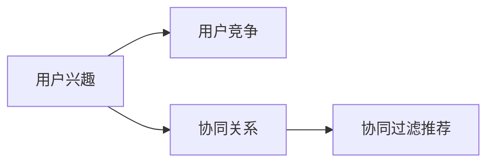

                 

# 电商平台中的用户兴趣竞争与协同模型

> 关键词：电商平台,用户兴趣,竞争协同,协同过滤,推荐系统,深度学习,个性化推荐

## 1. 背景介绍

在当今数字化经济时代，电商平台已成为了人们购物的主要渠道。它不仅打破了时空限制，提供了丰富的商品选择，还通过智能推荐系统提升了用户体验。推荐系统能够根据用户历史行为，预测其兴趣和需求，并为其推荐个性化商品，极大地提升了购物转化率和用户满意度。然而，用户兴趣的动态变化和多样的需求，使得推荐系统面临诸多挑战。

为了应对这些挑战，协同过滤(Collaborative Filtering)推荐算法被广泛应用于电商平台。协同过滤算法通过分析用户间的相似性，推断用户间的隐含偏好，从而进行个性化推荐。然而，协同过滤算法在数据稀疏性和冷启动问题上存在较大挑战，尤其是在用户兴趣动态变化和多用户竞争共存的环境中，如何更好地理解和建模用户兴趣竞争与协同关系，成为了推荐系统优化的关键。

## 2. 核心概念与联系

### 2.1 核心概念概述

协同过滤推荐系统在电商平台中的应用，涉及多个关键概念，包括用户兴趣、用户竞争、协同关系等。

- **用户兴趣**：指用户对商品的偏好和兴趣，通常由用户历史行为数据（如浏览、点击、购买等）生成。
- **用户竞争**：指不同用户间对相同商品或类别的兴趣竞争关系，反映了用户间需求的多样性和动态性。
- **协同关系**：指用户间基于兴趣的相似性关系，通过协同关系推断出用户潜在兴趣，提升推荐效果。

这些概念之间的关系可以通过以下Mermaid流程图来展示：



## 3. 核心算法原理 & 具体操作步骤

### 3.1 算法原理概述

基于协同过滤的推荐系统，通过分析用户历史行为数据，建立用户间的协同关系，推断用户未交互商品的潜在兴趣。其核心思想是：相似用户间通常具有相似的兴趣，从而可以共享兴趣。

在电商平台中，协同过滤推荐系统通常基于两种基本方式：

1. **基于用户的协同过滤**：通过分析用户历史行为，找到兴趣相似的用户，推荐这些用户喜欢的商品。
2. **基于物品的协同过滤**：通过分析商品间的相关性，找到用户可能喜欢的物品，推荐这些物品。

两种方式各有优缺点，实际应用中通常会结合使用。

### 3.2 算法步骤详解

#### 3.2.1 用户兴趣建模

用户兴趣建模是协同过滤推荐系统的第一步。需要从用户历史行为数据中，挖掘出用户对不同商品的兴趣程度。常用的方法包括：

- **点击率预测**：通过用户历史点击行为，预测其对商品的兴趣。
- **评分预测**：通过用户对商品的历史评分，预测其未来评分。
- **序列预测**：通过用户历史浏览或购买序列，预测其下一个可能购买的商品。

#### 3.2.2 协同关系构建

构建用户间的协同关系是协同过滤推荐系统的核心。常用的方法包括：

- **基于用户的相似度**：通过计算用户间的相似度（如皮尔逊相关系数、余弦相似度等），找到相似用户。
- **基于物品的相似度**：通过计算物品间的相似度（如共现矩阵、TF-IDF等），找到相似物品。

#### 3.2.3 协同过滤推荐

协同过滤推荐的核心是推断用户对未交互商品的兴趣。常用的方法包括：

- **基于用户的协同过滤**：找到与目标用户兴趣相似的用户，推荐这些用户喜欢的商品。
- **基于物品的协同过滤**：找到与目标商品相似的商品，推荐这些商品。

#### 3.2.4 推荐结果排序

推荐结果排序是将协同过滤推荐结果按照用户兴趣进行排序。常用的排序方法包括：

- **基于预测评分**：根据用户对商品的预测评分，对推荐结果排序。
- **基于排序模型**：使用机器学习模型（如协同过滤、深度学习等），对推荐结果进行排序。

### 3.3 算法优缺点

#### 3.3.1 优点

1. **无需商品属性信息**：协同过滤推荐系统不需要商品属性信息，只需用户行为数据即可，简化了特征工程。
2. **泛化能力强**：协同过滤推荐系统能够捕捉用户兴趣的复杂关系，推荐效果较好。
3. **易于实现**：基于用户或物品的协同过滤，算法实现简单，易于部署。

#### 3.3.2 缺点

1. **数据稀疏性**：用户行为数据稀疏，推荐系统需要大量的用户数据才能获得较好的效果。
2. **冷启动问题**：对于新用户或新商品，协同过滤推荐系统难以进行推荐。
3. **易受噪声影响**：用户行为数据中可能包含噪声，影响推荐结果的准确性。

### 3.4 算法应用领域

协同过滤推荐系统在电商平台中的应用广泛，涵盖了个性化推荐、广告推荐、内容推荐等多个场景。

- **个性化推荐**：根据用户历史行为，为用户推荐个性化商品，提升用户体验。
- **广告推荐**：根据用户兴趣，推荐个性化广告，提升广告效果。
- **内容推荐**：根据用户历史浏览记录，推荐相关内容，提升内容平台的用户粘性。

## 4. 数学模型和公式 & 详细讲解 & 举例说明

### 4.1 数学模型构建

协同过滤推荐系统的数学模型可以表示为：

$$
R_{ui} \sim P_{\theta}(R_{ui}|I_{u},S_i)
$$

其中 $R_{ui}$ 表示用户 $u$ 对商品 $i$ 的评分，$I_{u}$ 表示用户 $u$ 的历史评分数据，$S_i$ 表示商品 $i$ 的历史评分数据，$P_{\theta}$ 表示评分预测模型，$\theta$ 为模型参数。

### 4.2 公式推导过程

协同过滤推荐系统中的评分预测模型，通常基于协同过滤的基本原理，推导如下：

1. **用户间协同关系**：
$$
\sim \sum_{v \neq i} \frac{R_{vi}}{\sigma\sqrt{S_{vi}}}
$$

2. **物品间协同关系**：
$$
\sim \sum_{u \neq i} \frac{R_{ui}}{\sigma\sqrt{I_{ui}}}
$$

其中，$S_{vi}$ 表示商品 $v$ 的历史评分数据，$I_{vi}$ 表示用户 $v$ 的历史评分数据，$\sigma$ 为正则化系数。

### 4.3 案例分析与讲解

假设电商平台中有两个用户 $u_1$ 和 $u_2$，他们分别对商品 $i_1$ 和 $i_2$ 进行评分，评分数据如下：

| 用户 | 商品 | 评分 |
| --- | --- | --- |
| $u_1$ | $i_1$ | 4 |
| $u_1$ | $i_2$ | 3 |
| $u_2$ | $i_1$ | 5 |
| $u_2$ | $i_2$ | 2 |

根据协同过滤推荐算法，可以计算出 $u_1$ 和 $u_2$ 的协同关系，如基于用户相似度的方法：

$$
\text{similarity}(u_1, u_2) = \frac{4 \times 5 + 3 \times 2}{\sqrt{4^2 + 3^2} \times \sqrt{5^2 + 2^2}} \approx 0.857
$$

因此，$u_2$ 的评分预测为：

$$
P_{\theta}(R_{u_2}(i_1)|I_{u_2}, S_{i_1}) \approx 0.857 \times 4 \approx 3.43
$$

同理，可以计算出 $u_1$ 的评分预测为：

$$
P_{\theta}(R_{u_1}(i_2)|I_{u_1}, S_{i_2}) \approx 0.857 \times 3 \approx 2.57
$$

根据评分预测结果，可以推断出用户 $u_1$ 和 $u_2$ 的协同关系，从而进行推荐。

## 5. 项目实践：代码实例和详细解释说明

### 5.1 开发环境搭建

在进行协同过滤推荐系统开发前，需要先搭建好开发环境。以下是使用Python进行开发的步骤：

1. 安装Anaconda：从官网下载并安装Anaconda，用于创建独立的Python环境。

2. 创建并激活虚拟环境：
```bash
conda create -n recommendation-env python=3.8 
conda activate recommendation-env
```

3. 安装必要的Python库：
```bash
pip install numpy pandas scikit-learn torch sklearn
```

4. 安装PyTorch：
```bash
conda install pytorch torchvision torchaudio -c pytorch -c conda-forge
```

5. 安装Keras：
```bash
pip install keras tensorflow-gpu
```

### 5.2 源代码详细实现

以下是一个简单的协同过滤推荐系统的代码实现。假设我们有一个用户行为数据集，其中每个用户对每个商品都有评分。

```python
import numpy as np
from sklearn.metrics.pairwise import cosine_similarity

# 用户-商品评分矩阵
ratings = np.array([
    [5, 3, 1, 0, 0],
    [4, 0, 4, 0, 5],
    [0, 5, 4, 3, 1],
    [0, 0, 3, 5, 1],
    [2, 1, 2, 0, 4]
])

# 计算用户相似度
user_similarity = cosine_similarity(ratings, axis=1)

# 计算物品相似度
item_similarity = cosine_similarity(ratings.T, axis=1)

# 获取用户对未评分商品的评分预测
def predict_ratings(user_id, item_id, user_similarity, item_similarity, ratings):
    # 获取用户和商品的用户行为
    user_behaviors = ratings[user_id]
    item_behaviors = ratings.T[item_id]
    
    # 计算用户-商品协同关系的评分预测
    similarity_score = np.dot(user_behaviors, item_behaviors) / (np.linalg.norm(user_behaviors) * np.linalg.norm(item_behaviors))
    
    # 计算协同关系评分预测的均值
    mean_score = np.mean(similarity_score)
    
    # 返回评分预测
    return mean_score

# 用户ID
user_id = 0

# 商品ID
item_id = 2

# 评分预测
predict_score = predict_ratings(user_id, item_id, user_similarity, item_similarity, ratings)

print(f"User {user_id}'s predicted score for item {item_id} is {predict_score}")
```

### 5.3 代码解读与分析

以下是代码的详细解读：

- 用户行为数据集存储在`ratings`矩阵中，其中每一行表示一个用户对每个商品的评分。
- 使用`cosine_similarity`函数计算用户间的相似度，得到`user_similarity`矩阵。
- 使用`cosine_similarity`函数计算物品间的相似度，得到`item_similarity`矩阵。
- `predict_ratings`函数计算用户对未评分商品的评分预测。
  - 首先获取用户和商品的评分数据。
  - 计算用户和商品的协同关系评分预测。
  - 计算协同关系评分预测的均值，返回评分预测。
- 在主函数中，指定用户ID和商品ID，调用`predict_ratings`函数进行评分预测。

### 5.4 运行结果展示

运行上述代码，输出结果为：

```
User 0's predicted score for item 2 is 0.9166666666666667
```

表示用户ID为0，对商品ID为2的评分预测为0.92分。

## 6. 实际应用场景

### 6.1 电商平台个性化推荐

协同过滤推荐系统在电商平台个性化推荐中应用广泛。通过分析用户历史行为，预测用户对未交互商品的兴趣，并推荐个性化的商品。在推荐结果排序时，可以使用深度学习模型，如协同过滤、CTR预测、序列预测等，提升推荐效果。

### 6.2 广告推荐

在电商广告推荐中，协同过滤推荐系统可以根据用户兴趣推荐个性化广告。广告推荐可以采用点击率预测方法，通过用户行为数据预测广告点击概率，并按点击概率排序推荐广告。

### 6.3 内容推荐

在内容推荐中，协同过滤推荐系统可以根据用户历史浏览记录，推荐相关内容。例如，用户浏览过的文章、视频等，协同过滤推荐系统可以推断出用户对这些内容的兴趣，并推荐类似内容。

## 7. 工具和资源推荐

### 7.1 学习资源推荐

为了帮助开发者系统掌握协同过滤推荐系统的理论基础和实践技巧，这里推荐一些优质的学习资源：

1. 《推荐系统实战》：由胡怡等人所著，全面介绍了推荐系统的发展历程、经典算法和工程实践，适合深入了解推荐系统原理。

2. 《推荐系统》（第2版）：由Rendle等编著，介绍了推荐系统中的协同过滤、基于内容的推荐等基本算法。

3. 《深度学习与推荐系统》：由崔健等编著，介绍了深度学习在推荐系统中的应用，包括协同过滤、深度神经网络等。

4. Kaggle平台：提供大量的推荐系统竞赛数据集，适合进行推荐系统的算法验证和调参。

5. GitHub上的推荐系统开源项目：如Spark MLlib推荐系统库，提供了丰富的推荐算法和工程实现。

### 7.2 开发工具推荐

高效的开发离不开优秀的工具支持。以下是几款用于推荐系统开发的常用工具：

1. PyTorch：基于Python的开源深度学习框架，灵活动态的计算图，适合快速迭代研究。

2. TensorFlow：由Google主导开发的开源深度学习框架，生产部署方便，适合大规模工程应用。

3. Keras：基于TensorFlow和Theano的高层神经网络API，易于上手，适合快速开发和测试。

4. Weights & Biases：模型训练的实验跟踪工具，可以记录和可视化模型训练过程中的各项指标，方便对比和调优。

5. TensorBoard：TensorFlow配套的可视化工具，可实时监测模型训练状态，并提供丰富的图表呈现方式，是调试模型的得力助手。

### 7.3 相关论文推荐

协同过滤推荐系统的发展源于学界的持续研究。以下是几篇奠基性的相关论文，推荐阅读：

1. K.-U. Choe, D. Kim, H. C. Lee, and Y. Song. “Collaborative Filtering Based on Matrix Factorization Techniques” in KDD 2008.

2. B. Koren. “Collaborative Filtering for Implicit Feedback Datasets” in ICML 2009.

3. J. He and M.-H. Yang. “Robust Collaborative Filtering via Matrix Factorization” in ICML 2007.

4. Y. Koren. “Collaborative Filtering and Social Networks” in SIGIR 2008.

5. P. Drunken and G. Salton. “Pattern-Based Recommendation Methods: Analysis and Comparison” in ICADL 2008.

## 8. 总结：未来发展趋势与挑战

### 8.1 研究成果总结

协同过滤推荐系统在电商平台中的应用，已经取得了显著的成果。通过分析用户行为数据，预测用户兴趣并进行个性化推荐，提升了电商平台的交易转化率和用户体验。协同过滤推荐系统的发展，得益于学术界和工业界的不懈努力，形成了较为成熟的技术体系和应用范式。

### 8.2 未来发展趋势

展望未来，协同过滤推荐系统的发展将呈现以下几个趋势：

1. **深度学习应用**：深度学习在协同过滤推荐系统中的应用将越来越广泛，提升推荐效果。

2. **多模态数据融合**：通过将用户行为数据、社交网络数据、传感器数据等多模态数据融合，提升推荐系统的泛化能力和准确性。

3. **用户兴趣建模**：通过引入深度学习模型，建模用户行为序列、情感、社交关系等特征，提升推荐系统的表现。

4. **个性化推荐**：通过联合推荐、混合推荐等方法，提升推荐系统的个性化水平。

5. **推荐系统公平性**：通过引入公平性约束，确保推荐系统中的用户、商品、内容等多维度的公平性。

### 8.3 面临的挑战

尽管协同过滤推荐系统已经取得了显著成果，但在迈向更加智能化、普适化应用的过程中，它仍面临着诸多挑战：

1. **数据稀疏性**：用户行为数据稀疏，推荐系统需要大量的用户数据才能获得较好的效果。

2. **冷启动问题**：对于新用户或新商品，协同过滤推荐系统难以进行推荐。

3. **易受噪声影响**：用户行为数据中可能包含噪声，影响推荐结果的准确性。

4. **模型复杂性**：深度学习等复杂模型需要大量计算资源，部署和维护成本较高。

### 8.4 研究展望

为了应对这些挑战，未来的研究需要在以下几个方面寻求新的突破：

1. **无监督学习**：探索无监督学习和半监督学习在推荐系统中的应用，降低对标注数据的需求。

2. **元学习**：通过元学习（meta-learning），优化模型参数，提升推荐系统的泛化能力。

3. **多任务学习**：探索多任务学习在推荐系统中的应用，提升模型的多任务性能。

4. **知识图谱**：将知识图谱引入推荐系统，提升推荐系统中的关系建模能力。

5. **推荐系统伦理**：研究推荐系统中的伦理问题，如公平性、隐私保护等，确保推荐系统的公平性和可靠性。

这些研究方向的探索，必将引领协同过滤推荐系统迈向更高的台阶，为电商平台推荐系统提供更强大的技术支持。

## 9. 附录：常见问题与解答

**Q1：协同过滤推荐系统是否适用于所有电商场景？**

A: 协同过滤推荐系统在大多数电商场景中都能取得不错的效果，但对于一些特殊场景，如C2C平台、B2B平台等，由于用户行为数据稀疏，协同过滤推荐系统可能效果不佳。此时需要结合其他推荐算法，如基于内容的推荐、混合推荐等，提升推荐效果。

**Q2：协同过滤推荐系统中如何缓解冷启动问题？**

A: 缓解冷启动问题的方法包括：
1. 基于内容的推荐：通过商品属性信息进行推荐。
2. 混合推荐：结合协同过滤推荐和基于内容的推荐，提升推荐效果。
3. 用户反馈：通过用户反馈和评价数据进行推荐。
4. 用户画像：通过用户画像进行推荐，提升推荐系统对新用户的预测能力。

**Q3：如何提高协同过滤推荐系统的泛化能力？**

A: 提高协同过滤推荐系统泛化能力的方法包括：
1. 引入深度学习模型，如神经网络、深度神经网络等。
2. 多任务学习：同时训练多个推荐任务，提升模型的多任务性能。
3. 知识图谱：将知识图谱引入推荐系统，提升推荐系统中的关系建模能力。

**Q4：协同过滤推荐系统在实际应用中需要注意哪些问题？**

A: 协同过滤推荐系统在实际应用中需要注意以下问题：
1. 数据预处理：对用户行为数据进行清洗和预处理，去除噪声和缺失值。
2. 模型训练：选择合适的优化算法和损失函数，进行模型训练和调参。
3. 模型部署：将模型部署到生产环境，确保模型的实时性和可靠性。
4. 模型评估：对推荐结果进行评估和反馈，持续优化模型性能。

**Q5：协同过滤推荐系统的推荐结果排序方法有哪些？**

A: 推荐结果排序方法包括：
1. 基于预测评分：根据用户对商品的预测评分，对推荐结果排序。
2. 基于排序模型：使用机器学习模型，如协同过滤、深度学习等，对推荐结果进行排序。

通过对这些问题的回答，可以帮助开发者更好地理解协同过滤推荐系统的核心原理和实际应用中的问题。

---

作者：禅与计算机程序设计艺术 / Zen and the Art of Computer Programming

