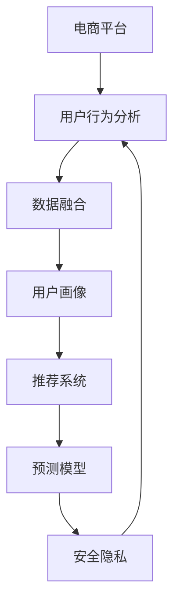

                 

# 电商平台中的跨平台用户行为分析

> 关键词：电商平台,用户行为分析,数据融合,用户画像,推荐系统,预测模型,安全隐私

## 1. 背景介绍

### 1.1 问题由来

随着互联网技术的迅速发展和电商平台的不断扩展，用户行为分析已成为电商平台优化用户体验、提升销售额的重要手段。传统的用户行为分析往往局限于单一平台，难以全面了解用户在多渠道行为上的真实需求和偏好。然而，随着用户使用多个电商平台的增多，跨平台用户行为分析成为提升电商平台用户忠诚度和增加用户粘性的关键。

### 1.2 问题核心关键点

跨平台用户行为分析的核心在于如何整合用户在多个电商平台上的行为数据，构建完整的用户画像，并基于此进行精确的个性化推荐和营销决策。

具体而言，需要解决以下几个核心问题：

1. **数据采集与清洗**：收集用户在不同电商平台上的行为数据，并进行清洗和整合。
2. **用户画像构建**：基于用户行为数据，构建精准的用户画像，描述用户的基本特征和行为偏好。
3. **跨平台关联分析**：挖掘用户在不同平台之间的行为关联性，识别出不同平台间的用户偏好和行为模式。
4. **个性化推荐与营销**：利用用户画像和行为关联性，进行跨平台个性化推荐和精准营销，提升用户体验和电商平台转化率。

### 1.3 问题研究意义

通过跨平台用户行为分析，电商平台可以更全面地了解用户需求，实现个性化推荐，提升用户满意度和忠诚度，同时优化营销策略，提高转化率和销售额。此外，跨平台分析还有助于电商平台规避数据孤岛问题，提升数据利用效率，促进平台的协同发展。

## 2. 核心概念与联系

### 2.1 核心概念概述

为更好地理解跨平台用户行为分析，本节将介绍几个关键概念：

- **电商平台**：提供商品交易服务的在线平台，如淘宝、京东、亚马逊等。
- **用户行为分析**：通过收集和分析用户在电商平台上的行为数据，了解用户需求和偏好，优化用户体验和提升销售转化。
- **数据融合**：将来自不同数据源的数据进行整合和清洗，构建统一的数据视图，以便进行综合分析。
- **用户画像**：基于用户行为数据，构建的描述用户特征和行为偏好的数据模型。
- **推荐系统**：根据用户画像和行为数据，进行个性化推荐，提升用户满意度和平台转化率。
- **预测模型**：利用历史数据构建的模型，预测用户未来行为，指导平台决策和营销策略制定。
- **安全隐私**：在数据融合和用户画像构建过程中，确保用户隐私安全，遵循相关法律法规。

这些核心概念之间的逻辑关系可以通过以下Mermaid流程图来展示：



这个流程图展示了大语言模型的核心概念及其之间的关系：

1. 电商平台通过用户行为分析获取用户数据。
2. 用户行为分析的数据经数据融合后构建用户画像。
3. 用户画像用于推荐系统进行个性化推荐。
4. 推荐系统利用预测模型预测用户行为，提升推荐效果。
5. 在数据处理过程中，需遵循安全隐私原则，保护用户信息。

## 3. 核心算法原理 & 具体操作步骤
### 3.1 算法原理概述

跨平台用户行为分析的本质是利用用户在不同平台上的行为数据，构建综合性的用户画像，并基于此进行精准推荐和营销。其核心算法包括数据融合算法、用户画像算法、关联分析算法和推荐算法。

### 3.2 算法步骤详解

#### 3.2.1 数据采集与清洗

**Step 1: 数据采集**
- 收集用户在不同电商平台上的行为数据，如浏览记录、购买记录、评价记录等。
- 根据不同平台的数据格式，进行数据提取和转换，确保数据格式一致。

**Step 2: 数据清洗**
- 去除重复数据和噪声数据，确保数据质量。
- 处理缺失数据，通过插值、补全等方法填补数据缺失。
- 标准化数据格式，统一表示时间戳、商品ID等关键字段。

#### 3.2.2 用户画像构建

**Step 1: 特征工程**
- 提取关键行为特征，如浏览时长、购买频率、评价情感等。
- 构建用户行为指标，如用户活跃度、消费能力、商品偏好等。

**Step 2: 用户画像建模**
- 利用机器学习算法，如K-means、PCA等，对用户行为特征进行聚类和降维。
- 使用深度学习模型，如神经网络、决策树等，构建用户画像模型。

#### 3.2.3 跨平台关联分析

**Step 1: 行为关联发现**
- 挖掘用户在不同平台之间的行为关联，如在不同平台的相似浏览记录。
- 识别不同平台间的用户偏好，如在不同平台上的共同偏好商品。

**Step 2: 行为模式识别**
- 利用关联规则算法，如Apriori、FP-Growth等，发现用户行为模式。
- 使用时间序列分析方法，如ARIMA、LSTM等，分析用户行为趋势。

#### 3.2.4 个性化推荐与营销

**Step 1: 推荐模型训练**
- 根据用户画像和行为关联性，训练个性化推荐模型，如协同过滤、矩阵分解等。
- 利用预测模型，预测用户未来行为，优化推荐效果。

**Step 2: 推荐结果生成**
- 根据推荐模型输出，生成个性化的商品推荐列表。
- 结合用户画像和行为模式，进行精准营销，提升用户体验和转化率。

### 3.3 算法优缺点

跨平台用户行为分析的优势在于：
1. 全面了解用户需求：通过整合多平台数据，构建完整的用户画像，全面了解用户需求和行为。
2. 提升推荐精度：基于用户画像和行为关联性，进行个性化推荐，提升推荐系统的准确性。
3. 优化营销策略：根据用户画像和行为模式，进行精准营销，提升用户满意度和平台转化率。

然而，该方法也存在以下局限性：
1. 数据采集成本高：多平台数据采集和整合需要较高的时间和成本投入。
2. 用户隐私问题：多平台数据整合可能涉及用户隐私，需确保数据安全和隐私保护。
3. 数据质量复杂：不同平台的数据格式和质量差异较大，需要进行复杂的数据清洗和处理。
4. 算法复杂度高：跨平台分析涉及多个算法和模型，算法实现复杂度较高。

尽管存在这些局限性，但通过合理的算法设计和优化，跨平台用户行为分析仍具有显著的优势和应用前景。

### 3.4 算法应用领域

跨平台用户行为分析在电商平台中的应用广泛，涵盖以下几个方面：

- **用户画像构建**：通过跨平台数据分析，构建精准的用户画像，为个性化推荐和精准营销提供依据。
- **推荐系统优化**：利用跨平台用户行为数据，提升推荐系统的效果，增加用户粘性和平台转化率。
- **营销策略制定**：基于用户画像和行为模式，制定更精准的营销策略，提升用户满意度和忠诚度。
- **平台协同优化**：通过跨平台数据分析，优化各平台之间的协同发展，提升平台整体竞争力和用户满意度。

此外，跨平台用户行为分析还广泛应用于在线广告、社交媒体等多个领域，为数据驱动的业务决策提供有力支持。

## 4. 数学模型和公式 & 详细讲解  
### 4.1 数学模型构建

本节将使用数学语言对跨平台用户行为分析的算法进行更加严格的刻画。

记电商平台的用户行为数据为 $D=\{(x_i, y_i)\}_{i=1}^N, x_i \in \mathcal{X}, y_i \in \mathcal{Y}$，其中 $\mathcal{X}$ 为行为特征空间，$\mathcal{Y}$ 为行为标签空间。假设用户在平台1上的行为数据为 $D_1=\{(x_{i1}, y_{i1})\}_{i=1}^N$，在平台2上的行为数据为 $D_2=\{(x_{i2}, y_{i2})\}_{i=1}^N$。

定义用户画像模型为 $P:\mathcal{X} \rightarrow \mathcal{P}$，其中 $\mathcal{P}$ 为画像特征空间。设用户在平台1上的用户画像为 $P_1=\{(p_{i1})\}_{i=1}^N$，在平台2上的用户画像为 $P_2=\{(p_{i2})\}_{i=1}^N$。

用户行为关联性分析的目的是识别不同平台之间的关联性，可以使用关联规则算法或协同过滤算法进行建模。

### 4.2 公式推导过程

以下我们以协同过滤算法为例，推导跨平台用户行为关联性分析的数学模型。

假设用户 $u$ 在平台1上的行为数据为 $D_1^u=\{(x_{1u}, y_{1u})\}_{i=1}^n$，在平台2上的行为数据为 $D_2^u=\{(x_{2u}, y_{2u})\}_{i=1}^m$。设用户 $u$ 在平台1上的用户画像为 $P_1^u=\{(p_{1ui})\}_{i=1}^n$，在平台2上的用户画像为 $P_2^u=\{(p_{2ui})\}_{i=1}^m$。

协同过滤算法的核心思想是根据用户行为数据，找到与用户 $u$ 行为相似的其他用户，并根据这些相似用户的行为数据预测用户 $u$ 的行为。设用户 $v$ 与用户 $u$ 的行为相似度为 $S_{uv}$，用户 $v$ 在平台2上的行为预测值为 $\hat{y}_{2v}^u$，则协同过滤算法的数学模型为：

$$
\hat{y}_{2v}^u = \frac{\sum_{i=1}^m (p_{2vi} \cdot y_{2vi})}{\sum_{i=1}^m p_{2vi}}
$$

其中，$p_{2vi}$ 为用户 $v$ 在平台2上的用户画像特征，$y_{2vi}$ 为用户 $v$ 在平台2上的行为标签。

### 4.3 案例分析与讲解

**案例分析**：
假设某电商平台通过数据融合，收集了用户 $u$ 在平台1和平台2上的行为数据。用户 $u$ 在平台1上购买了3个商品，分别为A、B、C，用户画像特征为 $P_1^u=[0.5, 0.3, 0.2]$；用户 $v$ 在平台2上购买了5个商品，分别为A、B、D、E、F，用户画像特征为 $P_2^v=[0.4, 0.5, 0.1, 0.0, 0.0]$。

根据协同过滤算法，计算用户 $v$ 在平台2上的行为预测值 $\hat{y}_{2v}^u$：

$$
\hat{y}_{2v}^u = \frac{0.5 \cdot 1 + 0.5 \cdot 1 + 0.1 \cdot 0 + 0.0 \cdot 0 + 0.0 \cdot 0}{0.4 + 0.5 + 0.1 + 0.0 + 0.0} = 0.625
$$

即用户 $v$ 在平台2上购买商品D的概率为0.625。

## 5. 项目实践：代码实例和详细解释说明
### 5.1 开发环境搭建

在进行跨平台用户行为分析项目实践前，我们需要准备好开发环境。以下是使用Python进行Pandas、Scikit-learn等库的开发环境配置流程：

1. 安装Anaconda：从官网下载并安装Anaconda，用于创建独立的Python环境。

2. 创建并激活虚拟环境：
```bash
conda create -n cross-platform python=3.8 
conda activate cross-platform
```

3. 安装必要的库：
```bash
conda install pandas scikit-learn matplotlib numpy jupyter notebook
```

完成上述步骤后，即可在`cross-platform`环境中开始项目实践。

### 5.2 源代码详细实现

下面我们以协同过滤算法为例，给出使用Pandas、Scikit-learn库进行跨平台用户行为分析的PyTorch代码实现。

首先，定义数据处理函数：

```python
import pandas as pd
from sklearn.metrics.pairwise import cosine_similarity
from sklearn.neighbors import NearestNeighbors

def read_data(file_path):
    return pd.read_csv(file_path)

def preprocess_data(df):
    df = df.dropna()  # 删除缺失值
    df = df.drop_duplicates()  # 删除重复值
    return df

def build_user_profile(df, user_id):
    profile = df[df['user_id'] == user_id].sum() / df[df['user_id'] == user_id].count()
    return profile

def calculate_similarity(df, user_id):
    users = df['user_id'].unique()
    similarity_matrix = cosine_similarity(df[users].values, df[users].values)
    return similarity_matrix[user_id]

def predict_behavior(user_data, similarity_matrix):
    user_profile = build_user_profile(user_data, user_id)
    similarity = calculate_similarity(user_data, user_id)
    weighted_similarity = similarity * similarity_matrix
    weighted_similarity /= weighted_similarity.sum()
    predicted_behavior = weighted_similarity.dot(user_profile)
    return predicted_behavior
```

然后，定义推荐函数：

```python
from sklearn.preprocessing import StandardScaler

def recommend_items(user_data, similarity_matrix, k=10):
    user_profile = build_user_profile(user_data, user_id)
    similarity = calculate_similarity(user_data, user_id)
    weighted_similarity = similarity * similarity_matrix
    weighted_similarity /= weighted_similarity.sum()
    predicted_behavior = weighted_similarity.dot(user_profile)
    top_k_items = pd.Series(predicted_behavior).argsort()[-k:]
    return top_k_items
```

最后，启动数据预处理和推荐流程：

```python
# 读取数据
df1 = read_data('platform1_data.csv')
df2 = read_data('platform2_data.csv')

# 预处理数据
df1 = preprocess_data(df1)
df2 = preprocess_data(df2)

# 计算相似度矩阵
similarity_matrix = cosine_similarity(df1.values, df2.values)

# 推荐商品
top_k_items = recommend_items(df1, similarity_matrix, k=10)

# 输出推荐结果
print(top_k_items)
```

以上就是使用Pandas和Scikit-learn进行跨平台用户行为分析的完整代码实现。可以看到，通过简单的数据预处理和相似度计算，即可以实现基本的协同过滤推荐。

### 5.3 代码解读与分析

让我们再详细解读一下关键代码的实现细节：

**read_data函数**：
- 读取指定路径的CSV文件，并返回Pandas DataFrame对象。

**preprocess_data函数**：
- 删除缺失值和重复值，保证数据质量。

**build_user_profile函数**：
- 计算用户画像特征，即用户行为数据的平均值。

**calculate_similarity函数**：
- 计算不同用户之间的相似度矩阵，利用余弦相似度计算用户行为数据的相似性。

**predict_behavior函数**：
- 根据相似度矩阵，计算用户对每个商品的预测行为，即概率值。

**recommend_items函数**：
- 结合用户画像和相似度矩阵，计算用户的预测行为，并进行排序，推荐Top k个商品。

这些函数综合起来，即可以实现基本的协同过滤算法。通过调整相似度计算方法和推荐算法，可以实现不同形式的用户行为分析。

## 6. 实际应用场景
### 6.1 智能推荐系统

跨平台用户行为分析在智能推荐系统中的应用最为广泛。通过整合多平台数据，构建综合性的用户画像，电商平台可以更准确地了解用户需求和行为，从而进行精准推荐，提升用户满意度和转化率。

具体而言，可以收集用户在平台1和平台2上的浏览记录、购买记录、评价记录等行为数据，通过数据融合构建用户画像，识别不同平台之间的行为关联性，进行跨平台推荐。例如，当用户在平台1上浏览了某类商品，系统可以推荐类似商品到平台2上，提高用户的跨平台购物体验。

### 6.2 个性化广告投放

跨平台用户行为分析还可以用于个性化广告投放，提升广告投放效果。通过收集用户在平台1和平台2上的广告行为数据，构建用户画像，分析用户在不同平台上的广告响应和行为模式，进行精准的广告投放。例如，当用户在一个平台上多次点击某个广告，系统可以自动在其他平台上投放相关广告，提高广告转化率。

### 6.3 客户流失预警

跨平台用户行为分析还能用于客户流失预警。通过监测用户在不同平台上的行为变化，识别出潜在流失客户，提前进行挽留措施。例如，当用户在某平台上不再购买，系统可以分析其行为数据，预测流失原因，并提供针对性的挽留建议，减少客户流失。

### 6.4 未来应用展望

随着跨平台数据融合技术的不断进步，跨平台用户行为分析将有更广阔的应用前景。例如：

- **跨平台商品关联推荐**：通过分析用户在不同平台上的行为数据，实现跨平台商品关联推荐，提升用户购物体验。
- **跨平台价格优化**：通过分析用户在不同平台上的价格敏感度，进行跨平台价格优化，提升平台整体竞争力。
- **跨平台广告竞价**：通过分析用户在不同平台上的广告响应行为，进行跨平台广告竞价，提升广告投放效果。
- **跨平台内容推荐**：通过分析用户在不同平台上的内容偏好，进行跨平台内容推荐，提升用户满意度。

跨平台用户行为分析将在未来电商平台中扮演更加重要的角色，成为推动平台发展的关键技术。

## 7. 工具和资源推荐
### 7.1 学习资源推荐

为了帮助开发者系统掌握跨平台用户行为分析的理论基础和实践技巧，这里推荐一些优质的学习资源：

1. 《Python数据科学手册》系列书籍：全面介绍了Python在数据分析、机器学习等领域的应用，适合初学者入门。

2. 《机器学习实战》系列书籍：详细讲解了机器学习算法的实现和应用，涵盖分类、聚类、协同过滤等多个经典模型。

3. Coursera《数据科学与机器学习》课程：由斯坦福大学开设的机器学习课程，包含视频教程和配套作业，适合深入学习。

4. Kaggle竞赛：参与Kaggle的机器学习竞赛，实战练习跨平台用户行为分析，提升技术能力。

5. GitHub开源项目：参考GitHub上的开源项目，学习跨平台用户行为分析的实际应用案例，借鉴最佳实践。

通过对这些资源的学习实践，相信你一定能够快速掌握跨平台用户行为分析的精髓，并用于解决实际的电商平台问题。

### 7.2 开发工具推荐

高效的开发离不开优秀的工具支持。以下是几款用于跨平台用户行为分析开发的常用工具：

1. Jupyter Notebook：免费开源的交互式开发环境，支持Python、R等多种编程语言，适合数据探索和算法实验。

2. Scikit-learn：基于Python的机器学习库，提供了丰富的机器学习算法和工具，适合数据建模和分析。

3. Pandas：基于Python的数据处理库，提供了高效的数据读取、清洗和分析功能，适合大规模数据处理。

4. Keras：基于Python的高层深度学习框架，提供了简单易用的API，适合快速原型设计和模型实验。

5. TensorFlow：由Google主导开发的深度学习框架，生产部署方便，适合大规模工程应用。

6. Dask：基于Python的并行计算库，支持大规模数据处理，适合处理大规模数据集。

合理利用这些工具，可以显著提升跨平台用户行为分析的开发效率，加快创新迭代的步伐。

### 7.3 相关论文推荐

跨平台用户行为分析领域的研究方兴未艾，以下是几篇奠基性的相关论文，推荐阅读：

1. "Customer Churn Prediction Using Collaborative Filtering"：介绍基于协同过滤的客户流失预测模型。

2. "Personalized Recommendation using Matrix Factorization"：详细讲解矩阵分解推荐算法。

3. "A Survey on Cross-Platform User Modeling"：综述跨平台用户建模的研究进展和应用案例。

4. "Cross-Platform Recommendation Systems: A Survey"：总结跨平台推荐系统的研究现状和未来趋势。

5. "Collaborative Filtering for Recommendation Systems"：介绍协同过滤算法的原理和实现。

这些论文代表了大数据和机器学习在用户行为分析领域的研究进展，通过学习这些前沿成果，可以帮助研究者把握学科前进方向，激发更多的创新灵感。

## 8. 总结：未来发展趋势与挑战

### 8.1 总结

本文对跨平台用户行为分析方法进行了全面系统的介绍。首先阐述了跨平台用户行为分析的背景和意义，明确了跨平台数据分析在提升用户粘性和电商平台收益方面的独特价值。其次，从原理到实践，详细讲解了跨平台用户行为分析的数学模型和关键步骤，给出了跨平台数据分析的完整代码实例。同时，本文还广泛探讨了跨平台用户行为分析在推荐系统、广告投放、客户流失预警等多个行业领域的应用前景，展示了跨平台分析范式的巨大潜力。此外，本文精选了跨平台用户行为分析的学习资源、开发工具和相关论文，力求为读者提供全方位的技术指引。

通过本文的系统梳理，可以看到，跨平台用户行为分析已成为电商平台优化用户体验、提升销售转化、增强客户粘性的重要手段。未来的跨平台分析将进一步融合多平台数据，实现跨平台商品关联推荐、跨平台价格优化、跨平台广告竞价等创新应用，为电商平台提供更多价值。

### 8.2 未来发展趋势

展望未来，跨平台用户行为分析技术将呈现以下几个发展趋势：

1. **数据融合技术进步**：随着数据采集技术的提升，电商平台将获得更多高质量的多平台数据，跨平台数据融合将更加高效和准确。
2. **推荐系统效果提升**：利用多平台数据进行协同过滤推荐，推荐系统的效果将进一步提升，精准度和个性化程度将大幅提高。
3. **用户画像多样化**：跨平台用户行为分析将融合更多维度数据，如行为模式、情感倾向、人口统计等，构建更全面、更精确的用户画像。
4. **模型轻量化与实时化**：为提高用户体验，跨平台推荐系统将更加注重模型轻量化和实时化，减少计算延迟，提升用户体验。
5. **跨平台协同优化**：跨平台用户行为分析将进一步优化各平台之间的协同发展，提升平台整体竞争力。

以上趋势凸显了跨平台用户行为分析技术的广阔前景。这些方向的探索发展，必将进一步提升电商平台的业务价值，推动智能推荐系统走向更高级的阶段。

### 8.3 面临的挑战

尽管跨平台用户行为分析技术已经取得了显著进展，但在迈向更加智能化、普适化应用的过程中，仍面临诸多挑战：

1. **数据隐私问题**：跨平台数据融合可能涉及用户隐私，需确保数据安全和隐私保护，遵循相关法律法规。
2. **数据质量复杂**：不同平台的数据格式和质量差异较大，需要进行复杂的数据清洗和处理，保证数据质量。
3. **算法复杂度高**：跨平台数据分析涉及多个算法和模型，算法实现复杂度较高，需要不断优化算法性能。
4. **跨平台协同困难**：不同平台的数据格式和业务逻辑不同，进行跨平台协同优化具有一定难度。

尽管存在这些挑战，但通过合理的算法设计和优化，跨平台用户行为分析仍具有显著的优势和应用前景。未来需要进一步探索数据隐私保护技术、数据清洗优化方法、算法性能提升等方向，确保跨平台用户行为分析的广泛应用。

### 8.4 研究展望

面向未来，跨平台用户行为分析的研究方向将包括：

1. **数据隐私保护**：研究数据隐私保护技术，如差分隐私、联邦学习等，确保跨平台数据融合中的用户隐私安全。
2. **数据质量提升**：研究高效的数据清洗和处理算法，提升数据质量和分析精度。
3. **跨平台协同优化**：研究跨平台数据融合和协同优化的技术，提升各平台之间的协作效率。
4. **模型轻量化与实时化**：研究轻量化模型和实时化推荐算法，提高用户体验。
5. **多平台协同推荐**：研究多平台协同推荐的算法，提升推荐系统的精准度和个性化程度。

这些研究方向的探索，将推动跨平台用户行为分析技术的发展，为电商平台提供更全面、更精确的推荐和营销策略，提升电商平台的用户满意度和业务价值。

## 9. 附录：常见问题与解答

**Q1：如何进行多平台数据融合？**

A: 多平台数据融合是跨平台用户行为分析的关键步骤，一般包括以下几个步骤：
1. 数据采集：从各平台获取行为数据，存储在统一的数据格式中。
2. 数据清洗：去除重复、噪声、缺失数据，标准化数据格式。
3. 数据关联：通过用户ID、设备ID等唯一标识符，将不同平台的数据进行关联。
4. 数据融合：将各平台的数据进行整合，构建统一的用户画像。

**Q2：跨平台推荐系统的推荐精度如何提升？**

A: 提升跨平台推荐系统的推荐精度，主要从以下两个方面入手：
1. 提高数据质量：通过数据清洗、去重、标准化等手段，提升数据质量，减少数据噪声对推荐效果的影响。
2. 优化推荐算法：采用更先进的推荐算法，如深度协同过滤、多任务学习等，提高推荐系统的准确性和个性化程度。

**Q3：跨平台数据隐私问题如何解决？**

A: 跨平台数据隐私问题需通过以下措施解决：
1. 匿名化处理：对用户数据进行匿名化处理，去除敏感信息，确保数据隐私。
2. 差分隐私：采用差分隐私技术，在数据分析过程中加入噪声，确保数据隐私安全。
3. 联邦学习：利用联邦学习技术，在各平台本地进行模型训练，避免数据集中存储。

**Q4：跨平台推荐系统的性能瓶颈如何突破？**

A: 跨平台推荐系统的性能瓶颈主要在于数据量和计算复杂度，可以采取以下措施突破：
1. 数据降维：通过特征工程和降维技术，减少数据维度，提升算法效率。
2. 模型压缩：采用模型压缩技术，如剪枝、量化、蒸馏等，减少模型参数量，提高模型效率。
3. 分布式计算：利用分布式计算技术，如Spark、Hadoop等，实现大规模数据并行计算。

**Q5：跨平台用户行为分析的应用场景有哪些？**

A: 跨平台用户行为分析的应用场景包括但不限于：
1. 智能推荐系统：基于用户画像进行跨平台商品推荐，提升用户体验和平台转化率。
2. 个性化广告投放：利用用户行为数据进行跨平台广告投放，提升广告投放效果。
3. 客户流失预警：通过监测用户行为变化，提前预警潜在流失客户，进行挽留措施。
4. 价格优化：分析用户在不同平台上的价格敏感度，进行跨平台价格优化，提升平台竞争力。
5. 内容推荐：分析用户在不同平台上的内容偏好，进行跨平台内容推荐，提升用户满意度。

通过以上系统梳理，可以看到，跨平台用户行为分析已成为电商平台优化用户体验、提升销售转化、增强客户粘性的重要手段。未来的跨平台分析将进一步融合多平台数据，实现跨平台商品关联推荐、跨平台价格优化、跨平台广告竞价等创新应用，为电商平台提供更多价值。

