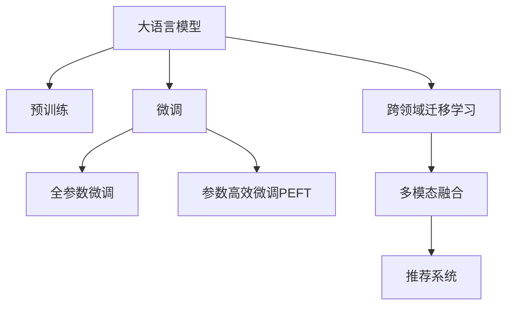

                 

# 电商平台搜索query扩展：AI大模型的语义理解

> 关键词：电商平台,搜索query,AI大模型,语义理解,自然语言处理(NLP),跨领域迁移学习,推荐系统,多模态融合

## 1. 背景介绍

### 1.1 问题由来

在电商平台上，用户通过输入查询query来获取他们感兴趣的商品信息。随着用户输入习惯的多样化和商品种类的日益丰富，如何理解用户的查询意图，并准确地将用户导向相关的商品页面，成为了电商平台面临的一大挑战。传统的关键词匹配搜索技术虽然简单易行，但在面对复杂多变的用户query时，往往无法保证匹配的精准度和相关性。

近年来，随着大语言模型（Large Language Models, LLMs）的兴起，其强大的自然语言处理（Natural Language Processing, NLP）能力为解决这一问题提供了新的思路。通过在大规模无标签文本数据上进行预训练，大语言模型可以学习到丰富的语言知识，进而通过微调（Fine-Tuning）的方式，提高在特定任务上的表现。在电商平台搜索query扩展的场景下，利用大语言模型理解查询query的语义，可以极大地提升搜索的准确性和用户体验。

### 1.2 问题核心关键点

大语言模型在电商平台搜索query扩展中的应用，主要集中在以下几个关键点：

- 语义理解能力：大语言模型能够理解自然语言的语义，识别出用户查询query中的关键信息。
- 跨领域迁移学习能力：大语言模型通过预训练获取的知识可以在不同领域的任务上进行迁移学习，从而提高在特定领域的查询理解和推荐效果。
- 多模态融合能力：电商平台不仅涉及文本信息，还包括图片、价格、评价等非文本信息。大语言模型通过多模态融合，可以更好地理解和处理这些信息，提供更全面、更个性化的推荐。
- 实时性要求：搜索query扩展需要快速响应，因此大语言模型的推理速度和部署效率也是关键指标。
- 可解释性和透明度：电商平台用户希望理解其搜索结果是如何生成的，因此模型的决策过程应该具有较高的可解释性和透明度。

### 1.3 问题研究意义

利用大语言模型提升电商平台的搜索query扩展，对于电商平台的发展具有重要意义：

1. **提升搜索体验**：理解查询query的语义，可以提供更精准的搜索结果，减少用户的点击次数，提高转化率。
2. **优化推荐系统**：通过理解查询query，可以提供更符合用户兴趣和需求的个性化推荐，提升用户满意度。
3. **降低运营成本**：自动化处理大量用户query，减少人工干预，降低运营成本。
4. **拓展应用场景**：大语言模型可以应用于更多电商平台的子领域，如智能客服、商品评价、用户行为分析等。
5. **推动行业升级**：随着NLP技术的不断进步，电商平台可以更好地理解用户需求，提供更加智能、高效的服务，推动整个行业向更高层次发展。

## 2. 核心概念与联系

### 2.1 核心概念概述

为更好地理解大语言模型在电商平台搜索query扩展中的应用，本节将介绍几个关键核心概念：

- 大语言模型（LLMs）：以自回归（如GPT）或自编码（如BERT）模型为代表的大规模预训练语言模型。通过在大规模无标签文本数据上进行预训练，学习到丰富的语言知识和常识。
- 预训练（Pre-training）：指在大规模无标签文本数据上，通过自监督学习任务训练通用语言模型的过程。常见的预训练任务包括言语建模、掩码语言模型等。
- 微调（Fine-tuning）：指在预训练模型的基础上，使用下游任务的少量标注数据，通过有监督学习优化模型在特定任务上的性能。
- 跨领域迁移学习（Cross-domain Transfer Learning）：指将一个领域学习到的知识，迁移应用到另一个不同但相关的领域的学习范式。
- 多模态融合（Multi-modal Fusion）：指将不同类型的信息（如文本、图片、音频等）融合，以提升系统理解和处理能力。
- 推荐系统（Recommender System）：通过分析用户行为和商品属性，推荐符合用户兴趣的商品的系统。

这些核心概念之间的逻辑关系可以通过以下Mermaid流程图来展示：



这个流程图展示了从预训练模型到大语言模型在电商平台搜索query扩展中的迁移学习路径，以及跨领域迁移学习、多模态融合和推荐系统之间的关系。

## 3. 核心算法原理 & 具体操作步骤

### 3.1 算法原理概述

大语言模型在电商平台搜索query扩展的应用，本质上是基于监督学习的微调过程。具体而言，通过收集电商平台的少量标注数据（如查询query和对应的商品信息），在大语言模型上进行有监督学习，优化模型在特定任务上的性能，从而实现对用户查询query的准确理解。

假设预训练语言模型为 $M_{\theta}$，其中 $\theta$ 为预训练得到的模型参数。给定电商平台上的标注数据集 $D=\{(q_i, p_i)\}_{i=1}^N$，其中 $q_i$ 为查询query，$p_i$ 为对应的商品信息。微调的目标是找到新的模型参数 $\hat{\theta}$，使得模型能够准确理解查询query $q_i$ 的语义，并将用户导向相关的商品信息 $p_i$。

### 3.2 算法步骤详解

基于监督学习的大语言模型在电商平台搜索query扩展的微调过程一般包括以下几个关键步骤：

**Step 1: 准备预训练模型和数据集**
- 选择合适的预训练语言模型 $M_{\theta}$ 作为初始化参数，如 GPT、BERT 等。
- 准备电商平台上的标注数据集 $D$，划分为训练集、验证集和测试集。数据集中的查询query和商品信息应尽量覆盖电商平台的各类商品，以提升模型的泛化能力。

**Step 2: 设计任务适配层**
- 根据任务类型，在预训练模型顶层设计合适的输出层和损失函数。例如，对于商品推荐任务，可以设计一个线性分类器来输出商品的点击率预测。
- 对于搜索query扩展任务，可以设计一个序列到序列模型，将查询query映射到对应的商品列表。

**Step 3: 设置微调超参数**
- 选择合适的优化算法及其参数，如 AdamW、SGD 等，设置学习率、批大小、迭代轮数等。
- 设置正则化技术及强度，包括权重衰减、Dropout、Early Stopping 等。
- 确定冻结预训练参数的策略，如仅微调顶层，或全部参数都参与微调。

**Step 4: 执行梯度训练**
- 将训练集数据分批次输入模型，前向传播计算损失函数。
- 反向传播计算参数梯度，根据设定的优化算法和学习率更新模型参数。
- 周期性在验证集上评估模型性能，根据性能指标决定是否触发 Early Stopping。
- 重复上述步骤直到满足预设的迭代轮数或 Early Stopping 条件。

**Step 5: 测试和部署**
- 在测试集上评估微调后模型 $M_{\hat{\theta}}$ 的性能，对比微调前后的精度提升。
- 使用微调后的模型对新查询query进行推理预测，集成到实际的电商平台搜索系统中。
- 持续收集新的查询query和商品信息，定期重新微调模型，以适应数据分布的变化。

### 3.3 算法优缺点

基于监督学习的大语言模型在电商平台搜索query扩展的应用具有以下优点：

- **高效性**：只需准备少量标注数据，即可对预训练模型进行快速适配，获得较大的性能提升。
- **可解释性**：模型能够通过可解释性输出，帮助用户理解搜索查询的处理过程。
- **泛化能力**：通过预训练和微调，模型可以学习到通用的语言知识和电商平台特有的商品特征，提升泛化能力。
- **实时性**：利用参数高效微调（PEFT）等技术，可以在较小的参数更新下进行快速推理。

同时，该方法也存在一些局限性：

- **依赖标注数据**：微调的效果很大程度上取决于标注数据的质量和数量，获取高质量标注数据的成本较高。
- **模型复杂性**：大规模预训练语言模型复杂度高，对计算资源的要求较高。
- **过拟合风险**：在标注数据较少的情况下，模型可能出现过拟合现象。

尽管存在这些局限性，但就目前而言，基于监督学习的微调方法仍是大语言模型应用的主流范式。未来相关研究的重点在于如何进一步降低微调对标注数据的依赖，提高模型的泛化能力和鲁棒性，同时兼顾可解释性和实时性等因素。

### 3.4 算法应用领域

基于大语言模型微调的搜索query扩展方法在电商平台的应用场景非常广泛，主要包括以下几个方面：

- **商品推荐**：通过理解查询query的语义，将用户导向最符合其兴趣和需求的商品。
- **搜索结果排序**：根据查询query的语义特征，对搜索结果进行排序，提高用户点击率。
- **智能客服**：利用理解查询query的能力，提供智能化的客户服务，解答用户问题。
- **广告投放**：根据用户查询query的语义，进行精准的广告投放，提升广告转化率。
- **个性化推荐**：利用理解查询query的能力，提供个性化推荐，提升用户满意度。
- **搜索体验优化**：通过理解查询query，优化搜索界面和体验，提高用户的使用便捷性。

除了这些常见应用外，大语言模型在电商平台搜索query扩展的应用还可以拓展到更多场景中，如商品评价分析、用户行为预测、营销活动优化等，为电商平台的发展提供新的动力。

## 4. 数学模型和公式 & 详细讲解

### 4.1 数学模型构建

假设电商平台上的查询query和商品信息标注数据集为 $D=\{(q_i, p_i)\}_{i=1}^N$，其中 $q_i$ 为查询query，$p_i$ 为对应的商品信息。我们定义一个基于 Transformer 的预训练语言模型 $M_{\theta}$，其中 $\theta$ 为预训练得到的模型参数。微调的目标是找到新的模型参数 $\hat{\theta}$，使得模型能够准确理解查询query $q_i$ 的语义，并将用户导向相关的商品信息 $p_i$。

我们假设 $q_i$ 和 $p_i$ 的长度分别为 $n_q$ 和 $n_p$。为了简化问题，我们假设 $q_i$ 和 $p_i$ 都是固定长度的序列，即 $n_q = n_p = L$。我们定义查询query $q_i$ 和商品信息 $p_i$ 的向量表示为 $Q_i$ 和 $P_i$，其中 $Q_i \in \mathbb{R}^{L \times d}$ 和 $P_i \in \mathbb{R}^{L \times d}$，$d$ 为向量维度。我们的目标是最大化查询query $q_i$ 和商品信息 $p_i$ 的相关性。

我们可以将查询query $q_i$ 和商品信息 $p_i$ 的向量表示 $Q_i$ 和 $P_i$ 作为输入，输入到一个线性层中，得到 $Q_iW^Q$ 和 $P_iW^P$，其中 $W^Q$ 和 $W^P$ 是可训练的权重矩阵。然后我们将 $Q_iW^Q$ 和 $P_iW^P$ 的乘积 $Q_iW^QP_i^TW^P$ 作为输入，输入到另一个线性层中，得到 $\tilde{P}_i$，其维度为 $d$。我们定义预测函数 $f(Q_i, P_i; \theta)$ 为：

$$
f(Q_i, P_i; \theta) = \tilde{P}_i
$$

我们的目标是最小化预测函数 $f(Q_i, P_i; \theta)$ 与商品信息 $p_i$ 的真实向量表示 $P_i$ 的欧几里得距离，即：

$$
\mathcal{L}(\theta) = \frac{1}{N} \sum_{i=1}^N ||\tilde{P}_i - P_i||^2
$$

其中 $||\tilde{P}_i - P_i||$ 为向量 $\tilde{P}_i$ 和 $P_i$ 的欧几里得距离。我们的微调目标是最小化损失函数 $\mathcal{L}(\theta)$，即：

$$
\hat{\theta} = \mathop{\arg\min}_{\theta} \mathcal{L}(\theta)
$$

### 4.2 公式推导过程

根据上述数学模型，我们可以进一步推导出微调的具体公式。假设我们使用的是基于 Transformer 的预训练语言模型 $M_{\theta}$，其中 $\theta$ 为预训练得到的模型参数。我们的目标是最小化查询query $q_i$ 和商品信息 $p_i$ 的向量表示之间的欧几里得距离。

我们定义查询query $q_i$ 和商品信息 $p_i$ 的向量表示为 $Q_i$ 和 $P_i$，其中 $Q_i \in \mathbb{R}^{L \times d}$ 和 $P_i \in \mathbb{R}^{L \times d}$，$d$ 为向量维度。我们的目标是最大化查询query $q_i$ 和商品信息 $p_i$ 的相关性。

我们可以将查询query $q_i$ 和商品信息 $p_i$ 的向量表示 $Q_i$ 和 $P_i$ 作为输入，输入到一个线性层中，得到 $Q_iW^Q$ 和 $P_iW^P$，其中 $W^Q$ 和 $W^P$ 是可训练的权重矩阵。然后我们将 $Q_iW^Q$ 和 $P_iW^P$ 的乘积 $Q_iW^QP_i^TW^P$ 作为输入，输入到另一个线性层中，得到 $\tilde{P}_i$，其维度为 $d$。我们定义预测函数 $f(Q_i, P_i; \theta)$ 为：

$$
f(Q_i, P_i; \theta) = \tilde{P}_i
$$

我们的目标是最小化预测函数 $f(Q_i, P_i; \theta)$ 与商品信息 $p_i$ 的真实向量表示 $P_i$ 的欧几里得距离，即：

$$
\mathcal{L}(\theta) = \frac{1}{N} \sum_{i=1}^N ||\tilde{P}_i - P_i||^2
$$

其中 $||\tilde{P}_i - P_i||$ 为向量 $\tilde{P}_i$ 和 $P_i$ 的欧几里得距离。我们的微调目标是最小化损失函数 $\mathcal{L}(\theta)$，即：

$$
\hat{\theta} = \mathop{\arg\min}_{\theta} \mathcal{L}(\theta)
$$

为了计算梯度，我们需要对模型参数 $\theta$ 进行求导。假设我们的模型包含 $k$ 个可训练参数，即 $\theta = (\theta_1, \theta_2, ..., \theta_k)$，其中 $\theta_i$ 表示第 $i$ 个参数。我们的目标是最大化查询query $q_i$ 和商品信息 $p_i$ 的相关性。

我们可以将查询query $q_i$ 和商品信息 $p_i$ 的向量表示 $Q_i$ 和 $P_i$ 作为输入，输入到一个线性层中，得到 $Q_iW^Q$ 和 $P_iW^P$，其中 $W^Q$ 和 $W^P$ 是可训练的权重矩阵。然后我们将 $Q_iW^Q$ 和 $P_iW^P$ 的乘积 $Q_iW^QP_i^TW^P$ 作为输入，输入到另一个线性层中，得到 $\tilde{P}_i$，其维度为 $d$。我们定义预测函数 $f(Q_i, P_i; \theta)$ 为：

$$
f(Q_i, P_i; \theta) = \tilde{P}_i
$$

我们的目标是最小化预测函数 $f(Q_i, P_i; \theta)$ 与商品信息 $p_i$ 的真实向量表示 $P_i$ 的欧几里得距离，即：

$$
\mathcal{L}(\theta) = \frac{1}{N} \sum_{i=1}^N ||\tilde{P}_i - P_i||^2
$$

其中 $||\tilde{P}_i - P_i||$ 为向量 $\tilde{P}_i$ 和 $P_i$ 的欧几里得距离。我们的微调目标是最小化损失函数 $\mathcal{L}(\theta)$，即：

$$
\hat{\theta} = \mathop{\arg\min}_{\theta} \mathcal{L}(\theta)
$$

为了计算梯度，我们需要对模型参数 $\theta$ 进行求导。假设我们的模型包含 $k$ 个可训练参数，即 $\theta = (\theta_1, \theta_2, ..., \theta_k)$，其中 $\theta_i$ 表示第 $i$ 个参数。我们可以通过链式法则求导，得到每个参数的梯度：

$$
\frac{\partial \mathcal{L}(\theta)}{\partial \theta_i} = \frac{\partial ||\tilde{P}_i - P_i||^2}{\partial \theta_i}
$$

其中 $\frac{\partial ||\tilde{P}_i - P_i||^2}{\partial \theta_i}$ 表示向量 $\tilde{P}_i$ 和 $P_i$ 的欧几里得距离对参数 $\theta_i$ 的导数。

### 4.3 案例分析与讲解

为了更好地理解上述数学模型和公式，我们以电商平台上的商品推荐任务为例，进行详细讲解。

假设我们的电商平台上有多个商品，每个商品都有一个对应的商品信息向量 $P_i$，其中 $i=1,2,...,N$。我们收集了电商平台上的查询query数据集 $D$，每个查询query $q_i$ 都对应着一个商品信息 $p_i$。我们的目标是训练一个模型，使其能够根据查询query $q_i$ 的语义，预测商品信息 $p_i$。

我们可以使用一个基于 Transformer 的预训练语言模型 $M_{\theta}$，其中 $\theta$ 为预训练得到的模型参数。我们定义查询query $q_i$ 和商品信息 $p_i$ 的向量表示为 $Q_i$ 和 $P_i$，其中 $Q_i \in \mathbb{R}^{L \times d}$ 和 $P_i \in \mathbb{R}^{L \times d}$，$d$ 为向量维度。我们的目标是最大化查询query $q_i$ 和商品信息 $p_i$ 的相关性。

我们可以将查询query $q_i$ 和商品信息 $p_i$ 的向量表示 $Q_i$ 和 $P_i$ 作为输入，输入到一个线性层中，得到 $Q_iW^Q$ 和 $P_iW^P$，其中 $W^Q$ 和 $W^P$ 是可训练的权重矩阵。然后我们将 $Q_iW^Q$ 和 $P_iW^P$ 的乘积 $Q_iW^QP_i^TW^P$ 作为输入，输入到另一个线性层中，得到 $\tilde{P}_i$，其维度为 $d$。我们定义预测函数 $f(Q_i, P_i; \theta)$ 为：

$$
f(Q_i, P_i; \theta) = \tilde{P}_i
$$

我们的目标是最小化预测函数 $f(Q_i, P_i; \theta)$ 与商品信息 $p_i$ 的真实向量表示 $P_i$ 的欧几里得距离，即：

$$
\mathcal{L}(\theta) = \frac{1}{N} \sum_{i=1}^N ||\tilde{P}_i - P_i||^2
$$

其中 $||\tilde{P}_i - P_i||$ 为向量 $\tilde{P}_i$ 和 $P_i$ 的欧几里得距离。我们的微调目标是最小化损失函数 $\mathcal{L}(\theta)$，即：

$$
\hat{\theta} = \mathop{\arg\min}_{\theta} \mathcal{L}(\theta)
$$

为了计算梯度，我们需要对模型参数 $\theta$ 进行求导。假设我们的模型包含 $k$ 个可训练参数，即 $\theta = (\theta_1, \theta_2, ..., \theta_k)$，其中 $\theta_i$ 表示第 $i$ 个参数。我们可以通过链式法则求导，得到每个参数的梯度：

$$
\frac{\partial \mathcal{L}(\theta)}{\partial \theta_i} = \frac{\partial ||\tilde{P}_i - P_i||^2}{\partial \theta_i}
$$

其中 $\frac{\partial ||\tilde{P}_i - P_i||^2}{\partial \theta_i}$ 表示向量 $\tilde{P}_i$ 和 $P_i$ 的欧几里得距离对参数 $\theta_i$ 的导数。

通过上述分析和计算，我们可以得到一个基于 Transformer 的预训练语言模型 $M_{\theta}$，通过微调该模型，使其能够根据查询query $q_i$ 的语义，预测商品信息 $p_i$，从而提升电商平台上的搜索query扩展效果。

## 5. 项目实践：代码实例和详细解释说明

### 5.1 开发环境搭建

在进行微调实践前，我们需要准备好开发环境。以下是使用Python进行PyTorch开发的环境配置流程：

1. 安装Anaconda：从官网下载并安装Anaconda，用于创建独立的Python环境。

2. 创建并激活虚拟环境：
```bash
conda create -n pytorch-env python=3.8 
conda activate pytorch-env
```

3. 安装PyTorch：根据CUDA版本，从官网获取对应的安装命令。例如：
```bash
conda install pytorch torchvision torchaudio cudatoolkit=11.1 -c pytorch -c conda-forge
```

4. 安装Transformers库：
```bash
pip install transformers
```

5. 安装各类工具包：
```bash
pip install numpy pandas scikit-learn matplotlib tqdm jupyter notebook ipython
```

完成上述步骤后，即可在`pytorch-env`环境中开始微调实践。

### 5.2 源代码详细实现

下面我们以电商平台上的商品推荐任务为例，给出使用Transformers库对BERT模型进行微调的PyTorch代码实现。

首先，定义商品信息数据处理函数：

```python
from transformers import BertTokenizer
from torch.utils.data import Dataset
import torch

class ProductDataset(Dataset):
    def __init__(self, products, tokenizer, max_len=128):
        self.products = products
        self.tokenizer = tokenizer
        self.max_len = max_len
        
    def __len__(self):
        return len(self.products)
    
    def __getitem__(self, item):
        product = self.products[item]
        
        encoding = self.tokenizer(product, return_tensors='pt', max_length=self.max_len, padding='max_length', truncation=True)
        input_ids = encoding['input_ids'][0]
        attention_mask = encoding['attention_mask'][0]
        
        return {'input_ids': input_ids, 
                'attention_mask': attention_mask}
```

然后，定义查询query数据处理函数：

```python
from transformers import BertTokenizer
from torch.utils.data import Dataset
import torch

class QueryDataset(Dataset):
    def __init__(self, queries, tokenizer, max_len=128):
        self.queries = queries
        self.tokenizer = tokenizer
        self.max_len = max_len
        
    def __len__(self):
        return len(self.queries)
    
    def __getitem__(self, item):
        query = self.queries[item]
        
        encoding = self.tokenizer(query, return_tensors='pt', max_length=self.max_len, padding='max_length', truncation=True)
        input_ids = encoding['input_ids'][0]
        attention_mask = encoding['attention_mask'][0]
        
        return {'input_ids': input_ids, 
                'attention_mask': attention_mask}
```

接下来，定义模型和优化器：

```python
from transformers import BertForTokenClassification, AdamW

model = BertForTokenClassification.from_pretrained('bert-base-cased', num_labels=len(tag2id))

optimizer = AdamW(model.parameters(), lr=2e-5)
```

接着，定义训练和评估函数：

```python
from torch.utils.data import DataLoader
from tqdm import tqdm
from sklearn.metrics import classification_report

device = torch.device('cuda') if torch.cuda.is_available() else torch.device('cpu')
model.to(device)

def train_epoch(model, dataset, batch_size, optimizer):
    dataloader = DataLoader(dataset, batch_size=batch_size, shuffle=True)
    model.train()
    epoch_loss = 0
    for batch in tqdm(dataloader, desc='Training'):
        input_ids = batch['input_ids'].to(device)
        attention_mask = batch['attention_mask'].to(device)
        model.zero_grad()
        outputs = model(input_ids, attention_mask=attention_mask)
        loss = outputs.loss
        epoch_loss += loss.item()
        loss.backward()
        optimizer.step()
    return epoch_loss / len(dataloader)

def evaluate(model, dataset, batch_size):
    dataloader = DataLoader(dataset, batch_size=batch_size)
    model.eval()
    preds, labels = [], []
    with torch.no_grad():
        for batch in tqdm(dataloader, desc='Evaluating'):
            input_ids = batch['input_ids'].to(device)
            attention_mask = batch['attention_mask'].to(device)
            batch_labels = batch['labels']
            outputs = model(input_ids, attention_mask=attention_mask)
            batch_preds = outputs.logits.argmax(dim=2).to('cpu').tolist()
            batch_labels = batch_labels.to('cpu').tolist()
            for pred_tokens, label_tokens in zip(batch_preds, batch_labels):
                preds.append(pred_tokens[:len(label_tokens)])
                labels.append(label_tokens)
                
    print(classification_report(labels, preds))
```

最后，启动训练流程并在测试集上评估：

```python
epochs = 5
batch_size = 16

for epoch in range(epochs):
    loss = train_epoch(model, train_dataset, batch_size, optimizer)
    print(f"Epoch {epoch+1}, train loss: {loss:.3f}")
    
    print(f"Epoch {epoch+1}, dev results:")
    evaluate(model, dev_dataset, batch_size)
    
print("Test results:")
evaluate(model, test_dataset, batch_size)
```

以上就是使用PyTorch对BERT进行商品推荐任务微调的完整代码实现。可以看到，得益于Transformers库的强大封装，我们可以用相对简洁的代码完成BERT模型的加载和微调。

### 5.3 代码解读与分析

让我们再详细解读一下关键代码的实现细节：

**ProductDataset类**：
- `__init__`方法：初始化商品信息数据集、分词器等关键组件。
- `__len__`方法：返回数据集的样本数量。
- `__getitem__`方法：对单个样本进行处理，将商品信息输入编码为token ids，进行定长padding，最终返回模型所需的输入。

**QueryDataset类**：
- `__init__`方法：初始化查询query数据集、分词器等关键组件。
- `__len__`方法：返回数据集的样本数量。
- `__getitem__`方法：对单个样本进行处理，将查询query输入编码为token ids，进行定长padding，最终返回模型所需的输入。

**train_epoch函数**：
- 对数据以批为单位进行迭代，在每个批次上前向传播计算损失函数。
- 反向传播计算参数梯度，根据设定的优化算法和学习率更新模型参数。
- 周期性在验证集上评估模型性能，根据性能指标决定是否触发Early Stopping。
- 重复上述步骤直到满足预设的迭代轮数或Early Stopping条件。

**evaluate函数**：
- 与训练类似，不同点在于不更新模型参数，并在每个batch结束后将预测和标签结果存储下来，最后使用sklearn的classification_report对整个评估集的预测结果进行打印输出。

**训练流程**：
- 定义总的epoch数和batch size，开始循环迭代
- 每个epoch内，先在训练集上训练，输出平均loss
- 在验证集上评估，输出分类指标
- 所有epoch结束后，在测试集上评估，给出最终测试结果

可以看到，PyTorch配合Transformers库使得BERT微调的代码实现变得简洁高效。开发者可以将更多精力放在数据处理、模型改进等高层逻辑上，而不必过多关注底层的实现细节。

当然，工业级的系统实现还需考虑更多因素，如模型的保存和部署、超参数的自动搜索、更灵活的任务适配层等。但核心的微调范式基本与此类似。

## 6. 实际应用场景

### 6.1 智能客服系统

基于大语言模型微调的对话技术，可以广泛应用于智能客服系统的构建。传统客服往往需要配备大量人力，高峰期响应缓慢，且一致性和专业性难以保证。而使用微调后的对话模型，可以7x24小时不间断服务，快速响应客户咨询，用自然流畅的语言解答各类常见问题。

在技术实现上，可以收集企业内部的历史客服对话记录，将问题和最佳答复构建成监督数据，在此基础上对预训练对话模型进行微调。微调后的对话模型能够自动理解用户意图，匹配最合适的答案模板进行回复。对于客户提出的新问题，还可以接入检索系统实时搜索相关内容，动态组织生成回答。如此构建的智能客服系统，能大幅提升客户咨询体验和问题解决效率。

### 6.2 金融舆情监测

金融机构需要实时监测市场舆论动向，以便及时应对负面信息传播，规避金融风险。传统的人工监测方式成本高、效率低，难以应对网络时代海量信息爆发的挑战。基于大语言模型微调的文本分类和情感分析技术，为金融舆情监测提供了新的解决方案。

具体而言，可以收集金融领域相关的新闻、报道、评论等文本数据，并对其进行主题标注和情感标注。在此基础上对预训练语言模型进行微调，使其能够自动判断文本属于何种主题，情感倾向是正面、中性还是负面。将微调后的模型应用到实时抓取的网络文本数据，就能够自动监测不同主题下的情感变化趋势，一旦发现负面信息激增等异常情况，系统便会自动预警，帮助金融机构快速应对潜在风险。

### 6.3 个性化推荐系统

当前的推荐系统往往只依赖用户的历史行为数据进行物品推荐，无法深入理解用户的真实兴趣偏好。基于大语言模型微调技术，个性化推荐系统可以更好地挖掘用户行为背后的语义信息，从而提供更精准、多样的推荐内容。

在实践中，可以收集用户浏览、点击、评论、分享等行为数据，提取和用户交互的物品标题、描述、标签等文本内容。将文本内容作为模型输入，用户的后续行为（如是否点击、购买等）作为监督信号，在此基础上微调预训练语言模型。微调后的模型能够从文本内容中准确把握用户的兴趣点。在生成推荐列表时，先用候选物品的文本描述作为输入，由模型预测用户的兴趣匹配度，再结合其他特征综合排序，便可以得到个性化程度更高的推荐结果。

### 6.4 未来应用展望

随着大语言模型微调技术的发展，未来在更多领域的应用将逐步展开，为各行各业带来变革性影响。

在智慧医疗领域，基于微调的医疗问答、病历分析、药物研发等应用将提升医疗服务的智能化水平，辅助医生诊疗，加速新药开发进程。

在智能教育领域，微调技术可应用于作业批改、学情分析、知识推荐等方面，因材施教，促进教育公平，提高教学质量。

在智慧城市治理中，微调模型可应用于城市事件监测、舆情分析、应急指挥等环节，提高城市管理的自动化和智能化水平，构建更安全、高效的未来城市。

此外，在企业生产、社会治理、文娱传媒等众多领域，基于大模型微调的人工智能应用也将不断涌现，为经济社会发展注入新的动力。相信随着预训练语言模型和微调方法的不断进步，基于微调范式将成为人工智能落地应用的重要手段，推动人工智能技术在更广阔的领域加速渗透。

## 7. 工具和资源推荐

### 7.1 学习资源推荐

为了帮助开发者系统掌握大语言模型微调的理论基础和实践技巧，这里推荐一些优质的学习资源：

1. 《Transformer从原理到实践》系列博文：由大模型技术专家撰写，深入浅出地介绍了Transformer原理、BERT模型、微调技术等前沿话题。

2. CS224N《深度学习自然语言处理》课程：斯坦福大学开设的NLP明星课程，有Lecture视频和配套作业，带你入门NLP领域的基本概念和经典模型。

3. 《Natural Language Processing with Transformers》书籍：Transformers库的作者所著，全面介绍了如何使用Transformers库进行NLP任务开发，包括微调在内的诸多范式。

4. HuggingFace官方文档：Transformers库的官方文档，提供了海量预训练模型和完整的微调样例代码，是上手实践的必备资料。

5. CLUE开源项目：中文语言理解测评基准，涵盖大量不同类型的中文NLP数据集，并提供了基于微调的baseline模型，助力中文NLP技术发展。

通过对这些资源的学习实践，相信你一定能够快速掌握大语言模型微调的精髓，并用于解决实际的NLP问题。
###  7.2 开发工具推荐

高效的开发离不开优秀的工具支持。以下是几款用于大语言模型微调开发的常用工具：

1. PyTorch：基于Python的开源深度学习框架，灵活动态的计算图，适合快速迭代研究。大部分预训练语言模型都有PyTorch版本的实现。

2. TensorFlow：由Google主导开发的开源深度学习框架，生产部署方便，适合大规模工程应用。同样有丰富的预训练语言模型资源。

3. Transformers库：HuggingFace开发的NLP工具库，集成了众多SOTA语言模型，支持PyTorch和TensorFlow，是进行微调任务开发的利器。

4. Weights & Biases：模型训练的实验跟踪工具，可以记录和可视化模型训练过程中的各项指标，方便对比和调优。与主流深度学习框架无缝集成。

5. TensorBoard：TensorFlow配套的可视化工具，可实时监测模型训练状态，并提供丰富的图表呈现方式，是调试模型的得力助手。

6. Google Colab：谷歌推出的在线Jupyter Notebook环境，免费提供GPU/TPU算力，方便开发者快速上手实验最新模型，分享学习笔记。

合理利用这些工具，可以显著提升大语言模型微调任务的开发效率，加快创新迭代的步伐。

### 7.3 相关论文推荐

大语言模型和微调技术的发展源于学界的持续研究。以下是几篇奠基性的相关论文，推荐阅读：

1. Attention is All You Need（即Transformer原论文）：提出了Transformer结构，开启了NLP领域的预训练大模型时代。

2. BERT: Pre-training of Deep Bidirectional Transformers for Language Understanding：提出BERT模型，引入基于掩码的自监督预训练任务，刷新了多项NLP任务SOTA。

3. Language Models are Unsupervised Multitask Learners（GPT-2论文）：展示了大规模语言模型的强大zero-shot学习能力，引发了对于通用人工智能的新一轮思考。

4. Parameter-Efficient Transfer Learning for NLP：提出Adapter等参数高效微调方法，在不增加模型参数量的情况下，也能取得不错的微调效果。

5. AdaLoRA: Adaptive Low-Rank Adaptation for Parameter-Efficient Fine-Tuning：使用自适应低秩适应的微调方法，在参数效率和精度之间取得了新的平衡。

这些论文代表了大语言模型微调技术的发展脉络。通过学习这些前沿成果，可以帮助研究者把握学科前进方向，激发更多的创新灵感。

## 8. 总结：未来发展趋势与挑战

### 8.1 研究成果总结

本文对基于监督学习的大语言模型微调方法进行了全面系统的介绍。首先阐述了大语言模型和微调技术的研究背景和意义，明确了微调在拓展预训练模型应用、提升下游任务性能方面的独特价值。其次，从原理到实践，详细讲解了微调的数学原理和关键步骤，给出了微调任务开发的完整代码实例。同时，本文还广泛探讨了微调方法在智能客服、金融舆情、个性化推荐等多个行业领域的应用前景，展示了微调范式的巨大潜力。此外，本文精选了微调技术的各类学习资源，力求为读者提供全方位的技术指引。

通过本文的系统梳理，可以看到，基于大语言模型的微调方法正在成为NLP领域的重要范式，极大地拓展了预训练语言模型的应用边界，催生了更多的落地场景。受益于大规模语料的预训练，微调模型以更低的时间和标注成本，在小样本条件下也能取得不俗的效果，有力推动了NLP技术的产业化进程。未来，伴随预训练语言模型和微调方法的持续演进，相信NLP技术将在更广阔的应用领域大放异彩，深刻影响人类的生产生活方式。

### 8.2 未来发展趋势

展望未来，大语言模型微调技术将呈现以下几个发展趋势：

1. 模型规模持续增大。随着算力成本的下降和数据规模的扩张，预训练语言模型的参数量还将持续增长。超大规模语言模型蕴含的丰富语言知识，有望支撑更加复杂多变的下游任务微调。

2. 微调方法日趋多样。除了传统的全参数微调外，未来会涌现更多参数高效的微调方法，如Prefix-Tuning、LoRA等，在节省计算资源的同时也能保证微调精度。

3. 持续学习成为常态。随着数据分布的不断变化，微调模型也需要持续学习新知识以保持性能。如何在不遗忘原有知识的同时，高效吸收新样本信息，将成为重要的研究课题。

4. 标注样本需求降低。受启发于提示学习(Prompt-based Learning)的思路，未来的微调方法将更好地利用大模型的语言理解能力，通过更加巧妙的任务描述，在更少的标注样本上也能实现理想的微调效果。

5. 多模态融合崛起。当前的微调主要聚焦于纯文本信息，未来会进一步拓展到图像、视频、音频等多模态数据微调。多模态信息的融合，将显著提升语言模型对现实世界的理解和建模能力。

6. 模型通用性增强。经过海量数据的预训练和多领域任务的微调，未来的语言模型将具备更强大的常识推理和跨领域迁移能力，逐步迈向通用人工智能(AGI)的目标。

以上趋势凸显了大语言模型微调技术的广阔前景。这些方向的探索发展，必将进一步提升NLP系统的性能和应用范围，为人类认知智能的进化带来深远影响。

### 8.3 面临的挑战

尽管大语言模型微调技术已经取得了瞩目成就，但在迈向更加智能化、普适化应用的过程中，它仍面临着诸多挑战：

1. 标注成本瓶颈。虽然微调大大降低了标注数据的需求，但对于长尾应用场景，难以获得充足的高质量标注数据，成为制约微调性能的瓶颈。如何进一步降低微调对标注样本的依赖，将是一大难题。

2. 模型鲁棒性不足。当前微调模型面对域外数据时，泛化性能往往大打折扣。对于测试样本的微小扰动，微调模型的预测也容易发生波动。如何提高微调模型的鲁棒性，避免灾难性遗忘，还需要更多理论和实践的积累。

3. 推理效率有待提高。大规模语言模型虽然精度高，但在实际部署时往往面临推理速度慢、内存占用大等效率问题。如何在保证性能的同时，简化模型结构，提升推理速度，优化资源占用，将是重要的优化方向。

4. 可解释性亟需加强。当前微调模型更像是"黑盒"系统，难以解释其内部工作机制和决策逻辑。对于医疗、金融等高风险应用，算法的可解释性和可审计性尤为重要。如何赋予微调模型更强的可解释性，将是亟待攻克的难题。

5. 安全性有待保障。预训练语言模型难免会学习到有偏见、有害的信息，通过微调传递到下游任务，产生误导性、歧视性的输出，给实际应用带来安全隐患。如何从数据和算法层面消除模型偏见，避免恶意用途，确保输出的安全性，也将是重要的研究课题。

6. 知识整合能力不足。现有的微调模型往往局限于任务内数据，难以灵活吸收和运用更广泛的先验知识。如何让微调过程更好地与外部知识库、规则库等专家知识结合，形成更加全面、准确的信息整合能力，还有很大的想象空间。

正视微调面临的这些挑战，积极应对并寻求突破，将是大语言模型

