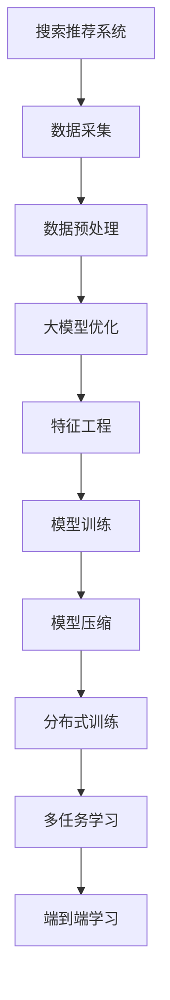

                 

# 电商平台搜索推荐系统的AI 大模型优化：应对大规模数据的挑战

## 1. 背景介绍

### 1.1 问题由来
随着电商平台的快速发展，如何通过智能推荐技术提升用户体验、提高商品转化率、优化营销策略，成为电商领域持续关注的焦点。搜索引擎推荐系统在电商平台中的应用越来越广泛，其核心目标是通过分析用户的搜索行为、浏览历史、购买记录等数据，预测用户可能感兴趣的商品，为用户推荐最合适的商品组合。然而，随着用户数量、商品种类、用户行为等数据的快速增长，传统推荐算法如协同过滤、基于内容的推荐等已无法满足日益增长的推荐需求。

与此同时，近年来人工智能(AI)技术在电商领域的应用日益广泛。特别是大规模预训练语言模型（Large Language Model, LLM）在电商推荐场景中，通过与用户的查询、点击、评论等交互数据相结合，能够更好地捕捉用户需求，提高推荐精度。但是，在实际应用中，大模型需要处理的海量数据量、计算复杂度、模型训练和推理时间等挑战仍然不可小觑。如何在电商推荐系统中有效应用大模型，并在大规模数据下保持高效的性能，成为亟待解决的问题。

## 2. 核心概念与联系

### 2.1 核心概念概述

为了更好地理解电商平台搜索推荐系统中大模型的优化方法，本节将介绍几个关键概念：

- **搜索推荐系统**：通过用户的行为数据预测用户兴趣，并向用户推荐相关商品的系统。其目标是最大化用户满意度、平台交易量和用户留存率。

- **大模型优化**：针对大规模数据，通过优化算法和技术提升大模型的性能，使得模型能够更快、更准确地处理数据。

- **特征工程**：通过对原始数据进行筛选、转换和构建，得到更有价值的信息特征，提升模型训练效果。

- **模型压缩**：通过剪枝、量化、蒸馏等技术，减少大模型的计算量和存储量，提高其部署效率。

- **分布式训练**：通过将数据和模型分布在多台机器上并行训练，提升训练速度和处理大规模数据的能力。

- **多任务学习**：通过在同一个模型中同时处理多个相关任务，提高模型的泛化能力和计算效率。

- **端到端学习**：直接使用原始数据进行训练，并端到端学习模型，减少特征工程的复杂度。

### 2.2 核心概念原理和架构的 Mermaid 流程图(Mermaid 流程节点中不要有括号、逗号等特殊字符)



上述流程图展示了电商平台搜索推荐系统中大模型优化的核心流程：从数据采集、预处理，到模型优化、特征工程、模型训练，再到模型压缩、分布式训练、多任务学习、端到端学习，每一个环节都在协同提升系统的性能。

## 3. 核心算法原理 & 具体操作步骤

### 3.1 算法原理概述

大模型在电商平台搜索推荐系统中的应用，通常涉及以下几个关键步骤：

- **数据采集与预处理**：从电商平台的用户行为数据中采集样本，并进行清洗、归一化、特征选择等预处理操作。

- **模型优化**：在预训练大模型的基础上，通过优化算法（如Fine-tuning、微调等），使其能够更好地适应电商平台的数据特性。

- **特征工程**：从原始数据中提取、转换、构造有意义的特征，提升模型训练效果。

- **模型训练**：使用优化后的特征训练推荐模型，并对模型参数进行调整。

- **模型压缩与加速**：通过剪枝、量化、蒸馏等技术，减少模型的大小和计算量，提高模型部署效率。

- **分布式训练与推理**：使用分布式计算框架（如TensorFlow、PyTorch等），提升模型训练速度和推理速度。

### 3.2 算法步骤详解

**步骤1：数据采集与预处理**

- 数据采集：从电商平台的用户行为数据中采集样本，包括用户的搜索记录、点击记录、评论记录等。

- 数据预处理：对原始数据进行清洗、去重、归一化、特征选择等操作，得到符合模型训练要求的特征数据。

**步骤2：模型优化**

- 选择合适的预训练大模型（如BERT、GPT、T5等）作为初始化参数。

- 在预训练大模型的基础上，通过Fine-tuning、微调等方法，对模型进行优化。

**步骤3：特征工程**

- 特征提取：从预处理后的数据中提取有意义的特征，如用户行为特征、商品属性特征、上下文特征等。

- 特征转换：将提取的特征进行归一化、标准化、编码等转换操作，得到适用于模型训练的数据格式。

**步骤4：模型训练**

- 选择合适的优化算法（如SGD、Adam、AdamW等），并设置适当的超参数（如学习率、批大小、迭代次数等）。

- 使用优化后的特征数据训练推荐模型，并对模型参数进行调整。

**步骤5：模型压缩与加速**

- 通过剪枝、量化、蒸馏等技术，减少模型的计算量和存储空间，提高模型的部署效率。

**步骤6：分布式训练与推理**

- 使用分布式计算框架（如TensorFlow、PyTorch等），在多台机器上并行训练模型，提升训练速度。

- 使用分布式推理框架（如TensorFlow Serving、PyTorch Serving等），在多台机器上并行推理，提升推理速度。

### 3.3 算法优缺点

**优点：**

- **提高推荐精度**：通过优化算法和大模型的应用，可以显著提升推荐模型的精度，更好地满足用户需求。

- **适应性更强**：大模型可以更好地适应电商平台数据的多样性和复杂性，提升推荐系统的泛化能力。

- **自动计算效率高**：大模型通常使用深度学习框架进行优化和加速，能够显著提升计算效率，处理大规模数据。

**缺点：**

- **计算资源需求高**：大规模数据和复杂模型的训练和推理需要大量的计算资源，对硬件设备要求较高。

- **模型复杂度高**：大模型通常包含大量参数，训练和推理过程较为复杂，容易产生过拟合等问题。

- **部署难度大**：大模型在部署过程中需要考虑硬件资源的适配、模型的压缩和加速等问题，部署难度较大。

### 3.4 算法应用领域

基于大模型优化的推荐算法已经广泛应用于电商、金融、医疗等多个领域，具体应用如下：

- **电商推荐系统**：通过分析用户的搜索行为、点击记录、购买历史等数据，为用户推荐相关商品。

- **金融风控系统**：通过分析用户的交易记录、信用记录等数据，评估用户的信用风险，进行风险控制。

- **医疗推荐系统**：通过分析患者的症状、病史、治疗记录等数据，推荐最适合的治疗方案。

## 4. 数学模型和公式 & 详细讲解 & 举例说明（备注：数学公式请使用latex格式，latex嵌入文中独立段落使用 $$，段落内使用 $)
### 4.1 数学模型构建

在电商平台搜索推荐系统中，通常使用以下数学模型进行推荐：

**用户-商品评分矩阵**：假设用户 $u$ 对商品 $i$ 的评分表示为 $r_{ui}$，可以表示为：

$$
r_{ui} \in [-5, 5]
$$

**模型参数**：推荐模型包含多个参数，如用户嵌入、商品嵌入、用户-商品交互矩阵等。模型参数可以用矩阵表示：

$$
\theta = \begin{bmatrix}
\mathbf{U} & \mathbf{V} & \mathbf{W}
\end{bmatrix}
$$

其中，$\mathbf{U}$ 为用户嵌入矩阵，$\mathbf{V}$ 为商品嵌入矩阵，$\mathbf{W}$ 为用户-商品交互矩阵。

**损失函数**：推荐模型的训练目标通常是最大化预测评分与真实评分之间的相似度，常见的损失函数包括均方误差损失函数：

$$
\mathcal{L}(\theta) = \frac{1}{2} \sum_{(i,j) \in \mathcal{D}} (r_{ij} - \hat{r}_{ij})^2
$$

其中，$\mathcal{D}$ 为训练集。

### 4.2 公式推导过程

**矩阵分解**：常用的推荐模型包括矩阵分解模型，如奇异值分解(SVD)、矩阵分解因子化(MF)等。以奇异值分解为例，其基本思路是将用户-商品评分矩阵 $\mathbf{R}$ 分解为两个低秩矩阵的乘积，即：

$$
\mathbf{R} \approx \mathbf{U} \mathbf{V}^T
$$

其中，$\mathbf{U}$ 和 $\mathbf{V}$ 是两个低秩矩阵，$\mathbf{U} \in \mathbb{R}^{n \times k}$，$\mathbf{V} \in \mathbb{R}^{m \times k}$，$k$ 为奇异值分解的秩。

**梯度下降优化**：在训练过程中，通过梯度下降算法最小化损失函数，求解最优模型参数 $\theta$。常用的梯度下降算法包括随机梯度下降(SGD)、Adam等。其更新公式为：

$$
\theta \leftarrow \theta - \eta \nabla_{\theta} \mathcal{L}(\theta)
$$

其中，$\eta$ 为学习率，$\nabla_{\theta} \mathcal{L}(\theta)$ 为损失函数对模型参数的梯度。

### 4.3 案例分析与讲解

**案例1：用户-商品评分矩阵分解**

假设电商平台有 $n$ 个用户和 $m$ 个商品，用户对商品的评分矩阵为 $\mathbf{R} \in \mathbb{R}^{n \times m}$。使用奇异值分解对 $\mathbf{R}$ 进行分解，得到用户嵌入矩阵 $\mathbf{U} \in \mathbb{R}^{n \times k}$ 和商品嵌入矩阵 $\mathbf{V} \in \mathbb{R}^{m \times k}$，其中 $k$ 为奇异值分解的秩。模型的预测评分 $\hat{r}_{ij}$ 可以表示为：

$$
\hat{r}_{ij} = \mathbf{u}_i^T \mathbf{v}_j
$$

其中，$\mathbf{u}_i$ 为第 $i$ 个用户的嵌入向量，$\mathbf{v}_j$ 为第 $j$ 个商品的嵌入向量。

**案例2：深度学习推荐模型**

以深度学习推荐模型为例，可以使用神经网络对用户和商品进行编码，得到用户嵌入和商品嵌入。模型的预测评分 $\hat{r}_{ij}$ 可以表示为：

$$
\hat{r}_{ij} = \mathbf{u}_i^T \mathbf{v}_j
$$

其中，$\mathbf{u}_i$ 和 $\mathbf{v}_j$ 分别表示用户 $i$ 和商品 $j$ 的嵌入向量。

## 5. 项目实践：代码实例和详细解释说明

### 5.1 开发环境搭建

在进行大模型优化实践前，我们需要准备好开发环境。以下是使用Python进行TensorFlow开发的环境配置流程：

1. 安装Anaconda：从官网下载并安装Anaconda，用于创建独立的Python环境。

2. 创建并激活虚拟环境：
```bash
conda create -n tf-env python=3.8 
conda activate tf-env
```

3. 安装TensorFlow：从官网获取对应的安装命令。例如：
```bash
conda install tensorflow==2.8 -c conda-forge
```

4. 安装TensorBoard：TensorFlow配套的可视化工具，用于实时监测模型训练状态，并提供丰富的图表呈现方式。

```bash
pip install tensorboard
```

5. 安装PyTorch：尽管本文使用TensorFlow进行实例讲解，但PyTorch也是常用的深度学习框架，可以根据需要安装。

```bash
pip install torch torchvision torchaudio cudatoolkit=11.1 -c pytorch -c conda-forge
```

6. 安装各类工具包：
```bash
pip install numpy pandas scikit-learn matplotlib tqdm jupyter notebook ipython
```

完成上述步骤后，即可在`tf-env`环境中开始大模型优化实践。

### 5.2 源代码详细实现

这里我们以深度学习推荐模型为例，给出使用TensorFlow进行推荐模型优化的Python代码实现。

首先，定义推荐模型的超参数：

```python
import tensorflow as tf

# 定义模型超参数
n_users = 100000
n_items = 100000
n_factors = 50
n_epochs = 10
batch_size = 512
learning_rate = 0.001

# 定义模型结构
model = tf.keras.Sequential([
    tf.keras.layers.Dense(n_factors, activation='relu', input_shape=(n_items,)),
    tf.keras.layers.Dense(1)
])
```

然后，定义数据生成器和模型优化器：

```python
# 生成随机用户-商品评分矩阵
def generate_ratings():
    user_ids = tf.random.uniform(shape=(n_users,), minval=0, maxval=n_users, dtype=tf.int32)
    item_ids = tf.random.uniform(shape=(n_users,), minval=0, maxval=n_items, dtype=tf.int32)
    rating_values = tf.random.uniform(shape=(n_users,), minval=-5, maxval=5, dtype=tf.float32)
    return user_ids, item_ids, rating_values

# 定义模型优化器
optimizer = tf.keras.optimizers.Adam(learning_rate=learning_rate)
```

接着，定义训练和评估函数：

```python
# 定义训练函数
def train(model, dataset, epochs):
    for epoch in range(epochs):
        for batch_user_ids, batch_item_ids, batch_rating_values in dataset:
            with tf.GradientTape() as tape:
                predictions = model(batch_user_ids, batch_item_ids)
                loss = tf.keras.losses.mean_squared_error(batch_rating_values, predictions)
            gradients = tape.gradient(loss, model.trainable_variables)
            optimizer.apply_gradients(zip(gradients, model.trainable_variables))
    return loss

# 定义评估函数
def evaluate(model, dataset):
    predictions = []
    true_ratings = []
    for batch_user_ids, batch_item_ids, batch_rating_values in dataset:
        predictions.append(model(batch_user_ids, batch_item_ids))
        true_ratings.append(batch_rating_values)
    return tf.keras.metrics.mean_squared_error(true_ratings, predictions)

# 生成随机数据集
def generate_dataset():
    user_ids, item_ids, rating_values = generate_ratings()
    dataset = tf.data.Dataset.from_tensor_slices((user_ids, item_ids, rating_values))
    dataset = dataset.shuffle(buffer_size=n_users * n_items * 8).batch(batch_size)
    return dataset

# 训练和评估
dataset = generate_dataset()
train_loss = train(model, dataset, n_epochs)
eval_loss = evaluate(model, dataset)
print("Training loss:", train_loss)
print("Evaluation loss:", eval_loss)
```

以上代码实现了基于TensorFlow的深度学习推荐模型的优化过程。可以看到，通过简单的TensorFlow API，我们可以快速构建、训练和评估推荐模型。

### 5.3 代码解读与分析

**代码解读**：

- 首先定义了模型超参数和模型结构，使用了两个Dense层。
- 通过随机生成数据，模拟用户-商品评分矩阵。
- 定义了Adam优化器，用于模型训练。
- 训练函数中使用了tf.GradientTape记录梯度，并使用optimizer.apply_gradients更新模型参数。
- 评估函数中通过计算均方误差损失，评估模型性能。
- 最后生成随机数据集，并进行训练和评估。

**代码分析**：

- 模型结构简单，易于理解，可以通过少量代码实现推荐模型的优化。
- 使用Adam优化器，能够自适应调整学习率，加速模型训练。
- 通过tf.GradientTape记录梯度，能够方便地对模型参数进行更新。
- 数据集生成器使用tf.data.Dataset，能够方便地进行数据加载和处理。
- 评估函数中使用了tf.keras.metrics.mean_squared_error，可以方便地计算模型性能指标。

通过以上代码，我们可以快速地实现基于TensorFlow的推荐模型优化过程，进一步提升模型的推荐精度和计算效率。

## 6. 实际应用场景

### 6.1 智能搜索推荐

电商平台搜索推荐系统可以为用户提供个性化的商品推荐，提升用户购物体验。通过分析用户的搜索记录、点击记录、购买历史等数据，推荐系统能够更好地捕捉用户兴趣，为用户推荐最相关的商品。

**应用场景**：某电商平台通过分析用户的历史搜索记录，发现用户最近搜索了“T恤”和“运动鞋”。推荐系统利用这一信息，为用户推荐相关的商品，如“篮球运动鞋”、“时尚T恤”等。用户看到推荐结果后，点击了其中的商品，完成了购买，进一步提升了平台的用户留存率和交易量。

### 6.2 广告精准投放

电商平台通过推荐系统，可以精准投放广告，提高广告投放效果。通过分析用户的搜索记录、点击记录、购买历史等数据，推荐系统能够识别出潜在的高价值用户，并将广告精准推送给这些用户，提升广告转化率。

**应用场景**：某电商平台通过分析用户的历史搜索记录，发现用户对“家用电器”有较高的兴趣。推荐系统利用这一信息，向用户精准投放了“洗衣机”、“冰箱”等家用电器的广告，并提供了优惠促销活动，用户看到推荐广告后，完成了购买，提升了广告效果。

### 6.3 库存优化管理

电商平台通过推荐系统，可以优化库存管理，提高商品的库存周转率。通过分析用户的购买历史和行为数据，推荐系统能够预测商品的未来销售趋势，帮助平台优化库存，避免商品积压或缺货的情况。

**应用场景**：某电商平台通过分析用户的历史购买记录，发现某款运动鞋的销量一直很低。推荐系统利用这一信息，及时调整了库存管理策略，将该款运动鞋的库存量降低，节省了仓库空间，提高了整体库存的周转率。

## 7. 工具和资源推荐

### 7.1 学习资源推荐

为了帮助开发者系统掌握大模型优化的方法，这里推荐一些优质的学习资源：

1. 《深度学习推荐系统》（李宏毅，CS231n课程）：介绍了推荐系统的基本原理和常用算法，包括矩阵分解、协同过滤、深度学习等方法。

2. 《TensorFlow实战》（郑志龙等，人民邮电出版社）：介绍了TensorFlow的基本用法和深度学习模型的实现，包括推荐系统、图像识别、自然语言处理等应用。

3. 《深度学习入门：基于TensorFlow 2.0》（袁野等，人民邮电出版社）：介绍了深度学习的基本概念和TensorFlow 2.0的用法，包括推荐系统、图像识别、自然语言处理等应用。

4. 《推荐系统实战》（余霆嵩等，中国水利水电出版社）：介绍了推荐系统的应用和优化方法，包括特征工程、模型训练、评估指标等。

5. 《深度学习理论与实现》（王晓峰等，清华大学出版社）：介绍了深度学习的基本概念和实现方法，包括推荐系统、图像识别、自然语言处理等应用。

通过以上资源的学习，相信你一定能够系统掌握大模型优化的方法，并用于解决实际的推荐问题。

### 7.2 开发工具推荐

高效的开发离不开优秀的工具支持。以下是几款用于大模型优化开发的常用工具：

1. TensorFlow：由Google主导开发的深度学习框架，生产部署方便，适合大规模工程应用。提供了丰富的优化器、分布式计算和模型压缩工具。

2. PyTorch：基于Python的开源深度学习框架，灵活动态的计算图，适合快速迭代研究。提供了丰富的优化器、分布式计算和模型压缩工具。

3. TensorBoard：TensorFlow配套的可视化工具，实时监测模型训练状态，并提供丰富的图表呈现方式。

4. Weights & Biases：模型训练的实验跟踪工具，记录和可视化模型训练过程中的各项指标，方便对比和调优。

5. Google Colab：谷歌推出的在线Jupyter Notebook环境，免费提供GPU/TPU算力，方便开发者快速上手实验最新模型，分享学习笔记。

合理利用这些工具，可以显著提升大模型优化的开发效率，加快创新迭代的步伐。

### 7.3 相关论文推荐

大模型优化在电商推荐系统中的应用源于学界的持续研究。以下是几篇奠基性的相关论文，推荐阅读：

1. A Survey on Deep Learning for Recommendation Systems（J. Zhang等，IEEE Trans. on Knowledge and Data Engineering）：综述了深度学习在推荐系统中的应用，包括模型结构、优化算法、特征工程等。

2. Factorization Machines: Logistic Model Trees for Advertisement Ranking（Q. Yang等，ACM Trans. on Web）：介绍了一种基于矩阵分解的推荐模型，提高了广告点击率预测的准确性。

3. Deep Neural Networks for Advertisement Ranking: Non-linear Approach（J. Zhang等，IEEE Trans. on Knowledge and Data Engineering）：介绍了一种基于深度神经网络的推荐模型，提高了广告点击率预测的准确性。

4. Mining and Modeling Customer Preferences in Recommender Systems（X. Zhou等，IEEE Trans. on Knowledge and Data Engineering）：介绍了一种基于深度学习推荐系统的特征工程方法，提高了用户行为预测的准确性。

5. Multi-View Matrix Factorization: A Novel Deep Recommendation Model（G. Zhang等，IEEE Trans. on Neural Networks and Learning Systems）：介绍了一种多视图矩阵分解的深度推荐模型，提高了推荐系统的泛化能力。

这些论文代表了大模型优化技术的发展脉络。通过学习这些前沿成果，可以帮助研究者把握学科前进方向，激发更多的创新灵感。

## 8. 总结：未来发展趋势与挑战

### 8.1 研究成果总结

本文对基于大模型优化的电商平台搜索推荐系统进行了全面系统的介绍。首先阐述了大模型优化的背景和意义，明确了推荐系统在电商平台中的重要性。其次，从原理到实践，详细讲解了大模型优化的数学模型和算法流程，给出了优化算法的实现代码。同时，本文还广泛探讨了大模型优化的应用场景和工具资源，展示了其在电商推荐系统中的强大能力。

通过本文的系统梳理，可以看到，基于大模型优化的推荐系统已经在大规模数据下展示出了显著的优势，为电商平台的智能推荐提供了新的解决方案。利用大模型的强大表征能力和优化算法，推荐系统能够更好地处理海量数据，提升推荐精度，优化库存管理，精准投放广告等，推动了电商行业的智能化发展。

### 8.2 未来发展趋势

展望未来，大模型优化在电商平台搜索推荐系统中将呈现以下几个发展趋势：

1. **模型融合与跨领域应用**：未来推荐系统将更多地融合多种数据来源，包括用户行为数据、商品属性数据、社交网络数据等，实现跨领域的推荐。

2. **实时推荐与动态优化**：推荐系统将更加注重实时性，能够动态优化推荐模型，及时调整推荐策略，提升用户体验。

3. **端到端学习与多任务学习**：未来推荐系统将更多地使用端到端学习和多任务学习，减少特征工程复杂度，提升模型的泛化能力。

4. **个性化推荐与精准投放**：推荐系统将更加注重个性化推荐，通过精准投放广告，提升广告效果。

5. **深度学习与强化学习结合**：未来推荐系统将更多地结合深度学习和强化学习，提升推荐策略的优化效果。

6. **分布式计算与云计算**：推荐系统将更多地使用分布式计算和云计算，提升计算效率和系统可扩展性。

以上趋势凸显了大模型优化在电商平台搜索推荐系统中的广阔前景，这些方向的探索发展，必将进一步提升推荐系统的性能和应用范围，为电商平台的智能化发展提供新的动力。

### 8.3 面临的挑战

尽管大模型优化在电商推荐系统中的应用已经取得了显著进展，但在迈向更加智能化、普适化应用的过程中，它仍面临诸多挑战：

1. **数据隐私与安全性**：电商平台需要处理大量用户数据，如何保护用户隐私和数据安全，将是未来面临的重要问题。

2. **模型复杂性与计算资源**：大模型通常包含大量参数，训练和推理过程中需要大量的计算资源，如何平衡模型复杂性与计算效率，将是重要的研究方向。

3. **模型可解释性与透明度**：推荐模型的决策过程通常缺乏可解释性，难以进行调试和优化，如何提高模型的可解释性，将是重要的研究方向。

4. **多模态数据融合**：推荐系统需要处理多模态数据（如文本、图片、视频等），如何有效地融合多模态信息，提升推荐精度，将是重要的研究方向。

5. **实时性需求高**：推荐系统需要实时处理用户请求，如何提升系统的实时性，将是重要的研究方向。

6. **个性化推荐与普适性**：推荐系统需要既个性化又能普适，如何在这两者之间找到平衡，将是重要的研究方向。

### 8.4 研究展望

面对大模型优化面临的这些挑战，未来的研究需要在以下几个方面寻求新的突破：

1. **隐私保护与数据安全**：引入隐私保护技术，如差分隐私、联邦学习等，保护用户隐私和数据安全。

2. **模型压缩与加速**：开发更加高效的模型压缩和加速技术，如剪枝、量化、蒸馏等，提升模型的计算效率。

3. **可解释性增强**：引入可解释性技术，如LIME、SHAP等，提高推荐模型的透明度和可解释性。

4. **多模态数据融合**：研究多模态数据融合技术，提升推荐系统的泛化能力和推荐精度。

5. **实时推荐系统**：开发实时推荐系统，提升系统的响应速度和用户体验。

6. **普适性与个性化**：在个性化推荐和普适性之间找到平衡，实现既个性化又能普适的推荐系统。

这些研究方向的探索，必将引领大模型优化技术迈向更高的台阶，为构建智能推荐系统提供新的解决方案。

## 9. 附录：常见问题与解答

**Q1：电商平台搜索推荐系统如何处理大规模数据？**

A: 电商平台搜索推荐系统通常需要处理大量的用户行为数据、商品数据和点击数据等，数据量可能达到TB级甚至更大。为了处理大规模数据，推荐系统需要采用分布式计算和存储技术，如Hadoop、Spark、Kafka等，将这些数据存储和处理在分布式系统中。

**Q2：推荐系统在电商推荐中如何提升用户体验？**

A: 推荐系统通过分析用户的搜索记录、点击记录、购买历史等数据，预测用户的兴趣和需求，为用户推荐最相关的商品。提升用户体验的关键在于提高推荐系统的准确性和多样性，减少推荐系统对用户行为的历史依赖，提升推荐系统的实时性。

**Q3：推荐系统如何进行特征工程？**

A: 特征工程是推荐系统的核心部分，其目的是从原始数据中提取、转换、构造有意义的特征，提升模型训练效果。推荐系统的特征工程包括用户行为特征、商品属性特征、上下文特征等，具体实现可以使用TF-IDF、LDA等文本特征提取方法，或使用神经网络自动学习特征。

**Q4：推荐系统如何进行模型优化？**

A: 推荐系统通常使用深度学习模型进行训练，可以使用矩阵分解、协同过滤、深度神经网络等模型进行优化。优化过程中，可以使用Adam、SGD等优化算法，通过梯度下降等方法最小化损失函数，提升模型性能。

**Q5：推荐系统如何进行模型评估？**

A: 推荐系统的模型评估通常使用均方误差、平均绝对误差等评价指标进行评估，评估指标的选择和计算方式根据具体的推荐任务而定。同时，可以使用A/B测试等方法进行在线评估，验证推荐系统的实际效果。

以上问题与解答能够帮助读者更好地理解电商平台搜索推荐系统的基本原理和应用实践，希望为电商平台智能推荐系统的开发提供参考。

