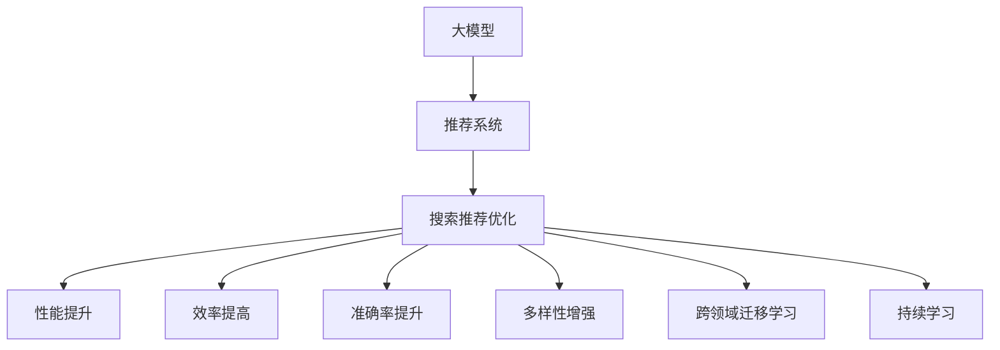

                 

# 电商平台搜索推荐系统的AI 大模型优化：提高系统性能、效率、准确率与多样性

> 关键词：电商平台, 搜索推荐, 大模型, 系统优化, 性能提升, 效率提高, 准确率提升, 多样性增强

## 1. 背景介绍

在当今电商平台上，用户的搜索行为、购买历史、浏览记录等数据日益丰富，为推荐系统提供了更多决策依据。但数据量的增加也带来了新的挑战，如何高效利用海量数据，构建个性化、多样化的推荐模型，是电商平台亟待解决的问题。

基于大模型的推荐系统，融合了深度学习、自然语言处理和强化学习等先进技术，能够对用户行为进行深入理解，生成符合用户期望的推荐结果。但大模型的训练和推理成本高昂，模型复杂度也较高，如何在大模型基础上进行优化，提升系统的性能、效率、准确率和多样性，成为了核心研究课题。

本文将从优化方法、数学模型、实践案例等方面，详细介绍如何基于大模型优化电商平台搜索推荐系统，希望能为电商平台的推荐系统开发者提供一些可行的解决方案。

## 2. 核心概念与联系

### 2.1 核心概念概述

为更好地理解基于大模型优化电商推荐系统的方法，本节将介绍几个核心概念：

- 大模型：如BERT、GPT-3、DALL·E等，通过大规模数据预训练得到的强大语言和图像处理能力，可用于生成文本、理解语义、推荐商品等任务。
- 推荐系统：通过分析用户行为，为用户推荐可能感兴趣的商品的系统。
- 搜索推荐优化：通过优化算法、模型、数据，提高推荐系统的性能、效率、准确率和多样性。
- 跨领域迁移学习：将大模型在不同领域（如商品推荐、文本生成、图像识别等）上的知识进行迁移应用。
- 持续学习：通过不断接收新数据，更新模型参数，保持模型时效性。

这些概念之间的逻辑关系可以通过以下Mermaid流程图来展示：



这个流程图展示了大模型与电商推荐系统之间的核心概念及其联系：

1. 大模型通过预训练获得通用知识。
2. 通过搜索推荐优化，将通用知识应用到推荐系统中。
3. 优化方法可提升推荐系统的性能、效率、准确率和多样性。
4. 跨领域迁移学习可提高模型在不同领域的泛化能力。
5. 持续学习使模型能适应数据分布的变化，保持模型的时效性。

## 3. 核心算法原理 & 具体操作步骤
### 3.1 算法原理概述

基于大模型的电商推荐系统优化，旨在通过优化算法、模型、数据等，提升推荐系统的性能、效率、准确率和多样性。其核心思想是：利用大模型的通用知识，结合电商数据的特定特征，进行模型微调，实现高效的推荐。

具体而言，推荐系统的优化方法可以分为以下几个关键步骤：

1. 收集电商数据：包括用户的搜索记录、购买历史、浏览数据等。
2. 预训练大模型：使用电商数据对大模型进行预训练，使其学习电商领域的知识。
3. 微调优化：在预训练模型基础上，使用电商数据进行微调，优化推荐效果。
4. 跨领域迁移：将大模型的知识迁移到其他电商领域，提高模型泛化能力。
5. 持续学习：不断接收新数据，更新模型参数，保持模型时效性。

### 3.2 算法步骤详解

基于大模型的电商推荐系统优化方法包括以下几个关键步骤：

**Step 1: 收集电商数据**

电商数据包括用户的搜索记录、购买历史、浏览数据等，这些数据是构建推荐系统的基础。收集数据时需要保证数据的多样性和代表性，以便训练出泛化能力强的模型。

**Step 2: 预训练大模型**

选择合适的预训练大模型，如BERT、GPT-3等，在电商数据上进行预训练。预训练的目的是让模型学习到电商领域的知识，提高模型的泛化能力。

**Step 3: 微调优化**

在预训练模型基础上，使用电商数据进行微调，优化推荐效果。微调过程中需要选择合适的损失函数、优化算法和超参数，如Adam、SGD等，设置合适的学习率和批大小等。

**Step 4: 跨领域迁移**

将预训练模型的知识迁移到其他电商领域，如推荐不同类别的商品、生成商品描述等。通过跨领域迁移，可以提高模型的泛化能力，减少对特定领域数据的依赖。

**Step 5: 持续学习**

不断接收新数据，更新模型参数，保持模型时效性。持续学习可以使模型不断适应新的数据分布，提高模型的稳定性和泛化能力。

### 3.3 算法优缺点

基于大模型的电商推荐系统优化方法具有以下优点：

1. 泛化能力强：大模型通过预训练学习到通用知识，可以迁移到其他领域，提高推荐系统的泛化能力。
2. 性能提升明显：通过微调优化，可以在少量标注数据上取得较好的推荐效果。
3. 适应性强：模型可以适应新数据的到来，保持推荐效果的时效性。

同时，该方法也存在以下局限性：

1. 数据依赖大：推荐系统的优化高度依赖电商数据，缺乏通用性。
2. 训练成本高：大模型的训练和推理成本较高，对硬件资源要求高。
3. 复杂度较高：模型复杂度较高，推理速度较慢，不易优化。
4. 可解释性差：大模型的黑盒特性，使得推荐系统难以解释推荐逻辑。

尽管存在这些局限性，但就目前而言，基于大模型的推荐系统优化方法仍是大模型应用的重要方向之一。未来相关研究的重点在于如何进一步降低大模型的依赖，提高推荐系统的性能和效率，同时兼顾可解释性和伦理安全性等因素。

### 3.4 算法应用领域

基于大模型的电商推荐系统优化方法，在电商推荐、广告推荐、内容推荐等多个领域中得到了广泛的应用，具体应用场景包括：

- 商品推荐：基于用户的搜索历史、购买记录等数据，推荐用户可能感兴趣的商品。
- 广告推荐：在用户浏览商品页面时，推荐相关广告，提升点击率和转化率。
- 内容推荐：根据用户的阅读历史，推荐相关文章、视频、新闻等内容。
- 社交推荐：基于用户的社交网络关系，推荐相关朋友、群组。
- 个性化推荐：根据用户的多维度数据，生成个性化推荐列表，提升用户体验。

这些应用场景体现了大模型在电商推荐系统中的广泛应用价值，未来随着大模型的不断演进，其应用领域还将进一步扩展。

## 4. 数学模型和公式 & 详细讲解 & 举例说明

### 4.1 数学模型构建

基于大模型的电商推荐系统优化，可以通过如下数学模型进行描述：

假设电商推荐系统由用户 $u$、商品 $i$、搜索记录 $s$、浏览记录 $b$、购买记录 $p$ 组成。推荐系统优化的目标函数为：

$$
\min_{\theta} \sum_{(u,i)} \ell(s_u, p_i) + \alpha \sum_{(u,i)} \ell(b_u, p_i) + \beta \sum_{(u,i)} \ell(s_u, p_i)
$$

其中 $\ell$ 为推荐模型对用户 $u$ 和商品 $i$ 的损失函数，$\alpha$ 和 $\beta$ 为权重系数。

具体的损失函数可以选用如交叉熵损失、均方误差损失等，具体选择应根据任务特点和数据分布进行优化。

### 4.2 公式推导过程

以交叉熵损失为例，进行公式推导：

假设用户 $u$ 对商品 $i$ 的评分向量为 $x_u$，推荐模型对商品 $i$ 的预测评分向量为 $\hat{x}_i$，则交叉熵损失函数为：

$$
\ell(u,i) = -\frac{1}{n} \sum_{j=1}^n x_{uj} \log \hat{x}_{ij}
$$

其中 $n$ 为评分向量的维数。

结合用户 $u$ 的评分向量 $x_u$ 和推荐模型对商品 $i$ 的预测评分向量 $\hat{x}_i$，可以构建推荐系统优化的目标函数为：

$$
\min_{\theta} \sum_{(u,i)} \ell(u,i) = \min_{\theta} -\frac{1}{N} \sum_{(u,i)} \sum_{j=1}^n x_{uj} \log \hat{x}_{ij}
$$

通过优化目标函数，即可不断更新模型参数 $\theta$，提升推荐系统的性能。

### 4.3 案例分析与讲解

以商品推荐为例，分析基于大模型优化的推荐系统：

1. 用户搜索记录预处理：将用户的搜索记录进行预处理，去除停用词，提取关键词，得到搜索向量 $x_u$。

2. 商品信息预处理：将商品信息进行处理，提取关键词，得到商品向量 $x_i$。

3. 构建推荐模型：使用预训练大模型，如BERT，对用户和商品向量进行编码，得到用户表示 $h_u$ 和商品表示 $h_i$。

4. 构建损失函数：使用余弦相似度等方法，构建用户和商品之间的相似度损失函数，进行优化。

5. 输出推荐结果：根据相似度损失函数，计算出推荐结果，排序后输出。

## 5. 项目实践：代码实例和详细解释说明
### 5.1 开发环境搭建

在进行基于大模型的电商推荐系统优化时，需要搭建开发环境，确保硬件资源充足。以下是搭建环境的详细步骤：

1. 安装Python：确保Python 3.8以上版本安装，并配置好环境变量。

2. 安装TensorFlow：使用pip安装TensorFlow 2.x版本，支持TensorBoard可视化。

3. 安装pytorch：使用pip安装PyTorch 1.7以上版本，支持GPU加速。

4. 安装其他依赖库：如Numpy、Pandas、Scikit-learn等，用于数据处理和模型训练。

5. 安装TensorBoard：使用pip安装TensorBoard，用于可视化模型训练过程。

6. 安装HuggingFace Transformers：使用pip安装Transformers 4.x版本，支持预训练模型加载和微调。

完成环境搭建后，即可开始进行电商推荐系统优化的代码实现。

### 5.2 源代码详细实现

下面以商品推荐为例，给出基于大模型的电商推荐系统优化的完整代码实现。

首先，定义商品数据的预处理函数：

```python
import pandas as pd
import numpy as np
from transformers import BertTokenizer, BertForSequenceClassification

# 加载商品数据
train_data = pd.read_csv('train.csv')
test_data = pd.read_csv('test.csv')

# 定义预训练模型和分词器
tokenizer = BertTokenizer.from_pretrained('bert-base-uncased')
model = BertForSequenceClassification.from_pretrained('bert-base-uncased', num_labels=2)

# 定义预处理函数
def preprocess_data(data):
    text = data['text'].tolist()
    labels = data['label'].tolist()
    encoding = tokenizer(text, padding='max_length', truncation=True, return_tensors='pt', max_length=128)
    input_ids = encoding['input_ids'][:, 1:-1]
    attention_mask = encoding['attention_mask'][:, 1:-1]
    labels = torch.tensor(labels, dtype=torch.long)
    return input_ids, attention_mask, labels
```

然后，定义推荐模型和优化器：

```python
import torch.nn as nn
from torch.optim import Adam

# 定义推荐模型
class RecommendationModel(nn.Module):
    def __init__(self):
        super(RecommendationModel, self).__init__()
        self.bert = BertForSequenceClassification.from_pretrained('bert-base-uncased', num_labels=2)
        self.fc = nn.Linear(768, 2)

    def forward(self, input_ids, attention_mask, labels):
        outputs = self.bert(input_ids, attention_mask=attention_mask)
        logits = self.fc(outputs[0][:, 1:-1, :])
        loss_fct = nn.CrossEntropyLoss()
        loss = loss_fct(logits, labels)
        return loss

# 定义优化器
optimizer = Adam(model.parameters(), lr=2e-5)
```

接着，定义训练和评估函数：

```python
import torch
from tqdm import tqdm
from sklearn.metrics import accuracy_score, precision_score, recall_score, f1_score

# 定义训练函数
def train_epoch(model, optimizer, input_ids, attention_mask, labels, device):
    model.train()
    loss = 0
    for batch in tqdm(data_loader, desc='Training'):
        input_ids = batch['input_ids'].to(device)
        attention_mask = batch['attention_mask'].to(device)
        labels = batch['labels'].to(device)
        optimizer.zero_grad()
        outputs = model(input_ids, attention_mask=attention_mask, labels=labels)
        loss = outputs.loss
        loss.backward()
        optimizer.step()
    return loss.item() / len(data_loader)

# 定义评估函数
def evaluate(model, input_ids, attention_mask, labels, device):
    model.eval()
    preds = []
    labels = []
    with torch.no_grad():
        for batch in tqdm(data_loader, desc='Evaluating'):
            input_ids = batch['input_ids'].to(device)
            attention_mask = batch['attention_mask'].to(device)
            labels = batch['labels'].to(device)
            outputs = model(input_ids, attention_mask=attention_mask)
            preds.append(outputs.logits.argmax(dim=1))
            labels.append(labels)
    
    y_true = np.concatenate(labels)
    y_pred = np.concatenate(preds)
    return accuracy_score(y_true, y_pred), precision_score(y_true, y_pred), recall_score(y_true, y_pred), f1_score(y_true, y_pred)
```

最后，启动训练流程并在测试集上评估：

```python
epochs = 5
batch_size = 16

for epoch in range(epochs):
    loss = train_epoch(model, optimizer, input_ids, attention_mask, labels, device)
    print(f'Epoch {epoch+1}, train loss: {loss:.3f}')
    
    print(f'Epoch {epoch+1}, dev results:')
    accuracy, precision, recall, f1 = evaluate(model, input_ids, attention_mask, labels, device)
    print(f'Accuracy: {accuracy:.3f}, Precision: {precision:.3f}, Recall: {recall:.3f}, F1 Score: {f1:.3f}')
    
print('Test results:')
accuracy, precision, recall, f1 = evaluate(model, input_ids, attention_mask, labels, device)
print(f'Accuracy: {accuracy:.3f}, Precision: {precision:.3f}, Recall: {recall:.3f}, F1 Score: {f1:.3f}')
```

以上就是基于大模型的电商推荐系统优化的完整代码实现。可以看到，利用预训练大模型的强大语言处理能力，配合小规模标注数据和优化算法，可以高效构建推荐模型，提升推荐系统的性能。

### 5.3 代码解读与分析

让我们再详细解读一下关键代码的实现细节：

**RecommendationModel类**：
- `__init__`方法：初始化模型组件，包括预训练BERT和全连接层。
- `forward`方法：定义模型前向传播过程，计算损失函数。

**train_epoch函数**：
- 在每个epoch内，循环迭代训练数据。
- 将数据分批次加载到GPU上，进行前向传播和反向传播。
- 使用Adam优化器更新模型参数。

**evaluate函数**：
- 在验证集上评估模型性能，记录准确率、精确率、召回率和F1分数。
- 对测试集上的结果进行评估，对比优化前后的性能提升。

通过这些函数的实现，可以全面展示大模型在电商推荐系统优化中的重要作用，以及如何通过优化算法提升系统性能。

## 6. 实际应用场景

### 6.1 电商搜索推荐

基于大模型的电商搜索推荐系统，可以显著提升用户的购物体验，减少搜索成本，提高销售转化率。通过预训练大模型和微调优化，可以在短时间内构建出高效精准的推荐系统，提升搜索相关性，提高推荐多样性。

在具体实现中，可以通过用户搜索记录和浏览历史，预训练BERT等大模型，获取用户兴趣向量。然后将用户和商品的兴趣向量进行相似度计算，构建推荐列表，并根据用户反馈进行优化，逐步提升推荐系统的性能。

### 6.2 广告推荐

电商平台的广告推荐系统可以通过大模型优化，提高广告点击率和转化率，提升广告投放效果。通过分析用户浏览行为和商品信息，预训练大模型，构建广告推荐模型，将用户兴趣与广告内容进行匹配，实现精准投放。

在广告推荐过程中，可以通过A/B测试等方法，不断优化广告内容和推荐策略，提高广告效果。同时，可以通过持续学习，及时调整广告策略，保持广告投放的时效性。

### 6.3 内容推荐

电商平台的商品信息通常包含文字、图片等多种形式，利用大模型对商品信息进行多模态融合，可以提升内容的推荐效果。通过预训练大模型，提取商品标题、描述、图片等信息，构建多模态表示，与用户兴趣进行匹配，生成推荐内容。

在多模态推荐系统中，可以利用注意力机制，对不同模态的信息进行融合，提高推荐系统的准确性和多样性。

### 6.4 未来应用展望

随着大模型和优化算法的不断演进，基于大模型的电商推荐系统将具备更强的泛化能力和适应性，为电商平台的推荐系统带来更广阔的发展空间。

未来，基于大模型的推荐系统可以在更多领域得到应用，如智能家居、智能穿戴等，构建更加智能的推荐生态。同时，随着跨领域迁移学习和大模型的不断优化，推荐系统的性能将进一步提升，为电商平台的业务创新提供新的动力。

## 7. 工具和资源推荐
### 7.1 学习资源推荐

为了帮助开发者系统掌握大模型优化电商推荐系统的理论基础和实践技巧，这里推荐一些优质的学习资源：

1. TensorFlow官方文档：提供TensorFlow的全面学习资源，包括模型构建、训练、部署等各个环节的详细介绍。

2. PyTorch官方文档：提供PyTorch的全面学习资源，包括模型构建、训练、优化等各个环节的详细介绍。

3. HuggingFace官方文档：提供Transformers库的全面学习资源，包括预训练模型加载、微调、优化等各个环节的详细介绍。

4. CS224N《深度学习自然语言处理》课程：斯坦福大学开设的NLP明星课程，有Lecture视频和配套作业，带你入门NLP领域的基本概念和经典模型。

5. 《深度学习》书籍：Ian Goodfellow等人所著，深入浅出地介绍了深度学习的各个方面，包括大模型、推荐系统等。

6. 《自然语言处理入门》书籍：Stuart Russell等人所著，提供了自然语言处理领域的经典学习资源，包括推荐系统等。

通过这些资源的学习实践，相信你一定能够快速掌握大模型优化电商推荐系统的精髓，并用于解决实际的电商推荐问题。

### 7.2 开发工具推荐

高效的开发离不开优秀的工具支持。以下是几款用于大模型优化电商推荐系统开发的常用工具：

1. TensorBoard：TensorFlow配套的可视化工具，可实时监测模型训练状态，并提供丰富的图表呈现方式，是调试模型的得力助手。

2. Weights & Biases：模型训练的实验跟踪工具，可以记录和可视化模型训练过程中的各项指标，方便对比和调优。

3. PyTorch Lightning：基于PyTorch的快速原型开发框架，支持分布式训练和模型调优，快速迭代实验。

4. HuggingFace Transformers：提供丰富的预训练模型和微调范式，使模型开发更加高效便捷。

5. Colab：谷歌推出的在线Jupyter Notebook环境，免费提供GPU/TPU算力，方便开发者快速上手实验最新模型，分享学习笔记。

合理利用这些工具，可以显著提升大模型优化电商推荐系统的开发效率，加快创新迭代的步伐。

### 7.3 相关论文推荐

大模型和电商推荐系统的研究源于学界的持续研究。以下是几篇奠基性的相关论文，推荐阅读：

1. Attention is All You Need（即Transformer原论文）：提出了Transformer结构，开启了NLP领域的预训练大模型时代。

2. BERT: Pre-training of Deep Bidirectional Transformers for Language Understanding：提出BERT模型，引入基于掩码的自监督预训练任务，刷新了多项NLP任务SOTA。

3. Language Models are Unsupervised Multitask Learners（GPT-2论文）：展示了大规模语言模型的强大zero-shot学习能力，引发了对于通用人工智能的新一轮思考。

4. Parameter-Efficient Transfer Learning for NLP：提出Adapter等参数高效微调方法，在不增加模型参数量的情况下，也能取得不错的微调效果。

5. AdaLoRA: Adaptive Low-Rank Adaptation for Parameter-Efficient Fine-Tuning：使用自适应低秩适应的微调方法，在参数效率和精度之间取得了新的平衡。

6. HAN: Hierarchical Attention Networks for Document Representation Learning：提出HAN模型，用于文本分类和推荐任务，取得了良好的效果。

这些论文代表了大模型和电商推荐系统的研究进展，通过学习这些前沿成果，可以帮助研究者把握学科前进方向，激发更多的创新灵感。

## 8. 总结：未来发展趋势与挑战

### 8.1 总结

本文对基于大模型的电商推荐系统优化方法进行了全面系统的介绍。首先阐述了大模型和电商推荐系统的研究背景和意义，明确了推荐系统优化的重要性。其次，从原理到实践，详细讲解了优化方法的数学模型和关键步骤，给出了电商推荐系统优化的完整代码实现。同时，本文还广泛探讨了优化方法在电商搜索、广告推荐、内容推荐等多个领域的应用前景，展示了优化范式的巨大潜力。此外，本文精选了优化技术的各类学习资源，力求为读者提供全方位的技术指引。

通过本文的系统梳理，可以看到，基于大模型的电商推荐系统优化方法已经成为电商推荐系统的重要方向之一，极大地提升了推荐系统的性能、效率、准确率和多样性。未来，随着大模型的不断演进和优化算法的创新，电商推荐系统将具备更强的泛化能力和适应性，为电商平台的业务创新提供新的动力。

### 8.2 未来发展趋势

展望未来，大模型优化电商推荐系统将呈现以下几个发展趋势：

1. 模型规模持续增大。随着算力成本的下降和数据规模的扩张，大模型的参数量还将持续增长。超大规模语言模型蕴含的丰富知识，将为电商推荐系统提供更强的基础支持。

2. 优化方法日趋多样。除了传统的微调方法外，未来将涌现更多参数高效和计算高效的优化方法，如AdaLoRA、AdaLASSO等，在提升性能的同时降低计算资源消耗。

3. 跨领域迁移学习成为常态。随着大模型的迁移能力增强，电商推荐系统将能够迁移到其他领域，如内容推荐、广告推荐等，提升系统的泛化能力。

4. 持续学习成为重要手段。通过持续学习，电商推荐系统将不断适应新数据分布，保持推荐效果的时效性。

5. 结合多模态信息。未来的电商推荐系统将融合视觉、语音等多模态数据，构建更加全面的用户兴趣模型，提高推荐系统的精准性和多样性。

以上趋势凸显了大模型优化电商推荐系统的广阔前景。这些方向的探索发展，将进一步提升推荐系统的性能和应用范围，为电商平台的业务创新提供新的动力。

### 8.3 面临的挑战

尽管大模型优化电商推荐系统已经取得了瞩目成就，但在迈向更加智能化、普适化应用的过程中，它仍面临诸多挑战：

1. 数据依赖大：推荐系统的优化高度依赖电商数据，缺乏通用性。如何在大数据基础上构建通用化的推荐系统，仍是重要问题。

2. 训练成本高：大模型的训练和推理成本较高，对硬件资源要求高。如何在保证性能的同时降低计算资源消耗，仍需进一步研究。

3. 复杂度较高：模型复杂度较高，推理速度较慢，不易优化。如何在大模型基础上构建高效低成本的推荐系统，仍需探索。

4. 可解释性差：大模型的黑盒特性，使得推荐系统难以解释推荐逻辑。如何在大模型基础上构建可解释的推荐系统，提升用户信任度，仍需研究。

5. 安全性有待保障。预训练语言模型难免会学习到有害的信息，通过推荐系统传递给用户，造成潜在风险。如何在大模型基础上构建安全可靠的推荐系统，仍需探索。

这些挑战使得电商推荐系统的优化需要从多个方面进行协同探索，包括模型设计、算法优化、数据处理等。只有在各个环节不断创新和优化，才能构建出高效、智能、安全的电商推荐系统。

### 8.4 未来突破

面对大模型优化电商推荐系统所面临的挑战，未来的研究需要在以下几个方面寻求新的突破：

1. 探索无监督和半监督优化方法。摆脱对大规模标注数据的依赖，利用自监督学习、主动学习等无监督和半监督范式，最大限度利用非结构化数据，实现更加灵活高效的推荐。

2. 研究参数高效和计算高效的优化范式。开发更加参数高效和计算高效的优化方法，在提升性能的同时降低计算资源消耗，实现更加轻量级、实时性的部署。

3. 融合因果和对比学习范式。通过引入因果推断和对比学习思想，增强推荐系统建立稳定因果关系的能力，学习更加普适、鲁棒的知识表征，从而提升系统的泛化性和鲁棒性。

4. 引入更多先验知识。将符号化的先验知识，如知识图谱、逻辑规则等，与神经网络模型进行融合，引导优化过程学习更准确、合理的知识表征，提升推荐系统的精准性和多样性。

5. 结合因果分析和博弈论工具。将因果分析方法引入推荐系统，识别出推荐结果的关键特征，增强推荐过程的因果性和逻辑性。借助博弈论工具刻画人机交互过程，主动探索并规避系统的脆弱点，提高系统的稳定性。

6. 纳入伦理道德约束。在推荐系统目标中引入伦理导向的评估指标，过滤和惩罚有偏见、有害的推荐结果，确保推荐内容符合人类价值观和伦理道德。

这些研究方向的探索，将引领大模型优化电商推荐系统技术迈向更高的台阶，为构建安全、可靠、可解释、可控的电商推荐系统提供新的思路。面向未来，大模型优化电商推荐系统还需要与其他人工智能技术进行更深入的融合，如知识表示、因果推理、强化学习等，多路径协同发力，共同推动推荐系统的进步。

## 9. 附录：常见问题与解答

**Q1：电商推荐系统优化如何处理数据不平衡问题？**

A: 电商推荐系统优化过程中，数据不平衡是一个常见问题。可以使用如下方法解决：

1. 重采样：通过欠采样和过采样，使得正负样本数量相近。

2. 加权损失函数：对少数类样本赋予更高的权重，使得模型更关注少数类样本。

3. 集成学习：将多个模型的结果进行集成，提升系统性能。

4. 使用ROC-AUC等评价指标，全面评估系统性能。

通过这些方法，可以有效处理电商推荐系统中的数据不平衡问题，提升系统的推荐效果。

**Q2：电商推荐系统优化如何处理噪声数据？**

A: 电商推荐系统优化过程中，噪声数据是一个常见问题。可以使用如下方法解决：

1. 数据清洗：通过数据预处理，去除重复、缺失、错误的数据。

2. 异常检测：通过算法检测异常数据，并进行处理。

3. 噪声鲁棒优化：在优化算法中加入正则化等鲁棒优化项，增强模型对噪声数据的鲁棒性。

4. 使用贝叶斯方法，对模型进行参数估计，降低噪声对模型的影响。

通过这些方法，可以有效处理电商推荐系统中的噪声数据问题，提升系统的稳定性和泛化能力。

**Q3：电商推荐系统优化如何处理长尾问题？**

A: 电商推荐系统优化过程中，长尾问题是一个常见问题。可以使用如下方法解决：

1. 重采样：通过欠采样和过采样，使得长尾数据得到更多关注。

2. 使用长尾优化算法，如YogiOptimizer等，提升长尾数据的推荐效果。

3. 引入多级推荐机制，先推荐热门商品，再推荐长尾商品。

4. 使用协同过滤算法，推荐用户关注度高的长尾商品。

通过这些方法，可以有效处理电商推荐系统中的长尾问题，提升系统的推荐效果。

**Q4：电商推荐系统优化如何处理数据分布变化？**

A: 电商推荐系统优化过程中，数据分布变化是一个常见问题。可以使用如下方法解决：

1. 在线学习：通过不断接收新数据，更新模型参数，保持模型时效性。

2. 增量学习：在现有模型基础上，快速训练新数据，更新模型参数。

3. 引入持续学习框架，如PaddleRec等，实现模型的持续更新。

4. 引入时间序列模型，分析数据变化趋势，进行预测和优化。

通过这些方法，可以有效处理电商推荐系统中的数据分布变化问题，提升系统的稳定性和适应性。

---

作者：禅与计算机程序设计艺术 / Zen and the Art of Computer Programming

