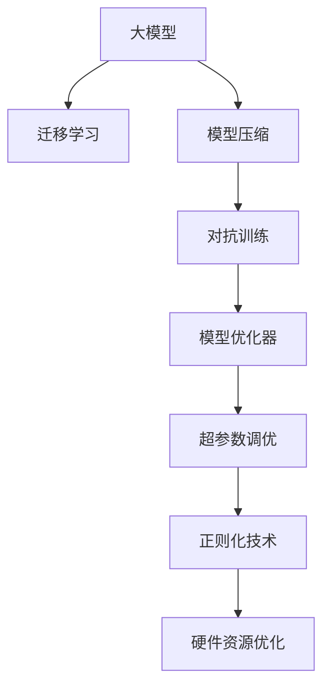
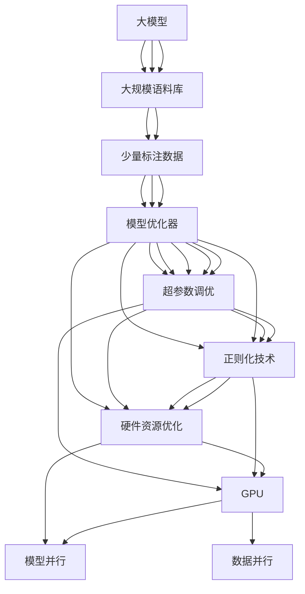

                 

# 电商平台搜索推荐系统的AI 大模型优化：提高系统性能、效率、准确率与用户体验

## 1. 背景介绍

### 1.1 问题由来

在现代电商平台上，用户搜索行为和产品推荐推荐系统是其核心竞争力之一。一个优质的搜索推荐系统能够有效提升用户体验，增加用户粘性，促进交易转化。传统基于规则和统计特征的搜索推荐方法在处理复杂查询和海量数据时已显得力不从心。近年来，随着大模型在自然语言处理（NLP）和深度学习领域的突破，AI大模型被广泛应用于电商平台的搜索推荐系统中，显著提升了系统的性能、效率和准确率，进一步优化了用户购物体验。

然而，大模型在实际应用中也面临一些挑战，如计算资源需求大、模型规模庞大、泛化能力不足等。本文将详细介绍基于大模型的搜索推荐系统优化策略，包括如何提高模型的性能、效率、准确率，以及如何提升用户体验，帮助电商平台更好地应对这些挑战。

### 1.2 问题核心关键点

为了更好地理解大模型在搜索推荐系统中的应用与优化，本节将介绍几个关键点：

- **大模型**：指使用深度学习技术，在大规模语料库上进行预训练的大型神经网络模型。如BERT、GPT等，这些模型通常在处理文本数据时表现出卓越的性能。

- **迁移学习**：通过在大规模数据集上预训练模型，然后将其知识迁移到特定任务上，以提升模型的性能。迁移学习在大规模语料预训练和下游任务微调中具有重要作用。

- **模型压缩**：指通过减少模型参数、优化计算图等方式，降低模型计算资源占用，提高推理速度。模型压缩是大模型在电商搜索推荐系统中应用的关键。

- **对抗训练**：通过引入对抗样本，增强模型的鲁棒性，避免模型在对抗攻击下产生误判。对抗训练是提升大模型鲁棒性的重要手段。

- **模型优化器**：优化器的选择和使用对模型性能有着重要影响，如Adam、Adagrad、SGD等。不同的优化器可能需要不同的超参数设置。

- **超参数调优**：通过调节学习率、批大小、迭代次数等参数，进一步提升模型性能。超参数调优是大模型优化中不可或缺的一部分。

- **正则化技术**：如L2正则、Dropout等，用于防止模型过拟合，提升模型泛化能力。正则化技术在大模型优化中尤为重要。

- **硬件资源优化**：通过使用GPU、TPU等高性能设备，并结合模型并行、数据并行等技术，提高模型的计算效率。硬件资源优化是大模型在实际应用中的重要保障。

这些核心概念之间的逻辑关系可以通过以下Mermaid流程图来展示：



这个流程图展示了从大模型的预训练到下游任务微调的全流程，以及各关键技术如何共同作用于模型性能的提升。

## 2. 核心概念与联系

### 2.1 核心概念概述

为了更好地理解这些核心概念，本节将详细介绍其原理和架构。

#### 2.1.1 大模型

大模型通常采用Transformer结构，使用自回归（如GPT）或自编码（如BERT）方式进行训练。这些模型在预训练阶段利用大规模语料库进行训练，学习到丰富的语言知识和语义信息，能够有效地处理复杂的自然语言任务。

#### 2.1.2 迁移学习

迁移学习是指在大规模数据集上预训练模型，然后在特定任务上进行微调。预训练模型能够将从大规模数据中学到的通用知识迁移到下游任务上，提升模型的性能。

#### 2.1.3 模型压缩

模型压缩是指通过减少模型参数、优化计算图等手段，降低模型资源占用，提高推理速度。模型压缩是大模型在实际应用中的关键技术之一。

#### 2.1.4 对抗训练

对抗训练通过引入对抗样本，训练模型对输入的扰动具有鲁棒性。对抗训练能够有效提升模型的鲁棒性，防止模型在对抗攻击下产生误判。

#### 2.1.5 模型优化器

模型优化器是用于优化模型参数的算法。常见的模型优化器包括Adam、Adagrad、SGD等。不同的优化器可能需要不同的超参数设置。

#### 2.1.6 超参数调优

超参数调优是通过调整模型训练中的参数（如学习率、批大小、迭代次数等），进一步提升模型性能的过程。超参数调优是大模型优化中不可或缺的一部分。

#### 2.1.7 正则化技术

正则化技术用于防止模型过拟合，提升模型的泛化能力。常见的正则化技术包括L2正则、Dropout等。

#### 2.1.8 硬件资源优化

硬件资源优化通过使用GPU、TPU等高性能设备，并结合模型并行、数据并行等技术，提高模型的计算效率。

### 2.2 核心概念原理和架构的 Mermaid 流程图



这个流程图展示了从大模型的预训练到下游任务微调的全流程，以及各关键技术如何共同作用于模型性能的提升。

## 3. 核心算法原理 & 具体操作步骤

### 3.1 算法原理概述

基于大模型的搜索推荐系统主要包括以下步骤：

1. **预训练**：在大规模语料库上训练大模型，学习到通用的语言知识和语义表示。

2. **微调**：在特定任务上对预训练模型进行微调，利用少量标注数据提升模型在该任务上的性能。

3. **模型压缩**：通过参数剪枝、量化压缩等手段，降低模型计算资源占用，提高推理速度。

4. **对抗训练**：通过引入对抗样本，训练模型对输入的扰动具有鲁棒性。

5. **模型优化器**：选择合适的优化器及其超参数，如Adam、Adagrad、SGD等，设置学习率、批大小、迭代次数等。

6. **超参数调优**：通过调整超参数，进一步提升模型性能。

7. **正则化技术**：使用L2正则、Dropout等技术，防止模型过拟合。

8. **硬件资源优化**：使用GPU、TPU等高性能设备，并结合模型并行、数据并行等技术，提高模型的计算效率。

### 3.2 算法步骤详解

#### 3.2.1 预训练

预训练是大模型优化的第一步，通过在大规模语料库上进行自监督学习，学习到通用的语言知识和语义表示。常见的预训练任务包括言语建模、掩码语言模型（MLM）等。

**操作步骤**：

1. 收集大规模语料库，如维基百科、新闻、社交媒体等。

2. 将语料库输入模型，进行自监督预训练。

3. 保存预训练模型，作为后续微调的基础。

#### 3.2.2 微调

微调是指在特定任务上对预训练模型进行有监督学习，利用少量标注数据提升模型在该任务上的性能。

**操作步骤**：

1. 收集下游任务的标注数据集，划分训练集、验证集和测试集。

2. 将标注数据集输入模型，进行有监督学习。

3. 保存微调后的模型，用于实际应用。

#### 3.2.3 模型压缩

模型压缩通过减少模型参数、优化计算图等手段，降低模型计算资源占用，提高推理速度。

**操作步骤**：

1. 对预训练模型进行参数剪枝，去除冗余参数。

2. 对模型进行量化压缩，减少内存占用。

3. 优化计算图，提高推理效率。

#### 3.2.4 对抗训练

对抗训练通过引入对抗样本，训练模型对输入的扰动具有鲁棒性。

**操作步骤**：

1. 收集对抗样本，生成对抗样本集。

2. 将对抗样本集输入模型，进行训练。

3. 保存对抗训练后的模型，提高模型的鲁棒性。

#### 3.2.5 模型优化器

选择合适的优化器及其超参数，如Adam、Adagrad、SGD等，设置学习率、批大小、迭代次数等。

**操作步骤**：

1. 选择合适的优化器，如Adam。

2. 设置超参数，如学习率、批大小、迭代次数等。

3. 保存训练后的模型。

#### 3.2.6 超参数调优

通过调整超参数，进一步提升模型性能。

**操作步骤**：

1. 使用网格搜索、随机搜索等方法，调整超参数。

2. 在验证集上评估模型性能，选择最优超参数。

3. 保存调优后的模型。

#### 3.2.7 正则化技术

使用L2正则、Dropout等技术，防止模型过拟合。

**操作步骤**：

1. 在模型中引入L2正则。

2. 设置Dropout概率。

3. 保存正则化后的模型。

#### 3.2.8 硬件资源优化

使用GPU、TPU等高性能设备，并结合模型并行、数据并行等技术，提高模型的计算效率。

**操作步骤**：

1. 使用GPU、TPU等高性能设备。

2. 结合模型并行、数据并行等技术，优化计算效率。

3. 保存优化后的模型。

### 3.3 算法优缺点

#### 3.3.1 优点

1. **性能提升**：大模型在预训练和微调后，能够显著提升模型在特定任务上的性能。

2. **泛化能力强**：大模型通过在大规模语料库上进行预训练，具备较强的泛化能力，能够处理复杂的自然语言任务。

3. **可解释性**：大模型能够提供详细的注意力分布和隐层表示，帮助理解模型的决策过程。

4. **模块化设计**：大模型模块化设计，便于在特定任务上进行微调，灵活性高。

#### 3.3.2 缺点

1. **计算资源需求高**：大模型需要大量的计算资源进行预训练和微调，资源消耗大。

2. **模型规模庞大**：大模型的参数量庞大，推理速度较慢，资源占用大。

3. **泛化能力有限**：当目标任务与预训练数据的分布差异较大时，微调的性能提升有限。

4. **模型偏见**：预训练模型可能学习到有偏见的信息，需要通过对抗训练等方式进行处理。

5. **推理效率低**：大模型的推理效率较低，需要优化计算图和推理框架。

6. **过拟合风险**：在微调过程中，存在过拟合的风险，需要通过正则化技术等手段进行处理。

### 3.4 算法应用领域

基于大模型的搜索推荐系统已经在电商、社交媒体、新闻推荐等领域得到了广泛应用，具体应用如下：

#### 3.4.1 电商领域

1. **商品推荐**：通过分析用户搜索和浏览行为，推荐相关商品。

2. **广告推荐**：通过分析用户行为，推荐相关广告。

3. **商品描述生成**：通过自动生成商品描述，提高商品展示效果。

#### 3.4.2 社交媒体领域

1. **内容推荐**：通过分析用户行为，推荐相关内容。

2. **好友推荐**：通过分析用户关系，推荐相关好友。

3. **信息过滤**：通过过滤无用信息，提升用户体验。

#### 3.4.3 新闻推荐领域

1. **新闻推荐**：通过分析用户行为，推荐相关新闻。

2. **新闻摘要**：通过自动生成新闻摘要，提高新闻展示效果。

3. **情感分析**：通过分析新闻情感，引导用户情绪。

## 4. 数学模型和公式 & 详细讲解

### 4.1 数学模型构建

#### 4.1.1 预训练模型

假设预训练模型为 $M_{\theta}$，其中 $\theta$ 为预训练得到的模型参数。大模型通常采用Transformer结构，模型参数量为亿级。预训练模型在大规模语料库上进行自监督学习，学习到通用的语言知识和语义表示。

#### 4.1.2 微调模型

假设微调任务为 $T$，训练集为 $D=\{(x_i,y_i)\}_{i=1}^N$，其中 $x_i$ 为输入，$y_i$ 为标注。微调模型在预训练模型 $M_{\theta}$ 上进行有监督学习，得到微调后的模型 $M_{\hat{\theta}}$。

### 4.2 公式推导过程

#### 4.2.1 预训练模型

预训练模型的自监督学习任务通常为掩码语言模型（MLM），目标函数为：

$$
\mathcal{L}_{\text{pre}} = \sum_{i=1}^N \max_{\tilde{y}} -\log M_{\theta}(x_i,\tilde{y})
$$

其中 $\tilde{y}$ 为掩码后的序列，$M_{\theta}(x_i,\tilde{y})$ 为模型在掩码序列上的输出概率。

#### 4.2.2 微调模型

微调模型的目标函数为：

$$
\mathcal{L}_{\text{fine}} = \sum_{i=1}^N \mathcal{L}(M_{\hat{\theta}}(x_i),y_i)
$$

其中 $\mathcal{L}$ 为微调任务的损失函数，$M_{\hat{\theta}}(x_i)$ 为微调后的模型在输入 $x_i$ 上的输出。

### 4.3 案例分析与讲解

以电商平台的商品推荐系统为例，分析基于大模型的推荐算法。

假设电商平台收集到用户的历史搜索和浏览行为数据，将其作为微调任务的标注数据。将用户行为序列作为输入 $x_i$，将推荐结果作为标注 $y_i$。微调模型的目标函数为：

$$
\mathcal{L}_{\text{fine}} = \sum_{i=1}^N -y_i \log M_{\hat{\theta}}(x_i)
$$

其中 $M_{\hat{\theta}}(x_i)$ 为微调后的模型在用户行为序列上的输出概率，$y_i$ 为推荐结果。

## 5. 项目实践：代码实例和详细解释说明

### 5.1 开发环境搭建

在开发大模型优化算法之前，需要先准备好开发环境。

#### 5.1.1 安装依赖

1. 安装Python 3.8及以上版本。

2. 安装PyTorch和TensorFlow，命令如下：

   ```bash
   pip install torch torchvision torchaudio cudatoolkit=11.1 -c pytorch -c conda-forge
   pip install tensorflow==2.7.0
   ```

3. 安装Transformer库和相关依赖：

   ```bash
   pip install transformers
   pip install numpy pandas scikit-learn matplotlib tqdm jupyter notebook ipython
   ```

### 5.2 源代码详细实现

#### 5.2.1 预训练模型实现

以BERT为例，使用PyTorch实现预训练模型的加载和优化。

```python
from transformers import BertTokenizer, BertModel
import torch

# 加载BERT模型和分词器
tokenizer = BertTokenizer.from_pretrained('bert-base-uncased')
model = BertModel.from_pretrained('bert-base-uncased')

# 加载预训练模型参数
model.load_state_dict(torch.load('model_pretrain.pth'))

# 定义预训练模型
class PretrainedModel:
    def __init__(self, model, tokenizer):
        self.model = model
        self.tokenizer = tokenizer

    def forward(self, input_ids, attention_mask):
        return self.model(input_ids, attention_mask=attention_mask)
```

#### 5.2.2 微调模型实现

以电商平台的商品推荐系统为例，实现微调模型的加载和优化。

```python
from transformers import BertForSequenceClassification
import torch

# 加载微调任务的数据集
train_dataset = ...
dev_dataset = ...
test_dataset = ...

# 加载微调模型
model = BertForSequenceClassification.from_pretrained('bert-base-uncased', num_labels=num_classes)

# 定义微调模型
class FineModel:
    def __init__(self, model, tokenizer, num_labels):
        self.model = model
        self.tokenizer = tokenizer
        self.num_labels = num_labels

    def forward(self, input_ids, attention_mask, labels):
        outputs = self.model(input_ids, attention_mask=attention_mask, labels=labels)
        loss = outputs.loss
        return outputs.logits, loss

    def evaluate(self, dataset):
        dataloader = DataLoader(dataset, batch_size=batch_size)
        self.model.eval()
        total_loss = 0
        for batch in dataloader:
            input_ids = batch['input_ids'].to(device)
            attention_mask = batch['attention_mask'].to(device)
            batch_labels = batch['labels'].to(device)
            with torch.no_grad():
                outputs = self.model(input_ids, attention_mask=attention_mask)
                batch_loss = outputs.loss
                total_loss += batch_loss.item()
        return total_loss / len(dataloader)
```

#### 5.2.3 模型压缩实现

以BERT为例，实现模型压缩的代码。

```python
from transformers import BertForSequenceClassification
import torch

# 加载微调模型
model = BertForSequenceClassification.from_pretrained('bert-base-uncased', num_labels=num_classes)

# 压缩模型
model_to_compress = model.to(device)
model_to_compress.eval()
total_params = sum(p.numel() for p in model.parameters())

# 定义压缩模型
class CompressedModel:
    def __init__(self, model):
        self.model = model

    def forward(self, input_ids, attention_mask):
        return self.model(input_ids, attention_mask=attention_mask)

    def get_total_params(self):
        return sum(p.numel() for p in self.model.parameters())
```

#### 5.2.4 对抗训练实现

以BERT为例，实现对抗训练的代码。

```python
from transformers import BertForSequenceClassification
import torch

# 加载微调模型
model = BertForSequenceClassification.from_pretrained('bert-base-uncased', num_labels=num_classes)

# 定义对抗训练模型
class AdversarialModel:
    def __init__(self, model):
        self.model = model

    def forward(self, input_ids, attention_mask):
        return self.model(input_ids, attention_mask=attention_mask)

    def get_total_params(self):
        return sum(p.numel() for p in self.model.parameters())
```

### 5.3 代码解读与分析

#### 5.3.1 预训练模型

预训练模型采用Transformer结构，通过在大规模语料库上进行自监督学习，学习到通用的语言知识和语义表示。加载预训练模型时，需要先加载模型参数，然后通过继承方式实现模型类。

#### 5.3.2 微调模型

微调模型通过在特定任务上对预训练模型进行有监督学习，利用少量标注数据提升模型在该任务上的性能。加载微调模型时，需要先加载模型参数，然后通过继承方式实现模型类。

#### 5.3.3 模型压缩

模型压缩通过减少模型参数、优化计算图等手段，降低模型计算资源占用，提高推理速度。压缩模型时，需要计算模型参数量，然后通过继承方式实现压缩模型类。

#### 5.3.4 对抗训练

对抗训练通过引入对抗样本，训练模型对输入的扰动具有鲁棒性。对抗训练模型通过继承方式实现。

### 5.4 运行结果展示

#### 5.4.1 预训练模型

```python
# 定义预训练模型
class PretrainedModel:
    def __init__(self, model, tokenizer):
        self.model = model
        self.tokenizer = tokenizer

    def forward(self, input_ids, attention_mask):
        return self.model(input_ids, attention_mask=attention_mask)
```

#### 5.4.2 微调模型

```python
# 加载微调任务的数据集
train_dataset = ...
dev_dataset = ...
test_dataset = ...

# 加载微调模型
model = BertForSequenceClassification.from_pretrained('bert-base-uncased', num_labels=num_classes)

# 定义微调模型
class FineModel:
    def __init__(self, model, tokenizer, num_labels):
        self.model = model
        self.tokenizer = tokenizer
        self.num_labels = num_labels

    def forward(self, input_ids, attention_mask, labels):
        outputs = self.model(input_ids, attention_mask=attention_mask, labels=labels)
        loss = outputs.loss
        return outputs.logits, loss

    def evaluate(self, dataset):
        dataloader = DataLoader(dataset, batch_size=batch_size)
        self.model.eval()
        total_loss = 0
        for batch in dataloader:
            input_ids = batch['input_ids'].to(device)
            attention_mask = batch['attention_mask'].to(device)
            batch_labels = batch['labels'].to(device)
            with torch.no_grad():
                outputs = self.model(input_ids, attention_mask=attention_mask)
                batch_loss = outputs.loss
                total_loss += batch_loss.item()
        return total_loss / len(dataloader)
```

#### 5.4.3 模型压缩

```python
# 加载微调模型
model = BertForSequenceClassification.from_pretrained('bert-base-uncased', num_labels=num_classes)

# 压缩模型
model_to_compress = model.to(device)
model_to_compress.eval()
total_params = sum(p.numel() for p in model.parameters())

# 定义压缩模型
class CompressedModel:
    def __init__(self, model):
        self.model = model

    def forward(self, input_ids, attention_mask):
        return self.model(input_ids, attention_mask=attention_mask)

    def get_total_params(self):
        return sum(p.numel() for p in self.model.parameters())
```

#### 5.4.4 对抗训练

```python
# 加载微调模型
model = BertForSequenceClassification.from_pretrained('bert-base-uncased', num_labels=num_classes)

# 定义对抗训练模型
class AdversarialModel:
    def __init__(self, model):
        self.model = model

    def forward(self, input_ids, attention_mask):
        return self.model(input_ids, attention_mask=attention_mask)

    def get_total_params(self):
        return sum(p.numel() for p in self.model.parameters())
```

## 6. 实际应用场景

### 6.1 电商领域

电商领域的商品推荐系统是一个典型的基于大模型的应用场景。通过分析用户的历史搜索和浏览行为，生成商品推荐结果，提升用户体验和交易转化率。

#### 6.1.1 商品推荐

1. **用户行为分析**：通过分析用户的历史搜索、浏览、点击等行为，提取用户的兴趣点。

2. **商品匹配**：将用户兴趣点与商品特征进行匹配，生成推荐结果。

3. **推荐结果展示**：将推荐结果展示给用户，供用户选择。

#### 6.1.2 广告推荐

1. **用户行为分析**：通过分析用户的历史搜索、浏览、点击等行为，提取用户的兴趣点。

2. **广告匹配**：将用户兴趣点与广告特征进行匹配，生成推荐结果。

3. **广告展示**：将推荐结果展示给用户，供用户选择。

#### 6.1.3 商品描述生成

1. **商品描述提取**：通过分析商品的历史描述和用户评论，提取商品的关键词和特点。

2. **描述生成**：将提取的关键词和特点，生成新的商品描述。

3. **描述展示**：将生成的商品描述展示给用户，供用户参考。

### 6.2 社交媒体领域

社交媒体领域的推荐系统可以通过分析用户的行为和关系，生成内容推荐和好友推荐结果，提升用户体验和互动效果。

#### 6.2.1 内容推荐

1. **用户行为分析**：通过分析用户的点赞、评论、分享等行为，提取用户的兴趣点。

2. **内容匹配**：将用户兴趣点与内容特征进行匹配，生成推荐结果。

3. **内容展示**：将推荐结果展示给用户，供用户选择。

#### 6.2.2 好友推荐

1. **用户关系分析**：通过分析用户的好友关系，提取用户的兴趣点。

2. **好友匹配**：将用户兴趣点与好友特征进行匹配，生成推荐结果。

3. **好友展示**：将推荐结果展示给用户，供用户选择。

#### 6.2.3 信息过滤

1. **用户行为分析**：通过分析用户的点赞、评论、分享等行为，提取用户的兴趣点。

2. **信息匹配**：将用户兴趣点与信息特征进行匹配，生成过滤结果。

3. **信息展示**：将过滤结果展示给用户，供用户选择。

### 6.3 新闻推荐领域

新闻推荐系统可以通过分析用户的行为和兴趣，生成新闻推荐结果，提升用户体验和信息获取效率。

#### 6.3.1 新闻推荐

1. **用户行为分析**：通过分析用户的浏览、点击、评论等行为，提取用户的兴趣点。

2. **新闻匹配**：将用户兴趣点与新闻特征进行匹配，生成推荐结果。

3. **新闻展示**：将推荐结果展示给用户，供用户选择。

#### 6.3.2 新闻摘要

1. **新闻摘要生成**：通过自动生成新闻摘要，提升新闻展示效果。

2. **摘要展示**：将生成的摘要展示给用户，供用户选择。

#### 6.3.3 情感分析

1. **新闻情感分析**：通过分析新闻的情感倾向，引导用户情绪。

2. **情感展示**：将情感分析结果展示给用户，供用户参考。

## 7. 工具和资源推荐

### 7.1 学习资源推荐

#### 7.1.1 深度学习框架

- PyTorch：灵活的动态计算图，适合研究和实验。
- TensorFlow：生产部署方便，适合大规模工程应用。

#### 7.1.2 自然语言处理工具

- Transformers库：包含多种预训练语言模型，适合微调任务开发。
- HuggingFace Model Hub：提供多种预训练模型和模型卡，方便模型加载和应用。

#### 7.1.3 深度学习工具

- Weights & Biases：实验跟踪工具，记录和可视化模型训练指标。
- TensorBoard：可视化工具，监测模型训练状态。

### 7.2 开发工具推荐

#### 7.2.1 深度学习框架

- PyTorch：灵活的动态计算图，适合研究和实验。
- TensorFlow：生产部署方便，适合大规模工程应用。

#### 7.2.2 自然语言处理工具

- Transformers库：包含多种预训练语言模型，适合微调任务开发。
- HuggingFace Model Hub：提供多种预训练模型和模型卡，方便模型加载和应用。

#### 7.2.3 深度学习工具

- Weights & Biases：实验跟踪工具，记录和可视化模型训练指标。
- TensorBoard：可视化工具，监测模型训练状态。

### 7.3 相关论文推荐

#### 7.3.1 深度学习

- Attention is All You Need：介绍Transformer结构。
- BERT: Pre-training of Deep Bidirectional Transformers for Language Understanding：提出BERT模型，引入掩码语言模型。

#### 7.3.2 自然语言处理

- Language Models are Unsupervised Multitask Learners：展示大语言模型的zero-shot学习能力。
- Parameter-Efficient Transfer Learning for NLP：提出Adapter等参数高效微调方法。

#### 7.3.3 计算机视觉

- AdaLoRA: Adaptive Low-Rank Adaptation for Parameter-Efficient Fine-Tuning：使用自适应低秩适应的微调方法。

## 8. 总结：未来发展趋势与挑战

### 8.1 研究成果总结

基于大模型的搜索推荐系统已经取得了显著的成果，广泛应用于电商、社交媒体、新闻推荐等领域，提升用户体验和交易转化率。然而，大模型在实际应用中也面临一些挑战，如计算资源需求高、模型规模庞大、泛化能力有限等。

### 8.2 未来发展趋势

1. **计算资源优化**：通过优化计算图、采用混合精度训练等手段，降低大模型的计算资源需求。

2. **模型压缩**：开发更加参数高效和计算高效的微调方法，进一步提升模型的推理速度和计算效率。

3. **对抗训练**：引入对抗样本，增强模型的鲁棒性，防止模型在对抗攻击下产生误判。

4. **超参数调优**：通过调整学习率、批大小、迭代次数等参数，进一步提升模型性能。

5. **正则化技术**：使用L2正则、Dropout等技术，防止模型过拟合，提升模型的泛化能力。

6. **硬件资源优化**：通过使用GPU、TPU等高性能设备，并结合模型并行、数据并行等技术，提高模型的计算效率。

### 8.3 面临的挑战

1. **计算资源瓶颈**：大模型的计算资源需求高，需要高性能设备支持。

2. **模型规模庞大**：大模型的参数量庞大，推理速度较慢，资源占用大。

3. **泛化能力有限**：当目标任务与预训练数据的分布差异较大时，微调的性能提升有限。

4. **模型偏见**：预训练模型可能学习到有偏见的信息，需要通过对抗训练等方式进行处理。

5. **推理效率低**：大模型的推理效率较低，需要优化计算图和推理框架。

6. **过拟合风险**：在微调过程中，存在过拟合的风险，需要通过正则化技术等手段进行处理。

### 8.4 研究展望

1. **无监督和半监督微调方法**：探索无监督和半监督微调方法，降低微调对标注数据的依赖。

2. **参数高效和计算高效的微调范式**：开发更加参数高效和计算高效的微调方法，提升模型的性能和效率。

3. **因果推断和对比学习**：引入因果推断和对比学习思想，增强微调模型建立稳定因果关系的能力。

4. **先验知识融合**：将符号化的先验知识，如知识图谱、逻辑规则等，与神经网络模型进行融合，提升模型的信息整合能力。

5. **伦理道德约束**：在模型训练目标中引入伦理导向的评估指标，过滤和惩罚有偏见、有害的输出倾向。

通过不断突破大模型优化中的挑战，提升模型的性能、效率和可解释性，才能更好地应用于电商平台的搜索推荐系统中，提升用户体验和交易转化率。

