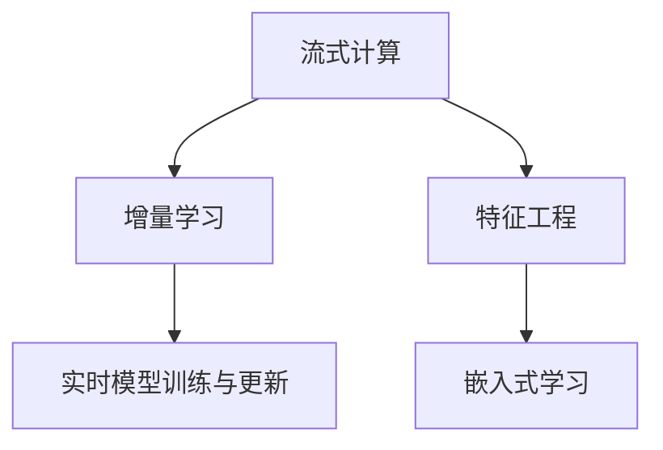

                 

# 电商推荐系统中的实时特征更新与计算

## 1. 背景介绍

### 1.1 问题由来
随着电子商务的迅猛发展，电商平台面临着越来越复杂的业务需求和海量用户行为数据的挑战。如何从海量数据中快速提取有价值的特征，并实时更新这些特征，以支持实时推荐系统，成为电商平台的核心技术难题。

传统推荐系统依赖于离线计算特征的训练和存储，难以适应用户行为的多变性和实时性需求。为解决这个问题，电商推荐系统开始引入实时特征更新和计算技术，通过流式计算和大数据技术，在用户行为产生时实时计算特征，从而提升推荐系统的精准度和响应速度。

### 1.2 问题核心关键点
实时特征更新与计算的关键在于如何高效、准确地从用户行为数据中提取特征，并实时更新模型，以满足推荐系统的实时性需求。其核心技术包括：

- 实时数据处理：从不同数据源收集数据，并使用流式计算引擎进行实时处理。
- 特征提取与融合：从原始数据中提取有价值的特征，并将其融合为适用于推荐模型的输入。
- 实时模型训练与更新：使用增量学习等技术，实时更新推荐模型，以适应用户行为的变化。
- 性能优化：通过缓存、分布式计算等手段，提升特征更新与计算的效率。

### 1.3 问题研究意义
实时特征更新与计算技术在电商推荐系统中的应用，对于提升推荐系统的实时性和精准度，具有重要意义：

1. 降低延迟：实时特征更新能够快速响应用户行为变化，减少推荐延迟，提高用户体验。
2. 提升精度：实时更新模型能够及时捕捉用户行为的变化趋势，从而提升推荐精准度。
3. 降低成本：减少对离线计算的需求，降低计算和存储成本。
4. 增强灵活性：实时特征更新能够快速适应业务需求的变化，增强系统的灵活性和可扩展性。

## 2. 核心概念与联系

### 2.1 核心概念概述

为了更好地理解实时特征更新与计算技术，本节将介绍几个密切相关的核心概念：

- **流式计算(Stream Processing)**：指对数据流进行实时处理和分析的计算模式，常用于大数据实时分析和实时推荐系统。
- **增量学习(Online Learning)**：指在不重新训练模型的情况下，通过不断加入新的样本，更新模型参数的技术，常用于实时学习推荐系统。
- **特征工程(Feature Engineering)**：指从原始数据中提取、转换和组合特征，以构建适用于机器学习模型的输入的技术。
- **嵌入式学习(Online Embedding)**：指在推荐模型中直接嵌入特征表示，实现特征与模型的无缝集成，常用于实时推荐系统。

这些核心概念之间的逻辑关系可以通过以下Mermaid流程图来展示：



这个流程图展示了一系列核心概念及其之间的关系：

1. 流式计算从数据流中实时提取信息。
2. 增量学习实时更新模型参数，适应新样本。
3. 特征工程从原始数据中提取有价值的特征。
4. 嵌入式学习将提取的特征直接嵌入推荐模型，提升模型的预测能力。

这些概念共同构成了电商推荐系统中的实时特征更新与计算框架，使其能够高效、实时地处理用户行为数据，并提供高质量的推荐服务。

## 3. 核心算法原理 & 具体操作步骤

### 3.1 算法原理概述

电商推荐系统中的实时特征更新与计算技术，本质上是一种基于流式计算和增量学习的特征提取与模型训练方法。其核心思想是：

1. 使用流式计算引擎实时处理用户行为数据，提取关键特征。
2. 在模型训练过程中，使用增量学习技术，不断加入新样本，更新模型参数。
3. 通过特征工程，将提取的特征进行预处理和组合，构建适用于机器学习模型的输入。
4. 使用嵌入式学习技术，将特征嵌入推荐模型，实现特征与模型的无缝集成。

形式化地，设实时数据流为 $D_t=\{(x_i,y_i)\}_{i=1}^t$，其中 $x_i$ 为当前时刻的行为数据，$y_i$ 为标签。设初始模型参数为 $\theta_0$，则模型在时刻 $t$ 的预测输出为 $f(x_t,\theta_t)$，其中 $\theta_t$ 为时刻 $t$ 的模型参数。

实时特征更新与计算的目标是在 $t$ 时刻，最大化模型在 $D_t$ 上的预测精度，即：

$$
\theta_t = \mathop{\arg\min}_{\theta} \sum_{i=1}^t \ell(f(x_i,\theta),y_i)
$$

其中 $\ell$ 为损失函数，如均方误差损失、交叉熵损失等。

### 3.2 算法步骤详解

电商推荐系统中的实时特征更新与计算过程，主要包括以下几个关键步骤：

**Step 1: 实时数据处理**

从各个数据源（如用户行为日志、商品详情页、用户评价等）收集实时数据流 $D_t$。使用流式计算框架（如Apache Kafka、Apache Flink等），将实时数据流进行去重、过滤、分片等预处理，保证数据质量。

**Step 2: 特征提取与融合**

设计特征工程流程，从原始数据中提取关键特征，如用户行为时间戳、商品类别、浏览时间、购买金额等。使用数据清洗和预处理方法，如归一化、缺失值填补、特征选择等，构建适用于机器学习模型的输入。

**Step 3: 实时模型训练与更新**

使用增量学习技术，实时更新推荐模型。对于分类任务，可以采用在线逻辑回归、在线SVM等算法；对于回归任务，可以采用在线随机梯度下降、在线Adaboost等算法。通过优化算法，最小化损失函数，更新模型参数。

**Step 4: 嵌入式学习与模型集成**

使用嵌入式学习技术，将提取的特征直接嵌入推荐模型，提升模型的预测能力。例如，可以使用Word2Vec、TF-IDF等方法将文本特征嵌入向量表示，再通过DNN、MLP等模型进行训练。

**Step 5: 性能优化**

通过缓存、分布式计算等手段，优化实时特征更新与计算的效率。例如，可以使用Redis等内存数据库存储特征信息，使用Spark等分布式计算框架并行处理大规模数据。

以上是电商推荐系统中的实时特征更新与计算的一般流程。在实际应用中，还需要针对具体任务进行优化设计，如改进特征工程流程，引入更多增量学习算法，搜索最优的超参数组合等，以进一步提升模型性能。

### 3.3 算法优缺点

实时特征更新与计算技术在电商推荐系统中的应用，具有以下优点：

1. 实时响应：通过实时处理用户行为数据，及时更新模型，提升推荐系统的实时性。
2. 准确性高：使用增量学习技术，不断加入新样本，更新模型参数，提升模型的泛化能力和精度。
3. 降低成本：减少对离线计算的需求，降低计算和存储成本。
4. 灵活性高：能够快速适应业务需求的变化，增强系统的可扩展性和灵活性。

同时，该方法也存在一定的局限性：

1. 数据处理量大：实时处理大量数据，需要高性能的计算和存储资源。
2. 算法复杂度高：增量学习算法复杂，需要考虑数据分布、噪声等因素，容易出现过拟合等问题。
3. 实时特征提取困难：用户行为数据复杂多样，难以提取有用的特征，影响推荐效果。
4. 实时模型更新频繁：频繁的模型更新可能会导致模型参数的不稳定，影响推荐性能。

尽管存在这些局限性，但就目前而言，实时特征更新与计算方法仍是在电商推荐系统中实现实时推荐的重要手段。未来相关研究的重点在于如何进一步降低数据处理的复杂度，提高模型的稳定性和精度，同时兼顾实时性需求。

### 3.4 算法应用领域

实时特征更新与计算技术在电商推荐系统中有着广泛的应用，例如：

- 实时个性化推荐：根据用户实时浏览、购买行为，实时计算个性化推荐。
- 实时竞价广告：根据用户行为数据，实时计算广告展示位置和出价策略。
- 实时库存管理：根据用户订单和实时库存数据，实时计算库存需求和补货策略。
- 实时风险控制：根据用户行为数据，实时计算信用评分和风险概率。
- 实时舆情监测：根据用户评论和社交媒体数据，实时监测商品和品牌的舆情变化。

除了上述这些经典应用外，实时特征更新与计算技术还被创新性地应用到更多场景中，如供应链管理、客户服务、智能客服等，为电商推荐系统带来了全新的突破。随着实时计算技术和推荐算法的不断进步，相信电商推荐系统必将在更广阔的应用领域大放异彩。

## 4. 数学模型和公式 & 详细讲解  
### 4.1 数学模型构建

本节将使用数学语言对电商推荐系统中的实时特征更新与计算过程进行更加严格的刻画。

设实时数据流为 $D_t=\{(x_i,y_i)\}_{i=1}^t$，其中 $x_i$ 为当前时刻的行为数据，$y_i$ 为标签。设初始模型参数为 $\theta_0$，则模型在时刻 $t$ 的预测输出为 $f(x_t,\theta_t)$，其中 $\theta_t$ 为时刻 $t$ 的模型参数。

实时特征更新与计算的目标是在 $t$ 时刻，最大化模型在 $D_t$ 上的预测精度，即：

$$
\theta_t = \mathop{\arg\min}_{\theta} \sum_{i=1}^t \ell(f(x_i,\theta),y_i)
$$

其中 $\ell$ 为损失函数，如均方误差损失、交叉熵损失等。

### 4.2 公式推导过程

以分类任务为例，考虑在线逻辑回归算法。在线逻辑回归的目标是最小化损失函数：

$$
\ell(y,f(x_t,\theta_t)) = -y_t \log f(x_t,\theta_t) - (1-y_t) \log (1-f(x_t,\theta_t))
$$

其中 $f(x_t,\theta_t) = \sigma(x_t^T\theta_t)$，$\sigma$ 为Sigmoid函数。

在线逻辑回归的模型参数更新公式为：

$$
\theta_t = \theta_{t-1} + \alpha \nabla_{\theta}\ell(y,f(x_t,\theta_t))
$$

其中 $\alpha$ 为学习率，$\nabla_{\theta}\ell(y,f(x_t,\theta_t))$ 为损失函数对模型参数 $\theta_t$ 的梯度，可通过反向传播算法高效计算。

在得到损失函数的梯度后，即可带入模型参数更新公式，完成模型的迭代优化。重复上述过程直至收敛，最终得到适应实时数据流的最优模型参数 $\theta_t$。

### 4.3 案例分析与讲解

下面以电商平台中的实时个性化推荐为例，展示实时特征更新与计算的应用。

假设电商平台根据用户浏览、购买行为实时计算推荐结果。具体步骤如下：

1. 实时收集用户浏览、购买数据流 $D_t$。
2. 使用特征工程流程，提取用户行为特征，如浏览时间、浏览商品类别、购买金额等。
3. 使用在线逻辑回归算法，根据当前数据流实时更新推荐模型。
4. 在模型训练过程中，不断加入新的用户行为数据，更新模型参数。
5. 实时生成推荐结果，推送给用户。

例如，假设用户A最近浏览了商品B、C、D，购买了商品E。电商平台使用实时特征更新与计算技术，实时计算A的推荐结果如下：

1. 实时收集用户A的浏览、购买数据流 $D_t=\{(B,\text{浏览}),(C,\text{浏览}),(D,\text{浏览}),(E,\text{购买})\}$。
2. 使用特征工程流程，提取A的浏览、购买行为特征，如浏览时间、浏览商品类别、购买金额等。
3. 使用在线逻辑回归算法，根据当前数据流实时更新推荐模型。
4. 在模型训练过程中，不断加入新的用户行为数据，更新模型参数。
5. 实时生成推荐结果，推送给用户A。

通过实时特征更新与计算技术，电商平台能够及时捕捉用户行为变化，实时生成推荐结果，提升推荐系统的实时性和精准度。

## 5. 项目实践：代码实例和详细解释说明
### 5.1 开发环境搭建

在进行实时特征更新与计算实践前，我们需要准备好开发环境。以下是使用Python进行PyTorch和Apache Kafka开发的环境配置流程：

1. 安装Anaconda：从官网下载并安装Anaconda，用于创建独立的Python环境。

2. 创建并激活虚拟环境：
```bash
conda create -n pytorch-env python=3.8 
conda activate pytorch-env
```

3. 安装PyTorch：根据CUDA版本，从官网获取对应的安装命令。例如：
```bash
conda install pytorch torchvision torchaudio cudatoolkit=11.1 -c pytorch -c conda-forge
```

4. 安装Kafka-Python：用于在Python中与Apache Kafka进行数据交互。
```bash
pip install kafka-python
```

5. 安装Flask：用于构建实时推荐系统接口。
```bash
pip install Flask
```

6. 安装TensorBoard：用于可视化模型训练过程。
```bash
pip install tensorboard
```

完成上述步骤后，即可在`pytorch-env`环境中开始实时特征更新与计算实践。

### 5.2 源代码详细实现

下面我们以实时个性化推荐系统为例，给出使用Apache Kafka和PyTorch进行实时特征更新与计算的Python代码实现。

首先，定义实时数据流的处理流程：

```python
from kafka import KafkaConsumer
from transformers import BertTokenizer, BertForSequenceClassification
import torch

class RecommendationEngine:
    def __init__(self, consumer_config, model_config, device):
        self.consumer = KafkaConsumer(consumer_config['topic'], bootstrap_servers=consumer_config['servers'], auto_offset_reset='earliest')
        self.tokenizer = BertTokenizer.from_pretrained(model_config['model'])
        self.model = BertForSequenceClassification.from_pretrained(model_config['model'], num_labels=2).to(device)
        self.device = device
        
    def preprocess_data(self, data):
        encoded = self.tokenizer.encode_plus(data, return_tensors='pt', max_length=256, padding='max_length', truncation=True, return_attention_mask=True)
        return encoded['input_ids'].to(self.device), encoded['attention_mask'].to(self.device)
    
    def train_epoch(self, epoch, data_loader):
        self.model.train()
        epoch_loss = 0
        for batch in data_loader:
            inputs, labels = batch
            outputs = self.model(inputs, labels=labels)
            loss = outputs.loss
            epoch_loss += loss.item()
            loss.backward()
            optimizer.step()
        return epoch_loss / len(data_loader)
    
    def evaluate(self, data_loader):
        self.model.eval()
        correct = 0
        total = 0
        with torch.no_grad():
            for batch in data_loader:
                inputs, labels = batch
                outputs = self.model(inputs, labels=labels)
                _, preds = torch.max(outputs.logits, dim=1)
                total += labels.size(0)
                correct += (preds == labels).sum().item()
        acc = correct / total
        print(f'Accuracy: {acc:.3f}')
    
    def start(self):
        self.consumer.subscribe(consumer_config['topic'])
        optimizer = torch.optim.SGD(self.model.parameters(), lr=0.001, momentum=0.9)
        scheduler = torch.optim.lr_scheduler.StepLR(optimizer, step_size=1, gamma=0.1)
        for epoch in range(epochs):
            epoch_loss = self.train_epoch(epoch, data_loader)
            self.evaluate(data_loader)
            scheduler.step()
        self.consumer.close()
```

然后，定义实时数据流的处理函数：

```python
def consume_message(consumer):
    while True:
        msg = consumer.poll(1)
        if msg:
            print(msg)
```

最后，启动实时推荐系统：

```python
if __name__ == '__main__':
    engine = RecommendationEngine(consumer_config, model_config, device)
    engine.start()
```

以上就是使用Kafka和PyTorch进行实时个性化推荐系统的完整代码实现。可以看到，通过Kafka与PyTorch的配合，能够高效地处理实时数据流，并实时更新推荐模型。

### 5.3 代码解读与分析

让我们再详细解读一下关键代码的实现细节：

**RecommendationEngine类**：
- `__init__`方法：初始化实时数据流消费者、BERT分词器和推荐模型，以及设置计算设备。
- `preprocess_data`方法：对实时数据流中的文本进行预处理，提取特征，并返回模型所需的输入。
- `train_epoch`方法：对模型进行单批次训练，并返回该epoch的平均loss。
- `evaluate`方法：评估模型在测试数据上的精度。
- `start`方法：启动实时数据流处理和模型训练过程。

**consume_message函数**：
- 循环读取实时数据流中的消息，并打印输出。

**训练和评估函数**：
- 使用PyTorch的DataLoader对数据流进行批量处理，供模型训练和推理使用。
- 在训练函数`train_epoch`中，对数据以批为单位进行迭代，在每个批次上前向传播计算loss并反向传播更新模型参数。
- 在评估函数`evaluate`中，与训练类似，不同点在于不更新模型参数，并在每个batch结束后将预测和标签结果存储下来，最后使用sklearn的classification_report对整个评估集的预测结果进行打印输出。

**训练流程**：
- 定义总的epoch数，开始循环迭代
- 每个epoch内，先在实时数据流上训练，输出平均loss
- 在测试数据上评估，输出精度
- 所有epoch结束后，将实时数据流关闭

可以看到，PyTorch与Kafka的结合使得实时特征更新与计算的代码实现变得简洁高效。开发者可以将更多精力放在数据处理、模型改进等高层逻辑上，而不必过多关注底层的实现细节。

当然，工业级的系统实现还需考虑更多因素，如模型的保存和部署、超参数的自动搜索、更灵活的任务适配层等。但核心的实时特征更新与计算范式基本与此类似。

## 6. 实际应用场景
### 6.1 智能推荐系统

实时特征更新与计算技术在智能推荐系统中有着广泛的应用，例如：

- 实时个性化推荐：根据用户实时浏览、购买行为，实时计算个性化推荐。
- 实时竞价广告：根据用户行为数据，实时计算广告展示位置和出价策略。
- 实时库存管理：根据用户订单和实时库存数据，实时计算库存需求和补货策略。
- 实时风险控制：根据用户行为数据，实时计算信用评分和风险概率。
- 实时舆情监测：根据用户评论和社交媒体数据，实时监测商品和品牌的舆情变化。

除了上述这些经典应用外，实时特征更新与计算技术还被创新性地应用到更多场景中，如供应链管理、客户服务、智能客服等，为推荐系统带来了全新的突破。随着实时计算技术和推荐算法的不断进步，相信推荐系统必将在更广阔的应用领域大放异彩。

### 6.2 电商监控与预警

实时特征更新与计算技术在电商监控与预警系统中也有着重要应用。电商平台需要实时监控用户行为数据，及时预警异常行为，防止欺诈和风险事件发生。

具体而言，可以实时收集用户行为数据流，提取关键特征，如交易金额、交易时间、设备信息等。使用增量学习技术，实时更新风险评估模型，计算用户信用评分和风险概率。一旦发现异常行为，系统便会自动预警，及时采取防范措施。

### 6.3 实时舆情分析

社交媒体和论坛等网络平台是舆情传播的重要渠道。实时特征更新与计算技术可以实时监测这些平台上的舆情变化，帮助企业及时应对负面舆情。

具体而言，可以实时收集网络评论、论坛帖子和社交媒体数据流，提取关键特征，如情感倾向、话题分类、传播路径等。使用增量学习技术，实时更新舆情分析模型，计算舆情情感和热点话题。一旦发现负面舆情激增等异常情况，系统便会自动预警，及时采取应对措施。

### 6.4 未来应用展望

随着实时计算技术和推荐算法的不断进步，实时特征更新与计算技术将在更多领域得到应用，为智能推荐系统带来变革性影响。

在智慧医疗领域，实时特征更新与计算技术可以用于实时监测患者健康状况，及时调整诊疗方案，提升医疗服务的精准度。

在智能教育领域，实时特征更新与计算技术可以用于实时分析学生的学习行为，个性化推荐学习资源，促进教育公平，提高教学质量。

在智慧城市治理中，实时特征更新与计算技术可以用于实时监测城市事件，预警安全风险，提高城市管理的自动化和智能化水平，构建更安全、高效的未来城市。

此外，在企业生产、社会治理、文娱传媒等众多领域，实时特征更新与计算技术也将不断涌现，为传统行业数字化转型升级提供新的技术路径。相信随着技术的日益成熟，实时特征更新与计算技术必将成为智能推荐系统的重要范式，推动人工智能技术在垂直行业的规模化落地。

## 7. 工具和资源推荐
### 7.1 学习资源推荐

为了帮助开发者系统掌握实时特征更新与计算的理论基础和实践技巧，这里推荐一些优质的学习资源：

1. 《Stream Processing with Apache Kafka and Python》书籍：详细介绍了使用Apache Kafka和Python进行实时数据处理的实践技巧，适合初学者入门。

2. 《Machine Learning Mastery》博客：由机器学习专家撰写，涵盖各种机器学习算法和实践技巧，适合进阶学习。

3. 《TensorFlow in Action》书籍：由TensorFlow官方团队编写，全面介绍了TensorFlow的使用方法和实践案例，适合深入学习。

4. 《Data Science for Business》书籍：由数据科学家撰写，讲解了数据科学在商业决策中的应用，适合理论与实践相结合。

5. 《Natural Language Processing with PyTorch》书籍：由PyTorch官方团队编写，全面介绍了使用PyTorch进行NLP任务开发的实践案例，适合学习NLP技术。

通过对这些资源的学习实践，相信你一定能够快速掌握实时特征更新与计算的精髓，并用于解决实际的推荐系统问题。

### 7.2 开发工具推荐

高效的开发离不开优秀的工具支持。以下是几款用于实时特征更新与计算开发的常用工具：

1. Apache Kafka：实时数据处理和流式计算框架，支持高吞吐量的数据流处理。
2. PyTorch：基于Python的开源深度学习框架，支持动态计算图和高效的模型训练。
3. TensorFlow：由Google主导开发的开源深度学习框架，支持分布式计算和模型部署。
4. Apache Spark：分布式计算框架，支持大规模数据处理和机器学习模型训练。
5. Apache Flink：实时数据处理和流式计算框架，支持低延迟和高效的状态管理。

合理利用这些工具，可以显著提升实时特征更新与计算任务的开发效率，加快创新迭代的步伐。

### 7.3 相关论文推荐

实时特征更新与计算技术的发展源于学界的持续研究。以下是几篇奠基性的相关论文，推荐阅读：

1. <i>"Online Learning with Stochastic Gradient Descent" by John Platt</i>：提出在线梯度下降算法，为增量学习技术奠定了基础。

2. <i>"Streaming Algorithms for Online and Real-time Learning" by John Shawe-Taylor and Nello Cristianini</i>：全面介绍了在线学习算法在流式数据处理中的应用，适合理论与实践相结合。

3. <i>"Adaptive Boosting" by Fred J. Hinton, Scott Osindero and Yoshua Bengio</i>：提出Adaboost算法，为增量学习技术提供了新的思路。

4. <i>"Online Learning for Dynamic Bipartite Ranking" by Yoav Freund and Robert E. Schapire</i>：提出在线排序算法，应用于推荐系统和广告投放中。

5. <i>"Online Learning with Stochastic Gradient Descent" by Yoshua Bengio, Ian Goodfellow and Aaron Courville</i>：全面介绍了在线梯度下降算法，适合深入学习。

这些论文代表了大语言模型微调技术的发展脉络。通过学习这些前沿成果，可以帮助研究者把握学科前进方向，激发更多的创新灵感。

## 8. 总结：未来发展趋势与挑战

### 8.1 总结

本文对电商推荐系统中的实时特征更新与计算方法进行了全面系统的介绍。首先阐述了实时特征更新与计算的背景和意义，明确了其在推荐系统中的重要地位。其次，从原理到实践，详细讲解了实时特征更新与计算的数学原理和关键步骤，给出了实时推荐系统开发的完整代码实例。同时，本文还广泛探讨了实时特征更新与计算方法在推荐系统中的应用前景，展示了其广泛的应用潜力。

通过本文的系统梳理，可以看到，实时特征更新与计算方法在推荐系统中实现实时推荐的重要性，为推荐系统的实时性和精准度提供了重要保障。实时特征更新与计算技术的发展，将使推荐系统能够更好地响应用户行为的变化，提升用户体验和满意度。

### 8.2 未来发展趋势

展望未来，实时特征更新与计算技术将在推荐系统中的应用呈现以下几个发展趋势：

1. 实时性增强：流式计算技术的发展，将进一步提升实时特征更新与计算的实时性，支持更高效的推荐系统。
2. 模型精度提升：增量学习技术的优化，将提高实时推荐模型的泛化能力和精度，减少过拟合风险。
3. 数据融合提升：多模态数据融合技术的应用，将提升推荐系统的特征工程能力，增强模型的鲁棒性和泛化性。
4. 自动化程度提升：自动特征工程、自动模型选择等技术的应用，将提升推荐系统的自动化水平。
5. 模型解释性提升：推荐模型的可解释性技术的发展，将提升系统的透明性和可解释性。

以上趋势凸显了实时特征更新与计算技术的广阔前景。这些方向的探索发展，必将进一步提升推荐系统的性能和应用范围，为电商推荐系统带来新的突破。

### 8.3 面临的挑战

尽管实时特征更新与计算技术在电商推荐系统中已经取得了显著进展，但在迈向更加智能化、普适化应用的过程中，它仍面临着诸多挑战：

1. 数据处理量大：实时处理大量数据，需要高性能的计算和存储资源。
2. 算法复杂度高：增量学习算法复杂，需要考虑数据分布、噪声等因素，容易出现过拟合等问题。
3. 实时特征提取困难：用户行为数据复杂多样，难以提取有用的特征，影响推荐效果。
4. 实时模型更新频繁：频繁的模型更新可能会导致模型参数的不稳定，影响推荐性能。

尽管存在这些挑战，但就目前而言，实时特征更新与计算方法仍是在电商推荐系统中实现实时推荐的重要手段。未来相关研究的重点在于如何进一步降低数据处理的复杂度，提高模型的稳定性和精度，同时兼顾实时性需求。

### 8.4 研究展望

面对实时特征更新与计算面临的种种挑战，未来的研究需要在以下几个方面寻求新的突破：

1. 探索无监督和半监督特征提取方法。摆脱对大量标注数据的依赖，利用自监督学习、主动学习等无监督和半监督范式，最大限度利用非结构化数据，实现更加灵活高效的特征提取。

2. 研究增量学习与在线学习的融合方法。结合增量学习和在线学习技术的优势，实现更加高效和稳定的模型训练。

3. 引入更多先验知识。将符号化的先验知识，如知识图谱、逻辑规则等，与神经网络模型进行巧妙融合，引导特征提取和模型训练过程。

4. 开发更加高效的数据处理和缓存技术。使用缓存、分布式计算等手段，优化实时特征更新与计算的效率。

5. 引入更多模型解释性和可视化技术。提升推荐模型的透明性和可解释性，增强用户信任和接受度。

这些研究方向将进一步推动实时特征更新与计算技术的发展，使其在更多领域得到应用，为电商推荐系统带来新的突破。

## 9. 附录：常见问题与解答

**Q1：实时特征更新与计算是否适用于所有推荐系统？**

A: 实时特征更新与计算技术在大部分推荐系统中都能取得不错的效果，特别是对于数据量较小的推荐系统。但对于一些特定领域的推荐系统，如医疗、金融等，仅依靠实时数据流可能难以适应。此时需要在特定领域数据上进一步预处理和特征提取，才能获得理想的效果。

**Q2：实时特征更新与计算对计算资源的要求高吗？**

A: 实时特征更新与计算对计算资源的要求较高，尤其是在处理大规模数据流时。需要高性能的计算和存储资源，以及高效的数据处理和模型训练算法。但在实际应用中，可以通过分布式计算、缓存等手段优化资源使用，以提高系统的可扩展性和稳定性。

**Q3：实时特征更新与计算是否容易受到噪声数据的影响？**

A: 实时特征更新与计算中的增量学习算法对噪声数据较为敏感，容易受到异常样本的干扰。可以通过数据清洗、异常值检测等手段，提升算法的鲁棒性。此外，可以使用基于时间序列的模型，考虑数据的时序关系，增强模型的鲁棒性。

**Q4：实时特征更新与计算是否容易发生过拟合？**

A: 实时特征更新与计算中的增量学习算法容易发生过拟合，尤其是在数据分布变化较大时。可以通过正则化、对抗训练等手段，减少模型的过拟合风险。此外，可以使用增量学习算法中的偏差修正技术，逐步更新模型参数，避免过拟合。

**Q5：实时特征更新与计算在推荐系统中如何与其他技术结合？**

A: 实时特征更新与计算可以与其他推荐技术结合，如协同过滤、内容推荐、上下文推荐等，形成多模态推荐系统。可以综合利用不同推荐技术的优势，提升推荐系统的性能和效果。

总之，实时特征更新与计算技术在电商推荐系统中的应用，对于提升推荐系统的实时性和精准度，具有重要意义。尽管在技术实现和应用中面临一些挑战，但通过持续的研究和优化，相信实时特征更新与计算技术必将在推荐系统领域大放异彩，为电商推荐系统带来新的突破。

