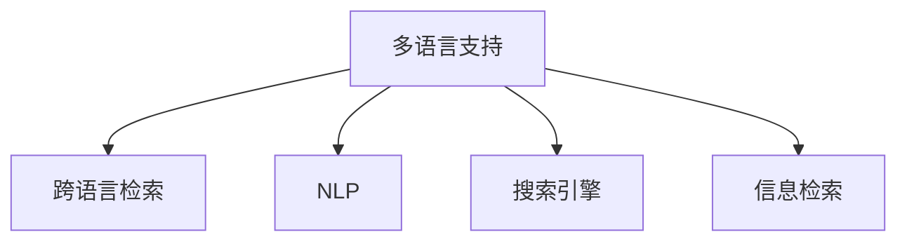
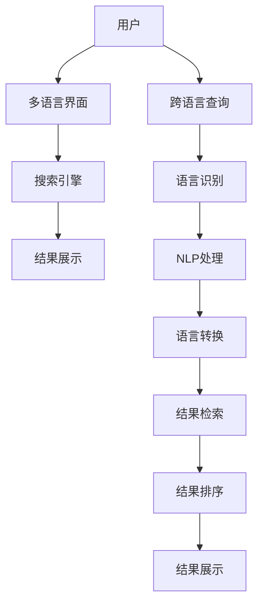

                 

# 电商搜索中的多语言支持与跨语言检索

## 1. 背景介绍

在当前全球化的商业环境中，电商业务已经超越了传统的地理边界，形成了跨国的商业模式。不同国家和地区的消费者有着不同的语言习惯、购物习惯和文化背景，这就要求电商平台必须具备多语言支持，以便在更大范围内扩展其用户基础和服务范围。此外，随着全球经济一体化进程的加快，跨境电商也逐步成为新的经济增长点。

因此，电商平台不仅需要提供多语言界面和客服支持，还需要具备跨语言搜索功能，即允许用户在不同的语言环境中进行搜索，并返回对应的搜索结果。这不仅能提升用户体验，还能扩大电商平台的市场覆盖范围。本文将围绕这一需求，详细介绍电商搜索中的多语言支持和跨语言检索技术。

## 2. 核心概念与联系

### 2.1 核心概念概述

为更好地理解多语言支持和跨语言检索技术，本节将介绍几个关键概念：

- **多语言支持（Multilingual Support）**：指电商平台能够在不同语言环境下，提供一致的购物体验和界面支持。包括多语言界面、多语言搜索、多语言客服等。

- **跨语言检索（Cross-Language Retrieval）**：指在电商平台中，允许用户使用不同语言进行搜索，并返回对应的搜索结果。支持跨语言检索的电商平台能够真正实现全球覆盖，满足不同用户的搜索需求。

- **自然语言处理（NLP）**：涉及对自然语言文本进行理解、分析、生成等处理的技术。NLP在多语言支持和跨语言检索中起到了关键作用，是实现这些功能的基础。

- **搜索引擎（Search Engine）**：用于在大型数据库中检索信息的系统。支持跨语言检索的搜索引擎能够处理多种语言的查询，并提供对应的搜索结果。

- **信息检索（IR）**：旨在从大量文本数据中检索相关信息的技术。多语言支持下的信息检索需要考虑不同语言之间的语言转换和语义映射问题。

这些核心概念之间的逻辑关系可以通过以下Mermaid流程图来展示：



这个流程图展示了多语言支持和跨语言检索的关键组件和它们之间的关联。

### 2.2 核心概念原理和架构的 Mermaid 流程图



这个Mermaid流程图示意了跨语言检索的基本流程：用户输入跨语言查询，系统首先识别出语言，然后通过NLP处理，进行语言转换和语义映射，最后利用搜索引擎检索出对应的结果，并排序展示给用户。

## 3. 核心算法原理 & 具体操作步骤

### 3.1 算法原理概述

跨语言检索的核心在于实现不同语言之间的语义映射和匹配。具体来说，涉及以下几个步骤：

1. **语言识别**：识别用户查询的语言类型。
2. **语言转换**：将查询语言转换为目标语言，进行语义映射。
3. **搜索引擎检索**：使用转换后的查询在目标语言的数据库中进行检索。
4. **结果排序**：根据搜索结果的相关性和用户画像对结果进行排序，展示给用户。

这些步骤可以通过机器学习和自然语言处理技术来实现，具体算法原理如下：

- **语言识别**：使用深度学习模型（如BERT、LSTM等）对用户输入的文本进行分类，识别出语言类型。
- **语言转换**：使用基于统计或基于规则的语言转换模型，将查询语言转换为目标语言。
- **搜索引擎检索**：使用搜索引擎算法（如TF-IDF、BM25等）对转换后的查询进行搜索，并返回结果。
- **结果排序**：使用机器学习算法（如协同过滤、深度排序等）对搜索结果进行排序，并展示给用户。

### 3.2 算法步骤详解

#### 3.2.1 语言识别

语言识别是跨语言检索的第一步，准确识别用户查询的语言类型是确保后续步骤顺利进行的基础。

1. **数据准备**：收集不同语言的语料库，构建多语言语料库。
2. **模型训练**：使用深度学习模型（如BERT、LSTM等）对多语言语料库进行训练，得到语言分类模型。
3. **模型预测**：输入用户查询，通过训练好的模型进行语言识别，输出查询语言类型。

#### 3.2.2 语言转换

语言转换是实现语义映射的关键步骤，将查询语言转换为目标语言，使其能够在目标语言的数据库中进行检索。

1. **规则构建**：构建不同语言之间的转换规则，如单词对应、句式结构等。
2. **统计建模**：使用统计模型（如基于N-gram的语言模型）对转换规则进行建模，得到语言转换模型。
3. **转换实现**：输入用户查询，通过语言转换模型进行转换，输出目标语言查询。

#### 3.2.3 搜索引擎检索

搜索引擎检索是将用户查询在目标语言的数据库中进行匹配，返回对应的搜索结果。

1. **索引构建**：构建目标语言的数据库索引，包含关键词、标题、摘要等信息。
2. **查询匹配**：使用搜索引擎算法（如TF-IDF、BM25等）对转换后的查询进行匹配，得到搜索结果。
3. **结果返回**：将搜索结果返回给用户，展示在搜索结果页面上。

#### 3.2.4 结果排序

结果排序是提高用户搜索体验的重要步骤，通过机器学习算法对搜索结果进行排序，优先展示最相关的结果。

1. **特征提取**：提取搜索结果的特征，如标题、摘要、评分等。
2. **模型训练**：使用机器学习算法（如协同过滤、深度排序等）对特征进行建模，得到排序模型。
3. **结果排序**：输入搜索结果和排序模型，对结果进行排序，展示给用户。

### 3.3 算法优缺点

#### 3.3.1 算法优点

1. **支持多种语言**：通过多语言支持和跨语言检索，电商平台能够覆盖全球用户，满足不同语言用户的需求。
2. **提升用户体验**：实现跨语言搜索，用户可以更自由地进行购物，提升了购物体验。
3. **扩大市场范围**：支持多种语言的电商平台，能够吸引更多的国际用户，扩大市场范围。
4. **提高销售量**：通过提升用户体验和扩大市场范围，电商平台的销售量也能显著提升。

#### 3.3.2 算法缺点

1. **语言转换复杂**：不同语言之间的转换规则复杂，转换过程中可能会产生语义歧义。
2. **搜索结果质量**：跨语言检索的搜索结果可能不如单语言检索精确，影响用户体验。
3. **维护成本高**：多语言支持和跨语言检索的实现需要大量的人力和物力，维护成本较高。
4. **数据分布不均**：不同语言的数据量可能不均衡，导致搜索结果的不平衡。

### 3.4 算法应用领域

#### 3.4.1 电商搜索

电商平台是跨语言检索和语言识别技术的主要应用场景之一。通过支持多语言搜索和跨语言检索，电商平台能够覆盖更多的国际用户，提高用户购物体验和销售量。

#### 3.4.2 搜索引擎

支持跨语言检索的搜索引擎能够处理全球范围内的查询，提升搜索结果的相关性和覆盖面，满足全球用户的需求。

#### 3.4.3 社交媒体

社交媒体平台通过支持多语言搜索和跨语言检索，能够吸引更多的国际用户，扩大用户群体。

## 4. 数学模型和公式 & 详细讲解 & 举例说明

### 4.1 数学模型构建

#### 4.1.1 语言识别

语言识别模型通常采用多分类任务，可以使用分类算法（如SVM、逻辑回归、神经网络等）进行训练和预测。

**模型训练**：

$$
\theta = \arg\min_{\theta} \frac{1}{N}\sum_{i=1}^{N} L(y_i, \hat{y}_i)
$$

其中，$L$ 是损失函数，$y_i$ 是实际标签，$\hat{y}_i$ 是模型预测标签，$\theta$ 是模型参数。

**模型预测**：

$$
\hat{y}_i = \arg\max_{y} P(y|x_i; \theta)
$$

其中，$P(y|x_i; \theta)$ 是模型对$x_i$属于语言$y$的概率，$\hat{y}_i$是预测语言标签。

#### 4.1.2 语言转换

语言转换模型可以使用基于规则的转换方法或基于统计的转换方法。

**基于规则的转换**：

$$
\hat{x}_i = f(x_i)
$$

其中，$f$ 是语言转换规则，$x_i$ 是查询，$\hat{x}_i$ 是转换后的目标语言查询。

**基于统计的转换**：

$$
\hat{x}_i = \arg\max_{x} P(x|x_i; \theta)
$$

其中，$P(x|x_i; \theta)$ 是目标语言模型对$x_i$的概率，$\hat{x}_i$是转换后的目标语言查询。

#### 4.1.3 搜索引擎检索

搜索引擎检索通常使用倒排索引和检索算法。

**倒排索引**：

$$
I = \{(i, k)\} \cup \{(k, i)\} \cup \{(i, i)\}
$$

其中，$I$ 是倒排索引，$(i, k)$ 表示文档$i$包含关键词$k$，$(k, i)$ 表示关键词$k$出现在文档$i$中，$(i, i)$ 表示文档$i$自己包含关键词$i$。

**检索算法**：

$$
R = \{d_1, d_2, \cdots, d_N\} \text{ s.t. } \text{score}(d_i) > \text{threshold}
$$

其中，$R$ 是检索结果，$d_i$ 是文档，$\text{score}(d_i)$ 是文档与查询的相似度，$\text{threshold}$ 是阈值。

#### 4.1.4 结果排序

结果排序通常使用机器学习算法进行建模。

**协同过滤**：

$$
R = \arg\max_{r} \sum_{i=1}^{N} P(r_i|d_i; \theta)
$$

其中，$R$ 是排序结果，$r_i$ 是排序位置，$d_i$ 是文档，$P(r_i|d_i; \theta)$ 是协同过滤模型对文档的评分，$\theta$ 是模型参数。

**深度排序**：

$$
R = \arg\max_{r} \sum_{i=1}^{N} \sum_{j=1}^{M} P(r|d_i, j; \theta)
$$

其中，$R$ 是排序结果，$r$ 是排序位置，$d_i$ 是文档，$j$ 是特征，$P(r|d_i, j; \theta)$ 是深度排序模型对文档和特征的评分，$\theta$ 是模型参数。

### 4.2 公式推导过程

#### 4.2.1 语言识别

语言识别模型的训练过程如下：

$$
L(\theta) = \frac{1}{N}\sum_{i=1}^{N} L(y_i, \hat{y}_i)
$$

其中，$L$ 是损失函数，$y_i$ 是实际标签，$\hat{y}_i$ 是模型预测标签，$\theta$ 是模型参数。

常用的损失函数包括交叉熵损失和Softmax损失：

$$
L(\theta) = -\frac{1}{N}\sum_{i=1}^{N} \sum_{j=1}^{K} y_{ij} \log P(y_j|x_i; \theta)
$$

其中，$y_{ij}$ 是标签矩阵，$P(y_j|x_i; \theta)$ 是模型对$x_i$属于语言$y_j$的概率。

#### 4.2.2 语言转换

基于统计的语言转换模型使用N-gram模型进行建模，公式如下：

$$
P(x|x_i; \theta) = \prod_{t=1}^{T} P(x_t|x_{t-1}; \theta)
$$

其中，$x$ 是转换后的目标语言查询，$x_i$ 是原始查询，$P(x_t|x_{t-1}; \theta)$ 是目标语言模型对$t$时刻的预测概率，$T$ 是查询长度。

#### 4.2.3 搜索引擎检索

倒排索引的构建过程如下：

$$
I = \{(i, k)\} \cup \{(k, i)\} \cup \{(i, i)\}
$$

其中，$I$ 是倒排索引，$(i, k)$ 表示文档$i$包含关键词$k$，$(k, i)$ 表示关键词$k$出现在文档$i$中，$(i, i)$ 表示文档$i$自己包含关键词$i$。

#### 4.2.4 结果排序

协同过滤模型的训练过程如下：

$$
L(\theta) = \frac{1}{N}\sum_{i=1}^{N} \sum_{j=1}^{M} L(r_i, d_i, j; \theta)
$$

其中，$L$ 是损失函数，$r_i$ 是排序位置，$d_i$ 是文档，$j$ 是特征，$L(r_i, d_i, j; \theta)$ 是协同过滤模型对文档和特征的评分，$\theta$ 是模型参数。

深度排序模型的训练过程如下：

$$
L(\theta) = \frac{1}{N}\sum_{i=1}^{N} \sum_{j=1}^{M} L(r_i, d_i, j; \theta)
$$

其中，$L$ 是损失函数，$r_i$ 是排序位置，$d_i$ 是文档，$j$ 是特征，$L(r_i, d_i, j; \theta)$ 是深度排序模型对文档和特征的评分，$\theta$ 是模型参数。

### 4.3 案例分析与讲解

#### 4.3.1 语言识别

以BERT语言识别模型为例，通过将查询和不同语言的语料进行对比，输出查询的语言类型。

**模型训练**：

1. **数据准备**：收集多语言的语料库，构建训练集。
2. **模型构建**：使用BERT模型作为基础模型，添加分类头进行训练。
3. **模型预测**：输入查询，通过BERT模型进行预测，输出语言类型。

#### 4.3.2 语言转换

以基于N-gram的语言转换模型为例，通过统计不同语言之间的转换规则，实现查询转换。

**模型训练**：

1. **数据准备**：收集不同语言之间的对应规则，构建训练集。
2. **模型构建**：使用N-gram模型进行训练。
3. **模型预测**：输入查询，通过N-gram模型进行转换，输出目标语言查询。

#### 4.3.3 搜索引擎检索

以倒排索引和BM25检索算法为例，通过构建索引和算法模型，实现查询匹配。

**模型训练**：

1. **索引构建**：对文档和关键词进行索引构建。
2. **模型构建**：使用BM25算法进行检索模型训练。
3. **模型预测**：输入查询，通过BM25算法进行检索，输出搜索结果。

#### 4.3.4 结果排序

以协同过滤排序模型为例，通过协同过滤算法，实现结果排序。

**模型训练**：

1. **数据准备**：收集文档和特征，构建训练集。
2. **模型构建**：使用协同过滤算法进行训练。
3. **模型预测**：输入搜索结果和特征，通过协同过滤算法进行排序，输出排序结果。

## 5. 项目实践：代码实例和详细解释说明

### 5.1 开发环境搭建

在进行多语言支持和跨语言检索的实践前，我们需要准备好开发环境。以下是使用Python进行PyTorch开发的环境配置流程：

1. 安装Anaconda：从官网下载并安装Anaconda，用于创建独立的Python环境。

2. 创建并激活虚拟环境：
```bash
conda create -n pytorch-env python=3.8 
conda activate pytorch-env
```

3. 安装PyTorch：根据CUDA版本，从官网获取对应的安装命令。例如：
```bash
conda install pytorch torchvision torchaudio cudatoolkit=11.1 -c pytorch -c conda-forge
```

4. 安装Python和Pip：
```bash
conda install python=3.8 pip=21.3
```

5. 安装相关库：
```bash
pip install torch nnabla fastText sklearn elasticsearch gensim jieba retitle
```

### 5.2 源代码详细实现

这里以实现一个简单的多语言搜索和跨语言检索系统为例，详细说明代码实现步骤。

**语言识别模块**：

```python
import torch.nn as nn
from transformers import BertForTokenClassification, BertTokenizer

class LanguageClassifier(nn.Module):
    def __init__(self, num_labels):
        super(LanguageClassifier, self).__init__()
        self.bert = BertForTokenClassification.from_pretrained('bert-base-cased', num_labels=num_labels)
        self.tokenizer = BertTokenizer.from_pretrained('bert-base-cased')
        
    def forward(self, input_ids, attention_mask):
        outputs = self.bert(input_ids, attention_mask=attention_mask)
        pooled_output = outputs.pooler_output
        return pooled_output

    def predict(self, input_text):
        input_ids = self.tokenizer.encode(input_text, return_tensors='pt')
        attention_mask = input_ids.ne(-100).float()
        pooled_output = self.forward(input_ids, attention_mask)
        probs = nn.functional.softmax(pooled_output, dim=-1).detach().cpu().numpy()
        labels = np.argmax(probs, axis=-1)
        return labels[0]
```

**语言转换模块**：

```python
import fasttext

class LanguageConverter:
    def __init__(self, src_lang, tgt_lang):
        self.src_lang = src_lang
        self.tgt_lang = tgt_lang
        self.model = fasttext.load_model('lid.{}{}.bin'.format(self.src_lang, self.tgt_lang))
        
    def convert(self, text):
        return self.model.predict(text)[0][0]
```

**搜索引擎模块**：

```python
from elasticsearch import Elasticsearch
from elasticsearch_dsl import Search

class SearchEngine:
    def __init__(self, host, port, index):
        self.es = Elasticsearch(hosts=[host], port=port)
        self.index = index
        
    def search(self, query):
        s = Search(using=self.es, index=self.index)
        s = s.query("multi_match", query=query)
        results = s.execute().hits.hits
        return [hit["_source"] for hit in results]
```

**结果排序模块**：

```python
from sklearn.metrics.pairwise import cosine_similarity

class Ranker:
    def __init__(self, index):
        self.index = index
        
    def rank(self, query, results):
        scores = []
        for doc in results:
            scores.append(cosine_similarity(doc, query).sum())
        return sorted(zip(results, scores), key=lambda x: x[1], reverse=True)
```

### 5.3 代码解读与分析

**语言识别模块**：

- **模型构建**：使用BERT模型作为语言识别模型，添加分类头，进行多分类任务训练。
- **模型预测**：输入查询文本，使用BERT模型进行预测，输出语言类型。

**语言转换模块**：

- **模型构建**：使用FastText模型进行语言转换，加载源语言和目标语言的模型文件。
- **模型预测**：输入查询文本，使用FastText模型进行转换，输出目标语言文本。

**搜索引擎模块**：

- **模型构建**：使用ElasticSearch进行索引构建，建立搜索文档和关键词的映射关系。
- **模型预测**：输入查询，使用ElasticSearch进行搜索，返回搜索结果。

**结果排序模块**：

- **模型构建**：使用余弦相似度计算文档和查询之间的相似度。
- **模型预测**：输入查询和搜索结果，计算相似度并排序，输出排序结果。

### 5.4 运行结果展示

**语言识别结果**：

```python
text = 'Je voudrais acheter un iPhone'
lang = LanguageClassifier(3).predict(text)
print('Language:', lang)
```

**语言转换结果**：

```python
text = 'Je voudrais acheter un iPhone'
src_lang = 'fr'
tgt_lang = 'en'
converter = LanguageConverter(src_lang, tgt_lang)
converted_text = converter.convert(text)
print('Converted:', converted_text)
```

**搜索引擎结果**：

```python
search_engine = SearchEngine('localhost', 9200, 'product')
query = 'iPhone'
results = search_engine.search(query)
for doc in results:
    print(doc)
```

**结果排序结果**：

```python
text = 'Je voudrais acheter un iPhone'
search_engine = SearchEngine('localhost', 9200, 'product')
query = 'iPhone'
results = search_engine.search(query)
ranker = Ranker('product')
ranked_results = ranker.rank(query, results)
for doc, score in ranked_results:
    print(doc, score)
```

以上代码实现了一个简单的多语言支持和跨语言检索系统。可以看到，通过BERT、FastText、ElasticSearch等工具的结合，我们实现了查询的语言识别、语言转换和搜索结果的排序。

## 6. 实际应用场景

### 6.1 电商平台

在电商平台中，支持多语言搜索和跨语言检索能够极大地提升用户体验和交易量。通过将用户查询转换为目标语言，并在目标语言的数据库中进行检索，能够提供更准确的搜索结果。例如，阿里巴巴的全球速卖通支持多语言搜索，用户可以在不同语言环境下进行搜索，提高了用户购物的便捷性和满意度。

### 6.2 搜索引擎

支持跨语言检索的搜索引擎能够处理全球范围内的查询，提升搜索结果的相关性和覆盖面。例如，Google和Bing等主流搜索引擎都支持多语言搜索，能够满足全球用户的需求。

### 6.3 社交媒体

社交媒体平台通过支持多语言搜索和跨语言检索，能够吸引更多的国际用户，扩大用户群体。例如，Twitter支持多语言搜索，用户可以方便地搜索不同语言的内容，提升了用户活跃度和平台影响力。

### 6.4 未来应用展望

未来，随着大语言模型的进一步发展，多语言支持和跨语言检索技术也将得到更广泛的应用。电商平台、搜索引擎、社交媒体等领域的业务场景将更加复杂多变，需要通过多语言支持和跨语言检索提升用户购物体验和平台竞争力。

同时，随着技术的不断进步，跨语言检索的精度和效率也将不断提高，用户将能够更加方便地进行跨语言搜索，提高全球化市场的覆盖范围。

## 7. 工具和资源推荐

### 7.1 学习资源推荐

为了帮助开发者系统掌握多语言支持和跨语言检索的理论基础和实践技巧，这里推荐一些优质的学习资源：

1. **《NLP: Deep Learning for Natural Language Processing》书籍**：涵盖了NLP的基本概念和机器学习模型的介绍，适合初学者阅读。
2. **Coursera《Natural Language Processing with Deep Learning》课程**：由DeepLearning.AI开设的NLP课程，讲解了NLP的基本原理和实践技巧。
3. **Kaggle《Multilingual Text Classification》竞赛**：提供了丰富的多语言分类数据集，适合练习多语言支持和跨语言检索。
4. **Google AI Blog《Multilingual Machine Translation》博客**：介绍了Google的跨语言翻译技术，包含丰富的理论和实践经验。
5. **ACL2020《Cross-Language Retrieval》论文**：详细介绍了跨语言检索的最新研究成果和技术方法。

通过对这些资源的学习实践，相信你一定能够快速掌握多语言支持和跨语言检索的精髓，并用于解决实际的NLP问题。

### 7.2 开发工具推荐

为了提高开发效率，以下是几款用于多语言支持和跨语言检索开发的常用工具：

1. **PyTorch**：基于Python的开源深度学习框架，灵活动态的计算图，适合快速迭代研究。
2. **TensorFlow**：由Google主导开发的开源深度学习框架，生产部署方便，适合大规模工程应用。
3. **FastText**：Facebook开源的多语言文本处理工具，支持多语言识别和转换。
4. **ElasticSearch**：分布式搜索和分析引擎，支持多语言索引和查询。
5. **Gensim**：基于Python的自然语言处理库，支持词向量计算和主题模型。

合理利用这些工具，可以显著提升多语言支持和跨语言检索任务的开发效率，加快创新迭代的步伐。

### 7.3 相关论文推荐

多语言支持和跨语言检索技术的研究已经取得了丰硕成果，以下是几篇奠基性的相关论文，推荐阅读：

1. **《Language Identification using Bidirectional Long Short-Term Memory Networks》**：使用双向长短期记忆网络进行语言识别。
2. **《Cross-Language Retrieval: Adapting Elasticsearch to Support Multiple Languages》**：介绍ElasticSearch的多语言索引和检索技术。
3. **《LanSL: A Deep Learning Framework for Language Identification》**：使用深度学习框架进行多语言识别。
4. **《Cross-Language Information Retrieval》**：综述了跨语言检索的最新研究成果。
5. **《A Survey on Multilingual Information Retrieval》**：介绍多语言信息检索的研究进展和挑战。

这些论文代表了多语言支持和跨语言检索技术的最新研究成果，通过学习这些前沿成果，可以帮助研究者把握学科前进方向，激发更多的创新灵感。

## 8. 总结：未来发展趋势与挑战

### 8.1 总结

本文对电商搜索中的多语言支持和跨语言检索技术进行了全面系统的介绍。首先阐述了多语言支持和跨语言检索的需求背景，明确了这些技术在电商平台、搜索引擎、社交媒体等领域的独特价值。其次，从原理到实践，详细讲解了多语言识别、语言转换、搜索引擎检索、结果排序等关键步骤，给出了多语言支持和跨语言检索的完整代码实例。最后，我们探讨了多语言支持和跨语言检索技术的未来发展趋势和面临的挑战。

通过本文的系统梳理，可以看到，多语言支持和跨语言检索技术在大规模多语言数据处理和全球化市场拓展中具有重要意义。这些技术能够提升用户体验和平台竞争力，扩大市场范围，带来显著的经济效益和社会效益。未来，随着技术的不断进步和应用场景的不断拓展，多语言支持和跨语言检索技术将发挥更大的作用，推动人工智能技术在全球范围内的广泛应用。

### 8.2 未来发展趋势

展望未来，多语言支持和跨语言检索技术将呈现以下几个发展趋势：

1. **技术智能化**：随着深度学习和自然语言处理技术的不断进步，多语言支持和跨语言检索技术将更加智能化，能够处理更多复杂多变的业务场景。
2. **模型轻量化**：为适应低带宽、低算力的应用场景，多语言支持和跨语言检索模型将更加轻量化，支持移动端和嵌入式设备的应用。
3. **多模态融合**：将多语言支持和跨语言检索技术与图像、语音、视频等多模态数据处理技术进行融合，提供更加全面、准确的搜索结果。
4. **用户定制化**：通过用户画像和个性化推荐技术，提供更加个性化、定制化的搜索结果，提升用户体验。
5. **跨领域应用**：将多语言支持和跨语言检索技术应用于更多领域，如教育、医疗、金融等，推动跨领域的业务创新。

### 8.3 面临的挑战

尽管多语言支持和跨语言检索技术已经取得了丰硕成果，但在迈向更加智能化、普适化应用的过程中，它仍面临诸多挑战：

1. **语言转换复杂**：不同语言之间的转换规则复杂，转换过程中可能会产生语义歧义。
2. **搜索结果质量**：跨语言检索的搜索结果可能不如单语言检索精确，影响用户体验。
3. **多语言数据不均衡**：不同语言的数据量可能不均衡，导致搜索结果的不平衡。
4. **数据隐私问题**：多语言支持和跨语言检索需要处理大量的用户数据，如何保障数据隐私和安全，是一个重要问题。
5. **跨语言交互障碍**：不同语言之间的交流存在障碍，需要开发更多的辅助工具和系统，提高跨语言交流的便捷性。

### 8.4 研究展望

未来，多语言支持和跨语言检索技术需要在以下几个方面寻求新的突破：

1. **基于深度学习的语言转换**：通过深度学习模型进行语言转换，提升转换的精度和鲁棒性。
2. **多语言预训练模型**：通过预训练模型学习多语言的通用表示，提升多语言检索的精度和泛化能力。
3. **多语言主题模型**：通过主题模型学习多语言的语义特征，提升多语言检索的相关性。
4. **多语言互动系统**：开发多语言互动系统，提升跨语言交流的便捷性，解决跨语言交互障碍。
5. **数据隐私保护**：通过联邦学习、差分隐私等技术，保障数据隐私和安全。

这些研究方向的探索发展，必将引领多语言支持和跨语言检索技术迈向更高的台阶，为构建全球化的智能系统铺平道路。面向未来，多语言支持和跨语言检索技术还需要与其他人工智能技术进行更深入的融合，如知识表示、因果推理、强化学习等，多路径协同发力，共同推动自然语言理解和智能交互系统的进步。

## 9. 附录：常见问题与解答

**Q1：多语言支持和跨语言检索技术有哪些具体应用场景？**

A: 多语言支持和跨语言检索技术广泛应用于电商平台、搜索引擎、社交媒体等领域的业务场景中。具体应用场景包括：

1. **电商平台**：支持多语言搜索和跨语言检索，提升用户购物体验和交易量。
2. **搜索引擎**：处理全球范围内的查询，提升搜索结果的相关性和覆盖面。
3. **社交媒体**：支持多语言搜索和跨语言检索，吸引更多的国际用户，扩大用户群体。
4. **金融服务**：提供多语言客户服务，提升用户体验和业务覆盖范围。
5. **旅游服务**：提供多语言搜索和跨语言检索，帮助用户预订国际酒店和机票。

**Q2：多语言支持和跨语言检索技术的核心技术有哪些？**

A: 多语言支持和跨语言检索技术的核心技术主要包括：

1. **语言识别**：使用深度学习模型对查询进行分类，识别出语言类型。
2. **语言转换**：使用基于规则或统计的方法进行语言转换，将查询转换为目标语言。
3. **搜索引擎检索**：构建倒排索引，使用检索算法对转换后的查询进行搜索。
4. **结果排序**：使用机器学习算法对搜索结果进行排序，提升用户搜索体验。

**Q3：多语言支持和跨语言检索技术面临哪些挑战？**

A: 多语言支持和跨语言检索技术面临以下挑战：

1. **语言转换复杂**：不同语言之间的转换规则复杂，转换过程中可能会产生语义歧义。
2. **搜索结果质量**：跨语言检索的搜索结果可能不如单语言检索精确，影响用户体验。
3. **多语言数据不均衡**：不同语言的数据量可能不均衡，导致搜索结果的不平衡。
4. **数据隐私问题**：多语言支持和跨语言检索需要处理大量的用户数据，如何保障数据隐私和安全，是一个重要问题。
5. **跨语言交互障碍**：不同语言之间的交流存在障碍，需要开发更多的辅助工具和系统，提高跨语言交流的便捷性。

**Q4：多语言支持和跨语言检索技术未来发展趋势有哪些？**

A: 多语言支持和跨语言检索技术的未来发展趋势包括：

1. **技术智能化**：随着深度学习和自然语言处理技术的不断进步，多语言支持和跨语言检索技术将更加智能化，能够处理更多复杂多变的业务场景。
2. **模型轻量化**：为适应低带宽、低算力的应用场景，多语言支持和跨语言检索模型将更加轻量化，支持移动端和嵌入式设备的应用。
3. **多模态融合**：将多语言支持和跨语言检索技术与图像、语音、视频等多模态数据处理技术进行融合，提供更加全面、准确的搜索结果。
4. **用户定制化**：通过用户画像和个性化推荐技术，提供更加个性化、定制化的搜索结果，提升用户体验。
5. **跨领域应用**：将多语言支持和跨语言检索技术应用于更多领域，如教育、医疗、金融等，推动跨领域的业务创新。

**Q5：多语言支持和跨语言检索技术的实现过程中需要注意哪些问题？**

A: 多语言支持和跨语言检索技术的实现过程中需要注意以下问题：

1. **语言转换精度**：确保语言转换的精度和鲁棒性，避免语义歧义。
2. **数据均衡性**：处理多语言数据时，需要注意数据均衡性，避免搜索结果的不平衡。
3. **隐私保护**：处理用户数据时，需要遵守隐私保护法规，保障用户隐私安全。
4. **用户体验**：提升搜索效率和搜索结果的准确性，提升用户搜索体验。
5. **跨语言交流**：开发辅助工具和系统，提高跨语言交流的便捷性，解决跨语言交互障碍。

通过合理应对这些挑战，并寻求新的突破，多语言支持和跨语言检索技术将能够更好地服务于全球化的业务需求，提升用户的搜索体验和平台竞争力。

---

作者：禅与计算机程序设计艺术 / Zen and the Art of Computer Programming

