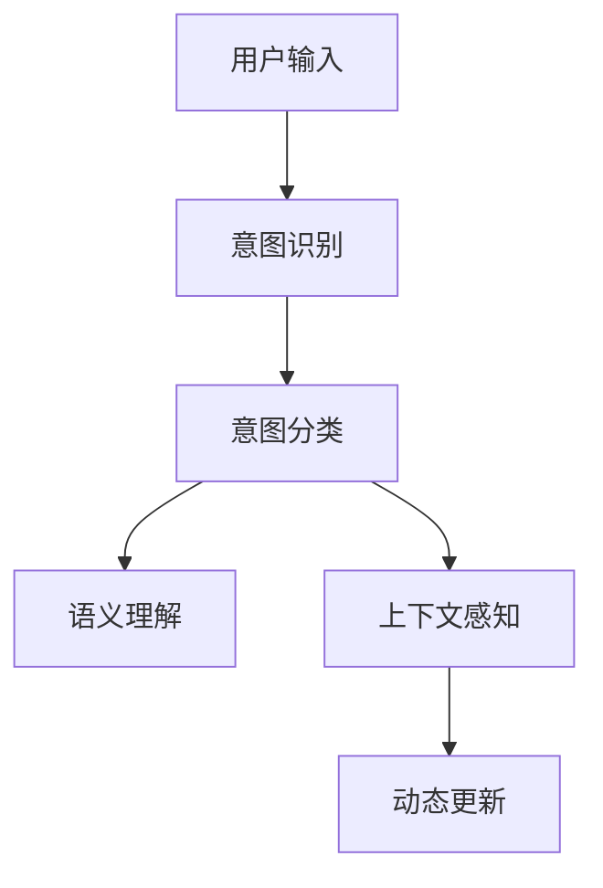

                 

# 电商搜索中的意图识别与分类模型

## 1. 背景介绍

### 1.1 问题由来

电商搜索是现代电商平台的核心功能之一，用户通过输入关键词进行搜索，系统根据搜索意图返回最相关的商品。良好的意图识别与分类，可以有效提高搜索结果的相关性和用户满意度，直接影响到电商平台的销售转化率。

然而，随着电子商务的发展，电商搜索面临的问题也愈加复杂。一方面，用户输入的查询越来越模糊、多样化，单一的关键词难以全面覆盖搜索意图；另一方面，用户画像数据质量参差不齐，单一的静态标签无法精准刻画用户的动态需求。

为了应对这些挑战，电商搜索平台纷纷引入意图识别与分类技术，对用户输入进行动态理解，提升搜索结果的质量和匹配度。当前，主流的大模型微调方法在电商搜索中得到了广泛应用，但系统设计和优化仍需进一步提升。

### 1.2 问题核心关键点

为了更好地理解意图识别与分类的核心问题，本节将介绍几个密切相关的核心概念：

- **意图识别（Intent Recognition）**：识别用户输入文本的搜索意图，如查询意图、浏览意图等。
- **意图分类（Intent Classification）**：将识别出的意图进行分类，如商品查询、品牌查询、评价查询等。
- **语义理解（Semantic Understanding）**：深入理解用户输入文本的语义内容，辅助意图识别和分类。
- **上下文感知（Contextual Sensitivity）**：考虑用户历史行为和上下文环境，进行更准确的意图识别和分类。
- **动态更新（Dynamic Updating）**：根据用户互动情况和反馈，动态调整意图模型，提高模型鲁棒性和适应性。

这些核心概念之间的逻辑关系可以通过以下Mermaid流程图来展示：



这个流程图展示了一系列意图识别与分类的关键过程，从用户输入到最终的分类结果，每个环节都是重要的一环。

## 2. 核心概念与联系

### 2.1 核心概念概述

为更好地理解意图识别与分类的核心问题，本节将介绍几个密切相关的核心概念：

- **意图识别（Intent Recognition）**：识别用户输入文本的搜索意图，如查询意图、浏览意图等。
- **意图分类（Intent Classification）**：将识别出的意图进行分类，如商品查询、品牌查询、评价查询等。
- **语义理解（Semantic Understanding）**：深入理解用户输入文本的语义内容，辅助意图识别和分类。
- **上下文感知（Contextual Sensitivity）**：考虑用户历史行为和上下文环境，进行更准确的意图识别和分类。
- **动态更新（Dynamic Updating）**：根据用户互动情况和反馈，动态调整意图模型，提高模型鲁棒性和适应性。

这些核心概念之间的逻辑关系可以通过以下Mermaid流程图来展示：


这个流程图展示了一系列意图识别与分类的关键过程，从用户输入到最终的分类结果，每个环节都是重要的一环。

## 3. 核心算法原理 & 具体操作步骤

### 3.1 算法原理概述

电商搜索中的意图识别与分类，本质上是通过机器学习模型对用户输入进行分析和理解，将其转化为对搜索结果的指导。

假设用户输入的文本为 $X$，其意图识别结果为 $I$，意图分类结果为 $C$。意图识别模型 $M_I$ 和意图分类模型 $M_C$ 可以表示为：

$$
I = M_I(X) \\
C = M_C(I)
$$

其中，$M_I$ 是一个映射函数，将用户输入 $X$ 映射到意图空间 $I$；$M_C$ 是一个分类函数，将意图 $I$ 映射到具体的意图分类 $C$。

### 3.2 算法步骤详解

电商搜索中的意图识别与分类一般包括以下几个关键步骤：

**Step 1: 数据收集与预处理**
- 收集电商搜索的历史数据，包括用户输入、搜索行为、用户画像等信息。
- 对数据进行清洗和标注，去除无效样本，标注意图类别。

**Step 2: 构建意图识别模型**
- 选择合适的模型结构，如Transformer、BERT等。
- 将标注好的数据集划分为训练集、验证集和测试集。
- 使用训练集对意图识别模型进行微调，最小化损失函数，如交叉熵损失。
- 在验证集上评估模型性能，调整模型参数，防止过拟合。
- 在测试集上最终评估模型性能，输出意图识别结果。

**Step 3: 构建意图分类模型**
- 对意图识别结果进行分类，构建意图分类模型。
- 选择合适的分类器，如softmax分类器、决策树等。
- 使用训练集对意图分类模型进行微调，最小化损失函数，如交叉熵损失。
- 在验证集上评估模型性能，调整模型参数，防止过拟合。
- 在测试集上最终评估模型性能，输出意图分类结果。

**Step 4: 融合语义理解和上下文感知**
- 在模型中引入语义理解模块，提升对输入文本的深度理解。
- 考虑用户的历史行为和上下文环境，对意图识别和分类结果进行调整。
- 使用动态更新的机制，根据用户互动情况和反馈，调整意图模型，提高模型鲁棒性和适应性。

**Step 5: 系统集成与优化**
- 将意图识别和分类模型集成到电商搜索系统中。
- 优化系统的处理流程，提高搜索效率和用户体验。
- 不断迭代优化模型，提升意图识别与分类的准确性。

### 3.3 算法优缺点

电商搜索中的意图识别与分类方法具有以下优点：
1. 高效灵活。模型可以根据实时输入数据进行动态更新，提升系统适应性和鲁棒性。
2. 覆盖全面。深度学习模型具有强大的自适应能力，能够覆盖用户多样化的搜索需求。
3. 性能优异。利用大模型微调技术，能够显著提升意图识别与分类的准确性。

同时，该方法也存在一定的局限性：
1. 数据质量依赖。模型效果很大程度上依赖于训练数据的标注质量和多样性。
2. 模型复杂度。大模型微调需要较强的计算资源，训练复杂度较高。
3. 结果可解释性。意图识别与分类的过程较为复杂，模型输出结果难以解释。
4. 鲁棒性不足。在面对噪声数据或非典型输入时，模型容易出现误判。

尽管存在这些局限性，但就目前而言，意图识别与分类方法仍然是电商搜索系统的重要技术手段。未来相关研究的重点在于如何进一步降低对标注数据的依赖，提高模型的可解释性和鲁棒性，同时兼顾计算效率和性能提升。

### 3.4 算法应用领域

电商搜索中的意图识别与分类方法，在电商平台上得到了广泛应用，包括但不限于：

- 商品推荐：根据用户输入的搜索词和行为，推荐相关商品，提升用户购物体验。
- 广告投放：精准识别用户的意图，实现更有效的广告投放和点击转化。
- 客服系统：实时理解用户的搜索需求，提供个性化客服响应，提升用户满意度。
- 搜索结果排序：根据用户意图，优化搜索结果排序，提升搜索精度和效率。
- 个性化定制：根据用户的个性化搜索意图，提供定制化服务，提升用户粘性。

除了上述这些经典应用外，电商搜索中的意图识别与分类方法也被创新性地应用于用户画像建模、市场分析、供应链优化等场景，为电商平台带来了更多的商业价值。

## 4. 数学模型和公式 & 详细讲解

### 4.1 数学模型构建

假设电商搜索系统的输入文本为 $X$，意图识别模型为 $M_I$，意图分类模型为 $M_C$。输入文本 $X$ 包含单词 $w_1, w_2, ..., w_n$，对应词向量为 $v_1, v_2, ..., v_n$。模型的输入可以表示为：

$$
X = [w_1, w_2, ..., w_n] \in \mathbb{R}^{n \times d}
$$

其中 $d$ 为词向量维度。

### 4.2 公式推导过程

电商搜索中的意图识别与分类，可以通过以下公式进行推导：

假设输入文本 $X$ 经过 Transformer 模型处理后，得到表征向量 $h$：

$$
h = M_I(X) = \mathbf{T}(X) \cdot W_Q
$$

其中 $\mathbf{T}$ 为 Transformer 模型，$W_Q$ 为模型权重。

假设意图识别模型的输出为 $I$，其概率分布为 $P(I|X)$：

$$
P(I|X) = \text{softmax}(h \cdot W_I + b_I)
$$

其中 $W_I$ 为意图分类器权重，$b_I$ 为偏置项。

假设意图分类模型的输出为 $C$，其概率分布为 $P(C|I)$：

$$
P(C|I) = \text{softmax}(I \cdot W_C + b_C)
$$

其中 $W_C$ 为分类器权重，$b_C$ 为偏置项。

最终的意图分类结果 $C$ 为：

$$
C = \mathop{\arg\max}_C P(C|I)
$$

### 4.3 案例分析与讲解

假设电商平台的输入文本为：“购买手机推荐”。首先，使用 Transformer 模型对输入文本进行编码：

$$
h = M_I(X) = \mathbf{T}(X) \cdot W_Q
$$

得到表征向量 $h$。然后，利用意图分类器计算意图识别结果 $I$ 的概率分布：

$$
P(I|X) = \text{softmax}(h \cdot W_I + b_I)
$$

假设 $P(I|X)$ 为查询意图，则进行下一步的意图分类：

$$
P(C|I) = \text{softmax}(I \cdot W_C + b_C)
$$

得到意图分类结果 $C$ 为“购买”。

通过上述过程，电商平台能够准确地理解用户的搜索意图，并进行相应的商品推荐和搜索结果排序，提升用户体验和转化率。

## 5. 项目实践：代码实例和详细解释说明

### 5.1 开发环境搭建

在进行意图识别与分类项目实践前，我们需要准备好开发环境。以下是使用Python进行PyTorch开发的环境配置流程：

1. 安装Anaconda：从官网下载并安装Anaconda，用于创建独立的Python环境。

2. 创建并激活虚拟环境：
```bash
conda create -n pytorch-env python=3.8 
conda activate pytorch-env
```

3. 安装PyTorch：根据CUDA版本，从官网获取对应的安装命令。例如：
```bash
conda install pytorch torchvision torchaudio cudatoolkit=11.1 -c pytorch -c conda-forge
```

4. 安装Transformers库：
```bash
pip install transformers
```

5. 安装各类工具包：
```bash
pip install numpy pandas scikit-learn matplotlib tqdm jupyter notebook ipython
```

完成上述步骤后，即可在`pytorch-env`环境中开始项目实践。

### 5.2 源代码详细实现

这里我们以意图识别与分类任务为例，给出使用Transformers库对BERT模型进行意图识别与分类的PyTorch代码实现。

首先，定义意图识别与分类任务的训练数据集：

```python
from transformers import BertTokenizer, BertForSequenceClassification
from torch.utils.data import Dataset, DataLoader
from sklearn.model_selection import train_test_split
import torch

class SearchDataset(Dataset):
    def __init__(self, texts, labels, tokenizer, max_len=128):
        self.texts = texts
        self.labels = labels
        self.tokenizer = tokenizer
        self.max_len = max_len
        
    def __len__(self):
        return len(self.texts)
    
    def __getitem__(self, item):
        text = self.texts[item]
        label = self.labels[item]
        
        encoding = self.tokenizer(text, return_tensors='pt', max_length=self.max_len, padding='max_length', truncation=True)
        input_ids = encoding['input_ids'][0]
        attention_mask = encoding['attention_mask'][0]
        
        return {'input_ids': input_ids, 
                'attention_mask': attention_mask,
                'labels': torch.tensor(label, dtype=torch.long)}
```

然后，定义意图识别与分类模型：

```python
from transformers import BertForSequenceClassification

model = BertForSequenceClassification.from_pretrained('bert-base-cased', num_labels=3)
```

接着，定义训练和评估函数：

```python
from tqdm import tqdm
from sklearn.metrics import accuracy_score, precision_score, recall_score, f1_score

device = torch.device('cuda') if torch.cuda.is_available() else torch.device('cpu')
model.to(device)

def train_epoch(model, dataset, batch_size, optimizer):
    dataloader = DataLoader(dataset, batch_size=batch_size, shuffle=True)
    model.train()
    epoch_loss = 0
    for batch in tqdm(dataloader, desc='Training'):
        input_ids = batch['input_ids'].to(device)
        attention_mask = batch['attention_mask'].to(device)
        labels = batch['labels'].to(device)
        model.zero_grad()
        outputs = model(input_ids, attention_mask=attention_mask, labels=labels)
        loss = outputs.loss
        epoch_loss += loss.item()
        loss.backward()
        optimizer.step()
    return epoch_loss / len(dataloader)

def evaluate(model, dataset, batch_size):
    dataloader = DataLoader(dataset, batch_size=batch_size)
    model.eval()
    preds, labels = [], []
    with torch.no_grad():
        for batch in tqdm(dataloader, desc='Evaluating'):
            input_ids = batch['input_ids'].to(device)
            attention_mask = batch['attention_mask'].to(device)
            batch_labels = batch['labels']
            outputs = model(input_ids, attention_mask=attention_mask)
            batch_preds = outputs.logits.argmax(dim=2).to('cpu').tolist()
            batch_labels = batch_labels.to('cpu').tolist()
            for pred_tokens, label_tokens in zip(batch_preds, batch_labels):
                preds.append(pred_tokens)
                labels.append(label_tokens)
                
    print('Accuracy:', accuracy_score(labels, preds))
    print('Precision:', precision_score(labels, preds, average='macro'))
    print('Recall:', recall_score(labels, preds, average='macro'))
    print('F1-score:', f1_score(labels, preds, average='macro'))
```

最后，启动训练流程并在测试集上评估：

```python
epochs = 5
batch_size = 16

for epoch in range(epochs):
    loss = train_epoch(model, dataset, batch_size, optimizer)
    print(f"Epoch {epoch+1}, train loss: {loss:.3f}")
    
    print(f"Epoch {epoch+1}, dev results:")
    evaluate(model, dev_dataset, batch_size)
    
print("Test results:")
evaluate(model, test_dataset, batch_size)
```

以上就是使用PyTorch对BERT进行意图识别与分类的完整代码实现。可以看到，得益于Transformers库的强大封装，我们可以用相对简洁的代码完成BERT模型的加载和意图识别与分类的微调。

### 5.3 代码解读与分析

让我们再详细解读一下关键代码的实现细节：

**SearchDataset类**：
- `__init__`方法：初始化文本、标签、分词器等关键组件。
- `__len__`方法：返回数据集的样本数量。
- `__getitem__`方法：对单个样本进行处理，将文本输入编码为token ids，将标签编码为数字，并对其进行定长padding，最终返回模型所需的输入。

**训练和评估函数**：
- 使用PyTorch的DataLoader对数据集进行批次化加载，供模型训练和推理使用。
- 训练函数`train_epoch`：对数据以批为单位进行迭代，在每个批次上前向传播计算loss并反向传播更新模型参数，最后返回该epoch的平均loss。
- 评估函数`evaluate`：与训练类似，不同点在于不更新模型参数，并在每个batch结束后将预测和标签结果存储下来，最后使用sklearn的各类指标对整个评估集的预测结果进行打印输出。

**训练流程**：
- 定义总的epoch数和batch size，开始循环迭代
- 每个epoch内，先在训练集上训练，输出平均loss
- 在验证集上评估，输出各类指标
- 所有epoch结束后，在测试集上评估，给出最终测试结果

可以看到，PyTorch配合Transformers库使得BERT微调的代码实现变得简洁高效。开发者可以将更多精力放在数据处理、模型改进等高层逻辑上，而不必过多关注底层的实现细节。

当然，工业级的系统实现还需考虑更多因素，如模型的保存和部署、超参数的自动搜索、更灵活的任务适配层等。但核心的意图识别与分类的微调范式基本与此类似。

## 6. 实际应用场景

### 6.1 智能客服系统

智能客服系统能够实时理解用户输入，自动生成应答文本，提供7x24小时不间断服务。借助意图识别与分类技术，智能客服系统能够准确理解用户问题，并提供精准的回答。

例如，电商平台可以部署意图识别与分类模型，对用户的搜索请求进行实时分析，自动识别用户的意图，并调用相应的客服接口进行响应。对于复杂查询，系统还可以进一步进行关键词抽取和情感分析，提升应答的个性化和准确性。

### 6.2 个性化推荐系统

个性化推荐系统能够根据用户的浏览和购买行为，推荐相关商品。借助意图识别与分类技术，推荐系统能够更好地理解用户的搜索需求，提供更加个性化的推荐内容。

例如，电商平台可以使用意图识别与分类模型，对用户的搜索历史和点击行为进行分析和分类，识别出用户的兴趣点，从而进行更精准的商品推荐。对于新用户，系统还可以通过意图分类模型预测用户的潜在需求，提前进行商品推荐，提升用户粘性和转化率。

### 6.3 广告投放

广告投放是电商平台的盈利核心。借助意图识别与分类技术，平台可以更精准地识别用户的广告意图，提高广告投放的转化率和点击率。

例如，电商平台可以使用意图分类模型，对用户的搜索行为进行分析和分类，识别出用户的广告兴趣点，从而进行更精准的广告投放。对于已展示的广告，系统还可以进一步进行广告意图分类，筛选出潜在的高价值用户，提升广告的精准度和效果。

### 6.4 市场分析

电商平台需要实时了解市场动态，预测用户行为和需求。借助意图识别与分类技术，平台可以更准确地分析用户输入数据，预测市场趋势和用户需求。

例如，电商平台可以使用意图分类模型，对用户的搜索和评论数据进行分析和分类，识别出用户关注的商品类型和价格区间，从而进行市场预测和决策支持。对于热门商品，系统还可以进行情感分析，预测市场的舆情变化，帮助平台制定相应的应对策略。

## 7. 工具和资源推荐

### 7.1 学习资源推荐

为了帮助开发者系统掌握意图识别与分类的理论基础和实践技巧，这里推荐一些优质的学习资源：

1. 《Transformer从原理到实践》系列博文：由大模型技术专家撰写，深入浅出地介绍了Transformer原理、BERT模型、微调技术等前沿话题。

2. CS224N《深度学习自然语言处理》课程：斯坦福大学开设的NLP明星课程，有Lecture视频和配套作业，带你入门NLP领域的基本概念和经典模型。

3. 《Natural Language Processing with Transformers》书籍：Transformers库的作者所著，全面介绍了如何使用Transformers库进行NLP任务开发，包括意图识别与分类在内的诸多范式。

4. HuggingFace官方文档：Transformers库的官方文档，提供了海量预训练模型和完整的意图识别与分类样例代码，是上手实践的必备资料。

5. CLUE开源项目：中文语言理解测评基准，涵盖大量不同类型的中文NLP数据集，并提供了基于意图识别与分类的baseline模型，助力中文NLP技术发展。

通过对这些资源的学习实践，相信你一定能够快速掌握意图识别与分类的精髓，并用于解决实际的NLP问题。

### 7.2 开发工具推荐

高效的开发离不开优秀的工具支持。以下是几款用于意图识别与分类开发的常用工具：

1. PyTorch：基于Python的开源深度学习框架，灵活动态的计算图，适合快速迭代研究。大部分预训练语言模型都有PyTorch版本的实现。

2. TensorFlow：由Google主导开发的开源深度学习框架，生产部署方便，适合大规模工程应用。同样有丰富的预训练语言模型资源。

3. Transformers库：HuggingFace开发的NLP工具库，集成了众多SOTA语言模型，支持PyTorch和TensorFlow，是进行意图识别与分类开发的利器。

4. Weights & Biases：模型训练的实验跟踪工具，可以记录和可视化模型训练过程中的各项指标，方便对比和调优。与主流深度学习框架无缝集成。

5. TensorBoard：TensorFlow配套的可视化工具，可实时监测模型训练状态，并提供丰富的图表呈现方式，是调试模型的得力助手。

6. Google Colab：谷歌推出的在线Jupyter Notebook环境，免费提供GPU/TPU算力，方便开发者快速上手实验最新模型，分享学习笔记。

合理利用这些工具，可以显著提升意图识别与分类的开发效率，加快创新迭代的步伐。

### 7.3 相关论文推荐

意图识别与分类技术的发展源于学界的持续研究。以下是几篇奠基性的相关论文，推荐阅读：

1. Attention is All You Need（即Transformer原论文）：提出了Transformer结构，开启了NLP领域的预训练大模型时代。

2. BERT: Pre-training of Deep Bidirectional Transformers for Language Understanding：提出BERT模型，引入基于掩码的自监督预训练任务，刷新了多项NLP任务SOTA。

3. Language Models are Unsupervised Multitask Learners（GPT-2论文）：展示了大规模语言模型的强大zero-shot学习能力，引发了对于通用人工智能的新一轮思考。

4. Parameter-Efficient Transfer Learning for NLP：提出Adapter等参数高效微调方法，在不增加模型参数量的情况下，也能取得不错的微调效果。

5. Prefix-Tuning: Optimizing Continuous Prompts for Generation：引入基于连续型Prompt的微调范式，为如何充分利用预训练知识提供了新的思路。

6. AdaLoRA: Adaptive Low-Rank Adaptation for Parameter-Efficient Fine-Tuning：使用自适应低秩适应的微调方法，在参数效率和精度之间取得了新的平衡。

这些论文代表了大语言模型意图识别与分类技术的发展脉络。通过学习这些前沿成果，可以帮助研究者把握学科前进方向，激发更多的创新灵感。

## 8. 总结：未来发展趋势与挑战

### 8.1 总结

本文对电商搜索中的意图识别与分类方法进行了全面系统的介绍。首先阐述了意图识别与分类的研究背景和意义，明确了意图识别与分类在电商搜索系统中的重要性。其次，从原理到实践，详细讲解了意图识别与分类的数学模型和关键步骤，给出了意图识别与分类的完整代码实例。同时，本文还广泛探讨了意图识别与分类方法在智能客服、个性化推荐、广告投放等多个行业领域的应用前景，展示了意图识别与分类的巨大潜力。

通过本文的系统梳理，可以看到，意图识别与分类方法正在成为电商搜索系统的重要技术手段，极大地提升了搜索结果的相关性和用户满意度。未来，伴随意图识别与分类方法的不断演进，电商搜索系统将进一步优化搜索体验，提升用户转化率和平台盈利能力。

### 8.2 未来发展趋势

展望未来，意图识别与分类技术将呈现以下几个发展趋势：

1. 模型规模持续增大。随着算力成本的下降和数据规模的扩张，预训练语言模型的参数量还将持续增长。超大规模语言模型蕴含的丰富语言知识，有望支撑更加复杂多变的意图识别与分类任务。

2. 意图分类粒度更细。随着电商平台的个性化需求不断增强，未来的意图分类模型将更细粒度地划分意图类别，覆盖更多的用户需求和行为。

3. 多模态意图识别。除了文本数据外，未来的意图识别与分类模型还将引入图像、视频、语音等多模态数据，提升模型的综合理解和判断能力。

4. 上下文感知能力增强。未来的意图识别与分类模型将更全面地考虑用户的历史行为和上下文环境，进行更精准的意图理解和分类。

5. 动态更新能力提升。根据用户互动情况和反馈，动态调整意图模型，提高模型鲁棒性和适应性。

6. 跨领域知识整合。将符号化的先验知识，如知识图谱、逻辑规则等，与神经网络模型进行巧妙融合，引导意图识别与分类过程学习更准确、合理的语言模型。

这些趋势将进一步提升意图识别与分类的效果和应用范围，为电商搜索系统带来更大的价值。

### 8.3 面临的挑战

尽管意图识别与分类技术已经取得了显著进展，但在迈向更加智能化、普适化应用的过程中，它仍面临着诸多挑战：

1. 数据质量瓶颈。模型效果很大程度上依赖于训练数据的标注质量和多样性。如何进一步降低对标注数据的依赖，提高数据质量，是未来的重要研究方向。

2. 模型复杂度。大模型微调需要较强的计算资源，训练复杂度较高。如何优化模型结构和训练过程，提高模型的效率和可扩展性，仍需深入研究。

3. 结果可解释性。意图识别与分类的过程较为复杂，模型输出结果难以解释。如何赋予模型更强的可解释性，增强用户的信任和接受度，将是未来的重要课题。

4. 鲁棒性不足。在面对噪声数据或非典型输入时，模型容易出现误判。如何提高模型的鲁棒性，避免灾难性遗忘，还需要更多理论和实践的积累。

5. 跨模态整合能力不足。不同模态的数据表示和处理方式各异，跨模态的意图识别与分类仍需进一步研究。

6. 个性化需求提升。随着电商平台的个性化需求不断增强，意图识别与分类模型需要覆盖更多用户需求和行为，提高模型的适应性和灵活性。

这些挑战凸显了意图识别与分类技术的复杂性和发展空间。未来的研究需要在数据质量、模型效率、可解释性、鲁棒性等方面进行深入探索，以实现更加全面、精准的意图识别与分类。

### 8.4 研究展望

面对意图识别与分类技术所面临的挑战，未来的研究需要在以下几个方面寻求新的突破：

1. 探索无监督和半监督意图识别与分类方法。摆脱对大规模标注数据的依赖，利用自监督学习、主动学习等无监督和半监督范式，最大限度利用非结构化数据，实现更加灵活高效的意图识别与分类。

2. 研究参数高效和计算高效的意图识别与分类方法。开发更加参数高效的意图识别与分类模型，在固定大部分预训练参数的同时，只更新极少量的任务相关参数。同时优化模型计算图，减少前向传播和反向传播的资源消耗，实现更加轻量级、实时性的部署。

3. 引入因果和对比学习思想。通过引入因果推断和对比学习思想，增强意图识别与分类模型建立稳定因果关系的能力，学习更加普适、鲁棒的语言表征，从而提升模型泛化性和抗干扰能力。

4. 将符号化的先验知识与神经网络模型进行融合。将符号化的先验知识，如知识图谱、逻辑规则等，与神经网络模型进行巧妙融合，引导意图识别与分类过程学习更准确、合理的语言模型。

5. 提升模型的跨模态整合能力。将图像、视频、语音等多模态数据与文本数据进行整合，提升模型的综合理解和判断能力。

6. 提升模型的个性化需求识别能力。考虑用户的个性化需求和行为，设计更加灵活和动态的意图分类模型，提升模型的适应性和灵活性。

这些研究方向将引领意图识别与分类技术迈向更高的台阶，为构建智能化的电商搜索系统铺平道路。

## 9. 附录：常见问题与解答

**Q1：意图识别与分类技术是否适用于所有电商搜索场景？**

A: 意图识别与分类技术在大多数电商搜索场景中都能取得不错的效果，特别是对于数据量较大的场景。但对于一些特定领域的电商搜索场景，如垂直领域的电商搜索，可能需要进一步优化模型结构和数据标注，以提高模型的准确性和泛化能力。

**Q2：意图识别与分类的过程是否需要大量的标注数据？**

A: 意图识别与分类技术需要一定量的标注数据进行模型训练，但相比从头训练模型，对标注数据的需求要低得多。可以通过半监督学习、迁移学习等方法，利用少量标注数据和大量无标注数据进行模型训练。

**Q3：如何提升意图识别与分类的准确性和鲁棒性？**

A: 提升意图识别与分类的准确性和鲁棒性，可以从以下几个方面入手：
1. 数据增强：通过回译、近义替换等方式扩充训练集，提升模型的泛化能力。
2. 正则化：使用L2正则、Dropout等技术，防止模型过拟合。
3. 模型融合：使用多个意图识别与分类模型进行融合，提升模型的鲁棒性和泛化能力。
4. 动态更新：根据用户互动情况和反馈，动态调整意图模型，提高模型的鲁棒性和适应性。

**Q4：意图识别与分类的过程是否需要实时更新？**

A: 意图识别与分类的过程可以实时更新，以适应用户的动态需求和行为变化。在实时更新的过程中，需要注意保持模型的稳定性和一致性，避免因为频繁更新而引入噪声和误差。

**Q5：如何评估意图识别与分类的效果？**

A: 意图识别与分类的效果可以通过以下指标进行评估：
1. 准确率：分类模型对正确分类的样本数与总样本数的比值。
2. 召回率：分类模型对真实正例的识别率，即分类模型正确分类的正例数与真实正例数的比值。
3. F1-score：综合考虑准确率和召回率的指标，常用于评估分类模型的性能。
4. 混淆矩阵：展示分类模型在不同类别上的表现，帮助分析模型的错误类型。

通过以上指标的评估，可以全面了解意图识别与分类的效果，并根据评估结果进行模型优化和改进。

---

作者：禅与计算机程序设计艺术 / Zen and the Art of Computer Programming

