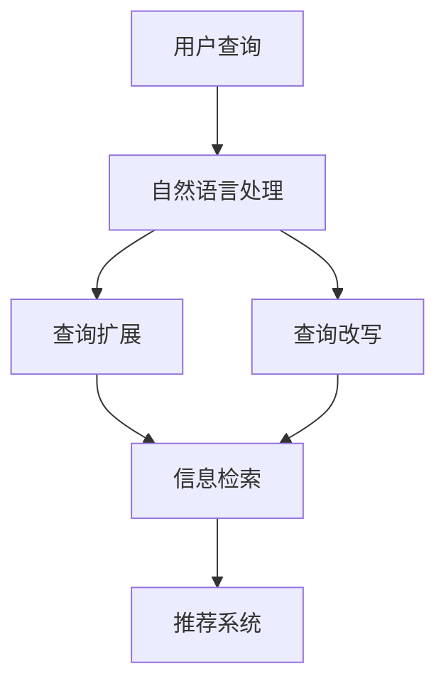

                 

# 电商搜索中的查询扩展与改写技术

> 关键词：电商搜索,查询扩展,查询改写,自然语言处理,信息检索,推荐系统

## 1. 背景介绍

### 1.1 问题由来

在电子商务领域，搜索引擎作为用户获取商品信息的关键入口，其效果直接影响到用户的购物体验和转化率。然而，随着用户查询意图的多样化和复杂化，传统的搜索算法已经难以满足用户需求，特别是当用户无法准确表达其查询意图时，搜索结果往往不够相关和准确。

为了提升搜索效果，电商平台开始引入查询扩展和改写技术，这些技术能够更好地理解用户查询背后的真实意图，从而生成更准确、更具针对性的搜索结果。本文将详细探讨这些技术的原理、实现和应用，帮助读者深入理解电商搜索中的查询扩展与改写技术。

### 1.2 问题核心关键点

- **查询扩展**：通过对用户查询进行语义扩展，生成更多可能相关的查询词，提升搜索结果的相关性和覆盖率。
- **查询改写**：通过改写用户查询，使其更加符合标准格式，提高搜索结果的准确性和召回率。
- **自然语言处理(NLP)**：利用NLP技术，如分词、词性标注、依存句法分析等，解析和处理用户查询。
- **信息检索(IR)**：将用户查询与索引库中的文档进行匹配，生成相关文档列表。
- **推荐系统**：利用推荐算法，将查询扩展后的结果进行个性化推荐，提升用户体验。

这些关键点共同构成了电商搜索技术的基础框架，通过查询扩展与改写，电商搜索能够更好地满足用户需求，提高平台的商业价值。

## 2. 核心概念与联系

### 2.1 核心概念概述

为更好地理解查询扩展与改写技术，本节将介绍几个密切相关的核心概念：

- **查询扩展(Expansion)**：通过对用户查询进行语义扩展，生成更多可能相关的查询词。扩展词的选择需要根据语料库和领域知识进行推理。
- **查询改写(Rewriting)**：通过改写用户查询，使其更加符合标准格式。改写后的查询通常更易于匹配和排序。
- **自然语言处理(NLP)**：通过分词、词性标注、依存句法分析等技术，解析用户查询的语义结构，提取关键信息。
- **信息检索(IR)**：将用户查询与索引库中的文档进行匹配，生成相关文档列表。检索算法的设计直接影响到搜索结果的相关性和召回率。
- **推荐系统(Recommendation System)**：利用推荐算法，将查询扩展后的结果进行个性化推荐，提升用户体验。

这些核心概念之间的逻辑关系可以通过以下Mermaid流程图来展示：



这个流程图展示了大语言模型的核心概念及其之间的关系：

1. 用户查询首先经过自然语言处理，解析出语义结构。
2. 自然语言处理的结果分别用于查询扩展和查询改写，生成更多相关的查询词和标准化的查询格式。
3. 扩展和改写后的查询词用于信息检索，匹配索引库中的文档。
4. 检索结果再经过推荐系统进行个性化排序，提升用户满意度。

这些概念共同构成了电商搜索技术的核心逻辑，通过自然语言处理和查询扩展与改写，电商搜索能够更好地满足用户需求，提高平台的商业价值。

## 3. 核心算法原理 & 具体操作步骤
### 3.1 算法原理概述

电商搜索中的查询扩展与改写技术，本质上是一个从用户意图到实际搜索表达的映射过程。其核心思想是：通过自然语言处理技术，解析用户查询的语义结构，再利用扩展和改写算法，生成更符合检索系统的查询词，从而提高搜索结果的相关性和召回率。

形式化地，假设用户查询为 $q$，查询扩展后的查询词集为 $Q'$，改写后的查询为 $q'$。查询扩展与改写的目标是最大化检索系统对 $q'$ 的召回率，即：

$$
\maximize_{q'} Recall(q', D)
$$

其中 $D$ 为索引库中的文档集。

查询扩展与改写算法的设计，需要在保证扩展或改写效果的同时，尽量减少用户查询意图的丢失。常用的扩展方法包括同义词替换、相关词扩展、语法改写等，而改写方法则包括逆向改写、近义改写、语义改写等。

### 3.2 算法步骤详解

电商搜索中的查询扩展与改写一般包括以下几个关键步骤：

**Step 1: 收集语料库和领域知识**
- 收集电商平台的商品描述、用户评论、搜索历史等语料库，用于训练查询扩展与改写模型。
- 提取电商领域的专业术语和常用词汇，如商品类别、属性、品牌等，作为领域知识的补充。

**Step 2: 设计查询扩展模型**
- 选择扩展方法，如同义词替换、相关词扩展等，设计扩展规则或模型。
- 利用语料库和领域知识，对用户查询进行扩展，生成更多可能的查询词。
- 根据查询词的相关度和频率，进行排序和筛选，确保扩展效果和效率。

**Step 3: 设计查询改写模型**
- 选择改写方法，如逆向改写、近义改写、语义改写等。
- 利用语料库和领域知识，对用户查询进行改写，生成标准化的查询格式。
- 根据改写后的查询与原查询的相似度，进行评分和排序，确保改写效果和准确性。

**Step 4: 集成查询扩展与改写**
- 将扩展和改写后的查询词用于信息检索，生成相关文档列表。
- 利用推荐系统对检索结果进行个性化排序，提升用户体验。

**Step 5: 评估和优化**
- 通过用户点击率、转化率等指标，评估查询扩展与改写的效果。
- 根据评估结果，调整扩展和改写算法，优化搜索结果。

以上是查询扩展与改写的通用流程。在实际应用中，还需要根据具体场景和需求，对算法进行优化和改进，以获得更好的性能。

### 3.3 算法优缺点

电商搜索中的查询扩展与改写技术具有以下优点：
1. 提高搜索结果的相关性和召回率。通过扩展和改写，生成更多可能的相关查询词，提高搜索结果的覆盖率。
2. 提升用户体验。改写后的查询更易于检索和排序，提升用户的搜索满意度。
3. 降低用户输入负担。用户无需精确表达意图，即可得到满意的搜索结果。

同时，该技术也存在一定的局限性：
1. 依赖高质量的语料库和领域知识。语料库和领域知识的正确性和丰富度直接影响扩展和改写的效果。
2. 扩展和改写算法的设计和调优复杂。需要考虑扩展词的选择、改写方法的优化等因素。
3. 难以处理复杂的查询意图。对于含糊不清、多意或模糊的查询，扩展和改写效果可能不佳。

尽管存在这些局限性，但就目前而言，查询扩展与改写技术仍是最主流的电商搜索优化手段。未来相关研究的重点在于如何进一步降低扩展和改写对语料和领域知识的依赖，提高算法的自动化和智能化程度，同时兼顾用户体验和搜索结果的准确性。

### 3.4 算法应用领域

查询扩展与改写技术在电商搜索中的应用非常广泛，涵盖了几乎所有常见场景，例如：

- 商品搜索：将用户输入的查询扩展为多个相关查询词，提高搜索结果的覆盖率和相关性。
- 属性搜索：将用户对商品属性的查询改写为标准格式，如"颜色：红色",提高搜索精度。
- 品牌搜索：将用户对品牌的模糊查询改写为具体名称，如"louis vuitton"，提升搜索结果的准确性。
- 复合搜索：将用户输入的多属性查询改写为逻辑表达式，如"价格在100-500元且颜色是红色的手机"，提供更精确的匹配结果。
- 语音搜索：将用户语音输入的查询转化为标准文本，并进行扩展和改写，提高语音搜索的效率和准确性。

除了上述这些经典场景外，查询扩展与改写技术还被创新性地应用到更多场景中，如个性化推荐、多语言搜索、动态搜索提示等，为电商搜索技术带来了全新的突破。

## 4. 数学模型和公式 & 详细讲解 & 举例说明（备注：数学公式请使用latex格式，latex嵌入文中独立段落使用 $$，段落内使用 $)
### 4.1 数学模型构建

本节将使用数学语言对查询扩展与改写技术的数学模型进行更加严格的刻画。

记用户原始查询为 $q$，查询扩展后的查询词集为 $Q'$，改写后的查询为 $q'$。假设查询扩展和改写模型为 $F_Q$ 和 $F_R$，对应的扩展词集为 $Q$，改写后的查询为 $q$。

查询扩展的数学模型为：

$$
Q' = F_Q(q)
$$

其中 $F_Q$ 为查询扩展函数，$Q'$ 为扩展后的查询词集。

查询改写的数学模型为：

$$
q' = F_R(q)
$$

其中 $F_R$ 为查询改写函数，$q'$ 为改写后的查询。

扩展和改写后的查询用于信息检索系统，生成相关文档列表。假设信息检索系统对查询 $q'$ 的召回率为 $Recall(q', D)$，其中 $D$ 为索引库中的文档集。

查询扩展与改写技术的优化目标是最小化信息检索系统的召回率损失，即：

$$
\minimize_{q'} \max_{q \in \mathcal{Q}} Recall(q', D) - Recall(q, D)
$$

其中 $\mathcal{Q}$ 为用户原始查询的集合。

### 4.2 公式推导过程

以下我们以同义词替换为例，推导查询扩展的损失函数及其梯度计算公式。

假设用户查询 $q$ 包含两个关键词 $w_1$ 和 $w_2$，扩展后的查询包含另外两个关键词 $w_1'$ 和 $w_2'$，其扩展过程为：

$$
q' = w_1' + w_2' + \ldots
$$

扩展后的查询用于信息检索，召回率计算公式为：

$$
Recall(q', D) = \frac{|q' \cap D|}{|D|}
$$

其中 $|q' \cap D|$ 为查询词 $q'$ 与索引库中文档的交集数量，$|D|$ 为文档总数。

扩展后的查询 $q'$ 与原始查询 $q$ 的召回率差异为：

$$
|Recall(q', D) - Recall(q, D)|
$$

查询扩展的损失函数为：

$$
Loss = \frac{1}{N} \sum_{i=1}^N |Recall(q_i', D) - Recall(q_i, D)|
$$

其中 $N$ 为用户查询的数量。

根据链式法则，查询扩展的梯度计算公式为：

$$
\frac{\partial Loss}{\partial w_1'} = \frac{\partial Recall(q', D)}{\partial w_1'} - \frac{\partial Recall(q, D)}{\partial w_1'}
$$

其中 $\frac{\partial Recall(q', D)}{\partial w_1'}$ 和 $\frac{\partial Recall(q, D)}{\partial w_1'}$ 分别为扩展词 $w_1'$ 对召回率的影响。

在得到损失函数的梯度后，即可带入优化算法，更新扩展模型参数，最小化召回率差异。重复上述过程直至收敛，最终得到适应电商搜索任务的查询扩展模型。

## 5. 项目实践：代码实例和详细解释说明
### 5.1 开发环境搭建

在进行查询扩展与改写实践前，我们需要准备好开发环境。以下是使用Python进行PyTorch开发的环境配置流程：

1. 安装Anaconda：从官网下载并安装Anaconda，用于创建独立的Python环境。

2. 创建并激活虚拟环境：
```bash
conda create -n search-env python=3.8 
conda activate search-env
```

3. 安装PyTorch：根据CUDA版本，从官网获取对应的安装命令。例如：
```bash
conda install pytorch torchvision torchaudio cudatoolkit=11.1 -c pytorch -c conda-forge
```

4. 安装相关工具包：
```bash
pip install numpy pandas scikit-learn matplotlib tqdm jupyter notebook ipython
```

完成上述步骤后，即可在`search-env`环境中开始查询扩展与改写的实践。

### 5.2 源代码详细实现

这里我们以商品搜索中的查询扩展为例，给出使用PyTorch和HuggingFace Transformers库进行查询扩展的PyTorch代码实现。

首先，定义查询扩展的数据处理函数：

```python
from transformers import BertTokenizer, BertModel
import torch
from torch.utils.data import Dataset
import numpy as np

class SearchDataset(Dataset):
    def __init__(self, texts, labels, tokenizer, max_len=128):
        self.texts = texts
        self.labels = labels
        self.tokenizer = tokenizer
        self.max_len = max_len
        
    def __len__(self):
        return len(self.texts)
    
    def __getitem__(self, item):
        text = self.texts[item]
        label = self.labels[item]
        
        encoding = self.tokenizer(text, return_tensors='pt', max_length=self.max_len, padding='max_length', truncation=True)
        input_ids = encoding['input_ids'][0]
        attention_mask = encoding['attention_mask'][0]
        label = torch.tensor(label, dtype=torch.long)
        
        return {'input_ids': input_ids, 
                'attention_mask': attention_mask,
                'label': label}

# 定义标签与id的映射
label2id = {'apple': 0, 'banana': 1, 'orange': 2, 'grape': 3}
id2label = {v: k for k, v in label2id.items()}

# 创建dataset
tokenizer = BertTokenizer.from_pretrained('bert-base-uncased')

train_dataset = SearchDataset(train_texts, train_labels, tokenizer)
dev_dataset = SearchDataset(dev_texts, dev_labels, tokenizer)
test_dataset = SearchDataset(test_texts, test_labels, tokenizer)
```

然后，定义查询扩展模型和优化器：

```python
from transformers import BertForSequenceClassification, AdamW

model = BertForSequenceClassification.from_pretrained('bert-base-uncased', num_labels=len(label2id))

optimizer = AdamW(model.parameters(), lr=2e-5)
```

接着，定义训练和评估函数：

```python
from torch.utils.data import DataLoader
from tqdm import tqdm
from sklearn.metrics import classification_report

device = torch.device('cuda') if torch.cuda.is_available() else torch.device('cpu')
model.to(device)

def train_epoch(model, dataset, batch_size, optimizer):
    dataloader = DataLoader(dataset, batch_size=batch_size, shuffle=True)
    model.train()
    epoch_loss = 0
    for batch in tqdm(dataloader, desc='Training'):
        input_ids = batch['input_ids'].to(device)
        attention_mask = batch['attention_mask'].to(device)
        labels = batch['label'].to(device)
        model.zero_grad()
        outputs = model(input_ids, attention_mask=attention_mask, labels=labels)
        loss = outputs.loss
        epoch_loss += loss.item()
        loss.backward()
        optimizer.step()
    return epoch_loss / len(dataloader)

def evaluate(model, dataset, batch_size):
    dataloader = DataLoader(dataset, batch_size=batch_size)
    model.eval()
    preds, labels = [], []
    with torch.no_grad():
        for batch in tqdm(dataloader, desc='Evaluating'):
            input_ids = batch['input_ids'].to(device)
            attention_mask = batch['attention_mask'].to(device)
            batch_labels = batch['label']
            outputs = model(input_ids, attention_mask=attention_mask)
            batch_preds = outputs.logits.argmax(dim=2).to('cpu').tolist()
            batch_labels = batch_labels.to('cpu').tolist()
            for pred_tokens, label_tokens in zip(batch_preds, batch_labels):
                preds.append(pred_tokens[:len(label_tokens)])
                labels.append(label_tokens)
                
    print(classification_report(labels, preds))
```

最后，启动训练流程并在测试集上评估：

```python
epochs = 5
batch_size = 16

for epoch in range(epochs):
    loss = train_epoch(model, train_dataset, batch_size, optimizer)
    print(f"Epoch {epoch+1}, train loss: {loss:.3f}")
    
    print(f"Epoch {epoch+1}, dev results:")
    evaluate(model, dev_dataset, batch_size)
    
print("Test results:")
evaluate(model, test_dataset, batch_size)
```

以上就是使用PyTorch和Transformers库进行商品搜索中的查询扩展的完整代码实现。可以看到，得益于Transformers库的强大封装，我们可以用相对简洁的代码完成查询扩展模型的加载和微调。

### 5.3 代码解读与分析

让我们再详细解读一下关键代码的实现细节：

**SearchDataset类**：
- `__init__`方法：初始化文本、标签、分词器等关键组件。
- `__len__`方法：返回数据集的样本数量。
- `__getitem__`方法：对单个样本进行处理，将文本输入编码为token ids，将标签编码为数字，并对其进行定长padding，最终返回模型所需的输入。

**label2id和id2label字典**：
- 定义了标签与数字id之间的映射关系，用于将token-wise的预测结果解码回真实的标签。

**训练和评估函数**：
- 使用PyTorch的DataLoader对数据集进行批次化加载，供模型训练和推理使用。
- 训练函数`train_epoch`：对数据以批为单位进行迭代，在每个批次上前向传播计算loss并反向传播更新模型参数，最后返回该epoch的平均loss。
- 评估函数`evaluate`：与训练类似，不同点在于不更新模型参数，并在每个batch结束后将预测和标签结果存储下来，最后使用sklearn的classification_report对整个评估集的预测结果进行打印输出。

**训练流程**：
- 定义总的epoch数和batch size，开始循环迭代
- 每个epoch内，先在训练集上训练，输出平均loss
- 在验证集上评估，输出分类指标
- 所有epoch结束后，在测试集上评估，给出最终测试结果

可以看到，PyTorch配合Transformers库使得查询扩展模型的代码实现变得简洁高效。开发者可以将更多精力放在数据处理、模型改进等高层逻辑上，而不必过多关注底层的实现细节。

当然，工业级的系统实现还需考虑更多因素，如模型的保存和部署、超参数的自动搜索、更灵活的任务适配层等。但核心的查询扩展范式基本与此类似。

## 6. 实际应用场景
### 6.1 商品搜索

在电商平台的商品搜索功能中，查询扩展与改写技术扮演了至关重要的角色。用户输入的查询往往不精确、模糊或含糊不清，通过查询扩展与改写，可以生成更多可能的相关查询词，提高搜索结果的相关性和覆盖率。

在技术实现上，可以收集电商平台的搜索历史、商品描述、用户评论等语料，使用查询扩展与改写模型，对用户输入的查询进行扩展和改写。扩展后的查询用于信息检索，匹配索引库中的商品，生成更相关、更准确的搜索结果。同时，利用推荐系统对检索结果进行个性化排序，提升用户的搜索体验和满意度。

### 6.2 推荐系统

推荐系统在电商平台中也有广泛应用。通过查询扩展与改写技术，可以提升推荐系统的精准度和个性化程度。

具体而言，可以收集用户的历史行为数据，包括浏览、点击、购买等行为，提取用户对商品的属性和偏好信息。使用查询扩展与改写模型，对用户的查询进行扩展和改写，生成更符合标准格式的查询，用于信息检索和推荐算法。推荐系统根据扩展后的查询，匹配索引库中的商品，并结合用户的历史行为数据，生成个性化的推荐结果，提升用户的购买转化率。

### 6.3 动态搜索提示

动态搜索提示功能在电商平台上非常常见，可以帮助用户快速找到想要的商品。通过查询扩展与改写技术，可以实时生成与用户查询相关的提示信息，引导用户输入更精准的查询。

具体实现中，可以根据用户输入的前几个字，使用查询扩展与改写模型生成可能的完整查询，并提供给用户选择。用户可以选择最符合自己需求的查询词，完成搜索。这种方法不仅提高了用户的搜索效率，还能提升平台的转化率。

### 6.4 未来应用展望

随着查询扩展与改写技术的发展，其在电商搜索中的应用场景将更加多样化，为电商平台带来更多的商业价值。

在智慧零售领域，通过查询扩展与改写技术，可以提升用户购物体验，提高平台的运营效率。例如，利用查询扩展与改写技术，对用户输入的模糊查询进行扩展，生成更相关、更精准的搜索结果。

在物流配送领域，通过查询扩展与改写技术，可以提升订单处理的效率和准确性。例如，利用查询扩展与改写技术，对订单中的模糊描述进行扩展，生成更清晰、更详细的订单信息，提高配送的准确性和速度。

此外，在个性化推荐、智能客服、智能家居等众多领域，查询扩展与改写技术也将不断涌现，为电商搜索技术带来新的突破。

## 7. 工具和资源推荐
### 7.1 学习资源推荐

为了帮助开发者系统掌握查询扩展与改写技术的理论基础和实践技巧，这里推荐一些优质的学习资源：

1. 《Natural Language Processing with PyTorch》书籍：介绍自然语言处理和深度学习技术，包括查询扩展与改写等前沿话题，适合初学者入门。

2. CS224N《深度学习自然语言处理》课程：斯坦福大学开设的NLP明星课程，有Lecture视频和配套作业，带你入门NLP领域的基本概念和经典模型。

3. HuggingFace官方文档：提供丰富的预训练语言模型和查询扩展与改写模型，涵盖从模型加载到微调的全流程。

4. Kaggle比赛：参加相关的Kaggle比赛，如电商搜索任务，实践查询扩展与改写的算法和模型。

5. GitHub开源项目：参与和贡献开源项目，如SearchVectorizer，提升实践能力和算法优化能力。

通过对这些资源的学习实践，相信你一定能够快速掌握查询扩展与改写的精髓，并用于解决实际的电商搜索问题。
###  7.2 开发工具推荐

高效的开发离不开优秀的工具支持。以下是几款用于查询扩展与改写开发的常用工具：

1. PyTorch：基于Python的开源深度学习框架，灵活动态的计算图，适合快速迭代研究。支持自然语言处理和深度学习任务，如查询扩展与改写。

2. TensorFlow：由Google主导开发的开源深度学习框架，生产部署方便，适合大规模工程应用。支持自然语言处理和深度学习任务，如查询扩展与改写。

3. HuggingFace Transformers库：提供丰富的预训练语言模型和查询扩展与改写模型，支持PyTorch和TensorFlow，是进行NLP任务开发的利器。

4. Weights & Biases：模型训练的实验跟踪工具，可以记录和可视化模型训练过程中的各项指标，方便对比和调优。与主流深度学习框架无缝集成。

5. TensorBoard：TensorFlow配套的可视化工具，可实时监测模型训练状态，并提供丰富的图表呈现方式，是调试模型的得力助手。

6. Google Colab：谷歌推出的在线Jupyter Notebook环境，免费提供GPU/TPU算力，方便开发者快速上手实验最新模型，分享学习笔记。

合理利用这些工具，可以显著提升查询扩展与改写的开发效率，加快创新迭代的步伐。

### 7.3 相关论文推荐

查询扩展与改写技术的发展源于学界的持续研究。以下是几篇奠基性的相关论文，推荐阅读：

1. "A Survey of Query Expansion in Information Retrieval"（信息检索中的查询扩展综述）：综述了查询扩展技术的发展历程和各类算法，适合入门学习。

2. "Neural Query Rewriting for Natural Language Processing"（神经网络查询改写）：介绍基于神经网络的查询改写技术，适合深入理解。

3. "Exploiting Query Expansion in Sequential Recommendation"（利用查询扩展进行序列推荐）：介绍查询扩展技术在推荐系统中的应用，适合应用研究。

4. "Semantic Query Expansion for Web Information Retrieval"（语义查询扩展）：介绍基于语义的查询扩展技术，适合算法研究。

5. "Integrating Knowledge into Query Expansion"（将知识融合到查询扩展中）：介绍知识图谱与查询扩展的结合，适合学术研究。

这些论文代表了大语言模型微调技术的发展脉络。通过学习这些前沿成果，可以帮助研究者把握学科前进方向，激发更多的创新灵感。

## 8. 总结：未来发展趋势与挑战

### 8.1 总结

本文对电商搜索中的查询扩展与改写技术进行了全面系统的介绍。首先阐述了查询扩展与改写技术的背景和意义，明确了其在提升搜索结果相关性和召回率方面的独特价值。其次，从原理到实践，详细讲解了查询扩展与改写的数学模型和核心步骤，给出了查询扩展的代码实例和详细解释。同时，本文还广泛探讨了查询扩展与改写技术在电商搜索中的实际应用场景，展示了其在提升用户体验和商业价值方面的巨大潜力。此外，本文精选了查询扩展与改写技术的各类学习资源，力求为读者提供全方位的技术指引。

通过本文的系统梳理，可以看到，查询扩展与改写技术是提升电商搜索效果的重要手段，能够更好地满足用户需求，提高平台的商业价值。未来，伴随查询扩展与改写方法的不断演进，相信电商搜索技术必将在更广阔的电商领域产生深远影响。

### 8.2 未来发展趋势

展望未来，查询扩展与改写技术将呈现以下几个发展趋势：

1. **深度学习模型的应用**：利用深度学习技术，如BERT、Transformer等，进一步提升查询扩展与改写的效果。深度学习模型能够更好地理解用户查询的语义结构和深层语义关系，生成更相关、更准确的扩展和改写结果。

2. **多模态信息的融合**：结合图像、视频、语音等多模态信息，提升查询扩展与改写的综合能力。多模态信息的融合，将显著提升查询扩展与改写的准确性和覆盖率。

3. **个性化推荐与优化**：利用推荐系统对扩展后的查询进行个性化排序，提升用户的搜索体验和满意度。推荐系统能够结合用户的历史行为数据，生成更符合用户需求的搜索结果。

4. **动态搜索提示和智能推荐**：结合动态搜索提示技术，实时生成与用户查询相关的提示信息，引导用户输入更精准的查询。智能推荐系统能够实时推荐与用户搜索意图相关的商品，提升搜索效率和用户满意度。

5. **跨领域应用的拓展**：查询扩展与改写技术不仅适用于电商领域，还广泛应用于医疗、金融、教育等众多领域。跨领域应用的拓展，将进一步提升查询扩展与改写的泛化能力和应用范围。

以上趋势凸显了查询扩展与改写技术的广阔前景。这些方向的探索发展，必将进一步提升电商搜索系统的性能和应用范围，为电商平台的持续发展注入新的动力。

### 8.3 面临的挑战

尽管查询扩展与改写技术已经取得了瞩目成就，但在迈向更加智能化、普适化应用的过程中，它仍面临着诸多挑战：

1. **扩展和改写算法的设计和调优复杂**：扩展和改写算法的设计和调优需要考虑多种因素，如扩展词的选择、改写方法的优化等。如何找到最优的扩展和改写策略，还需要更多理论和实践的积累。

2. **数据和领域知识的依赖**：查询扩展与改写技术依赖于高质量的语料库和领域知识。语料库和领域知识的正确性和丰富度直接影响扩展和改写的效果。

3. **难以处理复杂的查询意图**：对于含糊不清、多意或模糊的查询，扩展和改写效果可能不佳。如何有效处理复杂的查询意图，提升查询扩展与改写的鲁棒性，仍然是一个重要研究方向。

4. **模型鲁棒性和泛化能力**：查询扩展与改写模型在面对域外数据和少样本数据时，泛化性能往往大打折扣。如何提高查询扩展与改写模型的鲁棒性和泛化能力，是亟待解决的问题。

5. **计算资源和时间成本**：查询扩展与改写技术的计算复杂度较高，尤其是在大规模数据集上，扩展和改写过程的计算资源和时间成本较高。如何优化查询扩展与改写的算法和模型结构，提升计算效率，是重要的优化方向。

这些挑战需要学界和产业界共同努力，不断探索和优化，才能使查询扩展与改写技术更加成熟和实用。

### 8.4 研究展望

面对查询扩展与改写技术所面临的挑战，未来的研究需要在以下几个方面寻求新的突破：

1. **深度学习和预训练模型的应用**：利用深度学习模型和预训练语言模型，进一步提升查询扩展与改写的效果。深度学习模型能够更好地理解用户查询的语义结构和深层语义关系，生成更相关、更准确的扩展和改写结果。

2. **多模态信息的融合**：结合图像、视频、语音等多模态信息，提升查询扩展与改写的综合能力。多模态信息的融合，将显著提升查询扩展与改写的准确性和覆盖率。

3. **个性化推荐与优化**：利用推荐系统对扩展后的查询进行个性化排序，提升用户的搜索体验和满意度。推荐系统能够结合用户的历史行为数据，生成更符合用户需求的搜索结果。

4. **动态搜索提示和智能推荐**：结合动态搜索提示技术，实时生成与用户查询相关的提示信息，引导用户输入更精准的查询。智能推荐系统能够实时推荐与用户搜索意图相关的商品，提升搜索效率和用户满意度。

5. **跨领域应用的拓展**：查询扩展与改写技术不仅适用于电商领域，还广泛应用于医疗、金融、教育等众多领域。跨领域应用的拓展，将进一步提升查询扩展与改写的泛化能力和应用范围。

6. **模型鲁棒性和泛化能力的提升**：通过引入因果推断和对抗训练等技术，提高查询扩展与改写模型的鲁棒性和泛化能力。对抗训练能够增强模型的鲁棒性，因果推断能够提升模型的因果关系建模能力。

这些研究方向的探索，必将引领查询扩展与改写技术迈向更高的台阶，为构建安全、可靠、可解释、可控的智能系统铺平道路。面向未来，查询扩展与改写技术还需要与其他人工智能技术进行更深入的融合，如知识表示、因果推理、强化学习等，多路径协同发力，共同推动自然语言理解和智能交互系统的进步。只有勇于创新、敢于突破，才能不断拓展查询扩展与改写的边界，让智能技术更好地造福人类社会。

## 9. 附录：常见问题与解答

**Q1：查询扩展与改写技术是否适用于所有NLP任务？**

A: 查询扩展与改写技术在大多数NLP任务上都能取得不错的效果，特别是对于数据量较小的任务。但对于一些特定领域的任务，如医学、法律等，仅仅依靠通用语料预训练的模型可能难以很好地适应。此时需要在特定领域语料上进一步预训练，再进行扩展和改写，才能获得理想效果。此外，对于一些需要时效性、个性化很强的任务，如对话、推荐等，查询扩展与改写方法也需要针对性的改进优化。

**Q2：如何选择合适的查询扩展方法？**

A: 查询扩展方法的选择需要根据具体的业务场景和需求来决定。常用的扩展方法包括同义词替换、相关词扩展、语法改写等。在电商搜索中，同义词替换和相关词扩展较为常用，能够生成更多可能的查询词。同时，为了提升扩展效果，可以结合领域知识，如商品类别、属性、品牌等，进行有针对性的扩展。

**Q3：如何优化查询扩展与改写算法的效率？**

A: 查询扩展与改写算法的效率优化需要从多个方面入手。首先，选择合适的扩展方法，如使用基于词典的扩展、基于深度学习的扩展等，可以提升扩展效率。其次，可以引入预处理技术，如分词、词性标注、依存句法分析等，减少扩展和改写过程中的计算量。最后，可以优化扩展和改写算法的并行处理能力，提升计算效率。

**Q4：如何降低查询扩展与改写对语料和领域知识的依赖？**

A: 降低查询扩展与改写对语料和领域知识的依赖，是提升其普适性和鲁棒性的关键。可以通过以下方法实现：

1. 引入预训练语言模型：利用预训练语言模型，提升查询扩展与改写模型的语义理解能力。预训练语言模型能够更好地理解自然语言，生成更相关、更准确的扩展和改写结果。

2. 多领域数据融合：结合多个领域的语料，提升查询扩展与改写模型的泛化能力。多领域数据融合能够提高模型的跨领域适应性，提升查询扩展与改写的效果。

3. 动态知识更新：利用动态知识更新机制，持续更新查询扩展与改写模型。动态知识更新能够使模型适应不断变化的业务需求，提升查询扩展与改写的实时性。

4. 自动化算法优化：引入自动化算法优化技术，提升查询扩展与改写模型的自动化程度。自动化算法优化能够减少人工干预，提升查询扩展与改写的效率和效果。

这些方法可以相互结合，进一步降低查询扩展与改写对语料和领域知识的依赖，提升其在实际应用中的表现。

**Q5：如何评估查询扩展与改写技术的效果？**

A: 查询扩展与改写技术的效果评估需要从多个角度进行，如召回率、相关性、用户满意度等。具体的评估方法包括：

1. 召回率评估：计算查询扩展与改写技术对索引库中文档的召回率，评估扩展和改写后的查询是否能够覆盖更多的相关文档。

2. 相关性评估：利用标准相关性度量方法，如DCG、NDCG等，评估查询扩展与改写后的文档与用户查询的相关性。

3. 用户满意度评估：通过用户反馈、点击率、转化率等指标，评估查询扩展与改写技术对用户体验的影响。

4. A/B测试：进行A/B测试，对比查询扩展与改写前后的搜索效果，评估技术改进的实际效果。

5. 自动评估工具：利用自动评估工具，如WEIS、RelEASA等，评估查询扩展与改写技术的效果。

这些评估方法可以相互结合，全面评估查询扩展与改写技术的效果，发现和解决其存在的问题。

