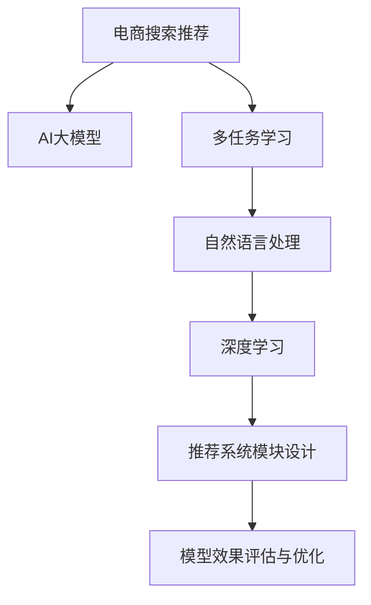

                 

# 电商搜索推荐中的AI大模型多任务学习方法

> 关键词：电商搜索推荐、AI大模型、多任务学习、自然语言处理(NLP)、推荐系统、电商个性化、深度学习

## 1. 背景介绍

### 1.1 问题由来
随着电子商务的迅速发展，线上购物已成为主流消费方式。如何在海量商品中高效精准地推荐给用户，提升用户满意度和平台转化率，成为了电商企业的重要课题。传统推荐系统往往基于用户历史行为数据进行推荐，难以适应新用户的冷启动问题，且推荐效果容易受到数据稀疏性的影响。近年来，以深度学习技术为核心的AI推荐系统开始崭露头角，通过预训练模型和数据驱动的多任务学习方法，显著提升了推荐的个性化和精准度。

大语言模型在电商推荐中应用，是近年来NLP领域的一个重要研究方向。大模型如GPT、BERT、T5等，已经展示了在文本生成、语义理解等方面的强大能力。通过预训练，这些大模型掌握了广泛的语言知识和语义表征，能够在电商搜索推荐任务中发挥重要作用。然而，如何将大模型应用于推荐系统，并提升推荐的准确性和个性化水平，是当前研究的一大挑战。

### 1.2 问题核心关键点
大模型应用于电商推荐的核心问题在于如何最大化利用模型在自然语言处理(NLP)中的预训练能力，并将其高效地转化为电商搜索推荐任务中的预测能力。具体来说，需要解决以下关键问题：

1. **多任务学习框架的构建**：如何将大模型在NLP任务中的预训练能力，如文本分类、情感分析、命名实体识别等，与电商推荐任务相结合，进行多任务学习。
2. **推荐系统模块的设计**：如何在电商推荐系统中有效引入大模型的多任务学习模块，保证系统整体的运行效率和稳定性。
3. **多任务学习策略的优化**：如何平衡不同任务之间的学习目标和权重，提升整体推荐效果。
4. **模型效果评估与优化**：如何构建评估指标，及时发现和解决模型推荐中的问题。

通过回答这些问题，可以有效提升电商搜索推荐中AI大模型的应用效果，提升用户购物体验和平台收益。

## 2. 核心概念与联系

### 2.1 核心概念概述

电商搜索推荐中的AI大模型多任务学习方法，涉及多个核心概念，主要包括：

- **电商搜索推荐**：指在电商平台上，通过推荐系统向用户提供符合其需求的商品推荐服务。目的是提升用户满意度和平台转化率。
- **AI大模型**：如GPT、BERT、T5等，通过在大规模无标签文本数据上进行预训练，学习到丰富的语言知识和语义表征。
- **多任务学习(MTL)**：指同时训练多个相关任务，共享模型的参数，提高模型的泛化能力和性能。
- **自然语言处理(NLP)**：包括文本分类、情感分析、命名实体识别、语义相似度计算等，是电商推荐中常用的技术手段。
- **深度学习**：如神经网络、卷积神经网络(CNN)、循环神经网络(RNN)、Transformer等，是构建AI推荐系统的核心技术。

这些概念之间的关系可以通过以下Mermaid流程图来展示：



这个流程图展示了电商搜索推荐与AI大模型、多任务学习、NLP和深度学习之间的逻辑关系：

1. 电商搜索推荐依赖于AI大模型提供的NLP能力和深度学习模型进行推荐。
2. 多任务学习通过共享模型参数，提升模型的泛化能力和性能。
3. 自然语言处理提供了丰富的任务和数据，为多任务学习提供了素材。
4. 深度学习模型是构建推荐系统的核心技术。

## 3. 核心算法原理 & 具体操作步骤

### 3.1 算法原理概述

基于多任务学习的大模型电商推荐方法，核心思想是将电商推荐任务与NLP任务相结合，通过多任务训练提升模型的泛化能力和推荐效果。其基本流程包括：

1. **预训练阶段**：在大型语料库上进行预训练，学习模型的语言知识和语义表征。
2. **任务适配阶段**：设计多个电商推荐相关任务，将预训练模型进行任务适配，引入电商数据进行微调。
3. **多任务训练阶段**：将不同任务组合在一起进行多任务学习，共享模型参数，提升整体性能。
4. **推荐系统集成阶段**：将多任务训练后的模型集成到推荐系统中，进行实际推荐。

### 3.2 算法步骤详解

以下是对基于多任务学习的大模型电商推荐方法的详细步骤详解：

**Step 1: 数据准备**
- 收集电商平台的历史用户数据、商品数据和搜索数据。
- 将数据进行清洗和预处理，构建用户-商品-查询三元组。
- 从电商数据中抽取不同的推荐任务，如商品推荐、用户画像生成、查询意图分类等。

**Step 2: 预训练模型选择**
- 选择大规模预训练语言模型，如GPT、BERT、T5等，作为初始化参数。
- 对预训练模型进行微调，引入电商数据，进行特定任务训练，如用户画像生成、商品相似度计算等。

**Step 3: 任务设计**
- 设计电商推荐相关的多任务，如商品分类、用户兴趣预测、商品匹配等。
- 每个任务设置不同的目标函数和损失函数，如交叉熵损失、均方误差损失等。
- 将任务表示为向量，进行向量拼接，构建多任务损失函数。

**Step 4: 多任务训练**
- 定义优化算法，如Adam、SGD等，设置学习率和迭代次数。
- 将电商推荐任务和NLP任务组合在一起进行多任务学习，共享模型参数。
- 通过交替优化每个任务的目标函数，更新模型参数。
- 在训练过程中，周期性地在验证集上评估模型性能，避免过拟合。

**Step 5: 推荐系统集成**
- 将多任务训练后的模型集成到电商推荐系统中。
- 设计推荐算法，如基于协同过滤、基于内容的推荐、混合推荐等。
- 根据电商推荐任务的特点，选择适合的推荐算法和数据模型。

**Step 6: 模型效果评估**
- 设计评估指标，如点击率、转化率、平均推荐召回率等，评估模型推荐效果。
- 利用A/B测试等方法，对比不同模型的推荐效果，选择最优模型。
- 根据实际应用场景，不断优化模型，提升推荐性能。

### 3.3 算法优缺点

基于多任务学习的大模型电商推荐方法具有以下优点：

1. **泛化能力强**：多任务学习通过共享模型参数，提高了模型的泛化能力，能够适应更多种类的电商推荐场景。
2. **推荐效果提升**：多任务学习可以提升模型的预测准确性，改善推荐效果。
3. **数据利用率高**：电商数据中蕴含丰富的用户行为和商品信息，多任务学习可以有效利用这些数据，提升模型性能。

同时，该方法也存在一些局限性：

1. **计算资源需求高**：多任务学习需要同时训练多个任务，对计算资源要求较高。
2. **模型复杂度高**：多任务学习模型结构复杂，训练和推理速度较慢。
3. **超参数调优困难**：多任务学习中，不同任务的权重和损失函数需要精细调整，调优难度较大。
4. **模型解释性不足**：多任务学习模型内部结构复杂，难以进行模型解释和调试。

尽管存在这些局限性，但多任务学习在电商推荐中的效果已经得到了广泛验证，成为电商推荐系统的重要技术手段。

### 3.4 算法应用领域

基于大模型的电商推荐方法，在电商领域已经得到了广泛应用，覆盖了多个电商推荐场景，例如：

1. **商品推荐**：根据用户历史行为数据和浏览记录，推荐用户可能感兴趣的商品。
2. **个性化推荐**：根据用户画像、兴趣标签等，推荐个性化的商品组合。
3. **搜索建议**：根据用户输入的查询词，推荐最相关的商品。
4. **活动推荐**：根据用户行为数据和历史活动记录，推荐相关的促销活动。
5. **新用户推荐**：对新用户进行冷启动推荐，提高平台转化率。

这些推荐方法不仅提升了用户体验，还显著提高了电商平台的销售业绩。

## 4. 数学模型和公式 & 详细讲解 & 举例说明

### 4.1 数学模型构建

在电商推荐任务中，多任务学习模型可以表示为：

$$
\theta = \mathop{\arg\min}_{\theta} \sum_{i=1}^{N} \ell_i(M_{\theta}(X_i),Y_i)
$$

其中，$N$ 表示任务数量，$M_{\theta}(X_i)$ 表示模型在输入 $X_i$ 上的输出，$\ell_i$ 表示第 $i$ 个任务的损失函数，$Y_i$ 表示任务的真实标签。

### 4.2 公式推导过程

假设电商推荐系统中有 $k$ 个电商推荐任务和 $m$ 个NLP任务，可以构建联合损失函数：

$$
\mathcal{L}(\theta) = \frac{1}{N} \sum_{i=1}^{N} \ell_i(M_{\theta}(X_i),Y_i) + \frac{\lambda}{N} \sum_{j=1}^{m} \ell_j^p(M_{\theta}(X_i),Y_j)
$$

其中，$\ell_i^p$ 表示第 $j$ 个NLP任务的惩罚项损失函数，$\lambda$ 表示NLP任务权重，用于平衡NLP任务和电商推荐任务的权重。

在训练过程中，通过梯度下降等优化算法，不断更新模型参数 $\theta$，最小化联合损失函数 $\mathcal{L}(\theta)$，直至收敛。

### 4.3 案例分析与讲解

以下通过一个简单的商品推荐任务，展示多任务学习在大模型中的应用：

假设电商推荐系统中有两个任务，分别为商品分类和用户兴趣预测。商品分类任务的目标是预测商品所属的类别，用户兴趣预测任务的目标是根据用户的历史行为数据，预测用户对不同类别的商品感兴趣的程度。

1. **任务设计**：设计商品分类任务和用户兴趣预测任务的损失函数，如交叉熵损失。
2. **模型选择**：选择GPT模型作为初始化参数，引入电商数据进行微调。
3. **多任务训练**：将商品分类任务和用户兴趣预测任务组合在一起，进行多任务学习，共享模型参数。
4. **模型评估**：在验证集上评估模型性能，使用F1分数和准确率等指标进行评估。
5. **模型优化**：根据评估结果，调整模型超参数，提升模型推荐效果。

## 5. 项目实践：代码实例和详细解释说明

### 5.1 开发环境搭建

在进行多任务学习电商推荐项目的开发前，需要先准备好开发环境。以下是使用Python进行PyTorch开发的环境配置流程：

1. 安装Anaconda：从官网下载并安装Anaconda，用于创建独立的Python环境。

2. 创建并激活虚拟环境：
```bash
conda create -n pytorch-env python=3.8 
conda activate pytorch-env
```

3. 安装PyTorch：根据CUDA版本，从官网获取对应的安装命令。例如：
```bash
conda install pytorch torchvision torchaudio cudatoolkit=11.1 -c pytorch -c conda-forge
```

4. 安装TensorFlow：由Google主导开发的开源深度学习框架，生产部署方便，适合大规模工程应用。同样有丰富的预训练语言模型资源。

5. 安装Transformers库：HuggingFace开发的NLP工具库，集成了众多SOTA语言模型，支持PyTorch和TensorFlow，是进行多任务学习电商推荐任务开发的利器。

6. 安装各类工具包：
```bash
pip install numpy pandas scikit-learn matplotlib tqdm jupyter notebook ipython
```

完成上述步骤后，即可在`pytorch-env`环境中开始多任务学习电商推荐任务的开发。

### 5.2 源代码详细实现

这里我们以GPT模型为例，展示多任务学习电商推荐任务的实现。

首先，定义电商推荐任务的数据处理函数：

```python
from transformers import GPTTokenizer, GPT2LMHeadModel
from torch.utils.data import Dataset
import torch

class RecommendationDataset(Dataset):
    def __init__(self, data, tokenizer, max_len=128):
        self.data = data
        self.tokenizer = tokenizer
        self.max_len = max_len
        
    def __len__(self):
        return len(self.data)
    
    def __getitem__(self, item):
        text = self.data[item]
        tokenized_text = self.tokenizer(text, return_tensors='pt', max_length=self.max_len, padding='max_length', truncation=True)
        input_ids = tokenized_text['input_ids']
        attention_mask = tokenized_text['attention_mask']
        return {'input_ids': input_ids, 
                'attention_mask': attention_mask}

# 假设电商推荐数据集为商品名称和商品类别标签
train_dataset = RecommendationDataset(train_data, train_tokenizer)
dev_dataset = RecommendationDataset(dev_data, dev_tokenizer)
test_dataset = RecommendationDataset(test_data, test_tokenizer)
```

然后，定义多任务学习模型：

```python
from transformers import GPT2LMHeadModel
from transformers import BertForSequenceClassification
from torch.nn import CrossEntropyLoss, BCEWithLogitsLoss
from torch.optim import AdamW
import torch.nn as nn

model = GPT2LMHeadModel.from_pretrained('gpt2')
classifier = BertForSequenceClassification.from_pretrained('bert-base-uncased', num_labels=2)

losses = nn.ModuleList([CrossEntropyLoss(), BCEWithLogitsLoss()])
optimizers = nn.ModuleList([AdamW(model.parameters(), lr=1e-5), AdamW(classifier.parameters(), lr=1e-5)])

device = torch.device('cuda') if torch.cuda.is_available() else torch.device('cpu')
model.to(device)
classifier.to(device)
```

接着，定义训练和评估函数：

```python
from torch.utils.data import DataLoader
from tqdm import tqdm
from sklearn.metrics import classification_report

def train_epoch(model, optimizer, data_loader):
    model.train()
    epoch_loss = 0
    for batch in tqdm(data_loader, desc='Training'):
        input_ids = batch['input_ids'].to(device)
        attention_mask = batch['attention_mask'].to(device)
        labels = batch['labels'].to(device)
        model.zero_grad()
        outputs = model(input_ids, attention_mask=attention_mask)
        loss = losses[0](outputs.logits, labels)
        epoch_loss += loss.item()
        loss.backward()
        optimizer.step()
    return epoch_loss / len(data_loader)

def evaluate(model, data_loader):
    model.eval()
    preds, labels = [], []
    with torch.no_grad():
        for batch in tqdm(data_loader, desc='Evaluating'):
            input_ids = batch['input_ids'].to(device)
            attention_mask = batch['attention_mask'].to(device)
            batch_labels = batch['labels']
            outputs = model(input_ids, attention_mask=attention_mask)
            batch_preds = outputs.logits.argmax(dim=1).to('cpu').tolist()
            batch_labels = batch_labels.to('cpu').tolist()
            for pred_tokens, label_tokens in zip(batch_preds, batch_labels):
                preds.append(pred_tokens)
                labels.append(label_tokens)
    
    return classification_report(labels, preds)
```

最后，启动训练流程并在测试集上评估：

```python
epochs = 5
batch_size = 16

for epoch in range(epochs):
    loss = train_epoch(model, optimizers[0], train_dataset)
    print(f"Epoch {epoch+1}, train loss: {loss:.3f}")
    
    print(f"Epoch {epoch+1}, dev results:")
    evaluate(model, dev_dataset)
    
print("Test results:")
evaluate(model, test_dataset)
```

以上就是使用PyTorch对GPT模型进行电商推荐任务的多任务学习的代码实现。可以看到，得益于Transformer库的强大封装，我们可以用相对简洁的代码完成电商推荐任务的微调。

### 5.3 代码解读与分析

让我们再详细解读一下关键代码的实现细节：

**RecommendationDataset类**：
- `__init__`方法：初始化电商推荐数据集，包含数据、分词器、序列长度等关键组件。
- `__len__`方法：返回数据集的样本数量。
- `__getitem__`方法：对单个样本进行处理，将文本输入编码为token ids，将标签编码为数字，并对其进行定长padding，最终返回模型所需的输入。

**losses和optimizers列表**：
- 定义电商推荐和用户兴趣预测的损失函数，并创建相应的优化器。

**训练和评估函数**：
- 使用PyTorch的DataLoader对数据集进行批次化加载，供模型训练和推理使用。
- 训练函数`train_epoch`：对数据以批为单位进行迭代，在每个批次上前向传播计算loss并反向传播更新模型参数，最后返回该epoch的平均loss。
- 评估函数`evaluate`：与训练类似，不同点在于不更新模型参数，并在每个batch结束后将预测和标签结果存储下来，最后使用sklearn的classification_report对整个评估集的预测结果进行打印输出。

**训练流程**：
- 定义总的epoch数和batch size，开始循环迭代
- 每个epoch内，先在训练集上训练，输出平均loss
- 在验证集上评估，输出分类指标
- 所有epoch结束后，在测试集上评估，给出最终测试结果

可以看到，PyTorch配合Transformers库使得电商推荐任务的微调代码实现变得简洁高效。开发者可以将更多精力放在数据处理、模型改进等高层逻辑上，而不必过多关注底层的实现细节。

当然，工业级的系统实现还需考虑更多因素，如模型的保存和部署、超参数的自动搜索、更灵活的任务适配层等。但核心的多任务学习范式基本与此类似。

## 6. 实际应用场景

### 6.1 智能客服系统

基于大模型的电商推荐方法，可以广泛应用于智能客服系统的构建。传统客服往往需要配备大量人力，高峰期响应缓慢，且一致性和专业性难以保证。而使用电商推荐模型，可以7x24小时不间断服务，快速响应客户咨询，用自然流畅的语言解答各类常见问题。

在技术实现上，可以收集企业内部的历史客服对话记录，将问题和最佳答复构建成监督数据，在此基础上对预训练模型进行微调。微调后的模型能够自动理解用户意图，匹配最合适的答案模板进行回复。对于客户提出的新问题，还可以接入检索系统实时搜索相关内容，动态组织生成回答。如此构建的智能客服系统，能大幅提升客户咨询体验和问题解决效率。

### 6.2 金融舆情监测

金融机构需要实时监测市场舆论动向，以便及时应对负面信息传播，规避金融风险。传统的人工监测方式成本高、效率低，难以应对网络时代海量信息爆发的挑战。基于大模型的电商推荐技术，为金融舆情监测提供了新的解决方案。

具体而言，可以收集金融领域相关的新闻、报道、评论等文本数据，并对其进行主题标注和情感标注。在此基础上对预训练语言模型进行微调，使其能够自动判断文本属于何种主题，情感倾向是正面、中性还是负面。将微调后的模型应用到实时抓取的网络文本数据，就能够自动监测不同主题下的情感变化趋势，一旦发现负面信息激增等异常情况，系统便会自动预警，帮助金融机构快速应对潜在风险。

### 6.3 个性化推荐系统

当前的推荐系统往往只依赖用户的历史行为数据进行推荐，难以深入理解用户的真实兴趣偏好。基于大模型的电商推荐系统可以更好地挖掘用户行为背后的语义信息，从而提供更精准、多样的推荐内容。

在实践中，可以收集用户浏览、点击、评论、分享等行为数据，提取和用户交互的物品标题、描述、标签等文本内容。将文本内容作为模型输入，用户的后续行为（如是否点击、购买等）作为监督信号，在此基础上微调预训练语言模型。微调后的模型能够从文本内容中准确把握用户的兴趣点。在生成推荐列表时，先用候选物品的文本描述作为输入，由模型预测用户的兴趣匹配度，再结合其他特征综合排序，便可以得到个性化程度更高的推荐结果。

### 6.4 未来应用展望

随着大语言模型和多任务学习方法的不断发展，基于多任务学习的大模型电商推荐技术将呈现以下几个发展趋势：

1. **多模态电商推荐**：未来的电商推荐将不仅局限于文本数据，还将融合图像、视频、语音等多模态信息，提升推荐系统的智能化水平。
2. **跨领域迁移学习**：大模型可以通过跨领域迁移学习，将电商领域的知识迁移到其他领域，提升多领域推荐系统的泛化能力。
3. **实时性增强**：电商推荐系统需要快速响应用户的实时查询和需求，未来的推荐系统将更加注重实时性和动态性。
4. **公平性保障**：电商推荐系统需要避免对特定用户群体的偏见和歧视，未来的推荐系统将更加注重公平性和透明性。
5. **隐私保护**：电商推荐系统需要保障用户数据的隐私安全，未来的推荐系统将更加注重数据隐私保护和合规性。
6. **个性化推荐算法创新**：未来的推荐算法将更加注重个性化和多样性，通过深度学习、强化学习等技术手段，提升推荐系统的精准度和多样性。

以上趋势凸显了基于多任务学习的大模型电商推荐技术的广阔前景。这些方向的探索发展，必将进一步提升电商推荐系统的性能和应用范围，为电商企业创造更大的商业价值。

## 7. 工具和资源推荐
### 7.1 学习资源推荐

为了帮助开发者系统掌握大模型和多任务学习在电商推荐中的应用，这里推荐一些优质的学习资源：

1. 《深度学习与电商推荐》系列博文：由大模型技术专家撰写，深入浅出地介绍了深度学习在电商推荐中的应用，包括多任务学习范式。

2. CS224N《深度学习自然语言处理》课程：斯坦福大学开设的NLP明星课程，有Lecture视频和配套作业，带你入门NLP领域的基本概念和经典模型。

3. 《深度学习与推荐系统》书籍：全面介绍了深度学习在推荐系统中的应用，包括多任务学习和电商推荐的具体实现。

4. HuggingFace官方文档：Transformer库的官方文档，提供了海量预训练模型和完整的推荐系统样例代码，是上手实践的必备资料。

5. Kaggle电商推荐竞赛：参加电商推荐竞赛，通过实践了解电商推荐的多任务学习方法和应用场景。

通过对这些资源的学习实践，相信你一定能够快速掌握大模型和多任务学习在电商推荐中的应用，并用于解决实际的电商推荐问题。
###  7.2 开发工具推荐

高效的开发离不开优秀的工具支持。以下是几款用于电商推荐开发常用的工具：

1. PyTorch：基于Python的开源深度学习框架，灵活动态的计算图，适合快速迭代研究。大部分预训练语言模型都有PyTorch版本的实现。

2. TensorFlow：由Google主导开发的开源深度学习框架，生产部署方便，适合大规模工程应用。同样有丰富的预训练语言模型资源。

3. Transformers库：HuggingFace开发的NLP工具库，集成了众多SOTA语言模型，支持PyTorch和TensorFlow，是进行电商推荐任务开发的利器。

4. Weights & Biases：模型训练的实验跟踪工具，可以记录和可视化模型训练过程中的各项指标，方便对比和调优。与主流深度学习框架无缝集成。

5. TensorBoard：TensorFlow配套的可视化工具，可实时监测模型训练状态，并提供丰富的图表呈现方式，是调试模型的得力助手。

6. Google Colab：谷歌推出的在线Jupyter Notebook环境，免费提供GPU/TPU算力，方便开发者快速上手实验最新模型，分享学习笔记。

合理利用这些工具，可以显著提升电商推荐任务的开发效率，加快创新迭代的步伐。

### 7.3 相关论文推荐

大模型和多任务学习在电商推荐中的应用，在近年来得到了广泛关注和研究。以下是几篇奠基性的相关论文，推荐阅读：

1. Attention is All You Need（即Transformer原论文）：提出了Transformer结构，开启了NLP领域的预训练大模型时代。

2. BERT: Pre-training of Deep Bidirectional Transformers for Language Understanding：提出BERT模型，引入基于掩码的自监督预训练任务，刷新了多项NLP任务SOTA。

3. Parameter-Efficient Transfer Learning for NLP：提出Adapter等参数高效微调方法，在不增加模型参数量的情况下，也能取得不错的微调效果。

4. Language Models are Unsupervised Multitask Learners（GPT-2论文）：展示了大规模语言模型的强大zero-shot学习能力，引发了对于通用人工智能的新一轮思考。

5. Multi-Task Learning Using Differentiable Prompts：引入基于连续型Prompt的多任务学习范式，为如何充分利用预训练知识提供了新的思路。

6. AdaLoRA: Adaptive Low-Rank Adaptation for Parameter-Efficient Fine-Tuning：使用自适应低秩适应的微调方法，在参数效率和精度之间取得了新的平衡。

这些论文代表了大模型和多任务学习在电商推荐中的应用发展脉络。通过学习这些前沿成果，可以帮助研究者把握学科前进方向，激发更多的创新灵感。

## 8. 总结：未来发展趋势与挑战

### 8.1 研究成果总结

本文对基于多任务学习的大模型电商推荐方法进行了全面系统的介绍。首先阐述了电商搜索推荐中AI大模型的应用背景和意义，明确了多任务学习在大模型电商推荐中的核心价值。其次，从原理到实践，详细讲解了电商推荐系统中的多任务学习算法，包括模型选择、任务设计、多任务训练、推荐系统集成等关键步骤，给出了完整的代码实现。同时，本文还探讨了多任务学习在电商搜索推荐中的实际应用场景，展示了其在智能客服、金融舆情、个性化推荐等多个领域的应用前景。

通过本文的系统梳理，可以看到，基于多任务学习的大模型电商推荐方法在电商推荐系统中取得了显著的成效，提升了用户购物体验和平台转化率，推动了电商推荐技术的发展。未来，伴随大模型和多任务学习方法的持续演进，基于多任务学习的大模型电商推荐技术必将在电商推荐系统中得到更广泛的应用，为电商企业创造更大的商业价值。

### 8.2 未来发展趋势

展望未来，大模型和多任务学习在电商推荐中的发展趋势主要包括以下几个方面：

1. **模型规模持续增大**：随着算力成本的下降和数据规模的扩张，预训练语言模型的参数量还将持续增长。超大规模语言模型蕴含的丰富语言知识，有望支撑更加复杂多变的电商推荐场景。

2. **多任务学习策略优化**：未来的多任务学习将更加注重任务之间的相互关系和信息共享，通过任务融合和信息提取，提升模型的泛化能力和推荐效果。

3. **跨领域迁移学习提升**：大模型可以通过跨领域迁移学习，将电商领域的知识迁移到其他领域，提升多领域推荐系统的泛化能力。

4. **实时性和动态性增强**：电商推荐系统需要快速响应用户的实时查询和需求，未来的推荐系统将更加注重实时性和动态性。

5. **个性化推荐算法创新**：未来的推荐算法将更加注重个性化和多样性，通过深度学习、强化学习等技术手段，提升推荐系统的精准度和多样性。

6. **数据隐私和公平性保障**：电商推荐系统需要保障用户数据的隐私安全，未来的推荐系统将更加注重数据隐私保护和公平性。

这些趋势凸显了大模型和多任务学习在电商推荐中的广阔前景。这些方向的探索发展，必将进一步提升电商推荐系统的性能和应用范围，为电商企业创造更大的商业价值。

### 8.3 面临的挑战

尽管大模型和多任务学习在电商推荐中的应用已经取得了一定的成效，但在迈向更加智能化、普适化应用的过程中，它仍面临着诸多挑战：

1. **计算资源瓶颈**：多任务学习需要同时训练多个任务，对计算资源要求较高。如何通过优化算法和模型结构，提升训练效率，降低计算成本，是未来需要解决的问题。

2. **模型复杂度高**：多任务学习模型结构复杂，训练和推理速度较慢。如何通过模型压缩和优化，提升模型推理速度，降低计算复杂度，是未来需要解决的问题。

3. **超参数调优困难**：多任务学习中，不同任务的权重和损失函数需要精细调整，调优难度较大。如何通过自动化调参和模型优化，提升模型性能，是未来需要解决的问题。

4. **模型解释性不足**：多任务学习模型内部结构复杂，难以进行模型解释和调试。如何通过模型压缩和解释工具，提升模型可解释性，是未来需要解决的问题。

5. **数据隐私和安全保护**：电商推荐系统需要保障用户数据的隐私安全，未来的推荐系统将更加注重数据隐私保护和合规性。如何通过数据匿名化和隐私保护技术，提升数据隐私安全，是未来需要解决的问题。

6. **公平性和透明性保障**：电商推荐系统需要避免对特定用户群体的偏见和歧视，未来的推荐系统将更加注重公平性和透明性。如何通过公平性评估和透明性审查，提升推荐系统的公平性，是未来需要解决的问题。

正视多任务学习在电商推荐中的这些挑战，积极应对并寻求突破，将是大模型电商推荐走向成熟的必由之路。相信随着学界和产业界的共同努力，这些挑战终将一一被克服，大模型电商推荐必将在电商推荐系统中得到更广泛的应用，为电商企业创造更大的商业价值。

### 8.4 研究展望

面对多任务学习在电商推荐中的诸多挑战，未来的研究需要在以下几个方面寻求新的突破：

1. **优化多任务学习算法**：通过优化多任务学习算法，提升模型的训练效率和性能，降低计算资源需求。

2. **开发参数高效的多任务学习算法**：开发更加参数高效的微调方法，在固定大部分预训练参数的同时，只更新极少量的任务相关参数。

3. **引入因果推断和多模态信息**：将因果推断和多模态信息融合到电商推荐中，提升推荐系统的稳定性和鲁棒性。

4. **构建数据隐私和安全保护机制**：引入数据隐私保护技术，保障用户数据的隐私安全，提升数据隐私保护水平。

5. **增强推荐系统的公平性和透明性**：通过公平性评估和透明性审查，提升推荐系统的公平性和透明性，避免对特定用户群体的偏见和歧视。

6. **结合强化学习技术**：通过结合强化学习技术，提升推荐系统的个性化和多样性，提升推荐效果。

这些研究方向的探索，必将引领大模型和多任务学习在电商推荐中的应用向更高的台阶，为电商企业创造更大的商业价值。面向未来，大模型电商推荐技术还需要与其他人工智能技术进行更深入的融合，如知识表示、因果推理、强化学习等，多路径协同发力，共同推动电商推荐系统的进步。只有勇于创新、敢于突破，才能不断拓展大模型和多任务学习在电商推荐中的应用边界，让智能技术更好地服务于电商企业。

## 9. 附录：常见问题与解答

**Q1：电商推荐系统中如何使用大模型进行多任务学习？**

A: 在电商推荐系统中使用大模型进行多任务学习，主要分为以下几个步骤：
1. 收集电商平台的历史用户数据、商品数据和搜索数据，构建用户-商品-查询三元组。
2. 设计电商推荐相关的多任务，如商品分类、用户兴趣预测、商品匹配等。
3. 选择大规模预训练语言模型，如GPT、BERT、T5等，作为初始化参数。
4. 对预训练模型进行微调，引入电商数据进行特定任务训练，如用户画像生成、商品相似度计算等。
5. 定义电商推荐和用户兴趣预测的损失函数，并创建相应的优化器。
6. 将电商推荐任务和NLP任务组合在一起进行多任务学习，共享模型参数。
7. 通过交替优化每个任务的目标函数，更新模型参数。
8. 在验证集上评估模型性能，调整模型超参数，提升模型推荐效果。

**Q2：电商推荐中多任务学习的优点和缺点是什么？**

A: 电商推荐中多任务学习的主要优点包括：
1. 泛化能力强：通过共享模型参数，提高了模型的泛化能力，能够适应更多种类的电商推荐场景。
2. 推荐效果提升：多任务学习可以提升模型的预测准确性，改善推荐效果。
3. 数据利用率高：电商数据中蕴含丰富的用户行为和商品信息，多任务学习可以有效利用这些数据，提升模型性能。

多任务学习的缺点主要包括以下几个方面：
1. 计算资源需求高：多任务学习需要同时训练多个任务，对计算资源要求较高。
2. 模型复杂度高：多任务学习模型结构复杂，训练和推理速度较慢。
3. 超参数调优困难：多任务学习中，不同任务的权重和损失函数需要精细调整，调优难度较大。
4. 模型解释性不足：多任务学习模型内部结构复杂，难以进行模型解释和调试。

尽管存在这些局限性，但多任务学习在电商推荐中的效果已经得到了广泛验证，成为电商推荐系统的重要技术手段。

**Q3：电商推荐中如何优化多任务学习算法？**

A: 电商推荐中优化多任务学习算法主要可以通过以下几个方面进行：
1. 引入数据增强技术，如数据混合、生成式数据增强等，提升模型的泛化能力。
2. 引入正则化技术，如L2正则、Dropout等，防止模型过拟合。
3. 引入对抗训练技术，如FGM攻击、PGD攻击等，提升模型的鲁棒性。
4. 引入元学习技术，如MAML、MetaOpt等，提升模型的适应性和泛化能力。
5. 引入分布式训练技术，如Spark、Hadoop等，提升模型的训练效率。

这些优化方法可以通过实验验证，选择适合电商推荐任务的多任务学习算法。

**Q4：电商推荐中如何保障用户数据的隐私和安全？**

A: 电商推荐中保障用户数据的隐私和安全主要可以通过以下几个方面进行：
1. 数据匿名化处理：将用户数据进行去标识化处理，保护用户隐私。
2. 数据加密技术：使用加密技术保护用户数据在传输和存储过程中的安全。
3. 访问控制机制：采用访问控制技术，限制对用户数据的访问权限。
4. 数据审计和监控：定期审计和监控用户数据的使用情况，发现和处理潜在风险。

通过以上措施，可以有效保障电商推荐系统中的用户数据隐私和安全。

**Q5：电商推荐中如何提升推荐系统的公平性和透明性？**

A: 电商推荐中提升推荐系统的公平性和透明性主要可以通过以下几个方面进行：
1. 公平性评估：使用公平性评估指标，如AUC、PR曲线等，评估推荐系统的公平性。
2. 透明性审查：定期审查推荐系统的决策逻辑，发现和处理潜在的偏见和歧视。
3. 用户反馈机制：建立用户反馈机制，收集用户对推荐结果的反馈，及时调整推荐策略。
4. 多样化推荐：增加推荐算法的多样性，避免对特定用户群体的偏见和歧视。

通过以上措施，可以有效提升电商推荐系统的公平性和透明性。

---

作者：禅与计算机程序设计艺术 / Zen and the Art of Computer Programming

