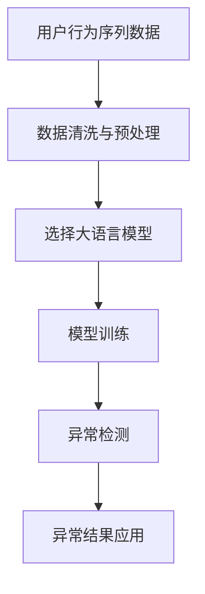

                 

## 1. 背景介绍

随着电子商务平台的迅速发展，用户行为数据日益丰富，对用户行为序列的异常检测需求越来越强烈。传统的异常检测方法通常依赖专家经验，效果有限。近年来，随着深度学习技术的快速发展，基于AI大模型的方法在用户行为序列异常检测中得到了广泛应用。本文将对基于AI大模型的用户行为序列异常检测进行详细探讨。

### 1.1 问题由来

在电商平台上，用户的行为数据包括浏览、点击、购买、评论等。通过分析这些行为数据，可以获取用户的兴趣偏好和购买意愿，进而提供个性化的推荐。然而，用户行为序列中可能包含各种异常行为，如欺诈行为、恶意点击等，这些异常行为会对推荐系统造成干扰，影响用户体验和平台收益。因此，如何有效地检测用户行为序列中的异常行为，是电商推荐系统优化中的一个重要问题。

传统的异常检测方法，如统计方法、规则引擎等，往往依赖于领域知识和规则设计，需要人工干预较多。随着深度学习技术的发展，基于AI大模型的异常检测方法逐渐成为主流，能够自动学习用户行为数据中的隐含规律，检测出异常行为，提升推荐系统的准确性和安全性。

### 1.2 问题核心关键点

大语言模型在异常检测中的应用，主要包括以下几个关键点：

- **数据准备**：准备好用户行为序列数据，并进行数据清洗和预处理。
- **模型训练**：选择合适的模型架构和训练方法，训练异常检测模型。
- **异常检测**：利用训练好的模型对新用户行为序列进行异常检测。
- **结果应用**：根据异常检测结果，采取相应的措施，如风险控制、个性化推荐优化等。

本文将重点探讨如何利用大语言模型构建用户行为序列异常检测模型，并在此基础上进行实际应用。

## 2. 核心概念与联系

### 2.1 核心概念概述

1. **用户行为序列**：用户在线上平台的行为数据，如浏览、点击、购买、评论等，通常以时间序列的形式呈现。
2. **异常检测**：对用户行为序列进行分析和检测，识别出其中的异常行为，以提升系统的准确性和安全性。
3. **AI大模型**：基于深度学习的大型神经网络模型，能够自动学习数据中的复杂特征和规律。
4. **序列建模**：利用大语言模型对用户行为序列进行建模，提取其中的模式和规律，识别出异常行为。
5. **解释与可控性**：分析异常检测结果，理解模型决策的依据，提高系统的可解释性和可控性。

### 2.2 核心概念原理和架构的 Mermaid 流程图

## 3. 核心算法原理 & 具体操作步骤

### 3.1 算法原理概述

基于AI大模型的用户行为序列异常检测，其核心思想是利用大语言模型自动学习用户行为序列中的复杂模式和规律，识别出异常行为。具体步骤如下：

1. **数据准备**：收集用户行为序列数据，并进行清洗和预处理，确保数据质量。
2. **模型选择**：选择合适的AI大模型，如BERT、GPT等，作为异常检测模型的基础。
3. **模型训练**：在标注好的异常行为数据上训练模型，学习异常行为的特征表示。
4. **异常检测**：对新用户行为序列进行编码，利用训练好的模型进行异常检测，输出异常得分。
5. **结果应用**：根据异常得分判断行为是否异常，采取相应的措施，如风险控制、个性化推荐优化等。

### 3.2 算法步骤详解

**Step 1: 数据准备**
1. **数据收集**：收集用户行为序列数据，包括浏览、点击、购买、评论等行为。
2. **数据清洗**：去除噪声数据，处理缺失值，确保数据质量。
3. **数据预处理**：将用户行为序列转换为固定长度的向量表示，以便模型处理。

**Step 2: 模型选择**
1. **选择模型架构**：选择合适的AI大模型，如BERT、GPT等。
2. **模型初始化**：使用预训练模型或自训练模型作为异常检测模型的基础。
3. **选择训练数据**：选择标注好的异常行为数据，用于模型训练。

**Step 3: 模型训练**
1. **构建损失函数**：定义异常检测任务的损失函数，如交叉熵损失、均方误差损失等。
2. **优化算法**：选择合适的优化算法，如Adam、SGD等，进行模型训练。
3. **训练与验证**：使用训练数据对模型进行训练，并在验证集上评估模型性能。
4. **参数调优**：调整模型参数，优化模型性能。

**Step 4: 异常检测**
1. **输入编码**：将新用户行为序列转换为模型所需的输入格式，如词向量表示。
2. **模型推理**：利用训练好的模型对输入进行推理，输出异常得分。
3. **异常判断**：根据异常得分判断行为是否异常，通常设置阈值进行判断。

**Step 5: 结果应用**
1. **风险控制**：对异常行为进行风险控制，如限制交易、降低信用等。
2. **个性化推荐优化**：根据异常检测结果，优化个性化推荐策略，提升推荐系统效果。

### 3.3 算法优缺点

**优点**：
1. **自动学习复杂模式**：利用AI大模型自动学习用户行为序列中的复杂模式和规律，无需人工干预。
2. **高泛化能力**：基于大模型的异常检测方法具有较强的泛化能力，能够适应不同的用户行为序列数据。
3. **可解释性强**：通过分析模型的决策过程，可以理解异常检测的依据，提高系统的可解释性和可控性。

**缺点**：
1. **数据需求高**：需要大量的标注数据进行模型训练，数据获取和标注成本较高。
2. **模型复杂**：大模型的训练和推理复杂度较高，需要较大的计算资源。
3. **过度拟合风险**：在标注数据不足的情况下，模型容易出现过度拟合，影响检测效果。

### 3.4 算法应用领域

基于AI大模型的用户行为序列异常检测，已经在电商推荐、金融风险控制、医疗监测等领域得到广泛应用，取得了显著的效果。

1. **电商推荐**：通过异常检测，及时发现恶意点击、欺诈行为等，提升推荐系统效果，保护用户权益。
2. **金融风险控制**：在金融交易中，通过异常检测及时发现异常交易，降低金融风险。
3. **医疗监测**：在医疗数据中，通过异常检测及时发现异常行为，提高诊断准确性和医疗服务质量。
4. **社交网络安全**：在社交网络中，通过异常检测及时发现恶意行为，保护用户隐私和网络安全。

## 4. 数学模型和公式 & 详细讲解 & 举例说明

### 4.1 数学模型构建

我们以GPT模型为例，构建用户行为序列异常检测模型。假设用户行为序列为 $X=\{x_1,x_2,...,x_t\}$，其中 $x_i$ 表示用户在第 $i$ 个时间点的行为数据。将用户行为序列转换为词向量表示 $V=\{v_1,v_2,...,v_t\}$，其中 $v_i$ 表示 $x_i$ 的词向量表示。

### 4.2 公式推导过程

**Step 1: 输入编码**
将用户行为序列转换为词向量表示 $V$，输入模型进行编码。

**Step 2: 模型训练**
定义异常检测任务的损失函数 $L$，假设模型输出的异常得分为 $P$，则损失函数为：

$$
L = \sum_{i=1}^T \log P(y_i)
$$

其中 $T$ 表示用户行为序列的长度，$y_i$ 表示第 $i$ 个时间点的行为是否异常，$P(y_i)$ 表示模型对行为 $y_i$ 的异常得分的预测。

**Step 3: 异常检测**
对新用户行为序列进行编码，利用训练好的模型进行异常检测，输出异常得分。异常得分的计算公式为：

$$
P(y) = \prod_{i=1}^T f(v_i)
$$

其中 $f(v_i)$ 表示模型对行为 $v_i$ 的异常得分的预测。

### 4.3 案例分析与讲解

假设有一个电商平台，收集了用户的浏览行为数据，并进行了清洗和预处理。选择GPT模型作为异常检测模型，使用标注好的欺诈行为数据进行训练。训练完成后，对新用户浏览行为序列进行编码，利用训练好的模型进行异常检测，输出异常得分。根据异常得分判断行为是否异常，采取相应的措施。

## 5. 项目实践：代码实例和详细解释说明

### 5.1 开发环境搭建

在进行模型开发前，需要准备好开发环境。以下是使用Python进行TensorFlow开发的环

