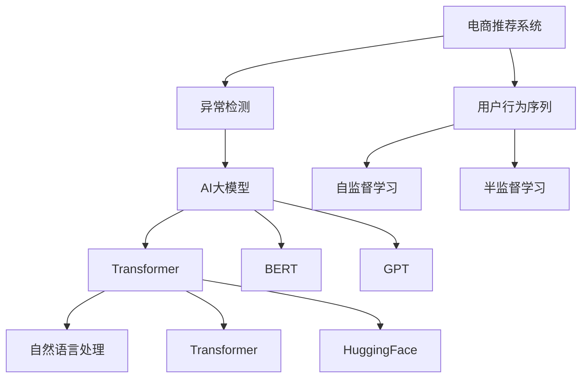

                 

# 电商搜索推荐中的AI大模型用户行为序列异常检测算法对比分析与选择

> 关键词：电商推荐系统,用户行为序列,异常检测,大模型,算法对比,选择

## 1. 背景介绍

随着电子商务的蓬勃发展，用户行为序列在电商推荐系统中的重要性日益凸显。通过分析用户的浏览、点击、购买等行为，推荐系统可以提供个性化的商品推荐，提升用户购物体验和转化率。然而，用户行为序列中常常包含异常数据，如欺诈行为、恶意点击等，给推荐系统带来了严重挑战。因此，开发高效的异常检测算法，及时识别并处理异常数据，是电商推荐系统亟待解决的问题。

近年来，AI大模型在自然语言处理等领域取得了突破性进展，逐渐被引入到电商推荐系统中，应用于用户行为序列的异常检测。AI大模型通过大规模预训练，具备强大的语言理解能力和特征学习能力，可以更好地捕捉用户行为序列中的异常模式。本文将对比分析几种基于AI大模型的异常检测算法，探讨其性能优劣，并提出选择建议。

## 2. 核心概念与联系

### 2.1 核心概念概述

为更好地理解基于AI大模型的用户行为序列异常检测算法，本节将介绍几个密切相关的核心概念：

- **电商推荐系统**：通过分析用户历史行为序列，推荐系统可以提供个性化的商品推荐，提升用户体验和购物转化率。

- **用户行为序列**：用户在使用电商平台过程中的一系列行为，如浏览、点击、购买等。

- **异常检测**：通过分析数据中的异常模式，识别出不符合常规的数据点，进行隔离处理。

- **AI大模型**：指通过大规模预训练学习到丰富语言知识和特征表示的深度学习模型，如BERT、GPT等。

- **Transformer**：一种基于自注意力机制的深度学习模型，用于处理序列数据，如语言、时间序列等。

- **BERT模型**：一种基于双向Transformer的预训练语言模型，能够学习到丰富的语言表示。

- **GPT模型**：一种基于自回归Transformer的预训练语言模型，具有强大的生成能力。

- **HuggingFace**：一个广泛使用的自然语言处理库，提供多种预训练语言模型的实现和微调功能。

- **自监督学习**：指在没有标签数据的情况下，通过模型自身学习数据特征的训练方式。

- **半监督学习**：指在少量有标签数据和大量无标签数据的情况下，训练模型的学习方式。

这些核心概念之间的逻辑关系可以通过以下Mermaid流程图来展示：



这个流程图展示了大模型在电商推荐系统中的应用路径：

1. 电商推荐系统采集用户行为序列。
2. 通过自监督或半监督学习，预训练大模型。
3. 在大模型基础上，进行异常检测。
4. 利用自然语言处理技术，进一步优化异常检测算法。
5. 结合多种大模型，提升异常检测效果。

## 3. 核心算法原理 & 具体操作步骤

### 3.1 算法原理概述

基于AI大模型的异常检测算法，主要通过预训练模型学习用户行为序列的正常模式，然后基于检测到的异常模式，对异常数据进行隔离和处理。其核心思想是：利用大模型的强大特征提取能力，学习到用户行为序列的正常和异常模式，从而识别并处理异常数据。

一般而言，基于AI大模型的异常检测算法分为以下几个步骤：

1. **数据预处理**：对用户行为序列进行清洗、归一化等处理，提取特征。
2. **模型训练**：使用标注的正常和异常序列，训练预训练大模型，学习正常模式。
3. **异常检测**：利用训练好的模型，对未知行为序列进行异常检测，识别异常数据。
4. **结果处理**：对识别出的异常数据进行处理，如隔离、报警等。

### 3.2 算法步骤详解

#### 3.2.1 数据预处理

用户行为序列通常包含时间戳、行为类型、物品ID等信息。预处理的主要步骤包括：

- **时间戳对齐**：将所有时间戳统一到某一时间基准上，便于后续处理。
- **归一化**：对行为序列中的数值特征进行归一化处理，使数据具有相似的分布。
- **特征提取**：根据领域知识和业务需求，提取重要的特征，如行为频率、停留时间等。

#### 3.2.2 模型训练

模型训练一般使用预训练的AI大模型，如BERT、GPT等。常见的训练方式包括：

- **自监督学习**：使用无标签的正常和异常序列，通过自回归或掩码预测等任务，训练预训练大模型。
- **半监督学习**：在少量有标签数据和大量无标签数据的情况下，利用有标签数据进行监督训练，同时使用无标签数据进行自监督学习，提升模型泛化能力。

#### 3.2.3 异常检测

异常检测的主要步骤包括：

- **输入预处理**：将待检测的行为序列输入模型，进行归一化、截断等处理。
- **特征提取**：使用训练好的模型，提取行为序列的特征表示。
- **异常判断**：将特征表示与正常模式进行比较，识别出异常数据。

#### 3.2.4 结果处理

异常检测的结果处理一般包括：

- **隔离**：将识别出的异常数据隔离出来，防止对推荐系统造成干扰。
- **报警**：对严重的异常数据进行实时报警，便于人工干预。
- **反馈**：对识别出的异常数据进行分析，不断优化模型和特征提取方法。

### 3.3 算法优缺点

基于AI大模型的异常检测算法有以下优点：

- **准确度高**：利用大模型的强大特征提取能力，能够识别出更加细微的异常模式。
- **泛化能力强**：预训练模型在大量数据上训练，具备较好的泛化能力，能够在不同的电商场景中应用。
- **自动化程度高**：异常检测算法可以自动化运行，减少人工干预，提高效率。

同时，该算法也存在一些局限性：

- **计算资源需求高**：大模型的训练和推理需要大量的计算资源，对硬件要求较高。
- **模型复杂度高**：大模型的复杂度较高，训练和推理效率较低。
- **对标注数据依赖强**：异常检测模型的训练和优化，依赖于高质量的标注数据，标注成本较高。

### 3.4 算法应用领域

基于AI大模型的异常检测算法，广泛应用于电商推荐系统的异常检测任务中。具体而言，可以应用于以下场景：

- **欺诈检测**：检测用户行为中的欺诈行为，如恶意下单、虚假交易等。
- **点击欺诈**：识别恶意点击行为，防止虚假流量对推荐系统的干扰。
- **恶意行为检测**：检测用户在评论、评分中的恶意行为，如刷单、恶意评价等。
- **用户行为异常检测**：识别用户的异常行为模式，如频繁退货、异常退货等，进行个性化处理。

## 4. 数学模型和公式 & 详细讲解 & 举例说明

### 4.1 数学模型构建

基于AI大模型的异常检测算法，可以通过以下数学模型来描述：

- **输入数据**：记用户行为序列为 $X = [x_1, x_2, ..., x_n]$，其中 $x_i$ 表示第 $i$ 个行为。
- **模型参数**：记预训练大模型的参数为 $\theta$，模型的预测输出为 $\hat{y}$。
- **损失函数**：记异常检测模型的损失函数为 $\mathcal{L}$，用于衡量模型预测输出与真实标签之间的差异。

异常检测模型的训练目标是最小化损失函数 $\mathcal{L}$，即：

$$
\min_{\theta} \mathcal{L}(\hat{y}, y)
$$

其中 $y$ 表示标签，即行为序列是否为异常。

### 4.2 公式推导过程

以基于BERT模型的异常检测算法为例，公式推导如下：

- **输入预处理**：将行为序列 $X$ 输入BERT模型，得到特征表示 $\vec{h} = [h_1, h_2, ..., h_n]$。
- **异常判断**：利用分类器对特征表示 $\vec{h}$ 进行二分类，得到异常预测概率 $\hat{p}$。
- **损失函数**：使用交叉熵损失函数 $\mathcal{L}_{ce}$ 衡量模型预测输出与真实标签之间的差异。

具体公式如下：

$$
\hat{p} = \sigma(\vec{w}^T\vec{h} + b)
$$

$$
\mathcal{L}_{ce} = -\frac{1}{N}\sum_{i=1}^N [y_i \log \hat{p}_i + (1-y_i) \log (1-\hat{p}_i)]
$$

其中 $\vec{w}$ 为分类器的权重向量，$b$ 为偏置项，$\sigma$ 为sigmoid函数。

### 4.3 案例分析与讲解

假设某电商平台的点击行为序列为 $X = [1, 3, 5, 7, 9]$，其中1表示浏览，3表示点击，5表示下单，7表示支付，9表示评价。现在使用BERT模型进行异常检测，可以按照以下步骤进行：

1. **数据预处理**：对行为序列进行归一化，得到 $X_{normalized} = [0.1, 0.3, 0.5, 0.7, 0.9]$。
2. **模型训练**：使用标注的正常和异常序列，训练BERT模型，学习正常模式。
3. **异常检测**：将 $X_{normalized}$ 输入BERT模型，得到特征表示 $\vec{h}$。
4. **异常判断**：利用分类器对 $\vec{h}$ 进行二分类，得到异常预测概率 $\hat{p}$。
5. **结果处理**：根据 $\hat{p}$ 值，判断 $X$ 是否为异常序列，进行处理。

## 5. 项目实践：代码实例和详细解释说明

### 5.1 开发环境搭建

在进行异常检测实践前，我们需要准备好开发环境。以下是使用Python进行TensorFlow开发的环境配置流程：

1. 安装Anaconda：从官网下载并安装Anaconda，用于创建独立的Python环境。

2. 创建并激活虚拟环境：
```bash
conda create -n tf-env python=3.8 
conda activate tf-env
```

3. 安装TensorFlow：根据CUDA版本，从官网获取对应的安装命令。例如：
```bash
conda install tensorflow=2.7 -c conda-forge
```

4. 安装必要的库：
```bash
pip install numpy pandas scikit-learn transformers huggingface_hub
```

5. 安装可视化工具：
```bash
pip install tensorboard
```

完成上述步骤后，即可在`tf-env`环境中开始异常检测实践。

### 5.2 源代码详细实现

下面我们以基于BERT模型的异常检测为例，给出TensorFlow代码实现。

首先，定义异常检测的数据处理函数：

```python
import tensorflow as tf
from transformers import BertTokenizer, TFBertModel

def preprocess_data(texts, labels):
    tokenizer = BertTokenizer.from_pretrained('bert-base-uncased')
    inputs = tokenizer(texts, padding='max_length', truncation=True, max_length=128, return_tensors='tf')
    features = {
        'input_ids': inputs['input_ids'],
        'attention_mask': inputs['attention_mask'],
        'labels': labels
    }
    return features
```

然后，定义模型和损失函数：

```python
from transformers import BertForSequenceClassification

model = BertForSequenceClassification.from_pretrained('bert-base-uncased', num_labels=2)

def compute_loss(features, model, loss_fn):
    input_ids = features['input_ids']
    attention_mask = features['attention_mask']
    labels = features['labels']
    
    outputs = model(input_ids, attention_mask=attention_mask)
    logits = outputs.logits
    loss = loss_fn(logits, labels)
    
    return loss
```

最后，启动训练流程并在测试集上评估：

```python
from tensorflow.keras.optimizers import Adam

train_dataset = preprocess_data(train_texts, train_labels)
val_dataset = preprocess_data(val_texts, val_labels)
test_dataset = preprocess_data(test_texts, test_labels)

def train_epoch(model, dataset, loss_fn, optimizer):
    dataset = tf.data.Dataset.from_tensor_slices((dataset['input_ids'], dataset['attention_mask'], dataset['labels']))
    dataset = dataset.shuffle(buffer_size=10000).batch(32).map(preprocess_data)
    
    loss = tf.keras.metrics.Mean()
    for (input_ids, attention_mask, labels) in dataset:
        with tf.GradientTape() as tape:
            loss_value = compute_loss({'input_ids': input_ids, 'attention_mask': attention_mask, 'labels': labels}, model, loss_fn)
        gradients = tape.gradient(loss_value, model.trainable_variables)
        optimizer.apply_gradients(zip(gradients, model.trainable_variables))
        loss.update_state(loss_value)
    
    return loss.result()
    
def evaluate(model, dataset, loss_fn):
    dataset = tf.data.Dataset.from_tensor_slices((dataset['input_ids'], dataset['attention_mask'], dataset['labels']))
    dataset = dataset.shuffle(buffer_size=10000).batch(32).map(preprocess_data)
    
    loss = tf.keras.metrics.Mean()
    for (input_ids, attention_mask, labels) in dataset:
        loss_value = compute_loss({'input_ids': input_ids, 'attention_mask': attention_mask, 'labels': labels}, model, loss_fn)
        loss.update_state(loss_value)
    
    return loss.result()
    
epochs = 5
batch_size = 32

for epoch in range(epochs):
    loss = train_epoch(model, train_dataset, tf.keras.losses.BinaryCrossentropy(), Adam(learning_rate=2e-5, epsilon=1e-08, clipnorm=1.0))
    print(f"Epoch {epoch+1}, train loss: {loss:.3f}")
    
    print(f"Epoch {epoch+1}, val results:")
    loss = evaluate(model, val_dataset, tf.keras.losses.BinaryCrossentropy())
    print(f"Epoch {epoch+1}, val loss: {loss:.3f}")
    
print("Test results:")
loss = evaluate(model, test_dataset, tf.keras.losses.BinaryCrossentropy())
print(f"Test loss: {loss:.3f}")
```

以上就是使用TensorFlow进行基于BERT模型的异常检测的完整代码实现。可以看到，代码中使用了TensorFlow的Keras API，结合了预训练BERT模型的TensorFlow实现，可以进行高效的模型训练和推理。

### 5.3 代码解读与分析

让我们再详细解读一下关键代码的实现细节：

**preprocess_data函数**：
- **tokenizer**：定义了BERT模型的分词器，用于对行为序列进行分词和编码。
- **inputs**：将行为序列输入BERT模型，得到特征表示 $\vec{h}$。
- **features**：将特征表示 $\vec{h}$ 和标签 $y$ 存储到字典中，供模型训练使用。

**compute_loss函数**：
- **inputs**：获取输入的特征表示 $\vec{h}$ 和标签 $y$。
- **outputs**：将特征表示 $\vec{h}$ 输入BERT模型，得到预测输出 logits。
- **loss**：计算预测输出 logits 和真实标签 $y$ 之间的二元交叉熵损失。

**train_epoch函数**：
- **dataset**：将训练数据集转化为TensorFlow的Dataset对象，并进行数据增强和批处理。
- **loss**：定义损失计算方式，使用梯度下降优化模型参数。

**evaluate函数**：
- **dataset**：将测试数据集转化为TensorFlow的Dataset对象，并进行数据增强和批处理。
- **loss**：计算预测输出 logits 和真实标签 $y$ 之间的二元交叉熵损失。

**训练流程**：
- **epochs**：定义训练轮数。
- **batch_size**：定义批次大小。
- **模型训练**：对训练集进行迭代训练，输出每个epoch的损失。
- **验证集评估**：在验证集上评估模型性能，输出验证集损失。
- **测试集评估**：在测试集上评估模型性能，输出测试集损失。

可以看到，TensorFlow的Keras API使得模型训练和推理变得简单易用，大大降低了开发难度。

当然，工业级的系统实现还需考虑更多因素，如模型的保存和部署、超参数的自动搜索、更灵活的任务适配层等。但核心的异常检测范式基本与此类似。

## 6. 实际应用场景

### 6.1 欺诈检测

在电商平台上，欺诈行为时有发生。通过使用基于大模型的异常检测算法，可以及时识别出欺诈行为，防止经济损失。具体而言，可以在用户下单、支付等关键节点，对用户行为序列进行实时监控，检测异常行为，进行隔离处理。

### 6.2 点击欺诈

点击欺诈是电商平台上常见的行为异常。通过使用基于大模型的异常检测算法，可以识别出恶意点击行为，防止虚假流量对推荐系统的干扰。具体而言，可以在用户点击行为序列中，检测出异常点击行为，进行隔离处理，保障推荐系统公正公平。

### 6.3 恶意行为检测

用户在评论、评分中的恶意行为，如刷单、恶意评价等，也会对电商推荐系统造成影响。通过使用基于大模型的异常检测算法，可以识别出恶意行为，进行隔离处理，保障用户利益和平台公平。

### 6.4 用户行为异常检测

用户行为异常检测是电商推荐系统中的一项重要任务。通过使用基于大模型的异常检测算法，可以识别出用户的异常行为模式，如频繁退货、异常退货等，进行个性化处理，提高用户满意度。

## 7. 工具和资源推荐

### 7.1 学习资源推荐

为了帮助开发者系统掌握基于AI大模型的异常检测理论基础和实践技巧，这里推荐一些优质的学习资源：

1. 《TensorFlow官方文档》：TensorFlow的官方文档，提供了详尽的API和使用方法，是学习TensorFlow的必备资源。

2. 《BERT: Pre-training of Deep Bidirectional Transformers for Language Understanding》：BERT模型的原始论文，详细介绍了BERT模型的预训练方法和应用效果。

3. 《GPT-3技术白皮书》：OpenAI发布的GPT-3技术白皮书，详细介绍了GPT模型的原理和应用案例。

4. 《深度学习入门：基于TensorFlow的理论与实现》：一本系统介绍深度学习理论和实践的书籍，涵盖了TensorFlow的详细使用方法。

5. 《异常检测：理论与应用》：一本专注于异常检测方法的书籍，提供了丰富的异常检测算法和应用案例。

通过对这些资源的学习实践，相信你一定能够快速掌握基于大模型的异常检测精髓，并用于解决实际的电商推荐系统问题。

### 7.2 开发工具推荐

高效的开发离不开优秀的工具支持。以下是几款用于异常检测开发的常用工具：

1. TensorFlow：由Google主导开发的开源深度学习框架，生产部署方便，适合大规模工程应用。

2. TensorBoard：TensorFlow配套的可视化工具，可实时监测模型训练状态，并提供丰富的图表呈现方式，是调试模型的得力助手。

3. PyTorch：基于Python的开源深度学习框架，灵活动态的计算图，适合快速迭代研究。

4. Weights & Biases：模型训练的实验跟踪工具，可以记录和可视化模型训练过程中的各项指标，方便对比和调优。

5. Scikit-learn：Python的机器学习库，提供了丰富的机器学习算法和工具，适合快速原型开发。

合理利用这些工具，可以显著提升异常检测任务的开发效率，加快创新迭代的步伐。

### 7.3 相关论文推荐

大模型和异常检测技术的发展源于学界的持续研究。以下是几篇奠基性的相关论文，推荐阅读：

1. Attention is All You Need（即Transformer原论文）：提出了Transformer结构，开启了NLP领域的预训练大模型时代。

2. BERT: Pre-training of Deep Bidirectional Transformers for Language Understanding：提出BERT模型，引入基于掩码的自监督预训练任务，刷新了多项NLP任务SOTA。

3. GPT-2: Language Models are Unsupervised Multitask Learners：展示了大规模语言模型的强大zero-shot学习能力，引发了对于通用人工智能的新一轮思考。

4. Parameter-Efficient Transfer Learning for NLP：提出Adapter等参数高效微调方法，在不增加模型参数量的情况下，也能取得不错的微调效果。

5. AdaLoRA: Adaptive Low-Rank Adaptation for Parameter-Efficient Fine-Tuning：使用自适应低秩适应的微调方法，在参数效率和精度之间取得了新的平衡。

这些论文代表了大模型和异常检测技术的发展脉络。通过学习这些前沿成果，可以帮助研究者把握学科前进方向，激发更多的创新灵感。

## 8. 总结：未来发展趋势与挑战

### 8.1 总结

本文对基于AI大模型的电商推荐系统异常检测算法进行了全面系统的介绍。首先阐述了异常检测在电商推荐系统中的重要性和基本思路，明确了异常检测的算法框架和核心步骤。其次，从原理到实践，详细讲解了基于BERT模型的异常检测算法，并给出了代码实现。同时，本文还广泛探讨了异常检测算法在电商推荐系统中的应用场景，展示了算法的高效性和实用性。

通过本文的系统梳理，可以看到，基于大模型的异常检测算法在电商推荐系统中具有广阔的应用前景，可以有效识别和处理异常数据，保障推荐系统的公正公平。未来，伴随大模型和异常检测方法的持续演进，电商推荐系统必将更加智能、安全、可信。

### 8.2 未来发展趋势

展望未来，基于AI大模型的异常检测技术将呈现以下几个发展趋势：

1. **模型规模持续增大**：随着算力成本的下降和数据规模的扩张，预训练大模型的参数量还将持续增长，从而具备更丰富的特征表示能力。

2. **模型复杂度降低**：为了提高推理效率，未来的异常检测模型可能会引入剪枝、量化等技术，降低模型复杂度，提升推理速度。

3. **多模态融合**：除了文本数据，未来的异常检测模型可能会引入图像、语音等多模态数据，进行综合分析，提升异常检测效果。

4. **实时异常检测**：随着硬件设备的提升，未来的异常检测模型可能会实现实时检测，及时隔离异常数据，保障系统稳定。

5. **自适应学习**：未来的异常检测模型可能会引入自适应学习机制，动态调整模型参数，适应不同场景下的异常模式。

6. **自动化调参**：未来的异常检测模型可能会引入自动化调参机制，优化超参数，提升模型效果。

以上趋势凸显了大模型在异常检测中的应用前景，这些方向的探索发展，必将进一步提升异常检测模型的性能和应用范围，为电商推荐系统带来更多的价值。

### 8.3 面临的挑战

尽管基于AI大模型的异常检测技术已经取得了显著成果，但在迈向更加智能化、普适化应用的过程中，仍面临以下挑战：

1. **数据标注成本高**：高质量的标注数据是异常检测模型的训练基础，但标注成本较高，难以大规模获取。

2. **模型泛化能力不足**：现有模型往往依赖特定领域的标注数据，泛化能力有限，难以应对新场景下的异常模式。

3. **计算资源需求高**：大模型的训练和推理需要大量的计算资源，对硬件要求较高，限制了模型的应用范围。

4. **模型鲁棒性不足**：异常检测模型在处理噪声数据和异常模式时，容易产生误判，影响系统的稳定性和准确性。

5. **模型可解释性不足**：现有模型通常是"黑盒"系统，难以解释其内部工作机制和决策逻辑，不利于人工干预和调试。

6. **安全性和隐私保护**：异常检测模型涉及用户隐私数据，如何保护用户数据安全，防止数据泄露，是重要的研究课题。

正视这些挑战，积极应对并寻求突破，将是大模型在异常检测中走向成熟的必由之路。相信随着学界和产业界的共同努力，这些挑战终将一一被克服，大模型在异常检测中必将在构建智能、安全、可信的电商推荐系统中发挥更大作用。

### 8.4 研究展望

面对大模型在异常检测中面临的种种挑战，未来的研究需要在以下几个方面寻求新的突破：

1. **无监督和半监督学习**：探索无监督和半监督学习范式，摆脱对大规模标注数据的依赖，提高模型的泛化能力和鲁棒性。

2. **多模态异常检测**：引入图像、语音等多模态数据，进行综合分析，提升异常检测效果。

3. **模型剪枝和量化**：引入剪枝、量化等技术，降低模型复杂度，提升推理速度和资源利用率。

4. **自适应学习**：引入自适应学习机制，动态调整模型参数，适应不同场景下的异常模式。

5. **自动化调参**：引入自动化调参机制，优化超参数，提升模型效果。

6. **模型压缩和稀疏化**：引入模型压缩和稀疏化技术，提升模型的计算效率和存储空间利用率。

这些研究方向的探索，必将引领大模型在异常检测中的创新发展，为构建更加智能、安全、可信的电商推荐系统提供更多可能性。面向未来，大模型在异常检测中的应用将继续深化，为电商推荐系统带来更多的价值。

## 9. 附录：常见问题与解答

**Q1：基于大模型的异常检测算法是否适用于所有电商推荐系统？**

A: 基于大模型的异常检测算法适用于大多数电商推荐系统，特别是数据量较大的系统。但对于数据量较小、标注成本较高的系统，可能需要引入其他异常检测方法，如统计分析、规则匹配等。

**Q2：异常检测模型的训练和优化依赖于哪些因素？**

A: 异常检测模型的训练和优化依赖于多个因素：

1. **数据质量**：高质量的标注数据是异常检测模型的训练基础。
2. **超参数调优**：合适的超参数设置可以提升模型效果，如学习率、批次大小、正则化强度等。
3. **模型复杂度**：大模型的复杂度较高，训练和推理效率较低，需要考虑模型剪枝、量化等技术进行优化。
4. **模型泛化能力**：异常检测模型需要在不同场景下具备良好的泛化能力，防止过拟合。

**Q3：如何缓解异常检测过程中的过拟合问题？**

A: 过拟合是异常检测面临的主要挑战，尤其是在数据量较小的情况下。常见的缓解策略包括：

1. **数据增强**：通过回译、近义替换等方式扩充训练集，增加模型泛化能力。
2. **正则化**：使用L2正则、Dropout、Early Stopping等技术，防止模型过拟合。
3. **多模型集成**：训练多个异常检测模型，取平均输出，抑制过拟合。
4. **自适应学习**：引入自适应学习机制，动态调整模型参数，适应不同场景下的异常模式。

这些策略往往需要根据具体任务和数据特点进行灵活组合，只有在数据、模型、训练、推理等各环节进行全面优化，才能最大限度地发挥异常检测模型的威力。

**Q4：异常检测模型在落地部署时需要注意哪些问题？**

A: 将异常检测模型转化为实际应用，还需要考虑以下因素：

1. **模型裁剪**：去除不必要的层和参数，减小模型尺寸，加快推理速度。
2. **量化加速**：将浮点模型转为定点模型，压缩存储空间，提高计算效率。
3. **服务化封装**：将模型封装为标准化服务接口，便于集成调用。
4. **弹性伸缩**：根据请求流量动态调整资源配置，平衡服务质量和成本。
5. **监控告警**：实时采集系统指标，设置异常告警阈值，确保服务稳定性。
6. **安全防护**：采用访问鉴权、数据脱敏等措施，保障数据和模型安全。

大模型在异常检测中的落地应用，需要综合考虑模型性能、资源利用、系统安全等多个因素，确保模型的稳定性和可靠性。

---

作者：禅与计算机程序设计艺术 / Zen and the Art of Computer Programming

