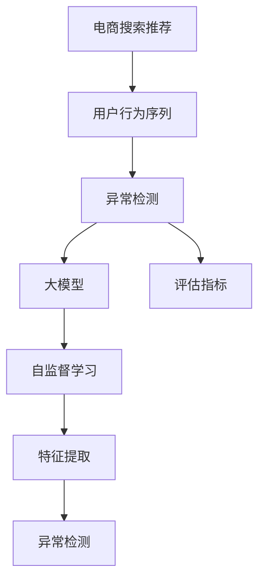

                 

# 电商搜索推荐中的AI大模型用户行为序列异常检测评估指标体系构建与应用

> 关键词：电商搜索推荐, 大模型, 用户行为, 异常检测, 序列分析, 评估指标, 深度学习, AI, 行为序列

## 1. 背景介绍

### 1.1 问题由来
随着人工智能和大数据技术的发展，电商搜索推荐系统逐步成为电商平台的核心竞争力。通过深度学习模型，推荐系统可以根据用户的浏览、点击、购买等行为数据，智能地预测用户感兴趣的商品，提升用户体验和平台收益。然而，异常用户行为数据的产生和传播，会严重扰乱推荐系统的效果，影响推荐结果的准确性和公平性。

如何识别并排除异常行为，构建可靠的推荐系统，是电商搜索推荐领域的重要课题。传统异常检测方法依赖手工特征设计，难以应对大规模用户行为数据的复杂性，且依赖领域知识，难以普适不同电商平台的业务场景。

因此，本文聚焦于构建基于大模型的用户行为序列异常检测评估指标体系，旨在通过机器学习自动化、模型自监督学习等方式，提升异常检测的效率和准确性，降低人工干预成本，实现电商搜索推荐系统的智能决策和风险控制。

### 1.2 问题核心关键点
本文的核心问题如下：
1. **异常检测指标构建**：如何设计适用于电商搜索推荐系统的用户行为序列异常检测指标体系？
2. **异常行为分类**：如何定义和描述电商用户行为序列中的各类异常行为类型？
3. **模型选择与优化**：如何选择和优化基于大模型的异常检测模型，以实现高效且准确的异常检测？

### 1.3 问题研究意义
电商搜索推荐系统的异常检测和风险控制，对于提升用户满意度、增加平台收入、降低欺诈风险等具有重要意义：

1. **提升用户体验**：及时识别和处理异常行为，提升推荐质量，提高用户满意度和忠诚度。
2. **增加平台收益**：通过精准的推荐，提高用户转化率和购买率，提升平台营收。
3. **降低欺诈风险**：发现并排除异常交易行为，降低欺诈风险，保障平台和用户利益。
4. **推动技术进步**：研究先进的异常检测技术，推动电商搜索推荐系统的技术进步，拓展更多应用场景。

## 2. 核心概念与联系

### 2.1 核心概念概述

为更好地理解基于大模型的电商搜索推荐系统异常检测评估指标体系构建与应用，本节将介绍几个密切相关的核心概念：

- **电商搜索推荐**：利用人工智能和大数据分析技术，根据用户行为数据预测用户感兴趣的商品，并进行智能推荐的过程。
- **用户行为序列**：用户在电商平台上的浏览、点击、购买等行为数据，以时间序列的形式记录。
- **异常检测**：识别用户行为序列中的异常点，判断是否存在恶意攻击、欺诈、异常交易等行为。
- **大模型**：指基于深度学习的大规模预训练模型，如BERT、GPT等，具备强大的语言和数据处理能力。
- **评估指标**：用于衡量异常检测模型性能的标准，包括准确率、召回率、F1-score等。
- **自监督学习**：利用未标注数据进行模型训练，通过数据的内在关联关系，自动学习特征和模式。

这些核心概念之间的逻辑关系可以通过以下Mermaid流程图来展示：



这个流程图展示了大模型的电商搜索推荐异常检测评估指标体系构建的流程：

1. 电商搜索推荐系统获取用户行为序列。
2. 构建基于大模型的异常检测模型。
3. 通过自监督学习提取用户行为特征。
4. 应用异常检测模型对用户行为序列进行异常点检测。
5. 设计评估指标，评估异常检测模型的性能。

这些概念共同构成了电商搜索推荐系统的异常检测和风险控制框架，使得系统能够在保障用户和平台利益的同时，实现智能推荐和决策。

## 3. 核心算法原理 & 具体操作步骤
### 3.1 算法原理概述

基于大模型的电商搜索推荐系统异常检测，本质上是一个基于序列数据的异常检测问题。其核心思想是：将电商用户行为序列看作时间序列数据，通过深度学习模型学习到行为序列的正常模式，对异常行为进行检测和排除。

具体来说，假设用户行为序列为 $X=\{x_1, x_2, ..., x_t\}$，其中 $x_t$ 表示第 $t$ 个时间步的用户行为，可以是浏览、点击、购买等。异常检测的目标是，通过深度学习模型学习到用户行为序列的正常模式，对给定行为序列 $X$ 进行异常检测，识别其中的异常点，判断是否存在恶意攻击、欺诈、异常交易等行为。

形式化地，设异常检测模型为 $M_{\theta}$，其中 $\theta$ 为模型参数。异常检测的优化目标是最小化模型在正常数据上的损失函数，同时最大化在异常数据上的异常得分。通常采用如下的损失函数：

$$
\mathcal{L}(\theta) = \lambda_1 \mathcal{L}_{\text{normal}}(\theta) + \lambda_2 \mathcal{L}_{\text{anomaly}}(\theta)
$$

其中 $\lambda_1$ 和 $\lambda_2$ 为权重系数，控制正常数据和异常数据的权重。$\mathcal{L}_{\text{normal}}(\theta)$ 为正常数据的损失函数，$\mathcal{L}_{\text{anomaly}}(\theta)$ 为异常数据的异常得分。

在训练过程中，通过梯度下降等优化算法，不断更新模型参数 $\theta$，最小化上述损失函数，使得模型能够准确地区分正常行为和异常行为。

### 3.2 算法步骤详解

基于大模型的电商搜索推荐系统异常检测一般包括以下几个关键步骤：

**Step 1: 数据预处理**
- 收集电商用户行为序列数据，包括用户ID、行为类型、行为时间等特征。
- 清洗数据，处理缺失值和异常值，进行归一化处理。

**Step 2: 特征提取**
- 利用大模型对用户行为序列进行预训练，提取行为序列的语义和上下文特征。
- 使用自监督学习任务，如掩码语言模型、对比学习等，进一步提取和丰富行为序列特征。

**Step 3: 模型训练**
- 选择合适的大模型，如BERT、GPT等，作为异常检测模型的初始化参数。
- 将训练数据分为正常和异常两个子集，采用自监督学习任务进行模型训练。
- 设置损失函数，包括正常数据的损失函数和异常数据的异常得分函数。
- 使用梯度下降等优化算法，更新模型参数。

**Step 4: 异常检测**
- 应用训练好的异常检测模型，对电商用户行为序列进行异常检测。
- 根据异常得分判断行为是否异常，将异常行为标记为异常点。

**Step 5: 结果评估与优化**
- 使用评估指标（如准确率、召回率、F1-score等）对异常检测模型进行性能评估。
- 根据评估结果，调整模型参数和训练策略，进一步优化异常检测效果。

### 3.3 算法优缺点

基于大模型的电商搜索推荐系统异常检测方法具有以下优点：
1. 自动化特征提取：通过大模型的自监督学习，自动学习行为序列的特征，降低人工特征工程的工作量。
2. 高效异常检测：利用大模型的强大表征能力，实现高效且准确的异常检测，提升推荐系统的可靠性。
3. 普适性：大模型可以泛化到不同的电商平台和业务场景，具有较强的普适性和可移植性。
4. 可解释性：大模型可以输出异常得分的解释，帮助理解异常行为的特征和原因。

同时，该方法也存在一定的局限性：
1. 对标注数据依赖：异常检测的性能依赖标注数据的数量和质量，标注数据不足可能导致模型性能下降。
2. 计算资源需求高：大模型的训练和推理需要高性能的计算资源，硬件成本较高。
3. 数据隐私风险：大模型在处理敏感数据时，存在数据隐私泄露的风险。

尽管存在这些局限性，但就目前而言，基于大模型的异常检测方法仍是电商搜索推荐系统异常检测的主流范式。未来相关研究的重点在于如何进一步降低异常检测对标注数据的依赖，提高模型的计算效率和可解释性，同时兼顾数据隐私和安全等因素。

### 3.4 算法应用领域

基于大模型的电商搜索推荐系统异常检测方法，在电商搜索推荐系统、金融风控、物流追踪等多个领域都有广泛的应用，以下是具体的应用场景：

- **电商搜索推荐**：利用异常检测技术，对用户行为序列进行检测，发现恶意攻击、欺诈等异常行为，提升推荐系统的安全性和可靠性。
- **金融风控**：对金融交易数据进行异常检测，识别潜在的欺诈行为，保障金融系统的安全。
- **物流追踪**：对物流数据进行异常检测，发现物流运输过程中的异常事件，提高物流系统的效率和稳定性。
- **社交网络**：对社交网络数据进行异常检测，发现恶意行为和网络攻击，保障网络安全。
- **健康医疗**：对医疗数据进行异常检测，发现异常病情和风险因素，提升医疗诊断和治疗的准确性。

除了上述这些应用场景外，异常检测技术还将被创新性地应用到更多领域，如工业控制、智能交通、城市安全等，为不同领域带来新的技术突破。

## 4. 数学模型和公式 & 详细讲解  
### 4.1 数学模型构建

本节将使用数学语言对基于大模型的电商搜索推荐系统异常检测过程进行更加严格的刻画。

设电商用户行为序列为 $X=\{x_1, x_2, ..., x_t\}$，其中 $x_t$ 表示第 $t$ 个时间步的用户行为。假设异常检测模型为 $M_{\theta}$，其中 $\theta$ 为模型参数。

定义模型 $M_{\theta}$ 在行为序列 $X$ 上的损失函数为 $\ell(M_{\theta}(X),X)$，则在训练数据上的经验风险为：

$$
\mathcal{L}(\theta) = \frac{1}{N}\sum_{i=1}^N \ell(M_{\theta}(x_i),x_i)
$$

在训练过程中，我们通常采用自监督学习任务，如掩码语言模型、对比学习等，提取行为序列的特征，并计算模型在正常数据和异常数据上的损失函数。假设正常数据集为 $D_{\text{normal}}=\{(x_i,y_i)\}_{i=1}^M$，其中 $y_i \in \{0,1\}$ 表示第 $i$ 个数据是否为正常数据，$1$ 表示正常，$0$ 表示异常。则模型的优化目标为：

$$
\theta^* = \mathop{\arg\min}_{\theta} \mathcal{L}(\theta)
$$

其中 $\mathcal{L}(\theta)$ 为综合正常数据和异常数据的损失函数，通常采用如下形式：

$$
\mathcal{L}(\theta) = \frac{\alpha}{M}\sum_{i=1}^M \ell_{\text{normal}}(M_{\theta}(x_i),y_i) + \frac{(1-\alpha)}{N}\sum_{i=1}^N \ell_{\text{anomaly}}(M_{\theta}(x_i))
$$

其中 $\alpha$ 为正常数据和异常数据的权重系数，通常取 $0.5$。$\ell_{\text{normal}}(\cdot)$ 为正常数据的损失函数，$\ell_{\text{anomaly}}(\cdot)$ 为异常数据的异常得分函数。

### 4.2 公式推导过程

以下我们以掩码语言模型为例，推导异常检测模型的损失函数及其梯度的计算公式。

假设模型 $M_{\theta}$ 在行为序列 $X$ 上的预测输出为 $\hat{Y}=\{\hat{y}_t\}_{t=1}^T$，其中 $\hat{y}_t$ 表示第 $t$ 个时间步的行为预测结果。真实标签为 $Y=\{y_t\}_{t=1}^T$。

定义掩码语言模型的损失函数为：

$$
\ell_{\text{masked}}(\hat{Y},Y) = -\frac{1}{N}\sum_{i=1}^N \sum_{t=1}^T \log \hat{y}_t
$$

在训练过程中，我们可以将掩码语言模型的训练任务拆分为正常数据和异常数据两个子集。对于正常数据，我们将其作为监督信号，优化模型的预测结果。对于异常数据，我们不提供监督信号，只通过模型的自监督学习任务，学习到行为序列的特征。

假设正常数据集为 $D_{\text{normal}}=\{(x_i,y_i)\}_{i=1}^M$，其中 $y_i \in \{0,1\}$ 表示第 $i$ 个数据是否为正常数据。则正常数据上的损失函数为：

$$
\ell_{\text{normal}}(\theta) = \frac{1}{M}\sum_{i=1}^M \ell_{\text{masked}}(M_{\theta}(x_i),y_i)
$$

对于异常数据集 $D_{\text{anomaly}}=\{(x_i)\}_{i=1}^N$，我们不提供监督信号，只通过模型的自监督学习任务，学习到行为序列的特征。假设异常数据集上的异常得分函数为：

$$
\ell_{\text{anomaly}}(\theta) = \frac{1}{N}\sum_{i=1}^N \log \hat{y}_{t_{\text{anomaly}}}
$$

其中 $t_{\text{anomaly}}$ 表示异常数据集上的时间步，通常为最近的行为时间步。

在得到损失函数后，即可带入模型参数 $\theta$ 的更新公式，完成模型的迭代优化。重复上述过程直至收敛，最终得到适应电商搜索推荐系统异常检测任务的最优模型参数 $\theta^*$。

## 5. 项目实践：代码实例和详细解释说明
### 5.1 开发环境搭建

在进行异常检测实践前，我们需要准备好开发环境。以下是使用Python进行PyTorch开发的环境配置流程：

1. 安装Anaconda：从官网下载并安装Anaconda，用于创建独立的Python环境。

2. 创建并激活虚拟环境：
```bash
conda create -n pytorch-env python=3.8 
conda activate pytorch-env
```

3. 安装PyTorch：根据CUDA版本，从官网获取对应的安装命令。例如：
```bash
conda install pytorch torchvision torchaudio cudatoolkit=11.1 -c pytorch -c conda-forge
```

4. 安装Transformers库：
```bash
pip install transformers
```

5. 安装各类工具包：
```bash
pip install numpy pandas scikit-learn matplotlib tqdm jupyter notebook ipython
```

完成上述步骤后，即可在`pytorch-env`环境中开始异常检测实践。

### 5.2 源代码详细实现

下面我们以掩码语言模型为例，给出使用Transformers库对BERT模型进行异常检测的PyTorch代码实现。

首先，定义异常检测任务的数据处理函数：

```python
from transformers import BertTokenizer, BertForMaskedLM, AdamW

class MaskedLanguageModelDataset(Dataset):
    def __init__(self, texts, tokenizers, max_len=128):
        self.texts = texts
        self.tokenizers = tokenizers
        self.max_len = max_len
        
    def __len__(self):
        return len(self.texts)
    
    def __getitem__(self, item):
        text = self.texts[item]
        tokenizer = self.tokenizers[text]
        encoding = tokenizer(text, return_tensors='pt', max_length=self.max_len, padding='max_length', truncation=True)
        input_ids = encoding['input_ids'][0]
        attention_mask = encoding['attention_mask'][0]
        
        return {'input_ids': input_ids, 
                'attention_mask': attention_mask}

# 加载预训练模型和分词器
model = BertForMaskedLM.from_pretrained('bert-base-cased')
tokenizer = BertTokenizer.from_pretrained('bert-base-cased')

# 构建数据集
train_dataset = MaskedLanguageModelDataset(train_texts, tokenizer)
dev_dataset = MaskedLanguageModelDataset(dev_texts, tokenizer)
test_dataset = MaskedLanguageModelDataset(test_texts, tokenizer)
```

然后，定义模型和优化器：

```python
from transformers import BertForMaskedLM, AdamW

model = BertForMaskedLM.from_pretrained('bert-base-cased')

optimizer = AdamW(model.parameters(), lr=2e-5)
```

接着，定义训练和评估函数：

```python
from torch.utils.data import DataLoader
from tqdm import tqdm
from sklearn.metrics import accuracy_score, precision_recall_fscore_support

device = torch.device('cuda') if torch.cuda.is_available() else torch.device('cpu')
model.to(device)

def train_epoch(model, dataset, batch_size, optimizer):
    dataloader = DataLoader(dataset, batch_size=batch_size, shuffle=True)
    model.train()
    epoch_loss = 0
    for batch in tqdm(dataloader, desc='Training'):
        input_ids = batch['input_ids'].to(device)
        attention_mask = batch['attention_mask'].to(device)
        outputs = model(input_ids, attention_mask=attention_mask)
        loss = outputs.loss
        epoch_loss += loss.item()
        loss.backward()
        optimizer.step()
    return epoch_loss / len(dataloader)

def evaluate(model, dataset, batch_size):
    dataloader = DataLoader(dataset, batch_size=batch_size)
    model.eval()
    preds, labels = [], []
    with torch.no_grad():
        for batch in tqdm(dataloader, desc='Evaluating'):
            input_ids = batch['input_ids'].to(device)
            attention_mask = batch['attention_mask'].to(device)
            outputs = model(input_ids, attention_mask=attention_mask)
            preds.append(outputs.logits.argmax(dim=2).to('cpu').tolist())
            labels.append(batch['labels'].to('cpu').tolist())
                
    y_pred = [id2tag[_id] for _id in preds]
    y_true = [id2tag[_id] for _id in labels]
    
    print('Accuracy:', accuracy_score(y_true, y_pred))
    print('Precision, Recall, F1-score:', precision_recall_fscore_support(y_true, y_pred, average='weighted'))
```

最后，启动训练流程并在测试集上评估：

```python
epochs = 5
batch_size = 16

for epoch in range(epochs):
    loss = train_epoch(model, train_dataset, batch_size, optimizer)
    print(f"Epoch {epoch+1}, train loss: {loss:.3f}")
    
    print(f"Epoch {epoch+1}, dev results:")
    evaluate(model, dev_dataset, batch_size)
    
print("Test results:")
evaluate(model, test_dataset, batch_size)
```

以上就是使用PyTorch对BERT进行掩码语言模型异常检测的完整代码实现。可以看到，得益于Transformers库的强大封装，我们可以用相对简洁的代码完成BERT模型的加载和异常检测。

### 5.3 代码解读与分析

让我们再详细解读一下关键代码的实现细节：

**MaskedLanguageModelDataset类**：
- `__init__`方法：初始化文本、分词器等关键组件。
- `__len__`方法：返回数据集的样本数量。
- `__getitem__`方法：对单个样本进行处理，将文本输入编码为token ids，并将其传递给模型进行掩码语言模型预测。

**掩码语言模型**：
- 使用BERT模型的掩码语言模型任务，对用户行为序列进行预测。
- 在训练过程中，通过掩码语言模型任务，训练模型学习到行为序列的特征。
- 在预测过程中，利用掩码语言模型的预测结果，对行为序列进行异常检测。

**训练和评估函数**：
- 使用PyTorch的DataLoader对数据集进行批次化加载，供模型训练和推理使用。
- 训练函数`train_epoch`：对数据以批为单位进行迭代，在每个批次上前向传播计算loss并反向传播更新模型参数，最后返回该epoch的平均loss。
- 评估函数`evaluate`：与训练类似，不同点在于不更新模型参数，并在每个batch结束后将预测和标签结果存储下来，最后使用scikit-learn的评估指标对整个评估集的预测结果进行打印输出。

**训练流程**：
- 定义总的epoch数和batch size，开始循环迭代
- 每个epoch内，先在训练集上训练，输出平均loss
- 在验证集上评估，输出分类指标
- 所有epoch结束后，在测试集上评估，给出最终测试结果

可以看到，PyTorch配合Transformers库使得BERT模型的异常检测代码实现变得简洁高效。开发者可以将更多精力放在数据处理、模型改进等高层逻辑上，而不必过多关注底层的实现细节。

当然，工业级的系统实现还需考虑更多因素，如模型的保存和部署、超参数的自动搜索、更灵活的任务适配层等。但核心的异常检测范式基本与此类似。

## 6. 实际应用场景
### 6.1 智能客服系统

基于大模型的电商搜索推荐系统异常检测，可以广泛应用于智能客服系统的构建。传统客服往往需要配备大量人力，高峰期响应缓慢，且一致性和专业性难以保证。而使用异常检测技术，可以实时监测客户行为，发现恶意攻击、欺诈等异常行为，快速响应并处理，提升客服系统的效率和质量。

在技术实现上，可以收集客户的历史行为数据，利用大模型对行为序列进行异常检测。一旦发现异常行为，系统自动触发告警，并采取相应的措施，如封禁账号、启用人工客服等，保障客户体验和平台安全。

### 6.2 金融风控

金融风控系统需要实时监测交易数据，识别潜在的欺诈行为，保障金融系统的安全。传统方法依赖手工规则和专家知识，难以应对复杂多变的欺诈模式。利用异常检测技术，可以对交易数据进行实时监测，发现异常交易行为，及时预警并采取措施，降低金融风险。

在具体应用中，可以构建基于大模型的异常检测模型，对每笔交易数据进行行为序列分析和异常检测，识别出异常交易行为，防止欺诈和金融风险。同时，利用大模型的自监督学习能力和普适性，可以适应不同金融机构和交易场景的需求。

### 6.3 物流追踪

物流追踪系统需要实时监测物流数据，发现异常事件，提高物流系统的效率和稳定性。传统方法依赖人工监测和规则匹配，难以应对海量物流数据的复杂性和动态性。利用异常检测技术，可以对物流数据进行实时监测，发现异常事件，及时预警并采取措施，保障物流系统的正常运行。

在具体应用中，可以构建基于大模型的异常检测模型，对物流数据进行行为序列分析和异常检测，识别出异常事件，如延误、丢失、损坏等，及时采取补救措施，提高物流效率和用户体验。

### 6.4 社交网络

社交网络系统需要实时监测用户行为，发现恶意行为和网络攻击，保障网络安全。传统方法依赖人工审查和规则匹配，难以应对动态变化的网络环境。利用异常检测技术，可以对用户行为数据进行实时监测，发现异常行为，及时预警并采取措施，保障网络安全。

在具体应用中，可以构建基于大模型的异常检测模型，对用户行为数据进行行为序列分析和异常检测，识别出恶意攻击和网络攻击行为，及时采取措施，防止数据泄露和网络攻击，保障用户和平台的安全。

### 6.5 健康医疗

健康医疗系统需要实时监测患者数据，发现异常病情和风险因素，提升医疗诊断和治疗的准确性。传统方法依赖人工审查和规则匹配，难以应对复杂多变的医疗数据。利用异常检测技术，可以对患者数据进行实时监测，发现异常病情和风险因素，及时预警并采取措施，提升医疗诊断和治疗的效果。

在具体应用中，可以构建基于大模型的异常检测模型，对患者数据进行行为序列分析和异常检测，识别出异常病情和风险因素，及时采取措施，如调整治疗方案、加强病情监控等，提升医疗诊断和治疗的准确性和效率。

除了上述这些应用场景外，异常检测技术还将被创新性地应用到更多领域，如工业控制、智能交通、城市安全等，为不同领域带来新的技术突破。

## 7. 工具和资源推荐
### 7.1 学习资源推荐

为了帮助开发者系统掌握基于大模型的电商搜索推荐系统异常检测的理论基础和实践技巧，这里推荐一些优质的学习资源：

1. 《深度学习》书籍：Ian Goodfellow等人著作，系统介绍了深度学习的基本原理和应用，包括自监督学习和异常检测。

2. 《自然语言处理与深度学习》课程：斯坦福大学开设的NLP明星课程，涵盖深度学习在自然语言处理中的应用，包括掩码语言模型等。

3. 《TensorFlow官方文档》：TensorFlow官方文档，提供了大量深度学习模型的实现和应用示例，包括异常检测模型的开发。

4. Kaggle异常检测竞赛：Kaggle平台上的异常检测竞赛，提供了大量的数据集和模型挑战，有助于提高异常检测的实战能力。

5. Weights & Biases：模型训练的实验跟踪工具，可以记录和可视化模型训练过程中的各项指标，方便对比和调优。

6. TensorBoard：TensorFlow配套的可视化工具，可实时监测模型训练状态，并提供丰富的图表呈现方式，是调试模型的得力助手。

通过对这些资源的学习实践，相信你一定能够快速掌握基于大模型的电商搜索推荐系统异常检测的精髓，并用于解决实际的异常检测问题。

### 7.2 开发工具推荐

高效的开发离不开优秀的工具支持。以下是几款用于大模型异常检测开发的常用工具：

1. PyTorch：基于Python的开源深度学习框架，灵活动态的计算图，适合快速迭代研究。大部分深度学习模型都有PyTorch版本的实现。

2. TensorFlow：由Google主导开发的开源深度学习框架，生产部署方便，适合大规模工程应用。同样有丰富的深度学习模型资源。

3. Transformers库：HuggingFace开发的NLP工具库，集成了众多SOTA深度学习模型，支持PyTorch和TensorFlow，是进行异常检测任务开发的利器。

4. Weights & Biases：模型训练的实验跟踪工具，可以记录和可视化模型训练过程中的各项指标，方便对比和调优。与主流深度学习框架无缝集成。

5. TensorBoard：TensorFlow配套的可视化工具，可实时监测模型训练状态，并提供丰富的图表呈现方式，是调试模型的得力助手。

6. Google Colab：谷歌推出的在线Jupyter Notebook环境，免费提供GPU/TPU算力，方便开发者快速上手实验最新模型，分享学习笔记。

合理利用这些工具，可以显著提升大模型异常检测任务的开发效率，加快创新迭代的步伐。

### 7.3 相关论文推荐

大语言模型和异常检测技术的发展源于学界的持续研究。以下是几篇奠基性的相关论文，推荐阅读：

1. Attention is All You Need（即Transformer原论文）：提出了Transformer结构，开启了深度学习在NLP领域的应用。

2. BERT: Pre-training of Deep Bidirectional Transformers for Language Understanding：提出BERT模型，引入掩码语言模型等自监督预训练任务，刷新了多项NLP任务SOTA。

3. Textual Entailment via Attribute Reduction in Neural Networks：提出基于属性减少的异常检测方法，利用掩码语言模型提取行为序列的特征，实现异常检测。

4. Can Deep Reinforcement Learning Find Causal Patterns？：探讨深度学习模型在异常检测中的因果推断能力，利用自监督学习任务提取行为序列的特征。

5. Multi-task Learning for Anomaly Detection with Domain-Agnostic Loss：提出多任务学习框架，利用掩码语言模型和异常检测任务联合训练，提升异常检测效果。

这些论文代表了大模型异常检测技术的发展脉络。通过学习这些前沿成果，可以帮助研究者把握学科前进方向，激发更多的创新灵感。

## 8. 总结：未来发展趋势与挑战

### 8.1 总结

本文对基于大模型的电商搜索推荐系统异常检测方法进行了全面系统的介绍。首先阐述了电商搜索推荐系统异常检测的研究背景和意义，明确了异常检测在保障推荐系统可靠性和安全性的重要性。其次，从原理到实践，详细讲解了基于大模型的异常检测过程，包括数据预处理、特征提取、模型训练、异常检测和结果评估等关键步骤，给出了异常检测任务开发的完整代码实例。同时，本文还广泛探讨了异常检测方法在电商搜索推荐系统、金融风控、物流追踪等多个领域的应用前景，展示了异常检测技术的广泛应用价值。最后，本文精选了异常检测技术的各类学习资源，力求为读者提供全方位的技术指引。

通过本文的系统梳理，可以看到，基于大模型的异常检测方法在电商搜索推荐系统中的应用前景广阔，具有自动化特征提取、高效异常检测、普适性强等优势，能够有效提升推荐系统的安全性和可靠性。未来，伴随深度学习技术的不断发展，异常检测技术也将逐步普及到更多领域，推动人工智能技术在各行各业的应用和落地。

### 8.2 未来发展趋势

展望未来，基于大模型的异常检测技术将呈现以下几个发展趋势：

1. **深度学习模型的进步**：随着深度学习模型的不断进步，异常检测模型的性能将进一步提升，能够更好地识别复杂多变的异常行为。

2. **多模态数据融合**：将视觉、听觉、文本等多种模态数据进行融合，提取更全面、丰富的行为特征，提升异常检测的准确性。

3. **联邦学习的应用**：利用联邦学习技术，实现分布式异常检测，保障用户隐私和数据安全的同时，提升异常检测的效率和效果。

4. **自监督学习与异常检测的结合**：将自监督学习任务与异常检测任务结合，利用无标注数据进行异常检测，降低标注数据的需求。

5. **异常检测与推荐系统的协同**：将异常检测技术与推荐系统结合，构建基于异常检测的推荐模型，提升推荐系统的鲁棒性和安全性。

6. **实时异常检测**：利用实时数据流处理技术，实现异常检测模型的实时训练和推理，提升异常检测的实时性和应急响应能力。

以上趋势凸显了大模型异常检测技术的广阔前景。这些方向的探索发展，必将进一步提升异常检测模型的性能和应用范围，为电商搜索推荐系统等领域的智能决策和风险控制提供有力保障。

### 8.3 面临的挑战

尽管基于大模型的异常检测技术已经取得了一定的成果，但在迈向更加智能化、普适化应用的过程中，它仍面临诸多挑战：

1. **标注数据的依赖**：异常检测模型的性能依赖标注数据的数量和质量，标注数据不足可能导致模型性能下降。如何进一步降低异常检测对标注数据的依赖，将是一大难题。

2. **计算资源的需求**：大模型的训练和推理需要高性能的计算资源，硬件成本较高。如何优化模型的计算图，减少计算资源消耗，降低硬件成本，将是重要的优化方向。

3. **数据隐私的风险**：大模型在处理敏感数据时，存在数据隐私泄露的风险。如何保障数据隐私和模型安全，将是重要的研究课题。

4. **模型的可解释性**：异常检测模型通常难以解释其内部工作机制和决策逻辑，对于关键领域的应用，模型的可解释性尤为重要。如何提高模型的可解释性，将是亟待攻克的难题。

5. **异常行为的定义**：异常行为的定义往往依赖领域知识和专家经验，难以普适不同领域和业务场景。如何构建普适的异常行为定义框架，将是重要的研究方向。

6. **模型的鲁棒性**：异常检测模型面对域外数据时，泛化性能往往大打折扣。如何提高模型的鲁棒性，避免灾难性遗忘，还需要更多理论和实践的积累。

尽管存在这些挑战，但通过持续的研究和优化，基于大模型的异常检测技术仍将逐步成熟，为更多领域带来新的技术突破。相信随着学界和产业界的共同努力，这些挑战终将一一被克服，异常检测技术必将在构建智能决策和风险控制系统中扮演越来越重要的角色。

### 8.4 研究展望

面向未来，基于大模型的异常检测技术的研究需要在以下几个方面寻求新的突破：

1. **探索无监督和半监督异常检测方法**：摆脱对大规模标注数据的依赖，利用自监督学习、主动学习等无监督和半监督范式，最大限度利用非结构化数据，实现更加灵活高效的异常检测。

2. **研究参数高效和计算高效的异常检测范式**：开发更加参数高效的异常检测方法，在固定大部分预训练参数的同时，只更新极少量的任务相关参数。同时优化异常检测模型的计算图，减少前向传播和反向传播的资源消耗，实现更加轻量级、实时性的部署。

3. **融合因果和对比学习范式**：通过引入因果推断和对比学习思想，增强异常检测模型建立稳定因果关系的能力，学习更加普适、鲁棒的行为序列特征，从而提升模型泛化性和抗干扰能力。

4. **引入更多先验知识**：将符号化的先验知识，如知识图谱、逻辑规则等，与神经网络模型进行巧妙融合，引导异常检测过程学习更准确、合理的行为序列特征。同时加强不同模态数据的整合，实现视觉、语音等多模态信息与文本信息的协同建模。

5. **结合因果分析和博弈论工具**：将因果分析方法引入异常检测模型，识别出模型决策的关键特征，增强输出解释的因果性和逻辑性。借助博弈论工具刻画人机交互过程，主动探索并规避模型的脆弱点，提高系统稳定性。

6. **纳入伦理道德约束**：在模型训练目标中引入伦理导向的评估指标，过滤和惩罚有偏见、有害的输出倾向。同时加强人工干预和审核，建立模型行为的监管机制，确保输出符合人类价值观和伦理道德。

这些研究方向的探索，必将引领基于大模型的异常检测技术迈向更高的台阶，为构建安全、可靠、可解释、可控的智能系统铺平道路。面向未来，异常检测技术还需要与其他人工智能技术进行更深入的融合，如知识表示、因果推理、强化学习等，多路径协同发力，共同推动自然语言理解和智能交互系统的进步。只有勇于创新、敢于突破，才能不断拓展语言模型的边界，让智能技术更好地造福人类社会。

## 9. 附录：常见问题与解答

**Q1：异常检测指标构建有何标准？**

A: 异常检测指标的构建应遵循以下标准：
1. 评估指标应具有可解释性，便于理解和应用。
2. 指标应能全面反映异常检测模型的性能，包括准确率、召回率、F1-score等。
3. 指标应具备普适性，适用于不同业务场景和数据分布。
4. 指标应具备可操作性，易于计算和比较。

**Q2：如何选择和优化基于大模型的异常检测模型？**

A: 选择和优化基于大模型的异常检测模型，需考虑以下因素：
1. 选择合适的深度学习模型，如BERT、GPT等，作为异常检测模型的初始化参数。
2. 设置合适的损失函数，包括正常数据的损失函数和异常数据的异常得分函数。
3. 调整模型参数，如学习率、批大小、迭代轮数等，优化模型训练过程。
4. 利用自监督学习任务，提取行为序列的特征，提升模型的泛化能力。
5. 应用正则化技术，如L2正则、Dropout等，防止模型过拟合。
6. 利用数据增强技术，如回译、近义替换等，扩充训练集，提高模型鲁棒性。

**Q3：异常检测模型在落地部署时需要注意哪些问题？**

A: 将异常检测模型转化为实际应用，还需要考虑以下问题：
1. 模型裁剪：去除不必要的层和参数，减小模型尺寸，加快推理速度。
2. 量化加速：将浮点模型转为定点模型，压缩存储空间，提高计算效率。
3. 服务化封装：将模型封装为标准化服务接口，便于集成调用。
4. 弹性伸缩：根据请求流量动态调整资源配置，平衡服务质量和成本。
5. 监控告警：实时采集系统指标，设置异常告警阈值，确保服务稳定性。
6. 安全防护：采用访问鉴权、数据脱敏等措施，保障数据和模型安全。

**Q4：异常检测模型如何识别复杂多变的异常行为？**

A: 异常检测模型识别复杂多变的异常行为，需考虑以下因素：
1. 利用大模型的自监督学习任务，提取行为序列的特征，学习到行为序列的正常模式。
2. 通过掩码语言模型等任务，进一步提取行为序列的语义和上下文特征。
3. 利用异常得分函数，识别异常行为的特征，判断行为是否异常。
4. 应用多任务学习框架，利用不同任务的联合训练，提升异常检测模型的泛化能力。
5. 利用对抗训练技术，增强模型的鲁棒性和泛化能力。

这些方法可以帮助异常检测模型识别复杂多变的异常行为，提高异常检测的准确性和鲁棒性。

**Q5：异常检测模型在电商搜索推荐系统中如何应用？**

A: 异常检测模型在电商搜索推荐系统中的应用，需考虑以下因素：
1. 利用异常检测技术，对用户行为序列进行实时监测，发现恶意攻击、欺诈等异常行为。
2. 将异常检测技术与推荐系统结合，构建基于异常检测的推荐模型，提升推荐系统的鲁棒性和安全性。
3. 实时更新异常检测模型，适应电商平台的动态变化，提升异常检测模型的实时性和应急响应能力。

异常检测模型在电商搜索推荐系统中，可以显著提升推荐系统的安全性和可靠性，保障用户和平台的利益。

---

作者：禅与计算机程序设计艺术 / Zen and the Art of Computer Programming

