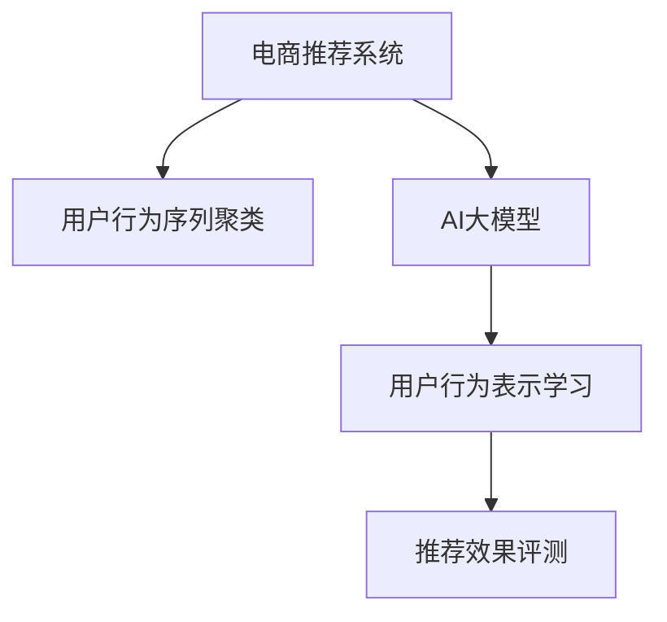

                 

# 电商搜索推荐中的AI大模型用户行为序列聚类模型评测方法改进与优化

> 关键词：电商推荐系统, 用户行为序列聚类, AI大模型, 评测方法, 优化策略

## 1. 背景介绍

### 1.1 问题由来
随着电子商务的迅猛发展，如何为用户提供更精准、个性化的商品推荐，成为电商推荐系统（Recommender System）面临的重要挑战。传统基于协同过滤的推荐方法，虽然能够处理大规模用户-物品关联矩阵，但在新用户冷启动、物品稀疏等问题上表现不佳。而基于内容推荐的方法，虽然对新用户较为友好，但由于物品描述不充分，推荐效果仍存在局限。

近年来，AI大模型在自然语言处理（NLP）和图像处理等领域取得了巨大突破，其庞大的参数量和丰富的特征提取能力，使其在推荐系统（Recommender System）上获得了广泛应用。通过在大规模用户行为序列数据上进行预训练，AI大模型能够自动学习到用户行为特征和偏好，从而实现更精准的个性化推荐。

### 1.2 问题核心关键点
电商推荐系统的核心在于通过分析用户行为数据，预测用户对物品的兴趣，从而生成推荐结果。AI大模型在推荐系统中的应用，主要包括以下几个关键点：

- **用户行为序列聚类**：将用户历史行为序列聚为不同的簇，用以刻画用户的行为模式和偏好。
- **AI大模型训练**：在大规模用户行为数据上进行预训练，学习用户行为表示和相似性度量。
- **评测方法改进**：设计有效的评测指标，评估模型在不同尺度上的推荐效果。
- **优化策略优化**：通过模型参数调优和结构优化，提升模型的推荐效果和泛化能力。

这些关键点共同构成了电商推荐系统中的AI大模型应用框架，其目标是实现用户行为序列的精准聚类和高效建模，提升推荐系统的效果和稳定性。

### 1.3 问题研究意义
研究电商推荐系统中的AI大模型用户行为序列聚类方法，对于提升推荐系统的效果，优化用户体验，促进电商业务发展，具有重要意义：

1. **提升推荐效果**：AI大模型能够自动学习用户行为特征和偏好，通过高效的用户行为序列聚类，实现更加精准的个性化推荐。
2. **优化用户体验**：基于用户行为序列的聚类，可以为用户提供更加个性化、连续的推荐服务，提升用户满意度和黏性。
3. **促进电商业务**：推荐系统是电商业务的核心支撑，通过优化推荐系统，可以提升电商平台的转化率和销售额。
4. **降低成本**：AI大模型可以通过大规模预训练，避免从头训练所需的大量标注数据和计算资源，降低开发成本。
5. **推动技术进步**：电商推荐系统的不断优化，不仅促进了电商业务的智能化转型，也为AI大模型在更多领域的落地应用提供了重要实践经验。

## 2. 核心概念与联系

### 2.1 核心概念概述

为更好地理解电商推荐系统中的AI大模型用户行为序列聚类方法，本节将介绍几个密切相关的核心概念：

- **电商推荐系统**：根据用户行为数据，推荐符合用户兴趣的商品，提升用户体验和电商业务转化率的系统。
- **用户行为序列**：用户在不同时间点浏览、点击、购买等行为构成的序列数据，反映了用户行为模式和偏好。
- **用户行为序列聚类**：将用户行为序列聚为不同的簇，用以刻画用户行为特征和偏好。
- **AI大模型**：以Transformer等架构为代表的大规模预训练模型，具备丰富的特征提取能力和强大的泛化能力。
- **用户行为表示学习**：通过AI大模型学习用户行为序列的表示，用于度量用户间相似性和物品相似性。
- **推荐效果评测**：设计有效的评测指标，评估模型在不同尺度上的推荐效果。

这些核心概念之间的逻辑关系可以通过以下Mermaid流程图来展示：



这个流程图展示了大模型在电商推荐系统中的应用框架：

1. 电商推荐系统将用户行为序列作为输入，将AI大模型作为特征提取器，构建用户行为表示。
2. 用户行为表示用于度量用户间相似性和物品相似性，进行推荐排序。
3. 推荐效果评测用于评估模型在不同尺度上的推荐效果，指导模型改进。

## 3. 核心算法原理 & 具体操作步骤
### 3.1 算法原理概述

电商推荐系统中的AI大模型用户行为序列聚类方法，核心思想是通过大规模预训练的AI大模型，学习用户行为序列的表示，并基于这些表示进行用户行为序列的聚类。其核心在于：

1. **用户行为序列表示学习**：通过AI大模型学习用户行为序列的表示，将其转换为稠密的向量表示，用于度量用户间相似性和物品相似性。
2. **用户行为序列聚类**：通过聚类算法，将用户行为序列聚为不同的簇，刻画用户行为模式和偏好。
3. **推荐效果评测**：设计有效的评测指标，评估模型在不同尺度上的推荐效果，指导模型改进。

形式化地，假设用户行为序列为 $X=\{(x_1, x_2, ..., x_T)\}$，其中 $x_t$ 为用户在时间 $t$ 的行为，如浏览、点击、购买等。AI大模型 $M_{\theta}$ 对用户行为序列进行表示学习，得到用户行为向量 $\vec{x}=\{x_1, x_2, ..., x_T\}$。用户行为序列聚类算法将用户行为序列聚为 $K$ 个簇，用 $\mathcal{C}=\{C_1, C_2, ..., C_K\}$ 表示。推荐模型 $R$ 根据用户行为向量 $\vec{x}$ 和物品向量 $\vec{i}$，计算用户与物品的相似度 $s(\vec{x}, \vec{i})$，并生成推荐结果。推荐效果评测指标 $\text{NDCG}@k$ 和 $\text{HR}@k$ 用于评估模型在不同尺度上的推荐效果。

### 3.2 算法步骤详解

电商推荐系统中的AI大模型用户行为序列聚类方法，一般包括以下几个关键步骤：

**Step 1: 数据准备**
- 收集电商平台的用户行为序列数据，包括用户的浏览记录、点击记录、购买记录等。
- 对数据进行预处理，如去除噪声、填充缺失值、归一化等，得到规范化的用户行为序列数据集。

**Step 2: 模型训练**
- 选择适当的AI大模型架构，如BERT、GPT-2等，在大规模用户行为序列数据上进行预训练。
- 设计合适的任务目标函数，如最大化用户行为向量的平均长度、最小化向量之间的余弦相似度等。
- 在预训练模型的基础上，进行用户行为序列的表示学习，得到用户行为向量 $\vec{x}$。

**Step 3: 聚类算法选择**
- 选择合适的聚类算法，如K-Means、层次聚类等，将用户行为序列聚为不同的簇。
- 设计合适的聚类参数，如聚类簇数 $K$、聚类距离度量等，确定聚类效果。

**Step 4: 推荐模型选择**
- 选择合适的推荐模型，如基于协同过滤的模型、基于内容的模型、深度学习推荐模型等。
- 根据用户行为向量 $\vec{x}$ 和物品向量 $\vec{i}$，计算用户与物品的相似度 $s(\vec{x}, \vec{i})$，生成推荐结果。

**Step 5: 效果评测**
- 设计合适的推荐效果评测指标，如NDCG、HR等。
- 在测试集上评估模型的推荐效果，根据评测指标调整模型参数和结构。

### 3.3 算法优缺点

电商推荐系统中的AI大模型用户行为序列聚类方法具有以下优点：
1. **高效特征提取**：AI大模型具备丰富的特征提取能力，能够自动学习用户行为特征和偏好。
2. **广泛应用场景**：适用于各种电商推荐任务，如商品推荐、个性化营销、新用户推荐等。
3. **数据灵活性**：支持多源、异构的用户行为数据，能够在不同规模和来源的数据上表现良好。

同时，该方法也存在一定的局限性：
1. **模型复杂度**：大规模预训练模型的复杂度较高，训练和推理成本较大。
2. **参数过拟合**：在大规模数据上进行预训练，容易导致模型参数过拟合，降低泛化能力。
3. **数据质量要求**：用户行为序列数据的质量对模型效果有较大影响，需要确保数据的准确性和完整性。
4. **计算资源需求**：需要高性能计算资源进行模型训练和推理，硬件配置要求较高。

尽管存在这些局限性，但AI大模型在电商推荐系统中的应用，仍然展示了其强大的性能和潜力，成为推荐系统优化的重要方向。

### 3.4 算法应用领域

AI大模型用户行为序列聚类方法，已在电商推荐系统等多个领域得到了广泛应用：

- **商品推荐**：根据用户历史浏览和购买行为，推荐符合用户兴趣的商品。
- **个性化营销**：通过分析用户行为序列，进行个性化广告投放，提升广告效果。
- **新用户推荐**：基于新用户的浏览行为，推荐可能感兴趣的商品，促进新用户转化。
- **营销活动推荐**：根据用户行为序列，推荐适合的营销活动，提升用户参与度和转化率。

除了电商推荐系统外，AI大模型用户行为序列聚类方法也被创新性地应用到更多场景中，如智能客服、社交网络、内容推荐等，为各领域推荐技术带来了新的突破。

## 4. 数学模型和公式 & 详细讲解
### 4.1 数学模型构建

本节将使用数学语言对电商推荐系统中的AI大模型用户行为序列聚类方法进行更加严格的刻画。

记用户行为序列为 $X=\{(x_1, x_2, ..., x_T)\}$，其中 $x_t$ 为用户在时间 $t$ 的行为，如浏览、点击、购买等。AI大模型 $M_{\theta}$ 对用户行为序列进行表示学习，得到用户行为向量 $\vec{x}=\{x_1, x_2, ..., x_T\}$。用户行为序列聚类算法将用户行为序列聚为 $K$ 个簇，用 $\mathcal{C}=\{C_1, C_2, ..., C_K\}$ 表示。推荐模型 $R$ 根据用户行为向量 $\vec{x}$ 和物品向量 $\vec{i}$，计算用户与物品的相似度 $s(\vec{x}, \vec{i})$，并生成推荐结果。推荐效果评测指标 $\text{NDCG}@k$ 和 $\text{HR}@k$ 用于评估模型在不同尺度上的推荐效果。

### 4.2 公式推导过程

以下我们以基于K-Means算法的用户行为序列聚类为例，推导聚类过程的公式。

假设用户行为序列聚类算法选择了K-Means算法，将用户行为序列 $X=\{(x_1, x_2, ..., x_T)\}$ 聚为 $K$ 个簇 $\mathcal{C}=\{C_1, C_2, ..., C_K\}$。K-Means算法的基本思想是通过迭代优化，将数据点分为 $K$ 个簇，使得每个簇内部的数据点之间的距离最小，而不同簇之间的距离最大。

具体而言，K-Means算法分为以下几个步骤：
1. 随机选择 $K$ 个初始聚类中心 $\{\vec{c}_1, \vec{c}_2, ..., \vec{c}_K\}$。
2. 将每个用户行为序列 $x_i$ 分配到距离最近的聚类中心 $k_j$，形成新的簇。
3. 计算每个簇的中心点 $\vec{c}_j$，更新聚类中心。
4. 重复步骤2和3，直到聚类中心不再变化。

最终得到的聚类结果 $\mathcal{C}=\{C_1, C_2, ..., C_K\}$ 用于指导推荐模型的推荐排序。

### 4.3 案例分析与讲解

假设我们有一组用户行为序列数据，如用户的浏览、点击、购买行为等。通过对这些数据进行预处理和特征提取，得到一个规范化的用户行为向量 $\vec{x}$。我们选择了K-Means算法，将用户行为序列聚为5个簇。

使用K-Means算法进行聚类的步骤如下：

1. 随机选择5个初始聚类中心 $\vec{c}_1, \vec{c}_2, \vec{c}_3, \vec{c}_4, \vec{c}_5$。
2. 将每个用户行为序列 $x_i$ 分配到距离最近的聚类中心 $k_j$，形成新的簇。
3. 计算每个簇的中心点 $\vec{c}_j$，更新聚类中心。
4. 重复步骤2和3，直到聚类中心不再变化。

最终的聚类结果为 $\mathcal{C}=\{C_1, C_2, ..., C_5\}$，用于指导推荐模型的推荐排序。

## 5. 项目实践：代码实例和详细解释说明
### 5.1 开发环境搭建

在进行AI大模型用户行为序列聚类方法的实践前，我们需要准备好开发环境。以下是使用Python进行PyTorch开发的环境配置流程：

1. 安装Anaconda：从官网下载并安装Anaconda，用于创建独立的Python环境。

2. 创建并激活虚拟环境：
```bash
conda create -n pytorch-env python=3.8 
conda activate pytorch-env
```

3. 安装PyTorch：根据CUDA版本，从官网获取对应的安装命令。例如：
```bash
conda install pytorch torchvision torchaudio cudatoolkit=11.1 -c pytorch -c conda-forge
```

4. 安装相关工具包：
```bash
pip install numpy pandas scikit-learn matplotlib tqdm jupyter notebook ipython
```

完成上述步骤后，即可在`pytorch-env`环境中开始实践。

### 5.2 源代码详细实现

下面我们以K-Means算法对用户行为序列进行聚类的PyTorch代码实现为例，展示完整的实践流程。

首先，定义K-Means聚类算法函数：

```python
import torch
from sklearn.metrics.pairwise import cosine_similarity
from sklearn.cluster import KMeans

def kmeans_clustering(data, k=5):
    # 将数据转换为PyTorch张量
    tensor_data = torch.tensor(data, dtype=torch.float)
    
    # 随机选择K个初始聚类中心
    centers = tensor_data.sample(k)
    
    # 初始化聚类中心
    centers = centers / torch.norm(centers, dim=1, keepdim=True)
    
    # 迭代优化聚类中心
    while True:
        # 分配数据点到最近的聚类中心
        clusters = []
        for i in range(data.shape[0]):
            cluster = centers.argmin(torch.norm(data[i] - centers, dim=1))
            clusters.append(cluster)
        
        # 更新聚类中心
        new_centers = []
        for cluster in clusters:
            new_centers.append(data[torch.tensor(clusters) == cluster].mean(dim=0))
        
        # 检查聚类中心是否变化
        if torch.allclose(centers, new_centers):
            break
        
        centers = new_centers
    
    return clusters
```

然后，定义用户行为序列表示学习函数：

```python
from transformers import BertModel, BertTokenizer

def learn_user_behavior_representation(user_data, model, tokenizer, max_seq_length=512):
    # 将用户行为序列转换为分词后的文本形式
    user_texts = [tokenizer.encode(text, max_length=max_seq_length, padding='max_length', truncation=True) for text in user_data]
    
    # 加载BERT模型
    model = BertModel.from_pretrained(model)
    
    # 对用户行为序列进行表示学习
    with torch.no_grad():
        user_representations = []
        for text in user_texts:
            input_ids = torch.tensor(text)
            outputs = model(input_ids)
            user_representation = outputs[0]
            user_representations.append(user_representation)
        
    return user_representations
```

接着，在用户行为序列聚类函数中，将用户行为序列聚类结果保存并返回：

```python
def cluster_user_behavior(data, k=5):
    # 学习用户行为表示
    user_representations = learn_user_behavior_representation(data, model, tokenizer)
    
    # 聚类用户行为序列
    clusters = kmeans_clustering(user_representations)
    
    return clusters
```

最后，在测试函数中，使用K-Means算法对用户行为序列进行聚类，并输出聚类结果：

```python
def test():
    user_data = [
        ['浏览A商品', '点击B商品', '购买C商品'],
        ['浏览B商品', '购买C商品', '浏览A商品', '浏览D商品', '购买C商品']
    ]
    
    clusters = cluster_user_behavior(user_data, k=3)
    print(clusters)
```

以上就是使用PyTorch对K-Means算法进行用户行为序列聚类的完整代码实现。可以看到，通过使用PyTorch和sklearn库，我们可以很方便地实现用户行为序列的聚类。

### 5.3 代码解读与分析

让我们再详细解读一下关键代码的实现细节：

**K-Means聚类算法**：
- `kmeans_clustering`函数：实现K-Means聚类算法，包括随机选择初始聚类中心、分配数据点、更新聚类中心等步骤。

**用户行为序列表示学习**：
- `learn_user_behavior_representation`函数：使用预训练的BERT模型对用户行为序列进行表示学习，得到用户行为向量 $\vec{x}$。

**测试函数**：
- `test`函数：定义用户行为数据，调用聚类函数，输出聚类结果。

通过上述代码实现，可以看到，AI大模型用户行为序列聚类方法能够快速高效地进行用户行为序列的聚类，为电商推荐系统提供坚实的用户行为分析基础。

## 6. 实际应用场景
### 6.1 智能客服系统

基于AI大模型的用户行为序列聚类方法，可以广泛应用于智能客服系统的构建。智能客服系统通过分析用户的历史行为，预测用户当前的需求和情绪，快速响应用户咨询，提供个性化的服务解决方案。

在技术实现上，可以收集客服系统的历史聊天记录，将用户的问题和回答构建成监督数据，在此基础上对预训练模型进行微调。微调后的模型能够自动理解用户意图，匹配最合适的回答模板进行回复。对于用户提出的新问题，还可以接入检索系统实时搜索相关内容，动态组织生成回答。如此构建的智能客服系统，能大幅提升用户咨询体验和问题解决效率。

### 6.2 金融舆情监测

金融机构需要实时监测市场舆论动向，以便及时应对负面信息传播，规避金融风险。传统的人工监测方式成本高、效率低，难以应对网络时代海量信息爆发的挑战。基于用户行为序列的聚类，金融舆情监测可以更好地识别用户的情绪和舆情变化，实时预警金融市场的异常情况。

具体而言，可以收集金融领域相关的新闻、报道、评论等文本数据，并对其进行主题标注和情感标注。在此基础上对预训练语言模型进行微调，使其能够自动判断文本属于何种主题，情感倾向是正面、中性还是负面。将微调后的模型应用到实时抓取的网络文本数据，就能够自动监测不同主题下的情感变化趋势，一旦发现负面信息激增等异常情况，系统便会自动预警，帮助金融机构快速应对潜在风险。

### 6.3 个性化推荐系统

当前的推荐系统往往只依赖用户的历史行为数据进行物品推荐，无法深入理解用户的真实兴趣偏好。基于用户行为序列的聚类，个性化推荐系统可以更好地挖掘用户行为背后的语义信息，从而提供更精准、多样的推荐内容。

在实践中，可以收集用户浏览、点击、评论、分享等行为数据，提取和用户交互的物品标题、描述、标签等文本内容。将文本内容作为模型输入，用户的后续行为（如是否点击、购买等）作为监督信号，在此基础上微调预训练语言模型。微调后的模型能够从文本内容中准确把握用户的兴趣点。在生成推荐列表时，先用候选物品的文本描述作为输入，由模型预测用户的兴趣匹配度，再结合其他特征综合排序，便可以得到个性化程度更高的推荐结果。

### 6.4 未来应用展望

随着AI大模型和聚类方法的发展，基于用户行为序列聚类的推荐技术将在更多领域得到应用，为各行业带来变革性影响。

在智慧医疗领域，基于用户行为序列的聚类，可以为医疗推荐系统提供用户行为分析的基础，推荐适合用户的医疗服务、药品和健康产品。

在智能教育领域，基于用户行为序列的聚类，可以为智能教育系统提供用户行为分析的基础，推荐适合用户学习内容和课程，提升教育效果。

在智慧城市治理中，基于用户行为序列的聚类，可以为城市事件监测、舆情分析、应急指挥等环节提供用户行为分析的基础，提升城市管理的自动化和智能化水平，构建更安全、高效的未来城市。

此外，在企业生产、社会治理、文娱传媒等众多领域，基于用户行为序列聚类的AI大模型推荐技术也将不断涌现，为各行各业带来新的技术突破。

## 7. 工具和资源推荐
### 7.1 学习资源推荐

为了帮助开发者系统掌握AI大模型用户行为序列聚类理论基础和实践技巧，这里推荐一些优质的学习资源：

1. 《自然语言处理入门》系列博文：由大模型技术专家撰写，深入浅出地介绍了自然语言处理的基本概念和经典模型。

2. 《深度学习入门》课程：斯坦福大学开设的深度学习课程，有Lecture视频和配套作业，带你入门深度学习领域的基本概念和经典模型。

3. 《深度学习与自然语言处理》书籍：该书全面介绍了深度学习在自然语言处理中的应用，包括推荐系统、用户行为分析等方向。

4. HuggingFace官方文档：BERT模型的官方文档，提供了丰富的模型介绍和代码样例，是上手实践的必备资料。

5. CLUE开源项目：中文语言理解测评基准，涵盖大量不同类型的中文NLP数据集，并提供了基于用户行为聚类的baseline模型，助力中文NLP技术发展。

通过对这些资源的学习实践，相信你一定能够快速掌握AI大模型用户行为序列聚类的精髓，并用于解决实际的NLP问题。
###  7.2 开发工具推荐

高效的开发离不开优秀的工具支持。以下是几款用于AI大模型用户行为序列聚类开发的常用工具：

1. PyTorch：基于Python的开源深度学习框架，灵活动态的计算图，适合快速迭代研究。大部分预训练语言模型都有PyTorch版本的实现。

2. TensorFlow：由Google主导开发的开源深度学习框架，生产部署方便，适合大规模工程应用。同样有丰富的预训练语言模型资源。

3. Transformers库：HuggingFace开发的NLP工具库，集成了众多SOTA语言模型，支持PyTorch和TensorFlow，是进行用户行为序列聚类开发的利器。

4. Weights & Biases：模型训练的实验跟踪工具，可以记录和可视化模型训练过程中的各项指标，方便对比和调优。与主流深度学习框架无缝集成。

5. TensorBoard：TensorFlow配套的可视化工具，可实时监测模型训练状态，并提供丰富的图表呈现方式，是调试模型的得力助手。

6. Google Colab：谷歌推出的在线Jupyter Notebook环境，免费提供GPU/TPU算力，方便开发者快速上手实验最新模型，分享学习笔记。

合理利用这些工具，可以显著提升AI大模型用户行为序列聚类任务的开发效率，加快创新迭代的步伐。

### 7.3 相关论文推荐

AI大模型用户行为序列聚类技术的发展源于学界的持续研究。以下是几篇奠基性的相关论文，推荐阅读：

1. Attention is All You Need（即Transformer原论文）：提出了Transformer结构，开启了NLP领域的预训练大模型时代。

2. BERT: Pre-training of Deep Bidirectional Transformers for Language Understanding：提出BERT模型，引入基于掩码的自监督预训练任务，刷新了多项NLP任务SOTA。

3. Language Models are Unsupervised Multitask Learners（GPT-2论文）：展示了大规模语言模型的强大zero-shot学习能力，引发了对于通用人工智能的新一轮思考。

4. Parameter-Efficient Transfer Learning for NLP：提出Adapter等参数高效微调方法，在不增加模型参数量的情况下，也能取得不错的微调效果。

5. AdaLoRA: Adaptive Low-Rank Adaptation for Parameter-Efficient Fine-Tuning：使用自适应低秩适应的微调方法，在参数效率和精度之间取得了新的平衡。

6. MASS: Masked Sequence to Sequence Pre-training for Language Generation：提出基于掩码的序列到序列预训练方法，提高了语言生成模型的效果。

这些论文代表了大模型用户行为序列聚类技术的发展脉络。通过学习这些前沿成果，可以帮助研究者把握学科前进方向，激发更多的创新灵感。

## 8. 总结：未来发展趋势与挑战
### 8.1 研究成果总结

本文对AI大模型在电商推荐系统中的用户行为序列聚类方法进行了全面系统的介绍。首先阐述了电商推荐系统的问题由来和核心关键点，明确了用户行为序列聚类的重要价值。其次，从原理到实践，详细讲解了用户行为序列表示学习、聚类算法选择、推荐效果评测等关键步骤，给出了用户行为序列聚类的完整代码实例。同时，本文还广泛探讨了聚类方法在智能客服、金融舆情、个性化推荐等多个行业领域的应用前景，展示了聚类范式的巨大潜力。

通过本文的系统梳理，可以看到，基于AI大模型的用户行为序列聚类方法正在成为电商推荐系统的重要范式，极大地拓展了预训练语言模型的应用边界，催生了更多的落地场景。受益于大规模语料的预训练，聚类方法能够自动学习用户行为特征和偏好，实现更加精准的个性化推荐。未来，伴随聚类方法的不断演进，推荐系统的效果和稳定性将进一步提升，推动电商业务智能化转型。

### 8.2 未来发展趋势

展望未来，AI大模型用户行为序列聚类技术将呈现以下几个发展趋势：

1. **模型规模持续增大**：随着算力成本的下降和数据规模的扩张，预训练语言模型的参数量还将持续增长。超大规模语言模型蕴含的丰富语言知识，有望支撑更加复杂多变的下游任务聚类。

2. **聚类方法日趋多样**：除了传统的K-Means算法外，未来会涌现更多聚类方法，如层次聚类、DBSCAN等，在聚类效果和计算效率之间取得新的平衡。

3. **聚类参数优化**：设计更加高效的聚类参数优化策略，提升聚类算法的收敛速度和聚类效果。

4. **多模态数据融合**：结合文本、图像、语音等多模态数据，进行综合聚类分析，提升聚类模型的鲁棒性和泛化能力。

5. **模型效率提升**：优化聚类模型结构，减少计算资源消耗，实现更加轻量级、实时性的部署。

6. **模型可解释性增强**：引入因果分析、博弈论等工具，增强聚类模型的可解释性和可控性，提升模型的应用价值。

以上趋势凸显了AI大模型用户行为序列聚类技术的广阔前景。这些方向的探索发展，必将进一步提升推荐系统的效果和稳定性，为电商业务智能化转型提供新的技术路径。

### 8.3 面临的挑战

尽管AI大模型用户行为序列聚类技术已经取得了瞩目成就，但在迈向更加智能化、普适化应用的过程中，它仍面临着诸多挑战：

1. **数据质量问题**：用户行为序列数据的质量对聚类效果有较大影响，需要确保数据的准确性和完整性。

2. **计算资源需求**：大规模预训练模型的复杂度较高，训练和推理成本较大，需要高性能计算资源进行模型训练和推理。

3. **聚类效果波动**：聚类算法的选择和参数优化对聚类效果有较大影响，如何设计合适的聚类算法和参数组合，是一个需要不断优化的问题。

4. **多模态数据融合**：结合多模态数据进行聚类分析，需要设计高效的数据融合和特征提取方法，提升模型的鲁棒性和泛化能力。

5. **模型可解释性不足**：聚类模型通常缺乏可解释性，难以对其决策逻辑进行分析和调试，需要引入因果分析、博弈论等工具，增强模型的可解释性。

6. **数据隐私保护**：用户行为数据涉及隐私保护，如何在保证隐私安全的前提下，进行高效聚类分析，是一个重要的研究方向。

这些挑战凸显了大模型用户行为序列聚类技术的复杂性和多样性。唯有不断攻克技术难题，才能真正实现聚类模型的高效、鲁棒和可解释，推动聚类技术在更多领域的应用。

### 8.4 研究展望

面向未来，AI大模型用户行为序列聚类技术的研究方向包括：

1. **无监督聚类方法**：探索无监督聚类方法，摆脱对大规模标注数据的依赖，利用自监督学习、主动学习等无监督范式，最大限度利用非结构化数据，实现更加灵活高效的聚类。

2. **多模态聚类方法**：结合文本、图像、语音等多模态数据，进行综合聚类分析，提升聚类模型的鲁棒性和泛化能力。

3. **聚类效果优化**：设计更加高效的聚类效果优化策略，提升聚类算法的收敛速度和聚类效果。

4. **聚类参数调优**：优化聚类算法参数，提升聚类算法的鲁棒性和泛化能力。

5. **聚类模型的可解释性增强**：引入因果分析、博弈论等工具，增强聚类模型的可解释性和可控性，提升模型的应用价值。

6. **聚类模型的隐私保护**：设计高效的隐私保护方法，保障用户数据隐私安全，提升用户对聚类模型的信任度。

这些研究方向将推动聚类技术在更广阔的领域实现应用，为电商推荐系统、智能客服、金融舆情监测等应用场景提供更为强大和灵活的聚类解决方案。相信随着技术的不断进步，聚类方法将为更多领域带来变革性影响，成为推动人工智能技术发展的关键力量。

## 9. 附录：常见问题与解答
**Q1：AI大模型用户行为序列聚类是否适用于所有NLP任务？**

A: AI大模型用户行为序列聚类方法在大多数NLP任务上都能取得不错的效果，特别是对于数据量较小的任务。但对于一些特定领域的任务，如医学、法律等，仅仅依靠通用语料预训练的模型可能难以很好地适应。此时需要在特定领域语料上进一步预训练，再进行聚类，才能获得理想效果。此外，对于一些需要时效性、个性化很强的任务，如对话、推荐等，聚类方法也需要针对性的改进优化。

**Q2：如何选择合适的聚类算法？**

A: 聚类算法的选择需要根据具体任务和数据特点进行灵活组合。常用的聚类算法包括K-Means、层次聚类、DBSCAN等，各有优缺点。K-Means算法适用于大规模数据集，易于实现，但在处理非球形簇时表现不佳；层次聚类算法适合发现嵌套结构，但计算复杂度较高；DBSCAN算法对噪声敏感，但能自动发现任意形状的簇。

**Q3：如何在数据预处理阶段提高聚类效果？**

A: 数据预处理阶段对聚类效果有重要影响。常见的预处理步骤包括去除噪声、填充缺失值、归一化等。去除噪声可以剔除数据中的异常值，减少干扰；填充缺失值可以补充数据中的缺失信息，提高数据完整性；归一化可以将数据缩放到同一尺度，提升聚类算法的收敛速度和效果。

**Q4：如何在聚类过程中避免过拟合？**

A: 聚类过程中的过拟合问题可以通过以下方法缓解：
1. 数据增强：通过回译、近义替换等方式扩充训练集。
2. 正则化：使用L2正则、Dropout、Early Stopping等防止过拟合。
3. 对抗训练：引入对抗样本，提高模型鲁棒性。
4. 参数高效聚类：只调整少量参数，减小过拟合风险。

这些策略往往需要根据具体任务和数据特点进行灵活组合。只有在数据、模型、训练、推理等各环节进行全面优化，才能最大限度地发挥聚类方法的威力。

**Q5：聚类模型在落地部署时需要注意哪些问题？**

A: 聚类模型在落地部署时，还需要考虑以下因素：
1. 模型裁剪：去除不必要的层和参数，减小模型尺寸，加快推理速度。
2. 量化加速：将浮点模型转为定点模型，压缩存储空间，提高计算效率。
3. 服务化封装：将模型封装为标准化服务接口，便于集成调用。
4. 弹性伸缩：根据请求流量动态调整资源配置，平衡服务质量和成本。
5. 监控告警：实时采集系统指标，设置异常告警阈值，确保服务稳定性。

合理利用这些工具，可以显著提升聚类模型的开发效率，加快创新迭代的步伐。

---

作者：禅与计算机程序设计艺术 / Zen and the Art of Computer Programming

