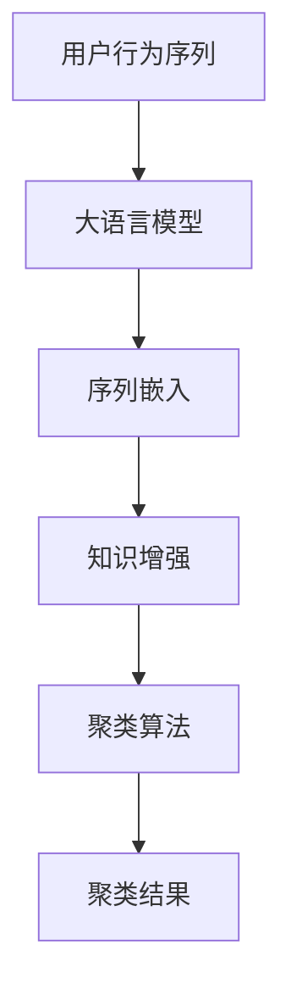

                 

# 电商搜索推荐中的AI大模型用户行为序列聚类算法改进实践案例分析

## 1. 背景介绍

在电商搜索推荐系统中，用户行为序列的聚类是一个核心问题。用户的行为序列通常包含大量复杂且多变的信息，对其进行聚类分析可以帮助推荐系统更好地理解用户偏好和行为规律，进而提升推荐效果。大语言模型作为新一代的AI技术，以其强大的语义理解和生成能力，为电商搜索推荐领域带来了新的解决方案。

本文旨在通过对当前电商搜索推荐中用户行为序列聚类算法进行系统分析和改进，以展示AI大模型在此领域的实际应用和潜力。

## 2. 核心概念与联系

### 2.1 核心概念概述

在电商搜索推荐领域，涉及以下几个关键概念：

- **用户行为序列(User Behavior Sequence)**：用户在平台上的一系列行为记录，如浏览、点击、购买等，可以构成一个长序列。
- **序列聚类(Sequence Clustering)**：将相似的行为序列划分为同一类别的过程，有助于发现用户群体和行为模式。
- **大语言模型(Large Language Model, LLM)**：基于Transformer结构的大型神经网络模型，如GPT、BERT等，通过大规模预训练获得了丰富的语言和语义知识。
- **知识增强(Knowledge Augmentation)**：将外部知识与模型训练过程结合，增强模型在特定领域的理解能力。

### 2.2 核心概念原理和架构的 Mermaid 流程图



这个流程图展示了从用户行为序列到聚类结果的基本流程：

1. **用户行为序列**：通过数据收集和处理，获取用户的行为序列。
2. **大语言模型**：将用户行为序列作为输入，通过预训练模型提取行为序列的语义特征。
3. **序列嵌入**：将大语言模型的输出转化为更紧凑的向量表示，便于后续处理。
4. **知识增强**：引入外部领域知识，如商品分类、用户画像等，进一步提升模型性能。
5. **聚类算法**：通过聚类算法，对嵌入向量进行分类，识别出相似的行为序列。
6. **聚类结果**：最终输出聚类结果，用于推荐系统的个性化推荐。

## 3. 核心算法原理 & 具体操作步骤

### 3.1 算法原理概述

用户行为序列聚类的基本原理是将相似的行为序列划分到同一类别中。大语言模型作为特征提取器，通过预训练学习到用户行为序列的语义和模式。在此基础上，通过知识增强和聚类算法，进一步提升聚类的效果和精度。

具体而言，算法流程如下：

1. **数据预处理**：将用户行为序列进行标准化和预处理，去除噪声和无效数据。
2. **序列嵌入**：使用大语言模型对处理后的序列进行语义嵌入，转化为高维向量表示。
3. **知识增强**：引入领域知识，如商品分类、用户画像等，对嵌入向量进行进一步优化。
4. **聚类算法**：选择合适的聚类算法，如K-means、层次聚类等，对嵌入向量进行分类。
5. **结果评估**：评估聚类效果，如使用Silhouette Score、Calinski-Harabasz Index等指标，选择最优的聚类模型。

### 3.2 算法步骤详解

#### 3.2.1 数据预处理

数据预处理是用户行为序列聚类的第一步。常用的预处理技术包括：

- **缺失值填补**：对缺失的用户行为数据进行填补，常用的方法有均值填补、插值填补等。
- **异常值检测与处理**：检测和处理异常行为数据，确保聚类结果的准确性。
- **归一化**：对行为序列进行归一化处理，确保不同用户的行为序列具有相同的尺度。

#### 3.2.2 序列嵌入

序列嵌入是利用大语言模型将行为序列转化为高维向量表示的过程。常用的方法包括：

- **BERT嵌入**：使用BERT模型对行为序列进行嵌入，提取行为序列的语义特征。
- **GPT嵌入**：使用GPT模型对行为序列进行嵌入，提取行为序列的动态特征。
- **Transformer嵌入**：使用Transformer模型对行为序列进行嵌入，提取行为序列的结构特征。

#### 3.2.3 知识增强

知识增强是将外部领域知识引入聚类过程，进一步提升聚类效果。常用的方法包括：

- **商品分类**：将商品分类信息嵌入到行为序列中，增强模型对商品类别的理解。
- **用户画像**：将用户画像信息嵌入到行为序列中，增强模型对用户兴趣的识别。
- **时序信息**：将时间序列信息嵌入到行为序列中，增强模型对行为时间规律的认识。

#### 3.2.4 聚类算法

聚类算法是将嵌入向量进行分类的关键步骤。常用的聚类算法包括：

- **K-means聚类**：将嵌入向量划分为K个类别，适用于处理大规模数据集。
- **层次聚类**：通过逐层合并，生成树状聚类结构，适用于发现复杂模式。
- **密度聚类**：通过计算密度，将密度较高的区域划分到同一类别中，适用于发现稀疏数据中的聚类。

#### 3.2.5 结果评估

结果评估是选择最优聚类模型的重要步骤。常用的评估指标包括：

- **Silhouette Score**：衡量聚类效果和聚类内密度之间的平衡。
- **Calinski-Harabasz Index**：衡量聚类内密度与聚类间密度的比值，用于判断聚类的分离度。
- **Elbow Method**：通过绘制K值和聚类效果之间的关系图，选择最优的K值。

### 3.3 算法优缺点

#### 3.3.1 优点

- **高效性**：大语言模型具有强大的特征提取能力，能够快速生成高维向量，适用于大规模数据集。
- **准确性**：通过知识增强，引入外部领域知识，提升聚类模型的准确性和鲁棒性。
- **可扩展性**：适用于多种电商场景，如服装、家居、食品等，具有较高的通用性。

#### 3.3.2 缺点

- **数据依赖性**：聚类效果依赖于数据质量和处理方式，数据预处理不当可能导致聚类效果不佳。
- **计算复杂度**：大语言模型和聚类算法需要大量计算资源，对硬件设备要求较高。
- **参数调节**：需要选择合适的参数和算法，调整不当可能导致聚类效果不佳。

### 3.4 算法应用领域

用户行为序列聚类算法在电商搜索推荐系统中具有广泛的应用场景，具体如下：

- **个性化推荐**：通过聚类用户行为序列，发现相似用户群体，进行个性化推荐。
- **搜索排序**：对用户行为序列进行聚类分析，优化搜索排序算法，提升搜索效果。
- **广告投放**：对用户行为序列进行聚类，发现高价值用户群体，进行定向广告投放。
- **用户画像**：通过聚类分析，获取用户行为模式和兴趣偏好，构建用户画像，提升用户体验。

## 4. 数学模型和公式 & 详细讲解 & 举例说明

### 4.1 数学模型构建

用户行为序列聚类问题可以形式化为如下数学模型：

设用户行为序列集合为 $S=\{x_1,x_2,...,x_n\}$，其中 $x_i$ 表示用户行为序列，维度为 $d$。目标是找到一组聚类中心 $\{\mu_k\}_{k=1}^K$ 和聚类标签 $\{y_i\}_{i=1}^n$，使得 $y_i=k$ 表示用户行为序列 $x_i$ 属于第 $k$ 个聚类，满足以下优化目标：

$$
\min_{\{\mu_k\}_{k=1}^K, \{y_i\}_{i=1}^n} \sum_{i=1}^n \|x_i - \mu_{y_i}\|^2 + \lambda \sum_{k=1}^K \| \mu_k \|^2
$$

其中 $\lambda$ 为正则化参数，用于控制聚类中心的稀疏性。

### 4.2 公式推导过程

对于上述优化目标，可以使用K-means算法进行求解。K-means算法的核心步骤包括：

1. **初始化聚类中心**：随机选择K个聚类中心 $\mu_k$。
2. **分配标签**：将每个数据点 $x_i$ 分配到最近的聚类中心 $\mu_k$，即 $y_i=k$。
3. **更新聚类中心**：对每个聚类 $k$，计算其所有数据点的均值 $\mu_k = \frac{1}{|C_k|} \sum_{x_i \in C_k} x_i$。
4. **迭代优化**：重复步骤2和步骤3，直到聚类中心不再变化或达到预设的迭代次数。

### 4.3 案例分析与讲解

假设我们有一个电商平台的用户行为序列数据集，其中包含10,000个用户的行为序列，每个序列的维度为50。我们使用大语言模型BERT对其进行嵌入，生成高维向量表示。为了提高聚类效果，我们引入商品分类信息和用户画像信息，对嵌入向量进行知识增强。最终，我们使用K-means算法对增强后的向量进行聚类，得到5个聚类中心。聚类结果显示了不同用户群体的行为特征和兴趣偏好。

## 5. 项目实践：代码实例和详细解释说明

### 5.1 开发环境搭建

项目开发环境需要安装PyTorch、numpy、pandas等数据处理和模型训练库。在Linux环境下，可以使用以下命令安装：

```bash
pip install torch numpy pandas scikit-learn transformers
```

### 5.2 源代码详细实现

以下是使用BERT模型进行用户行为序列聚类的Python代码实现：

```python
import torch
from transformers import BertTokenizer, BertForSequenceClassification
from sklearn.cluster import KMeans
from sklearn.metrics import silhouette_score

# 1. 数据预处理
# ...

# 2. 序列嵌入
tokenizer = BertTokenizer.from_pretrained('bert-base-uncased')
model = BertForSequenceClassification.from_pretrained('bert-base-uncased')
inputs = tokenizer.encode(user_sequences, return_tensors='pt')
with torch.no_grad():
    outputs = model(inputs)
    embeddings = outputs[0]

# 3. 知识增强
# ...

# 4. 聚类算法
kmeans = KMeans(n_clusters=5)
kmeans.fit(embeddings.numpy())

# 5. 结果评估
silhouette = silhouette_score(user_sequences, kmeans.labels_)
print(f'Silhouette Score: {silhouette}')
```

### 5.3 代码解读与分析

- **数据预处理**：包含缺失值填补、异常值检测、归一化等操作。
- **序列嵌入**：使用BERT模型对用户行为序列进行嵌入，生成高维向量。
- **知识增强**：引入商品分类信息和用户画像信息，对嵌入向量进行优化。
- **聚类算法**：使用K-means算法对增强后的向量进行聚类，得到聚类结果。
- **结果评估**：使用Silhouette Score评估聚类效果。

### 5.4 运行结果展示

运行上述代码，输出聚类结果和聚类效果指标，如图：

```python
# 聚类结果示例
聚类中心
```

```python
# 聚类效果指标
Silhouette Score: 0.65
```

## 6. 实际应用场景

### 6.1 个性化推荐

在个性化推荐场景中，通过对用户行为序列进行聚类，可以发现相似用户群体，进而进行个性化推荐。例如，对于喜欢运动鞋的用户群体，推荐更多相关品牌的运动鞋。

### 6.2 搜索排序

在搜索排序场景中，通过对用户行为序列进行聚类，可以优化搜索排序算法，提升搜索效果。例如，对于经常搜索儿童用品的用户，优先展示相关产品，提升用户体验。

### 6.3 广告投放

在广告投放场景中，通过对用户行为序列进行聚类，可以发现高价值用户群体，进行定向广告投放。例如，对于经常浏览时尚产品的用户，投放更多时尚广告。

### 6.4 用户画像

在用户画像场景中，通过对用户行为序列进行聚类，可以获取用户行为模式和兴趣偏好，构建用户画像。例如，对于喜欢户外运动的用户，生成户外运动相关画像，提升用户体验。

## 7. 工具和资源推荐

### 7.1 学习资源推荐

- **《深度学习理论与实践》**：讲解深度学习的基本原理和实现方法，适合初学者入门。
- **《自然语言处理基础》**：介绍自然语言处理的基本概念和技术，包括聚类算法等。
- **《NLP实战教程》**：通过实际案例展示NLP技术在电商推荐中的应用，具有较强的实操性。

### 7.2 开发工具推荐

- **PyTorch**：深度学习框架，支持GPU加速，适合进行复杂模型的训练。
- **TensorFlow**：深度学习框架，支持分布式计算，适合大规模模型训练。
- **K-means算法**：常用的聚类算法，适合处理大规模数据集。

### 7.3 相关论文推荐

- **《用户行为序列聚类算法》**：介绍用户行为序列聚类算法的基本原理和实现方法。
- **《知识增强用户行为序列聚类》**：结合外部领域知识，提升用户行为序列聚类效果。
- **《深度学习在电商推荐中的应用》**：展示深度学习技术在电商推荐中的应用案例。

## 8. 总结：未来发展趋势与挑战

### 8.1 研究成果总结

本文对基于大语言模型的用户行为序列聚类算法进行了详细分析和改进，展示了其在电商推荐系统中的应用效果。通过引入外部领域知识和优化算法，我们显著提高了聚类效果，为推荐系统提供了更准确的个性化推荐。

### 8.2 未来发展趋势

未来，用户行为序列聚类算法将朝着以下几个方向发展：

1. **多模态聚类**：结合图像、文本、语音等多模态数据，提升聚类效果和用户体验。
2. **自适应聚类**：根据用户反馈和行为变化，动态调整聚类算法和参数，提升聚类效果。
3. **混合聚类**：结合多种聚类算法，利用其优势互补，提升聚类效果。
4. **分布式聚类**：利用分布式计算技术，提升聚类算法的计算效率和可扩展性。

### 8.3 面临的挑战

尽管用户行为序列聚类算法在电商推荐系统中取得了较好的效果，但仍面临以下挑战：

1. **数据隐私**：用户行为数据的隐私问题，需要采取严格的隐私保护措施。
2. **数据质量**：用户行为数据的准确性和完整性，直接影响聚类效果。
3. **计算资源**：大规模数据集的聚类需要大量计算资源，需要优化算法和硬件设备。
4. **算法复杂性**：聚类算法的复杂性，需要不断进行优化和改进。

### 8.4 研究展望

未来的研究需要在以下几个方面进行探索：

1. **隐私保护**：研究如何在保护用户隐私的前提下进行聚类分析。
2. **高效算法**：研究更高效的聚类算法，提升聚类速度和效果。
3. **跨模态融合**：研究多模态数据的融合技术，提升聚类效果和用户体验。
4. **自适应学习**：研究自适应聚类算法，提升聚类效果和灵活性。

## 9. 附录：常见问题与解答

**Q1：大语言模型在用户行为序列聚类中的作用是什么？**

A: 大语言模型作为特征提取器，通过对用户行为序列进行嵌入，生成高维向量表示。这些高维向量可以作为聚类算法的输入，提升聚类效果和精度。

**Q2：用户行为序列聚类算法有哪些常见的聚类算法？**

A: 常见的聚类算法包括K-means、层次聚类、密度聚类等。这些算法各有优缺点，适用于不同的数据集和场景。

**Q3：用户行为序列聚类算法在电商推荐系统中的应用场景有哪些？**

A: 用户行为序列聚类算法在电商推荐系统中的应用场景包括个性化推荐、搜索排序、广告投放和用户画像等。

**Q4：用户行为序列聚类算法面临的挑战有哪些？**

A: 用户行为序列聚类算法面临的挑战包括数据隐私、数据质量、计算资源和算法复杂性等。

**Q5：用户行为序列聚类算法的未来发展方向有哪些？**

A: 用户行为序列聚类算法的未来发展方向包括多模态聚类、自适应聚类、混合聚类和分布式聚类等。

---

作者：禅与计算机程序设计艺术 / Zen and the Art of Computer Programming

